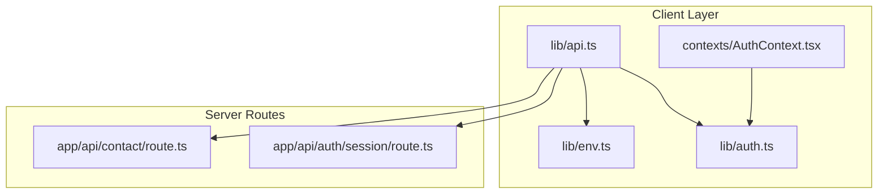
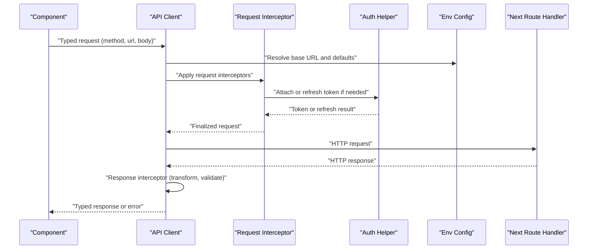
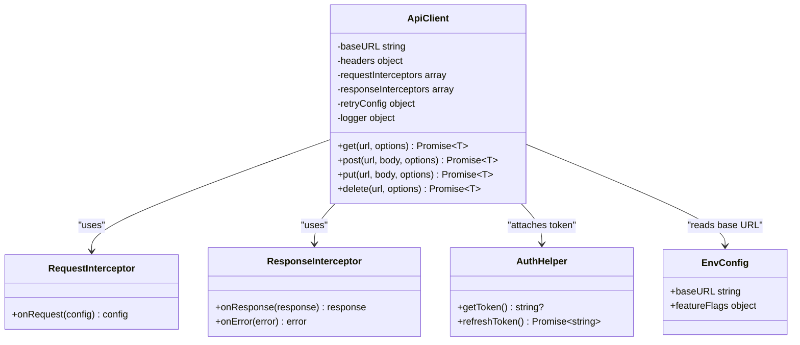
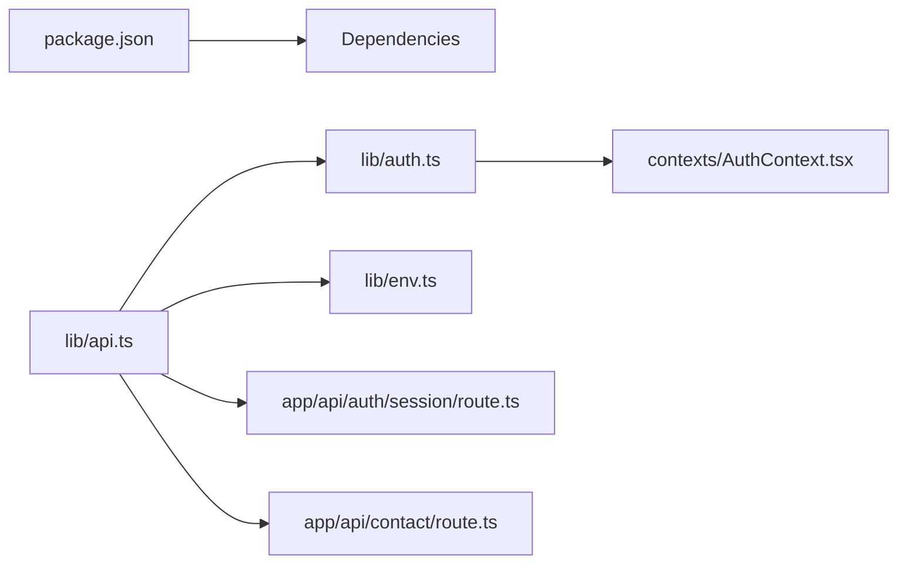

# API Client Library

<cite>
**Referenced Files in This Document**
- [api.ts](file://lib/api.ts)
- [auth.ts](file://lib/auth.ts)
- [env.ts](file://lib/env.ts)
- [route.ts](file://app/api/auth/session/route.ts)
- [route.ts](file://app/api/contact/route.ts)
- [AuthContext.tsx](file://contexts/AuthContext.tsx)
- [package.json](file://package.json)
</cite>

## Table of Contents
1. [Introduction](#introduction)
2. [Project Structure](#project-structure)
3. [Core Components](#core-components)
4. [Architecture Overview](#architecture-overview)
5. [Detailed Component Analysis](#detailed-component-analysis)
6. [Dependency Analysis](#dependency-analysis)
7. [Performance Considerations](#performance-considerations)
8. [Troubleshooting Guide](#troubleshooting-guide)
9. [Conclusion](#conclusion)
10. [Appendices](#appendices)

## Introduction
This document describes the centralized API client library used across the application. It explains how requests and responses are intercepted, how errors are handled, and how TypeScript types are enforced for type safety. It also covers configuration options, base URL management, authentication token handling, practical usage examples for common HTTP methods, retry logic, logging mechanisms, performance optimizations such as caching and response deduplication, and guidelines for extending the client with custom interceptors and middleware.

## Project Structure
The API client is implemented as a small, focused module that centralizes HTTP communication. The key files involved are:
- lib/api.ts: Centralized HTTP client implementation with interceptors, error handling, and request/response utilities
- lib/auth.ts: Authentication helpers for token retrieval and refresh flows
- lib/env.ts: Environment-based configuration (e.g., base URLs)
- app/api/auth/session/route.ts: Next.js route handler for session management
- app/api/contact/route.ts: Example API route demonstrating server-side integration
- contexts/AuthContext.tsx: React context providing authenticated state to components
- package.json: Dependencies and scripts related to networking and tooling

**Diagram sources**
- [api.ts](file://lib/api.ts)
- [auth.ts](file://lib/auth.ts)
- [env.ts](file://lib/env.ts)
- [AuthContext.tsx](file://contexts/AuthContext.tsx)
- [route.ts](file://app/api/auth/session/route.ts)
- [route.ts](file://app/api/contact/route.ts)

**Section sources**
- [api.ts](file://lib/api.ts)
- [auth.ts](file://lib/auth.ts)
- [env.ts](file://lib/env.ts)
- [AuthContext.tsx](file://contexts/AuthContext.tsx)
- [route.ts](file://app/api/auth/session/route.ts)
- [route.ts](file://app/api/contact/route.ts)

## Core Components
- Centralized HTTP client: Provides typed wrappers for GET, POST, PUT, DELETE; manages headers, base URL, and interceptors.
- Interceptors: Request and response hooks for attaching tokens, logging, retries, and transforming payloads.
- Error handling: Normalizes network and server errors into consistent shapes with actionable messages.
- Type safety: Uses TypeScript generics to infer request bodies and response types at call sites.
- Configuration: Reads environment variables for base URLs and feature flags.
- Authentication: Integrates with auth context to attach tokens and handle refresh flows.

Practical usage patterns include:
- GET: Fetch resources with typed responses
- POST: Create resources with typed request bodies
- PUT: Update resources with typed request bodies
- DELETE: Remove resources with typed identifiers

**Section sources**
- [api.ts](file://lib/api.ts)
- [auth.ts](file://lib/auth.ts)
- [env.ts](file://lib/env.ts)
- [AuthContext.tsx](file://contexts/AuthContext.tsx)

## Architecture Overview
The client architecture follows a layered approach:
- Configuration layer reads environment settings and exposes base URL and defaults
- Interceptor pipeline applies cross-cutting concerns (auth, logging, retries)
- Transport layer performs fetch calls and normalizes results
- Type system enforces contracts between request inputs and response outputs

**Diagram sources**
- [api.ts](file://lib/api.ts)
- [auth.ts](file://lib/auth.ts)
- [env.ts](file://lib/env.ts)
- [route.ts](file://app/api/auth/session/route.ts)
- [route.ts](file://app/api/contact/route.ts)

## Detailed Component Analysis

### API Client Implementation
Responsibilities:
- Expose typed methods for GET, POST, PUT, DELETE
- Manage base URL from environment configuration
- Apply request and response interceptors
- Normalize errors and provide structured error objects
- Support optional retry logic for transient failures
- Provide logging hooks for debugging and observability

Key behaviors:
- Base URL resolution: Merges configured base URL with relative endpoints
- Header management: Sets content-type, accepts, and authorization headers
- Interceptor chain: Executes before sending and after receiving
- Error normalization: Converts network errors, timeouts, and server status codes into consistent shapes
- Retry strategy: Implements exponential backoff with jitter for specific status codes

Type safety:
- Generic signatures ensure request bodies and response types are inferred
- Endpoint definitions can be strongly-typed to reduce runtime errors

**Section sources**
- [api.ts](file://lib/api.ts)

#### Class Diagram

**Diagram sources**
- [api.ts](file://lib/api.ts)
- [auth.ts](file://lib/auth.ts)
- [env.ts](file://lib/env.ts)

### Authentication Integration
Responsibilities:
- Retrieve current token from auth context or storage
- Attach token to outgoing requests via request interceptor
- Handle token expiration by triggering refresh flow
- Propagate authentication errors consistently

Integration points:
- AuthContext provides current user and token state
- Session route manages token lifecycle on the server side

**Section sources**
- [auth.ts](file://lib/auth.ts)
- [AuthContext.tsx](file://contexts/AuthContext.tsx)
- [route.ts](file://app/api/auth/session/route.ts)

### Environment Configuration
Responsibilities:
- Provide base URL for API endpoints
- Expose feature flags and default options
- Ensure consistent configuration across environments

Usage:
- Read environment variables safely
- Merge defaults with overrides when initializing the client

**Section sources**
- [env.ts](file://lib/env.ts)

### Server Route Handlers
Responsibilities:
- Implement Next.js API routes for authentication and contact submission
- Validate input and return typed JSON responses
- Integrate with backend services or databases

Examples:
- Session route handles token issuance and refresh
- Contact route processes form submissions and returns success/error states

**Section sources**
- [route.ts](file://app/api/auth/session/route.ts)
- [route.ts](file://app/api/contact/route.ts)

## Dependency Analysis
The client depends on:
- Environment configuration for base URLs and defaults
- Authentication helpers for token management
- Next.js route handlers for server-side endpoints
- Optional third-party libraries for logging and retry strategies

**Diagram sources**
- [package.json](file://package.json)
- [api.ts](file://lib/api.ts)
- [auth.ts](file://lib/auth.ts)
- [env.ts](file://lib/env.ts)
- [route.ts](file://app/api/auth/session/route.ts)
- [route.ts](file://app/api/contact/route.ts)
- [AuthContext.tsx](file://contexts/AuthContext.tsx)

**Section sources**
- [package.json](file://package.json)
- [api.ts](file://lib/api.ts)
- [auth.ts](file://lib/auth.ts)
- [env.ts](file://lib/env.ts)
- [AuthContext.tsx](file://contexts/AuthContext.tsx)
- [route.ts](file://app/api/auth/session/route.ts)
- [route.ts](file://app/api/contact/route.ts)

## Performance Considerations
Optimization techniques:
- Request caching: Cache GET responses keyed by URL and query parameters to avoid redundant network calls
- Response deduplication: Prevent multiple concurrent requests for the same resource by sharing promises
- Conditional requests: Use ETag/If-None-Match headers where supported by the server
- Compression: Enable gzip/br compression via headers and server configuration
- Connection reuse: Rely on browser’s HTTP connection pooling and keep-alive behavior
- Batch operations: Group independent requests using Promise.all for parallelism when appropriate

Implementation guidance:
- Maintain an in-memory cache with TTL and invalidation strategies
- Track active requests to deduplicate concurrent calls
- Provide APIs to clear or invalidate cache entries when mutations occur

[No sources needed since this section provides general guidance]

## Troubleshooting Guide
Common issues and resolutions:
- Network errors: Inspect error shape and status codes; implement retry for transient failures
- Token expiration: Ensure refresh flow is triggered automatically; log refresh attempts
- CORS issues: Verify allowed origins and headers on server routes
- Timeouts: Configure timeout values and handle abort signals gracefully
- Logging: Enable detailed logs during development; sanitize sensitive data

Debugging tips:
- Log request and response metadata (method, URL, status, duration)
- Capture stack traces for unhandled errors
- Use feature flags to toggle verbose logging in production

**Section sources**
- [api.ts](file://lib/api.ts)
- [auth.ts](file://lib/auth.ts)

## Conclusion
The centralized API client library provides a robust foundation for making typed HTTP requests with consistent error handling, authentication, and extensibility through interceptors. By leveraging environment configuration, caching, and deduplication, it achieves both reliability and performance. Extending the client with custom interceptors and middleware allows teams to enforce policies and add cross-cutting features without modifying core logic.

[No sources needed since this section summarizes without analyzing specific files]

## Appendices

### Practical Usage Examples
- GET request with typed response
- POST request with typed body and response
- PUT request to update a resource
- DELETE request to remove a resource

Guidelines:
- Define endpoint types to ensure type inference
- Use interceptors to attach tokens and log requests
- Handle errors uniformly across the application

[No sources needed since this section provides general guidance]

### Extending the Client
Custom interceptors:
- Add request interceptors to modify headers or payloads
- Add response interceptors to transform data or handle specific statuses
- Compose multiple interceptors for modular concerns

Middleware patterns:
- Implement retry middleware with exponential backoff
- Implement logging middleware with structured output
- Implement analytics middleware to track request metrics

[No sources needed since this section provides general guidance]