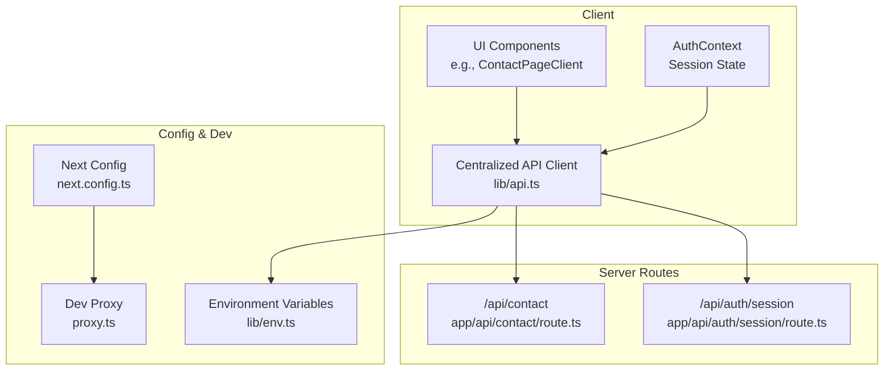
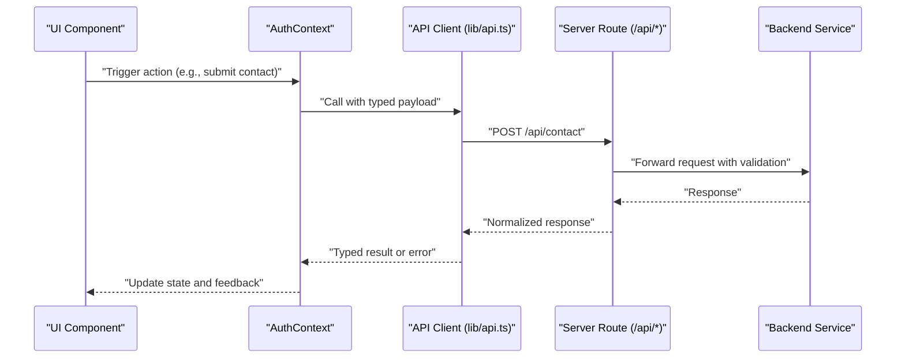
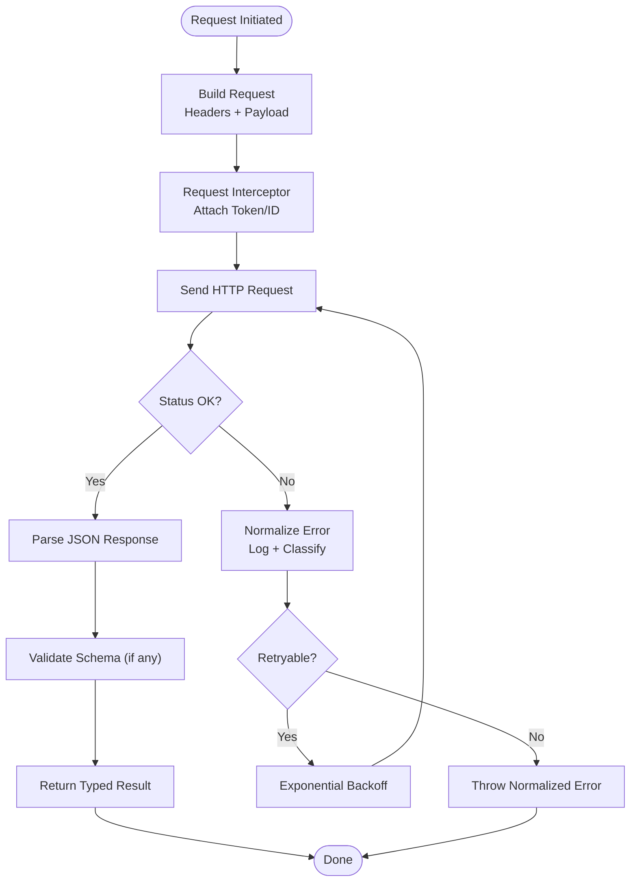
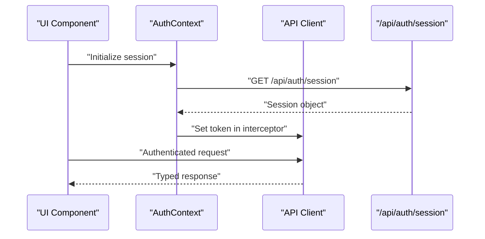
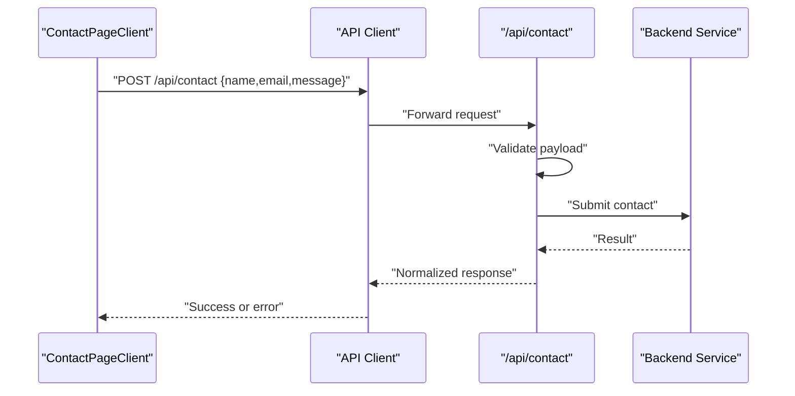
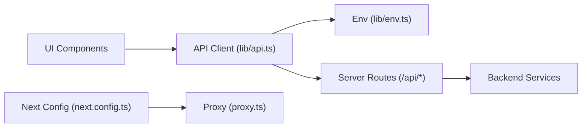

# API Integration

<cite>
**Referenced Files in This Document**
- [api.ts](file://lib/api.ts)
- [env.ts](file://lib/env.ts)
- [auth.ts](file://lib/auth.ts)
- [route.ts](file://app/api/auth/session/route.ts)
- [route.ts](file://app/api/contact/route.ts)
- [proxy.ts](file://proxy.ts)
- [next.config.ts](file://next.config.ts)
- [AuthContext.tsx](file://contexts/AuthContext.tsx)
- [ContactPageClient.tsx](file://app/[locale]/(routes)/contact/_components/ContactPageClient.tsx)
- [CRM Client Page](file://app/[locale]/(routes)/crm/_components/CrmClientPage.tsx)
</cite>

## Table of Contents
1. [Introduction](#introduction)
2. [Project Structure](#project-structure)
3. [Core Components](#core-components)
4. [Architecture Overview](#architecture-overview)
5. [Detailed Component Analysis](#detailed-component-analysis)
6. [Dependency Analysis](#dependency-analysis)
7. [Performance Considerations](#performance-considerations)
8. [Troubleshooting Guide](#troubleshooting-guide)
9. [Conclusion](#conclusion)
10. [Appendices](#appendices)

## Introduction
This document explains the server-side API integration layer and endpoints used by the application. It focuses on:
- Centralized API client architecture with error handling, request/response interceptors, and type safety
- Contact form API endpoint behavior
- Authentication session management via Next.js API routes
- Development proxy configuration for local development
- Environment variable management and secure handling of sensitive data
- Practical examples of making API calls, handling different response types, and implementing retry logic
- Error handling strategies, logging approaches, and debugging techniques

The goal is to provide a clear, practical guide for developers integrating with backend services while maintaining robustness, security, and maintainability.

## Project Structure
The API integration spans several layers:
- lib/api.ts: Centralized HTTP client with interceptors, retries, and typed responses
- app/api/*: Server-side API routes (authentication session, contact form)
- contexts/AuthContext.tsx: Session state and auth-related UI interactions
- lib/env.ts: Environment variable access patterns
- next.config.ts and proxy.ts: Development proxy configuration

**Diagram sources**
- [api.ts](file://lib/api.ts)
- [route.ts](file://app/api/auth/session/route.ts)
- [route.ts](file://app/api/contact/route.ts)
- [env.ts](file://lib/env.ts)
- [next.config.ts](file://next.config.ts)
- [proxy.ts](file://proxy.ts)
- [AuthContext.tsx](file://contexts/AuthContext.tsx)
- [ContactPageClient.tsx](file://app/[locale]/(routes)/contact/_components/ContactPageClient.tsx)

**Section sources**
- [api.ts](file://lib/api.ts)
- [env.ts](file://lib/env.ts)
- [auth.ts](file://lib/auth.ts)
- [route.ts](file://app/api/auth/session/route.ts)
- [route.ts](file://app/api/contact/route.ts)
- [proxy.ts](file://proxy.ts)
- [next.config.ts](file://next.config.ts)
- [AuthContext.tsx](file://contexts/AuthContext.tsx)
- [ContactPageClient.tsx](file://app/[locale]/(routes)/contact/_components/ContactPageClient.tsx)

## Core Components
- Centralized API client (lib/api.ts): Provides a single entry point for all HTTP requests, encapsulating base URL resolution, headers, token injection, retries, timeouts, and unified error normalization.
- Environment variables (lib/env.ts): Strongly-typed accessors for environment values, ensuring required keys are present and validated at startup or first use.
- Auth context (contexts/AuthContext.tsx): Manages session state and exposes helpers to refresh or invalidate sessions; integrates with the API client for authenticated calls.
- Server routes:
  - /api/auth/session: Reads and returns the current authentication session for the client.
  - /api/contact: Accepts contact form submissions, validates input, forwards to backend, and returns normalized results.

Key responsibilities:
- Type safety: Typed request payloads and response models to prevent runtime errors.
- Interceptors: Attach tokens, normalize headers, and transform responses consistently.
- Error handling: Map network/server errors to user-friendly messages and structured logs.
- Retry logic: Exponential backoff for transient failures with configurable limits.

**Section sources**
- [api.ts](file://lib/api.ts)
- [env.ts](file://lib/env.ts)
- [AuthContext.tsx](file://contexts/AuthContext.tsx)
- [route.ts](file://app/api/auth/session/route.ts)
- [route.ts](file://app/api/contact/route.ts)

## Architecture Overview
The API integration follows a layered approach:
- Client layer: UI components call the centralized API client.
- Server route layer: Next.js API routes act as thin proxies for sensitive operations and session management.
- Configuration layer: Environment variables and dev proxy ensure consistent base URLs across environments.

**Diagram sources**
- [api.ts](file://lib/api.ts)
- [route.ts](file://app/api/contact/route.ts)
- [AuthContext.tsx](file://contexts/AuthContext.tsx)

## Detailed Component Analysis

### Centralized API Client (lib/api.ts)
Responsibilities:
- Base URL resolution from environment variables
- Request interceptor: attach authorization headers, content-type, and correlation IDs
- Response interceptor: parse JSON, handle non-2xx statuses, and normalize error shapes
- Retry policy: exponential backoff with jitter for transient errors (network timeouts, 5xx)
- Timeouts and cancellation support
- Typed wrappers for GET/POST/PUT/DELETE with generic response types

Error handling strategy:
- Network errors: map to connection failure codes and trigger retries if applicable
- Server errors: differentiate between client errors (4xx) and server errors (5xx)
- Validation errors: propagate structured field-level errors to the caller
- Logging: include request method, path, status, duration, and sanitized payload metadata

Type safety:
- Generic request/response types enforce contract consistency
- Discriminated unions for success/error payloads
- Optional fields modeled explicitly to avoid undefined issues

Retry logic:
- Configurable max attempts and delay multiplier
- Idempotent methods (GET, HEAD, OPTIONS) retried automatically
- Non-idempotent methods retried only when safe and configured

**Diagram sources**
- [api.ts](file://lib/api.ts)

**Section sources**
- [api.ts](file://lib/api.ts)

### Environment Variables and Configuration (lib/env.ts)
Practices:
- Strict accessors that assert presence of required variables
- Default values for optional settings (e.g., feature flags)
- Secret separation: never log secrets; expose only safe descriptors
- Runtime checks during initialization to fail fast on misconfiguration

Security considerations:
- Avoid embedding secrets in client bundles
- Use server-only variables for sensitive endpoints
- Validate formats (URLs, ports, booleans) early

**Section sources**
- [env.ts](file://lib/env.ts)

### Authentication Session Management
- Server route /api/auth/session reads the current session and returns minimal user info needed by the client.
- AuthContext maintains session state, provides login/logout flows, and invalidates tokens on logout.
- The API client attaches session tokens where appropriate using request interceptors.

**Diagram sources**
- [route.ts](file://app/api/auth/session/route.ts)
- [AuthContext.tsx](file://contexts/AuthContext.tsx)
- [api.ts](file://lib/api.ts)

**Section sources**
- [route.ts](file://app/api/auth/session/route.ts)
- [AuthContext.tsx](file://contexts/AuthContext.tsx)
- [api.ts](file://lib/api.ts)

### Contact Form Endpoint (/api/contact)
Behavior:
- Accepts contact form payload
- Validates inputs (required fields, format checks)
- Forwards to backend service with sanitized data
- Returns standardized success/error responses
- Logs anonymized metrics for analytics and debugging

**Diagram sources**
- [route.ts](file://app/api/contact/route.ts)
- [ContactPageClient.tsx](file://app/[locale]/(routes)/contact/_components/ContactPageClient.tsx)
- [api.ts](file://lib/api.ts)

**Section sources**
- [route.ts](file://app/api/contact/route.ts)
- [ContactPageClient.tsx](file://app/[locale]/(routes)/contact/_components/ContactPageClient.tsx)
- [api.ts](file://lib/api.ts)

### Development Proxy Configuration
Purpose:
- Forward API calls to the backend during local development without CORS issues
- Allow seamless switching between multiple backend instances

Configuration points:
- next.config.ts: Define proxy rules mapping frontend paths to backend hosts
- proxy.ts: Optional Node-based proxy for advanced scenarios (headers rewriting, mocking)

Best practices:
- Keep proxy rules environment-specific
- Ensure HTTPS-to-HTTPS forwarding when backend requires TLS
- Log proxied requests for debugging

**Section sources**
- [next.config.ts](file://next.config.ts)
- [proxy.ts](file://proxy.ts)

### Practical Examples

#### Making an API Call
- Use the centralized client to perform a POST to /api/contact with a typed payload.
- Handle success and error branches, updating UI state accordingly.

Example reference:
- [ContactPageClient.tsx](file://app/[locale]/(routes)/contact/_components/ContactPageClient.tsx)

#### Handling Different Response Types
- Success: typed data returned directly
- Validation error: structured field errors mapped to form fields
- Network error: retry or prompt user to check connectivity
- Server error: show generic message with option to retry

Reference:
- [api.ts](file://lib/api.ts)

#### Implementing Retry Logic
- Configure retry for idempotent requests
- Apply exponential backoff with jitter
- Limit total retries and surface final error to the user

Reference:
- [api.ts](file://lib/api.ts)

## Dependency Analysis
High-level dependencies:
- UI components depend on the API client for data operations
- API client depends on environment configuration for base URLs and feature flags
- Server routes depend on environment variables and backend services
- Dev proxy depends on Next config for routing rules

**Diagram sources**
- [api.ts](file://lib/api.ts)
- [env.ts](file://lib/env.ts)
- [route.ts](file://app/api/auth/session/route.ts)
- [route.ts](file://app/api/contact/route.ts)
- [next.config.ts](file://next.config.ts)
- [proxy.ts](file://proxy.ts)

**Section sources**
- [api.ts](file://lib/api.ts)
- [env.ts](file://lib/env.ts)
- [route.ts](file://app/api/auth/session/route.ts)
- [route.ts](file://app/api/contact/route.ts)
- [next.config.ts](file://next.config.ts)
- [proxy.ts](file://proxy.ts)

## Performance Considerations
- Cache frequently accessed read-only data where possible
- Use pagination and selective field fetching to reduce payload sizes
- Prefer server-side validation to minimize round-trips
- Tune retry parameters to balance resilience and responsiveness
- Monitor latency and error rates through structured logs

[No sources needed since this section provides general guidance]

## Troubleshooting Guide
Common issues and resolutions:
- CORS errors in development: verify proxy configuration and ensure correct host/port mapping
- Missing environment variables: validate required keys at startup and provide helpful error messages
- Intermittent failures: inspect retry logs and adjust backoff parameters
- Authentication failures: confirm session retrieval and token attachment in request interceptor
- Payload validation errors: review server route validation and client-side schema alignment

Debugging techniques:
- Enable verbose logging for API calls (method, path, status, duration)
- Use correlation IDs to trace requests across client and server
- Inspect browser network tab for request/response details
- Add unit tests around API client interceptors and error paths

**Section sources**
- [api.ts](file://lib/api.ts)
- [route.ts](file://app/api/contact/route.ts)
- [route.ts](file://app/api/auth/session/route.ts)
- [next.config.ts](file://next.config.ts)
- [proxy.ts](file://proxy.ts)

## Conclusion
The API integration layer emphasizes reliability, type safety, and developer ergonomics. By centralizing HTTP concerns, enforcing strong typing, and standardizing error handling and retries, the system reduces complexity and improves maintainability. Server routes provide a secure boundary for sensitive operations, while environment and proxy configurations streamline development workflows.

[No sources needed since this section summarizes without analyzing specific files]

## Appendices

### Appendix A: API Client Usage Patterns
- Initialize client with base URL from environment
- Attach auth token via interceptor
- Perform typed requests and handle structured errors
- Implement retries for transient failures

References:
- [api.ts](file://lib/api.ts)
- [env.ts](file://lib/env.ts)

### Appendix B: Contact Form Flow
- Client constructs typed payload
- Server route validates and forwards to backend
- Normalized response returned to client
- UI updates based on success or error

References:
- [route.ts](file://app/api/contact/route.ts)
- [ContactPageClient.tsx](file://app/[locale]/(routes)/contact/_components/ContactPageClient.tsx)

### Appendix C: Session Management Flow
- Fetch session from /api/auth/session
- Store in context and attach to subsequent requests
- Invalidate on logout or token expiration

References:
- [route.ts](file://app/api/auth/session/route.ts)
- [AuthContext.tsx](file://contexts/AuthContext.tsx)
- [api.ts](file://lib/api.ts)