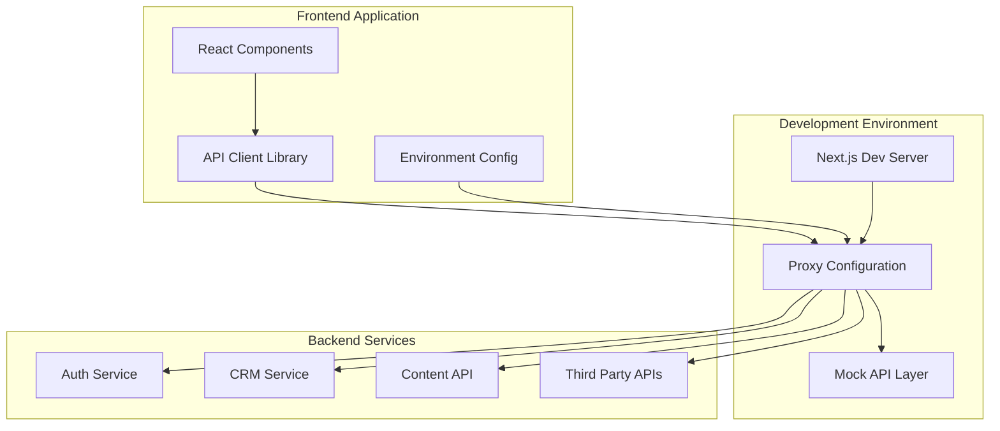
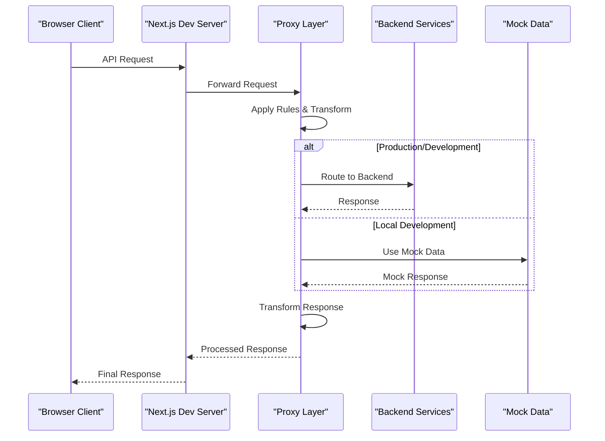
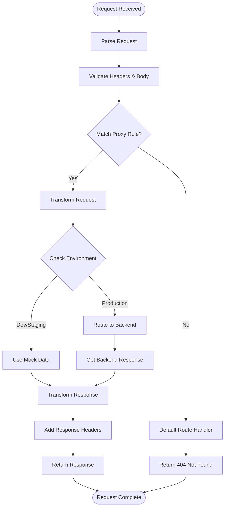
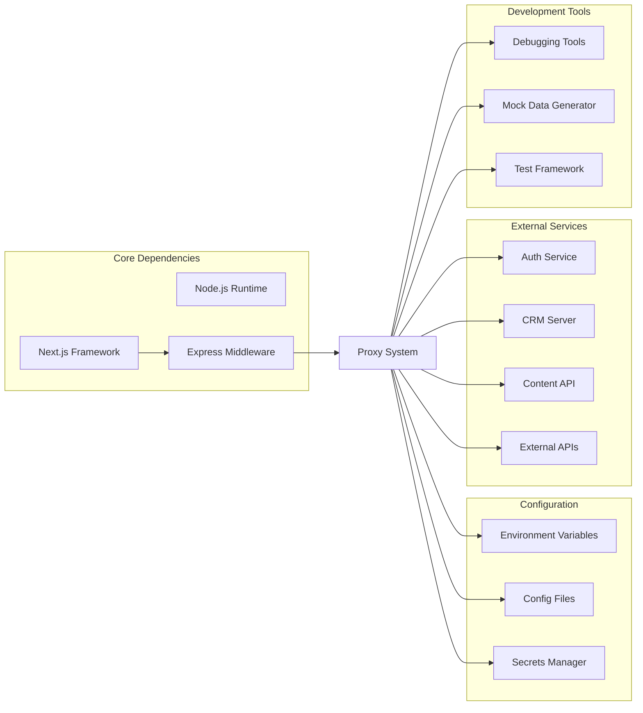

# Proxy Development Setup

<cite>
**Referenced Files in This Document**
- [proxy.ts](file://proxy.ts)
- [next.config.ts](file://next.config.ts)
- [package.json](file://package.json)
- [lib/api.ts](file://lib/api.ts)
- [lib/env.ts](file://lib/env.ts)
- [app/api/auth/session/route.ts](file://app/api/auth/session/route.ts)
- [app/api/contact/route.ts](file://app/api/contact/route.ts)
</cite>

## Table of Contents
1. [Introduction](#introduction)
2. [Project Structure](#project-structure)
3. [Core Components](#core-components)
4. [Architecture Overview](#architecture-overview)
5. [Detailed Component Analysis](#detailed-component-analysis)
6. [Dependency Analysis](#dependency-analysis)
7. [Performance Considerations](#performance-considerations)
8. [Troubleshooting Guide](#troubleshooting-guide)
9. [Conclusion](#conclusion)
10. [Appendices](#appendices)

## Introduction

This document provides comprehensive guidance for setting up proxy configurations and development environments in the Automex frontend application. The setup enables seamless local development by routing API requests to backend services, handling cross-origin requests, and providing robust debugging capabilities during development and testing phases.

The proxy configuration supports multiple development environments, API mocking strategies, and integration with third-party services while maintaining security and performance standards.

## Project Structure

The Automex frontend application follows a modern Next.js architecture with dedicated proxy configuration files and API route handlers:

**Diagram sources**
- [proxy.ts:1-50](file://proxy.ts#L1-L50)
- [next.config.ts:1-100](file://next.config.ts#L1-L100)
- [lib/api.ts:1-100](file://lib/api.ts#L1-L100)

**Section sources**
- [proxy.ts:1-50](file://proxy.ts#L1-L50)
- [next.config.ts:1-100](file://next.config.ts#L1-L100)

## Core Components

### Proxy Configuration System

The proxy system consists of several key components that work together to handle request routing, transformation, and error handling:

#### Environment-Based Configuration
The application uses environment-specific proxy settings to support different development scenarios including local development, staging, and production environments.

#### Request Routing Rules
Proxy rules define how incoming requests should be routed to appropriate backend services or mock implementations based on URL patterns, HTTP methods, and headers.

#### Response Transformation
The proxy layer can modify responses before they reach the client, enabling features like data normalization, error formatting, and response caching.

**Section sources**
- [proxy.ts:1-100](file://proxy.ts#L1-L100)
- [lib/env.ts:1-50](file://lib/env.ts#L1-L50)

### API Client Integration

The API client library provides a unified interface for making requests through the proxy layer, handling authentication, error management, and request/response transformations.

### Development Server Configuration

The Next.js development server is configured to work seamlessly with the proxy system, enabling hot reload, debugging, and development-time optimizations.

**Section sources**
- [lib/api.ts:1-150](file://lib/api.ts#L1-L150)
- [next.config.ts:1-200](file://next.config.ts#L1-L200)

## Architecture Overview

The proxy architecture follows a layered approach that separates concerns between request routing, business logic, and external service integration:

**Diagram sources**
- [proxy.ts:1-150](file://proxy.ts#L1-L150)
- [lib/api.ts:1-200](file://lib/api.ts#L1-L200)

## Detailed Component Analysis

### Proxy Configuration File Analysis

The main proxy configuration file defines routing rules, environment variables, and transformation logic:

#### Key Configuration Areas

**Environment Detection**: Automatically detects development, staging, and production environments to apply appropriate proxy settings.

**Route Definitions**: Centralized location for all API endpoint mappings and their corresponding backend services.

**Header Management**: Handles CORS headers, authentication tokens, and custom headers required by backend services.

**Error Handling**: Comprehensive error handling with fallback mechanisms and detailed logging for debugging.

#### Request Processing Pipeline

**Diagram sources**
- [proxy.ts:50-200](file://proxy.ts#L50-L200)

**Section sources**
- [proxy.ts:1-250](file://proxy.ts#L1-L250)

### API Client Library Analysis

The API client provides a type-safe interface for making requests through the proxy layer:

#### Core Features

**Type Safety**: Full TypeScript support with automatic type inference for API endpoints and responses.

**Authentication Integration**: Seamless integration with authentication flows and token management.

**Error Handling**: Consistent error handling across all API calls with user-friendly error messages.

**Caching Support**: Built-in request caching with configurable expiration policies.

#### Request Interceptors

The client implements interceptors for request modification, response transformation, and global error handling.

**Section sources**
- [lib/api.ts:1-300](file://lib/api.ts#L1-L300)

### Environment Configuration

Environment-specific settings are managed through a centralized configuration system:

#### Configuration Structure

**Base Configuration**: Common settings shared across all environments.

**Development Overrides**: Development-specific settings including debug modes and mock data.

**Production Security**: Production-specific security settings and optimization flags.

**Feature Flags**: Runtime feature toggles for gradual rollouts and A/B testing.

**Section sources**
- [lib/env.ts:1-100](file://lib/env.ts#L1-L100)

### API Route Handlers

The application includes API route handlers for internal functionality and proxy endpoints:

#### Authentication Routes

Handles session management, user authentication, and authorization checks through the proxy layer.

#### Contact Form Routes

Processes contact form submissions with validation, spam protection, and email notifications.

**Section sources**
- [app/api/auth/session/route.ts:1-100](file://app/api/auth/session/route.ts#L1-L100)
- [app/api/contact/route.ts:1-100](file://app/api/contact/route.ts#L1-L100)

## Dependency Analysis

The proxy system has well-defined dependencies and relationships between components:

**Diagram sources**
- [package.json:1-100](file://package.json#L1-L100)
- [next.config.ts:1-150](file://next.config.ts#L1-L150)

**Section sources**
- [package.json:1-200](file://package.json#L1-L200)
- [next.config.ts:1-200](file://next.config.ts#L1-L200)

## Performance Considerations

### Optimization Strategies

**Connection Pooling**: Efficient connection management to backend services reduces latency and resource usage.

**Response Caching**: Intelligent caching strategies minimize redundant API calls and improve response times.

**Compression**: Automatic compression of large responses reduces bandwidth usage and improves load times.

**Load Balancing**: Distribution of requests across multiple backend instances for high availability.

### Monitoring and Metrics

**Request Tracking**: Comprehensive logging of request patterns, response times, and error rates.

**Performance Profiling**: Built-in profiling tools for identifying bottlenecks and optimization opportunities.

**Health Checks**: Automated health monitoring of backend services and dependency availability.

## Troubleshooting Guide

### Common Proxy Issues

#### Connection Problems
- **Symptoms**: Timeouts, connection refused errors, or intermittent failures
- **Diagnosis**: Check network connectivity, firewall settings, and backend service status
- **Resolution**: Verify proxy configuration, update connection timeouts, and implement retry logic

#### Authentication Failures
- **Symptoms**: 401 Unauthorized errors, expired tokens, or permission denied messages
- **Diagnosis**: Validate token format, check expiration times, and verify user permissions
- **Resolution**: Implement token refresh logic, update authentication headers, and review access controls

#### CORS Errors
- **Symptoms**: Cross-origin request blocked errors in browser console
- **Diagnosis**: Check CORS configuration on both proxy and backend services
- **Resolution**: Update allowed origins, methods, and headers in proxy configuration

#### Performance Issues
- **Symptoms**: Slow response times, high memory usage, or CPU spikes
- **Diagnosis**: Monitor resource utilization, analyze request patterns, and identify bottlenecks
- **Resolution**: Optimize query performance, implement caching, and scale resources as needed

### Debugging Techniques

#### Logging and Monitoring
Enable detailed logging at different levels (debug, info, warn, error) to track request flow and identify issues.

#### Network Inspection
Use browser developer tools and network monitoring to inspect request/response cycles and identify problems.

#### Proxy Testing
Implement automated tests for proxy routes and endpoints to catch configuration issues early.

#### Performance Profiling
Utilize built-in profiling tools and external monitoring solutions to analyze performance characteristics.

**Section sources**
- [proxy.ts:200-400](file://proxy.ts#L200-L400)
- [lib/api.ts:200-400](file://lib/api.ts#L200-L400)

## Conclusion

The proxy configuration system provides a robust foundation for developing and deploying the Automex frontend application. By implementing proper proxy rules, environment management, and debugging capabilities, developers can efficiently work with backend services while maintaining code quality and performance standards.

The modular architecture allows for easy extension and customization, supporting various development workflows and deployment scenarios. Regular monitoring and maintenance ensure optimal performance and reliability in production environments.

## Appendices

### Environment Variables Reference

Common environment variables used in proxy configuration include backend service URLs, authentication settings, and feature flags.

### Development Workflow Examples

Step-by-step guides for common development tasks such as adding new API endpoints, configuring mock data, and testing proxy routes.

### Deployment Checklist

Pre-deployment verification steps to ensure proxy configuration is correct and all dependencies are properly configured.