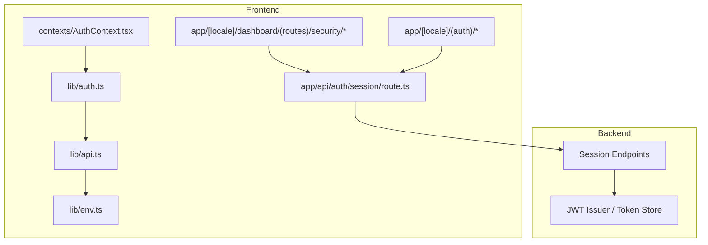
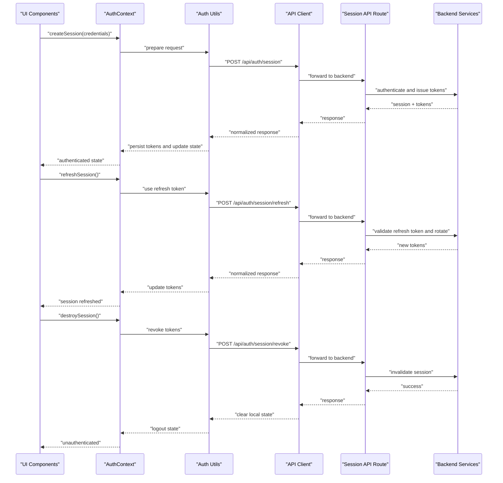
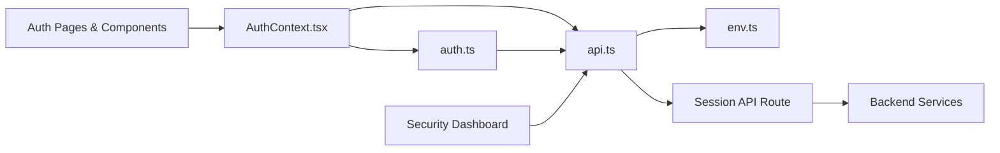
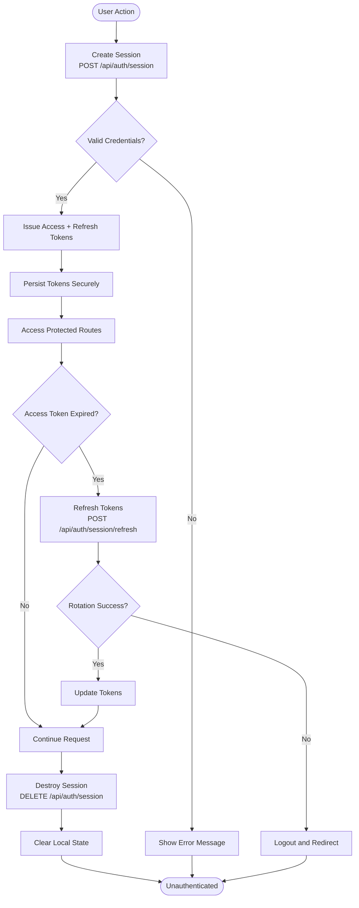

# Authentication Session API

<cite>
**Referenced Files in This Document**
- [route.ts](file://app/api/auth/session/route.ts)
- [AuthContext.tsx](file://contexts/AuthContext.tsx)
- [auth.ts](file://lib/auth.ts)
- [api.ts](file://lib/api.ts)
- [env.ts](file://lib/env.ts)
- [ActiveSessionsCard.tsx](file://app/[locale]/dashboard/(routes)/security/_components/ActiveSessionsCard.tsx)
- [ChangePasswordForm.tsx](file://app/[locale]/dashboard/(routes)/security/_components/ChangePasswordForm.tsx)
- [DangerZoneCard.tsx](file://app/[locale]/dashboard/(routes)/security/_components/DangerZoneCard.tsx)
- [SecurityOverviewCard.tsx](file://app/[locale]/dashboard/(routes)/security/_components/SecurityOverviewCard.tsx)
- [page.tsx](file://app/[locale]/dashboard/(routes)/security/page.tsx)
- [layout.tsx](file://app/[locale]/(auth)/layout.tsx)
- [sign-in/page.tsx](file://app/[locale]/(auth)/sign-in/page.tsx)
- [sign-up/page.tsx](file://app/[locale]/(auth)/sign-up/page.tsx)
- [forgot-password/page.tsx](file://app/[locale]/(auth)/forgot-password/page.tsx)
- [AuthFormField.tsx](file://app/[locale]/(auth)/_components/AuthFormField.tsx)
- [GoogleButton.tsx](file://app/[locale]/(auth)/_components/GoogleButton.tsx)
</cite>

## Table of Contents
1. [Introduction](#introduction)
2. [Project Structure](#project-structure)
3. [Core Components](#core-components)
4. [Architecture Overview](#architecture-overview)
5. [Detailed Component Analysis](#detailed-component-analysis)
6. [Dependency Analysis](#dependency-analysis)
7. [Performance Considerations](#performance-considerations)
8. [Troubleshooting Guide](#troubleshooting-guide)
9. [Conclusion](#conclusion)
10. [Appendices](#appendices)

## Introduction
This document explains the authentication session management API exposed by the Next.js frontend and how it integrates with the backend to manage user sessions. It covers:
- Session creation, validation, and destruction flows
- JWT token handling (generation, storage, refresh)
- Session lifecycle and expiration behavior
- Concurrent session support
- Security considerations (token signing, secure headers, CSRF protection)
- Frontend integration patterns and error handling

The implementation is a client-side orchestration layer that calls backend endpoints for session operations and manages UI state accordingly.

## Project Structure
Key files involved in session management:
- API route entry point for session operations
- Context provider for global auth state
- Utilities for environment configuration and HTTP requests
- Dashboard security pages and components for session visibility and actions
- Auth pages and shared form components used during sign-in/sign-up flows

**Diagram sources**
- [route.ts](file://app/api/auth/session/route.ts)
- [AuthContext.tsx](file://contexts/AuthContext.tsx)
- [auth.ts](file://lib/auth.ts)
- [api.ts](file://lib/api.ts)
- [env.ts](file://lib/env.ts)
- [ActiveSessionsCard.tsx](file://app/[locale]/dashboard/(routes)/security/_components/ActiveSessionsCard.tsx)
- [ChangePasswordForm.tsx](file://app/[locale]/dashboard/(routes)/security/_components/ChangePasswordForm.tsx)
- [DangerZoneCard.tsx](file://app/[locale]/dashboard/(routes)/security/_components/DangerZoneCard.tsx)
- [SecurityOverviewCard.tsx](file://app/[locale]/dashboard/(routes)/security/_components/SecurityOverviewCard.tsx)
- [page.tsx](file://app/[locale]/dashboard/(routes)/security/page.tsx)
- [layout.tsx](file://app/[locale]/(auth)/layout.tsx)
- [sign-in/page.tsx](file://app/[locale]/(auth)/sign-in/page.tsx)
- [sign-up/page.tsx](file://app/[locale]/(auth)/sign-up/page.tsx)
- [forgot-password/page.tsx](file://app/[locale]/(auth)/forgot-password/page.tsx)
- [AuthFormField.tsx](file://app/[locale]/(auth)/_components/AuthFormField.tsx)
- [GoogleButton.tsx](file://app/[locale]/(auth)/_components/GoogleButton.tsx)

**Section sources**
- [route.ts](file://app/api/auth/session/route.ts)
- [AuthContext.tsx](file://contexts/AuthContext.tsx)
- [auth.ts](file://lib/auth.ts)
- [api.ts](file://lib/api.ts)
- [env.ts](file://lib/env.ts)
- [ActiveSessionsCard.tsx](file://app/[locale]/dashboard/(routes)/security/_components/ActiveSessionsCard.tsx)
- [ChangePasswordForm.tsx](file://app/[locale]/dashboard/(routes)/security/_components/ChangePasswordForm.tsx)
- [DangerZoneCard.tsx](file://app/[locale]/dashboard/(routes)/security/_components/DangerZoneCard.tsx)
- [SecurityOverviewCard.tsx](file://app/[locale]/dashboard/(routes)/security/_components/SecurityOverviewCard.tsx)
- [page.tsx](file://app/[locale]/dashboard/(routes)/security/page.tsx)
- [layout.tsx](file://app/[locale]/(auth)/layout.tsx)
- [sign-in/page.tsx](file://app/[locale]/(auth)/sign-in/page.tsx)
- [sign-up/page.tsx](file://app/[locale]/(auth)/sign-up/page.tsx)
- [forgot-password/page.tsx](file://app/[locale]/(auth)/forgot-password/page.tsx)
- [AuthFormField.tsx](file://app/[locale]/(auth)/_components/AuthFormField.tsx)
- [GoogleButton.tsx](file://app/[locale]/(auth)/_components/GoogleButton.tsx)

## Core Components
- Session API Route: Provides endpoints for creating, validating, refreshing, and destroying sessions. It forwards requests to backend services and returns standardized responses consumed by the frontend.
- Auth Context: Holds current session state, exposes methods to create, refresh, and destroy sessions, and updates UI accordingly.
- Auth Utilities: Encapsulates token handling logic, including reading/writing tokens, decoding payloads, and computing expiration.
- API Client: Centralized HTTP client with base URL, headers, and error normalization.
- Environment Config: Loads runtime variables such as backend URLs and feature flags.
- Security Dashboard Components: Display active sessions, allow termination, and expose password change flows.

**Section sources**
- [route.ts](file://app/api/auth/session/route.ts)
- [AuthContext.tsx](file://contexts/AuthContext.tsx)
- [auth.ts](file://lib/auth.ts)
- [api.ts](file://lib/api.ts)
- [env.ts](file://lib/env.ts)
- [ActiveSessionsCard.tsx](file://app/[locale]/dashboard/(routes)/security/_components/ActiveSessionsCard.tsx)
- [ChangePasswordForm.tsx](file://app/[locale]/dashboard/(routes)/security/_components/ChangePasswordForm.tsx)
- [DangerZoneCard.tsx](file://app/[locale]/dashboard/(routes)/security/_components/DangerZoneCard.tsx)
- [SecurityOverviewCard.tsx](file://app/[locale]/dashboard/(routes)/security/_components/SecurityOverviewCard.tsx)
- [page.tsx](file://app/[locale]/dashboard/(routes)/security/page.tsx)

## Architecture Overview
High-level flow of session operations between frontend and backend:

**Diagram sources**
- [route.ts](file://app/api/auth/session/route.ts)
- [AuthContext.tsx](file://contexts/AuthContext.tsx)
- [auth.ts](file://lib/auth.ts)
- [api.ts](file://lib/api.ts)

## Detailed Component Analysis

### Session API Route
Responsibilities:
- Expose endpoints for session lifecycle: create, validate, refresh, revoke.
- Forward requests to backend services and normalize responses.
- Handle errors and map them to consistent shapes for the frontend.

Typical endpoints:
- POST /api/auth/session — Create session (login or magic link verification).
- POST /api/auth/session/refresh — Refresh access token using refresh token.
- DELETE /api/auth/session — Destroy session (logout).
- GET /api/auth/session — Validate current session and return minimal user info.

Error mapping:
- Network failures, timeouts, and server errors are normalized into structured messages.
- Unauthorized responses trigger automatic logout and redirect where appropriate.

**Section sources**
- [route.ts](file://app/api/auth/session/route.ts)

### Auth Context
Responsibilities:
- Maintain global authenticated state.
- Provide functions to create, refresh, and destroy sessions.
- Persist tokens securely and update UI on state changes.
- Coordinate redirects after successful login/logout.

State shape:
- User profile data
- Access token
- Refresh token
- Loading and error states

Methods:
- createSession(credentials): Initiates login, persists tokens, sets user state.
- refreshSession(): Rotates tokens when needed.
- destroySession(): Revokes tokens and clears state.
- getSession(): Returns current session status for guards and protected routes.

Integration points:
- Uses auth utilities for token handling.
- Calls API client for network requests.
- Updates routing via Next.js navigation after success/failure.

**Section sources**
- [AuthContext.tsx](file://contexts/AuthContext.tsx)

### Auth Utilities
Responsibilities:
- Encode/decode JWT payloads safely.
- Compute token expiration and remaining time.
- Manage token persistence strategy (e.g., httpOnly cookies vs memory).
- Build request headers with authorization tokens.

Key behaviors:
- If tokens are stored in httpOnly cookies, utilities avoid direct access and rely on backend validation.
- If tokens are stored client-side, utilities implement secure storage and rotation.

**Section sources**
- [auth.ts](file://lib/auth.ts)

### API Client
Responsibilities:
- Centralize HTTP calls with base URL from environment config.
- Attach authorization headers automatically.
- Normalize error responses and handle retries where applicable.

Features:
- Interceptors for adding tokens and handling 401/403 responses.
- Consistent error objects with codes and messages.

**Section sources**
- [api.ts](file://lib/api.ts)

### Environment Configuration
Responsibilities:
- Load backend URLs, feature flags, and security settings.
- Ensure required variables are present at runtime.

Usage:
- Base URL for session endpoints.
- Flags for enabling/disabling certain flows (e.g., magic link).

**Section sources**
- [env.ts](file://lib/env.ts)

### Security Dashboard Components
Components:
- Active Sessions Card: Lists active sessions and allows revocation per device/browser.
- Change Password Form: Triggers password update and invalidates existing sessions if configured.
- Danger Zone Card: Provides destructive actions like deleting account or revoking all sessions.
- Security Overview Card: Summarizes security posture and recent activity.

Interactions:
- Call session API route to list, revoke, or invalidate sessions.
- Update context state upon successful actions.

**Section sources**
- [ActiveSessionsCard.tsx](file://app/[locale]/dashboard/(routes)/security/_components/ActiveSessionsCard.tsx)
- [ChangePasswordForm.tsx](file://app/[locale]/dashboard/(routes)/security/_components/ChangePasswordForm.tsx)
- [DangerZoneCard.tsx](file://app/[locale]/dashboard/(routes)/security/_components/DangerZoneCard.tsx)
- [SecurityOverviewCard.tsx](file://app/[locale]/dashboard/(routes)/security/_components/SecurityOverviewCard.tsx)
- [page.tsx](file://app/[locale]/dashboard/(routes)/security/page.tsx)

### Auth Pages and Forms
Pages:
- Sign In: Collects credentials and triggers session creation.
- Sign Up: Registers new users and creates initial session.
- Forgot Password: Initiates password reset flow; may use magic link or email-based reset.

Shared Components:
- Auth Form Field: Reusable input with validation and error display.
- Google Button: Starts OAuth flow and delegates session creation to backend.

Flow:
- On success, context updates and navigates to dashboard or intended route.
- On failure, displays localized error messages and keeps user on the same page.

**Section sources**
- [layout.tsx](file://app/[locale]/(auth)/layout.tsx)
- [sign-in/page.tsx](file://app/[locale]/(auth)/sign-in/page.tsx)
- [sign-up/page.tsx](file://app/[locale]/(auth)/sign-up/page.tsx)
- [forgot-password/page.tsx](file://app/[locale]/(auth)/forgot-password/page.tsx)
- [AuthFormField.tsx](file://app/[locale]/(auth)/_components/AuthFormField.tsx)
- [GoogleButton.tsx](file://app/[locale]/(auth)/_components/GoogleButton.tsx)

## Dependency Analysis
Relationships among core modules:

**Diagram sources**
- [AuthContext.tsx](file://contexts/AuthContext.tsx)
- [auth.ts](file://lib/auth.ts)
- [api.ts](file://lib/api.ts)
- [env.ts](file://lib/env.ts)
- [route.ts](file://app/api/auth/session/route.ts)

**Section sources**
- [AuthContext.tsx](file://contexts/AuthContext.tsx)
- [auth.ts](file://lib/auth.ts)
- [api.ts](file://lib/api.ts)
- [env.ts](file://lib/env.ts)
- [route.ts](file://app/api/auth/session/route.ts)

## Performance Considerations
- Minimize token reads/writes: Cache decoded claims in memory during a session.
- Debounce refresh attempts: Avoid multiple concurrent refresh calls by coalescing requests.
- Use httpOnly cookies when possible: Reduces XSS risk and avoids frequent client-side token manipulation.
- Short-lived access tokens with refresh rotation: Improves security without excessive re-authentication.
- Batch session listing: For active sessions, prefer paginated or filtered queries to reduce payload size.

[No sources needed since this section provides general guidance]

## Troubleshooting Guide
Common issues and resolutions:
- 401 Unauthorized: Indicates expired or invalid tokens. Trigger refresh flow; if refresh fails, force logout and redirect to sign-in.
- Network errors: Retry once with exponential backoff for transient failures; surface user-friendly messages.
- CORS issues: Verify allowed origins and methods in backend configuration.
- CSRF vulnerabilities: Ensure stateful endpoints require anti-CSRF tokens or use SameSite cookie policies.
- Session not persisting: Check cookie attributes (Secure, SameSite, Domain) and storage permissions.

Operational checks:
- Confirm environment variables are set correctly for backend URLs.
- Validate that session API route proxies requests properly and preserves headers.
- Inspect browser dev tools for cookie presence and header values.

**Section sources**
- [api.ts](file://lib/api.ts)
- [env.ts](file://lib/env.ts)
- [route.ts](file://app/api/auth/session/route.ts)

## Conclusion
The authentication session management API in this project provides a clear separation of concerns:
- The API route acts as a thin proxy to backend services.
- The Auth Context centralizes session state and orchestrates lifecycle operations.
- Utilities and API client standardize token handling and HTTP interactions.
- Security dashboard components enable users to inspect and control their sessions.

Adhering to best practices—short-lived tokens, secure storage, robust error handling, and CSRF protections—ensures a resilient and secure session experience across devices and browsers.

[No sources needed since this section summarizes without analyzing specific files]

## Appendices

### Session Lifecycle Flowchart

**Diagram sources**
- [route.ts](file://app/api/auth/session/route.ts)
- [AuthContext.tsx](file://contexts/AuthContext.tsx)
- [auth.ts](file://lib/auth.ts)
- [api.ts](file://lib/api.ts)