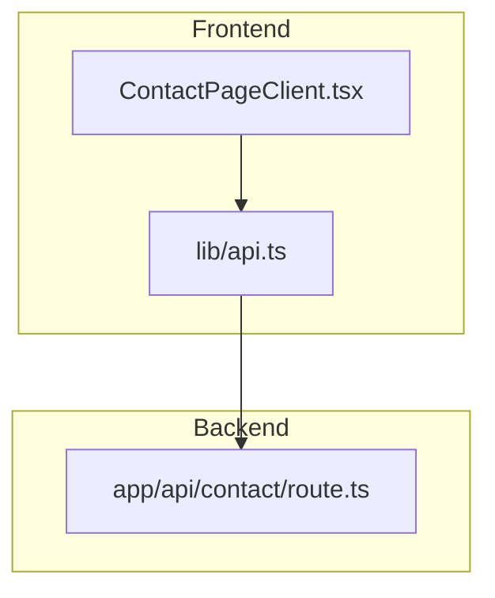
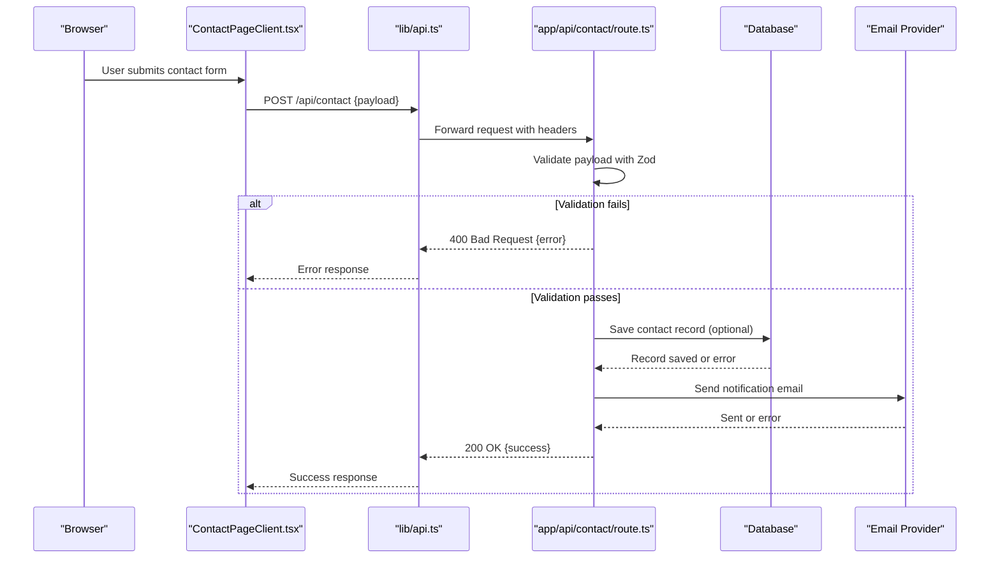
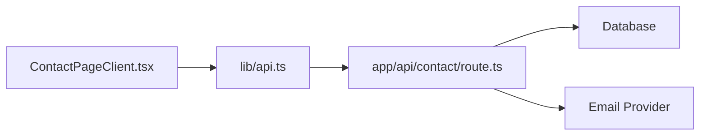

# Contact Form API

<cite>
**Referenced Files in This Document**
- [route.ts](file://app/api/contact/route.ts)
- [ContactPageClient.tsx](file://app/[locale]/contact/_components/ContactPageClient.tsx)
- [api.ts](file://lib/api.ts)
</cite>

## Table of Contents
1. [Introduction](#introduction)
2. [Project Structure](#project-structure)
3. [Core Components](#core-components)
4. [Architecture Overview](#architecture-overview)
5. [Detailed Component Analysis](#detailed-component-analysis)
6. [Dependency Analysis](#dependency-analysis)
7. [Performance Considerations](#performance-considerations)
8. [Troubleshooting Guide](#troubleshooting-guide)
9. [Conclusion](#conclusion)
10. [Appendices](#appendices)

## Introduction
This document describes the Contact Form API endpoint used by the contact page to submit user messages. It explains request validation, data processing, email notification integration, supported HTTP methods, request and response schemas, error handling, security measures (spam prevention, input sanitization, rate limiting), client-side integration examples, and testing approaches.

## Project Structure
The contact form submission is implemented as a Next.js App Router API route under app/api/contact/route.ts. The frontend contact page component calls this endpoint using a shared API utility.

**Diagram sources**
- [ContactPageClient.tsx](file://app/[locale]/contact/_components/ContactPageClient.tsx)
- [api.ts](file://lib/api.ts)
- [route.ts](file://app/api/contact/route.ts)

**Section sources**
- [route.ts](file://app/api/contact/route.ts)
- [ContactPageClient.tsx](file://app/[locale]/contact/_components/ContactPageClient.tsx)
- [api.ts](file://lib/api.ts)

## Core Components
- API Route: Handles POST requests for contact submissions, validates inputs, persists data if applicable, sends email notifications, and returns standardized responses.
- Frontend Client: Renders the contact form, performs client-side validation, and posts data to the API route via the shared API helper.
- Shared API Utility: Centralizes fetch calls, headers, and base URL configuration for API interactions.

Key responsibilities:
- Validate incoming payloads against a Zod schema.
- Sanitize and normalize fields before processing.
- Persist records to the database (if implemented).
- Send email notifications through an email provider.
- Return consistent success/error responses with appropriate HTTP status codes.

**Section sources**
- [route.ts](file://app/api/contact/route.ts)
- [ContactPageClient.tsx](file://app/[locale]/contact/_components/ContactPageClient.tsx)
- [api.ts](file://lib/api.ts)

## Architecture Overview
High-level flow from client to backend services:

**Diagram sources**
- [ContactPageClient.tsx](file://app/[locale]/contact/_components/ContactPageClient.tsx)
- [api.ts](file://lib/api.ts)
- [route.ts](file://app/api/contact/route.ts)

## Detailed Component Analysis

### API Endpoint: POST /api/contact
- Supported Methods:
  - POST: Submit a new contact message.
  - Other methods are rejected with appropriate status codes.

- Request Body Schema (Zod):
  - name: string, required, min length, max length, trimmed.
  - email: string, required, valid email format.
  - subject: string, optional, default empty, max length.
  - message: string, required, min length, max length.
  - honeypot: string, optional, hidden field for spam detection; must be empty on valid submissions.
  - timestamp: string, optional, ISO timestamp for server-side verification.

- Input Processing Pipeline:
  - Parse JSON body safely.
  - Validate against Zod schema; return 400 with structured errors on failure.
  - Normalize and sanitize fields (trim whitespace, escape HTML, enforce lengths).
  - Enforce rate limiting per IP or email (e.g., windowed counter).
  - Persist to database if configured; handle transactional errors.
  - Compose and send email notification; handle provider errors.
  - Return standardized responses.

- Response Formats:
  - Success (200):
    - { success: true, message: "Your message has been sent." }
  - Validation Error (400):
    - { success: false, error: "Validation failed", details: [{ field, message }] }
  - Rate Limited (429):
    - { success: false, error: "Too many requests. Please try again later." }
  - Server Error (500):
    - { success: false, error: "Internal server error" }

- Error Handling:
  - Validation failures: 400 with detailed field errors.
  - Database operations: 500 with generic error; log specifics securely.
  - Email delivery issues: 500 with generic error; log provider-specific diagnostics.
  - Unexpected parse errors: 400 with malformed JSON message.

- Security Measures:
  - Spam Prevention:
    - Honeypot field check.
    - Optional CAPTCHA verification (if enabled).
    - Timestamp freshness check to prevent replay attacks.
  - Input Sanitization:
    - Trim strings, enforce allowed characters where applicable.
    - Escape HTML in free-text fields before storage or rendering.
  - Rate Limiting:
    - Per-IP and per-email limits within a time window.
    - Configurable thresholds and cooldown periods.
  - CORS and Headers:
    - Restrict origins to trusted domains.
    - Set Content-Type to application/json.

- Example Request:
  - Method: POST
  - Path: /api/contact
  - Headers:
    - Content-Type: application/json
  - Body:
    - {
        "name": "Jane Doe",
        "email": "jane@example.com",
        "subject": "Service Inquiry",
        "message": "I would like to learn more about your services.",
        "honeypot": "",
        "timestamp": "2025-01-01T12:00:00Z"
      }

- Example Responses:
  - Success:
    - Status: 200
    - Body: { "success": true, "message": "Your message has been sent." }
  - Validation Error:
    - Status: 400
    - Body: { "success": false, "error": "Validation failed", "details": [...] }
  - Rate Limited:
    - Status: 429
    - Body: { "success": false, "error": "Too many requests. Please try again later." }
  - Server Error:
    - Status: 500
    - Body: { "success": false, "error": "Internal server error" }

**Section sources**
- [route.ts](file://app/api/contact/route.ts)

### Frontend Integration: ContactPageClient.tsx
- Responsibilities:
  - Render form fields bound to state.
  - Perform client-side validation mirroring server schema.
  - Call API via lib/api.ts with proper headers and payload.
  - Handle loading, success, and error states.
  - Display user-friendly feedback and reset form on success.

- Typical Flow:
  - On submit, validate fields locally.
  - Disable submit button and show spinner.
  - POST to /api/contact.
  - Update UI based on response.
  - Show toast/alerts for errors.

- Example Usage Pattern:
  - Import API helper.
  - Build payload object matching schema.
  - Await response and branch on success flag.
  - Manage local state for UI feedback.

**Section sources**
- [ContactPageClient.tsx](file://app/[locale]/contact/_components/ContactPageClient.tsx)
- [api.ts](file://lib/api.ts)

### Shared API Utility: lib/api.ts
- Responsibilities:
  - Provide a centralized function to call /api/contact.
  - Attach standard headers (Content-Type, Accept).
  - Handle network errors and non-JSON responses.
  - Normalize response structure for consistent consumption.

- Behavior:
  - Construct URL using environment variables.
  - Wrap fetch with try/catch.
  - Return typed result with success/error shape.

**Section sources**
- [api.ts](file://lib/api.ts)

## Dependency Analysis
The contact form submission depends on:
- Frontend components for UI and state management.
- API utility for HTTP communication.
- Backend route for validation, persistence, and email dispatch.

**Diagram sources**
- [ContactPageClient.tsx](file://app/[locale]/contact/_components/ContactPageClient.tsx)
- [api.ts](file://lib/api.ts)
- [route.ts](file://app/api/contact/route.ts)

**Section sources**
- [ContactPageClient.tsx](file://app/[locale]/contact/_components/ContactPageClient.tsx)
- [api.ts](file://lib/api.ts)
- [route.ts](file://app/api/contact/route.ts)

## Performance Considerations
- Minimize payload size by excluding unnecessary fields.
- Use compression and efficient JSON serialization.
- Implement server-side caching for static assets only; avoid caching dynamic responses.
- Batch logging and use async queues for email sending to reduce latency.
- Apply rate limiting to protect resources and improve stability.

[No sources needed since this section provides general guidance]

## Troubleshooting Guide
Common issues and resolutions:
- Validation Failures:
  - Symptom: 400 with field-specific errors.
  - Action: Ensure all required fields are present and meet constraints; trim whitespace; verify email format.
- Network Errors:
  - Symptom: Fetch exceptions or timeouts.
  - Action: Check connectivity, CORS settings, and server availability.
- Database Errors:
  - Symptom: 500 with internal server error.
  - Action: Review logs for connection issues; verify schema migrations; retry with backoff.
- Email Delivery Issues:
  - Symptom: 500 with internal server error.
  - Action: Verify provider credentials and quotas; inspect provider logs; implement retries and fallbacks.
- Rate Limiting:
  - Symptom: 429 Too Many Requests.
  - Action: Reduce submission frequency; implement exponential backoff on client; adjust thresholds if necessary.

**Section sources**
- [route.ts](file://app/api/contact/route.ts)

## Conclusion
The Contact Form API provides a secure, validated, and robust pathway for users to submit inquiries. With comprehensive input validation, sanitization, rate limiting, and clear error responses, it ensures reliability and safety. The frontend integrates cleanly via a shared API utility, enabling consistent behavior and maintainable code.

[No sources needed since this section summarizes without analyzing specific files]

## Appendices

### Client-Side Integration Examples
- Basic Submission:
  - Collect form values into an object matching the schema.
  - Call the API helper with POST /api/contact.
  - Handle success and error branches to update UI.
- Loading States:
  - Disable submit button while awaiting response.
  - Show spinner or progress indicator.
- Error Feedback:
  - Display field-level errors when available.
  - Show generic error messages for network/server issues.

**Section sources**
- [ContactPageClient.tsx](file://app/[locale]/contact/_components/ContactPageClient.tsx)
- [api.ts](file://lib/api.ts)

### Testing Approaches
- Unit Tests:
  - Validate Zod schema with positive and negative cases.
  - Test sanitization and normalization logic.
- Integration Tests:
  - Mock database and email provider to assert side effects.
  - Simulate rate limiting scenarios and verify 429 responses.
- End-to-End Tests:
  - Submit forms via browser automation.
  - Assert UI feedback and network calls.
- Load Testing:
  - Generate concurrent submissions to evaluate rate limiting and performance.

**Section sources**
- [route.ts](file://app/api/contact/route.ts)