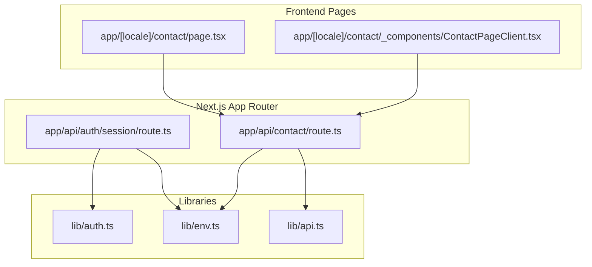
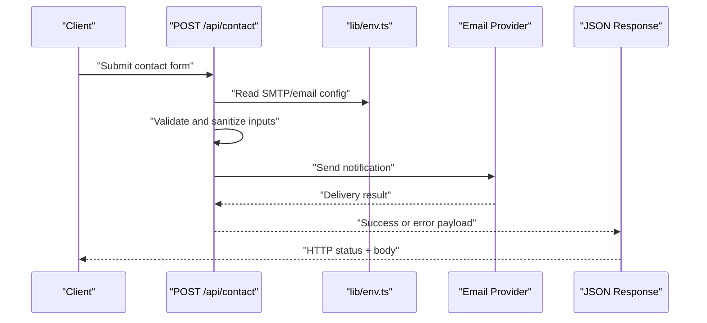
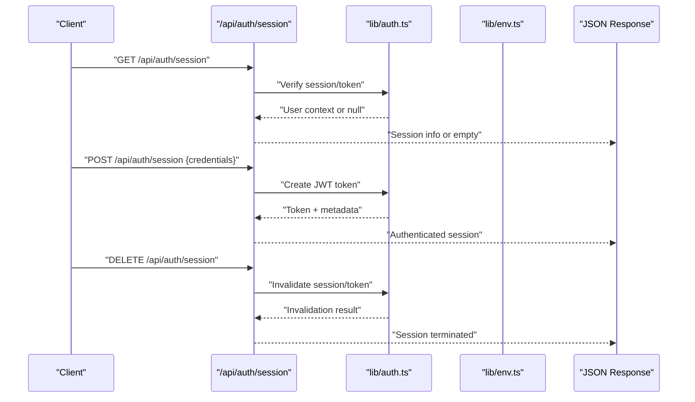
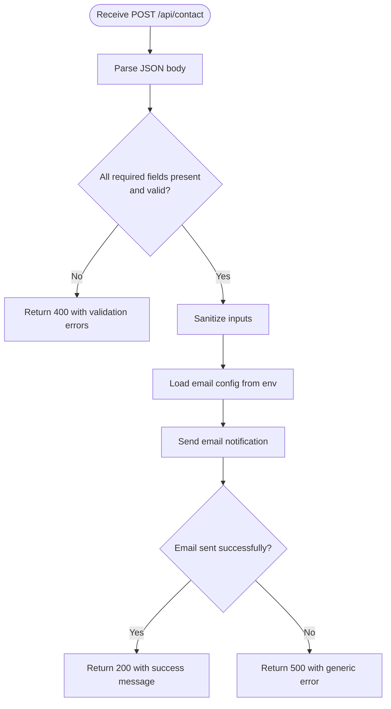
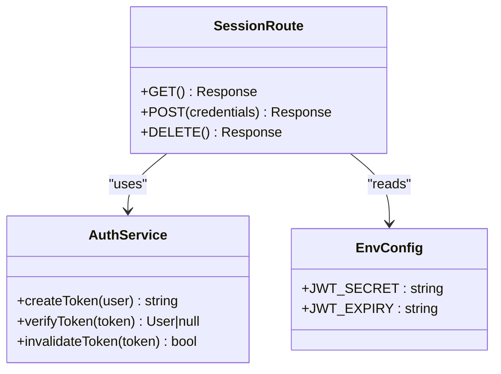
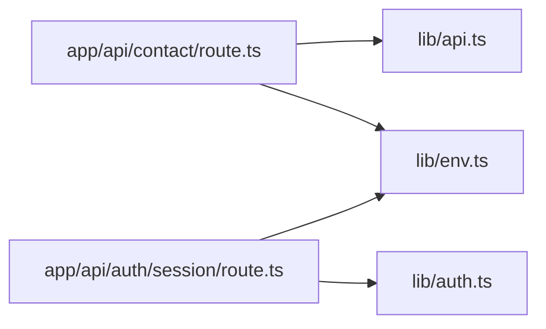

# Server API Routes

<cite>
**Referenced Files in This Document**
- [app/api/contact/route.ts](file://app/api/contact/route.ts)
- [app/api/auth/session/route.ts](file://app/api/auth/session/route.ts)
- [lib/auth.ts](file://lib/auth.ts)
- [lib/env.ts](file://lib/env.ts)
- [lib/api.ts](file://lib/api.ts)
- [app/[locale]/contact/page.tsx](file://app/[locale]/contact/page.tsx)
- [app/[locale]/contact/_components/ContactPageClient.tsx](file://app/[locale]/contact/_components/ContactPageClient.tsx)
</cite>

## Table of Contents
1. [Introduction](#introduction)
2. [Project Structure](#project-structure)
3. [Core Components](#core-components)
4. [Architecture Overview](#architecture-overview)
5. [Detailed Component Analysis](#detailed-component-analysis)
6. [Dependency Analysis](#dependency-analysis)
7. [Performance Considerations](#performance-considerations)
8. [Security Considerations](#security-considerations)
9. [Troubleshooting Guide](#troubleshooting-guide)
10. [Conclusion](#conclusion)
11. [Appendices](#appendices)

## Introduction
This document explains the server-side API routes implemented with Next.js App Router, focusing on:
- Contact form endpoint: request validation, data processing, and email notification integration
- Authentication session management route: JWT token handling and user session lifecycle
- Request/response patterns for GET, POST, PUT, DELETE handlers
- Security considerations including input sanitization, rate limiting, and CORS configuration
- Error handling, status codes, and response formatting standards
- Guidance for implementing new API endpoints following established patterns

## Project Structure
The project uses Next.js App Router with file-based routing under app/api. The relevant API routes are:
- app/api/contact/route.ts: Handles contact form submissions (POST)
- app/api/auth/session/route.ts: Manages authentication sessions (GET, POST, DELETE)

**Diagram sources**
- [app/api/contact/route.ts](file://app/api/contact/route.ts)
- [app/api/auth/session/route.ts](file://app/api/auth/session/route.ts)
- [lib/auth.ts](file://lib/auth.ts)
- [lib/env.ts](file://lib/env.ts)
- [lib/api.ts](file://lib/api.ts)
- [app/[locale]/contact/page.tsx](file://app/[locale]/contact/page.tsx)
- [app/[locale]/contact/_components/ContactPageClient.tsx](file://app/[locale]/contact/_components/ContactPageClient.tsx)

**Section sources**
- [app/api/contact/route.ts](file://app/api/contact/route.ts)
- [app/api/auth/session/route.ts](file://app/api/auth/session/route.ts)
- [lib/auth.ts](file://lib/auth.ts)
- [lib/env.ts](file://lib/env.ts)
- [lib/api.ts](file://lib/api.ts)
- [app/[locale]/contact/page.tsx](file://app/[locale]/contact/page.tsx)
- [app/[locale]/contact/_components/ContactPageClient.tsx](file://app/[locale]/contact/_components/ContactPageClient.tsx)

## Core Components
- Contact Form Endpoint (POST /api/contact): Validates incoming form fields, processes data, and sends an email notification via a configured provider. Returns standardized success or error responses.
- Auth Session Endpoint (/api/auth/session): Supports GET to read current session, POST to create a session using JWT, and DELETE to terminate a session. Uses lib/auth.ts for token operations and lib/env.ts for environment variables.

Key responsibilities:
- Input validation and sanitization before processing
- Secure token creation and verification
- Consistent JSON response structure and HTTP status codes
- Centralized error handling and logging

**Section sources**
- [app/api/contact/route.ts](file://app/api/contact/route.ts)
- [app/api/auth/session/route.ts](file://app/api/auth/session/route.ts)
- [lib/auth.ts](file://lib/auth.ts)
- [lib/env.ts](file://lib/env.ts)

## Architecture Overview
The API layer follows Next.js App Router conventions where each route is defined by a route.ts file exporting HTTP method handlers. The contact endpoint integrates with an email service, while the auth session endpoint manages JWT tokens and session state.

**Diagram sources**
- [app/api/contact/route.ts](file://app/api/contact/route.ts)
- [lib/env.ts](file://lib/env.ts)

**Diagram sources**
- [app/api/auth/session/route.ts](file://app/api/auth/session/route.ts)
- [lib/auth.ts](file://lib/auth.ts)
- [lib/env.ts](file://lib/env.ts)

## Detailed Component Analysis

### Contact Form Endpoint (POST /api/contact)
Responsibilities:
- Accepts form data from client pages
- Validates required fields and formats
- Sanitizes text inputs to prevent injection
- Sends email notifications using environment-configured settings
- Returns consistent JSON responses with appropriate HTTP status codes

Request/Response Patterns:
- Method: POST
- Content-Type: application/json
- Request Body: structured object containing name, email, subject/message fields
- Success Response: 200 OK with acknowledgment message
- Error Response: 400 Bad Request for validation errors; 500 Internal Server Error for server issues

Validation and Sanitization:
- Enforce non-empty required fields
- Validate email format
- Trim whitespace and escape HTML entities
- Limit field lengths to prevent abuse

Email Integration:
- Reads SMTP or provider credentials from environment variables
- Composes a message with sanitized content
- Handles delivery failures gracefully and returns meaningful errors

Error Handling:
- Validation errors return 400 with descriptive messages
- Network/provider errors return 500 with safe error messages
- Logs detailed errors server-side without exposing internals to clients

**Diagram sources**
- [app/api/contact/route.ts](file://app/api/contact/route.ts)
- [lib/env.ts](file://lib/env.ts)

**Section sources**
- [app/api/contact/route.ts](file://app/api/contact/route.ts)
- [lib/env.ts](file://lib/env.ts)

### Authentication Session Management (/api/auth/session)
Responsibilities:
- GET: Retrieve current authenticated session if available
- POST: Create a session using provided credentials and issue a JWT
- DELETE: Terminate the current session and invalidate the token

JWT Token Handling:
- Tokens are created with secure secrets from environment variables
- Tokens include minimal claims (e.g., user identifier)
- Expiration times are set appropriately
- Tokens are stored securely (e.g., httpOnly cookies) when applicable

Session Lifecycle:
- Creation: On successful login, a token is issued and returned
- Verification: On subsequent requests, the token is validated to establish identity
- Termination: On logout, the token is invalidated and cleared

Request/Response Patterns:
- GET /api/auth/session: Returns current session data or empty state
- POST /api/auth/session: Accepts credentials, returns token and session metadata
- DELETE /api/auth/session: Clears session and returns confirmation

Error Handling:
- Invalid credentials return 401 Unauthorized
- Missing or malformed requests return 400 Bad Request
- Server errors return 500 Internal Server Error

**Diagram sources**
- [app/api/auth/session/route.ts](file://app/api/auth/session/route.ts)
- [lib/auth.ts](file://lib/auth.ts)
- [lib/env.ts](file://lib/env.ts)

**Section sources**
- [app/api/auth/session/route.ts](file://app/api/auth/session/route.ts)
- [lib/auth.ts](file://lib/auth.ts)
- [lib/env.ts](file://lib/env.ts)

### Frontend Integration Examples
The contact page components call the contact API endpoint to submit forms. Typical flow:
- Client collects form data
- Sends POST request to /api/contact
- Displays success or error feedback based on response

Example paths:
- [app/[locale]/contact/page.tsx](file://app/[locale]/contact/page.tsx)
- [app/[locale]/contact/_components/ContactPageClient.tsx](file://app/[locale]/contact/_components/ContactPageClient.tsx)

**Section sources**
- [app/[locale]/contact/page.tsx](file://app/[locale]/contact/page.tsx)
- [app/[locale]/contact/_components/ContactPageClient.tsx](file://app/[locale]/contact/_components/ContactPageClient.tsx)

## Dependency Analysis
API routes depend on shared libraries for environment configuration and authentication utilities. The contact route depends on environment variables for email configuration and may use helper utilities for common tasks.

**Diagram sources**
- [app/api/contact/route.ts](file://app/api/contact/route.ts)
- [app/api/auth/session/route.ts](file://app/api/auth/session/route.ts)
- [lib/auth.ts](file://lib/auth.ts)
- [lib/env.ts](file://lib/env.ts)
- [lib/api.ts](file://lib/api.ts)

**Section sources**
- [app/api/contact/route.ts](file://app/api/contact/route.ts)
- [app/api/auth/session/route.ts](file://app/api/auth/session/route.ts)
- [lib/auth.ts](file://lib/auth.ts)
- [lib/env.ts](file://lib/env.ts)
- [lib/api.ts](file://lib/api.ts)

## Performance Considerations
- Keep request payloads small and validate early to reduce processing overhead
- Use streaming or background jobs for heavy operations like sending emails
- Cache static configuration values loaded from environment variables where appropriate
- Avoid unnecessary database calls within hot paths; batch operations when possible
- Monitor response times and add timeouts for external integrations

[No sources needed since this section provides general guidance]

## Security Considerations
Input Sanitization:
- Escape HTML entities and strip dangerous characters from user inputs
- Enforce strict schemas for all request bodies
- Reject unexpected fields to prevent parameter pollution

Rate Limiting:
- Apply per-IP and per-user rate limits on sensitive endpoints (e.g., login, password reset)
- Use middleware or edge-compatible rate limiters to protect against abuse

CORS Configuration:
- Restrict allowed origins to trusted domains
- Allow only necessary methods and headers
- Disable credentials unless explicitly required

Authentication and Authorization:
- Store JWT secrets securely in environment variables
- Set appropriate token expiration and refresh strategies
- Use httpOnly cookies for tokens when storing client-side

Data Protection:
- Never log sensitive information such as passwords or tokens
- Encrypt sensitive data at rest and in transit
- Validate and sanitize all inputs on both client and server sides

[No sources needed since this section provides general guidance]

## Troubleshooting Guide
Common Issues:
- Validation Errors: Ensure all required fields are present and correctly formatted
- Email Delivery Failures: Check environment variables for SMTP credentials and network connectivity
- Authentication Failures: Verify JWT secret configuration and token expiration settings
- CORS Errors: Confirm allowed origins and methods match client requests

Debugging Tips:
- Log request payloads and responses (without sensitive data)
- Inspect HTTP status codes and error messages
- Use browser developer tools to inspect network requests
- Review server logs for stack traces and contextual information

**Section sources**
- [app/api/contact/route.ts](file://app/api/contact/route.ts)
- [app/api/auth/session/route.ts](file://app/api/auth/session/route.ts)

## Conclusion
The server-side API routes follow Next.js App Router conventions with clear separation of concerns between contact form handling and authentication session management. By adhering to consistent request/response patterns, robust validation, secure token handling, and comprehensive error handling, the implementation provides a solid foundation for extending the API surface with additional endpoints.

[No sources needed since this section summarizes without analyzing specific files]

## Appendices

### Implementing New API Endpoints
Follow these steps to add a new endpoint:
1. Create a new route.ts file under app/api/<feature>/route.ts
2. Export HTTP method handlers (GET, POST, PUT, DELETE) as needed
3. Validate and sanitize all inputs using a schema library
4. Use lib/env.ts for configuration and lib/auth.ts for authentication utilities
5. Return standardized JSON responses with appropriate HTTP status codes
6. Handle errors consistently and log details server-side
7. Add rate limiting and CORS restrictions as required

Example structure:
- File path: app/api/<feature>/route.ts
- Methods: export async function GET(request), POST(request), etc.
- Response pattern: return new Response(JSON.stringify(data), { status, headers })

**Section sources**
- [app/api/contact/route.ts](file://app/api/contact/route.ts)
- [app/api/auth/session/route.ts](file://app/api/auth/session/route.ts)