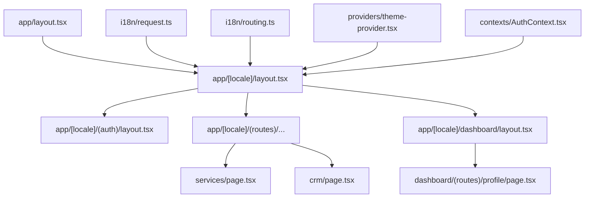
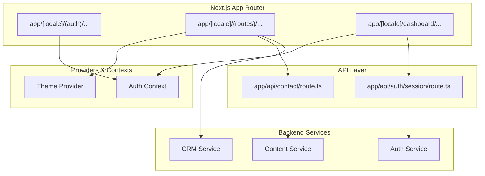
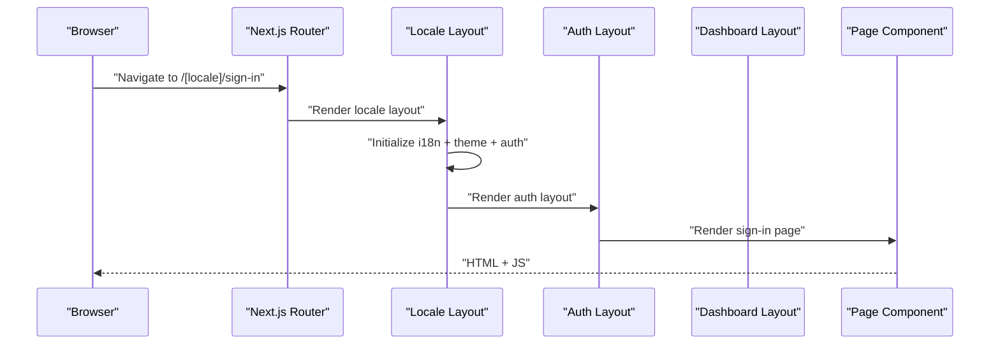
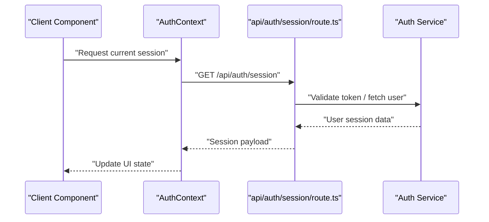
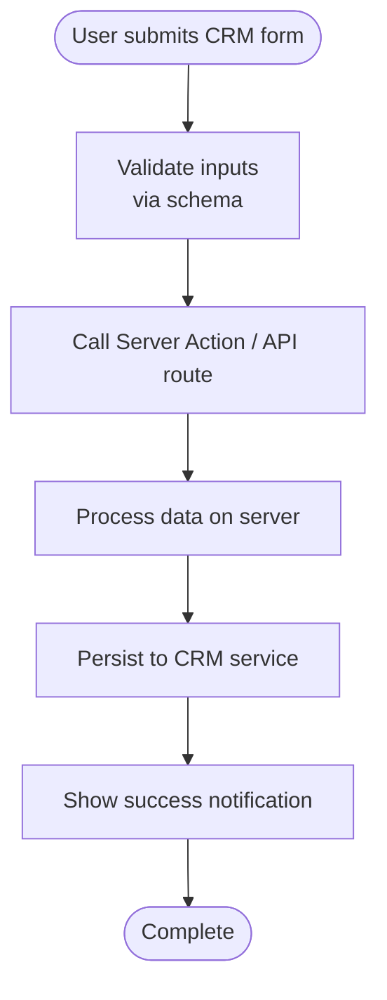
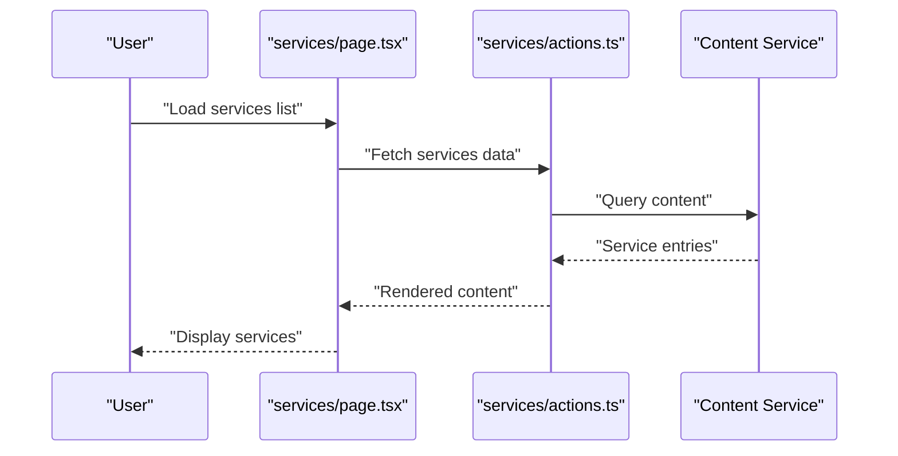
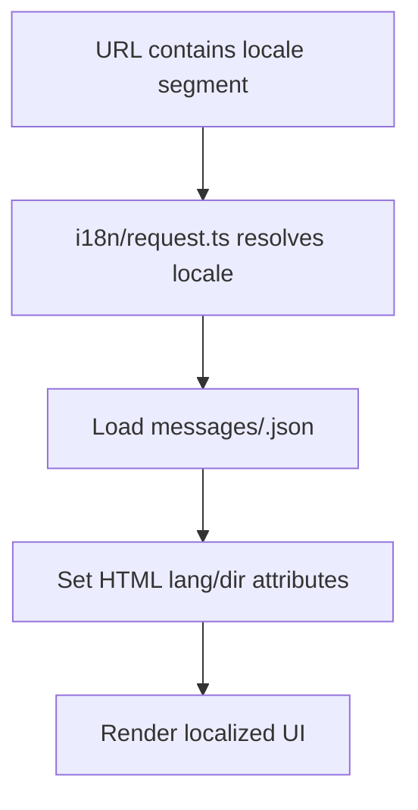
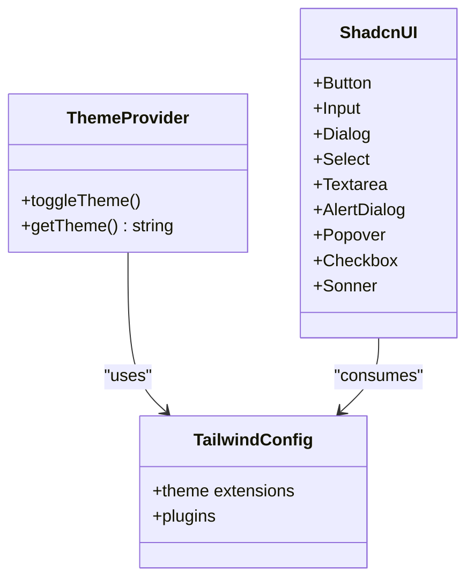
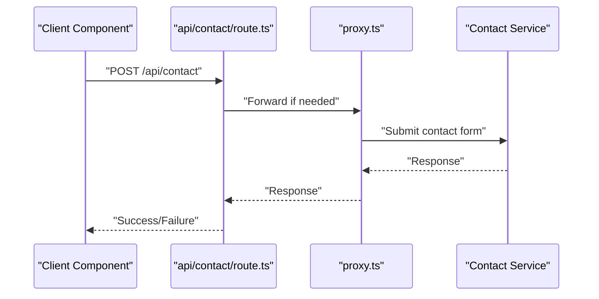
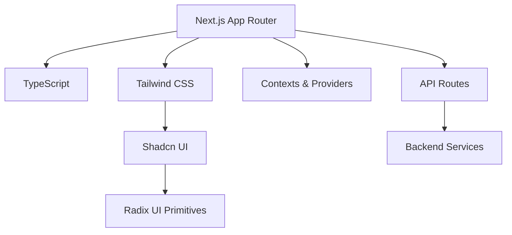

# Architecture Overview

<cite>
**Referenced Files in This Document**
- [app/layout.tsx](file://app/layout.tsx)
- [app/[locale]/layout.tsx](file://app/[locale]/layout.tsx)
- [app/[locale]/page.tsx](file://app/[locale]/page.tsx)
- [app/[locale]/(auth)/layout.tsx](file://app/[locale]/(auth)/layout.tsx)
- [app/[locale]/dashboard/layout.tsx](file://app/[locale]/dashboard/layout.tsx)
- [app/[locale]/(routes)/services/page.tsx](file://app/[locale]/(routes)/services/page.tsx)
- [app/[locale]/(routes)/services/actions.ts](file://app/[locale]/(routes)/services/actions.ts)
- [app/[locale]/(routes)/crm/page.tsx](file://app/[locale]/(routes)/crm/page.tsx)
- [app/[locale]/(routes)/crm/actions.ts](file://app/[locale]/(routes)/crm/actions.ts)
- [app/api/auth/session/route.ts](file://app/api/auth/session/route.ts)
- [app/api/contact/route.ts](file://app/api/contact/route.ts)
- [i18n/request.ts](file://i18n/request.ts)
- [i18n/routing.ts](file://i18n/routing.ts)
- [lib/locale.ts](file://lib/locale.ts)
- [contexts/AuthContext.tsx](file://contexts/AuthContext.tsx)
- [providers/theme-provider.tsx](file://providers/theme-provider.tsx)
- [components/ui/button.tsx](file://components/ui/button.tsx)
- [components/ui/input.tsx](file://components/ui/input.tsx)
- [components/ui/dialog.tsx](file://components/ui/dialog.tsx)
- [components/ui/select.tsx](file://components/ui/select.tsx)
- [components/ui/textarea.tsx](file://components/ui/textarea.tsx)
- [components/ui/alert-dialog.tsx](file://components/ui/alert-dialog.tsx)
- [components/ui/popover.tsx](file://components/ui/popover.tsx)
- [components/ui/checkbox.tsx](file://components/ui/checkbox.tsx)
- [components/ui/sonner.tsx](file://components/ui/sonner.tsx)
- [tailwind.config.ts](file://tailwind.config.ts)
- [next.config.ts](file://next.config.ts)
- [package.json](file://package.json)
- [proxy.ts](file://proxy.ts)
</cite>

## Table of Contents
1. [Introduction](#introduction)
2. [Project Structure](#project-structure)
3. [Core Components](#core-components)
4. [Architecture Overview](#architecture-overview)
5. [Detailed Component Analysis](#detailed-component-analysis)
6. [Dependency Analysis](#dependency-analysis)
7. [Performance Considerations](#performance-considerations)
8. [Troubleshooting Guide](#troubleshooting-guide)
9. [Conclusion](#conclusion)

## Introduction
This document describes the architecture of the Automex Frontend system built with Next.js App Router and React 18+. It explains the file-based routing, component organization patterns, technology stack (TypeScript, Tailwind CSS, Shadcn UI, Radix UI), separation between server and client components, context-driven state management, feature-based code organization, internationalization for 10 languages with RTL support, theme system, API communication layer, and integration points with backend services. It also covers scalability, performance optimization strategies, deployment topology, and provides diagrams illustrating authentication, CRM features, dashboard, and public website sections.

## Project Structure
The application uses Next.js App Router with a locale-aware root segment and route groups to separate concerns:
- Locale-aware root: app/[locale]
- Route groups:
  - (auth): Authentication flows
  - (routes): Public marketing pages and CRM landing pages
  - dashboard: Protected dashboard area
- Shared layouts at app/layout.tsx and app/[locale]/layout.tsx provide global providers and HTML structure.
- Feature folders under each route group contain page-level components and shared subcomponents.
- UI primitives are implemented via Shadcn UI components that wrap Radix UI primitives.
- Internationalization is configured through i18n/request.ts and i18n/routing.ts, with message files per language under messages/.
- Theme provider is provided by providers/theme-provider.tsx.
- API routes live under app/api for session and contact endpoints.

**Diagram sources**
- [app/layout.tsx](file://app/layout.tsx)
- [app/[locale]/layout.tsx](file://app/[locale]/layout.tsx)
- [app/[locale]/(auth)/layout.tsx](file://app/[locale]/(auth)/layout.tsx)
- [app/[locale]/(routes)/services/page.tsx](file://app/[locale]/(routes)/services/page.tsx)
- [app/[locale]/(routes)/crm/page.tsx](file://app/[locale]/(routes)/crm/page.tsx)
- [app/[locale]/dashboard/layout.tsx](file://app/[locale]/dashboard/layout.tsx)
- [i18n/request.ts](file://i18n/request.ts)
- [i18n/routing.ts](file://i18n/routing.ts)
- [providers/theme-provider.tsx](file://providers/theme-provider.tsx)
- [contexts/AuthContext.tsx](file://contexts/AuthContext.tsx)

**Section sources**
- [app/layout.tsx](file://app/layout.tsx)
- [app/[locale]/layout.tsx](file://app/[locale]/layout.tsx)
- [app/[locale]/(auth)/layout.tsx](file://app/[locale]/(auth)/layout.tsx)
- [app/[locale]/dashboard/layout.tsx](file://app/[locale]/dashboard/layout.tsx)
- [app/[locale]/(routes)/services/page.tsx](file://app/[locale]/(routes)/services/page.tsx)
- [app/[locale]/(routes)/crm/page.tsx](file://app/[locale]/(routes)/crm/page.tsx)
- [i18n/request.ts](file://i18n/request.ts)
- [i18n/routing.ts](file://i18n/routing.ts)
- [providers/theme-provider.tsx](file://providers/theme-provider.tsx)
- [contexts/AuthContext.tsx](file://contexts/AuthContext.tsx)

## Core Components
- Global layout and providers:
  - Root layout sets up HTML attributes and global styles.
  - Locale layout composes i18n setup, theme provider, and auth context.
- UI primitives:
  - Shadcn UI components (button, input, dialog, select, textarea, alert-dialog, popover, checkbox, sonner) provide accessible, themeable building blocks based on Radix UI.
- Contexts:
  - AuthContext centralizes user session state and actions across the app.
  - Sidebar context manages navigation state within the dashboard.
- Providers:
  - Theme provider toggles light/dark themes and persists preference.
- Internationalization:
  - i18n/request.ts resolves locale from URL segments.
  - i18n/routing.ts defines supported locales and default locale.
  - Message files under messages/ define translations for 10 languages including Arabic and Persian (RTL).
- API layer:
  - Server routes under app/api handle session retrieval and contact form submissions.
  - Client-side interactions use Next.js Server Actions or fetch calls to these routes.

**Section sources**
- [app/layout.tsx](file://app/layout.tsx)
- [app/[locale]/layout.tsx](file://app/[locale]/layout.tsx)
- [components/ui/button.tsx](file://components/ui/button.tsx)
- [components/ui/input.tsx](file://components/ui/input.tsx)
- [components/ui/dialog.tsx](file://components/ui/dialog.tsx)
- [components/ui/select.tsx](file://components/ui/select.tsx)
- [components/ui/textarea.tsx](file://components/ui/textarea.tsx)
- [components/ui/alert-dialog.tsx](file://components/ui/alert-dialog.tsx)
- [components/ui/popover.tsx](file://components/ui/popover.tsx)
- [components/ui/checkbox.tsx](file://components/ui/checkbox.tsx)
- [components/ui/sonner.tsx](file://components/ui/sonner.tsx)
- [contexts/AuthContext.tsx](file://contexts/AuthContext.tsx)
- [providers/theme-provider.tsx](file://providers/theme-provider.tsx)
- [i18n/request.ts](file://i18n/request.ts)
- [i18n/routing.ts](file://i18n/routing.ts)
- [messages/en.json](file://messages/en.json)
- [messages/ar.json](file://messages/ar.json)
- [messages/fa.json](file://messages/fa.json)

## Architecture Overview
High-level design:
- Next.js App Router organizes routes by directory; locale prefix enables multi-language URLs.
- Route groups isolate authentication, public content, and dashboard areas without affecting URL paths.
- Server components render initial data and HTML efficiently; client components handle interactivity.
- Contexts manage cross-cutting state such as authentication and UI preferences.
- API routes act as an internal boundary to backend services, enabling secure server-side operations.

**Diagram sources**
- [app/[locale]/(auth)/layout.tsx](file://app/[locale]/(auth)/layout.tsx)
- [app/[locale]/(routes)/services/page.tsx](file://app/[locale]/(routes)/services/page.tsx)
- [app/[locale]/dashboard/layout.tsx](file://app/[locale]/dashboard/layout.tsx)
- [app/api/auth/session/route.ts](file://app/api/auth/session/route.ts)
- [app/api/contact/route.ts](file://app/api/contact/route.ts)
- [providers/theme-provider.tsx](file://providers/theme-provider.tsx)
- [contexts/AuthContext.tsx](file://contexts/AuthContext.tsx)

## Detailed Component Analysis

### Routing and Layouts
- Root layout establishes global HTML structure and injects providers.
- Locale layout configures i18n request handling and applies theme and auth contexts.
- Route group layouts encapsulate specific UI shells:
  - (auth) layout wraps authentication pages.
  - dashboard layout provides sidebar and header for protected routes.

**Diagram sources**
- [app/layout.tsx](file://app/layout.tsx)
- [app/[locale]/layout.tsx](file://app/[locale]/layout.tsx)
- [app/[locale]/(auth)/layout.tsx](file://app/[locale]/(auth)/layout.tsx)
- [app/[locale]/dashboard/layout.tsx](file://app/[locale]/dashboard/layout.tsx)

**Section sources**
- [app/layout.tsx](file://app/layout.tsx)
- [app/[locale]/layout.tsx](file://app/[locale]/layout.tsx)
- [app/[locale]/(auth)/layout.tsx](file://app/[locale]/(auth)/layout.tsx)
- [app/[locale]/dashboard/layout.tsx](file://app/[locale]/dashboard/layout.tsx)

### Authentication Flow
- The session API route exposes current session information to clients.
- AuthContext maintains user state and provides login/logout methods.
- Authentication pages reside under (auth) route group and leverage shared UI components.

**Diagram sources**
- [app/api/auth/session/route.ts](file://app/api/auth/session/route.ts)
- [contexts/AuthContext.tsx](file://contexts/AuthContext.tsx)

**Section sources**
- [app/api/auth/session/route.ts](file://app/api/auth/session/route.ts)
- [contexts/AuthContext.tsx](file://contexts/AuthContext.tsx)

### CRM Features
- CRM landing page and related forms are organized under (routes)/crm with feature-specific components.
- Server Actions or API routes handle form submissions and business logic.
- Shared CRM fields and hooks are colocated for reusability.

**Diagram sources**
- [app/[locale]/(routes)/crm/page.tsx](file://app/[locale]/(routes)/crm/page.tsx)
- [app/[locale]/(routes)/crm/actions.ts](file://app/[locale]/(routes)/crm/actions.ts)

**Section sources**
- [app/[locale]/(routes)/crm/page.tsx](file://app/[locale]/(routes)/crm/page.tsx)
- [app/[locale]/(routes)/crm/actions.ts](file://app/[locale]/(routes)/crm/actions.ts)

### Public Website Sections
- Marketing pages like services are implemented under (routes)/services with dedicated client components.
- Data fetching can be performed server-side using Next.js data access patterns or via API routes.

**Diagram sources**
- [app/[locale]/(routes)/services/page.tsx](file://app/[locale]/(routes)/services/page.tsx)
- [app/[locale]/(routes)/services/actions.ts](file://app/[locale]/(routes)/services/actions.ts)

**Section sources**
- [app/[locale]/(routes)/services/page.tsx](file://app/[locale]/(routes)/services/page.tsx)
- [app/[locale]/(routes)/services/actions.ts](file://app/[locale]/(routes)/services/actions.ts)

### Internationalization and RTL Support
- i18n/request.ts determines the active locale from the URL path.
- i18n/routing.ts enumerates supported locales and defaults.
- Message files under messages/ provide translations for 10 languages, including RTL-capable locales (Arabic, Persian).
- Locale switching updates URL segments and HTML dir/lang attributes.

**Diagram sources**
- [i18n/request.ts](file://i18n/request.ts)
- [i18n/routing.ts](file://i18n/routing.ts)
- [messages/en.json](file://messages/en.json)
- [messages/ar.json](file://messages/ar.json)
- [messages/fa.json](file://messages/fa.json)

**Section sources**
- [i18n/request.ts](file://i18n/request.ts)
- [i18n/routing.ts](file://i18n/routing.ts)
- [messages/en.json](file://messages/en.json)
- [messages/ar.json](file://messages/ar.json)
- [messages/fa.json](file://messages/fa.json)

### Theme System
- Theme provider manages light/dark mode and persists user preference.
- Tailwind configuration integrates theme tokens and extends design system.
- Shadcn UI components consume theme variables for consistent styling.

**Diagram sources**
- [providers/theme-provider.tsx](file://providers/theme-provider.tsx)
- [tailwind.config.ts](file://tailwind.config.ts)
- [components/ui/button.tsx](file://components/ui/button.tsx)
- [components/ui/input.tsx](file://components/ui/input.tsx)
- [components/ui/dialog.tsx](file://components/ui/dialog.tsx)
- [components/ui/select.tsx](file://components/ui/select.tsx)
- [components/ui/textarea.tsx](file://components/ui/textarea.tsx)
- [components/ui/alert-dialog.tsx](file://components/ui/alert-dialog.tsx)
- [components/ui/popover.tsx](file://components/ui/popover.tsx)
- [components/ui/checkbox.tsx](file://components/ui/checkbox.tsx)
- [components/ui/sonner.tsx](file://components/ui/sonner.tsx)

**Section sources**
- [providers/theme-provider.tsx](file://providers/theme-provider.tsx)
- [tailwind.config.ts](file://tailwind.config.ts)
- [components/ui/button.tsx](file://components/ui/button.tsx)
- [components/ui/input.tsx](file://components/ui/input.tsx)
- [components/ui/dialog.tsx](file://components/ui/dialog.tsx)
- [components/ui/select.tsx](file://components/ui/select.tsx)
- [components/ui/textarea.tsx](file://components/ui/textarea.tsx)
- [components/ui/alert-dialog.tsx](file://components/ui/alert-dialog.tsx)
- [components/ui/popover.tsx](file://components/ui/popover.tsx)
- [components/ui/checkbox.tsx](file://components/ui/checkbox.tsx)
- [components/ui/sonner.tsx](file://components/ui/sonner.tsx)

### API Communication Layer
- Server routes under app/api expose controlled endpoints for session and contact submissions.
- Client components call these routes directly or via Server Actions.
- Proxy configuration can forward requests during development.

**Diagram sources**
- [app/api/contact/route.ts](file://app/api/contact/route.ts)
- [proxy.ts](file://proxy.ts)

**Section sources**
- [app/api/contact/route.ts](file://app/api/contact/route.ts)
- [proxy.ts](file://proxy.ts)

## Dependency Analysis
Key dependencies and their roles:
- Next.js App Router orchestrates routing and rendering.
- TypeScript ensures type safety across the codebase.
- Tailwind CSS provides utility-first styling integrated via tailwind.config.ts.
- Shadcn UI components wrap Radix UI primitives for accessibility and theming.
- Contexts and providers manage cross-cutting concerns like authentication and theme.

**Diagram sources**
- [next.config.ts](file://next.config.ts)
- [tailwind.config.ts](file://tailwind.config.ts)
- [package.json](file://package.json)
- [components/ui/button.tsx](file://components/ui/button.tsx)
- [app/api/auth/session/route.ts](file://app/api/auth/session/route.ts)
- [app/api/contact/route.ts](file://app/api/contact/route.ts)

**Section sources**
- [next.config.ts](file://next.config.ts)
- [tailwind.config.ts](file://tailwind.config.ts)
- [package.json](file://package.json)
- [components/ui/button.tsx](file://components/ui/button.tsx)
- [app/api/auth/session/route.ts](file://app/api/auth/session/route.ts)
- [app/api/contact/route.ts](file://app/api/contact/route.ts)

## Performance Considerations
- Prefer server components for data-heavy pages to reduce client bundle size.
- Use client components only where interactivity is required.
- Leverage Next.js caching and incremental static regeneration where appropriate.
- Optimize images and assets; consider lazy loading heavy components.
- Minimize context usage to avoid unnecessary re-renders; scope contexts to relevant route groups.
- Utilize Tailwind’s JIT compilation and purge unused styles.
- Keep API routes thin and delegate business logic to backend services.

[No sources needed since this section provides general guidance]

## Troubleshooting Guide
Common issues and resolutions:
- Locale not resolving:
  - Verify i18n/request.ts and i18n/routing.ts configurations.
  - Ensure URL segments include valid locale values.
- Theme toggle not persisting:
  - Check theme provider implementation and storage mechanism.
- API route errors:
  - Inspect app/api routes for correct request/response handling.
  - Confirm proxy configuration during development.
- Authentication state inconsistencies:
  - Review AuthContext initialization and session API responses.

**Section sources**
- [i18n/request.ts](file://i18n/request.ts)
- [i18n/routing.ts](file://i18n/routing.ts)
- [providers/theme-provider.tsx](file://providers/theme-provider.tsx)
- [app/api/auth/session/route.ts](file://app/api/auth/session/route.ts)
- [app/api/contact/route.ts](file://app/api/contact/route.ts)
- [proxy.ts](file://proxy.ts)
- [contexts/AuthContext.tsx](file://contexts/AuthContext.tsx)

## Conclusion
The Automex Frontend leverages Next.js App Router to deliver a scalable, maintainable architecture with clear separation between public, authenticated, and dashboard experiences. The combination of TypeScript, Tailwind CSS, Shadcn UI, and Radix UI ensures robust, accessible, and themeable interfaces. Internationalization supports 10 languages with RTL capabilities, while context-driven state management and API routes provide cohesive data flow and integration with backend services. The documented patterns and diagrams offer a foundation for ongoing development and scaling.

[No sources needed since this section summarizes without analyzing specific files]