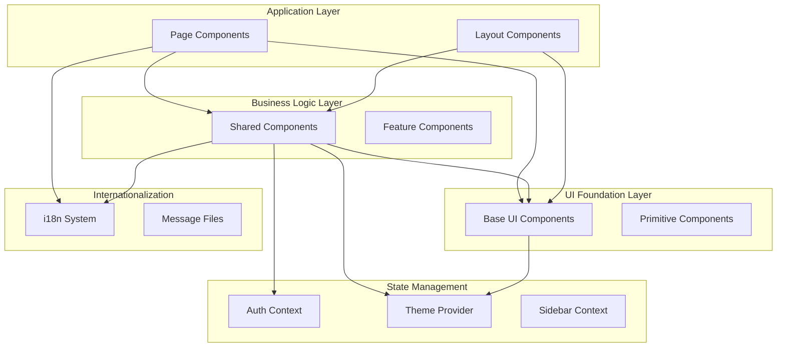
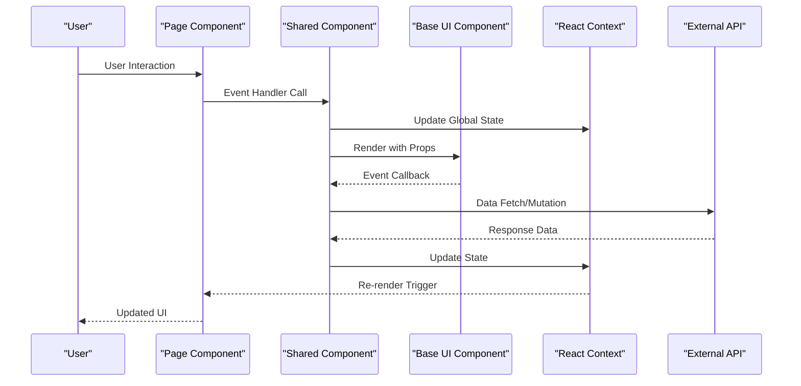
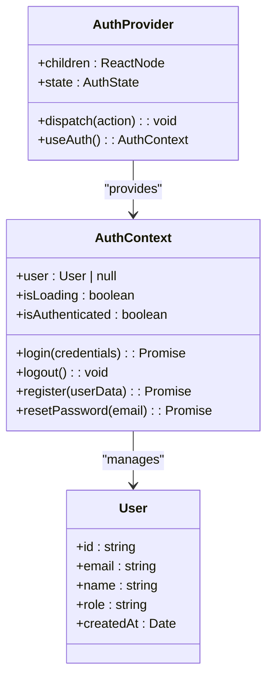
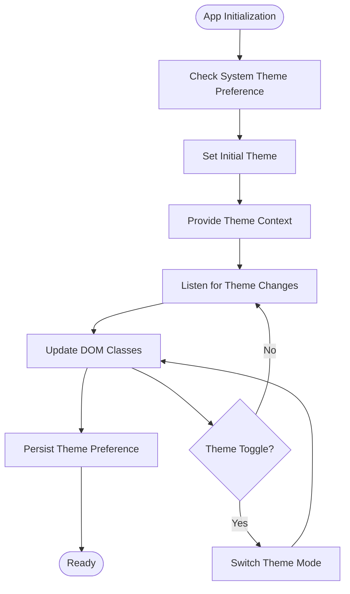
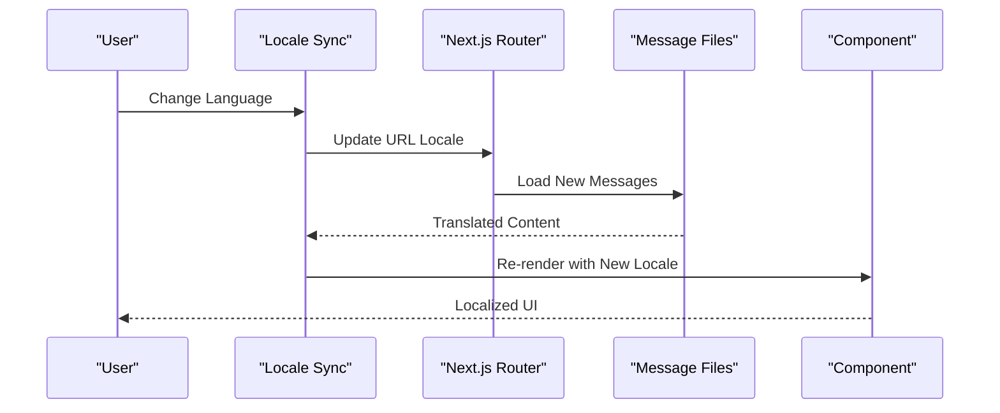
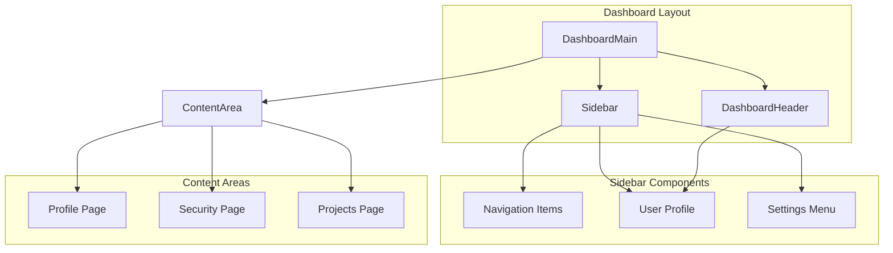
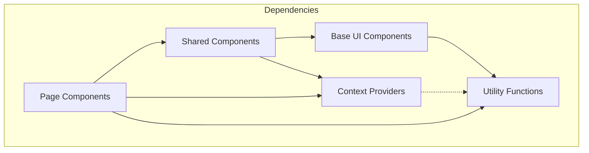

# Component Architecture

<cite>
**Referenced Files in This Document**
- [AuthContext.tsx](file://contexts/AuthContext.tsx)
- [theme-provider.tsx](file://providers/theme-provider.tsx)
- [layout.tsx](file://app/[locale]/layout.tsx)
- [button.tsx](file://components/ui/button.tsx)
- [index.ts](file://components/shared/index.ts)
- [Header.tsx](file://app/[locale]/_components/Header/Header.tsx)
- [FooterSections.tsx](file://app/[locale]/_components/Footer/FooterSections.tsx)
- [HomeHero.tsx](file://app/[locale]/_components/HomeHero/HomeHero.tsx)
- [LanguageSwitcher.tsx](file://app/[locale]/_components/Language/LanguageSwitcher.tsx)
- [Sidebar.tsx](file://app/[locale]/dashboard/_components/Sidebar/Sidebar.tsx)
- [DashboardMain.tsx](file://app/[locale]/dashboard/_components/DashboardMain.tsx)
- [AuthCard.tsx](file://app/[locale]/(auth)/_components/AuthCard.tsx)
- [CrmClientPage.tsx](file://app/[locale]/(routes)/crm/_components/CrmClientPage.tsx)
- [ConnectedModel.tsx](file://components/shared/ConnectedModel.tsx)
- [HowItWorks.tsx](file://components/shared/HowItWorks.tsx)
- [ThemeToggle.tsx](file://app/[locale]/_components/Theme/theme-toggle.tsx)
- [LocaleSync.tsx](file://app/[locale]/_components/Language/LocaleSync.tsx)
</cite>

## Table of Contents
1. [Introduction](#introduction)
2. [Project Structure](#project-structure)
3. [Core Components](#core-components)
4. [Architecture Overview](#architecture-overview)
5. [Detailed Component Analysis](#detailed-component-analysis)
6. [Dependency Analysis](#dependency-analysis)
7. [Performance Considerations](#performance-considerations)
8. [Troubleshooting Guide](#troubleshooting-guide)
9. [Conclusion](#conclusion)

## Introduction

The Automex Frontend follows a well-structured three-tier component architecture that promotes reusability, maintainability, and clear separation of concerns. This architecture consists of:

1. **Base UI Components (Shadcn)**: Low-level, reusable UI primitives built with Shadcn/UI
2. **Business Logic Components (Shared)**: Medium-complexity components containing business logic and domain-specific functionality
3. **Page-Specific Components**: High-level components tailored to specific pages or features

This document explains the component composition patterns, prop interfaces, event handling strategies, context-driven state management using React Context API, provider pattern implementation, and integration with internationalization and theming systems.

## Project Structure

The component architecture is organized into distinct layers that promote code reuse and maintainability:

**Diagram sources**
- [layout.tsx:1-50](file://app/[locale]/layout.tsx#L1-L50)
- [AuthContext.tsx:1-100](file://contexts/AuthContext.tsx#L1-L100)
- [theme-provider.tsx:1-80](file://providers/theme-provider.tsx#L1-L80)

**Section sources**
- [layout.tsx:1-100](file://app/[locale]/layout.tsx#L1-L100)
- [AuthContext.tsx:1-150](file://contexts/AuthContext.tsx#L1-L150)
- [theme-provider.tsx:1-120](file://providers/theme-provider.tsx#L1-L120)

## Core Components

### Base UI Components (Shadcn)

The base UI layer provides atomic, reusable components that serve as building blocks for higher-level components. These components are typically thin wrappers around Shadcn/UI primitives with consistent styling and behavior.

#### Key Characteristics:
- **Atomic Design**: Small, focused components with single responsibilities
- **Consistent Styling**: Unified design tokens and Tailwind CSS classes
- **Type Safety**: Comprehensive TypeScript interfaces for props
- **Accessibility**: Built-in ARIA attributes and keyboard navigation
- **Theme Support**: Automatic dark/light mode adaptation

#### Example Base Components:
- Button variants and states
- Input fields with validation
- Dialog and modal components
- Form controls and feedback elements

**Section sources**
- [button.tsx:1-200](file://components/ui/button.tsx#L1-L200)

### Business Logic Components (Shared)

The shared component layer contains medium-complexity components that encapsulate business logic and domain-specific functionality. These components often compose multiple base UI components and may interact with external services or state management.

#### Key Characteristics:
- **Business Logic Encapsulation**: Contains domain-specific rules and validations
- **Composition Patterns**: Combines multiple base UI components
- **State Management Integration**: Works with React Context and local state
- **API Integration**: Handles data fetching and mutations
- **Configuration-Driven**: Often configurable through props

#### Examples of Shared Components:
- Connected model displays
- How-it-works sections
- Team and values sections
- Timeline visualizations

**Section sources**
- [index.ts:1-50](file://components/shared/index.ts#L1-L50)
- [ConnectedModel.tsx:1-150](file://components/shared/ConnectedModel.tsx#L1-L150)
- [HowItWorks.tsx:1-200](file://components/shared/HowItWorks.tsx#L1-L200)

### Page-Specific Components

Page-specific components are high-level components tailored to particular pages or features. They orchestrate the overall layout, manage page-level state, and coordinate interactions between shared and base components.

#### Key Characteristics:
- **Page Orchestration**: Manages overall page layout and flow
- **Complex State Management**: Handles page-specific state and side effects
- **Data Aggregation**: Coordinates multiple data sources
- **User Flow Management**: Controls navigation and user interactions
- **Performance Optimization**: Implements lazy loading and memoization

#### Examples of Page Components:
- Authentication forms and layouts
- Dashboard interfaces
- CRM client pages
- Service detail pages

**Section sources**
- [AuthCard.tsx:1-100](file://app/[locale]/(auth)/_components/AuthCard.tsx#L1-L100)
- [CrmClientPage.tsx:1-200](file://app/[locale]/(routes)/crm/_components/CrmClientPage.tsx#L1-L200)
- [DashboardMain.tsx:1-150](file://app/[locale]/dashboard/_components/DashboardMain.tsx#L1-L150)

## Architecture Overview

The component architecture follows a unidirectional data flow pattern with clear separation of concerns:

**Diagram sources**
- [AuthContext.tsx:1-150](file://contexts/AuthContext.tsx#L1-L150)
- [theme-provider.tsx:1-120](file://providers/theme-provider.tsx#L1-L120)
- [Header.tsx:1-100](file://app/[locale]/_components/Header/Header.tsx#L1-L100)

### Component Composition Patterns

The architecture implements several key composition patterns:

#### 1. Container/Presentational Pattern
- **Container Components**: Handle state, data fetching, and business logic
- **Presentational Components**: Focus on rendering and user interactions

#### 2. Higher-Order Component (HOC) Pattern
- Wraps components with additional functionality
- Provides cross-cutting concerns like authentication or analytics

#### 3. Compound Component Pattern
- Components work together as a cohesive unit
- Internal state coordination between parent and child components

#### 4. Render Props Pattern
- Passes functions as props for custom rendering logic
- Enables flexible component customization

**Section sources**
- [Header.tsx:1-150](file://app/[locale]/_components/Header/Header.tsx#L1-L150)
- [FooterSections.tsx:1-200](file://app/[locale]/_components/Footer/FooterSections.tsx#L1-L200)
- [HomeHero.tsx:1-180](file://app/[locale]/_components/HomeHero/HomeHero.tsx#L1-L180)

## Detailed Component Analysis

### Authentication Context Implementation

The authentication system uses React Context API to provide global authentication state across the application:

**Diagram sources**
- [AuthContext.tsx:1-200](file://contexts/AuthContext.tsx#L1-L200)

#### Key Features:
- **Global State Management**: Centralized authentication state
- **Persistence**: Session persistence across browser refreshes
- **Protected Routes**: Route guards for authenticated users
- **Error Handling**: Comprehensive error boundaries and user feedback

**Section sources**
- [AuthContext.tsx:1-250](file://contexts/AuthContext.tsx#L1-L250)

### Theme Provider Implementation

The theming system provides consistent styling across the application with support for light and dark modes:

**Diagram sources**
- [theme-provider.tsx:1-150](file://providers/theme-provider.tsx#L1-L150)
- [ThemeToggle.tsx:1-100](file://app/[locale]/_components/Theme/theme-toggle.tsx#L1-L100)

#### Theme Features:
- **Automatic Detection**: Detects system preference on first load
- **Manual Override**: User-controlled theme switching
- **CSS Variables**: Dynamic CSS variable updates
- **Persistence**: Theme preference saved to localStorage

**Section sources**
- [theme-provider.tsx:1-200](file://providers/theme-provider.tsx#L1-L200)
- [ThemeToggle.tsx:1-120](file://app/[locale]/_components/Theme/theme-toggle.tsx#L1-L120)

### Internationalization Integration

The i18n system provides multi-language support throughout the application:

**Diagram sources**
- [LocaleSync.tsx:1-150](file://app/[locale]/_components/Language/LocaleSync.tsx#L1-L150)
- [LanguageSwitcher.tsx:1-100](file://app/[locale]/_components/Language/LanguageSwitcher.tsx#L1-L100)

#### i18n Features:
- **Dynamic Loading**: Loads language files on demand
- **RTL Support**: Right-to-left language support
- **Fallback Mechanism**: Graceful fallback to default language
- **Type Safety**: TypeScript definitions for translation keys

**Section sources**
- [LocaleSync.tsx:1-200](file://app/[locale]/_components/Language/LocaleSync.tsx#L1-L200)
- [LanguageSwitcher.tsx:1-150](file://app/[locale]/_components/Language/LanguageSwitcher.tsx#L1-L150)

### Dashboard Component Architecture

The dashboard demonstrates complex component interactions and state management:

**Diagram sources**
- [DashboardMain.tsx:1-200](file://app/[locale]/dashboard/_components/DashboardMain.tsx#L1-L200)
- [Sidebar.tsx:1-150](file://app/[locale]/dashboard/_components/Sidebar/Sidebar.tsx#L1-L150)

#### Dashboard Features:
- **Responsive Layout**: Adapts to different screen sizes
- **Collapsible Sidebar**: Space-efficient navigation
- **Route-based Navigation**: Clean URL structure
- **Permission-based Access**: Role-based component visibility

**Section sources**
- [DashboardMain.tsx:1-250](file://app/[locale]/dashboard/_components/DashboardMain.tsx#L1-L250)
- [Sidebar.tsx:1-200](file://app/[locale]/dashboard/_components/Sidebar/Sidebar.tsx#L1-L200)

## Dependency Analysis

The component architecture maintains clear dependency relationships and avoids circular dependencies:

**Diagram sources**
- [AuthContext.tsx:1-100](file://contexts/AuthContext.tsx#L1-L100)
- [theme-provider.tsx:1-80](file://providers/theme-provider.tsx#L1-L80)
- [index.ts:1-50](file://components/shared/index.ts#L1-L50)

### Dependency Rules:
- **Base UI Components**: No internal dependencies (except utilities)
- **Shared Components**: Can depend on Base UI and Contexts
- **Page Components**: Can depend on all other layers
- **Context Providers**: Minimal dependencies, focus on state management

**Section sources**
- [AuthContext.tsx:1-150](file://contexts/AuthContext.tsx#L1-L150)
- [theme-provider.tsx:1-120](file://providers/theme-provider.tsx#L1-L120)
- [index.ts:1-100](file://components/shared/index.ts#L1-L100)

## Performance Considerations

### Component Optimization Strategies:
- **Memoization**: Use `React.memo` for expensive components
- **Lazy Loading**: Implement code splitting for large components
- **Virtual Scrolling**: For long lists and tables
- **Image Optimization**: Next.js Image component for automatic optimization
- **Bundle Analysis**: Regular analysis to identify bundle size issues

### State Management Best Practices:
- **Local State**: Prefer local state when possible
- **Context Usage**: Use context sparingly for truly global state
- **Server State**: Leverage React Query or SWR for server-side data
- **Form State**: Use form libraries for complex form handling

## Troubleshooting Guide

### Common Issues and Solutions:

#### Context Provider Issues:
- **Problem**: Context not updating properly
- **Solution**: Ensure proper provider wrapping and avoid unnecessary re-renders

#### Theme Inconsistencies:
- **Problem**: Theme not applying correctly
- **Solution**: Check CSS variable conflicts and provider order

#### Internationalization Problems:
- **Problem**: Missing translations or wrong locale
- **Solution**: Verify message files and locale configuration

#### Component Performance Issues:
- **Problem**: Slow rendering or memory leaks
- **Solution**: Implement proper cleanup and use performance profiling

**Section sources**
- [AuthContext.tsx:1-200](file://contexts/AuthContext.tsx#L1-L200)
- [theme-provider.tsx:1-150](file://providers/theme-provider.tsx#L1-L150)

## Conclusion

The Automex Frontend component architecture provides a solid foundation for building scalable, maintainable web applications. The three-tier structure promotes code reuse, clear separation of concerns, and easy testing. The integration of React Context for state management, comprehensive theming support, and robust internationalization capabilities make it suitable for enterprise-level applications.

Key architectural principles demonstrated include:
- **Separation of Concerns**: Clear boundaries between UI, business logic, and presentation
- **Reusability**: Components designed for maximum reuse across the application
- **Type Safety**: Comprehensive TypeScript usage throughout the codebase
- **Accessibility**: Built-in accessibility features and semantic HTML
- **Performance**: Optimized rendering and efficient state management

This architecture serves as a strong foundation for future development and scaling of the Automex platform.