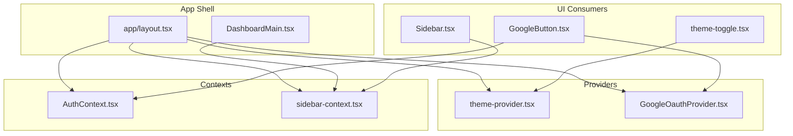
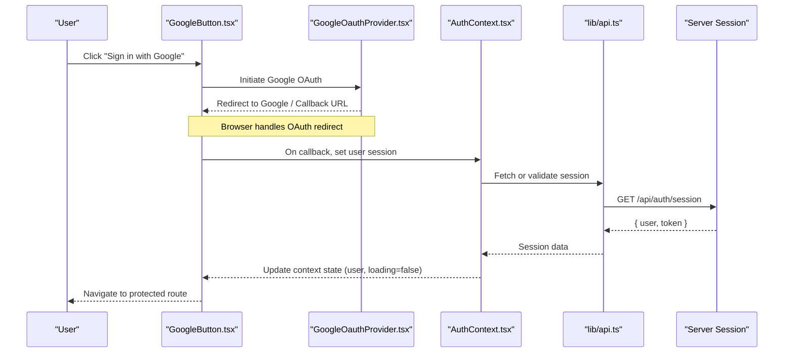
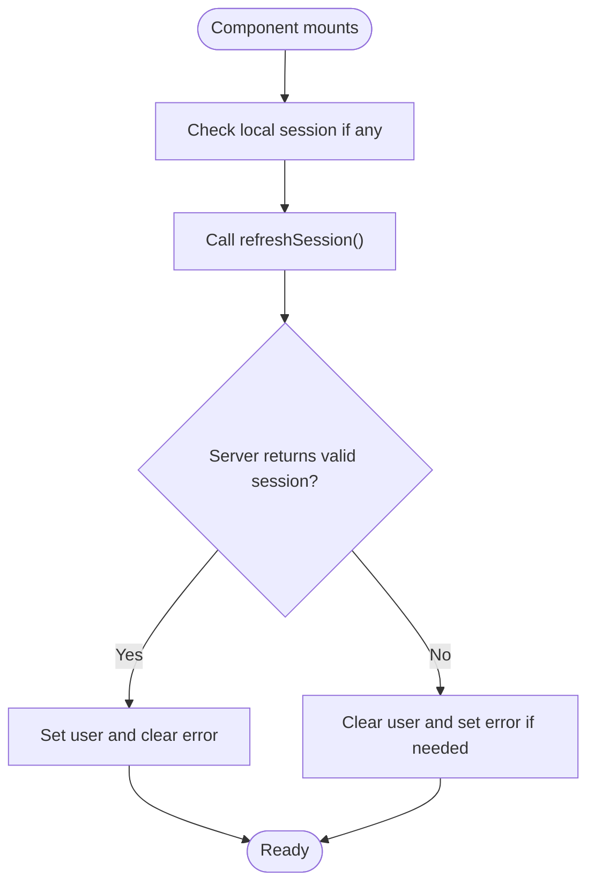
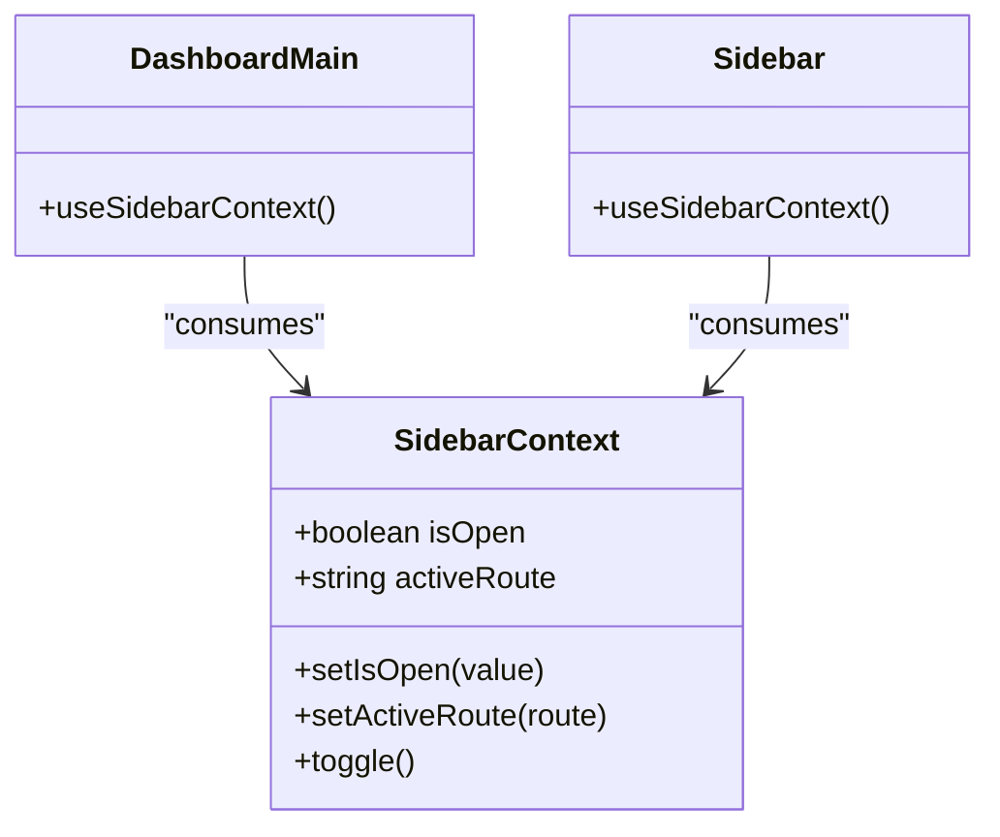
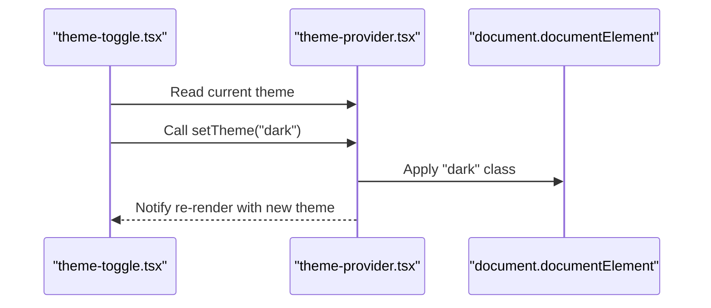
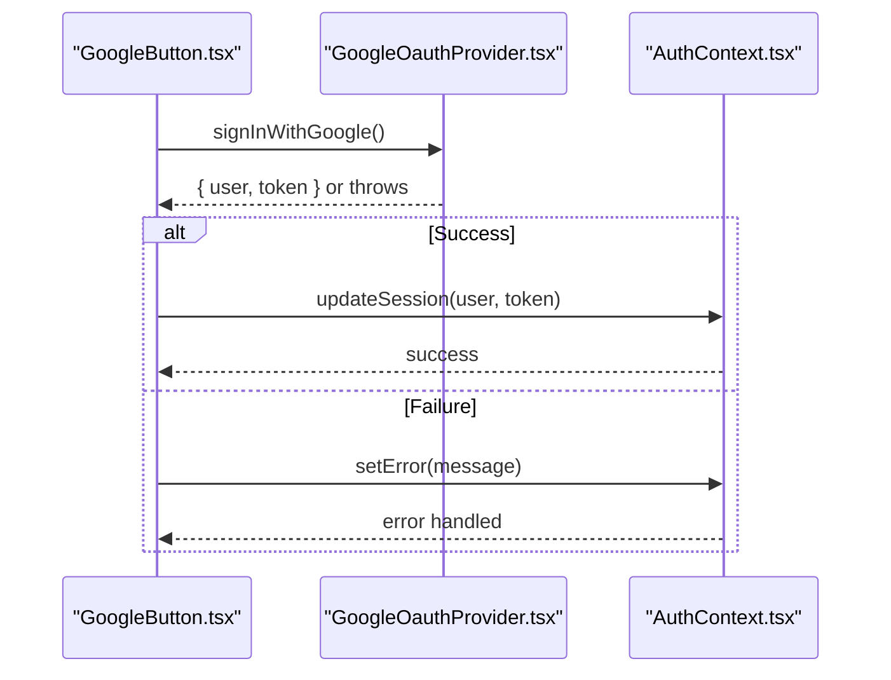
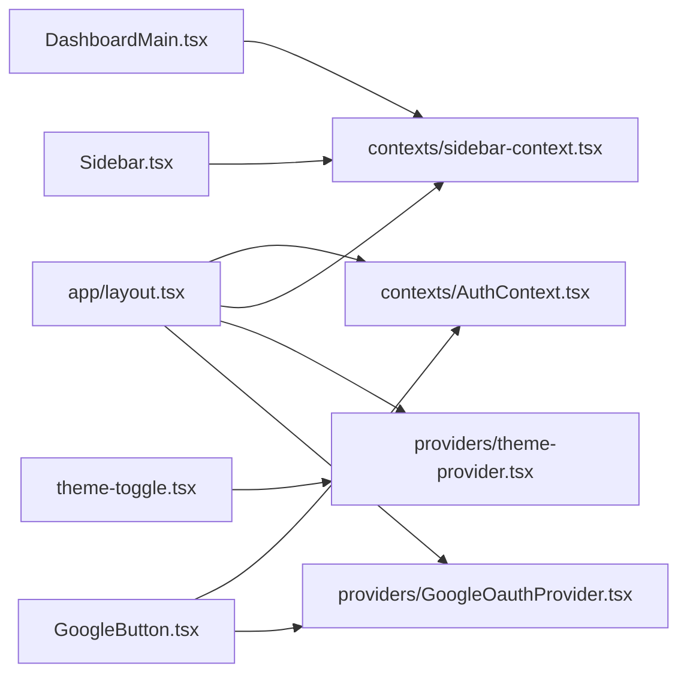

# Context Management

<cite>
**Referenced Files in This Document**
- [AuthContext.tsx](file://contexts/AuthContext.tsx)
- [sidebar-context.tsx](file://contexts/sidebar-context.tsx)
- [theme-provider.tsx](file://providers/theme-provider.tsx)
- [GoogleOauthProvider.tsx](file://providers/GoogleOauthProvider.tsx)
- [layout.tsx](file://app/layout.tsx)
- [DashboardMain.tsx](file://app/[locale]/dashboard/_components/DashboardMain.tsx)
- [Sidebar.tsx](file://app/[locale]/dashboard/_components/Sidebar/Sidebar.tsx)
- [theme-toggle.tsx](file://app/[locale]/_components/Theme/theme-toggle.tsx)
- [GoogleButton.tsx](file://app/[locale]/[auth]/_components/GoogleButton.tsx)
- [api.ts](file://lib/api.ts)
- [auth.ts](file://lib/auth.ts)
</cite>

## Table of Contents
1. [Introduction](#introduction)
2. [Project Structure](#project-structure)
3. [Core Components](#core-components)
4. [Architecture Overview](#architecture-overview)
5. [Detailed Component Analysis](#detailed-component-analysis)
6. [Dependency Analysis](#dependency-analysis)
7. [Performance Considerations](#performance-considerations)
8. [Troubleshooting Guide](#troubleshooting-guide)
9. [Conclusion](#conclusion)

## Introduction
This document explains the React Context API implementation used for global state management across the application. It covers:
- Authentication context for user session handling and Google OAuth integration
- Sidebar context for navigation state (open/close, active route)
- Theme provider for dark/light mode switching
- Provider pattern implementation, context value structures, and synchronization strategies
- Examples of consuming contexts in components
- Error handling patterns and performance considerations for context updates

## Project Structure
The project organizes context providers and consumers under dedicated directories:
- contexts: AuthContext and sidebar context definitions
- providers: theme provider and Google OAuth provider
- app: layout and page-level components that consume contexts
- lib: shared utilities for API calls and auth helpers

**Diagram sources**
- [layout.tsx](file://app/layout.tsx)
- [theme-provider.tsx](file://providers/theme-provider.tsx)
- [AuthContext.tsx](file://contexts/AuthContext.tsx)
- [sidebar-context.tsx](file://contexts/sidebar-context.tsx)
- [GoogleOauthProvider.tsx](file://providers/GoogleOauthProvider.tsx)
- [DashboardMain.tsx](file://app/[locale]/dashboard/_components/DashboardMain.tsx)
- [Sidebar.tsx](file://app/[locale]/dashboard/_components/Sidebar/Sidebar.tsx)
- [theme-toggle.tsx](file://app/[locale]/_components/Theme/theme-toggle.tsx)
- [GoogleButton.tsx](file://app/[locale]/[auth]/_components/GoogleButton.tsx)

**Section sources**
- [layout.tsx](file://app/layout.tsx)
- [theme-provider.tsx](file://providers/theme-provider.tsx)
- [AuthContext.tsx](file://contexts/AuthContext.tsx)
- [sidebar-context.tsx](file://contexts/sidebar-context.tsx)
- [GoogleOauthProvider.tsx](file://providers/GoogleOauthProvider.tsx)
- [DashboardMain.tsx](file://app/[locale]/dashboard/_components/DashboardMain.tsx)
- [Sidebar.tsx](file://app/[locale]/dashboard/_components/Sidebar/Sidebar.tsx)
- [theme-toggle.tsx](file://app/[locale]/_components/Theme/theme-toggle.tsx)
- [GoogleButton.tsx](file://app/[locale]/[auth]/_components/GoogleButton.tsx)

## Core Components
- Authentication Context
  - Purpose: Manage user session state, login/logout flows, and error states.
  - Typical state shape: user object, loading flag, error message, and actions to sign in/out or refresh session.
  - Integration: Works with Google OAuth provider to complete third-party login.
- Sidebar Context
  - Purpose: Control sidebar open/close state and track active navigation routes.
  - Typical state shape: isOpen boolean, setActiveRoute function, and optional toggle helper.
- Theme Provider
  - Purpose: Provide current theme (dark/light) and a setter to switch themes. Persists preference when applicable.
- Google OAuth Provider
  - Purpose: Encapsulate Google Sign-In flow and expose methods to initiate authentication.

Consumers:
- DashboardMain uses sidebar context to render layout based on sidebar state.
- Sidebar component reads and updates sidebar context.
- Theme toggle button consumes theme context to switch modes.
- GoogleButton triggers Google OAuth via the provider and then updates the authentication context.

**Section sources**
- [AuthContext.tsx](file://contexts/AuthContext.tsx)
- [sidebar-context.tsx](file://contexts/sidebar-context.tsx)
- [theme-provider.tsx](file://providers/theme-provider.tsx)
- [GoogleOauthProvider.tsx](file://providers/GoogleOauthProvider.tsx)
- [DashboardMain.tsx](file://app/[locale]/dashboard/_components/DashboardMain.tsx)
- [Sidebar.tsx](file://app/[locale]/dashboard/_components/Sidebar/Sidebar.tsx)
- [theme-toggle.tsx](file://app/[locale]/_components/Theme/theme-toggle.tsx)
- [GoogleButton.tsx](file://app/[locale]/[auth]/_components/GoogleButton.tsx)

## Architecture Overview
The application wraps its root layout with multiple providers to establish global state. The authentication context coordinates with the Google OAuth provider to handle user sessions. The sidebar context is consumed by dashboard components to manage navigation UI. The theme provider toggles appearance globally.

**Diagram sources**
- [GoogleButton.tsx](file://app/[locale]/[auth]/_components/GoogleButton.tsx)
- [GoogleOauthProvider.tsx](file://providers/GoogleOauthProvider.tsx)
- [AuthContext.tsx](file://contexts/AuthContext.tsx)
- [api.ts](file://lib/api.ts)

## Detailed Component Analysis

### Authentication Context
Responsibilities:
- Maintain user session state and errors
- Provide login/logout functions
- Coordinate with server session endpoint
- Integrate with Google OAuth provider

State shape (conceptual):
- user: nullable user object
- loading: boolean indicating async operations
- error: string or null for last error
- signInWithGoogle(): Promise<void>
- logout(): Promise<void>
- refreshSession(): Promise<void>

Error handling:
- Normalize network and provider errors into a single error field
- Clear error on successful operations
- Surface actionable messages to UI

Synchronization strategy:
- On mount, call refreshSession to hydrate from server
- Invalidate session on logout
- Re-fetch after OAuth callback completes

**Diagram sources**
- [AuthContext.tsx](file://contexts/AuthContext.tsx)
- [api.ts](file://lib/api.ts)

**Section sources**
- [AuthContext.tsx](file://contexts/AuthContext.tsx)
- [api.ts](file://lib/api.ts)

### Sidebar Context
Responsibilities:
- Track sidebar open/close state
- Track active route for highlighting
- Expose toggle and setters

State shape (conceptual):
- isOpen: boolean
- activeRoute: string
- setIsOpen(value: boolean): void
- setActiveRoute(route: string): void
- toggle(): void

Usage examples:
- DashboardMain reads isOpen to adjust main content width/margins
- Sidebar listens to setActiveRoute to highlight current link
- Mobile layouts may auto-close sidebar on route change

**Diagram sources**
- [sidebar-context.tsx](file://contexts/sidebar-context.tsx)
- [DashboardMain.tsx](file://app/[locale]/dashboard/_components/DashboardMain.tsx)
- [Sidebar.tsx](file://app/[locale]/dashboard/_components/Sidebar/Sidebar.tsx)

**Section sources**
- [sidebar-context.tsx](file://contexts/sidebar-context.tsx)
- [DashboardMain.tsx](file://app/[locale]/dashboard/_components/DashboardMain.tsx)
- [Sidebar.tsx](file://app/[locale]/dashboard/_components/Sidebar/Sidebar.tsx)

### Theme Provider
Responsibilities:
- Provide current theme (dark/light)
- Toggle theme and persist preference
- Apply theme class to document root

State shape (conceptual):
- theme: "light" | "dark"
- setTheme(theme: "light" | "dark"): void

Consumer example:
- Theme toggle button reads theme and calls setTheme to switch

**Diagram sources**
- [theme-provider.tsx](file://providers/theme-provider.tsx)
- [theme-toggle.tsx](file://app/[locale]/_components/Theme/theme-toggle.tsx)

**Section sources**
- [theme-provider.tsx](file://providers/theme-provider.tsx)
- [theme-toggle.tsx](file://app/[locale]/_components/Theme/theme-toggle.tsx)

### Google OAuth Provider Integration
Responsibilities:
- Initialize Google client
- Provide method to start sign-in flow
- Handle callback and return result to caller

Interaction with Authentication Context:
- After successful OAuth callback, the caller updates the authentication context with the returned user/session data
- Errors from Google are surfaced through the authentication context’s error field

**Diagram sources**
- [GoogleButton.tsx](file://app/[locale]/[auth]/_components/GoogleButton.tsx)
- [GoogleOauthProvider.tsx](file://providers/GoogleOauthProvider.tsx)
- [AuthContext.tsx](file://contexts/AuthContext.tsx)

**Section sources**
- [GoogleButton.tsx](file://app/[locale]/[auth]/_components/GoogleButton.tsx)
- [GoogleOauthProvider.tsx](file://providers/GoogleOauthProvider.tsx)
- [AuthContext.tsx](file://contexts/AuthContext.tsx)

## Dependency Analysis
High-level dependencies among providers and consumers:
- App layout composes all providers at the root
- DashboardMain depends on sidebar context
- Sidebar depends on sidebar context
- Theme toggle depends on theme provider
- GoogleButton depends on both Google OAuth provider and authentication context

**Diagram sources**
- [layout.tsx](file://app/layout.tsx)
- [AuthContext.tsx](file://contexts/AuthContext.tsx)
- [sidebar-context.tsx](file://contexts/sidebar-context.tsx)
- [theme-provider.tsx](file://providers/theme-provider.tsx)
- [GoogleOauthProvider.tsx](file://providers/GoogleOauthProvider.tsx)
- [DashboardMain.tsx](file://app/[locale]/dashboard/_components/DashboardMain.tsx)
- [Sidebar.tsx](file://app/[locale]/dashboard/_components/Sidebar/Sidebar.tsx)
- [theme-toggle.tsx](file://app/[locale]/_components/Theme/theme-toggle.tsx)
- [GoogleButton.tsx](file://app/[locale]/[auth]/_components/GoogleButton.tsx)

**Section sources**
- [layout.tsx](file://app/layout.tsx)
- [AuthContext.tsx](file://contexts/AuthContext.tsx)
- [sidebar-context.tsx](file://contexts/sidebar-context.tsx)
- [theme-provider.tsx](file://providers/theme-provider.tsx)
- [GoogleOauthProvider.tsx](file://providers/GoogleOauthProvider.tsx)
- [DashboardMain.tsx](file://app/[locale]/dashboard/_components/DashboardMain.tsx)
- [Sidebar.tsx](file://app/[locale]/dashboard/_components/Sidebar/Sidebar.tsx)
- [theme-toggle.tsx](file://app/[locale]/_components/Theme/theme-toggle.tsx)
- [GoogleButton.tsx](file://app/[locale]/[auth]/_components/GoogleButton.tsx)

## Performance Considerations
- Minimize re-renders:
  - Split contexts by concern (already done: auth, sidebar, theme)
  - Memoize context values using useMemo where appropriate
  - Avoid passing large objects; pass only necessary fields
- Debounce frequent updates:
  - For sidebar active route changes during rapid navigation, consider debouncing
- Optimize OAuth flow:
  - Keep heavy initialization inside the provider and avoid repeated setup
- Use stable references:
  - Ensure callbacks passed via context have stable identities to prevent unnecessary subscriber updates
- Prefer server hydration:
  - Hydrate session on first load to reduce flicker and extra round-trips

## Troubleshooting Guide
Common issues and resolutions:
- Session not persisting across reloads
  - Ensure refreshSession runs on mount and writes to secure storage
  - Verify server session endpoint responds correctly
- Google OAuth fails silently
  - Confirm client ID and redirect URLs are configured
  - Surface provider errors into the authentication context’s error field
- Sidebar state resets unexpectedly
  - Check that activeRoute is updated consistently and not overwritten by parent components
- Theme not applied immediately
  - Ensure the theme class is applied to the document root and CSS variables are updated synchronously

**Section sources**
- [AuthContext.tsx](file://contexts/AuthContext.tsx)
- [GoogleOauthProvider.tsx](file://providers/GoogleOauthProvider.tsx)
- [sidebar-context.tsx](file://contexts/sidebar-context.tsx)
- [theme-provider.tsx](file://providers/theme-provider.tsx)

## Conclusion
The application leverages focused React Context providers to manage authentication, navigation, and theming. The provider pattern cleanly separates concerns, while consumers access state and actions without prop drilling. Integrating Google OAuth with the authentication context centralizes session logic and error handling. Following the performance and troubleshooting guidance will help maintain responsiveness and reliability as the application grows.