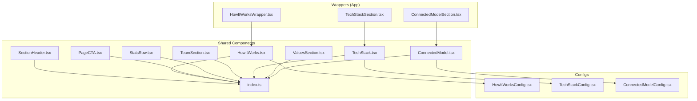
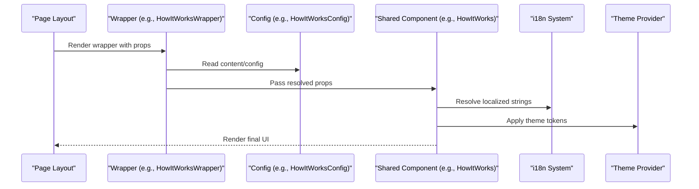
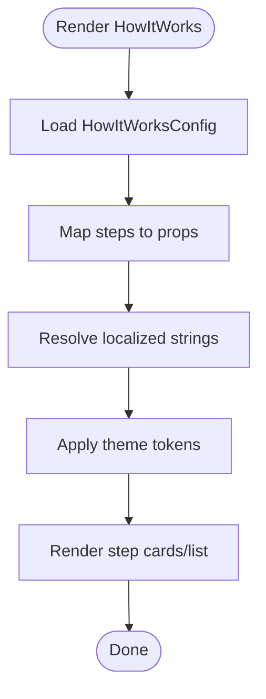
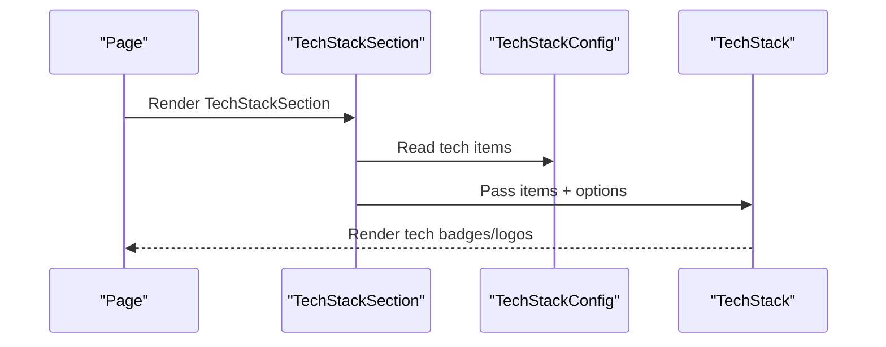
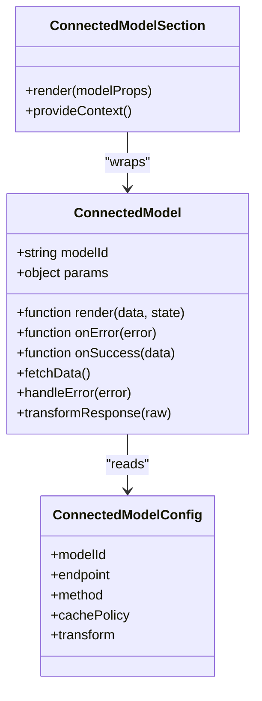
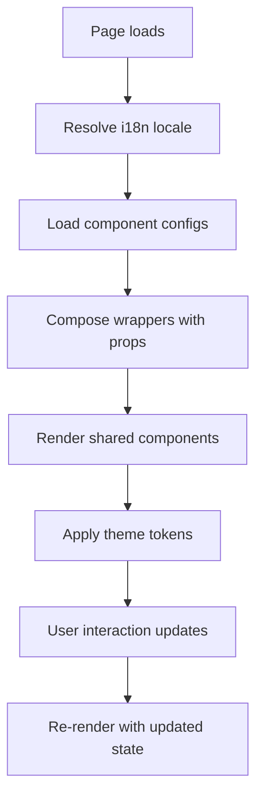
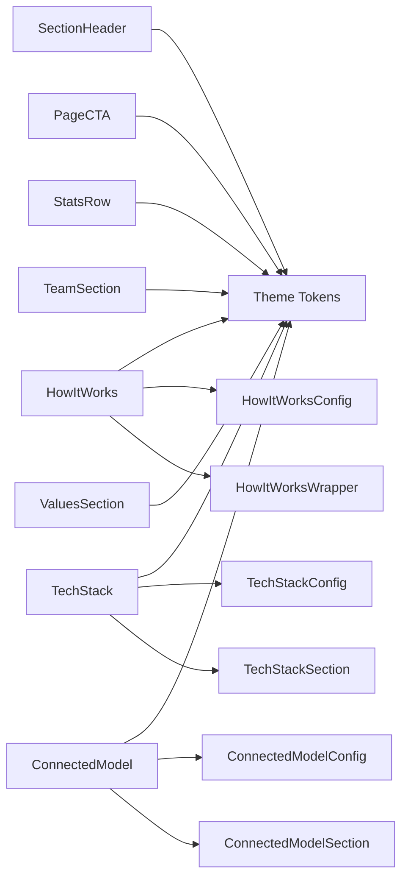

# Shared Business Components

<cite>
**Referenced Files in This Document**
- [SectionHeader.tsx](file://components/shared/SectionHeader.tsx)
- [HowItWorks.tsx](file://components/shared/HowItWorks.tsx)
- [PageCTA.tsx](file://components/shared/PageCTA.tsx)
- [StatsRow.tsx](file://components/shared/StatsRow.tsx)
- [TeamSection.tsx](file://components/shared/TeamSection.tsx)
- [TechStack.tsx](file://components/shared/TechStack.tsx)
- [ValuesSection.tsx](file://components/shared/ValuesSection.tsx)
- [ConnectedModel.tsx](file://components/shared/ConnectedModel.tsx)
- [index.ts](file://components/shared/index.ts)
- [HowItWorksConfig.tsx](file://config/HowItWorksConfig.tsx)
- [TechStackConfig.tsx](file://config/TechStackConfig.tsx)
- [ConnectedModelConfig.tsx](file://config/ConnectedModelConfig.tsx)
- [ConnectedModelSection.tsx](file://app/[locale]/_components/Wrappers/ConnectedModelSection.tsx)
- [HowItWorksWrapper.tsx](file://app/[locale]/_components/Wrappers/HowItWorksWrapper.tsx)
- [TechStackSection.tsx](file://app/[locale]/_components/Wrappers/TechStackSection.tsx)
- [SafeHTML.tsx](file://components/shared/SafeHTML.tsx)
- [Timeline.tsx](file://components/shared/Timeline.tsx)
</cite>

## Table of Contents
1. [Introduction](#introduction)
2. [Project Structure](#project-structure)
3. [Core Components](#core-components)
4. [Architecture Overview](#architecture-overview)
5. [Detailed Component Analysis](#detailed-component-analysis)
6. [Dependency Analysis](#dependency-analysis)
7. [Performance Considerations](#performance-considerations)
8. [Troubleshooting Guide](#troubleshooting-guide)
9. [Conclusion](#conclusion)
10. [Appendices](#appendices)

## Introduction
This document describes the shared business components that encapsulate complex functionality and presentation logic across the application. It explains component architecture patterns, prop interfaces, data flow strategies, and integration with internationalization and theming systems. It also provides configuration examples, customization options, and guidelines for creating new shared components while maintaining consistency.

The shared components include:
- SectionHeader
- HowItWorks
- PageCTA
- StatsRow
- TeamSection
- TechStack
- ValuesSection
- ConnectedModel

These components are organized under a shared library and consumed via page-level wrappers to support content-driven rendering and localization.

## Project Structure
Shared business components live in a dedicated folder and are re-exported through an index file. Pages consume these components either directly or via wrapper components that provide configuration and layout context. Configuration files centralize content and behavior for specific components.

**Diagram sources**
- [index.ts](file://components/shared/index.ts)
- [HowItWorksWrapper.tsx](file://app/[locale]/_components/Wrappers/HowItWorksWrapper.tsx)
- [TechStackSection.tsx](file://app/[locale]/_components/Wrappers/TechStackSection.tsx)
- [ConnectedModelSection.tsx](file://app/[locale]/_components/Wrappers/ConnectedModelSection.tsx)
- [HowItWorksConfig.tsx](file://config/HowItWorksConfig.tsx)
- [TechStackConfig.tsx](file://config/TechStackConfig.tsx)
- [ConnectedModelConfig.tsx](file://config/ConnectedModelConfig.tsx)

**Section sources**
- [index.ts](file://components/shared/index.ts)
- [HowItWorksWrapper.tsx](file://app/[locale]/_components/Wrappers/HowItWorksWrapper.tsx)
- [TechStackSection.tsx](file://app/[locale]/_components/Wrappers/TechStackSection.tsx)
- [ConnectedModelSection.tsx](file://app/[locale]/_components/Wrappers/ConnectedModelSection.tsx)
- [HowItWorksConfig.tsx](file://config/HowItWorksConfig.tsx)
- [TechStackConfig.tsx](file://config/TechStackConfig.tsx)
- [ConnectedModelConfig.tsx](file://config/ConnectedModelConfig.tsx)

## Core Components
This section summarizes each shared component’s purpose, typical props, and usage patterns. For exact prop types and defaults, refer to the source files listed below.

- SectionHeader
  - Purpose: Renders a consistent heading block with optional subtitle and alignment controls.
  - Typical props: title, subtitle, align, className, id.
  - Integration: Used by many pages to standardize section titles; supports i18n keys and theme-aware styles.
  - Customization: Override via className, adjust alignment, or pass localized strings.

- HowItWorks
  - Purpose: Displays a step-by-step process visualization.
  - Typical props: steps array (title, description, icon), layout variants, spacing.
  - Data flow: Consumed via HowItWorksWrapper which injects localized content from HowItWorksConfig.
  - Customization: Extend steps, swap icons, or adjust layout through config.

- PageCTA
  - Purpose: A call-to-action banner with headline, description, and action button(s).
  - Typical props: headline, description, actions (label, href, variant), alignment.
  - Integration: Often placed at the bottom of pages to drive conversions.
  - Customization: Provide multiple actions, change visual emphasis, localize labels.

- StatsRow
  - Purpose: Presents key metrics in a responsive grid.
  - Typical props: stats array (value, label, suffix/prefix), layout, animation flags.
  - Integration: Can be paired with analytics or fetched data; supports i18n formatting.
  - Customization: Add more stat items, customize number formatting, or adjust grid density.

- TeamSection
  - Purpose: Showcases team members with images, names, roles, and links.
  - Typical props: members array (name, role, image, socialLinks), layout, spacing.
  - Integration: Content can be static or loaded from a CMS; supports accessibility attributes.
  - Customization: Add fields like bio or tags; control link targets and image loading behavior.

- TechStack
  - Purpose: Highlights technologies used, often as logos or badges.
  - Typical props: items array (name, logoUrl, url), layout, tooltip behavior.
  - Data flow: Consumed via TechStackSection wrapper using TechStackConfig.
  - Customization: Update tech list, add tooltips, or change link behavior.

- ValuesSection
  - Purpose: Communicates core values with icons and short descriptions.
  - Typical props: values array (title, description, icon), columns, spacing.
  - Integration: Works well with theme tokens for colors and typography.
  - Customization: Adjust column count, swap icons, or localize text.

- ConnectedModel
  - Purpose: Generic container that connects UI to a data model or API, handling loading, error, and success states.
  - Typical props: modelId, render function or slot, query params, error boundary behavior.
  - Data flow: Uses a configuration object (ConnectedModelConfig) to define endpoints, caching, and mapping.
  - Integration: Wrapped by ConnectedModelSection to provide page-level context and fallbacks.
  - Customization: Define custom fetchers, transform responses, and handle errors per model.

**Section sources**
- [SectionHeader.tsx](file://components/shared/SectionHeader.tsx)
- [HowItWorks.tsx](file://components/shared/HowItWorks.tsx)
- [PageCTA.tsx](file://components/shared/PageCTA.tsx)
- [StatsRow.tsx](file://components/shared/StatsRow.tsx)
- [TeamSection.tsx](file://components/shared/TeamSection.tsx)
- [TechStack.tsx](file://components/shared/TechStack.tsx)
- [ValuesSection.tsx](file://components/shared/ValuesSection.tsx)
- [ConnectedModel.tsx](file://components/shared/ConnectedModel.tsx)

## Architecture Overview
The shared components follow a layered pattern:
- Presentation layer: Pure components focused on rendering and UX.
- Configuration layer: Centralized content and behavior definitions.
- Wrapper layer: Page-specific composition that wires configuration into components.
- Data layer: Optional fetching and state management within components or via ConnectedModel.

**Diagram sources**
- [HowItWorksWrapper.tsx](file://app/[locale]/_components/Wrappers/HowItWorksWrapper.tsx)
- [HowItWorksConfig.tsx](file://config/HowItWorksConfig.tsx)
- [HowItWorks.tsx](file://components/shared/HowItWorks.tsx)

## Detailed Component Analysis

### SectionHeader
- Responsibilities:
  - Render a standardized heading area with optional subtitle and alignment.
  - Support accessibility attributes and semantic HTML structure.
- Prop interface highlights:
  - title: string | ReactNode
  - subtitle?: string | ReactNode
  - align?: "left" | "center" | "right"
  - className?: string
  - id?: string
- Data flow:
  - Typically receives localized strings from page context or i18n hooks.
- Theming:
  - Uses theme tokens for typography and spacing; adapts to dark/light modes.
- Internationalization:
  - Accepts pre-localized strings; can integrate with i18n keys if needed.
- Usage example path:
  - See how it is composed in page layouts or other sections.

**Section sources**
- [SectionHeader.tsx](file://components/shared/SectionHeader.tsx)

### HowItWorks
- Responsibilities:
  - Visualize multi-step processes with consistent styling and responsive layout.
- Prop interface highlights:
  - steps: Array<{ title, description, icon? }>
  - layout?: "vertical" | "horizontal" | "cards"
  - spacing?: "sm" | "md" | "lg"
- Data flow:
  - Consumed via HowItWorksWrapper which reads HowItWorksConfig and resolves i18n.
- Theming:
  - Applies theme-based colors, borders, and hover states.
- Internationalization:
  - Steps’ text should be localized; wrapper typically maps i18n keys to props.
- Customization:
  - Add new steps, replace icons, or switch layout variants via config.

**Diagram sources**
- [HowItWorks.tsx](file://components/shared/HowItWorks.tsx)
- [HowItWorksConfig.tsx](file://config/HowItWorksConfig.tsx)
- [HowItWorksWrapper.tsx](file://app/[locale]/_components/Wrappers/HowItWorksWrapper.tsx)

**Section sources**
- [HowItWorks.tsx](file://components/shared/HowItWorks.tsx)
- [HowItWorksConfig.tsx](file://config/HowItWorksConfig.tsx)
- [HowItWorksWrapper.tsx](file://app/[locale]/_components/Wrappers/HowItWorksWrapper.tsx)

### PageCTA
- Responsibilities:
  - Present a prominent call-to-action with headline, description, and one or more actions.
- Prop interface highlights:
  - headline: string | ReactNode
  - description?: string | ReactNode
  - actions: Array<{ label, href, variant?, target? }>
  - align?: "left" | "center" | "right"
- Data flow:
  - Props are usually provided by page content or CMS; actions may open external links or navigate internally.
- Theming:
  - Uses theme-aware button variants and background treatments.
- Internationalization:
  - Labels and copy should be localized before passing to the component.
- Accessibility:
  - Ensure buttons have proper aria-labels and keyboard navigation.

**Section sources**
- [PageCTA.tsx](file://components/shared/PageCTA.tsx)

### StatsRow
- Responsibilities:
  - Display key metrics in a responsive grid with optional animations.
- Prop interface highlights:
  - stats: Array<{ value, label, prefix?, suffix? }>
  - columns?: number
  - animate?: boolean
- Data flow:
  - Can receive static data or be fed by a data-fetching hook; supports formatted numbers.
- Theming:
  - Adapts to theme tokens for typography and contrast.
- Internationalization:
  - Use locale-aware number formatting where applicable.

**Section sources**
- [StatsRow.tsx](file://components/shared/StatsRow.tsx)

### TeamSection
- Responsibilities:
  - Showcase team members with images, roles, and social links.
- Prop interface highlights:
  - members: Array<{ name, role, image, socialLinks? }>
  - columns?: number
  - spacing?: "sm" | "md" | "lg"
- Data flow:
  - Static or dynamic content; images should be optimized and lazy-loaded.
- Theming:
  - Uses theme tokens for card backgrounds and borders.
- Internationalization:
  - Names and roles should be localized when necessary.

**Section sources**
- [TeamSection.tsx](file://components/shared/TeamSection.tsx)

### TechStack
- Responsibilities:
  - Highlight technologies with logos and optional links.
- Prop interface highlights:
  - items: Array<{ name, logoUrl, url?, tooltip? }>
  - layout?: "grid" | "list"
  - showTooltips?: boolean
- Data flow:
  - Consumed via TechStackSection wrapper using TechStackConfig.
- Theming:
  - Applies theme-aware hover effects and contrast.
- Internationalization:
  - Tooltips and labels can be localized.

**Diagram sources**
- [TechStackSection.tsx](file://app/[locale]/_components/Wrappers/TechStackSection.tsx)
- [TechStackConfig.tsx](file://config/TechStackConfig.tsx)
- [TechStack.tsx](file://components/shared/TechStack.tsx)

**Section sources**
- [TechStack.tsx](file://components/shared/TechStack.tsx)
- [TechStackConfig.tsx](file://config/TechStackConfig.tsx)
- [TechStackSection.tsx](file://app/[locale]/_components/Wrappers/TechStackSection.tsx)

### ValuesSection
- Responsibilities:
  - Communicate core values with icons and concise descriptions.
- Prop interface highlights:
  - values: Array<{ title, description, icon? }>
  - columns?: number
  - spacing?: "sm" | "md" | "lg"
- Data flow:
  - Usually static or CMS-driven; can be extended with additional metadata.
- Theming:
  - Uses theme tokens for icons and backgrounds.
- Internationalization:
  - Titles and descriptions should be localized.

**Section sources**
- [ValuesSection.tsx](file://components/shared/ValuesSection.tsx)

### ConnectedModel
- Responsibilities:
  - Connect UI to a data model or API endpoint with built-in loading, error, and success states.
- Prop interface highlights:
  - modelId: string
  - params?: Record<string, any>
  - render?: (data, state) => ReactNode
  - onError?: (error) => void
  - onSuccess?: (data) => void
- Data flow:
  - Reads configuration from ConnectedModelConfig to determine endpoints, caching, and transformations.
  - Wrapper ConnectedModelSection provides page-level context and fallbacks.
- Error handling:
  - Supports retry, timeout, and user-friendly error messages.
- Performance:
  - Implements caching and debouncing where appropriate.

**Diagram sources**
- [ConnectedModel.tsx](file://components/shared/ConnectedModel.tsx)
- [ConnectedModelConfig.tsx](file://config/ConnectedModelConfig.tsx)
- [ConnectedModelSection.tsx](file://app/[locale]/_components/Wrappers/ConnectedModelSection.tsx)

**Section sources**
- [ConnectedModel.tsx](file://components/shared/ConnectedModel.tsx)
- [ConnectedModelConfig.tsx](file://config/ConnectedModelConfig.tsx)
- [ConnectedModelSection.tsx](file://app/[locale]/_components/Wrappers/ConnectedModelSection.tsx)

### Conceptual Overview
The following conceptual diagram shows how shared components fit into a page’s lifecycle, including i18n and theming integration.

[No sources needed since this diagram shows conceptual workflow, not actual code structure]

## Dependency Analysis
Shared components depend on:
- Theming system for consistent visuals.
- i18n system for localized strings.
- Configuration files for content-driven behavior.
- Wrappers for page-level composition and context.

**Diagram sources**
- [HowItWorks.tsx](file://components/shared/HowItWorks.tsx)
- [TechStack.tsx](file://components/shared/TechStack.tsx)
- [ConnectedModel.tsx](file://components/shared/ConnectedModel.tsx)
- [HowItWorksConfig.tsx](file://config/HowItWorksConfig.tsx)
- [TechStackConfig.tsx](file://config/TechStackConfig.tsx)
- [ConnectedModelConfig.tsx](file://config/ConnectedModelConfig.tsx)
- [HowItWorksWrapper.tsx](file://app/[locale]/_components/Wrappers/HowItWorksWrapper.tsx)
- [TechStackSection.tsx](file://app/[locale]/_components/Wrappers/TechStackSection.tsx)
- [ConnectedModelSection.tsx](file://app/[locale]/_components/Wrappers/ConnectedModelSection.tsx)

**Section sources**
- [index.ts](file://components/shared/index.ts)
- [HowItWorks.tsx](file://components/shared/HowItWorks.tsx)
- [TechStack.tsx](file://components/shared/TechStack.tsx)
- [ConnectedModel.tsx](file://components/shared/ConnectedModel.tsx)

## Performance Considerations
- Prefer memoization for expensive computations in components that accept large arrays (e.g., TeamSection, StatsRow).
- Use lazy loading for images in TeamSection and TechStack to improve initial load times.
- Implement caching policies in ConnectedModel to reduce redundant network requests.
- Avoid unnecessary re-renders by stabilizing props and using stable references for callbacks.
- Keep configurations immutable to prevent unintended re-computation.

[No sources needed since this section provides general guidance]

## Troubleshooting Guide
- Missing localized strings:
  - Ensure all i18n keys resolve correctly; verify language files contain required entries.
- Incorrect config shapes:
  - Validate config objects match expected prop interfaces; use TypeScript to catch mismatches early.
- Network errors in ConnectedModel:
  - Check endpoint URLs, method types, and response transformations; implement robust error boundaries.
- Theme inconsistencies:
  - Confirm theme tokens exist for colors and typography used by components.
- Accessibility issues:
  - Verify aria attributes, focus management, and keyboard navigation for interactive elements.

**Section sources**
- [ConnectedModel.tsx](file://components/shared/ConnectedModel.tsx)
- [SafeHTML.tsx](file://components/shared/SafeHTML.tsx)
- [Timeline.tsx](file://components/shared/Timeline.tsx)

## Conclusion
The shared business components provide a consistent, configurable, and accessible foundation for building pages. By leveraging wrappers and configuration files, teams can maintain content-driven rendering, support internationalization, and apply theming uniformly. Following the guidelines here will help create new components that integrate seamlessly and remain maintainable over time.

[No sources needed since this section summarizes without analyzing specific files]

## Appendices

### Guidelines for Creating New Shared Components
- Keep components pure and focused on a single responsibility.
- Define clear prop interfaces with TypeScript; prefer explicit types over any.
- Support i18n by accepting localized strings or integrating with i18n hooks.
- Use theme tokens for colors, typography, and spacing.
- Provide sensible defaults and allow overrides via props.
- Include accessibility attributes and keyboard support.
- Add unit tests for critical logic and edge cases.
- Document usage patterns and examples in the component’s README or comments.

[No sources needed since this section provides general guidance]