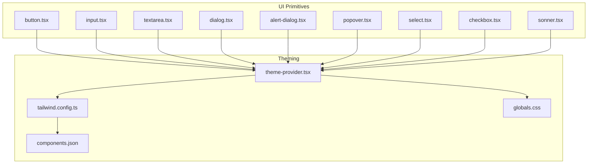
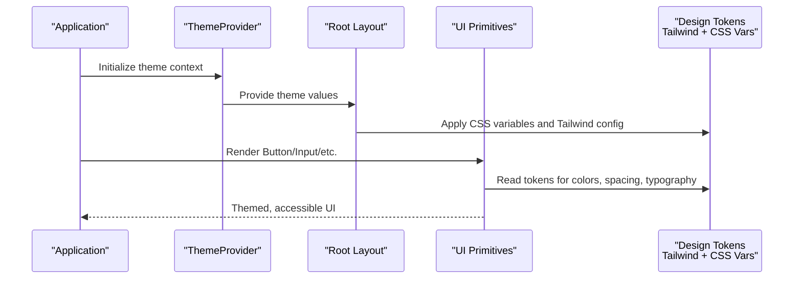
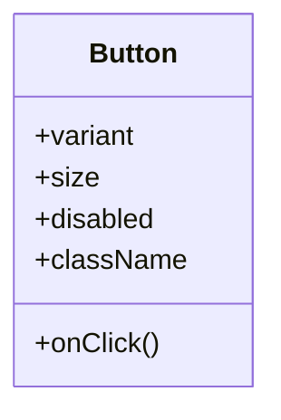
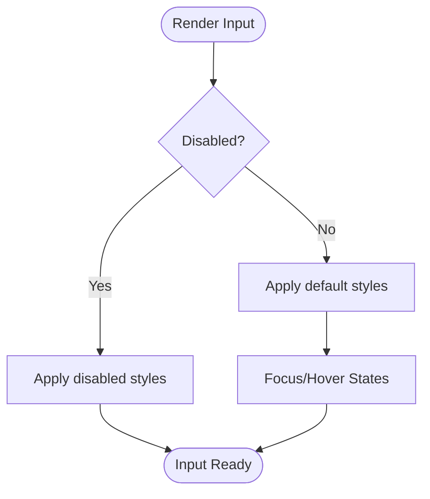
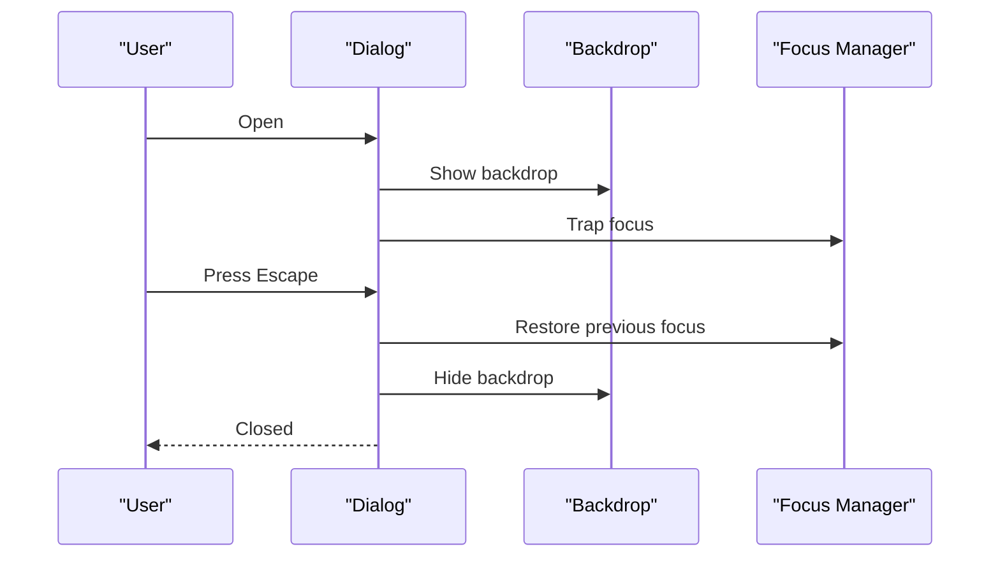
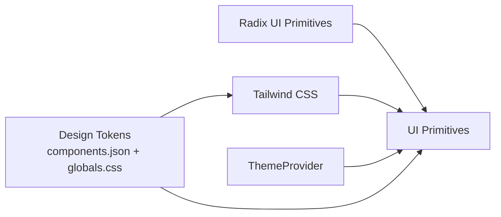

# UI Components

<cite>
**Referenced Files in This Document**
- [components.json](file://components.json)
- [tailwind.config.ts](file://tailwind.config.ts)
- [providers/theme-provider.tsx](file://providers/theme-provider.tsx)
- [components/ui/button.tsx](file://components/ui/button.tsx)
- [components/ui/input.tsx](file://components/ui/input.tsx)
- [components/ui/textarea.tsx](file://components/ui/textarea.tsx)
- [components/ui/dialog.tsx](file://components/ui/dialog.tsx)
- [components/ui/alert-dialog.tsx](file://components/ui/alert-dialog.tsx)
- [components/ui/popover.tsx](file://components/ui/popover.tsx)
- [components/ui/select.tsx](file://components/ui/select.tsx)
- [components/ui/checkbox.tsx](file://components/ui/checkbox.tsx)
- [components/ui/sonner.tsx](file://components/ui/sonner.tsx)
- [app/globals.css](file://app/globals.css)
</cite>

## Table of Contents
1. [Introduction](#introduction)
2. [Project Structure](#project-structure)
3. [Core Components](#core-components)
4. [Architecture Overview](#architecture-overview)
5. [Detailed Component Analysis](#detailed-component-analysis)
6. [Dependency Analysis](#dependency-analysis)
7. [Performance Considerations](#performance-considerations)
8. [Troubleshooting Guide](#troubleshooting-guide)
9. [Conclusion](#conclusion)
10. [Appendices](#appendices)

## Introduction
This document describes the base UI component library built on Shadcn UI and Radix UI primitives, integrated with Tailwind CSS for styling and theming. It explains how components are composed, how theme tokens are defined and consumed, and how to customize and extend components while maintaining consistency across the application. The guide also covers accessibility features, responsive behavior patterns, and best practices for extending existing components.

## Project Structure
The UI layer is organized under a dedicated components directory, with each primitive exposed as a standalone file. Theming and design tokens are centralized in configuration files and global styles. A theme provider initializes color schemes and dark mode at runtime.

**Diagram sources**
- [components/ui/button.tsx](file://components/ui/button.tsx)
- [components/ui/input.tsx](file://components/ui/input.tsx)
- [components/ui/textarea.tsx](file://components/ui/textarea.tsx)
- [components/ui/dialog.tsx](file://components/ui/dialog.tsx)
- [components/ui/alert-dialog.tsx](file://components/ui/alert-dialog.tsx)
- [components/ui/popover.tsx](file://components/ui/popover.tsx)
- [components/ui/select.tsx](file://components/ui/select.tsx)
- [components/ui/checkbox.tsx](file://components/ui/checkbox.tsx)
- [components/ui/sonner.tsx](file://components/ui/sonner.tsx)
- [providers/theme-provider.tsx](file://providers/theme-provider.tsx)
- [tailwind.config.ts](file://tailwind.config.ts)
- [components.json](file://components.json)
- [app/globals.css](file://app/globals.css)

**Section sources**
- [components.json](file://components.json)
- [tailwind.config.ts](file://tailwind.config.ts)
- [providers/theme-provider.tsx](file://providers/theme-provider.tsx)
- [app/globals.css](file://app/globals.css)

## Core Components
The following primitives are provided out of the box. Each component composes Radix UI primitives and applies consistent styling via Tailwind classes and CSS variables.

- Button: Primary interactive element with variants for style and size. Supports disabled state and keyboard navigation.
- Input: Standard text input with label support, focus states, and error styling hooks.
- Textarea: Multi-line input with resizable behavior and consistent spacing.
- Dialog: Modal overlay with focus trapping, backdrop handling, and accessible title/description semantics.
- Alert Dialog: Confirmation dialog with destructive actions and clear affordances.
- Popover: Floating content anchored to a trigger with positioning and focus management.
- Select: Accessible dropdown with keyboard navigation and option groups.
- Checkbox: Binary toggle with indeterminate state and label association.
- Sonner: Toast notifications for success, warning, and error feedback.

Key characteristics:
- Props: Each component exposes props for variant selection, size, disabled state, and event handlers.
- Variants: Style and size variants are applied through conditional class composition.
- Styling: Tailwind utility classes combined with CSS custom properties ensure theme-aware rendering.
- Accessibility: Built-in ARIA attributes, focus management, and keyboard interactions follow Radix defaults.

Usage examples (paths only):
- Button usage example path: [components/ui/button.tsx](file://components/ui/button.tsx)
- Input usage example path: [components/ui/input.tsx](file://components/ui/input.tsx)
- Textarea usage example path: [components/ui/textarea.tsx](file://components/ui/textarea.tsx)
- Dialog usage example path: [components/ui/dialog.tsx](file://components/ui/dialog.tsx)
- Alert Dialog usage example path: [components/ui/alert-dialog.tsx](file://components/ui/alert-dialog.tsx)
- Popover usage example path: [components/ui/popover.tsx](file://components/ui/popover.tsx)
- Select usage example path: [components/ui/select.tsx](file://components/ui/select.tsx)
- Checkbox usage example path: [components/ui/checkbox.tsx](file://components/ui/checkbox.tsx)
- Sonner usage example path: [components/ui/sonner.tsx](file://components/ui/sonner.tsx)

**Section sources**
- [components/ui/button.tsx](file://components/ui/button.tsx)
- [components/ui/input.tsx](file://components/ui/input.tsx)
- [components/ui/textarea.tsx](file://components/ui/textarea.tsx)
- [components/ui/dialog.tsx](file://components/ui/dialog.tsx)
- [components/ui/alert-dialog.tsx](file://components/ui/alert-dialog.tsx)
- [components/ui/popover.tsx](file://components/ui/popover.tsx)
- [components/ui/select.tsx](file://components/ui/select.tsx)
- [components/ui/checkbox.tsx](file://components/ui/checkbox.tsx)
- [components/ui/sonner.tsx](file://components/ui/sonner.tsx)

## Architecture Overview
The UI architecture layers primitives over Radix UI, applies Tailwind-based styling, and integrates a theme provider that toggles color schemes and updates CSS variables. Design tokens are defined centrally and consumed by components.

**Diagram sources**
- [providers/theme-provider.tsx](file://providers/theme-provider.tsx)
- [tailwind.config.ts](file://tailwind.config.ts)
- [components.json](file://components.json)
- [app/globals.css](file://app/globals.css)
- [components/ui/button.tsx](file://components/ui/button.tsx)
- [components/ui/input.tsx](file://components/ui/input.tsx)

## Detailed Component Analysis

### Button
- Purpose: Primary action control with multiple visual variants and sizes.
- Props:
  - variant: Controls visual style (e.g., default, secondary, destructive).
  - size: Controls dimensions (e.g., sm, md, lg).
  - disabled: Disables interaction and applies reduced opacity.
  - className: Additional Tailwind classes for overrides.
  - onClick: Click handler.
- Variants:
  - Style variants map to different background, border, and text colors.
  - Size variants adjust padding and font size.
- Styling:
  - Uses Tailwind utilities and CSS variables for theme-aware colors.
  - Focus ring and hover states are consistently applied.
- Accessibility:
  - Keyboard navigable, supports Enter/Space activation.
  - Disabled state sets aria-disabled appropriately.
- Composition pattern:
  - Accepts children and forwards ref for advanced use cases.
- Customization:
  - Extend variants by adding new class compositions.
  - Override default sizes or add new ones via className.

**Diagram sources**
- [components/ui/button.tsx](file://components/ui/button.tsx)

**Section sources**
- [components/ui/button.tsx](file://components/ui/button.tsx)

### Input
- Purpose: Single-line text input with label integration and validation styling.
- Props:
  - type: Input type (text, email, password, etc.).
  - placeholder: Placeholder text.
  - disabled: Disables input and reduces interactivity.
  - value / onChange: Controlled input pattern.
  - className: Additional Tailwind classes.
  - id / name: For form association and submission.
- Styling:
  - Consistent borders, focus rings, and disabled states.
  - Error state can be applied via className or wrapper components.
- Accessibility:
  - Associates with label via htmlFor/id.
  - Maintains proper tab order and focus visibility.
- Composition pattern:
  - Often wrapped with label and helper/error text.

**Diagram sources**
- [components/ui/input.tsx](file://components/ui/input.tsx)

**Section sources**
- [components/ui/input.tsx](file://components/ui/input.tsx)

### Textarea
- Purpose: Multi-line text input with consistent spacing and resizing behavior.
- Props:
  - rows: Number of visible rows.
  - placeholder: Placeholder text.
  - disabled: Disables input.
  - value / onChange: Controlled input pattern.
  - className: Additional Tailwind classes.
- Styling:
  - Matches Input styling for consistency.
  - Resizable vertically by default.
- Accessibility:
  - Label association via htmlFor/id.
  - Proper focus and keyboard behavior.

**Section sources**
- [components/ui/textarea.tsx](file://components/ui/textarea.tsx)

### Dialog
- Purpose: Modal overlay for focused tasks and confirmations.
- Props:
  - open / onOpenChange: Controlled visibility.
  - title: Dialog title.
  - description: Optional description for accessibility.
  - className: Additional Tailwind classes.
- Behavior:
  - Focus trapping inside modal.
  - Backdrop click closes dialog.
  - Escape key closes dialog.
- Accessibility:
  - Role="dialog", aria-modal, aria-labelledby, aria-describedby.
  - Focus restoration on close.

**Diagram sources**
- [components/ui/dialog.tsx](file://components/ui/dialog.tsx)

**Section sources**
- [components/ui/dialog.tsx](file://components/ui/dialog.tsx)

### Alert Dialog
- Purpose: Confirmation dialog with destructive actions.
- Props:
  - open / onOpenChange: Controlled visibility.
  - title: Title for confirmation.
  - description: Contextual description.
  - className: Additional Tailwind classes.
- Behavior:
  - Similar to Dialog but emphasizes destructive actions.
  - Prevents accidental dismissals when needed.
- Accessibility:
  - Uses appropriate roles and labels.
  - Focus management consistent with Dialog.

**Section sources**
- [components/ui/alert-dialog.tsx](file://components/ui/alert-dialog.tsx)

### Popover
- Purpose: Floating content anchored to a trigger.
- Props:
  - open / onOpenChange: Controlled visibility.
  - align: Horizontal alignment relative to trigger.
  - side: Vertical placement (top, bottom, left, right).
  - className: Additional Tailwind classes.
- Behavior:
  - Auto-positioning to avoid overflow.
  - Closes on outside click and Escape.
- Accessibility:
  - Associated with trigger via aria-expanded and aria-controls.
  - Focus management between trigger and popover content.

**Section sources**
- [components/ui/popover.tsx](file://components/ui/popover.tsx)

### Select
- Purpose: Accessible dropdown select with keyboard navigation.
- Props:
  - value / onValueChange: Controlled selection.
  - placeholder: Placeholder text.
  - disabled: Disables selection.
  - className: Additional Tailwind classes.
- Behavior:
  - Option groups supported.
  - Arrow keys navigate options; Enter selects.
- Accessibility:
  - Roles for listbox and option.
  - Live region announcements for selected value.

**Section sources**
- [components/ui/select.tsx](file://components/ui/select.tsx)

### Checkbox
- Purpose: Binary toggle with optional indeterminate state.
- Props:
  - checked / onCheckedChange: Controlled state.
  - disabled: Disables toggle.
  - className: Additional Tailwind classes.
- Behavior:
  - Space toggles state.
  - Indeterminate state visually distinct.
- Accessibility:
  - aria-checked reflects state.
  - Label association via htmlFor/id.

**Section sources**
- [components/ui/checkbox.tsx](file://components/ui/checkbox.tsx)

### Sonner
- Purpose: Toast notifications for user feedback.
- Props:
  - type: Success, warning, error, info.
  - title: Main message.
  - description: Secondary message.
  - duration: Display time.
  - className: Additional Tailwind classes.
- Behavior:
  - Stacks multiple toasts.
  - Auto-dismiss after duration.
- Accessibility:
  - Announces messages via live regions.
  - Focus remains on current interaction.

**Section sources**
- [components/ui/sonner.tsx](file://components/ui/sonner.tsx)

## Dependency Analysis
Components depend on Radix UI primitives for behavior and accessibility, and on Tailwind CSS for styling. The theme provider injects color scheme context, which influences CSS variables consumed by components.

**Diagram sources**
- [components/ui/button.tsx](file://components/ui/button.tsx)
- [components/ui/input.tsx](file://components/ui/input.tsx)
- [components/ui/dialog.tsx](file://components/ui/dialog.tsx)
- [providers/theme-provider.tsx](file://providers/theme-provider.tsx)
- [tailwind.config.ts](file://tailwind.config.ts)
- [components.json](file://components.json)
- [app/globals.css](file://app/globals.css)

**Section sources**
- [tailwind.config.ts](file://tailwind.config.ts)
- [components.json](file://components.json)
- [providers/theme-provider.tsx](file://providers/theme-provider.tsx)
- [app/globals.css](file://app/globals.css)

## Performance Considerations
- Prefer controlled components where state needs to be synchronized with parent logic.
- Avoid excessive re-renders by memoizing expensive children passed into dialogs or popovers.
- Use lazy loading for heavy content within modals if necessary.
- Keep token definitions minimal and reuse variables to reduce CSS bloat.
- Limit deep nesting in overlays to improve focus management performance.

[No sources needed since this section provides general guidance]

## Troubleshooting Guide
Common issues and resolutions:
- Theme not applying: Ensure the theme provider wraps the app root and that CSS variables are present in globals.css.
- Focus not trapped in dialogs: Verify that the dialog is mounted and that focus trap is enabled by the underlying primitive.
- Popover mispositioned: Adjust align/side props or container constraints to prevent overflow clipping.
- Select keyboard navigation broken: Confirm that the select is not disabled and that options have unique values.
- Checkbox indeterminate not updating: Ensure controlled state is correctly managed and aria-checked reflects the actual state.
- Toasts not announcing: Check screen reader settings and ensure live regions are active.

**Section sources**
- [providers/theme-provider.tsx](file://providers/theme-provider.tsx)
- [components/ui/dialog.tsx](file://components/ui/dialog.tsx)
- [components/ui/popover.tsx](file://components/ui/popover.tsx)
- [components/ui/select.tsx](file://components/ui/select.tsx)
- [components/ui/checkbox.tsx](file://components/ui/checkbox.tsx)
- [components/ui/sonner.tsx](file://components/ui/sonner.tsx)
- [app/globals.css](file://app/globals.css)

## Conclusion
The UI component library leverages Radix UI for robust behavior and accessibility, Tailwind CSS for consistent styling, and a centralized theme system for cohesive design tokens. By composing primitives with predictable props and variants, teams can maintain consistency, scale customization, and deliver accessible interfaces efficiently.

[No sources needed since this section summarizes without analyzing specific files]

## Appendices

### Design System Tokens
- Colors: Defined via CSS variables and referenced in Tailwind configuration.
- Typography: Font families, sizes, and line heights configured in Tailwind.
- Spacing: Consistent spacing scale used across components.
- Borders and Shadows: Tokenized for consistent elevation and outlines.
- Dark Mode: Toggled via theme provider, updating CSS variables.

**Section sources**
- [tailwind.config.ts](file://tailwind.config.ts)
- [components.json](file://components.json)
- [app/globals.css](file://app/globals.css)
- [providers/theme-provider.tsx](file://providers/theme-provider.tsx)

### Responsive Behavior Patterns
- Breakpoints: Configured in Tailwind; components adapt using utility classes.
- Fluid sizing: Prefer relative units and tokens for scalable layouts.
- Overlay behavior: Dialogs and popovers adjust positioning based on viewport constraints.

**Section sources**
- [tailwind.config.ts](file://tailwind.config.ts)
- [components/ui/dialog.tsx](file://components/ui/dialog.tsx)
- [components/ui/popover.tsx](file://components/ui/popover.tsx)

### Best Practices for Extending Components
- Create wrapper components to encapsulate domain-specific logic.
- Add new variants by extending prop types and class compositions.
- Maintain accessibility by preserving ARIA attributes and focus management.
- Use className for minor overrides; prefer tokens for major changes.
- Test keyboard navigation and screen reader announcements for new variants.

[No sources needed since this section provides general guidance]