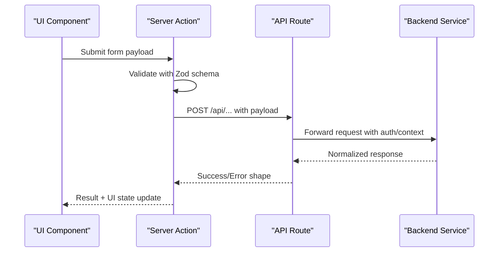
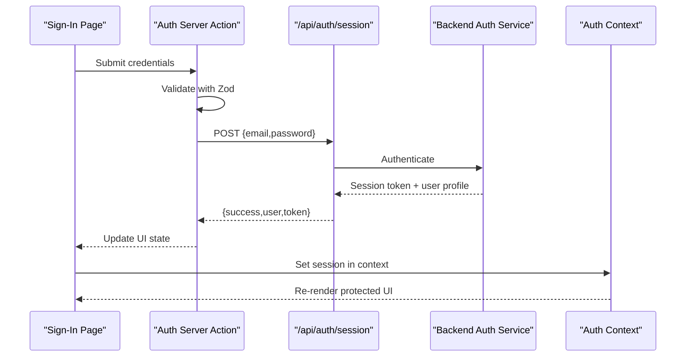
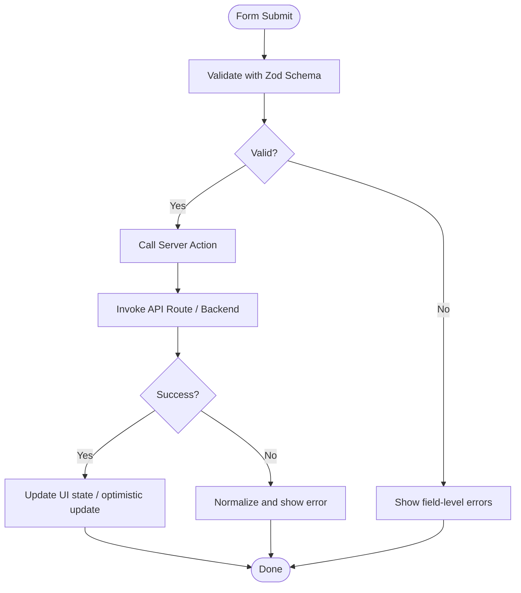
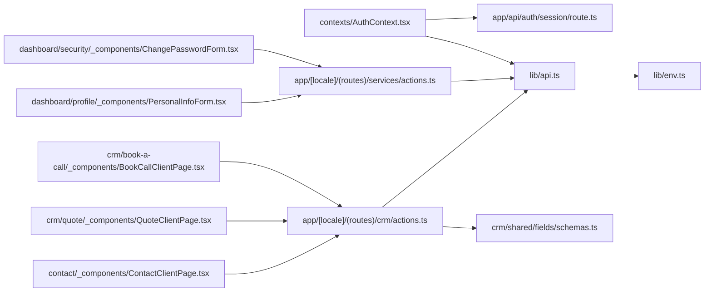

# Data Flow Patterns

<cite>
**Referenced Files in This Document**
- [api.ts](file://lib/api.ts)
- [auth.ts](file://lib/auth.ts)
- [env.ts](file://lib/env.ts)
- [AuthContext.tsx](file://contexts/AuthContext.tsx)
- [route.ts](file://app/api/auth/session/route.ts)
- [route.ts](file://app/api/contact/route.ts)
- [actions.ts](file://app/[locale]/(routes)/crm/actions.ts)
- [actions.ts](file://app/[locale]/(routes)/services/actions.ts)
- [schemas.ts](file://app/[locale]/(routes)/crm/_components/crm-shared/fields/schemas.ts)
- [useCrmFormSubmit.ts](file://app/[locale]/(routes)/crm/_components/crm-shared/hooks/useCrmFormSubmit.ts)
- [ContactClientPage.tsx](file://app/[locale]/(routes)/contact/_components/ContactClientPage.tsx)
- [QuoteClientPage.tsx](file://app/[locale]/(routes)/crm/quote/_components/QuoteClientPage.tsx)
- [BookCallClientPage.tsx](file://app/[locale]/(routes)/crm/book-a-call/_components/BookCallClientPage.tsx)
- [PersonalInfoForm.tsx](file://app/[locale]/dashboard/(routes)/profile/_components/PersonalInfoForm.tsx)
- [ChangePasswordForm.tsx](file://app/[locale]/dashboard/(routes)/security/_components/ChangePasswordForm.tsx)
- [NextJS Guide CRM](file://doc/AUTOMEX_CRM_API_NextJS_Guide.md)
- [NextJS Guide Content](file://doc/AUTOMEX_Content_API_NextJS_Guide.md)
</cite>

## Table of Contents
1. [Introduction](#introduction)
2. [Project Structure](#project-structure)
3. [Core Components](#core-components)
4. [Architecture Overview](#architecture-overview)
5. [Detailed Component Analysis](#detailed-component-analysis)
6. [Dependency Analysis](#dependency-analysis)
7. [Performance Considerations](#performance-considerations)
8. [Troubleshooting Guide](#troubleshooting-guide)
9. [Conclusion](#conclusion)
10. [Appendices](#appendices)

## Introduction
This document explains the data flow patterns used across the Automex Frontend, focusing on:
- Centralized API communication layer and request/response handling
- Authentication data flow from client components to backend services
- Form submission patterns using Server Actions with Zod validation
- State synchronization, caching strategies, optimistic updates, and real-time considerations
- Data transformation patterns, environment variable management, and security considerations for data handling

The goal is to provide a clear mental model of how data moves through the application, where it is validated and transformed, and how errors are surfaced consistently.

## Project Structure
At a high level, the frontend organizes data flows around:
- A centralized API client for HTTP requests
- An authentication context that manages session state
- Next.js App Router API routes for server-side endpoints
- Server Actions for form submissions and mutations
- Shared Zod schemas for input validation
- Client pages and forms that orchestrate UI state and user interactions

```mermaid
graph TB
subgraph "Client"
Pages["Pages & Forms<br/>e.g., Contact, Quote, Book Call"]
AuthCtx["Auth Context"]
end
subgraph "API Layer"
ApiLib["Centralized API Client"]
ServerActions["Server Actions<br/>CRM, Services"]
ApiRoutes["App Router API Routes<br/>/api/auth/session, /api/contact"]
end
subgraph "Backend"
Backend["Automex Backend Services"]
end
Pages --> ApiLib
Pages --> ServerActions
Pages --> AuthCtx
ApiLib --> ApiRoutes
ServerActions --> ApiRoutes
ApiRoutes --> Backend
AuthCtx --> ApiRoutes
```

[No sources needed since this diagram shows conceptual workflow, not actual code structure]

## Core Components
- Centralized API client: Provides a single place to configure base URLs, headers, error normalization, and response parsing. It is reused by both client components and Server Actions when calling external APIs or internal routes.
- Authentication context: Holds session state, exposes login/logout/update methods, and coordinates calls to the session endpoint.
- Server Actions: Encapsulate mutation logic (create, update, delete), validate inputs with Zod, and call API routes or backend services. They return structured results consumed by client components.
- Zod schemas: Define strict input contracts for forms and API payloads, ensuring consistent validation across client and server paths.
- API routes: Act as thin server-side handlers that forward requests to backend services, attach auth context, and normalize responses.

Key responsibilities:
- Request/response normalization and error mapping
- Environment-driven configuration (base URLs, feature flags)
- Centralized logging and telemetry hooks
- Consistent success/error shapes returned to clients

**Section sources**
- [api.ts](file://lib/api.ts)
- [auth.ts](file://lib/auth.ts)
- [AuthContext.tsx](file://contexts/AuthContext.tsx)
- [actions.ts](file://app/[locale]/(routes)/crm/actions.ts)
- [actions.ts](file://app/[locale]/(routes)/services/actions.ts)
- [schemas.ts](file://app/[locale]/(routes)/crm/_components/crm-shared/fields/schemas.ts)

## Architecture Overview
The data flow follows a layered approach:
- Client components trigger actions (mutations or queries)
- Server Actions or API client handle validation and transformation
- API routes mediate between frontend and backend
- Backend services perform business logic and persist data
- Responses are normalized and propagated back to the UI



**Diagram sources**
- [actions.ts](file://app/[locale]/(routes)/crm/actions.ts)
- [actions.ts](file://app/[locale]/(routes)/services/actions.ts)
- [route.ts](file://app/api/auth/session/route.ts)
- [route.ts](file://app/api/contact/route.ts)

## Detailed Component Analysis

### Centralized API Communication Layer
Responsibilities:
- Base URL and header configuration via environment variables
- Standardized request/response wrappers
- Error normalization and retry/backoff hooks
- Optional caching and optimistic update helpers

Patterns:
- Use typed request functions per domain (auth, contact, crm)
- Return consistent result objects with success flag, data, and error details
- Attach auth tokens and tenant/context headers centrally

Security considerations:
- Never log sensitive fields
- Sanitize and validate all inputs before sending
- Enforce HTTPS and secure cookie policies at the route layer

**Section sources**
- [api.ts](file://lib/api.ts)
- [env.ts](file://lib/env.ts)

### Authentication Data Flow
End-to-end flow:
- Client component invokes login/register/reset-password action
- Server Action validates credentials with Zod
- Server Action calls session API route
- Session route authenticates against backend and returns session info
- Auth context updates local state and persists session securely



**Diagram sources**
- [AuthContext.tsx](file://contexts/AuthContext.tsx)
- [route.ts](file://app/api/auth/session/route.ts)

**Section sources**
- [AuthContext.tsx](file://contexts/AuthContext.tsx)
- [route.ts](file://app/api/auth/session/route.ts)

### Form Submission Patterns with Server Actions
Common pattern:
- Client page renders a form bound to a Server Action
- On submit, Server Action validates input with Zod
- If valid, Server Action calls API routes or backend services
- Returns a structured result; client updates UI accordingly

Examples:
- CRM contact and quote forms
- Services actions for content-related mutations
- Dashboard profile and security forms



**Diagram sources**
- [actions.ts](file://app/[locale]/(routes)/crm/actions.ts)
- [actions.ts](file://app/[locale]/(routes)/services/actions.ts)
- [schemas.ts](file://app/[locale]/(routes)/crm/_components/crm-shared/fields/schemas.ts)

**Section sources**
- [actions.ts](file://app/[locale]/(routes)/crm/actions.ts)
- [actions.ts](file://app/[locale]/(routes)/services/actions.ts)
- [schemas.ts](file://app/[locale]/(routes)/crm/_components/crm-shared/fields/schemas.ts)

### Client-Side Orchestration Hooks and Pages
- useCrmFormSubmit: Encapsulates CRM form lifecycle (validation, submission, loading, error states)
- ContactClientPage, QuoteClientPage, BookCallClientPage: Compose UI and actions for specific flows
- PersonalInfoForm, ChangePasswordForm: Demonstrate dashboard mutation patterns and feedback

These components rely on Server Actions and shared schemas to maintain consistency and reduce duplication.

**Section sources**
- [useCrmFormSubmit.ts](file://app/[locale]/(routes)/crm/_components/crm-shared/hooks/useCrmFormSubmit.ts)
- [ContactClientPage.tsx](file://app/[locale]/(routes)/contact/_components/ContactClientPage.tsx)
- [QuoteClientPage.tsx](file://app/[locale]/(routes)/crm/quote/_components/QuoteClientPage.tsx)
- [BookCallClientPage.tsx](file://app/[locale]/(routes)/crm/book-a-call/_components/BookCallClientPage.tsx)
- [PersonalInfoForm.tsx](file://app/[locale]/dashboard/(routes)/profile/_components/PersonalInfoForm.tsx)
- [ChangePasswordForm.tsx](file://app/[locale]/dashboard/(routes)/security/_components/ChangePasswordForm.tsx)

### Data Transformation Patterns
- Normalize backend payloads into stable client models
- Map enums and codes to display-friendly values
- Flatten nested structures for form bindings
- Apply default values and sanitization before rendering

Where applicable, transformations occur:
- In API client response wrappers
- Within Server Actions before returning to UI
- In context providers for global state

**Section sources**
- [api.ts](file://lib/api.ts)
- [AuthContext.tsx](file://contexts/AuthContext.tsx)

### Environment Variable Management
- Centralize environment access via an env utility
- Separate runtime vs build-time variables
- Provide typed getters with fallbacks and validation
- Avoid leaking secrets to the client; only expose safe variables

Best practices:
- Prefix environment keys clearly
- Validate required variables at startup
- Document which variables are exposed to the browser

**Section sources**
- [env.ts](file://lib/env.ts)

### Security Considerations for Data Handling
- Validate all inputs with Zod on both client and server
- Sanitize outputs and avoid injecting raw HTML without safeguards
- Use secure cookies and short-lived tokens for sessions
- Restrict CORS and enforce HTTPS
- Log only non-sensitive diagnostics

**Section sources**
- [schemas.ts](file://app/[locale]/(routes)/crm/_components/crm-shared/fields/schemas.ts)
- [route.ts](file://app/api/auth/session/route.ts)
- [route.ts](file://app/api/contact/route.ts)

## Dependency Analysis
High-level dependencies among key modules:



**Diagram sources**
- [api.ts](file://lib/api.ts)
- [env.ts](file://lib/env.ts)
- [AuthContext.tsx](file://contexts/AuthContext.tsx)
- [route.ts](file://app/api/auth/session/route.ts)
- [actions.ts](file://app/[locale]/(routes)/crm/actions.ts)
- [actions.ts](file://app/[locale]/(routes)/services/actions.ts)
- [schemas.ts](file://app/[locale]/(routes)/crm/_components/crm-shared/fields/schemas.ts)
- [ContactClientPage.tsx](file://app/[locale]/(routes)/contact/_components/ContactClientPage.tsx)
- [QuoteClientPage.tsx](file://app/[locale]/(routes)/crm/quote/_components/QuoteClientPage.tsx)
- [BookCallClientPage.tsx](file://app/[locale]/(routes)/crm/book-a-call/_components/BookCallClientPage.tsx)
- [PersonalInfoForm.tsx](file://app/[locale]/dashboard/(routes)/profile/_components/PersonalInfoForm.tsx)
- [ChangePasswordForm.tsx](file://app/[locale]/dashboard/(routes)/security/_components/ChangePasswordForm.tsx)

**Section sources**
- [api.ts](file://lib/api.ts)
- [env.ts](file://lib/env.ts)
- [AuthContext.tsx](file://contexts/AuthContext.tsx)
- [route.ts](file://app/api/auth/session/route.ts)
- [actions.ts](file://app/[locale]/(routes)/crm/actions.ts)
- [actions.ts](file://app/[locale]/(routes)/services/actions.ts)
- [schemas.ts](file://app/[locale]/(routes)/crm/_components/crm-shared/fields/schemas.ts)
- [ContactClientPage.tsx](file://app/[locale]/(routes)/contact/_components/ContactClientPage.tsx)
- [QuoteClientPage.tsx](file://app/[locale]/(routes)/crm/quote/_components/QuoteClientPage.tsx)
- [BookCallClientPage.tsx](file://app/[locale]/(routes)/crm/book-a-call/_components/BookCallClientPage.tsx)
- [PersonalInfoForm.tsx](file://app/[locale]/dashboard/(routes)/profile/_components/PersonalInfoForm.tsx)
- [ChangePasswordForm.tsx](file://app/[locale]/dashboard/(routes)/security/_components/ChangePasswordForm.tsx)

## Performance Considerations
- Prefer Server Actions for mutations to leverage streaming and partial revalidation
- Cache read-heavy data at the API route layer and/or via React Query-like patterns if adopted
- Use optimistic updates for fast perceived performance, with rollback on failure
- Debounce search inputs and paginate large lists
- Minimize network payloads by selecting only necessary fields

[No sources needed since this section provides general guidance]

## Troubleshooting Guide
Common issues and resolutions:
- Validation failures: Ensure Zod schemas match form fields and error messages are mapped to UI
- Network errors: Check API client error normalization and retry behavior
- Auth state drift: Verify session endpoint responses and context updates
- Environment misconfiguration: Confirm required variables are present and correctly prefixed

Operational tips:
- Add structured logging around API calls and Server Actions
- Surface actionable error messages to users
- Implement retries with exponential backoff for transient failures

**Section sources**
- [api.ts](file://lib/api.ts)
- [AuthContext.tsx](file://contexts/AuthContext.tsx)
- [route.ts](file://app/api/auth/session/route.ts)
- [route.ts](file://app/api/contact/route.ts)

## Conclusion
The Automex Frontend employs a clean separation of concerns:
- Centralized API client for consistent networking
- Server Actions for robust, validated mutations
- Zod schemas for strong contracts
- API routes as thin gateways to backend services
- Auth context for cohesive session management

Adhering to these patterns ensures predictable data flow, reliable error handling, and maintainable code across the application.

[No sources needed since this section summarizes without analyzing specific files]

## Appendices

### API Integration Guides
For detailed backend integration notes and examples, refer to:
- CRM API Next.js guide
- Content API Next.js guide

**Section sources**
- [NextJS Guide CRM](file://doc/AUTOMEX_CRM_API_NextJS_Guide.md)
- [NextJS Guide Content](file://doc/AUTOMEX_Content_API_NextJS_Guide.md)