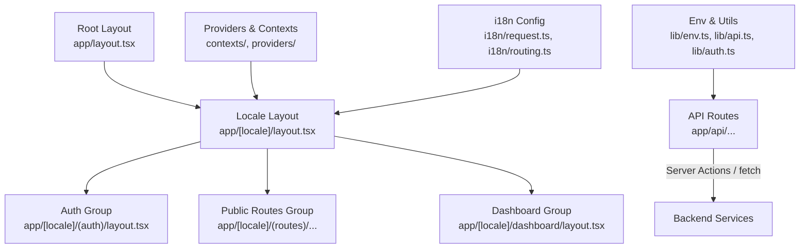
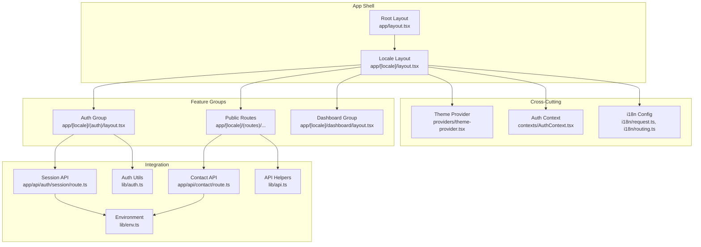
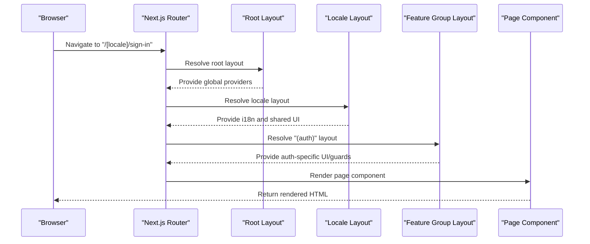
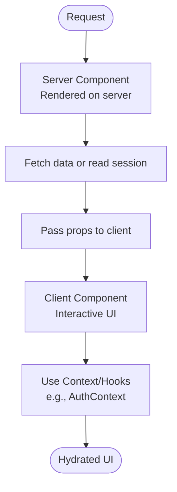
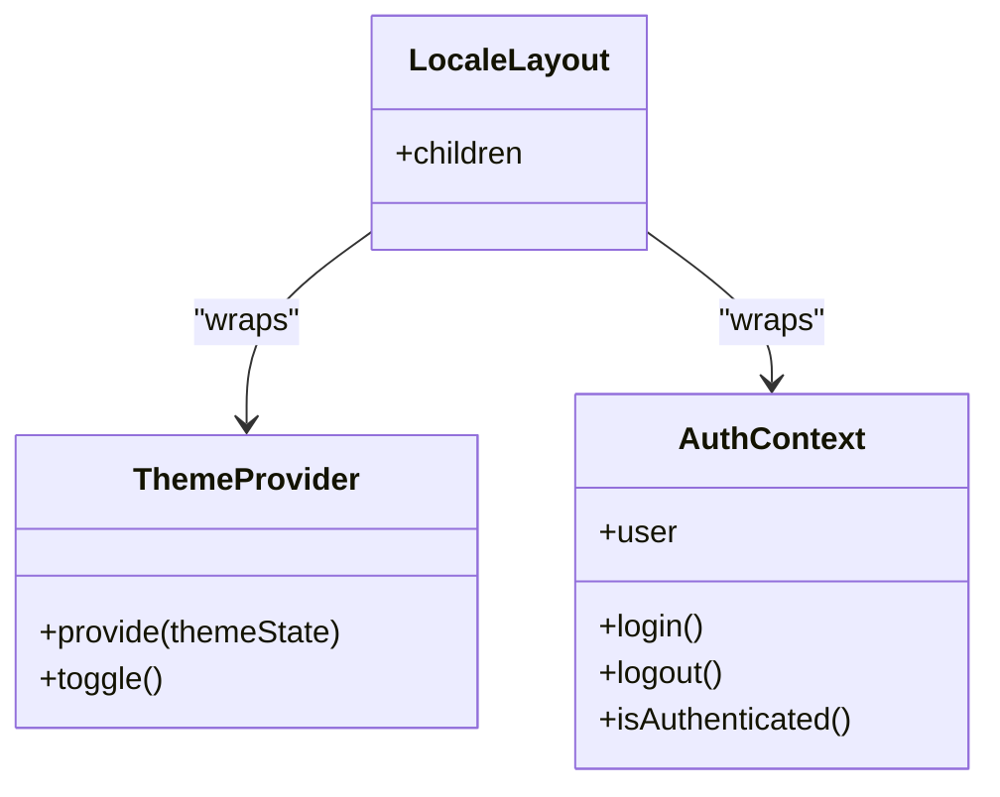
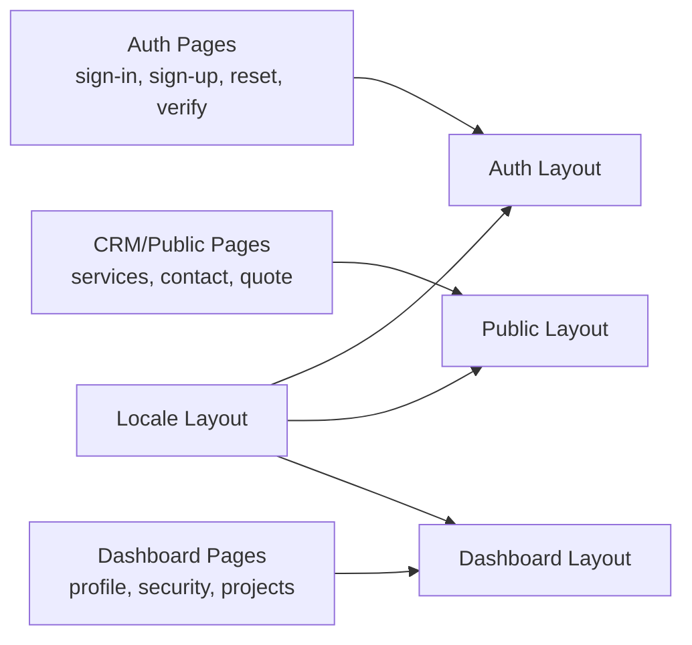
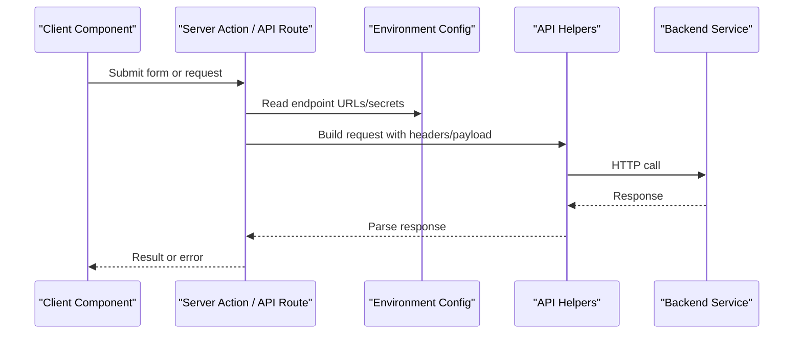
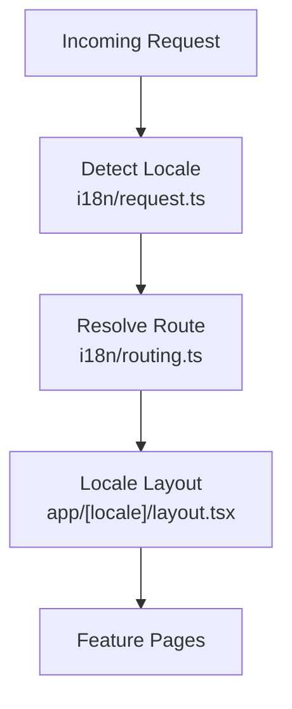
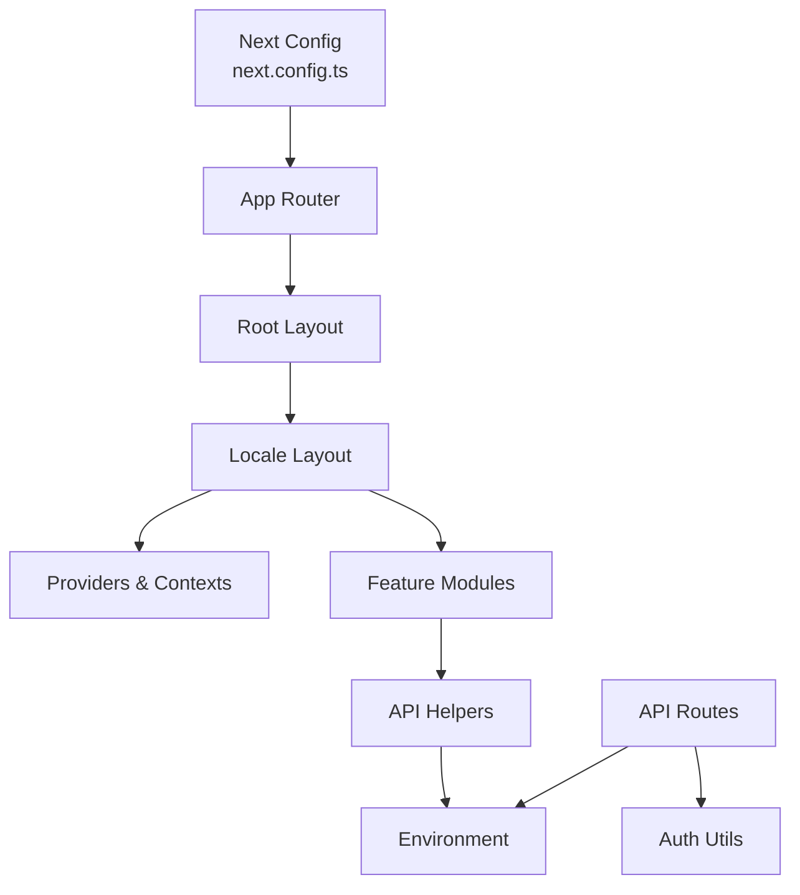

# System Architecture

<cite>
**Referenced Files in This Document**
- [app/layout.tsx](file://app/layout.tsx)
- [app/[locale]/layout.tsx](file://app/[locale]/layout.tsx)
- [app/[locale]/page.tsx](file://app/[locale]/page.tsx)
- [app/[locale]/(auth)/layout.tsx](file://app/[locale]/(auth)/layout.tsx)
- [app/[locale]/dashboard/layout.tsx](file://app/[locale]/dashboard/layout.tsx)
- [app/[locale]/(routes)/services/page.tsx](file://app/[locale]/(routes)/services/page.tsx)
- [app/[locale]/(routes)/crm/actions.ts](file://app/[locale]/(routes)/crm/actions.ts)
- [app/api/auth/session/route.ts](file://app/api/auth/session/route.ts)
- [app/api/contact/route.ts](file://app/api/contact/route.ts)
- [contexts/AuthContext.tsx](file://contexts/AuthContext.tsx)
- [providers/theme-provider.tsx](file://providers/theme-provider.tsx)
- [i18n/request.ts](file://i18n/request.ts)
- [i18n/routing.ts](file://i18n/routing.ts)
- [lib/env.ts](file://lib/env.ts)
- [lib/api.ts](file://lib/api.ts)
- [lib/auth.ts](file://lib/auth.ts)
- [next.config.ts](file://next.config.ts)
</cite>

## Table of Contents
1. [Introduction](#introduction)
2. [Project Structure](#project-structure)
3. [Core Components](#core-components)
4. [Architecture Overview](#architecture-overview)
5. [Detailed Component Analysis](#detailed-component-analysis)
6. [Dependency Analysis](#dependency-analysis)
7. [Performance Considerations](#performance-considerations)
8. [Troubleshooting Guide](#troubleshooting-guide)
9. [Conclusion](#conclusion)

## Introduction
This document describes the Automex Frontend system architecture built on Next.js App Router. It explains file-based routing, separation between public routes, authentication routes, and dashboard routes, and how layouts, providers, and feature modules are organized. It also covers server-client component boundaries, context provider patterns, data flow to backend services, and integration points.

## Project Structure
The application uses Next.js App Router with a locale-aware root under app/[locale]. Route groups organize concerns:
- (auth): Authentication-related pages and layout
- (routes): Public marketing/CRM pages
- dashboard: Protected dashboard area with its own layout and sub-routes

Key architectural elements:
- Root layout at app/layout.tsx provides global HTML shell and top-level providers
- Locale layout at app/[locale]/layout.tsx sets up i18n and shared UI for all locales
- Feature-specific layouts encapsulate UI chrome per section (auth, dashboard)
- API routes under app/api handle server-side endpoints
- Contexts and providers manage cross-cutting state (auth, theme)
- lib modules centralize environment, API clients, and auth utilities

**Diagram sources**
- [app/layout.tsx](file://app/layout.tsx)
- [app/[locale]/layout.tsx](file://app/[locale]/layout.tsx)
- [app/[locale]/(auth)/layout.tsx](file://app/[locale]/(auth)/layout.tsx)
- [app/[locale]/dashboard/layout.tsx](file://app/[locale]/dashboard/layout.tsx)
- [app/api/auth/session/route.ts](file://app/api/auth/session/route.ts)
- [app/api/contact/route.ts](file://app/api/contact/route.ts)
- [contexts/AuthContext.tsx](file://contexts/AuthContext.tsx)
- [providers/theme-provider.tsx](file://providers/theme-provider.tsx)
- [i18n/request.ts](file://i18n/request.ts)
- [i18n/routing.ts](file://i18n/routing.ts)
- [lib/env.ts](file://lib/env.ts)
- [lib/api.ts](file://lib/api.ts)
- [lib/auth.ts](file://lib/auth.ts)

**Section sources**
- [app/layout.tsx](file://app/layout.tsx)
- [app/[locale]/layout.tsx](file://app/[locale]/layout.tsx)
- [app/[locale]/(auth)/layout.tsx](file://app/[locale]/(auth)/layout.tsx)
- [app/[locale]/dashboard/layout.tsx](file://app/[locale]/dashboard/layout.tsx)
- [app/[locale]/(routes)/services/page.tsx](file://app/[locale]/(routes)/services/page.tsx)
- [app/[locale]/(routes)/crm/actions.ts](file://app/[locale]/(routes)/crm/actions.ts)
- [app/api/auth/session/route.ts](file://app/api/auth/session/route.ts)
- [app/api/contact/route.ts](file://app/api/contact/route.ts)
- [contexts/AuthContext.tsx](file://contexts/AuthContext.tsx)
- [providers/theme-provider.tsx](file://providers/theme-provider.tsx)
- [i18n/request.ts](file://i18n/request.ts)
- [i18n/routing.ts](file://i18n/routing.ts)
- [lib/env.ts](file://lib/env.ts)
- [lib/api.ts](file://lib/api.ts)
- [lib/auth.ts](file://lib/auth.ts)

## Core Components
- Root layout: Initializes global HTML structure and top-level providers such as theme and i18n.
- Locale layout: Resolves current locale, configures directionality, and composes shared UI for all routes within that locale.
- Auth group layout: Wraps authentication flows with consistent UI and guards.
- Dashboard layout: Provides navigation shell and protected route scaffolding.
- Providers and contexts: Theme provider manages UI theme; AuthContext exposes user session and actions across client components.
- API routes: Server-only endpoints for session management and contact submissions.
- Utilities: Environment configuration, API client helpers, and auth utilities centralize cross-cutting logic.

**Section sources**
- [app/layout.tsx](file://app/layout.tsx)
- [app/[locale]/layout.tsx](file://app/[locale]/layout.tsx)
- [app/[locale]/(auth)/layout.tsx](file://app/[locale]/(auth)/layout.tsx)
- [app/[locale]/dashboard/layout.tsx](file://app/[locale]/dashboard/layout.tsx)
- [contexts/AuthContext.tsx](file://contexts/AuthContext.tsx)
- [providers/theme-provider.tsx](file://providers/theme-provider.tsx)
- [app/api/auth/session/route.ts](file://app/api/auth/session/route.ts)
- [app/api/contact/route.ts](file://app/api/contact/route.ts)
- [lib/env.ts](file://lib/env.ts)
- [lib/api.ts](file://lib/api.ts)
- [lib/auth.ts](file://lib/auth.ts)

## Architecture Overview
The system is organized around Next.js App Router conventions:
- File-based routing maps directories to URLs
- Route groups (parenthesized folders) partition features without affecting URL paths
- Layouts compose progressively from root to locale to feature sections
- Server components render initial content; client components handle interactivity
- Context providers supply cross-cutting state like theme and authentication
- API routes act as integration points to backend services

**Diagram sources**
- [app/layout.tsx](file://app/layout.tsx)
- [app/[locale]/layout.tsx](file://app/[locale]/layout.tsx)
- [app/[locale]/(auth)/layout.tsx](file://app/[locale]/(auth)/layout.tsx)
- [app/[locale]/dashboard/layout.tsx](file://app/[locale]/dashboard/layout.tsx)
- [providers/theme-provider.tsx](file://providers/theme-provider.tsx)
- [contexts/AuthContext.tsx](file://contexts/AuthContext.tsx)
- [i18n/request.ts](file://i18n/request.ts)
- [i18n/routing.ts](file://i18n/routing.ts)
- [app/api/auth/session/route.ts](file://app/api/auth/session/route.ts)
- [app/api/contact/route.ts](file://app/api/contact/route.ts)
- [lib/env.ts](file://lib/env.ts)
- [lib/api.ts](file://lib/api.ts)
- [lib/auth.ts](file://lib/auth.ts)

## Detailed Component Analysis

### Routing and Layouts
- Root layout establishes the base HTML and top-level providers.
- Locale layout resolves language and direction, then renders children for the selected locale.
- Auth group layout wraps sign-in/sign-up/reset-password/magic-link flows with consistent UI.
- Dashboard layout provides navigation shell and protects nested routes.
- Public routes include CRM landing pages and service detail pages.

**Diagram sources**
- [app/layout.tsx](file://app/layout.tsx)
- [app/[locale]/layout.tsx](file://app/[locale]/layout.tsx)
- [app/[locale]/(auth)/layout.tsx](file://app/[locale]/(auth)/layout.tsx)
- [app/[locale]/dashboard/layout.tsx](file://app/[locale]/dashboard/layout.tsx)
- [app/[locale]/(routes)/services/page.tsx](file://app/[locale]/(routes)/services/page.tsx)

**Section sources**
- [app/layout.tsx](file://app/layout.tsx)
- [app/[locale]/layout.tsx](file://app/[locale]/layout.tsx)
- [app/[locale]/(auth)/layout.tsx](file://app/[locale]/(auth)/layout.tsx)
- [app/[locale]/dashboard/layout.tsx](file://app/[locale]/dashboard/layout.tsx)
- [app/[locale]/(routes)/services/page.tsx](file://app/[locale]/(routes)/services/page.tsx)

### Server-Client Component Separation
- Server components render initial content and can call server-only APIs or read cookies securely.
- Client components handle interactivity and consume context/state via hooks.
- The boundary is enforced by component directives and usage patterns; server components import client components when needed.

[No sources needed since this diagram shows conceptual workflow, not actual code structure]

### Context Providers Pattern
- Theme provider supplies theme state and toggles across the app.
- AuthContext exposes user session and actions to client components.
- Providers are composed in layouts to ensure availability throughout the tree.

**Diagram sources**
- [providers/theme-provider.tsx](file://providers/theme-provider.tsx)
- [contexts/AuthContext.tsx](file://contexts/AuthContext.tsx)
- [app/[locale]/layout.tsx](file://app/[locale]/layout.tsx)

**Section sources**
- [providers/theme-provider.tsx](file://providers/theme-provider.tsx)
- [contexts/AuthContext.tsx](file://contexts/AuthContext.tsx)
- [app/[locale]/layout.tsx](file://app/[locale]/layout.tsx)

### Feature Isolation: Auth, CRM, Dashboard
- Auth: Dedicated layout and pages for sign-in, sign-up, reset password, magic link, and email verification.
- CRM/Public: Marketing and lead capture pages under (routes), including CRM forms and service details.
- Dashboard: Protected area with nested routes for profile, security, projects, notifications, etc.

**Diagram sources**
- [app/[locale]/(auth)/layout.tsx](file://app/[locale]/(auth)/layout.tsx)
- [app/[locale]/(routes)/services/page.tsx](file://app/[locale]/(routes)/services/page.tsx)
- [app/[locale]/dashboard/layout.tsx](file://app/[locale]/dashboard/layout.tsx)
- [app/[locale]/layout.tsx](file://app/[locale]/layout.tsx)

**Section sources**
- [app/[locale]/(auth)/layout.tsx](file://app/[locale]/(auth)/layout.tsx)
- [app/[locale]/(routes)/services/page.tsx](file://app/[locale]/(routes)/services/page.tsx)
- [app/[locale]/dashboard/layout.tsx](file://app/[locale]/dashboard/layout.tsx)
- [app/[locale]/layout.tsx](file://app/[locale]/layout.tsx)

### Data Flow Patterns and Backend Integration
- Server Actions and API routes perform server-side operations and communicate with backend services.
- Environment variables define backend endpoints and secrets.
- API helpers and auth utilities standardize requests and error handling.

**Diagram sources**
- [app/[locale]/(routes)/crm/actions.ts](file://app/[locale]/(routes)/crm/actions.ts)
- [app/api/contact/route.ts](file://app/api/contact/route.ts)
- [app/api/auth/session/route.ts](file://app/api/auth/session/route.ts)
- [lib/env.ts](file://lib/env.ts)
- [lib/api.ts](file://lib/api.ts)
- [lib/auth.ts](file://lib/auth.ts)

**Section sources**
- [app/[locale]/(routes)/crm/actions.ts](file://app/[locale]/(routes)/crm/actions.ts)
- [app/api/contact/route.ts](file://app/api/contact/route.ts)
- [app/api/auth/session/route.ts](file://app/api/auth/session/route.ts)
- [lib/env.ts](file://lib/env.ts)
- [lib/api.ts](file://lib/api.ts)
- [lib/auth.ts](file://lib/auth.ts)

### Internationalization and Routing
- i18n configuration defines supported locales and routing behavior.
- Request-time locale resolution ensures correct language and direction per request.
- Locale-aware layouts wrap all routes to provide localized UI.

**Diagram sources**
- [i18n/request.ts](file://i18n/request.ts)
- [i18n/routing.ts](file://i18n/routing.ts)
- [app/[locale]/layout.tsx](file://app/[locale]/layout.tsx)

**Section sources**
- [i18n/request.ts](file://i18n/request.ts)
- [i18n/routing.ts](file://i18n/routing.ts)
- [app/[locale]/layout.tsx](file://app/[locale]/layout.tsx)

## Dependency Analysis
High-level dependencies among core modules:
- Layouts depend on providers and i18n configuration
- Feature pages depend on contexts and API helpers
- API routes depend on environment configuration and auth utilities
- Next.js configuration controls runtime behavior and proxying

**Diagram sources**
- [next.config.ts](file://next.config.ts)
- [app/layout.tsx](file://app/layout.tsx)
- [app/[locale]/layout.tsx](file://app/[locale]/layout.tsx)
- [contexts/AuthContext.tsx](file://contexts/AuthContext.tsx)
- [providers/theme-provider.tsx](file://providers/theme-provider.tsx)
- [lib/api.ts](file://lib/api.ts)
- [lib/env.ts](file://lib/env.ts)
- [lib/auth.ts](file://lib/auth.ts)
- [app/api/auth/session/route.ts](file://app/api/auth/session/route.ts)
- [app/api/contact/route.ts](file://app/api/contact/route.ts)

**Section sources**
- [next.config.ts](file://next.config.ts)
- [app/layout.tsx](file://app/layout.tsx)
- [app/[locale]/layout.tsx](file://app/[locale]/layout.tsx)
- [contexts/AuthContext.tsx](file://contexts/AuthContext.tsx)
- [providers/theme-provider.tsx](file://providers/theme-provider.tsx)
- [lib/api.ts](file://lib/api.ts)
- [lib/env.ts](file://lib/env.ts)
- [lib/auth.ts](file://lib/auth.ts)
- [app/api/auth/session/route.ts](file://app/api/auth/session/route.ts)
- [app/api/contact/route.ts](file://app/api/contact/route.ts)

## Performance Considerations
- Prefer server components for data-heavy rendering to reduce client bundle size.
- Use route groups to co-locate related code and improve maintainability without impacting URLs.
- Leverage static generation where possible for public pages to improve load times.
- Minimize context re-renders by scoping providers and using memoization in client components.
- Centralize API calls through helpers to enable caching strategies and error normalization.

[No sources needed since this section provides general guidance]

## Troubleshooting Guide
Common areas to inspect:
- Environment variables: Ensure backend endpoints and secrets are configured correctly.
- API routes: Validate request/response formats and error handling paths.
- Auth flow: Check session endpoints and token handling.
- i18n: Confirm locale detection and routing configuration.

**Section sources**
- [lib/env.ts](file://lib/env.ts)
- [app/api/auth/session/route.ts](file://app/api/auth/session/route.ts)
- [app/api/contact/route.ts](file://app/api/contact/route.ts)
- [i18n/request.ts](file://i18n/request.ts)
- [i18n/routing.ts](file://i18n/routing.ts)

## Conclusion
The Automex Frontend leverages Next.js App Router to deliver a scalable, modular architecture. File-based routing combined with route groups cleanly separates public, authentication, and dashboard features. Layouts and providers establish consistent shells and cross-cutting concerns, while server-client boundaries and centralized API helpers streamline data flow and integration with backend services. This structure supports internationalization, maintainability, and performance optimizations.