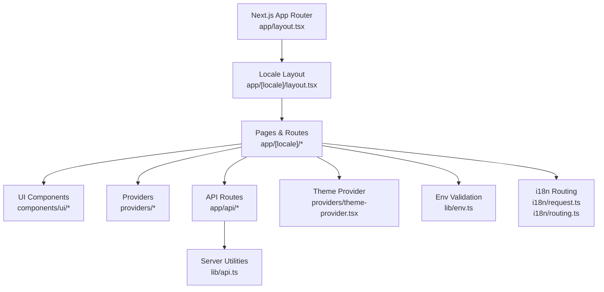
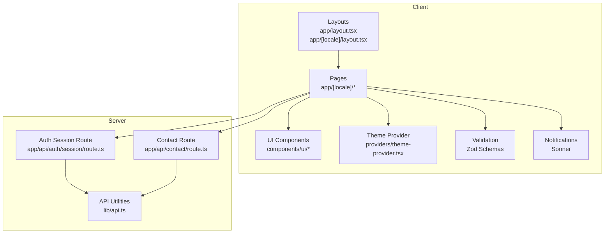
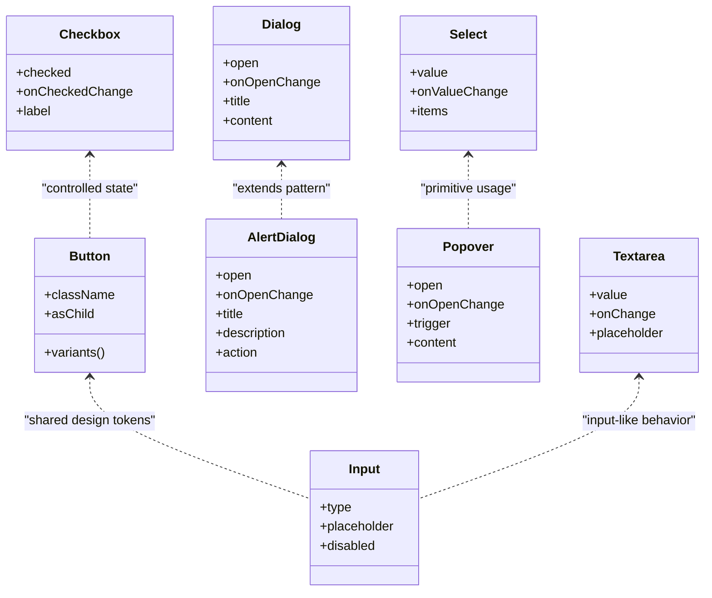
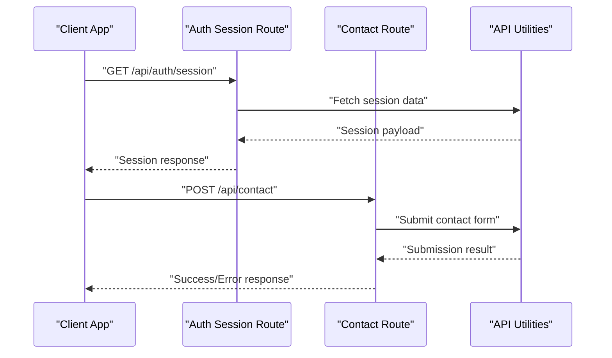
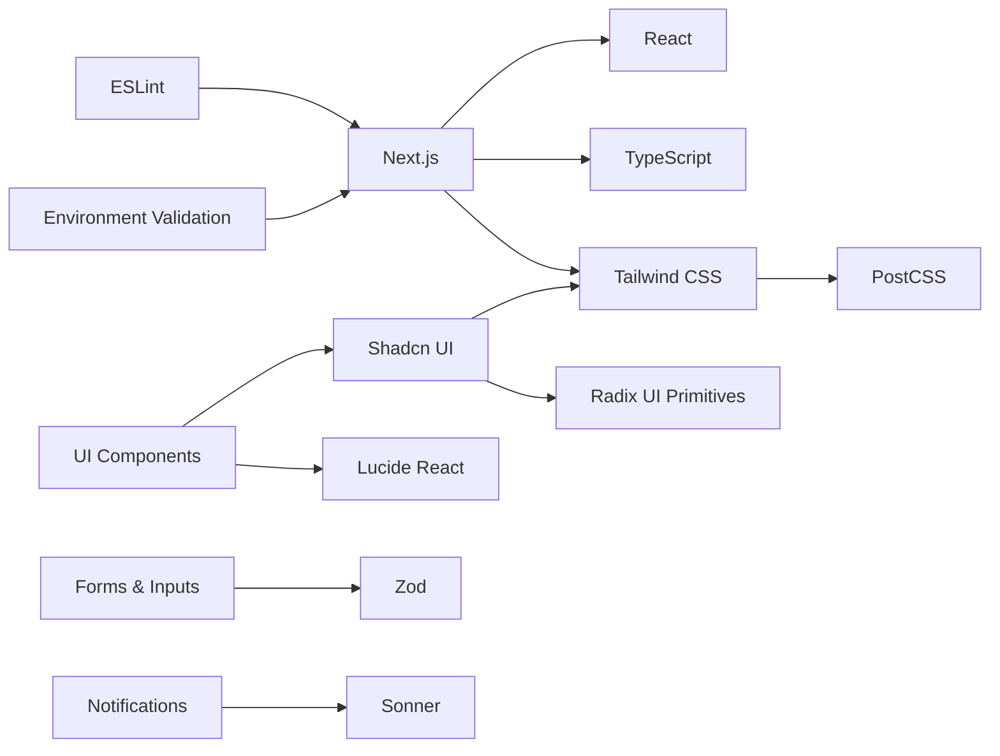

# Technology Stack

<cite>
**Referenced Files in This Document**
- [package.json](file://package.json)
- [next.config.ts](file://next.config.ts)
- [tsconfig.json](file://tsconfig.json)
- [tailwind.config.ts](file://tailwind.config.ts)
- [postcss.config.mjs](file://postcss.config.mjs)
- [components.json](file://components.json)
- [eslint.config.mjs](file://eslint.config.mjs)
- [app/layout.tsx](file://app/layout.tsx)
- [app/[locale]/layout.tsx](file://app/[locale]/layout.tsx)
- [providers/theme-provider.tsx](file://providers/theme-provider.tsx)
- [lib/env.ts](file://lib/env.ts)
- [i18n/request.ts](file://i18n/request.ts)
- [i18n/routing.ts](file://i18n/routing.ts)
- [components/ui/button.tsx](file://components/ui/button.tsx)
- [components/ui/input.tsx](file://components/ui/input.tsx)
- [components/ui/sonner.tsx](file://components/ui/sonner.tsx)
- [components/ui/alert-dialog.tsx](file://components/ui/alert-dialog.tsx)
- [components/ui/dialog.tsx](file://components/ui/dialog.tsx)
- [components/ui/popover.tsx](file://components/ui/popover.tsx)
- [components/ui/select.tsx](file://components/ui/select.tsx)
- [components/ui/textarea.tsx](file://components/ui/textarea.tsx)
- [components/ui/checkbox.tsx](file://components/ui/checkbox.tsx)
- [app/api/auth/session/route.ts](file://app/api/auth/session/route.ts)
- [app/api/contact/route.ts](file://app/api/contact/route.ts)
- [lib/api.ts](file://lib/api.ts)
- [lib/utils.ts](file://lib/utils.ts)
- [proxy.ts](file://proxy.ts)
</cite>

## Table of Contents
1. [Introduction](#introduction)
2. [Project Structure](#project-structure)
3. [Core Components](#core-components)
4. [Architecture Overview](#architecture-overview)
5. [Detailed Component Analysis](#detailed-component-analysis)
6. [Dependency Analysis](#dependency-analysis)
7. [Performance Considerations](#performance-considerations)
8. [Troubleshooting Guide](#troubleshooting-guide)
9. [Conclusion](#conclusion)

## Introduction
This document describes the technology stack and build configuration for the Automex Frontend project. It focuses on Next.js 14+ with React 18+, TypeScript, Tailwind CSS, Shadcn UI (built on Radix UI primitives), Zod runtime validation, Sonner notifications, and Lucide React icons. It also covers development tooling, testing setup, version compatibility, dependency management strategies, and performance considerations.

## Project Structure
The project follows a modern Next.js App Router layout with:
- Feature-based pages under app/[locale]
- Shared UI components under components/ui (Shadcn UI)
- Providers for theme and auth context
- Internationalization via i18n routing and request helpers
- API routes under app/api for server-side endpoints
- Configuration files at the root for Next.js, TypeScript, Tailwind, PostCSS, ESLint, and Shadcn

**Diagram sources**
- [app/layout.tsx](file://app/layout.tsx)
- [app/[locale]/layout.tsx](file://app/[locale]/layout.tsx)
- [components/ui/button.tsx](file://components/ui/button.tsx)
- [providers/theme-provider.tsx](file://providers/theme-provider.tsx)
- [lib/env.ts](file://lib/env.ts)
- [i18n/request.ts](file://i18n/request.ts)
- [i18n/routing.ts](file://i18n/routing.ts)
- [app/api/auth/session/route.ts](file://app/api/auth/session/route.ts)
- [app/api/contact/route.ts](file://app/api/contact/route.ts)
- [lib/api.ts](file://lib/api.ts)

**Section sources**
- [app/layout.tsx](file://app/layout.tsx)
- [app/[locale]/layout.tsx](file://app/[locale]/layout.tsx)
- [components/ui/button.tsx](file://components/ui/button.tsx)
- [providers/theme-provider.tsx](file://providers/theme-provider.tsx)
- [lib/env.ts](file://lib/env.ts)
- [i18n/request.ts](file://i18n/request.ts)
- [i18n/routing.ts](file://i18n/routing.ts)
- [app/api/auth/session/route.ts](file://app/api/auth/session/route.ts)
- [app/api/contact/route.ts](file://app/api/contact/route.ts)
- [lib/api.ts](file://lib/api.ts)

## Core Components
- Framework and Runtime
  - Next.js 14+ with React 18+ provides the application shell, routing, data fetching, and SSR/SSG capabilities.
  - TypeScript enforces type safety across client and server code paths.
- Styling and Theming
  - Tailwind CSS is configured for utility-first styling with custom theme extensions.
  - PostCSS integrates Tailwind and other plugins as defined in the PostCSS config.
- UI System
  - Shadcn UI components are installed and managed via its CLI and configuration file.
  - Components are built on top of Radix UI primitives to ensure accessibility and composable behavior.
- Icons and Notifications
  - Lucide React supplies a consistent icon set used throughout the UI.
  - Sonner provides lightweight toast notifications integrated into the UI layer.
- Validation and Environment
  - Zod is used for runtime schema validation of form inputs and API payloads.
  - Environment variables are validated at startup to prevent misconfiguration.
- Development Tooling
  - ESLint ensures consistent code quality and catches issues early.
  - Proxy configuration supports local development against backend services.

**Section sources**
- [package.json](file://package.json)
- [next.config.ts](file://next.config.ts)
- [tsconfig.json](file://tsconfig.json)
- [tailwind.config.ts](file://tailwind.config.ts)
- [postcss.config.mjs](file://postcss.config.mjs)
- [components.json](file://components.json)
- [eslint.config.mjs](file://eslint.config.mjs)
- [proxy.ts](file://proxy.ts)
- [lib/env.ts](file://lib/env.ts)
- [components/ui/sonner.tsx](file://components/ui/sonner.tsx)

## Architecture Overview
The frontend architecture centers around Next.js App Router with locale-aware layouts, shared UI components, and API routes. Theme and environment concerns are centralized in providers and utilities.

**Diagram sources**
- [app/layout.tsx](file://app/layout.tsx)
- [app/[locale]/layout.tsx](file://app/[locale]/layout.tsx)
- [components/ui/button.tsx](file://components/ui/button.tsx)
- [components/ui/sonner.tsx](file://components/ui/sonner.tsx)
- [providers/theme-provider.tsx](file://providers/theme-provider.tsx)
- [app/api/auth/session/route.ts](file://app/api/auth/session/route.ts)
- [app/api/contact/route.ts](file://app/api/contact/route.ts)
- [lib/api.ts](file://lib/api.ts)

## Detailed Component Analysis

### Next.js and React
- Purpose: Application framework and rendering engine.
- Key responsibilities:
  - App Router and page composition
  - Server actions and API routes
  - Data fetching and caching strategies
- Integration points:
  - Root and locale layouts
  - Providers for theme and internationalization
  - API route handlers for authentication and contact flows

**Section sources**
- [app/layout.tsx](file://app/layout.tsx)
- [app/[locale]/layout.tsx](file://app/[locale]/layout.tsx)
- [app/api/auth/session/route.ts](file://app/api/auth/session/route.ts)
- [app/api/contact/route.ts](file://app/api/contact/route.ts)

### TypeScript Configuration
- Purpose: Enforce strict typing across the codebase.
- Highlights:
  - Strict mode enabled
  - Path aliases for imports
  - JSX support and module resolution aligned with Next.js

**Section sources**
- [tsconfig.json](file://tsconfig.json)

### Tailwind CSS and PostCSS
- Purpose: Utility-first styling with customizable theme tokens.
- Highlights:
  - Tailwind configuration extends default theme and adds project-specific styles.
  - PostCSS config wires Tailwind and additional plugins.

**Section sources**
- [tailwind.config.ts](file://tailwind.config.ts)
- [postcss.config.mjs](file://postcss.config.mjs)

### Shadcn UI and Radix Primitives
- Purpose: Accessible, composable UI components.
- Highlights:
  - Shadcn CLI-managed component library with configuration file.
  - Components implemented using Radix UI primitives for robust accessibility.
  - Examples include button, input, dialog, select, popover, alert dialog, textarea, checkbox.

**Diagram sources**
- [components/ui/button.tsx](file://components/ui/button.tsx)
- [components/ui/input.tsx](file://components/ui/input.tsx)
- [components/ui/dialog.tsx](file://components/ui/dialog.tsx)
- [components/ui/alert-dialog.tsx](file://components/ui/alert-dialog.tsx)
- [components/ui/select.tsx](file://components/ui/select.tsx)
- [components/ui/popover.tsx](file://components/ui/popover.tsx)
- [components/ui/textarea.tsx](file://components/ui/textarea.tsx)
- [components/ui/checkbox.tsx](file://components/ui/checkbox.tsx)

**Section sources**
- [components.json](file://components.json)
- [components/ui/button.tsx](file://components/ui/button.tsx)
- [components/ui/input.tsx](file://components/ui/input.tsx)
- [components/ui/dialog.tsx](file://components/ui/dialog.tsx)
- [components/ui/alert-dialog.tsx](file://components/ui/alert-dialog.tsx)
- [components/ui/select.tsx](file://components/ui/select.tsx)
- [components/ui/popover.tsx](file://components/ui/popover.tsx)
- [components/ui/textarea.tsx](file://components/ui/textarea.tsx)
- [components/ui/checkbox.tsx](file://components/ui/checkbox.tsx)

### Zod Runtime Validation
- Purpose: Validate user inputs and API payloads at runtime.
- Usage patterns:
  - Form schemas for sign-in, sign-up, profile updates, and CRM forms.
  - Centralized validation utilities for consistency.

**Section sources**
- [lib/env.ts](file://lib/env.ts)

### Sonner Notifications
- Purpose: Provide accessible, non-blocking user feedback.
- Integration:
  - Global provider wrapper for toast notifications.
  - Used within forms and API flows to signal success or errors.

**Section sources**
- [components/ui/sonner.tsx](file://components/ui/sonner.tsx)

### Lucide React Icons
- Purpose: Consistent, lightweight iconography.
- Usage:
  - Imported directly in components where needed.
  - Supports theming and size customization.

**Section sources**
- [package.json](file://package.json)

### Environment and Internationalization
- Environment:
  - Runtime validation of environment variables to fail fast on misconfiguration.
- Internationalization:
  - Request-time locale detection and routing helpers.
  - Locale-aware layouts and content switching.

**Section sources**
- [lib/env.ts](file://lib/env.ts)
- [i18n/request.ts](file://i18n/request.ts)
- [i18n/routing.ts](file://i18n/routing.ts)

### API Routes and Utilities
- Purpose: Server-side endpoints for authentication session handling and contact submissions.
- Patterns:
  - Route handlers return standardized responses.
  - Shared API utilities encapsulate fetch logic and error handling.

**Diagram sources**
- [app/api/auth/session/route.ts](file://app/api/auth/session/route.ts)
- [app/api/contact/route.ts](file://app/api/contact/route.ts)
- [lib/api.ts](file://lib/api.ts)

**Section sources**
- [app/api/auth/session/route.ts](file://app/api/auth/session/route.ts)
- [app/api/contact/route.ts](file://app/api/contact/route.ts)
- [lib/api.ts](file://lib/api.ts)

### Build and Development Configuration
- Next.js configuration:
  - Customizations for assets, redirects, headers, and experimental features.
- ESLint:
  - Rules tailored for Next.js, React, and TypeScript best practices.
- Proxy:
  - Local proxy settings to forward requests to backend services during development.

**Section sources**
- [next.config.ts](file://next.config.ts)
- [eslint.config.mjs](file://eslint.config.mjs)
- [proxy.ts](file://proxy.ts)

## Dependency Analysis
The following diagram highlights key dependencies and their roles in the stack.

**Diagram sources**
- [package.json](file://package.json)
- [next.config.ts](file://next.config.ts)
- [tsconfig.json](file://tsconfig.json)
- [tailwind.config.ts](file://tailwind.config.ts)
- [postcss.config.mjs](file://postcss.config.mjs)
- [components.json](file://components.json)
- [eslint.config.mjs](file://eslint.config.mjs)

**Section sources**
- [package.json](file://package.json)
- [next.config.ts](file://next.config.ts)
- [tsconfig.json](file://tsconfig.json)
- [tailwind.config.ts](file://tailwind.config.ts)
- [postcss.config.mjs](file://postcss.config.mjs)
- [components.json](file://components.json)
- [eslint.config.mjs](file://eslint.config.mjs)

## Performance Considerations
- Code Splitting and Tree Shaking
  - Leverage Next.js automatic code splitting and dynamic imports for heavy components.
- Asset Optimization
  - Use optimized image formats and sizes; configure Next.js image pipeline.
- Caching Strategies
  - Apply appropriate revalidation intervals for API routes and static resources.
- Bundle Size Control
  - Audit dependencies and remove unused libraries; prefer lightweight alternatives when possible.
- Rendering Strategy
  - Prefer server components where feasible; use client components only when interactivity is required.
- Styling Efficiency
  - Keep Tailwind classes minimal and avoid unnecessary re-renders by memoizing expensive computations.

[No sources needed since this section provides general guidance]

## Troubleshooting Guide
- Environment Variables
  - Ensure all required variables are present and correctly typed; failures will surface early due to runtime validation.
- API Errors
  - Check route handlers for proper error responses and logging; verify network calls through API utilities.
- Theme Issues
  - Confirm theme provider initialization and CSS variable definitions.
- Accessibility Concerns
  - Verify that Shadcn/Radix components maintain focus management and ARIA attributes.
- Build and Lint Errors
  - Run ESLint locally to catch issues before committing; review Next.js build logs for warnings.

**Section sources**
- [lib/env.ts](file://lib/env.ts)
- [app/api/auth/session/route.ts](file://app/api/auth/session/route.ts)
- [app/api/contact/route.ts](file://app/api/contact/route.ts)
- [providers/theme-provider.tsx](file://providers/theme-provider.tsx)
- [eslint.config.mjs](file://eslint.config.mjs)

## Conclusion
The Automex Frontend leverages a modern, accessible, and performant stack centered on Next.js 14+ and React 18+. Shadcn UI built on Radix primitives ensures high-quality, accessible components, while Tailwind CSS enables flexible styling. Zod provides robust runtime validation, Sonner offers concise notifications, and Lucide React delivers consistent icons. The configuration and tooling choices emphasize developer experience, maintainability, and production readiness.