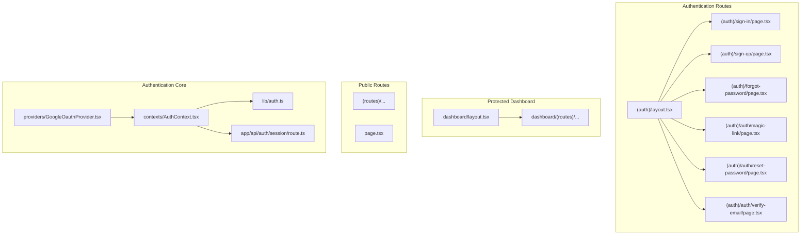
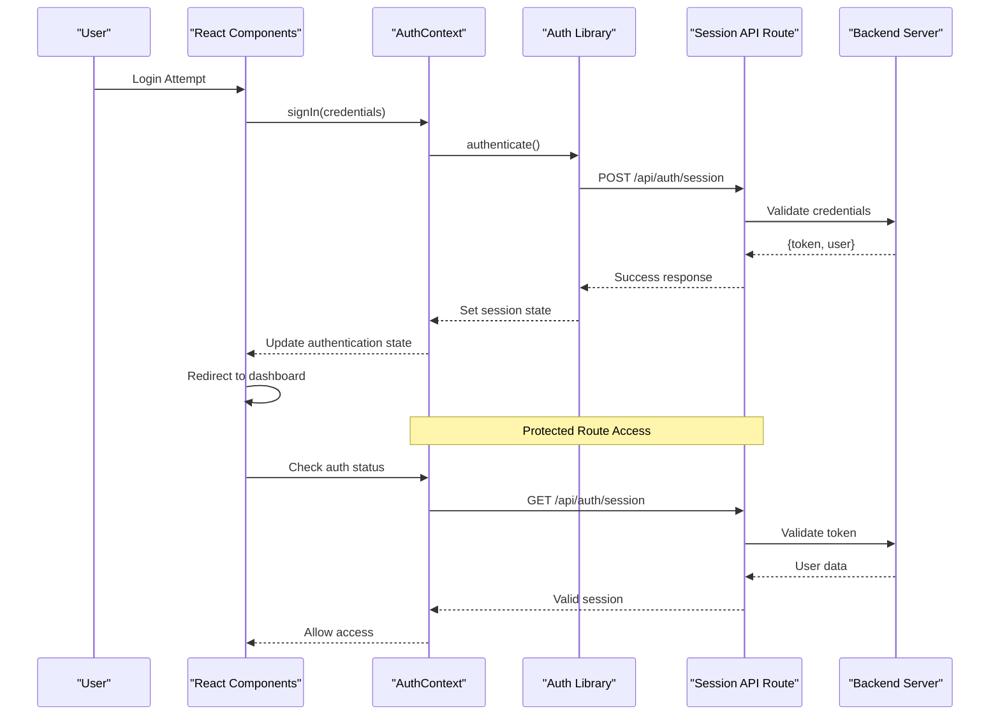
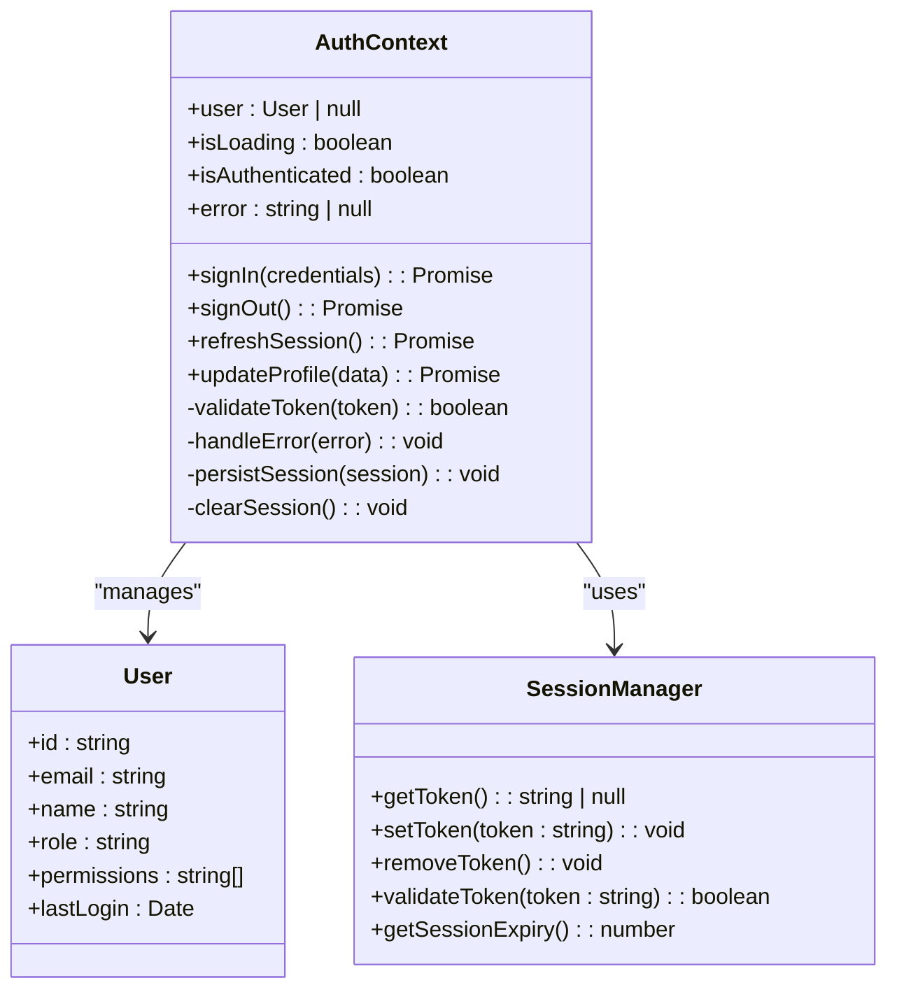
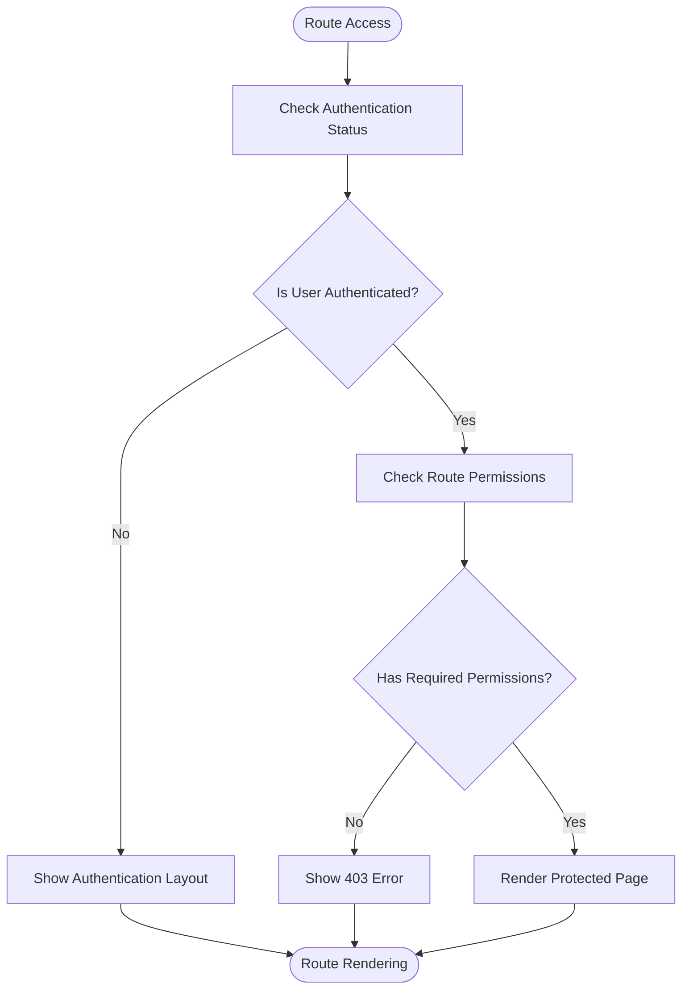
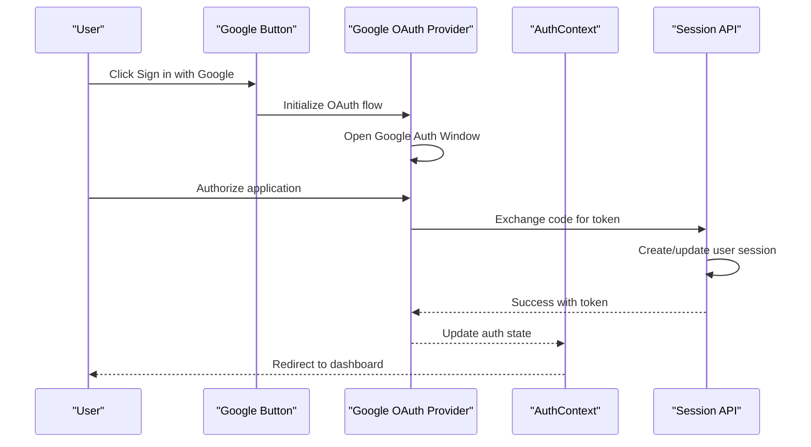
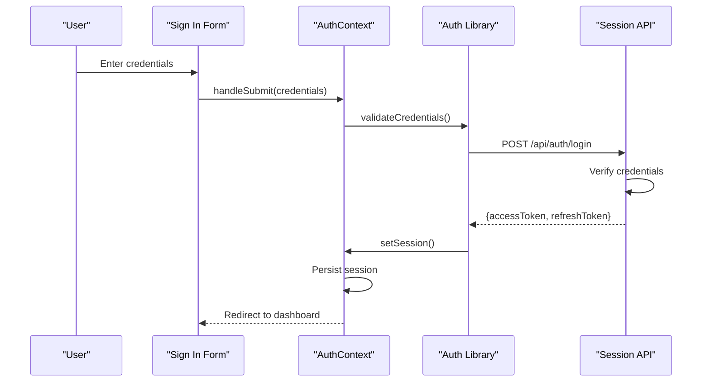
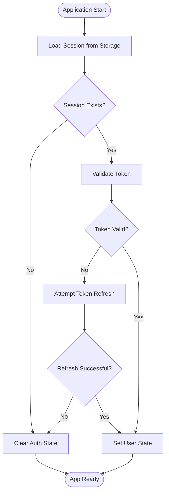
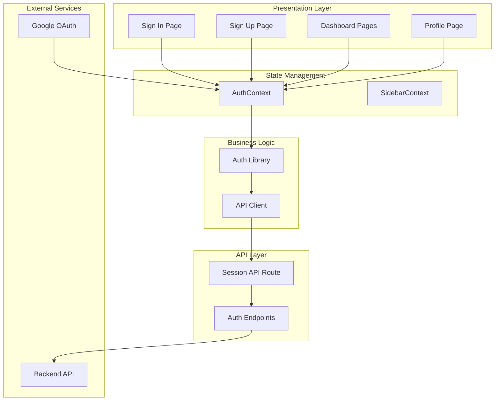

# Authentication Architecture

<cite>
**Referenced Files in This Document**
- [AuthContext.tsx](file://contexts/AuthContext.tsx)
- [auth.ts](file://lib/auth.ts)
- [route.ts](file://app/api/auth/session/route.ts)
- [GoogleOauthProvider.tsx](file://providers/GoogleOauthProvider.tsx)
- [layout.tsx](file://app/[locale]/(auth)/layout.tsx)
- [page.tsx](file://app/[locale]/(auth)/sign-in/page.tsx)
- [page.tsx](file://app/[locale]/(auth)/sign-up/page.tsx)
- [DashboardHeader.tsx](file://app/[locale]/dashboard/_components/Header/DashboardHeader.tsx)
- [Sidebar.tsx](file://app/[locale]/dashboard/_components/Sidebar/Sidebar.tsx)
</cite>

## Table of Contents
1. [Introduction](#introduction)
2. [Project Structure](#project-structure)
3. [Core Components](#core-components)
4. [Architecture Overview](#architecture-overview)
5. [Detailed Component Analysis](#detailed-component-analysis)
6. [Dependency Analysis](#dependency-analysis)
7. [Performance Considerations](#performance-considerations)
8. [Troubleshooting Guide](#troubleshooting-guide)
9. [Conclusion](#conclusion)

## Introduction

This document provides comprehensive documentation for the authentication system architecture implemented in the Automex frontend application. The authentication system follows modern React and Next.js patterns, utilizing context-based state management, protected routes, and secure session handling. The system supports multiple authentication methods including traditional sign-in/sign-up flows and Google OAuth integration.

The architecture emphasizes security, user experience, and maintainability through centralized state management, consistent error handling, and clear separation of concerns between client-side authentication logic and server-side session validation.

## Project Structure

The authentication system is organized following Next.js App Router conventions with feature-based grouping:

**Diagram sources**
- [layout.tsx](file://app/[locale]/(auth)/layout.tsx)
- [AuthContext.tsx](file://contexts/AuthContext.tsx)
- [auth.ts](file://lib/auth.ts)
- [route.ts](file://app/api/auth/session/route.ts)

**Section sources**
- [layout.tsx](file://app/[locale]/(auth)/layout.tsx)
- [AuthContext.tsx](file://contexts/AuthContext.tsx)

## Core Components

### Authentication Context (AuthContext)

The central authentication context manages user state, session persistence, and authentication actions across the entire application. It serves as the single source of truth for authentication state and provides methods for login, logout, and session management.

Key responsibilities:
- User session state management
- Token storage and retrieval
- Authentication action dispatching
- State synchronization across components
- Error handling and loading states

### Authentication Library (lib/auth.ts)

The authentication library provides utility functions and API communication methods for authentication operations. It handles HTTP requests to authentication endpoints, token management, and response processing.

Core functionality:
- API endpoint communication
- Token validation and refresh
- Request/response interceptors
- Error normalization
- Session validation

### Session API Route

The server-side session validation route handles authentication verification and session management on the backend. It validates tokens, checks user permissions, and maintains secure session state.

Security features:
- Token signature verification
- Session expiration handling
- Permission-based access control
- Secure cookie management

**Section sources**
- [AuthContext.tsx](file://contexts/AuthContext.tsx)
- [auth.ts](file://lib/auth.ts)
- [route.ts](file://app/api/auth/session/route.ts)

## Architecture Overview

The authentication architecture follows a layered approach with clear separation between client-side state management and server-side validation:

**Diagram sources**
- [AuthContext.tsx](file://contexts/AuthContext.tsx)
- [auth.ts](file://lib/auth.ts)
- [route.ts](file://app/api/auth/session/route.ts)

### Security Boundaries

The authentication system implements multiple security layers:

1. **Client-Side Validation**: Form validation and input sanitization
2. **Token-Based Authentication**: JWT tokens for stateless authentication
3. **Server-Side Verification**: Backend validation of all authentication requests
4. **Route Protection**: Middleware-based access control for protected routes
5. **Secure Storage**: HttpOnly cookies for token storage

## Detailed Component Analysis

### Authentication Context Implementation

The AuthContext provides a centralized state management solution for authentication throughout the application:

**Diagram sources**
- [AuthContext.tsx](file://contexts/AuthContext.tsx)

### Protected Route Implementation

The protected route mechanism uses layout-based routing with middleware patterns:

**Diagram sources**
- [layout.tsx](file://app/[locale]/(auth)/layout.tsx)

### Google OAuth Integration

The Google OAuth provider integrates third-party authentication seamlessly:

**Diagram sources**
- [GoogleOauthProvider.tsx](file://providers/GoogleOauthProvider.tsx)

### Authentication Flow Patterns

#### Traditional Sign-In Flow

#### Session Management Flow

**Diagram sources**
- [AuthContext.tsx](file://contexts/AuthContext.tsx)
- [auth.ts](file://lib/auth.ts)

## Dependency Analysis

The authentication system has well-defined dependencies and clear separation of concerns:

**Diagram sources**
- [AuthContext.tsx](file://contexts/AuthContext.tsx)
- [auth.ts](file://lib/auth.ts)
- [route.ts](file://app/api/auth/session/route.ts)

### Component Coupling Analysis

The authentication system demonstrates low coupling and high cohesion:

- **AuthContext** depends only on **AuthLib** for business logic
- **AuthLib** abstracts API communication details
- **Components** interact only through **AuthContext** hooks
- **API routes** are independent and stateless

## Performance Considerations

### State Synchronization Optimization

The authentication system implements several performance optimizations:

1. **Memoized Context Values**: Prevent unnecessary re-renders by memoizing frequently accessed values
2. **Lazy Loading**: Authentication components load only when needed
3. **Debounced Token Refresh**: Avoid excessive API calls during token refresh
4. **Batched State Updates**: Group related state changes to minimize re-renders

### Memory Management

- **Automatic Cleanup**: Event listeners and timers are properly cleaned up
- **Session Expiration**: Automatic cleanup of expired sessions
- **Memory Leak Prevention**: Proper disposal of authentication resources

### Network Optimization

- **Request Deduplication**: Prevent duplicate authentication requests
- **Caching Strategy**: Cache user profile data to reduce API calls
- **Retry Logic**: Implement exponential backoff for failed requests

## Troubleshooting Guide

### Common Authentication Issues

#### Session Not Persisting

**Symptoms**: Users get logged out unexpectedly after page refresh

**Diagnosis Steps**:
1. Check browser storage for session tokens
2. Verify session expiration settings
3. Review localStorage/sessionStorage implementation
4. Check for CORS issues with API calls

**Resolution**: Ensure proper token storage and implement automatic session refresh

#### Authentication State Mismatch

**Symptoms**: UI shows different authentication state than actual session

**Diagnosis Steps**:
1. Check AuthContext initialization
2. Verify state synchronization between components
3. Review useEffect dependencies
4. Check for race conditions in async operations

**Resolution**: Implement proper state synchronization and add loading states

#### Token Validation Failures

**Symptoms**: 401 Unauthorized errors despite valid session

**Diagnosis Steps**:
1. Verify token format and expiration
2. Check token signing algorithm
3. Review backend token validation logic
4. Check for clock synchronization issues

**Resolution**: Implement token refresh mechanism and handle token expiration gracefully

### Debugging Tools

The authentication system includes several debugging utilities:

- **Auth State Inspector**: Development tool to inspect current authentication state
- **Network Request Logger**: Track authentication-related API calls
- **Error Boundary**: Catch and display authentication errors gracefully
- **Logging Utility**: Structured logging for authentication events

**Section sources**
- [AuthContext.tsx](file://contexts/AuthContext.tsx)
- [auth.ts](file://lib/auth.ts)

## Conclusion

The authentication architecture in the Automex frontend application demonstrates best practices in modern web application security and user experience design. The system successfully balances security requirements with usability through:

- **Centralized State Management**: Single source of truth for authentication state
- **Layered Security**: Multiple validation points from client to server
- **Flexible Authentication Methods**: Support for both traditional and OAuth authentication
- **Robust Error Handling**: Comprehensive error scenarios and recovery mechanisms
- **Performance Optimization**: Efficient state updates and network request handling

The modular design allows for easy extension with additional authentication providers while maintaining consistency across the application. The clear separation of concerns ensures maintainability and testability of the authentication system.

Future enhancements could include multi-factor authentication, biometric authentication support, and advanced session management features such as concurrent session handling and device trust management.