# Authentication System

<cite>
**Referenced Files in This Document**
- [AuthContext.tsx](file://contexts/AuthContext.tsx)
- [GoogleOauthProvider.tsx](file://providers/GoogleOauthProvider.tsx)
- [layout.tsx](file://app/[locale]/(auth)/layout.tsx)
- [page.tsx](file://app/[locale]/(auth)/sign-in/page.tsx)
- [page.tsx](file://app/[locale]/(auth)/sign-up/page.tsx)
- [page.tsx](file://app/[locale]/(auth)/forgot-password/page.tsx)
- [page.tsx](file://app/[locale]/(auth)/reset-password/page.tsx)
- [page.tsx](file://app/[locale]/(auth)/verify-email/page.tsx)
- [route.ts](file://app/api/auth/session/route.ts)
- [AuthFormField.tsx](file://app/[locale]/(auth)/_components/AuthFormField.tsx)
- [PasswordInput.tsx](file://app/[locale]/(auth)/_components/PasswordInput.tsx)
- [GoogleButton.tsx](file://app/[locale]/(auth)/_components/GoogleButton.tsx)
- [AuthCard.tsx](file://app/[locale]/(auth)/_components/AuthCard.tsx)
- [AuthHeader.tsx](file://app/[locale]/(auth)/_components/AuthHeader.tsx)
- [AuthDivider.tsx](file://app/[locale]/(auth)/_components/AuthDivider.tsx)
- [AuthFooterLink.tsx](file://app/[locale]/(auth)/_components/AuthFooterLink.tsx)
- [BackToHome.tsx](file://app/[locale]/(auth)/_components/BackToHome.tsx)
- [api.ts](file://lib/api.ts)
- [auth.ts](file://lib/auth.ts)
- [env.ts](file://lib/env.ts)
- [DashboardMain.tsx](file://app/[locale]/dashboard/_components/DashboardMain.tsx)
- [layout.tsx](file://app/[locale]/dashboard/layout.tsx)
</cite>

## Table of Contents
1. [Introduction](#introduction)
2. [Project Structure](#project-structure)
3. [Core Components](#core-components)
4. [Architecture Overview](#architecture-overview)
5. [Detailed Component Analysis](#detailed-component-analysis)
6. [Dependency Analysis](#dependency-analysis)
7. [Performance Considerations](#performance-considerations)
8. [Troubleshooting Guide](#troubleshooting-guide)
9. [Conclusion](#conclusion)
10. [Appendices](#appendices)

## Introduction
This document explains the authentication system implemented in the Next.js frontend. It covers user registration, login and logout flows, session management, Google OAuth integration, protected routes via layout guards and middleware, password reset, email verification, and security considerations. It also provides guidance for implementing custom authentication providers, handling errors, managing permissions, debugging issues, and following best practices.

## Project Structure
The authentication feature is organized under a dedicated route group with shared UI components, context-based state management, and API endpoints:

- Route group: app/[locale]/(auth) contains sign-in, sign-up, forgot-password, reset-password, verify-email, and magic-link pages.
- Shared auth UI components live under app/[locale]/(auth)/_components.
- Centralized authentication state is provided by AuthContext.
- Google OAuth provider is encapsulated in a dedicated provider component.
- Session endpoint is exposed at app/api/auth/session/route.ts.
- Utility modules for API calls, environment variables, and auth helpers are under lib/.

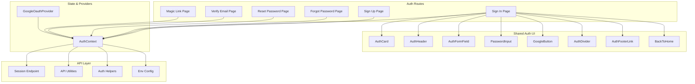

**Diagram sources**
- [AuthContext.tsx](file://contexts/AuthContext.tsx)
- [GoogleOauthProvider.tsx](file://providers/GoogleOauthProvider.tsx)
- [page.tsx](file://app/[locale]/(auth)/sign-in/page.tsx)
- [page.tsx](file://app/[locale]/(auth)/sign-up/page.tsx)
- [page.tsx](file://app/[locale]/(auth)/forgot-password/page.tsx)
- [page.tsx](file://app/[locale]/(auth)/reset-password/page.tsx)
- [page.tsx](file://app/[locale]/(auth)/verify-email/page.tsx)
- [route.ts](file://app/api/auth/session/route.ts)
- [AuthFormField.tsx](file://app/[locale]/(auth)/_components/AuthFormField.tsx)
- [PasswordInput.tsx](file://app/[locale]/(auth)/_components/PasswordInput.tsx)
- [GoogleButton.tsx](file://app/[locale]/(auth)/_components/GoogleButton.tsx)
- [AuthCard.tsx](file://app/[locale]/(auth)/_components/AuthCard.tsx)
- [AuthHeader.tsx](file://app/[locale]/(auth)/_components/AuthHeader.tsx)
- [AuthDivider.tsx](file://app/[locale]/(auth)/_components/AuthDivider.tsx)
- [AuthFooterLink.tsx](file://app/[locale]/(auth)/_components/AuthFooterLink.tsx)
- [BackToHome.tsx](file://app/[locale]/(auth)/_components/BackToHome.tsx)
- [api.ts](file://lib/api.ts)
- [auth.ts](file://lib/auth.ts)
- [env.ts](file://lib/env.ts)

**Section sources**
- [AuthContext.tsx](file://contexts/AuthContext.tsx)
- [GoogleOauthProvider.tsx](file://providers/GoogleOauthProvider.tsx)
- [layout.tsx](file://app/[locale]/(auth)/layout.tsx)
- [page.tsx](file://app/[locale]/(auth)/sign-in/page.tsx)
- [page.tsx](file://app/[locale]/(auth)/sign-up/page.tsx)
- [page.tsx](file://app/[locale]/(auth)/forgot-password/page.tsx)
- [page.tsx](file://app/[locale]/(auth)/reset-password/page.tsx)
- [page.tsx](file://app/[locale]/(auth)/verify-email/page.tsx)
- [route.ts](file://app/api/auth/session/route.ts)
- [AuthFormField.tsx](file://app/[locale]/(auth)/_components/AuthFormField.tsx)
- [PasswordInput.tsx](file://app/[locale]/(auth)/_components/PasswordInput.tsx)
- [GoogleButton.tsx](file://app/[locale]/(auth)/_components/GoogleButton.tsx)
- [AuthCard.tsx](file://app/[locale]/(auth)/_components/AuthCard.tsx)
- [AuthHeader.tsx](file://app/[locale]/(auth)/_components/AuthHeader.tsx)
- [AuthDivider.tsx](file://app/[locale]/(auth)/_components/AuthDivider.tsx)
- [AuthFooterLink.tsx](file://app/[locale]/(auth)/_components/AuthFooterLink.tsx)
- [BackToHome.tsx](file://app/[locale]/(auth)/_components/BackToHome.tsx)
- [api.ts](file://lib/api.ts)
- [auth.ts](file://lib/auth.ts)
- [env.ts](file://lib/env.ts)

## Core Components
- AuthContext: Provides centralized authentication state (user profile, tokens, loading, error), actions (login, register, logout, refresh session), and synchronization with server sessions.
- GoogleOauthProvider: Encapsulates Google OAuth client initialization and exposes methods to start the OAuth flow and handle callbacks.
- Auth UI Components: Reusable form fields, password input, divider, footer links, card wrapper, header, and back-to-home helper used across auth pages.
- Session API Endpoint: Validates and returns current session state for hydration and SSR consistency.
- Utilities: API client wrappers, auth helpers, and environment configuration for secure access to secrets and URLs.

Key responsibilities:
- State synchronization between client and server sessions.
- Error normalization and user-friendly messages.
- Secure storage and transmission of credentials/tokens.
- Consistent UX for loading, success, and error states.

**Section sources**
- [AuthContext.tsx](file://contexts/AuthContext.tsx)
- [GoogleOauthProvider.tsx](file://providers/GoogleOauthProvider.tsx)
- [AuthFormField.tsx](file://app/[locale]/(auth)/_components/AuthFormField.tsx)
- [PasswordInput.tsx](file://app/[locale]/(auth)/_components/PasswordInput.tsx)
- [GoogleButton.tsx](file://app/[locale]/(auth)/_components/GoogleButton.tsx)
- [AuthCard.tsx](file://app/[locale]/(auth)/_components/AuthCard.tsx)
- [AuthHeader.tsx](file://app/[locale]/(auth)/_components/AuthHeader.tsx)
- [AuthDivider.tsx](file://app/[locale]/(auth)/_components/AuthDivider.tsx)
- [AuthFooterLink.tsx](file://app/[locale]/(auth)/_components/AuthFooterLink.tsx)
- [BackToHome.tsx](file://app/[locale]/(auth)/_components/BackToHome.tsx)
- [route.ts](file://app/api/auth/session/route.ts)
- [api.ts](file://lib/api.ts)
- [auth.ts](file://lib/auth.ts)
- [env.ts](file://lib/env.ts)

## Architecture Overview
The authentication architecture follows a layered approach:
- Presentation layer: Auth pages and shared UI components.
- Context layer: AuthContext manages global state and orchestrates API calls.
- Provider layer: GoogleOauthProvider handles third-party identity flows.
- API layer: Session endpoint and utility functions communicate with backend services.
- Security layer: Environment config and helpers ensure safe usage of secrets and tokens.

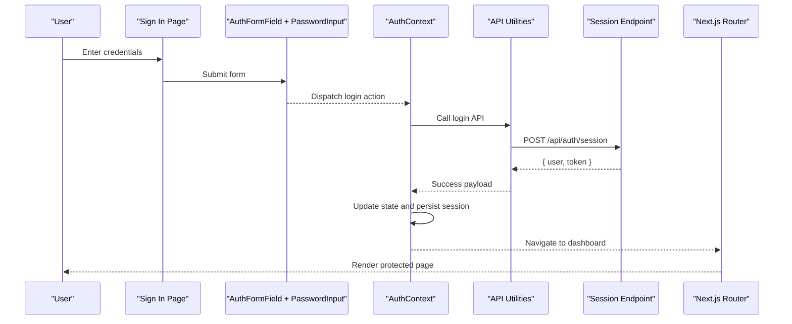

**Diagram sources**
- [page.tsx](file://app/[locale]/(auth)/sign-in/page.tsx)
- [AuthFormField.tsx](file://app/[locale]/(auth)/_components/AuthFormField.tsx)
- [PasswordInput.tsx](file://app/[locale]/(auth)/_components/PasswordInput.tsx)
- [AuthContext.tsx](file://contexts/AuthContext.tsx)
- [api.ts](file://lib/api.ts)
- [route.ts](file://app/api/auth/session/route.ts)

## Detailed Component Analysis

### AuthContext Implementation
AuthContext centralizes authentication state and lifecycle:
- State fields: user profile, tokens, loading flags, error messages, and session status.
- Actions: login, register, logout, refresh session, update profile, and clear errors.
- Effects: hydrate from server session on mount, persist tokens securely, and sync with server on navigation.
- Integration: consumed by auth pages and protected layouts; exposes hooks for components.

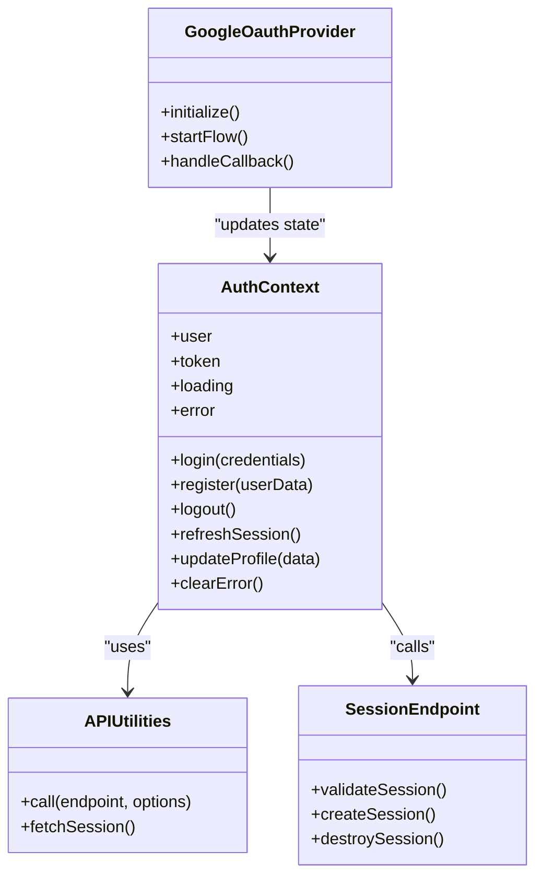

**Diagram sources**
- [AuthContext.tsx](file://contexts/AuthContext.tsx)
- [GoogleOauthProvider.tsx](file://providers/GoogleOauthProvider.tsx)
- [api.ts](file://lib/api.ts)
- [route.ts](file://app/api/auth/session/route.ts)

**Section sources**
- [AuthContext.tsx](file://contexts/AuthContext.tsx)
- [api.ts](file://lib/api.ts)
- [route.ts](file://app/api/auth/session/route.ts)

### Sign-In Flow
The sign-in page composes reusable form components and dispatches login through AuthContext:
- Collects email and password using controlled inputs.
- Validates locally before submission.
- Calls AuthContext.login which triggers API call and updates state.
- On success, navigates to the dashboard; on failure, displays normalized errors.

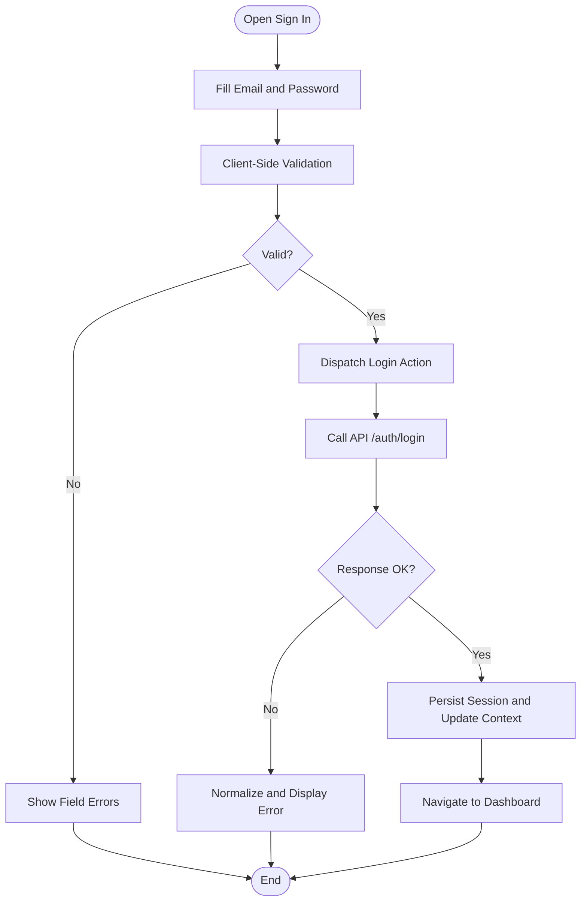

**Diagram sources**
- [page.tsx](file://app/[locale]/(auth)/sign-in/page.tsx)
- [AuthFormField.tsx](file://app/[locale]/(auth)/_components/AuthFormField.tsx)
- [PasswordInput.tsx](file://app/[locale]/(auth)/_components/PasswordInput.tsx)
- [AuthContext.tsx](file://contexts/AuthContext.tsx)
- [api.ts](file://lib/api.ts)

**Section sources**
- [page.tsx](file://app/[locale]/(auth)/sign-in/page.tsx)
- [AuthFormField.tsx](file://app/[locale]/(auth)/_components/AuthFormField.tsx)
- [PasswordInput.tsx](file://app/[locale]/(auth)/_components/PasswordInput.tsx)
- [AuthContext.tsx](file://contexts/AuthContext.tsx)
- [api.ts](file://lib/api.ts)

### Sign-Up Flow
Registration collects required user data, validates it, and submits via AuthContext.register:
- Uses shared form field components for consistent UX.
- Handles server-side validation errors and maps them to user-friendly messages.
- On success, redirects to sign-in or dashboard depending on backend behavior.

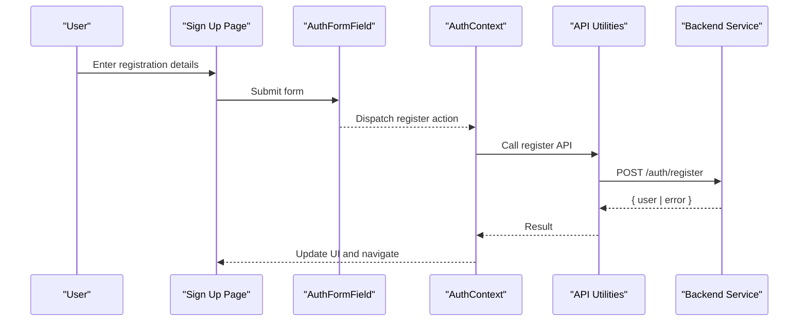

**Diagram sources**
- [page.tsx](file://app/[locale]/(auth)/sign-up/page.tsx)
- [AuthFormField.tsx](file://app/[locale]/(auth)/_components/AuthFormField.tsx)
- [AuthContext.tsx](file://contexts/AuthContext.tsx)
- [api.ts](file://lib/api.ts)

**Section sources**
- [page.tsx](file://app/[locale]/(auth)/sign-up/page.tsx)
- [AuthFormField.tsx](file://app/[locale]/(auth)/_components/AuthFormField.tsx)
- [AuthContext.tsx](file://contexts/AuthContext.tsx)
- [api.ts](file://lib/api.ts)

### Forgot Password and Reset Password
- Forgot Password: Submits email to request a reset link; shows confirmation message upon success.
- Reset Password: Presents a form to set a new password using a token from URL; validates constraints and calls reset API.

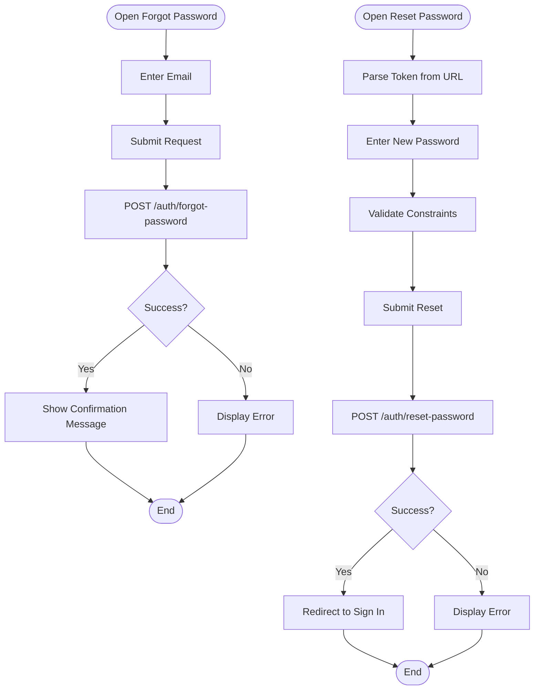

**Diagram sources**
- [page.tsx](file://app/[locale]/(auth)/forgot-password/page.tsx)
- [page.tsx](file://app/[locale]/(auth)/reset-password/page.tsx)
- [AuthFormField.tsx](file://app/[locale]/(auth)/_components/AuthFormField.tsx)
- [PasswordInput.tsx](file://app/[locale]/(auth)/_components/PasswordInput.tsx)
- [AuthContext.tsx](file://contexts/AuthContext.tsx)
- [api.ts](file://lib/api.ts)

**Section sources**
- [page.tsx](file://app/[locale]/(auth)/forgot-password/page.tsx)
- [page.tsx](file://app/[locale]/(auth)/reset-password/page.tsx)
- [AuthFormField.tsx](file://app/[locale]/(auth)/_components/AuthFormField.tsx)
- [PasswordInput.tsx](file://app/[locale]/(auth)/_components/PasswordInput.tsx)
- [AuthContext.tsx](file://contexts/AuthContext.tsx)
- [api.ts](file://lib/api.ts)

### Verify Email
Email verification uses a token from the URL to confirm the user's email address:
- Parses token and calls verification API.
- Displays success or error feedback accordingly.

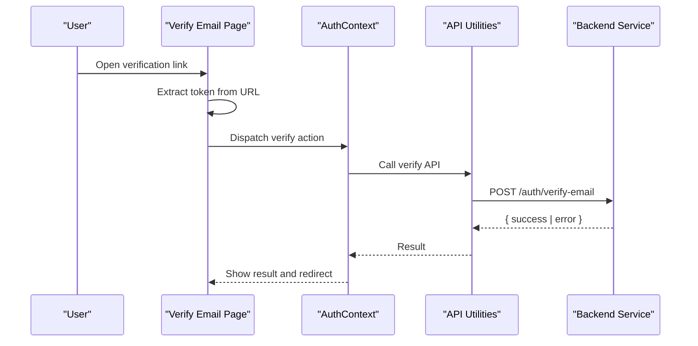

**Diagram sources**
- [page.tsx](file://app/[locale]/(auth)/verify-email/page.tsx)
- [AuthContext.tsx](file://contexts/AuthContext.tsx)
- [api.ts](file://lib/api.ts)

**Section sources**
- [page.tsx](file://app/[locale]/(auth)/verify-email/page.tsx)
- [AuthContext.tsx](file://contexts/AuthContext.tsx)
- [api.ts](file://lib/api.ts)

### Magic Link Authentication
Magic link flow allows passwordless login:
- User enters email and requests a magic link.
- Backend sends an email with a unique token.
- User clicks the link, which navigates to the magic-link page.
- The page validates the token and logs the user in automatically.

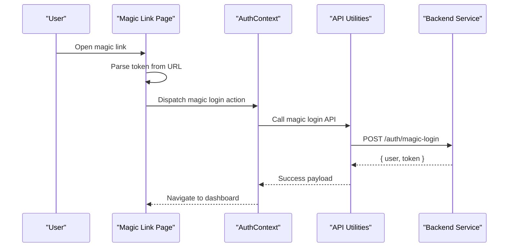

**Diagram sources**
- [page.tsx](file://app/[locale]/(auth)/magic-link/page.tsx)
- [AuthContext.tsx](file://contexts/AuthContext.tsx)
- [api.ts](file://lib/api.ts)

**Section sources**
- [page.tsx](file://app/[locale]/(auth)/magic-link/page.tsx)
- [AuthContext.tsx](file://contexts/AuthContext.tsx)
- [api.ts](file://lib/api.ts)

### Google OAuth Integration
Google OAuth is handled by a dedicated provider that initializes the client and starts the flow:
- Provider sets up Google client with configured scopes and redirect URIs.
- Auth pages include a Google button to initiate login.
- On callback, the provider extracts the token and delegates to AuthContext for session creation.

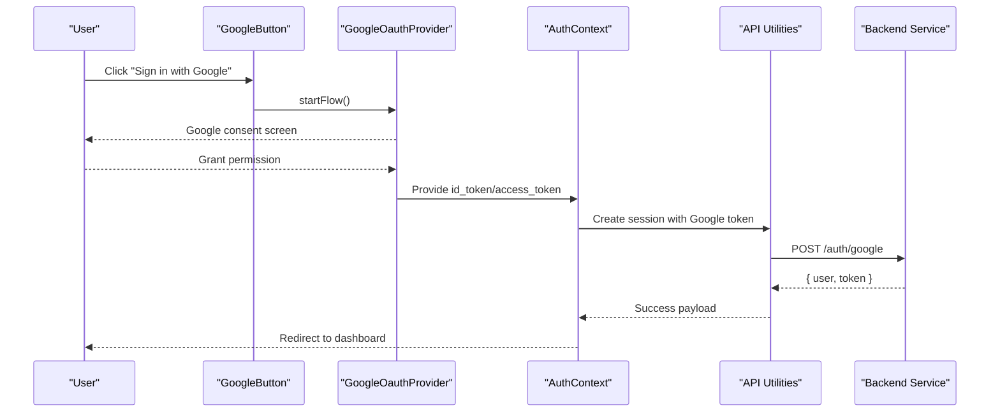

**Diagram sources**
- [GoogleButton.tsx](file://app/[locale]/(auth)/_components/GoogleButton.tsx)
- [GoogleOauthProvider.tsx](file://providers/GoogleOauthProvider.tsx)
- [AuthContext.tsx](file://contexts/AuthContext.tsx)
- [api.ts](file://lib/api.ts)

**Section sources**
- [GoogleButton.tsx](file://app/[locale]/(auth)/_components/GoogleButton.tsx)
- [GoogleOauthProvider.tsx](file://providers/GoogleOauthProvider.tsx)
- [AuthContext.tsx](file://contexts/AuthContext.tsx)
- [api.ts](file://lib/api.ts)

### Protected Routes and Layout Guards
Protected routes use layout-level guards and middleware to enforce authentication:
- The dashboard layout checks the current session and redirects unauthenticated users.
- Middleware can validate session cookies or tokens before rendering protected pages.
- Authenticated users see the dashboard main content; otherwise, they are redirected to sign-in.

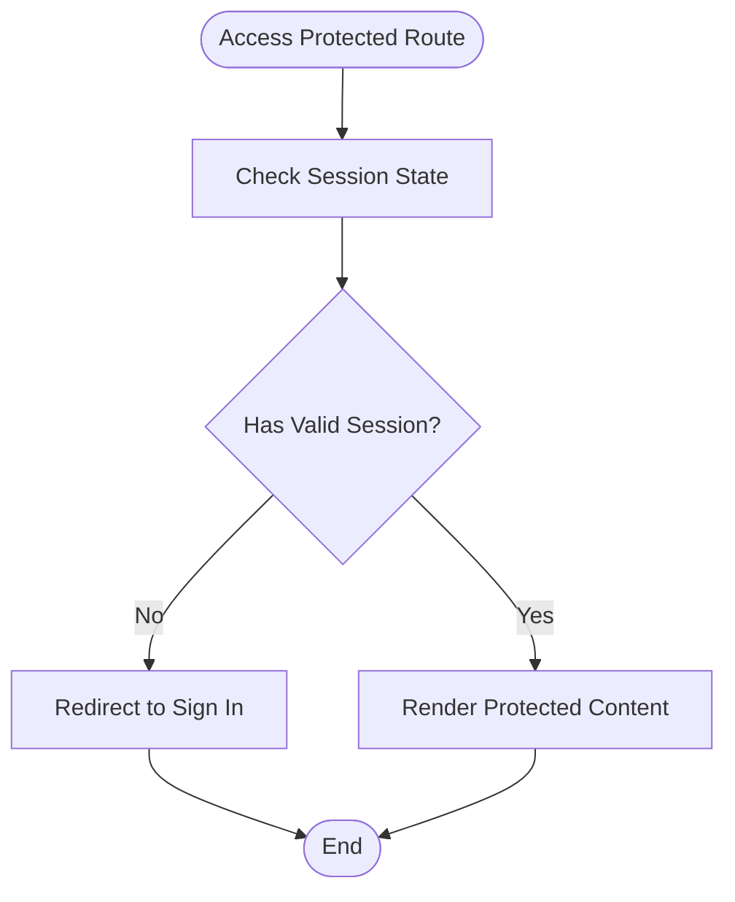

**Diagram sources**
- [layout.tsx](file://app/[locale]/dashboard/layout.tsx)
- [DashboardMain.tsx](file://app/[locale]/dashboard/_components/DashboardMain.tsx)
- [AuthContext.tsx](file://contexts/AuthContext.tsx)

**Section sources**
- [layout.tsx](file://app/[locale]/dashboard/layout.tsx)
- [DashboardMain.tsx](file://app/[locale]/dashboard/_components/DashboardMain.tsx)
- [AuthContext.tsx](file://contexts/AuthContext.tsx)

### Logout Process
Logout clears local state and invalidates the server session:
- Dispatches logout action in AuthContext.
- Calls session destroy endpoint.
- Clears persisted tokens and redirects to sign-in.

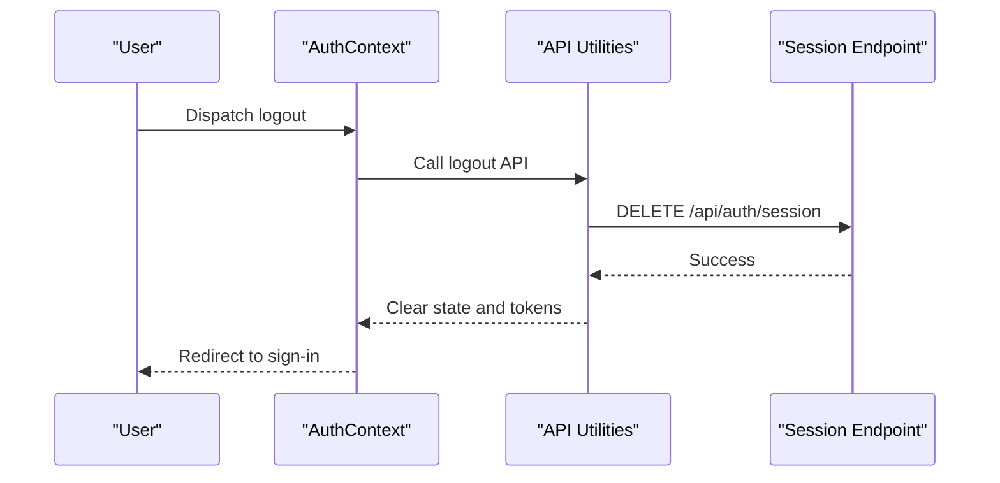

**Diagram sources**
- [AuthContext.tsx](file://contexts/AuthContext.tsx)
- [api.ts](file://lib/api.ts)
- [route.ts](file://app/api/auth/session/route.ts)

**Section sources**
- [AuthContext.tsx](file://contexts/AuthContext.tsx)
- [api.ts](file://lib/api.ts)
- [route.ts](file://app/api/auth/session/route.ts)

## Dependency Analysis
Authentication components depend on shared utilities and environment configuration:
- AuthContext depends on API utilities and session endpoint.
- Auth pages depend on shared UI components and AuthContext.
- GoogleOauthProvider depends on environment variables and integrates with AuthContext.
- Protected layouts depend on AuthContext to guard access.

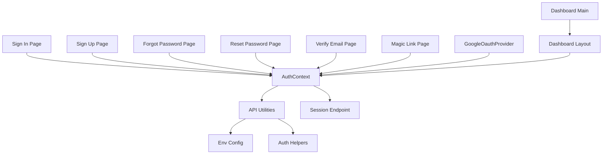

**Diagram sources**
- [AuthContext.tsx](file://contexts/AuthContext.tsx)
- [api.ts](file://lib/api.ts)
- [auth.ts](file://lib/auth.ts)
- [env.ts](file://lib/env.ts)
- [route.ts](file://app/api/auth/session/route.ts)
- [page.tsx](file://app/[locale]/(auth)/sign-in/page.tsx)
- [page.tsx](file://app/[locale]/(auth)/sign-up/page.tsx)
- [page.tsx](file://app/[locale]/(auth)/forgot-password/page.tsx)
- [page.tsx](file://app/[locale]/(auth)/reset-password/page.tsx)
- [page.tsx](file://app/[locale]/(auth)/verify-email/page.tsx)
- [page.tsx](file://app/[locale]/(auth)/magic-link/page.tsx)
- [GoogleOauthProvider.tsx](file://providers/GoogleOauthProvider.tsx)
- [layout.tsx](file://app/[locale]/dashboard/layout.tsx)
- [DashboardMain.tsx](file://app/[locale]/dashboard/_components/DashboardMain.tsx)

**Section sources**
- [AuthContext.tsx](file://contexts/AuthContext.tsx)
- [api.ts](file://lib/api.ts)
- [auth.ts](file://lib/auth.ts)
- [env.ts](file://lib/env.ts)
- [route.ts](file://app/api/auth/session/route.ts)
- [page.tsx](file://app/[locale]/(auth)/sign-in/page.tsx)
- [page.tsx](file://app/[locale]/(auth)/sign-up/page.tsx)
- [page.tsx](file://app/[locale]/(auth)/forgot-password/page.tsx)
- [page.tsx](file://app/[locale]/(auth)/reset-password/page.tsx)
- [page.tsx](file://app/[locale]/(auth)/verify-email/page.tsx)
- [page.tsx](file://app/[locale]/(auth)/magic-link/page.tsx)
- [GoogleOauthProvider.tsx](file://providers/GoogleOauthProvider.tsx)
- [layout.tsx](file://app/[locale]/dashboard/layout.tsx)
- [DashboardMain.tsx](file://app/[locale]/dashboard/_components/DashboardMain.tsx)

## Performance Considerations
- Minimize re-renders by memoizing context values and avoiding unnecessary state updates.
- Debounce rapid API calls during login attempts to prevent race conditions.
- Use optimistic UI updates where safe, then reconcile with server responses.
- Cache session hydration results to avoid redundant network requests.
- Keep token payloads minimal and avoid storing sensitive data in localStorage unless necessary.

[No sources needed since this section provides general guidance]

## Troubleshooting Guide
Common issues and debugging techniques:
- Session not syncing: Ensure the session endpoint is reachable and returns correct headers; check cookie settings and SameSite policies.
- OAuth failures: Verify client ID, redirect URI, and scopes; inspect console for Google SDK errors.
- Validation errors: Confirm client-side schemas match backend expectations; normalize error messages for clarity.
- Navigation loops: Review layout guards and redirect logic to avoid infinite redirects when session is invalid.
- CORS and proxy: Ensure API calls go through the configured proxy or have proper CORS headers.

Practical steps:
- Add logging around API calls and context actions to trace state transitions.
- Inspect network tab for request/response payloads and status codes.
- Use browser dev tools to inspect cookies and local storage for tokens.
- Test with different browsers and devices to catch environment-specific issues.

**Section sources**
- [AuthContext.tsx](file://contexts/AuthContext.tsx)
- [api.ts](file://lib/api.ts)
- [route.ts](file://app/api/auth/session/route.ts)
- [GoogleOauthProvider.tsx](file://providers/GoogleOauthProvider.tsx)

## Conclusion
The authentication system combines a robust context-driven state model, reusable UI components, and secure API interactions. It supports multiple login methods including email/password, magic links, and Google OAuth, while enforcing access control via layout guards. Following the recommended practices for error handling, performance, and security will help maintain a reliable and user-friendly experience.

[No sources needed since this section summarizes without analyzing specific files]

## Appendices

### Implementing Custom Authentication Providers
- Create a provider component similar to GoogleOauthProvider to initialize your provider client and expose start/handle methods.
- Integrate with AuthContext by updating state and calling API endpoints to create or exchange tokens.
- Ensure environment variables are configured for client IDs and secrets.
- Add UI buttons to trigger the provider flow and handle callbacks consistently.

**Section sources**
- [GoogleOauthProvider.tsx](file://providers/GoogleOauthProvider.tsx)
- [AuthContext.tsx](file://contexts/AuthContext.tsx)
- [env.ts](file://lib/env.ts)

### Handling Authentication Errors
- Normalize backend errors into user-friendly messages.
- Display contextual errors near relevant fields or as global alerts.
- Avoid exposing internal stack traces or sensitive details.
- Log errors for diagnostics without leaking secrets.

**Section sources**
- [AuthContext.tsx](file://contexts/AuthContext.tsx)
- [api.ts](file://lib/api.ts)

### Managing User Permissions
- Extend AuthContext to include roles or permissions from the user profile.
- Use layout guards and route-level checks to restrict access based on permissions.
- Conditionally render UI elements according to user capabilities.

**Section sources**
- [AuthContext.tsx](file://contexts/AuthContext.tsx)
- [layout.tsx](file://app/[locale]/dashboard/layout.tsx)

### Security Best Practices
- Use HTTPS for all authentication endpoints.
- Store tokens securely (prefer httpOnly cookies over localStorage).
- Enforce strong password policies and rate limiting on the backend.
- Validate and sanitize all inputs on both client and server.
- Rotate secrets regularly and limit scope of OAuth permissions.

[No sources needed since this section provides general guidance]