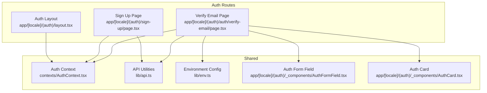
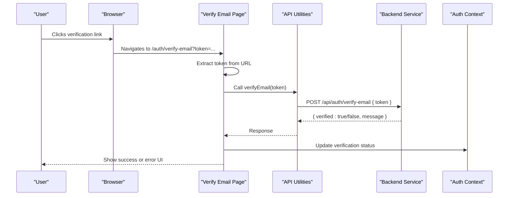
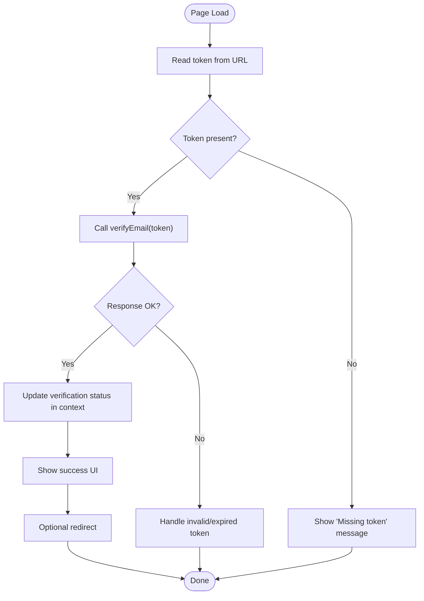
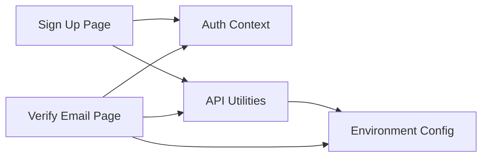

# Email Verification System

<cite>
**Referenced Files in This Document**
- [verify-email/page.tsx](file://app/[locale]/(auth)/auth/verify-email/page.tsx)
- [AuthContext.tsx](file://contexts/AuthContext.tsx)
- [api.ts](file://lib/api.ts)
- [env.ts](file://lib/env.ts)
- [sign-up/page.tsx](file://app/[locale]/(auth)/sign-up/page.tsx)
- [AuthFormField.tsx](file://app/[locale]/(auth)/_components/AuthFormField.tsx)
- [AuthCard.tsx](file://app/[locale]/(auth)/_components/AuthCard.tsx)
- [layout.tsx](file://app/[locale]/(auth)/layout.tsx)
</cite>

## Table of Contents
1. [Introduction](#introduction)
2. [Project Structure](#project-structure)
3. [Core Components](#core-components)
4. [Architecture Overview](#architecture-overview)
5. [Detailed Component Analysis](#detailed-component-analysis)
6. [Dependency Analysis](#dependency-analysis)
7. [Performance Considerations](#performance-considerations)
8. [Troubleshooting Guide](#troubleshooting-guide)
9. [Conclusion](#conclusion)
10. [Appendices](#appendices)

## Introduction
This document explains the email verification system implemented in the frontend application. It covers how users receive and use verification links, how the verification page validates tokens, how status is tracked across the app, and how to customize flows such as reminders and error handling. The goal is to help developers implement consistent, secure, and user-friendly verification experiences.

## Project Structure
The email verification feature is primarily implemented under the auth routes and shared contexts/libraries:
- Verification page route for handling verification links
- Auth context for global state (including verification status)
- API utilities for calling backend endpoints
- Environment configuration for base URLs and flags
- Sign-up flow that triggers sending verification emails
- Shared UI components used by the verification page

**Diagram sources**
- [verify-email/page.tsx](file://app/[locale]/(auth)/auth/verify-email/page.tsx)
- [AuthContext.tsx](file://contexts/AuthContext.tsx)
- [api.ts](file://lib/api.ts)
- [env.ts](file://lib/env.ts)
- [sign-up/page.tsx](file://app/[locale]/(auth)/sign-up/page.tsx)
- [AuthFormField.tsx](file://app/[locale]/(auth)/_components/AuthFormField.tsx)
- [AuthCard.tsx](file://app/[locale]/(auth)/_components/AuthCard.tsx)
- [layout.tsx](file://app/[locale]/(auth)/layout.tsx)

**Section sources**
- [verify-email/page.tsx](file://app/[locale]/(auth)/auth/verify-email/page.tsx)
- [AuthContext.tsx](file://contexts/AuthContext.tsx)
- [api.ts](file://lib/api.ts)
- [env.ts](file://lib/env.ts)
- [sign-up/page.tsx](file://app/[locale]/(auth)/sign-up/page.tsx)
- [AuthFormField.tsx](file://app/[locale]/(auth)/_components/AuthFormField.tsx)
- [AuthCard.tsx](file://app/[locale]/(auth)/_components/AuthCard.tsx)
- [layout.tsx](file://app/[locale]/(auth)/layout.tsx)

## Core Components
- Verify Email Page: Renders the verification experience, reads token from URL, calls verification endpoint, updates UI and global state, and handles success/error states.
- Auth Context: Provides global verification status and related actions so other parts of the app can react to verification changes.
- API Utilities: Encapsulates HTTP calls to backend verification endpoints with environment-based base URLs.
- Environment Config: Supplies runtime values like base URL and feature toggles used by API calls.
- Sign-Up Flow: Initiates sending a verification email after successful registration.
- Shared UI Components: Provide consistent form fields and card layout for the verification page.

Key responsibilities:
- Token extraction from URL query parameters
- Calling verification endpoint
- Updating verification status in context
- Displaying appropriate messages and redirects
- Handling expired or invalid tokens gracefully

**Section sources**
- [verify-email/page.tsx](file://app/[locale]/(auth)/auth/verify-email/page.tsx)
- [AuthContext.tsx](file://contexts/AuthContext.tsx)
- [api.ts](file://lib/api.ts)
- [env.ts](file://lib/env.ts)
- [sign-up/page.tsx](file://app/[locale]/(auth)/sign-up/page.tsx)
- [AuthFormField.tsx](file://app/[locale]/(auth)/_components/AuthFormField.tsx)
- [AuthCard.tsx](file://app/[locale]/(auth)/_components/AuthCard.tsx)

## Architecture Overview
The verification flow integrates the verification page, API layer, and global auth context. The sequence below shows the typical client-side flow when a user clicks a verification link.

**Diagram sources**
- [verify-email/page.tsx](file://app/[locale]/(auth)/auth/verify-email/page.tsx)
- [api.ts](file://lib/api.ts)
- [AuthContext.tsx](file://contexts/AuthContext.tsx)

## Detailed Component Analysis

### Verify Email Page
Responsibilities:
- Parse token from URL query parameters
- Validate presence and format before making requests
- Invoke verification API
- Update local UI and global context
- Handle success, expired, and invalid token scenarios
- Optionally redirect after successful verification

Implementation highlights:
- Reads token from URL search params
- Calls verification endpoint via API utilities
- Updates verification status in context
- Displays localized messages based on response
- Redirects to sign-in or dashboard upon success

**Diagram sources**
- [verify-email/page.tsx](file://app/[locale]/(auth)/auth/verify-email/page.tsx)

**Section sources**
- [verify-email/page.tsx](file://app/[locale]/(auth)/auth/verify-email/page.tsx)

### Auth Context
Responsibilities:
- Maintain verification status globally
- Provide setters to update status from any component
- Expose current state to consumers (e.g., header, protected routes)

Usage patterns:
- Verification page updates status after API call
- Protected routes may check status to gate access
- Header or banners can display verification prompts

**Section sources**
- [AuthContext.tsx](file://contexts/AuthContext.tsx)

### API Utilities
Responsibilities:
- Wrap HTTP calls to backend verification endpoints
- Use environment config for base URLs
- Normalize responses and errors for UI consumption

Integration points:
- Called by verification page
- May be reused by resending verification flows

**Section sources**
- [api.ts](file://lib/api.ts)
- [env.ts](file://lib/env.ts)

### Sign-Up Flow
Responsibilities:
- On successful registration, trigger sending a verification email
- Inform user about next steps and where to find the email

Integration points:
- Uses API utilities to register user
- Optionally sets initial verification status in context

**Section sources**
- [sign-up/page.tsx](file://app/[locale]/(auth)/sign-up/page.tsx)

### Shared UI Components
- AuthFormField: Reusable input field with validation feedback used by verification and sign-up forms
- AuthCard: Card wrapper providing consistent layout and styling for auth pages
- Auth Layout: Wraps auth routes with common structure and context providers

**Section sources**
- [AuthFormField.tsx](file://app/[locale]/(auth)/_components/AuthFormField.tsx)
- [AuthCard.tsx](file://app/[locale]/(auth)/_components/AuthCard.tsx)
- [layout.tsx](file://app/[locale]/(auth)/layout.tsx)

## Dependency Analysis
The following diagram maps key dependencies among core files involved in email verification.

**Diagram sources**
- [verify-email/page.tsx](file://app/[locale]/(auth)/auth/verify-email/page.tsx)
- [AuthContext.tsx](file://contexts/AuthContext.tsx)
- [api.ts](file://lib/api.ts)
- [env.ts](file://lib/env.ts)
- [sign-up/page.tsx](file://app/[locale]/(auth)/sign-up/page.tsx)

**Section sources**
- [verify-email/page.tsx](file://app/[locale]/(auth)/auth/verify-email/page.tsx)
- [AuthContext.tsx](file://contexts/AuthContext.tsx)
- [api.ts](file://lib/api.ts)
- [env.ts](file://lib/env.ts)
- [sign-up/page.tsx](file://app/[locale]/(auth)/sign-up/page.tsx)

## Performance Considerations
- Avoid redundant verification calls by caching results in context during the session
- Debounce resend verification attempts if you add a “Resend” button
- Keep network payloads minimal; only send the token
- Prefer client-side validation of token presence before making requests to reduce unnecessary network calls

[No sources needed since this section provides general guidance]

## Troubleshooting Guide
Common issues and resolutions:
- Missing token in URL: Ensure the verification link includes the token parameter and that the page reads it correctly
- Invalid or expired token: Present clear messaging and offer a way to request a new verification email
- Network errors: Surface user-friendly errors and allow retry
- State mismatch: After successful verification, ensure the context is updated consistently to reflect the new state

Operational tips:
- Log request/response shapes (without sensitive data) to diagnose integration issues
- Confirm environment variables are set correctly for API base URLs
- Test both success and failure paths thoroughly, including edge cases like malformed tokens

**Section sources**
- [verify-email/page.tsx](file://app/[locale]/(auth)/auth/verify-email/page.tsx)
- [api.ts](file://lib/api.ts)
- [env.ts](file://lib/env.ts)

## Conclusion
The email verification system combines a focused verification page, robust API integration, and global state management to deliver a reliable and user-friendly experience. By centralizing verification logic and exposing status through context, the application maintains consistency across routes and components. Customization points include UI copy, redirect behavior, and optional reminder flows.

[No sources needed since this section summarizes without analyzing specific files]

## Appendices

### Implementing Custom Verification Flows
- Add a “Resend verification email” action:
  - Create a handler that calls the resend endpoint using API utilities
  - Update UI to show confirmation and disable the button briefly to prevent spam
- Add verification reminders:
  - Integrate a periodic check or scheduled notification that prompts users to verify their email if still pending
  - Respect rate limits and provide an easy way to dismiss or act on reminders

### Managing Verification States Across the Application
- Use the auth context to read and write verification status
- Gate protected routes based on verification status
- Display contextual banners prompting unverified users to complete verification

### Email Template Customization
- While templates are typically managed on the backend, ensure your frontend supports localization and dynamic content placeholders for messages shown after verification
- Align user-facing messages with backend template outputs to avoid confusion