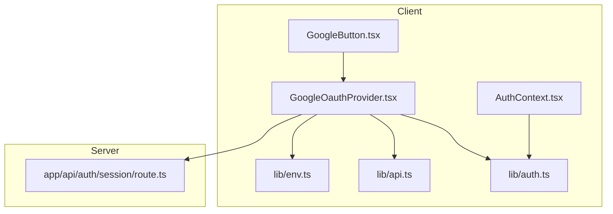
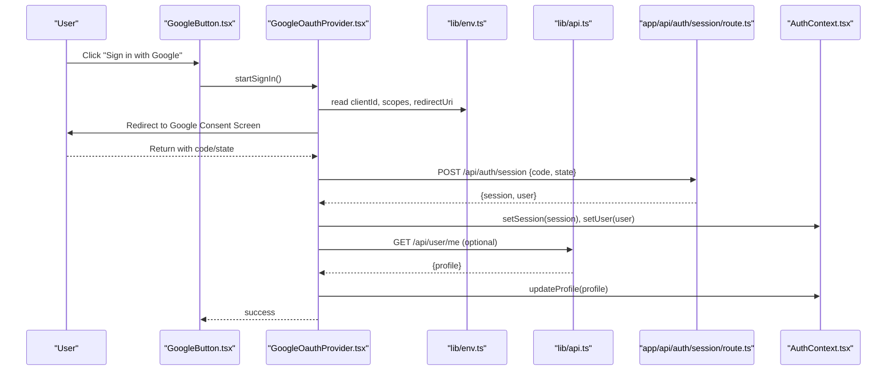
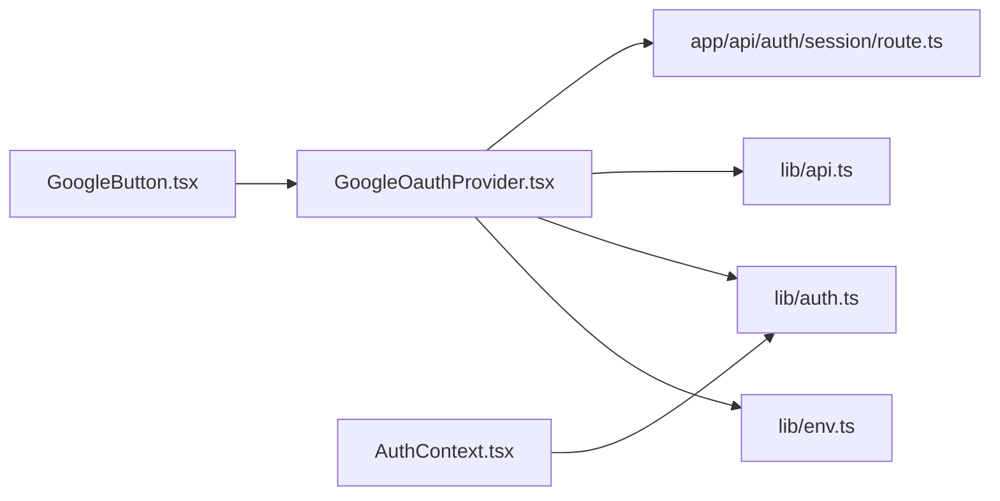

# Google OAuth Integration

<cite>
**Referenced Files in This Document**
- [GoogleButton.tsx](file://app/[locale]/(auth)/_components/GoogleButton.tsx)
- [GoogleOauthProvider.tsx](file://providers/GoogleOauthProvider.tsx)
- [AuthContext.tsx](file://contexts/AuthContext.tsx)
- [auth.ts](file://lib/auth.ts)
- [env.ts](file://lib/env.ts)
- [api.ts](file://lib/api.ts)
- [route.ts](file://app/api/auth/session/route.ts)
- [page.tsx](file://app/[locale]/(auth)/sign-in/page.tsx)
</cite>

## Table of Contents
1. [Introduction](#introduction)
2. [Project Structure](#project-structure)
3. [Core Components](#core-components)
4. [Architecture Overview](#architecture-overview)
5. [Detailed Component Analysis](#detailed-component-analysis)
6. [Dependency Analysis](#dependency-analysis)
7. [Performance Considerations](#performance-considerations)
8. [Troubleshooting Guide](#troubleshooting-guide)
9. [Conclusion](#conclusion)
10. [Appendices](#appendices)

## Introduction
This document explains the Google OAuth integration in the project, covering the end-to-end flow from the sign-in button to session establishment and user profile synchronization. It also documents configuration, token management, automatic account linking, profile picture handling, error handling, and how to add or customize providers.

## Project Structure
The Google OAuth implementation spans UI components, provider context, client utilities, server routes, and environment configuration:
- UI: Google sign-in button and sign-in page
- Provider: Google OAuth provider wrapper for client-side state
- Context: Authentication context for global auth state
- Client Libs: Auth helpers, API calls, and environment access
- Server Route: Session endpoint used by the provider
- Environment: Configuration for OAuth credentials and URLs

**Diagram sources**
- [GoogleButton.tsx](file://app/[locale]/(auth)/_components/GoogleButton.tsx)
- [GoogleOauthProvider.tsx](file://providers/GoogleOauthProvider.tsx)
- [AuthContext.tsx](file://contexts/AuthContext.tsx)
- [auth.ts](file://lib/auth.ts)
- [api.ts](file://lib/api.ts)
- [env.ts](file://lib/env.ts)
- [route.ts](file://app/api/auth/session/route.ts)

**Section sources**
- [GoogleButton.tsx](file://app/[locale]/(auth)/_components/GoogleButton.tsx)
- [GoogleOauthProvider.tsx](file://providers/GoogleOauthProvider.tsx)
- [AuthContext.tsx](file://contexts/AuthContext.tsx)
- [auth.ts](file://lib/auth.ts)
- [api.ts](file://lib/api.ts)
- [env.ts](file://lib/env.ts)
- [route.ts](file://app/api/auth/session/route.ts)
- [page.tsx](file://app/[locale]/(auth)/sign-in/page.tsx)

## Core Components
- Google sign-in button: Triggers the Google provider’s sign-in flow and handles UI states (loading, errors).
- Google provider: Manages the Google OAuth lifecycle on the client, including redirect, callback parsing, and session creation.
- Auth context: Provides authenticated state and actions across the app.
- Client auth helpers: Encapsulate token and session operations, and call server endpoints.
- API client: Centralized HTTP client used to call backend APIs.
- Environment config: Supplies OAuth client ID, scopes, and redirect URLs.
- Server session route: Validates the OAuth response and establishes a session.

Key responsibilities:
- UI triggers and feedback
- Provider orchestration and URL construction
- Token exchange and session establishment
- Profile data mapping and persistence
- Error normalization and retry strategies

**Section sources**
- [GoogleButton.tsx](file://app/[locale]/(auth)/_components/GoogleButton.tsx)
- [GoogleOauthProvider.tsx](file://providers/GoogleOauthProvider.tsx)
- [AuthContext.tsx](file://contexts/AuthContext.tsx)
- [auth.ts](file://lib/auth.ts)
- [api.ts](file://lib/api.ts)
- [env.ts](file://lib/env.ts)
- [route.ts](file://app/api/auth/session/route.ts)

## Architecture Overview
The flow uses a client-side Google provider that redirects to Google, receives an authorization code, and exchanges it via a server session route to establish a session. The client then updates global auth state and fetches user profile data.

**Diagram sources**
- [GoogleButton.tsx](file://app/[locale]/(auth)/_components/GoogleButton.tsx)
- [GoogleOauthProvider.tsx](file://providers/GoogleOauthProvider.tsx)
- [env.ts](file://lib/env.ts)
- [api.ts](file://lib/api.ts)
- [route.ts](file://app/api/auth/session/route.ts)
- [AuthContext.tsx](file://contexts/AuthContext.tsx)

## Detailed Component Analysis

### Google Sign-In Button
- Purpose: Render a branded button and initiate the provider’s sign-in flow.
- Behavior:
  - On click, calls the provider’s sign-in method.
  - Displays loading state while redirect occurs.
  - Shows error messages if sign-in fails.
- Integration:
  - Consumed by the sign-in page layout.
  - Uses theme-aware styling consistent with other auth components.

Best practices:
- Disable the button during pending flows.
- Provide accessible labels and keyboard support.
- Surface provider-specific errors to users.

**Section sources**
- [GoogleButton.tsx](file://app/[locale]/(auth)/_components/GoogleButton.tsx)
- [page.tsx](file://app/[locale]/(auth)/sign-in/page.tsx)

### Google OAuth Provider
- Responsibilities:
  - Build the Google authorization URL using configured client ID, scopes, and redirect URI.
  - Handle the callback by extracting the authorization code and state.
  - Exchange the code for a session via the server session route.
  - Update global authentication state and user profile.
  - Manage errors and edge cases (state mismatch, invalid codes, network failures).
- Data mapping:
  - Maps Google profile fields to internal user model (name, email, avatar URL).
  - Handles missing or partial profile data gracefully.
- Token management:
  - Stores tokens securely in memory and/or secure cookies as implemented by the session route.
  - Refreshes tokens when needed based on server policy.

Error handling:
- Normalizes provider errors into user-friendly messages.
- Retries transient failures where appropriate.
- Logs diagnostic information without exposing secrets.

**Section sources**
- [GoogleOauthProvider.tsx](file://providers/GoogleOauthProvider.tsx)
- [env.ts](file://lib/env.ts)
- [auth.ts](file://lib/auth.ts)
- [api.ts](file://lib/api.ts)
- [route.ts](file://app/api/auth/session/route.ts)

### Authentication Context
- Exposes current session and user state to the application.
- Provides actions to log in, log out, and refresh session.
- Persists minimal state to avoid unnecessary re-renders.
- Integrates with the provider to keep UI in sync after successful sign-in.

**Section sources**
- [AuthContext.tsx](file://contexts/AuthContext.tsx)
- [auth.ts](file://lib/auth.ts)

### Client Utilities (Auth and API)
- Auth helpers:
  - Encapsulate session creation, retrieval, and clearing.
  - Attach tokens to outgoing requests as required by the server.
- API client:
  - Centralized HTTP client with base URL, interceptors, and error formatting.
  - Used to fetch user profile and perform protected actions.

**Section sources**
- [auth.ts](file://lib/auth.ts)
- [api.ts](file://lib/api.ts)

### Environment Configuration
- Required variables:
  - Google client ID
  - Scopes (e.g., openid, profile, email)
  - Redirect URI (must match Google Console settings)
  - Optional: custom domain or API base URL
- Validation:
  - Fails fast at startup if critical values are missing.
  - Provides defaults for non-critical options.

**Section sources**
- [env.ts](file://lib/env.ts)

### Server Session Route
- Endpoint:
  - Accepts the authorization code and state returned from Google.
- Processing:
  - Validates state to prevent CSRF.
  - Exchanges the code for tokens with Google.
  - Creates or links a user account based on email identity.
  - Establishes a session and returns minimal user info.
- Security:
  - Enforces HTTPS and validates origins.
  - Sets secure, httpOnly cookies for tokens.

**Section sources**
- [route.ts](file://app/api/auth/session/route.ts)

## Dependency Analysis
The following diagram shows key dependencies between modules involved in the Google OAuth flow.

**Diagram sources**
- [GoogleButton.tsx](file://app/[locale]/(auth)/_components/GoogleButton.tsx)
- [GoogleOauthProvider.tsx](file://providers/GoogleOauthProvider.tsx)
- [env.ts](file://lib/env.ts)
- [auth.ts](file://lib/auth.ts)
- [api.ts](file://lib/api.ts)
- [route.ts](file://app/api/auth/session/route.ts)
- [AuthContext.tsx](file://contexts/AuthContext.tsx)

**Section sources**
- [GoogleButton.tsx](file://app/[locale]/(auth)/_components/GoogleButton.tsx)
- [GoogleOauthProvider.tsx](file://providers/GoogleOauthProvider.tsx)
- [env.ts](file://lib/env.ts)
- [auth.ts](file://lib/auth.ts)
- [api.ts](file://lib/api.ts)
- [route.ts](file://app/api/auth/session/route.ts)
- [AuthContext.tsx](file://contexts/AuthContext.tsx)

## Performance Considerations
- Minimize redirects: Use single-page flows where possible and cache user profiles locally after first load.
- Defer heavy work: Load profile images lazily and use responsive sizes.
- Avoid redundant API calls: Coalesce requests and cache responses with short TTLs.
- Optimize bundle size: Keep provider logic tree-shakeable and avoid importing heavy libraries unnecessarily.

[No sources needed since this section provides general guidance]

## Troubleshooting Guide
Common issues and resolutions:
- Mismatched redirect URI: Ensure the redirect URI matches exactly what is configured in Google Console, including scheme and trailing slash.
- Invalid state parameter: Verify state generation and validation; ensure no proxy strips query parameters.
- Missing scopes: Request at least openid, profile, and email to retrieve basic user data.
- CORS or origin errors: Confirm allowed JavaScript origins and authorized redirect URIs in Google Console.
- Network timeouts: Implement retries with exponential backoff for token exchange.
- Profile picture not loading: Validate image URL availability and handle broken links by falling back to a default avatar.

Operational checks:
- Inspect browser console for provider errors.
- Review server logs for token exchange failures.
- Validate environment variables at runtime.

**Section sources**
- [GoogleOauthProvider.tsx](file://providers/GoogleOauthProvider.tsx)
- [route.ts](file://app/api/auth/session/route.ts)
- [env.ts](file://lib/env.ts)

## Conclusion
The Google OAuth integration follows a standard client-server pattern: the client initiates the flow, the server validates and establishes a session, and the client updates global state and user profile. By centralizing configuration, normalizing errors, and carefully managing tokens and profile data, the system provides a robust and maintainable authentication experience. Extending to additional providers or customizing flows can be achieved by adding new provider modules and updating the session route accordingly.

[No sources needed since this section summarizes without analyzing specific files]

## Appendices

### Adding Additional OAuth Providers
Steps:
- Create a new provider module similar to the Google provider.
- Configure provider-specific environment variables.
- Extend the session route to handle the new provider’s callback.
- Add a corresponding sign-in button component and wire it into the sign-in page.
- Map provider profile fields to the internal user model.

[No sources needed since this section provides general guidance]

### Customizing OAuth Flows
Options:
- Adjust scopes to request additional data.
- Customize redirect behavior (e.g., post-login landing pages).
- Implement pre-login hooks to enrich user data before session creation.
- Add multi-factor or consent screens as required by your security policy.

[No sources needed since this section provides general guidance]

### Handling OAuth-Specific Errors and Edge Cases
Recommendations:
- Normalize all provider errors into a common schema.
- Distinguish between recoverable and fatal errors.
- Log detailed diagnostics server-side without leaking sensitive data.
- Provide clear user-facing messages and recovery steps.

[No sources needed since this section provides general guidance]