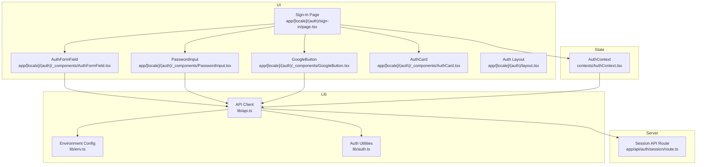
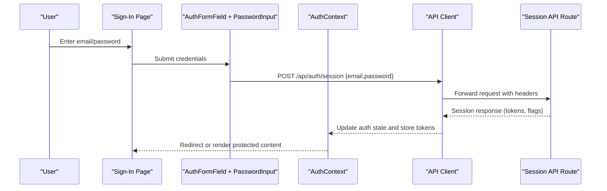
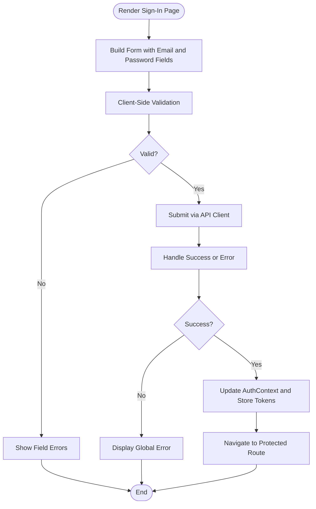
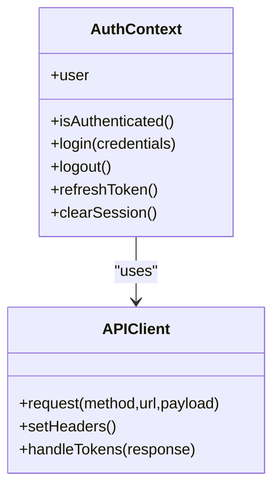
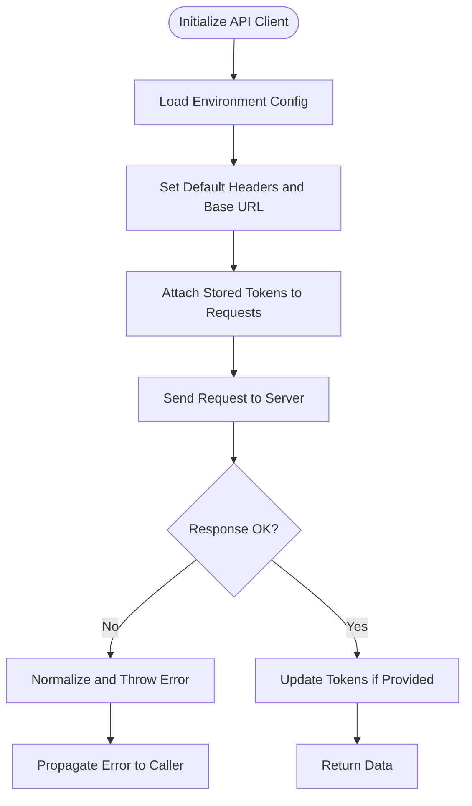
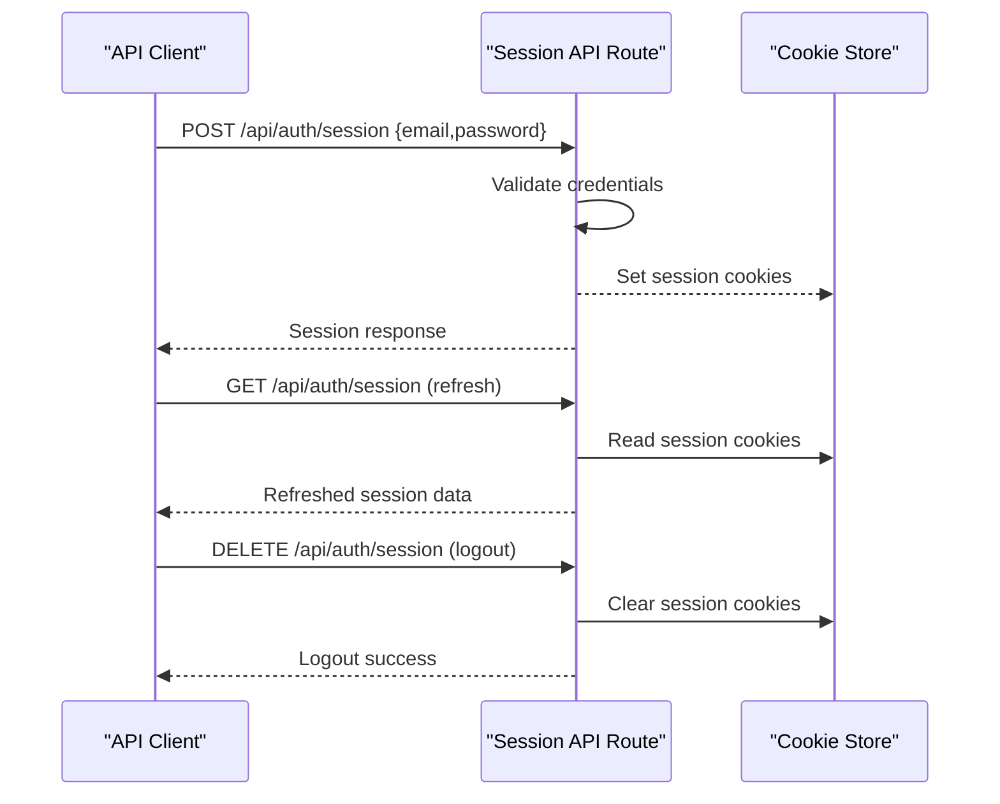
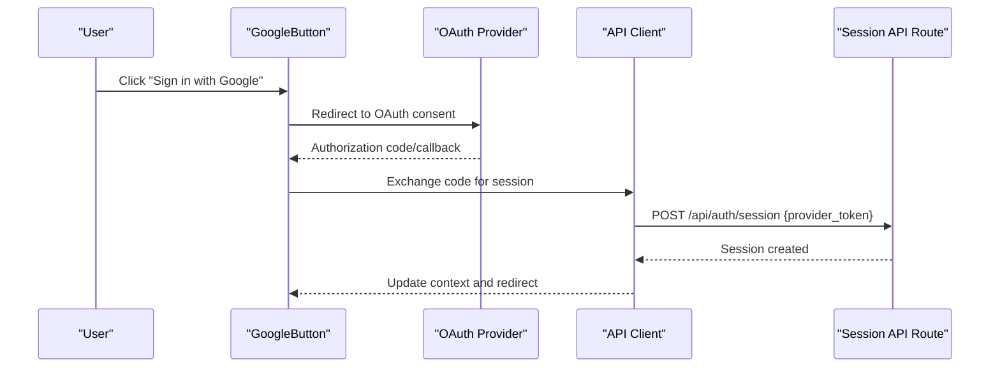
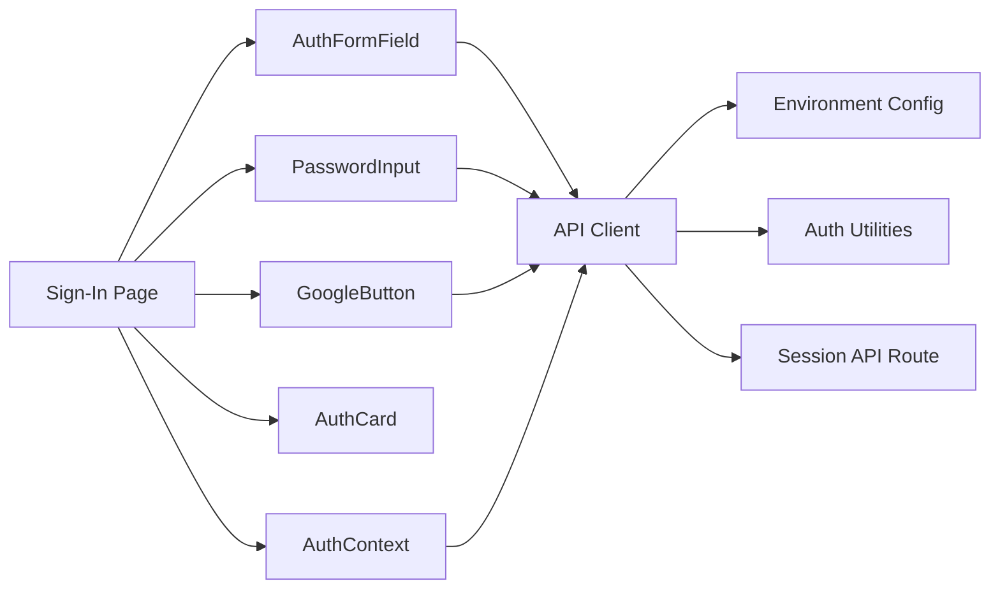

# Login and Session Management

<cite>
**Referenced Files in This Document**
- [sign-in/page.tsx](file://app/[locale]/(auth)/sign-in/page.tsx)
- [AuthFormField.tsx](file://app/[locale]/(auth)/_components/AuthFormField.tsx)
- [PasswordInput.tsx](file://app/[locale]/(auth)/_components/PasswordInput.tsx)
- [GoogleButton.tsx](file://app/[locale]/(auth)/_components/GoogleButton.tsx)
- [AuthCard.tsx](file://app/[locale]/(auth)/_components/AuthCard.tsx)
- [layout.tsx](file://app/[locale]/(auth)/layout.tsx)
- [AuthContext.tsx](file://contexts/AuthContext.tsx)
- [api.ts](file://lib/api.ts)
- [auth.ts](file://lib/auth.ts)
- [env.ts](file://lib/env.ts)
- [route.ts](file://app/api/auth/session/route.ts)
</cite>

## Table of Contents
1. [Introduction](#introduction)
2. [Project Structure](#project-structure)
3. [Core Components](#core-components)
4. [Architecture Overview](#architecture-overview)
5. [Detailed Component Analysis](#detailed-component-analysis)
6. [Dependency Analysis](#dependency-analysis)
7. [Performance Considerations](#performance-considerations)
8. [Troubleshooting Guide](#troubleshooting-guide)
9. [Conclusion](#conclusion)
10. [Appendices](#appendices)

## Introduction
This document explains the login functionality and session management in the application. It covers the login form implementation, credential validation, authentication API calls, session creation, token storage, automatic session renewal, logout processes, session cleanup, and security measures such as CSRF protection. It also includes examples for remember me, multi-device sessions, and session timeout management, along with troubleshooting and performance optimization guidance.

## Project Structure
The authentication-related code is organized under:
- UI components for the sign-in flow and shared auth elements
- Context provider for global authentication state
- Library modules for API requests, environment configuration, and auth utilities
- A Next.js App Router API route for session management

**Diagram sources**
- [sign-in/page.tsx](file://app/[locale]/(auth)/sign-in/page.tsx)
- [AuthFormField.tsx](file://app/[locale]/(auth)/_components/AuthFormField.tsx)
- [PasswordInput.tsx](file://app/[locale]/(auth)/_components/PasswordInput.tsx)
- [GoogleButton.tsx](file://app/[locale]/(auth)/_components/GoogleButton.tsx)
- [AuthCard.tsx](file://app/[locale]/(auth)/_components/AuthCard.tsx)
- [layout.tsx](file://app/[locale]/(auth)/layout.tsx)
- [AuthContext.tsx](file://contexts/AuthContext.tsx)
- [api.ts](file://lib/api.ts)
- [env.ts](file://lib/env.ts)
- [auth.ts](file://lib/auth.ts)
- [route.ts](file://app/api/auth/session/route.ts)

**Section sources**
- [sign-in/page.tsx](file://app/[locale]/(auth)/sign-in/page.tsx)
- [AuthFormField.tsx](file://app/[locale]/(auth)/_components/AuthFormField.tsx)
- [PasswordInput.tsx](file://app/[locale]/(auth)/_components/PasswordInput.tsx)
- [GoogleButton.tsx](file://app/[locale]/(auth)/_components/GoogleButton.tsx)
- [AuthCard.tsx](file://app/[locale]/(auth)/_components/AuthCard.tsx)
- [layout.tsx](file://app/[locale]/(auth)/layout.tsx)
- [AuthContext.tsx](file://contexts/AuthContext.tsx)
- [api.ts](file://lib/api.ts)
- [env.ts](file://lib/env.ts)
- [auth.ts](file://lib/auth.ts)
- [route.ts](file://app/api/auth/session/route.ts)

## Core Components
- Sign-In page orchestrates the login experience, composing form fields, password input, and optional social login button.
- AuthFormField provides reusable form field behavior (validation, error display).
- PasswordInput renders a secure password entry control.
- GoogleButton triggers OAuth-based sign-in flows.
- AuthCard wraps the sign-in layout and branding.
- AuthContext maintains authenticated user state and exposes actions to log in, log out, and refresh tokens.
- lib/api.ts centralizes HTTP requests, headers, cookies, and error handling.
- lib/auth.ts contains helpers for token operations and session checks.
- lib/env.ts supplies runtime configuration values.
- app/api/auth/session/route.ts implements server-side session endpoints used by the client.

**Section sources**
- [sign-in/page.tsx](file://app/[locale]/(auth)/sign-in/page.tsx)
- [AuthFormField.tsx](file://app/[locale]/(auth)/_components/AuthFormField.tsx)
- [PasswordInput.tsx](file://app/[locale]/(auth)/_components/PasswordInput.tsx)
- [GoogleButton.tsx](file://app/[locale]/(auth)/_components/GoogleButton.tsx)
- [AuthCard.tsx](file://app/[locale]/(auth)/_components/AuthCard.tsx)
- [AuthContext.tsx](file://contexts/AuthContext.tsx)
- [api.ts](file://lib/api.ts)
- [auth.ts](file://lib/auth.ts)
- [env.ts](file://lib/env.ts)
- [route.ts](file://app/api/auth/session/route.ts)

## Architecture Overview
The login flow integrates UI components with a centralized API client and context provider. The API client handles credentials submission, token storage, and request interception for session renewal. The server-side session route manages session lifecycle and cookie policies.

**Diagram sources**
- [sign-in/page.tsx](file://app/[locale]/(auth)/sign-in/page.tsx)
- [AuthFormField.tsx](file://app/[locale]/(auth)/_components/AuthFormField.tsx)
- [PasswordInput.tsx](file://app/[locale]/(auth)/_components/PasswordInput.tsx)
- [AuthContext.tsx](file://contexts/AuthContext.tsx)
- [api.ts](file://lib/api.ts)
- [route.ts](file://app/api/auth/session/route.ts)

## Detailed Component Analysis

### Sign-In Page
- Composes the login form using AuthFormField and PasswordInput.
- Integrates GoogleButton for OAuth sign-in.
- Uses AuthContext to trigger login actions and handle post-login navigation.
- Displays errors returned from the API and guides users through recovery flows.

**Diagram sources**
- [sign-in/page.tsx](file://app/[locale]/(auth)/sign-in/page.tsx)
- [AuthFormField.tsx](file://app/[locale]/(auth)/_components/AuthFormField.tsx)
- [PasswordInput.tsx](file://app/[locale]/(auth)/_components/PasswordInput.tsx)
- [AuthContext.tsx](file://contexts/AuthContext.tsx)
- [api.ts](file://lib/api.ts)

**Section sources**
- [sign-in/page.tsx](file://app/[locale]/(auth)/sign-in/page.tsx)
- [AuthFormField.tsx](file://app/[locale]/(auth)/_components/AuthFormField.tsx)
- [PasswordInput.tsx](file://app/[locale]/(auth)/_components/PasswordInput.tsx)

### Authentication Context
- Provides global access to user state, login/logout functions, and token refresh logic.
- Persists session state across components and routes.
- Coordinates with the API client to update tokens and invalidate sessions on logout.

**Diagram sources**
- [AuthContext.tsx](file://contexts/AuthContext.tsx)
- [api.ts](file://lib/api.ts)

**Section sources**
- [AuthContext.tsx](file://contexts/AuthContext.tsx)
- [api.ts](file://lib/api.ts)

### API Client and Environment
- Centralizes HTTP requests, default headers, and cookie handling.
- Reads configuration from environment variables for base URLs and feature flags.
- Implements token storage and retrieval, and attaches tokens to outgoing requests.
- Handles common error responses and retries where appropriate.

**Diagram sources**
- [api.ts](file://lib/api.ts)
- [env.ts](file://lib/env.ts)

**Section sources**
- [api.ts](file://lib/api.ts)
- [env.ts](file://lib/env.ts)

### Session API Route
- Exposes endpoints for creating, refreshing, and terminating sessions.
- Validates credentials and issues session tokens.
- Sets secure cookies with appropriate attributes (e.g., httpOnly, secure, sameSite).
- Supports CSRF protection mechanisms when required by the backend policy.

**Diagram sources**
- [route.ts](file://app/api/auth/session/route.ts)

**Section sources**
- [route.ts](file://app/api/auth/session/route.ts)

### Social Login Integration
- GoogleButton initiates an OAuth flow that ultimately creates a session via the session API.
- On successful OAuth callback, the client exchanges the provider token for a session and updates AuthContext.

**Diagram sources**
- [GoogleButton.tsx](file://app/[locale]/(auth)/_components/GoogleButton.tsx)
- [api.ts](file://lib/api.ts)
- [route.ts](file://app/api/auth/session/route.ts)

**Section sources**
- [GoogleButton.tsx](file://app/[locale]/(auth)/_components/GoogleButton.tsx)
- [api.ts](file://lib/api.ts)
- [route.ts](file://app/api/auth/session/route.ts)

## Dependency Analysis
The following diagram shows how components depend on each other and on shared libraries.

**Diagram sources**
- [sign-in/page.tsx](file://app/[locale]/(auth)/sign-in/page.tsx)
- [AuthFormField.tsx](file://app/[locale]/(auth)/_components/AuthFormField.tsx)
- [PasswordInput.tsx](file://app/[locale]/(auth)/_components/PasswordInput.tsx)
- [GoogleButton.tsx](file://app/[locale]/(auth)/_components/GoogleButton.tsx)
- [AuthCard.tsx](file://app/[locale]/(auth)/_components/AuthCard.tsx)
- [AuthContext.tsx](file://contexts/AuthContext.tsx)
- [api.ts](file://lib/api.ts)
- [env.ts](file://lib/env.ts)
- [auth.ts](file://lib/auth.ts)
- [route.ts](file://app/api/auth/session/route.ts)

**Section sources**
- [sign-in/page.tsx](file://app/[locale]/(auth)/sign-in/page.tsx)
- [AuthFormField.tsx](file://app/[locale]/(auth)/_components/AuthFormField.tsx)
- [PasswordInput.tsx](file://app/[locale]/(auth)/_components/PasswordInput.tsx)
- [GoogleButton.tsx](file://app/[locale]/(auth)/_components/GoogleButton.tsx)
- [AuthCard.tsx](file://app/[locale]/(auth)/_components/AuthCard.tsx)
- [AuthContext.tsx](file://contexts/AuthContext.tsx)
- [api.ts](file://lib/api.ts)
- [env.ts](file://lib/env.ts)
- [auth.ts](file://lib/auth.ts)
- [route.ts](file://app/api/auth/session/route.ts)

## Performance Considerations
- Minimize network round-trips by batching token refreshes and avoiding redundant login attempts.
- Use debounced validation for large forms and avoid excessive re-renders in the sign-in page.
- Cache non-sensitive metadata after login to reduce repeated API calls.
- Ensure cookies are set with efficient attributes to avoid unnecessary browser overhead.
- Prefer streaming or incremental rendering for protected pages once the session is established.

[No sources needed since this section provides general guidance]

## Troubleshooting Guide
Common issues and debugging techniques:
- Invalid credentials: Verify payload structure and ensure the API returns consistent error messages. Check the sign-in page’s error handling path.
- Token not stored: Confirm the API client’s token handling logic and cookie settings. Inspect browser DevTools Application/Cookies.
- Session not renewed: Review the API client’s interceptor and retry logic; ensure the refresh endpoint is reachable and returns valid tokens.
- CSRF failures: If enabled, verify that CSRF tokens are included in headers or cookies as required by the session route.
- Multi-device conflicts: Ensure the session route supports concurrent sessions and does not invalidate others unexpectedly.
- Logout not clearing state: Confirm that both client-side context and server-side cookies are cleared on logout.

**Section sources**
- [sign-in/page.tsx](file://app/[locale]/(auth)/sign-in/page.tsx)
- [api.ts](file://lib/api.ts)
- [AuthContext.tsx](file://contexts/AuthContext.tsx)
- [route.ts](file://app/api/auth/session/route.ts)

## Conclusion
The login and session management system combines a clear UI layer with a robust API client and context provider. Proper token storage, session renewal, and logout cleanup are handled centrally, while the session API route enforces security policies. Following the guidelines here will help implement reliable authentication flows, maintain security, and optimize performance.

[No sources needed since this section summarizes without analyzing specific files]

## Appendices

### Examples and Best Practices

- Remember Me
  - Persist long-lived session cookies when the user opts in.
  - Extend token expiry and refresh intervals accordingly.
  - Provide a clear way to revoke remembered sessions from account settings.

- Multi-Device Sessions
  - Allow multiple active sessions per user.
  - Surface active devices in the dashboard and support revocation.
  - Avoid invalidating all sessions on password changes unless explicitly required.

- Session Timeout Management
  - Implement idle timeouts and proactive refresh before expiration.
  - Gracefully prompt users to re-authenticate when sessions expire.
  - Keep UI responsive during background refresh operations.

- Security Measures
  - Enforce HTTPS and secure cookie flags.
  - Apply CSRF protection where applicable.
  - Sanitize inputs and validate payloads server-side.
  - Rate-limit login attempts and lock accounts after repeated failures.

- Debugging Techniques
  - Log request/response summaries (without secrets) in development.
  - Use browser DevTools to inspect cookies, headers, and network timing.
  - Add instrumentation around token refresh and logout flows.

[No sources needed since this section provides general guidance]