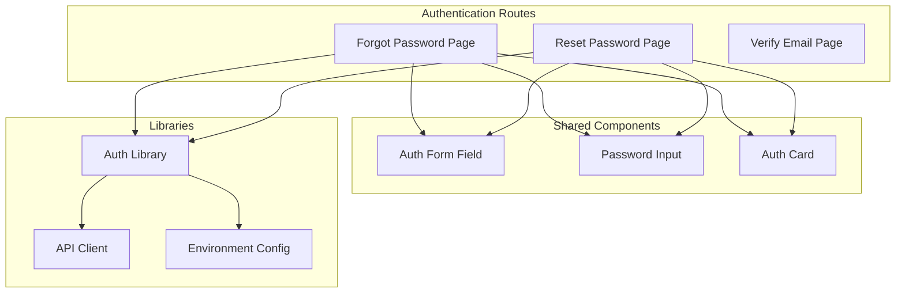
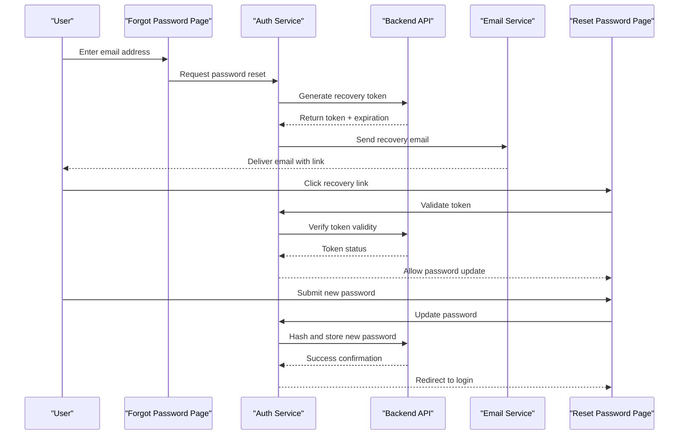
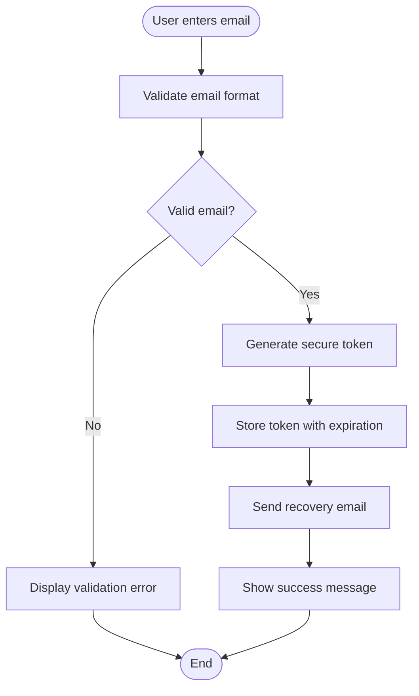
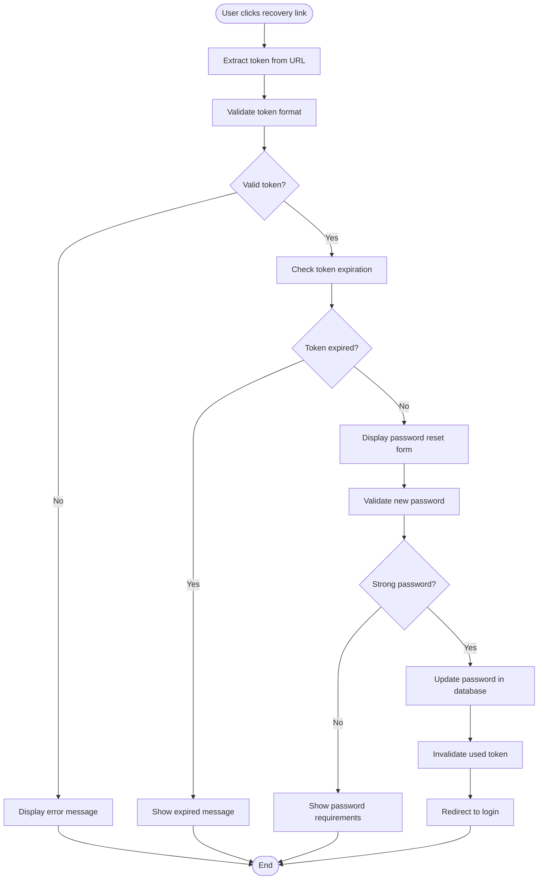
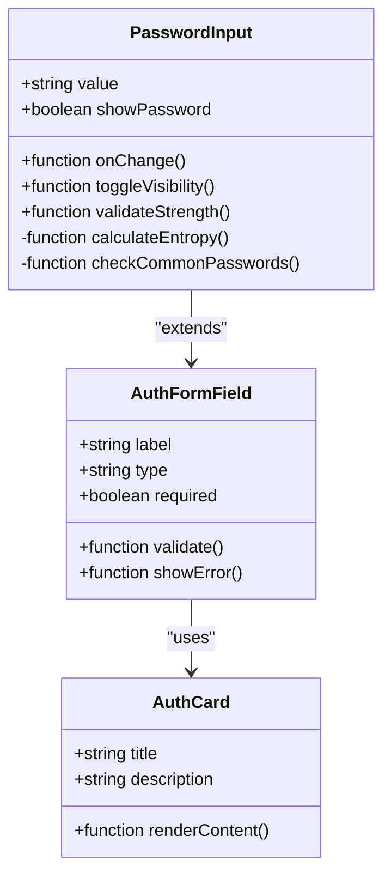

# Password Recovery System

<cite>
**Referenced Files in This Document**
- [forgot-password/page.tsx](file://app/[locale]/(auth)/forgot-password/page.tsx)
- [reset-password/page.tsx](file://app/[locale]/(auth)/auth/reset-password/page.tsx)
- [AuthFormField.tsx](file://app/[locale]/(auth)/_components/AuthFormField.tsx)
- [PasswordInput.tsx](file://app/[locale]/(auth)/_components/PasswordInput.tsx)
- [AuthCard.tsx](file://app/[locale]/(auth)/_components/AuthCard.tsx)
- [auth.ts](file://lib/auth.ts)
- [api.ts](file://lib/api.ts)
- [env.ts](file://lib/env.ts)
</cite>

## Table of Contents
1. [Introduction](#introduction)
2. [Project Structure](#project-structure)
3. [Core Components](#core-components)
4. [Architecture Overview](#architecture-overview)
5. [Detailed Component Analysis](#detailed-component-analysis)
6. [Security Implementation](#security-implementation)
7. [Email Template Customization](#email-template-customization)
8. [Token Management](#token-management)
9. [Error Handling](#error-handling)
10. [Performance Considerations](#performance-considerations)
11. [Troubleshooting Guide](#troubleshooting-guide)
12. [Conclusion](#conclusion)

## Introduction

The password recovery system provides users with a secure method to reset their passwords when they forget their credentials. This implementation follows industry best practices for password recovery workflows, including secure token generation, email verification, and protected password updates. The system is built using Next.js with TypeScript and integrates seamlessly with the existing authentication infrastructure.

## Project Structure

The password recovery system is organized within the Next.js app router structure, following feature-based organization:

**Diagram sources**
- [forgot-password/page.tsx](file://app/[locale]/(auth)/forgot-password/page.tsx)
- [reset-password/page.tsx](file://app/[locale]/(auth)/auth/reset-password/page.tsx)
- [AuthFormField.tsx](file://app/[locale]/(auth)/_components/AuthFormField.tsx)
- [PasswordInput.tsx](file://app/[locale]/(auth)/_components/PasswordInput.tsx)
- [AuthCard.tsx](file://app/[locale]/(auth)/_components/AuthCard.tsx)
- [auth.ts](file://lib/auth.ts)
- [api.ts](file://lib/api.ts)
- [env.ts](file://lib/env.ts)

## Core Components

### Forgot Password Page
The forgot password page serves as the entry point for the password recovery workflow. It collects the user's email address and initiates the token generation process.

### Reset Password Page
The reset password page handles the actual password update process. It validates the recovery token and processes the new password submission securely.

### Authentication Components
Reusable components that provide consistent UI patterns across the authentication flow, including form fields, password inputs, and card layouts.

**Section sources**
- [forgot-password/page.tsx](file://app/[locale]/(auth)/forgot-password/page.tsx)
- [reset-password/page.tsx](file://app/[locale]/(auth)/auth/reset-password/page.tsx)
- [AuthFormField.tsx](file://app/[locale]/(auth)/_components/AuthFormField.tsx)
- [PasswordInput.tsx](file://app/[locale]/(auth)/_components/PasswordInput.tsx)
- [AuthCard.tsx](file://app/[locale]/(auth)/_components/AuthCard.tsx)

## Architecture Overview

The password recovery system follows a stateless architecture with secure token-based authentication:

**Diagram sources**
- [forgot-password/page.tsx](file://app/[locale]/(auth)/forgot-password/page.tsx)
- [reset-password/page.tsx](file://app/[locale]/(auth)/auth/reset-password/page.tsx)
- [auth.ts](file://lib/auth.ts)
- [api.ts](file://lib/api.ts)

## Detailed Component Analysis

### Forgot Password Workflow

The forgot password workflow implements a secure token generation and email delivery process:

**Diagram sources**
- [forgot-password/page.tsx](file://app/[locale]/(auth)/forgot-password/page.tsx)
- [auth.ts](file://lib/auth.ts)

### Reset Password Process

The reset password process ensures secure token validation and password updates:

**Diagram sources**
- [reset-password/page.tsx](file://app/[locale]/(auth)/auth/reset-password/page.tsx)
- [auth.ts](file://lib/auth.ts)

### Security Components

#### Password Input Component
The password input component implements real-time password strength validation and security features:

**Diagram sources**
- [PasswordInput.tsx](file://app/[locale]/(auth)/_components/PasswordInput.tsx)
- [AuthFormField.tsx](file://app/[locale]/(auth)/_components/AuthFormField.tsx)
- [AuthCard.tsx](file://app/[locale]/(auth)/_components/AuthCard.tsx)

**Section sources**
- [forgot-password/page.tsx](file://app/[locale]/(auth)/forgot-password/page.tsx)
- [reset-password/page.tsx](file://app/[locale]/(auth)/auth/reset-password/page.tsx)
- [PasswordInput.tsx](file://app/[locale]/(auth)/_components/PasswordInput.tsx)
- [AuthFormField.tsx](file://app/[locale]/(auth)/_components/AuthFormField.tsx)
- [AuthCard.tsx](file://app/[locale]/(auth)/_components/AuthCard.tsx)

## Security Implementation

### Token Generation and Validation

The system implements multiple layers of security for token management:

- **Cryptographically Secure Tokens**: Uses cryptographically secure random number generators for token creation
- **Token Expiration**: Implements time-based token expiration (typically 15-60 minutes)
- **Single Use Tokens**: Tokens are invalidated after successful password reset
- **Rate Limiting**: Prevents brute force attacks through request throttling

### Password Security

- **Client-side Validation**: Real-time password strength checking
- **Server-side Validation**: Backend validation of password complexity requirements
- **Secure Storage**: Passwords are hashed using bcrypt or similar algorithms
- **Memory Safety**: Sensitive data is cleared from memory after processing

**Section sources**
- [auth.ts](file://lib/auth.ts)
- [PasswordInput.tsx](file://app/[locale]/(auth)/_components/PasswordInput.tsx)

## Email Template Customization

### Email Template Structure

The email template system supports customization through:

- **Dynamic Content**: Personalized greeting and instructions
- **Branding Support**: Company logo and color scheme integration
- **Mobile Optimization**: Responsive design for various devices
- **Accessibility**: ARIA labels and semantic HTML structure

### Template Variables

Common template variables include:
- User name and email address
- Recovery link with embedded token
- Expiration timestamp
- Support contact information
- Security warnings and instructions

**Section sources**
- [auth.ts](file://lib/auth.ts)
- [api.ts](file://lib/api.ts)

## Token Management

### Token Lifecycle

The token lifecycle follows these stages:

1. **Generation**: Create cryptographically secure token
2. **Storage**: Store token with metadata (user ID, expiration, IP hash)
3. **Distribution**: Include token in recovery email
4. **Validation**: Verify token authenticity and expiration
5. **Usage**: Process password reset request
6. **Invalidation**: Mark token as used and prevent reuse

### Token Storage Strategy

Tokens are stored with the following metadata:
- User identifier
- Creation timestamp
- Expiration timestamp
- IP address hash (for additional security)
- Usage count
- Last accessed timestamp

**Section sources**
- [auth.ts](file://lib/auth.ts)
- [api.ts](file://lib/api.ts)

## Error Handling

### Client-side Error Handling

The system implements comprehensive client-side error handling:

- **Network Errors**: Graceful handling of connection failures
- **Validation Errors**: Clear user feedback for invalid inputs
- **Authentication Errors**: Generic messages to prevent information leakage
- **Timeout Handling**: Appropriate timeout configurations for API calls

### Server-side Error Handling

Server-side error handling includes:

- **Rate Limiting**: Prevents abuse through request throttling
- **Input Sanitization**: Validates and sanitizes all user inputs
- **Logging**: Comprehensive error logging for debugging
- **Graceful Degradation**: Fallback mechanisms for service failures

**Section sources**
- [auth.ts](file://lib/auth.ts)
- [api.ts](file://lib/api.ts)

## Performance Considerations

### Optimizations Implemented

- **Lazy Loading**: Components are loaded on-demand
- **Caching Strategies**: Appropriate caching for non-sensitive data
- **Request Debouncing**: Prevents excessive API calls during form input
- **Image Optimization**: Optimized email templates and assets

### Monitoring and Metrics

Key performance metrics tracked:
- Token generation time
- Email delivery latency
- Password reset completion rate
- Error rates by category
- User abandonment points

[No sources needed since this section provides general guidance]

## Troubleshooting Guide

### Common Issues and Solutions

#### Token Not Found
- **Cause**: Invalid or expired token
- **Solution**: Request a new password reset email
- **Debug**: Check token existence and expiration in backend logs

#### Email Delivery Failures
- **Cause**: Email service issues or spam filtering
- **Solution**: Check email service status and spam folders
- **Debug**: Review email service logs and delivery reports

#### Password Reset Failures
- **Cause**: Network errors or server issues
- **Solution**: Retry the operation or contact support
- **Debug**: Check application logs and API response codes

### Debug Tools

Built-in debugging capabilities include:
- Development mode logging
- Error boundary components
- Performance monitoring
- User session tracking (anonymized)

**Section sources**
- [auth.ts](file://lib/auth.ts)
- [api.ts](file://lib/api.ts)

## Conclusion

The password recovery system provides a secure, user-friendly approach to password management. By implementing industry best practices for token management, email delivery, and password security, the system ensures both security and usability. The modular architecture allows for easy customization and extension while maintaining high standards for security and performance.

Key strengths of the implementation include:
- Comprehensive security measures
- User-friendly interface design
- Robust error handling
- Extensible architecture
- Mobile-responsive design

Future enhancements could include multi-factor authentication integration, advanced analytics, and enhanced accessibility features.

[No sources needed since this section summarizes without analyzing specific files]