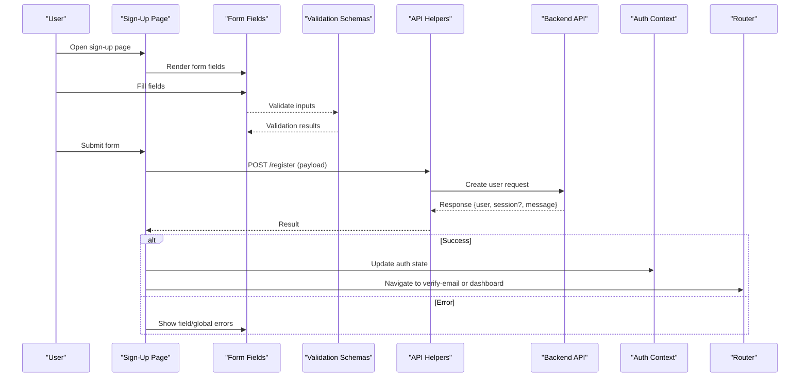
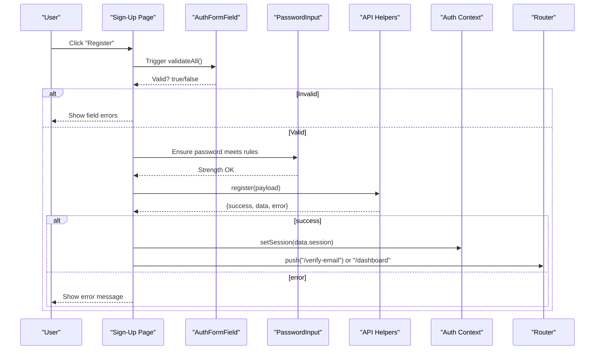
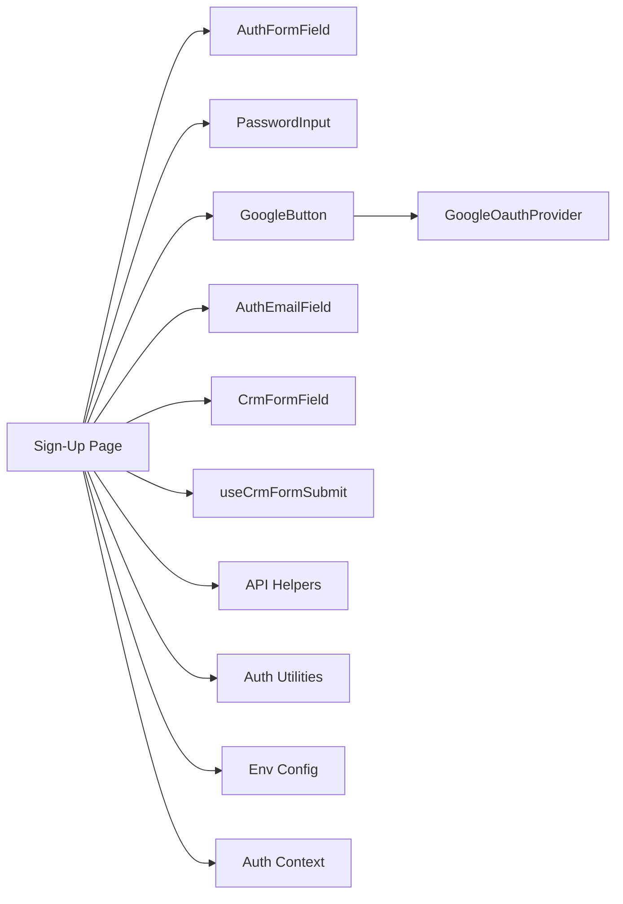

# User Registration

<cite>
**Referenced Files in This Document**
- [sign-up/page.tsx](file://app/[locale]/(auth)/sign-up/page.tsx)
- [AuthFormField.tsx](file://app/[locale]/(auth)/_components/AuthFormField.tsx)
- [PasswordInput.tsx](file://app/[locale]/(auth)/_components/PasswordInput.tsx)
- [GoogleButton.tsx](file://app/[locale]/(auth)/_components/GoogleButton.tsx)
- [AuthCard.tsx](file://app/[locale]/(auth)/_components/AuthCard.tsx)
- [AuthHeader.tsx](file://app/[locale]/(auth)/_components/AuthHeader.tsx)
- [AuthDivider.tsx](file://app/[locale]/(auth)/_components/AuthDivider.tsx)
- [BackToHome.tsx](file://app/[locale]/(auth)/_components/BackToHome.tsx)
- [AuthEmailField.tsx](file://app/[locale]/(routes)/crm/_components/crm-shared/fields/AuthEmailField.tsx)
- [schemas.ts](file://app/[locale]/(routes)/crm/_components/crm-shared/fields/schemas.ts)
- [CrmFormField.tsx](file://app/[locale]/(routes)/crm/_components/crm-shared/fields/CrmFormField.tsx)
- [useCrmFormSubmit.ts](file://app/[locale]/(routes)/crm/_components/crm-shared/hooks/useCrmFormSubmit.ts)
- [AuthContext.tsx](file://contexts/AuthContext.tsx)
- [api.ts](file://lib/api.ts)
- [auth.ts](file://lib/auth.ts)
- [env.ts](file://lib/env.ts)
- [GoogleOauthProvider.tsx](file://providers/GoogleOauthProvider.tsx)
</cite>

## Table of Contents
1. [Introduction](#introduction)
2. [Project Structure](#project-structure)
3. [Core Components](#core-components)
4. [Architecture Overview](#architecture-overview)
5. [Detailed Component Analysis](#detailed-component-analysis)
6. [Dependency Analysis](#dependency-analysis)
7. [Performance Considerations](#performance-considerations)
8. [Troubleshooting Guide](#troubleshooting-guide)
9. [Conclusion](#conclusion)
10. [Appendices](#appendices)

## Introduction
This document explains the user registration process implemented in the frontend application. It covers the sign-up form implementation, validation schemas, and the end-to-end flow for creating a new user account. It also documents integration points with backend APIs, email verification triggers, initial user setup, error handling, user feedback, custom fields, social registration options, and security considerations such as password requirements, input sanitization, and rate limiting.

## Project Structure
The registration feature is primarily located under the authentication routes and shared UI components:
- Sign-up page and layout
- Reusable auth form fields and inputs
- Social sign-up button
- Shared CRM field utilities that can be reused for additional registration fields
- Authentication context and API helpers

```mermaid
graph TB
subgraph "Auth Routes"
SU["Sign-Up Page<br/>app/[locale]/(auth)/sign-up/page.tsx"]
AC["Auth Card<br/>app/[locale]/(auth)/_components/AuthCard.tsx"]
AH["Auth Header<br/>app/[locale]/(auth)/_components/AuthHeader.tsx"]
AD["Auth Divider<br/>app/[locale]/(auth)/_components/AuthDivider.tsx"]
BH["Back To Home<br/>app/[locale]/(auth)/_components/BackToHome.tsx"]
end
subgraph "Form Fields"
AFF["Auth Form Field<br/>app/[locale]/(auth)/_components/AuthFormField.tsx"]
PI["Password Input<br/>app/[locale]/(auth)/_components/PasswordInput.tsx"]
GSB["Google Button<br/>app/[locale]/(auth)/_components/GoogleButton.tsx"]
AEF["Auth Email Field (CRM)<br/>app/[locale]/(routes)/crm/_components/crm-shared/fields/AuthEmailField.tsx"]
CFF["CRM Form Field (CRM)<br/>app/[locale]/(routes)/crm/_components/crm-shared/fields/CrmFormField.tsx"]
end
subgraph "Logic & Context"
ACTX["Auth Context<br/>contexts/AuthContext.tsx"]
API["API Helpers<br/>lib/api.ts"]
AUTH["Auth Utilities<br/>lib/auth.ts"]
ENV["Environment Config<br/>lib/env.ts"]
UCF["CRM Submit Hook<br/>app/[locale]/(routes)/crm/_components/crm-shared/hooks/useCrmFormSubmit.ts"]
end
SU --> AC
SU --> AH
SU --> AD
SU --> BH
SU --> AFF
SU --> PI
SU --> GSB
SU --> AEF
SU --> CFF
SU --> UCF
SU --> ACTX
SU --> API
SU --> AUTH
SU --> ENV
```

**Diagram sources**
- [sign-up/page.tsx](file://app/[locale]/(auth)/sign-up/page.tsx)
- [AuthCard.tsx](file://app/[locale]/(auth)/_components/AuthCard.tsx)
- [AuthHeader.tsx](file://app/[locale]/(auth)/_components/AuthHeader.tsx)
- [AuthDivider.tsx](file://app/[locale]/(auth)/_components/AuthDivider.tsx)
- [BackToHome.tsx](file://app/[locale]/(auth)/_components/BackToHome.tsx)
- [AuthFormField.tsx](file://app/[locale]/(auth)/_components/AuthFormField.tsx)
- [PasswordInput.tsx](file://app/[locale]/(auth)/_components/PasswordInput.tsx)
- [GoogleButton.tsx](file://app/[locale]/(auth)/_components/GoogleButton.tsx)
- [AuthEmailField.tsx](file://app/[locale]/(routes)/crm/_components/crm-shared/fields/AuthEmailField.tsx)
- [CrmFormField.tsx](file://app/[locale]/(routes)/crm/_components/crm-shared/fields/CrmFormField.tsx)
- [useCrmFormSubmit.ts](file://app/[locale]/(routes)/crm/_components/crm-shared/hooks/useCrmFormSubmit.ts)
- [AuthContext.tsx](file://contexts/AuthContext.tsx)
- [api.ts](file://lib/api.ts)
- [auth.ts](file://lib/auth.ts)
- [env.ts](file://lib/env.ts)

**Section sources**
- [sign-up/page.tsx](file://app/[locale]/(auth)/sign-up/page.tsx)
- [AuthFormField.tsx](file://app/[locale]/(auth)/_components/AuthFormField.tsx)
- [PasswordInput.tsx](file://app/[locale]/(auth)/_components/PasswordInput.tsx)
- [GoogleButton.tsx](file://app/[locale]/(auth)/_components/GoogleButton.tsx)
- [AuthCard.tsx](file://app/[locale]/(auth)/_components/AuthCard.tsx)
- [AuthHeader.tsx](file://app/[locale]/(auth)/_components/AuthHeader.tsx)
- [AuthDivider.tsx](file://app/[locale]/(auth)/_components/AuthDivider.tsx)
- [BackToHome.tsx](file://app/[locale]/(auth)/_components/BackToHome.tsx)
- [AuthEmailField.tsx](file://app/[locale]/(routes)/crm/_components/crm-shared/fields/AuthEmailField.tsx)
- [CrmFormField.tsx](file://app/[locale]/(routes)/crm/_components/crm-shared/fields/CrmFormField.tsx)
- [useCrmFormSubmit.ts](file://app/[locale]/(routes)/crm/_components/crm-shared/hooks/useCrmFormSubmit.ts)
- [AuthContext.tsx](file://contexts/AuthContext.tsx)
- [api.ts](file://lib/api.ts)
- [auth.ts](file://lib/auth.ts)
- [env.ts](file://lib/env.ts)

## Core Components
- Sign-Up Page: Orchestrates the registration form, integrates validation, submits to backend, handles success and errors, and manages navigation after successful registration.
- Auth Form Field: Reusable wrapper for form controls with consistent styling and validation messaging.
- Password Input: Specialized input for passwords with strength indicators and visibility toggle.
- Google Button: Initiates social registration via Google OAuth provider.
- Auth Email Field and CRM Form Field: Reusable email and generic form fields from CRM module that can be extended for additional registration fields.
- CRM Submit Hook: Encapsulates common submission logic, loading states, and error handling patterns that can be adapted for registration.
- Auth Context: Provides global authentication state and actions used across the app, including post-registration flows.
- API Helpers and Auth Utilities: Centralized HTTP client and token/session management used by the registration flow.

**Section sources**
- [sign-up/page.tsx](file://app/[locale]/(auth)/sign-up/page.tsx)
- [AuthFormField.tsx](file://app/[locale]/(auth)/_components/AuthFormField.tsx)
- [PasswordInput.tsx](file://app/[locale]/(auth)/_components/PasswordInput.tsx)
- [GoogleButton.tsx](file://app/[locale]/(auth)/_components/GoogleButton.tsx)
- [AuthEmailField.tsx](file://app/[locale]/(routes)/crm/_components/crm-shared/fields/AuthEmailField.tsx)
- [CrmFormField.tsx](file://app/[locale]/(routes)/crm/_components/crm-shared/fields/CrmFormField.tsx)
- [useCrmFormSubmit.ts](file://app/[locale]/(routes)/crm/_components/crm-shared/hooks/useCrmFormSubmit.ts)
- [AuthContext.tsx](file://contexts/AuthContext.tsx)
- [api.ts](file://lib/api.ts)
- [auth.ts](file://lib/auth.ts)

## Architecture Overview
The registration flow combines client-side validation, controlled form state, and API calls to create a user account. After successful creation, the user may be redirected to verify their email or directly into the dashboard depending on backend behavior and configuration.

**Diagram sources**
- [sign-up/page.tsx](file://app/[locale]/(auth)/sign-up/page.tsx)
- [AuthFormField.tsx](file://app/[locale]/(auth)/_components/AuthFormField.tsx)
- [PasswordInput.tsx](file://app/[locale]/(auth)/_components/PasswordInput.tsx)
- [api.ts](file://lib/api.ts)
- [AuthContext.tsx](file://contexts/AuthContext.tsx)

## Detailed Component Analysis

### Sign-Up Page
Responsibilities:
- Compose the registration form using reusable fields.
- Bind form values to validation schemas.
- Handle submit events, show loading states, and display errors.
- On success, update authentication context and navigate to the appropriate route (email verification or dashboard).
- Integrate social registration via the Google button.

Key behaviors:
- Controlled inputs with real-time validation feedback.
- Global error banner for server-side messages.
- Redirects based on backend response flags.

**Section sources**
- [sign-up/page.tsx](file://app/[locale]/(auth)/sign-up/page.tsx)

#### Sequence Diagram: Registration Submission

**Diagram sources**
- [sign-up/page.tsx](file://app/[locale]/(auth)/sign-up/page.tsx)
- [AuthFormField.tsx](file://app/[locale]/(auth)/_components/AuthFormField.tsx)
- [PasswordInput.tsx](file://app/[locale]/(auth)/_components/PasswordInput.tsx)
- [api.ts](file://lib/api.ts)
- [AuthContext.tsx](file://contexts/AuthContext.tsx)

### Form Fields and Inputs
- Auth Form Field: Wraps inputs with labels, helper text, and error messages. Ensures consistent UX and accessibility.
- Password Input: Adds password-specific features like visibility toggle and optional strength meter. Integrates with validation schema for complexity checks.
- Auth Email Field: Reusable email input with domain and format validation; can be embedded in registration forms.
- CRM Form Field: Generic field component for additional registration attributes (e.g., company name, phone).

Best practices:
- Use controlled components with explicit value and onChange handlers.
- Display inline errors next to fields and a global error summary at the top.
- Debounce heavy validations if needed.

**Section sources**
- [AuthFormField.tsx](file://app/[locale]/(auth)/_components/AuthFormField.tsx)
- [PasswordInput.tsx](file://app/[locale]/(auth)/_components/PasswordInput.tsx)
- [AuthEmailField.tsx](file://app/[locale]/(routes)/crm/_components/crm-shared/fields/AuthEmailField.tsx)
- [CrmFormField.tsx](file://app/[locale]/(routes)/crm/_components/crm-shared/fields/CrmFormField.tsx)

### Validation Schemas
Schemas define required fields, formats, and constraints:
- Email: Required, valid format, unique check handled server-side.
- Password: Minimum length, complexity rules (uppercase, lowercase, number, special character), confirmation match.
- Optional fields: Name, phone, company, etc., with type and length constraints.

Implementation notes:
- Client-side validation provides immediate feedback.
- Server-side validation remains authoritative; always handle backend errors gracefully.

Example schema references:
- General CRM schemas for reuse: [schemas.ts](file://app/[locale]/(routes)/crm/_components/crm-shared/fields/schemas.ts)

**Section sources**
- [schemas.ts](file://app/[locale]/(routes)/crm/_components/crm-shared/fields/schemas.ts)

### Backend Integration
Registration endpoints and utilities:
- API helpers encapsulate HTTP requests, headers, and error normalization.
- Auth utilities manage tokens, sessions, and redirects.
- Environment config centralizes base URLs and feature flags.

Typical payload:
- email, password, passwordConfirmation, and any custom fields.

Response handling:
- On success: store session/token, update context, and navigate.
- On failure: map server errors to user-friendly messages and field-level errors.

**Section sources**
- [api.ts](file://lib/api.ts)
- [auth.ts](file://lib/auth.ts)
- [env.ts](file://lib/env.ts)

### Social Registration (Google)
Social sign-up uses an OAuth provider:
- Google Button initiates the OAuth flow.
- Provider handles redirect and callback.
- Frontend receives user info and creates or links an account via backend.

Considerations:
- Link existing accounts when possible.
- Prompt for additional details if needed after first login.
- Maintain consistent UX with email/password registration.

**Section sources**
- [GoogleButton.tsx](file://app/[locale]/(auth)/_components/GoogleButton.tsx)
- [GoogleOauthProvider.tsx](file://providers/GoogleOauthProvider.tsx)

### Initial User Setup and Email Verification
After registration:
- If email verification is required, redirect to verify-email page.
- Otherwise, proceed to dashboard or onboarding.
- Optionally trigger welcome email and initial profile setup tasks on the backend.

**Section sources**
- [sign-up/page.tsx](file://app/[locale]/(auth)/sign-up/page.tsx)

### Custom Registration Fields
Extend the form with additional fields using CRM components:
- Add new fields via CrmFormField or AuthFormField.
- Extend validation schemas accordingly.
- Include them in the registration payload.

**Section sources**
- [CrmFormField.tsx](file://app/[locale]/(routes)/crm/_components/crm-shared/fields/CrmFormField.tsx)
- [AuthFormField.tsx](file://app/[locale]/(auth)/_components/AuthFormField.tsx)
- [schemas.ts](file://app/[locale]/(routes)/crm/_components/crm-shared/fields/schemas.ts)

### Registration Success Flows
Success path:
- Update authentication context with session/user data.
- Navigate to verify-email or dashboard.
- Show a success toast or banner.

Error path:
- Display global error for network/server issues.
- Map specific backend errors to field-level messages.

**Section sources**
- [AuthContext.tsx](file://contexts/AuthContext.tsx)
- [sign-up/page.tsx](file://app/[locale]/(auth)/sign-up/page.tsx)

## Dependency Analysis
The registration feature depends on shared UI components, validation schemas, API helpers, and authentication context. The following diagram shows key relationships:

**Diagram sources**
- [sign-up/page.tsx](file://app/[locale]/(auth)/sign-up/page.tsx)
- [AuthFormField.tsx](file://app/[locale]/(auth)/_components/AuthFormField.tsx)
- [PasswordInput.tsx](file://app/[locale]/(auth)/_components/PasswordInput.tsx)
- [GoogleButton.tsx](file://app/[locale]/(auth)/_components/GoogleButton.tsx)
- [AuthEmailField.tsx](file://app/[locale]/(routes)/crm/_components/crm-shared/fields/AuthEmailField.tsx)
- [CrmFormField.tsx](file://app/[locale]/(routes)/crm/_components/crm-shared/fields/CrmFormField.tsx)
- [useCrmFormSubmit.ts](file://app/[locale]/(routes)/crm/_components/crm-shared/hooks/useCrmFormSubmit.ts)
- [api.ts](file://lib/api.ts)
- [auth.ts](file://lib/auth.ts)
- [env.ts](file://lib/env.ts)
- [AuthContext.tsx](file://contexts/AuthContext.tsx)
- [GoogleOauthProvider.tsx](file://providers/GoogleOauthProvider.tsx)

**Section sources**
- [sign-up/page.tsx](file://app/[locale]/(auth)/sign-up/page.tsx)
- [api.ts](file://lib/api.ts)
- [auth.ts](file://lib/auth.ts)
- [env.ts](file://lib/env.ts)
- [AuthContext.tsx](file://contexts/AuthContext.tsx)
- [GoogleOauthProvider.tsx](file://providers/GoogleOauthProvider.tsx)

## Performance Considerations
- Minimize re-renders by memoizing form fields and validation results where appropriate.
- Debounce non-critical validations (e.g., username uniqueness) to reduce API calls.
- Avoid heavy computations during render; offload to background tasks if necessary.
- Use progressive enhancement: enable basic functionality without JavaScript for static content.

[No sources needed since this section provides general guidance]

## Troubleshooting Guide
Common issues and resolutions:
- Validation errors not showing: Ensure form fields are bound to the correct state and error keys.
- Network errors: Check API base URL and environment variables; inspect network tab for status codes.
- Session not persisted: Verify token storage and context updates after successful registration.
- Social login loops: Confirm OAuth provider configuration and redirect URIs.

Operational tips:
- Log detailed but safe error messages for debugging.
- Provide clear user-facing messages for each error category.
- Use global error banners for server-side failures and inline errors for field-level issues.

**Section sources**
- [api.ts](file://lib/api.ts)
- [auth.ts](file://lib/auth.ts)
- [sign-up/page.tsx](file://app/[locale]/(auth)/sign-up/page.tsx)

## Conclusion
The registration system combines robust client-side validation, reusable form components, and centralized API and auth utilities to deliver a secure and user-friendly experience. By leveraging shared CRM components and schemas, the form can be easily extended with custom fields. Social registration is integrated through a dedicated provider, and post-registration flows support both email verification and direct dashboard access. Security best practices include strong password policies, input sanitization, and careful error handling.

[No sources needed since this section summarizes without analyzing specific files]

## Appendices

### Security Considerations
- Password Requirements: Enforce minimum length and complexity; confirm password matches.
- Input Sanitization: Trim whitespace, normalize emails, and sanitize free-text fields before sending to the backend.
- Rate Limiting: Implement client-side throttling for submissions and rely on backend rate limits to prevent abuse.
- CSRF and XSS: Use secure headers, avoid storing sensitive data in localStorage unless necessary, and prefer httpOnly cookies for tokens when supported.
- HTTPS Only: Ensure all API calls use HTTPS.

[No sources needed since this section provides general guidance]