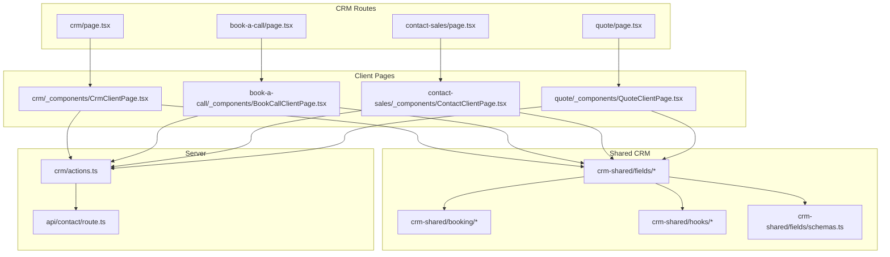
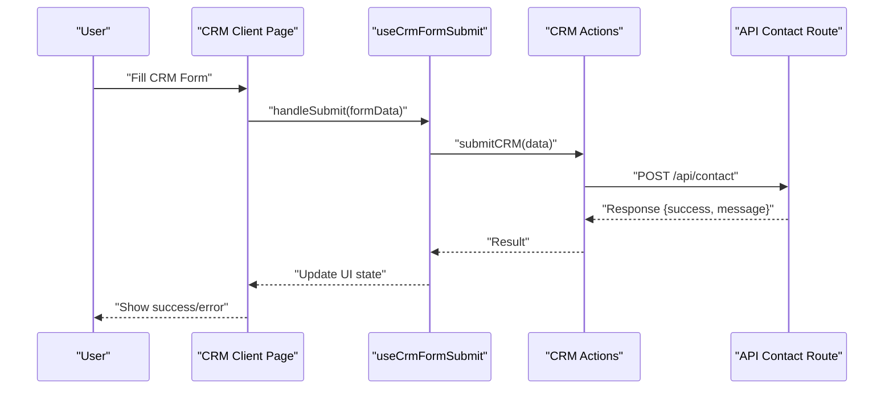
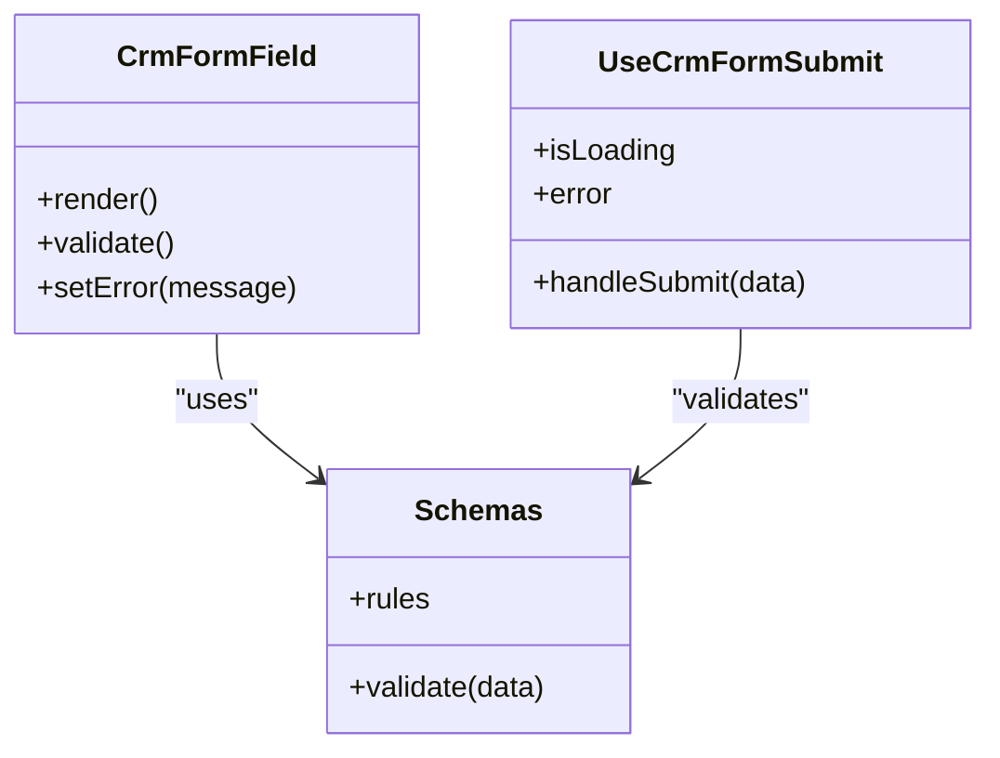
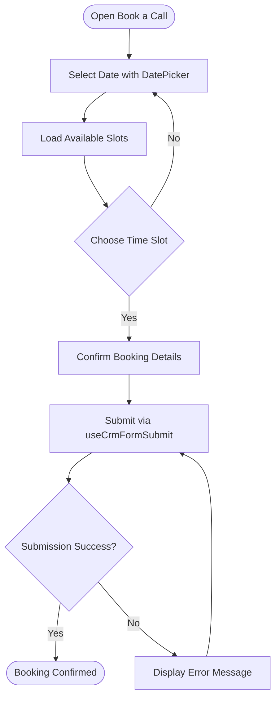
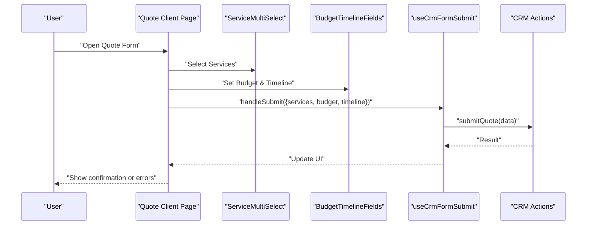
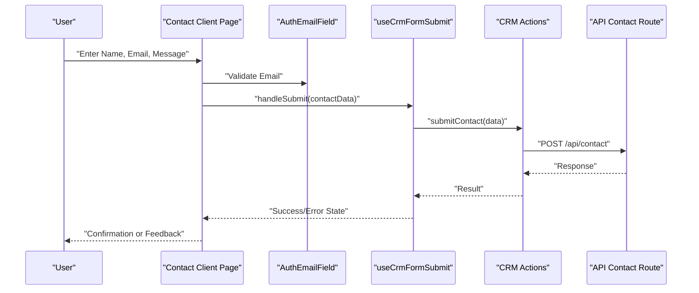
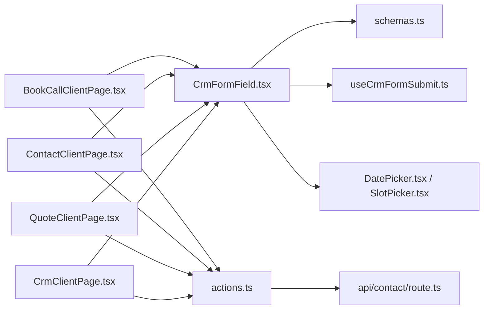

# CRM Features

<cite>
**Referenced Files in This Document**
- [crm page](file://app/[locale]/(routes)/crm/page.tsx)
- [CRM actions](file://app/[locale]/(routes)/crm/actions.ts)
- [CRM client page](file://app/[locale]/(routes)/crm/_components/CrmClientPage.tsx)
- [Book a call page](file://app/[locale]/(routes)/crm/book-a-call/page.tsx)
- [Book call client page](file://app/[locale]/(routes)/crm/book-a-call/_components/BookCallClientPage.tsx)
- [Contact sales page](file://app/[locale]/(routes)/crm/contact-sales/page.tsx)
- [Contact client page](file://app/[locale]/(routes)/crm/contact-sales/_components/ContactClientPage.tsx)
- [Quote page](file://app/[locale]/(routes)/crm/quote/page.tsx)
- [Quote client page](file://app/[locale]/(routes)/crm/quote/_components/QuoteClientPage.tsx)
- [Shared CrmFormField](file://app/[locale]/(routes)/crm/_components/crm-shared/fields/CrmFormField.tsx)
- [Shared schemas](file://app/[locale]/(routes)/crm/_components/crm-shared/fields/schemas.ts)
- [Auth email field](file://app/[locale]/(routes)/crm/_components/crm-shared/AuthEmailField.tsx)
- [Newsletter form](file://app/[locale]/(routes)/crm/_components/crm-shared/NewsletterForm.tsx)
- [Budget timeline fields](file://app/[locale]/(routes)/crm/_components/BudgetTimelineFields.tsx)
- [Budget timeline shared fields](file://app/[locale]/(routes)/crm/_components/crm-shared/fields/BudgetTimelineFields.tsx)
- [Service multi select](file://app/[locale]/(routes)/crm/_components/crm-shared/fields/ServiceMultiSelect.tsx)
- [Booking date picker](file://app/[locale]/(routes)/crm/_components/crm-shared/booking/DatePicker.tsx)
- [Booking slot picker](file://app/[locale]/(routes)/crm/_components/crm-shared/booking/SlotPicker.tsx)
- [CRM submit hook](file://app/[locale]/(routes)/crm/_components/hooks/useCrmFormSubmit.ts)
- [API contact route](file://app/api/contact/route.ts)
</cite>

## Table of Contents
1. [Introduction](#introduction)
2. [Project Structure](#project-structure)
3. [Core Components](#core-components)
4. [Architecture Overview](#architecture-overview)
5. [Detailed Component Analysis](#detailed-component-analysis)
6. [Dependency Analysis](#dependency-analysis)
7. [Performance Considerations](#performance-considerations)
8. [Troubleshooting Guide](#troubleshooting-guide)
9. [Conclusion](#conclusion)
10. [Appendices](#appendices)

## Introduction
This document explains the CRM feature set implemented in the frontend application, focusing on service booking, quote management, contact forms, and project tracking entry points. It details the CRM form architecture built around shared form fields, validation schemas, and submission hooks. It also covers the service booking system with date pickers and slot selection, the quote generation flow including budget timeline and multi-service selection, and contact form handling for lead capture. Practical guidance is provided for extending CRM functionality, adding new form types, and integrating with external scheduling systems, along with data validation, error handling, and UX optimization strategies.

## Project Structure
The CRM features are organized under the routes directory with dedicated pages and reusable components:
- Pages define user-facing flows (book-a-call, contact-sales, quote).
- Shared components encapsulate common UI and logic (fields, booking widgets, schemas, hooks).
- Actions and API routes handle server-side processing and persistence.

**Diagram sources**
- [crm page](file://app/[locale]/(routes)/crm/page.tsx)
- [CRM client page](file://app/[locale]/(routes)/crm/_components/CrmClientPage.tsx)
- [Book a call page](file://app/[locale]/(routes)/crm/book-a-call/page.tsx)
- [Book call client page](file://app/[locale]/(routes)/crm/book-a-call/_components/BookCallClientPage.tsx)
- [Contact sales page](file://app/[locale]/(routes)/crm/contact-sales/page.tsx)
- [Contact client page](file://app/[locale]/(routes)/crm/contact-sales/_components/ContactClientPage.tsx)
- [Quote page](file://app/[locale]/(routes)/crm/quote/page.tsx)
- [Quote client page](file://app/[locale]/(routes)/crm/quote/_components/QuoteClientPage.tsx)
- [Shared CrmFormField](file://app/[locale]/(routes)/crm/_components/crm-shared/fields/CrmFormField.tsx)
- [Shared schemas](file://app/[locale]/(routes)/crm/_components/crm-shared/fields/schemas.ts)
- [Booking date picker](file://app/[locale]/(routes)/crm/_components/crm-shared/booking/DatePicker.tsx)
- [Booking slot picker](file://app/[locale]/(routes)/crm/_components/crm-shared/booking/SlotPicker.tsx)
- [CRM submit hook](file://app/[locale]/(routes)/crm/_components/hooks/useCrmFormSubmit.ts)
- [CRM actions](file://app/[locale]/(routes)/crm/actions.ts)
- [API contact route](file://app/api/contact/route.ts)

**Section sources**
- [crm page](file://app/[locale]/(routes)/crm/page.tsx)
- [CRM client page](file://app/[locale]/(routes)/crm/_components/CrmClientPage.tsx)
- [Book a call page](file://app/[locale]/(routes)/crm/book-a-call/page.tsx)
- [Book call client page](file://app/[locale]/(routes)/crm/book-a-call/_components/BookCallClientPage.tsx)
- [Contact sales page](file://app/[locale]/(routes)/crm/contact-sales/page.tsx)
- [Contact client page](file://app/[locale]/(routes)/crm/contact-sales/_components/ContactClientPage.tsx)
- [Quote page](file://app/[locale]/(routes)/crm/quote/page.tsx)
- [Quote client page](file://app/[locale]/(routes)/crm/quote/_components/QuoteClientPage.tsx)
- [CRM actions](file://app/[locale]/(routes)/crm/actions.ts)
- [API contact route](file://app/api/contact/route.ts)

## Core Components
The CRM form architecture centers on reusable building blocks:
- Shared form field component for consistent input behavior and validation display.
- Validation schemas defining rules for all CRM forms.
- Submission hook to standardize async handling, loading states, and error reporting.
- Specialized fields for domain-specific needs (budget timeline, multi-service selection).
- Booking widgets for date and time slot selection.

Key responsibilities:
- Field rendering and accessibility via a unified component.
- Centralized schema validation ensuring consistency across forms.
- Encapsulated submission logic to reduce duplication and improve reliability.
- Composable booking experience through date and slot pickers.

**Section sources**
- [Shared CrmFormField](file://app/[locale]/(routes)/crm/_components/crm-shared/fields/CrmFormField.tsx)
- [Shared schemas](file://app/[locale]/(routes)/crm/_components/crm-shared/fields/schemas.ts)
- [CRM submit hook](file://app/[locale]/(routes)/crm/_components/hooks/useCrmFormSubmit.ts)
- [Budget timeline fields](file://app/[locale]/(routes)/crm/_components/BudgetTimelineFields.tsx)
- [Budget timeline shared fields](file://app/[locale]/(routes)/crm/_components/crm-shared/fields/BudgetTimelineFields.tsx)
- [Service multi select](file://app/[locale]/(routes)/crm/_components/crm-shared/fields/ServiceMultiSelect.tsx)
- [Booking date picker](file://app/[locale]/(routes)/crm/_components/crm-shared/booking/DatePicker.tsx)
- [Booking slot picker](file://app/[locale]/(routes)/crm/_components/crm-shared/booking/SlotPicker.tsx)

## Architecture Overview
The CRM architecture follows a clear separation between presentation, business logic, and server integration:
- Client pages orchestrate forms using shared components and hooks.
- Server actions aggregate and validate payloads before persisting or forwarding to APIs.
- API routes provide endpoints for specific operations like contact submissions.

**Diagram sources**
- [CRM client page](file://app/[locale]/(routes)/crm/_components/CrmClientPage.tsx)
- [CRM submit hook](file://app/[locale]/(routes)/crm/_components/hooks/useCrmFormSubmit.ts)
- [CRM actions](file://app/[locale]/(routes)/crm/actions.ts)
- [API contact route](file://app/api/contact/route.ts)

## Detailed Component Analysis

### CRM Form Architecture
The shared CRM form architecture provides a consistent foundation for all CRM-related forms:
- CrmFormField renders inputs with standardized labels, placeholders, and error messages.
- Schemas define validation rules used by all forms, enabling centralized rule updates.
- useCrmFormSubmit centralizes submission lifecycle, including loading and error states.

**Diagram sources**
- [Shared CrmFormField](file://app/[locale]/(routes)/crm/_components/crm-shared/fields/CrmFormField.tsx)
- [Shared schemas](file://app/[locale]/(routes)/crm/_components/crm-shared/fields/schemas.ts)
- [CRM submit hook](file://app/[locale]/(routes)/crm/_components/hooks/useCrmFormSubmit.ts)

**Section sources**
- [Shared CrmFormField](file://app/[locale]/(routes)/crm/_components/crm-shared/fields/CrmFormField.tsx)
- [Shared schemas](file://app/[locale]/(routes)/crm/_components/crm-shared/fields/schemas.ts)
- [CRM submit hook](file://app/[locale]/(routes)/crm/_components/hooks/useCrmFormSubmit.ts)

### Service Booking System
The booking system composes date and slot selection into a cohesive workflow:
- DatePicker restricts available dates and formats selections consistently.
- SlotPicker presents available time slots based on selected date and constraints.
- The book-a-call client page orchestrates these components and submits the booking via actions.

**Diagram sources**
- [Book a call page](file://app/[locale]/(routes)/crm/book-a-call/page.tsx)
- [Book call client page](file://app/[locale]/(routes)/crm/book-a-call/_components/BookCallClientPage.tsx)
- [Booking date picker](file://app/[locale]/(routes)/crm/_components/crm-shared/booking/DatePicker.tsx)
- [Booking slot picker](file://app/[locale]/(routes)/crm/_components/crm-shared/booking/SlotPicker.tsx)
- [CRM submit hook](file://app/[locale]/(routes)/crm/_components/hooks/useCrmFormSubmit.ts)

**Section sources**
- [Book a call page](file://app/[locale]/(routes)/crm/book-a-call/page.tsx)
- [Book call client page](file://app/[locale]/(routes)/crm/book-a-call/_components/BookCallClientPage.tsx)
- [Booking date picker](file://app/[locale]/(routes)/crm/_components/crm-shared/booking/DatePicker.tsx)
- [Booking slot picker](file://app/[locale]/(routes)/crm/_components/crm-shared/booking/SlotPicker.tsx)
- [CRM submit hook](file://app/[locale]/(routes)/crm/_components/hooks/useCrmFormSubmit.ts)

### Quote Management
The quote flow supports multi-service selection and budget timeline configuration:
- ServiceMultiSelect allows choosing multiple services relevant to the quote.
- BudgetTimelineFields captures budget ranges and timelines to inform quote estimates.
- The quote client page aggregates selections and submits them for processing.

**Diagram sources**
- [Quote page](file://app/[locale]/(routes)/crm/quote/page.tsx)
- [Quote client page](file://app/[locale]/(routes)/crm/quote/_components/QuoteClientPage.tsx)
- [Service multi select](file://app/[locale]/(routes)/crm/_components/crm-shared/fields/ServiceMultiSelect.tsx)
- [Budget timeline fields](file://app/[locale]/(routes)/crm/_components/BudgetTimelineFields.tsx)
- [Budget timeline shared fields](file://app/[locale]/(routes)/crm/_components/crm-shared/fields/BudgetTimelineFields.tsx)
- [CRM submit hook](file://app/[locale]/(routes)/crm/_components/hooks/useCrmFormSubmit.ts)
- [CRM actions](file://app/[locale]/(routes)/crm/actions.ts)

**Section sources**
- [Quote page](file://app/[locale]/(routes)/crm/quote/page.tsx)
- [Quote client page](file://app/[locale]/(routes)/crm/quote/_components/QuoteClientPage.tsx)
- [Service multi select](file://app/[locale]/(routes)/crm/_components/crm-shared/fields/ServiceMultiSelect.tsx)
- [Budget timeline fields](file://app/[locale]/(routes)/crm/_components/BudgetTimelineFields.tsx)
- [Budget timeline shared fields](file://app/[locale]/(routes)/crm/_components/crm-shared/fields/BudgetTimelineFields.tsx)
- [CRM submit hook](file://app/[locale]/(routes)/crm/_components/hooks/useCrmFormSubmit.ts)
- [CRM actions](file://app/[locale]/(routes)/crm/actions.ts)

### Contact Forms and Lead Management
Contact forms capture leads and integrate with backend endpoints:
- Contact client page collects user information and message content.
- AuthEmailField ensures valid email input and integrates with shared validation.
- NewsletterForm provides an additional lightweight subscription mechanism.
- Submissions are routed through actions and persisted via the API contact route.

**Diagram sources**
- [Contact sales page](file://app/[locale]/(routes)/crm/contact-sales/page.tsx)
- [Contact client page](file://app/[locale]/(routes)/crm/contact-sales/_components/ContactClientPage.tsx)
- [Auth email field](file://app/[locale]/(routes)/crm/_components/crm-shared/AuthEmailField.tsx)
- [Newsletter form](file://app/[locale]/(routes)/crm/_components/crm-shared/NewsletterForm.tsx)
- [CRM submit hook](file://app/[locale]/(routes)/crm/_components/hooks/useCrmFormSubmit.ts)
- [CRM actions](file://app/[locale]/(routes)/crm/actions.ts)
- [API contact route](file://app/api/contact/route.ts)

**Section sources**
- [Contact sales page](file://app/[locale]/(routes)/crm/contact-sales/page.tsx)
- [Contact client page](file://app/[locale]/(routes)/crm/contact-sales/_components/ContactClientPage.tsx)
- [Auth email field](file://app/[locale]/(routes)/crm/_components/crm-shared/AuthEmailField.tsx)
- [Newsletter form](file://app/[locale]/(routes)/crm/_components/crm-shared/NewsletterForm.tsx)
- [CRM submit hook](file://app/[locale]/(routes)/crm/_components/hooks/useCrmFormSubmit.ts)
- [CRM actions](file://app/[locale]/(routes)/crm/actions.ts)
- [API contact route](file://app/api/contact/route.ts)

### Project Tracking Entry Points
While detailed project tracking UI may reside in other sections, CRM pages provide entry points and navigation to related workflows such as consulting and projects within the dashboard area. These links facilitate transitioning from lead capture to active project management.

[No sources needed since this section doesn't analyze specific files]

## Dependency Analysis
The CRM feature set exhibits low coupling between client pages and shared components, with clear dependency boundaries:
- Client pages depend on shared fields, booking widgets, and hooks.
- Shared components depend on schemas for validation.
- Server actions encapsulate API calls, isolating client code from transport details.

**Diagram sources**
- [Book call client page](file://app/[locale]/(routes)/crm/book-a-call/_components/BookCallClientPage.tsx)
- [Contact client page](file://app/[locale]/(routes)/crm/contact-sales/_components/ContactClientPage.tsx)
- [Quote client page](file://app/[locale]/(routes)/crm/quote/_components/QuoteClientPage.tsx)
- [CRM client page](file://app/[locale]/(routes)/crm/_components/CrmClientPage.tsx)
- [Shared CrmFormField](file://app/[locale]/(routes)/crm/_components/crm-shared/fields/CrmFormField.tsx)
- [Shared schemas](file://app/[locale]/(routes)/crm/_components/crm-shared/fields/schemas.ts)
- [CRM submit hook](file://app/[locale]/(routes)/crm/_components/hooks/useCrmFormSubmit.ts)
- [Booking date picker](file://app/[locale]/(routes)/crm/_components/crm-shared/booking/DatePicker.tsx)
- [Booking slot picker](file://app/[locale]/(routes)/crm/_components/crm-shared/booking/SlotPicker.tsx)
- [CRM actions](file://app/[locale]/(routes)/crm/actions.ts)
- [API contact route](file://app/api/contact/route.ts)

**Section sources**
- [Book call client page](file://app/[locale]/(routes)/crm/book-a-call/_components/BookCallClientPage.tsx)
- [Contact client page](file://app/[locale]/(routes)/crm/contact-sales/_components/ContactClientPage.tsx)
- [Quote client page](file://app/[locale]/(routes)/crm/quote/_components/QuoteClientPage.tsx)
- [CRM client page](file://app/[locale]/(routes)/crm/_components/CrmClientPage.tsx)
- [Shared CrmFormField](file://app/[locale]/(routes)/crm/_components/crm-shared/fields/CrmFormField.tsx)
- [Shared schemas](file://app/[locale]/(routes)/crm/_components/crm-shared/fields/schemas.ts)
- [CRM submit hook](file://app/[locale]/(routes)/crm/_components/hooks/useCrmFormSubmit.ts)
- [Booking date picker](file://app/[locale]/(routes)/crm/_components/crm-shared/booking/DatePicker.tsx)
- [Booking slot picker](file://app/[locale]/(routes)/crm/_components/crm-shared/booking/SlotPicker.tsx)
- [CRM actions](file://app/[locale]/(routes)/crm/actions.ts)
- [API contact route](file://app/api/contact/route.ts)

## Performance Considerations
- Defer heavy computations until submission to keep UI responsive.
- Memoize expensive derived values in complex forms (e.g., filtered slot lists).
- Batch API calls when possible to reduce network overhead.
- Use optimistic UI updates judiciously; ensure rollback paths for failures.
- Avoid unnecessary re-renders by lifting minimal state and leveraging stable references.

[No sources needed since this section provides general guidance]

## Troubleshooting Guide
Common issues and resolutions:
- Validation errors not displaying: Ensure schemas are correctly referenced and error messages are bound to fields.
- Submission hangs: Verify useCrmFormSubmit handles loading states and that actions return proper results.
- Slot availability mismatch: Confirm DatePicker and SlotPicker coordinate on date changes and refresh slot lists accordingly.
- API failures: Inspect API contact route responses and propagate meaningful error messages to users.

**Section sources**
- [Shared schemas](file://app/[locale]/(routes)/crm/_components/crm-shared/fields/schemas.ts)
- [CRM submit hook](file://app/[locale]/(routes)/crm/_components/hooks/useCrmFormSubmit.ts)
- [Booking date picker](file://app/[locale]/(routes)/crm/_components/crm-shared/booking/DatePicker.tsx)
- [Booking slot picker](file://app/[locale]/(routes)/crm/_components/crm-shared/booking/SlotPicker.tsx)
- [API contact route](file://app/api/contact/route.ts)

## Conclusion
The CRM feature set leverages a robust, composable architecture centered on shared form fields, centralized validation schemas, and a unified submission hook. This design enables consistent UX across booking, quoting, and contact flows while simplifying maintenance and extension. By following the patterns outlined here, teams can add new form types, integrate external scheduling systems, and optimize performance and error handling effectively.

[No sources needed since this section summarizes without analyzing specific files]

## Appendices

### Extending CRM Functionality
- Add a new form type:
  - Create a new client page under the CRM routes.
  - Reuse CrmFormField and existing schemas; extend schemas as needed.
  - Implement a submission handler using useCrmFormSubmit and CRM actions.
- Integrate external scheduling:
  - Replace or wrap SlotPicker to fetch availability from an external calendar API.
  - Normalize response formats to match internal slot structures.
  - Update actions to forward booking payloads to the external system.

[No sources needed since this section provides general guidance]