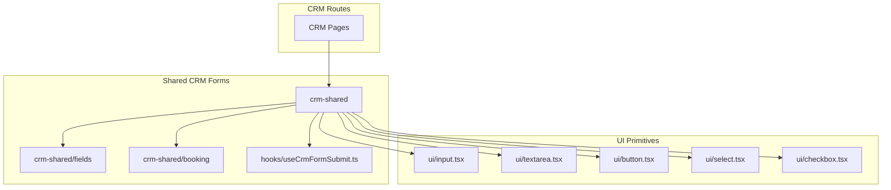
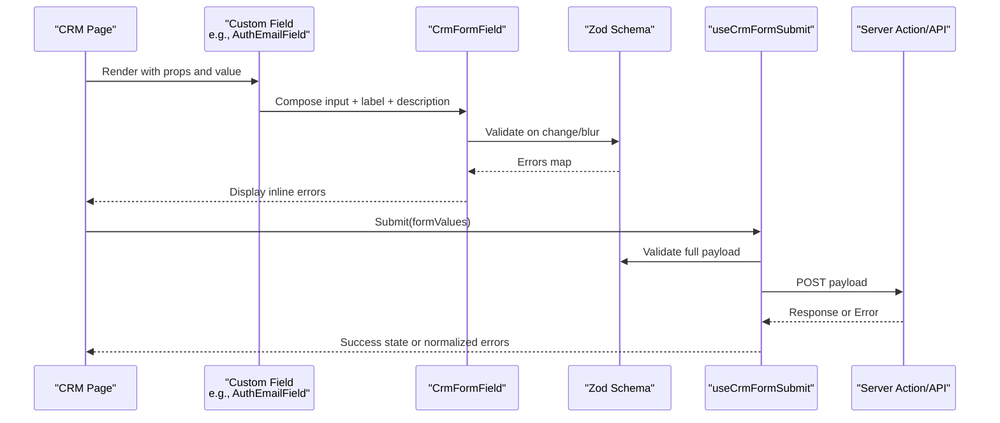
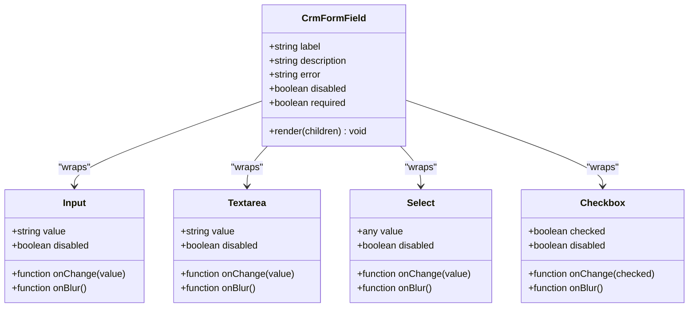
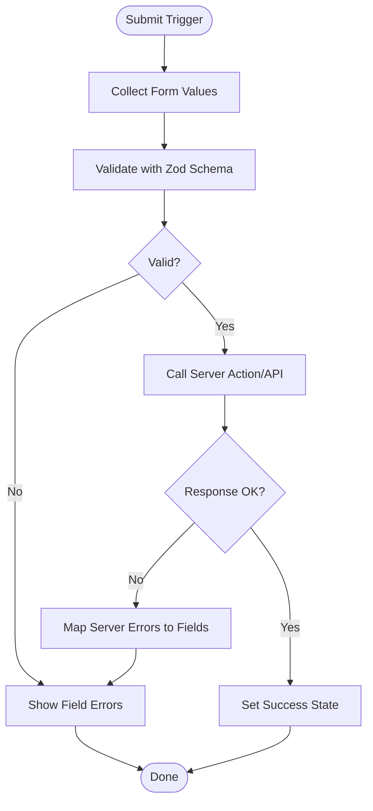
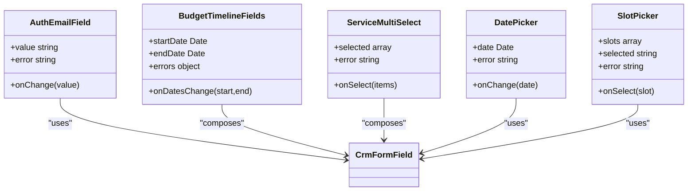
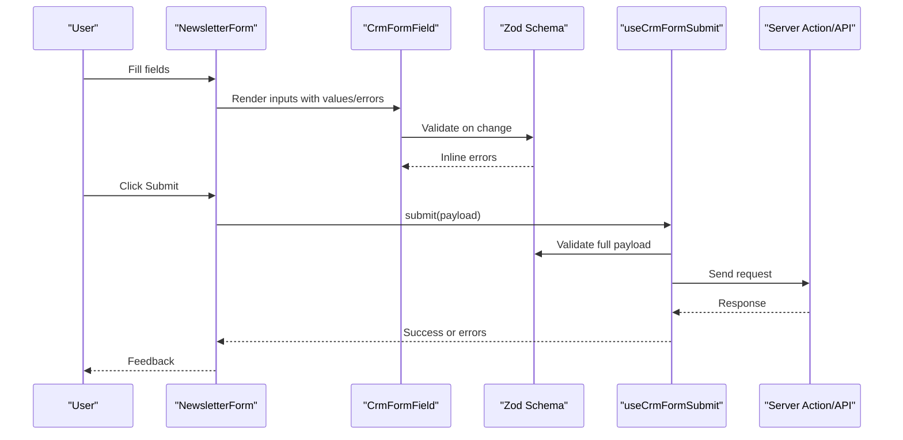
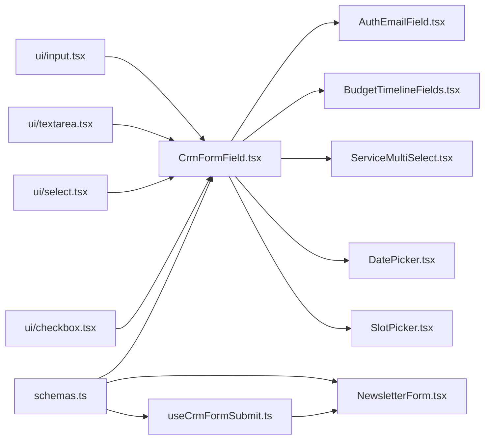

# CRM Form Architecture

<cite>
**Referenced Files in This Document**
- [CrmFormField.tsx](file://app/[locale]/(routes)/crm/_components/crm-shared/CrmFormField.tsx)
- [schemas.ts](file://app/[locale]/(routes)/crm/_components/crm-shared/schemas.ts)
- [useCrmFormSubmit.ts](file://app/[locale]/(routes)/crm/_components/hooks/useCrmFormSubmit.ts)
- [AuthEmailField.tsx](file://app/[locale]/(routes)/crm/_components/crm-shared/AuthEmailField.tsx)
- [BudgetTimelineFields.tsx](file://app/[locale]/(routes)/crm/_components/crm-shared/fields/BudgetTimelineFields.tsx)
- [ServiceMultiSelect.tsx](file://app/[locale]/(routes)/crm/_components/crm-shared/fields/ServiceMultiSelect.tsx)
- [DatePicker.tsx](file://app/[locale]/(routes)/crm/_components/crm-shared/booking/DatePicker.tsx)
- [SlotPicker.tsx](file://app/[locale]/(routes)/crm/_components/crm-shared/booking/SlotPicker.tsx)
- [NewsletterForm.tsx](file://app/[locale]/(routes)/crm/_components/crm-shared/NewsletterForm.tsx)
- [Input.tsx](file://components/ui/input.tsx)
- [Textarea.tsx](file://components/ui/textarea.tsx)
- [Button.tsx](file://components/ui/button.tsx)
- [Select.tsx](file://components/ui/select.tsx)
- [Checkbox.tsx](file://components/ui/checkbox.tsx)
</cite>

## Table of Contents
1. [Introduction](#introduction)
2. [Project Structure](#project-structure)
3. [Core Components](#core-components)
4. [Architecture Overview](#architecture-overview)
5. [Detailed Component Analysis](#detailed-component-analysis)
6. [Dependency Analysis](#dependency-analysis)
7. [Performance Considerations](#performance-considerations)
8. [Troubleshooting Guide](#troubleshooting-guide)
9. [Conclusion](#conclusion)
10. [Appendices](#appendices)

## Introduction
This document explains the CRM form architecture system used across the CRM routes. It focuses on:
- Shared form field component structure and consistent styling
- Validation schema patterns using Zod
- Centralized form submission hook for client-to-server data flow
- How to create reusable form components with consistent behavior
- Custom form fields, complex validation rules, and error handling strategies
- Form state management patterns and extension guidelines for new field types and validations

The goal is to provide a clear mental model and practical guidance for building robust, maintainable forms in the CRM area.

## Project Structure
CRM-related form code is organized under the CRM route group with shared utilities and hooks:
- Shared form UI and schemas live under crm-shared
- Reusable domain-specific fields are grouped by feature (e.g., booking, fields)
- A centralized submission hook encapsulates server integration and error handling
- Base UI primitives are provided by the shared UI kit

[No sources needed since this diagram shows conceptual workflow, not actual code structure]

## Core Components
- CrmFormField: A shared wrapper that standardizes label, description, error display, and accessibility attributes for all CRM form inputs. It composes base UI primitives and integrates with validation errors.
- Schemas: Centralized Zod schemas define shape and constraints for CRM forms. They are reused across pages and fields to ensure consistent validation.
- useCrmFormSubmit: A hook that centralizes submission logic, including payload preparation, calling server actions or API endpoints, loading states, success feedback, and normalized error mapping.
- Domain Fields: Specialized fields such as AuthEmailField, BudgetTimelineFields, ServiceMultiSelect, DatePicker, and SlotPicker build on CrmFormField and UI primitives to implement domain-specific UX while reusing shared validation and error handling.

Key responsibilities:
- Consistent visual and behavioral contract for all inputs
- Single source of truth for validation rules
- Centralized submission lifecycle and error normalization
- Clear separation between presentation (UI primitives), composition (CrmFormField), and domain logic (custom fields)

**Section sources**
- [CrmFormField.tsx](file://app/[locale]/(routes)/crm/_components/crm-shared/CrmFormField.tsx)
- [schemas.ts](file://app/[locale]/(routes)/crm/_components/crm-shared/schemas.ts)
- [useCrmFormSubmit.ts](file://app/[locale]/(routes)/crm/_components/hooks/useCrmFormSubmit.ts)
- [AuthEmailField.tsx](file://app/[locale]/(routes)/crm/_components/crm-shared/AuthEmailField.tsx)
- [BudgetTimelineFields.tsx](file://app/[locale]/(routes)/crm/_components/crm-shared/fields/BudgetTimelineFields.tsx)
- [ServiceMultiSelect.tsx](file://app/[locale]/(routes)/crm/_components/crm-shared/fields/ServiceMultiSelect.tsx)
- [DatePicker.tsx](file://app/[locale]/(routes)/crm/_components/crm-shared/booking/DatePicker.tsx)
- [SlotPicker.tsx](file://app/[locale]/(routes)/crm/_components/crm-shared/booking/SlotPicker.tsx)
- [Input.tsx](file://components/ui/input.tsx)
- [Textarea.tsx](file://components/ui/textarea.tsx)
- [Button.tsx](file://components/ui/button.tsx)
- [Select.tsx](file://components/ui/select.tsx)
- [Checkbox.tsx](file://components/ui/checkbox.tsx)

## Architecture Overview
The CRM form system follows a layered approach:
- Presentation layer: UI primitives (input, textarea, select, checkbox, button)
- Composition layer: CrmFormField wraps primitives to enforce consistent labels, descriptions, and error rendering
- Schema layer: Zod schemas define validation rules and error messages
- Submission layer: useCrmFormSubmit orchestrates payload creation, network calls, and state transitions
- Domain layer: Feature-specific fields compose CrmFormField and schemas to deliver specialized UX

**Diagram sources**
- [CrmFormField.tsx](file://app/[locale]/(routes)/crm/_components/crm-shared/CrmFormField.tsx)
- [schemas.ts](file://app/[locale]/(routes)/crm/_components/crm-shared/schemas.ts)
- [useCrmFormSubmit.ts](file://app/[locale]/(routes)/crm/_components/hooks/useCrmFormSubmit.ts)
- [AuthEmailField.tsx](file://app/[locale]/(routes)/crm/_components/crm-shared/AuthEmailField.tsx)

## Detailed Component Analysis

### CrmFormField: Shared Input Wrapper
Purpose:
- Provide a uniform interface for all CRM inputs
- Bind label, description, and error message slots
- Ensure accessibility attributes (aria-describedby, aria-invalid)
- Integrate with Zod-based validation results

Typical usage pattern:
- Wrap any UI primitive (Input, Textarea, Select, Checkbox)
- Pass value, onChange, onBlur, and error from form state
- Provide label and optional description text

**Diagram sources**
- [CrmFormField.tsx](file://app/[locale]/(routes)/crm/_components/crm-shared/CrmFormField.tsx)
- [Input.tsx](file://components/ui/input.tsx)
- [Textarea.tsx](file://components/ui/textarea.tsx)
- [Select.tsx](file://components/ui/select.tsx)
- [Checkbox.tsx](file://components/ui/checkbox.tsx)

**Section sources**
- [CrmFormField.tsx](file://app/[locale]/(routes)/crm/_components/crm-shared/CrmFormField.tsx)
- [Input.tsx](file://components/ui/input.tsx)
- [Textarea.tsx](file://components/ui/textarea.tsx)
- [Select.tsx](file://components/ui/select.tsx)
- [Checkbox.tsx](file://components/ui/checkbox.tsx)

### Zod Schemas: Centralized Validation Rules
Responsibilities:
- Define field-level and cross-field validation rules
- Provide user-friendly error messages
- Enable reuse across multiple forms and pages

Patterns:
- Primitive schemas for strings, numbers, dates, enums
- Optional and required variants
- Cross-field validations when necessary
- Exported schemas per feature or page for clarity

Integration points:
- CrmFormField consumes field-level errors
- useCrmFormSubmit validates the entire payload before submission

**Section sources**
- [schemas.ts](file://app/[locale]/(routes)/crm/_components/crm-shared/schemas.ts)

### useCrmFormSubmit: Centralized Submission Hook
Responsibilities:
- Normalize form values into a server-ready payload
- Execute server action or API call
- Manage loading, success, and error states
- Map server errors to field-level errors where applicable

Submission flow:
- Client collects form values
- Validates against Zod schema
- Calls server endpoint
- Updates UI based on response

**Diagram sources**
- [useCrmFormSubmit.ts](file://app/[locale]/(routes)/crm/_components/hooks/useCrmFormSubmit.ts)
- [schemas.ts](file://app/[locale]/(routes)/crm/_components/crm-shared/schemas.ts)

**Section sources**
- [useCrmFormSubmit.ts](file://app/[locale]/(routes)/crm/_components/hooks/useCrmFormSubmit.ts)

### Domain-Specific Fields
These fields demonstrate how to extend CrmFormField for specific business needs while reusing shared validation and error handling.

- AuthEmailField: Email-focused input with tailored validation and messaging.
- BudgetTimelineFields: Grouped timeline inputs with coordinated validation.
- ServiceMultiSelect: Multi-select service picker with selection constraints.
- DatePicker and SlotPicker: Booking-oriented date and slot selection with availability-aware validation.

**Diagram sources**
- [AuthEmailField.tsx](file://app/[locale]/(routes)/crm/_components/crm-shared/AuthEmailField.tsx)
- [BudgetTimelineFields.tsx](file://app/[locale]/(routes)/crm/_components/crm-shared/fields/BudgetTimelineFields.tsx)
- [ServiceMultiSelect.tsx](file://app/[locale]/(routes)/crm/_components/crm-shared/fields/ServiceMultiSelect.tsx)
- [DatePicker.tsx](file://app/[locale]/(routes)/crm/_components/crm-shared/booking/DatePicker.tsx)
- [SlotPicker.tsx](file://app/[locale]/(routes)/crm/_components/crm-shared/booking/SlotPicker.tsx)
- [CrmFormField.tsx](file://app/[locale]/(routes)/crm/_components/crm-shared/CrmFormField.tsx)

**Section sources**
- [AuthEmailField.tsx](file://app/[locale]/(routes)/crm/_components/crm-shared/AuthEmailField.tsx)
- [BudgetTimelineFields.tsx](file://app/[locale]/(routes)/crm/_components/crm-shared/fields/BudgetTimelineFields.tsx)
- [ServiceMultiSelect.tsx](file://app/[locale]/(routes)/crm/_components/crm-shared/fields/ServiceMultiSelect.tsx)
- [DatePicker.tsx](file://app/[locale]/(routes)/crm/_components/crm-shared/booking/DatePicker.tsx)
- [SlotPicker.tsx](file://app/[locale]/(routes)/crm/_components/crm-shared/booking/SlotPicker.tsx)

### Example: Newsletter Form Integration
A simple form demonstrates how to wire CrmFormField, schemas, and useCrmFormSubmit together for a typical CRM use case.

**Diagram sources**
- [NewsletterForm.tsx](file://app/[locale]/(routes)/crm/_components/crm-shared/NewsletterForm.tsx)
- [CrmFormField.tsx](file://app/[locale]/(routes)/crm/_components/crm-shared/CrmFormField.tsx)
- [schemas.ts](file://app/[locale]/(routes)/crm/_components/crm-shared/schemas.ts)
- [useCrmFormSubmit.ts](file://app/[locale]/(routes)/crm/_components/hooks/useCrmFormSubmit.ts)

**Section sources**
- [NewsletterForm.tsx](file://app/[locale]/(routes)/crm/_components/crm-shared/NewsletterForm.tsx)

## Dependency Analysis
High-level dependencies among CRM form components:
- CrmFormField depends on UI primitives for rendering
- Domain fields depend on CrmFormField and schemas
- useCrmFormSubmit depends on schemas for validation and on server endpoints for submission
- Pages depend on domain fields and the submission hook

**Diagram sources**
- [CrmFormField.tsx](file://app/[locale]/(routes)/crm/_components/crm-shared/CrmFormField.tsx)
- [schemas.ts](file://app/[locale]/(routes)/crm/_components/crm-shared/schemas.ts)
- [useCrmFormSubmit.ts](file://app/[locale]/(routes)/crm/_components/hooks/useCrmFormSubmit.ts)
- [AuthEmailField.tsx](file://app/[locale]/(routes)/crm/_components/crm-shared/AuthEmailField.tsx)
- [BudgetTimelineFields.tsx](file://app/[locale]/(routes)/crm/_components/crm-shared/fields/BudgetTimelineFields.tsx)
- [ServiceMultiSelect.tsx](file://app/[locale]/(routes)/crm/_components/crm-shared/fields/ServiceMultiSelect.tsx)
- [DatePicker.tsx](file://app/[locale]/(routes)/crm/_components/crm-shared/booking/DatePicker.tsx)
- [SlotPicker.tsx](file://app/[locale]/(routes)/crm/_components/crm-shared/booking/SlotPicker.tsx)
- [NewsletterForm.tsx](file://app/[locale]/(routes)/crm/_components/crm-shared/NewsletterForm.tsx)
- [Input.tsx](file://components/ui/input.tsx)
- [Textarea.tsx](file://components/ui/textarea.tsx)
- [Select.tsx](file://components/ui/select.tsx)
- [Checkbox.tsx](file://components/ui/checkbox.tsx)

**Section sources**
- [CrmFormField.tsx](file://app/[locale]/(routes)/crm/_components/crm-shared/CrmFormField.tsx)
- [schemas.ts](file://app/[locale]/(routes)/crm/_components/crm-shared/schemas.ts)
- [useCrmFormSubmit.ts](file://app/[locale]/(routes)/crm/_components/hooks/useCrmFormSubmit.ts)
- [AuthEmailField.tsx](file://app/[locale]/(routes)/crm/_components/crm-shared/AuthEmailField.tsx)
- [BudgetTimelineFields.tsx](file://app/[locale]/(routes)/crm/_components/crm-shared/fields/BudgetTimelineFields.tsx)
- [ServiceMultiSelect.tsx](file://app/[locale]/(routes)/crm/_components/crm-shared/fields/ServiceMultiSelect.tsx)
- [DatePicker.tsx](file://app/[locale]/(routes)/crm/_components/crm-shared/booking/DatePicker.tsx)
- [SlotPicker.tsx](file://app/[locale]/(routes)/crm/_components/crm-shared/booking/SlotPicker.tsx)
- [NewsletterForm.tsx](file://app/[locale]/(routes)/crm/_components/crm-shared/NewsletterForm.tsx)
- [Input.tsx](file://components/ui/input.tsx)
- [Textarea.tsx](file://components/ui/textarea.tsx)
- [Select.tsx](file://components/ui/select.tsx)
- [Checkbox.tsx](file://components/ui/checkbox.tsx)

## Performance Considerations
- Prefer memoization for expensive custom fields to avoid unnecessary re-renders
- Debounce heavy validations or remote checks (e.g., availability lookups)
- Keep schemas focused and modular to reduce parse overhead
- Avoid deep nested state; flatten payloads before submission
- Batch updates when multiple fields change simultaneously

[No sources needed since this section provides general guidance]

## Troubleshooting Guide
Common issues and strategies:
- Validation not showing: Ensure CrmFormField receives the correct error prop and that Zod schema keys match form field names
- Submission fails silently: Inspect useCrmFormSubmit’s error mapping and normalize server responses to field-level errors
- Inconsistent styles: Verify CrmFormField is wrapping the UI primitive and passing required props consistently
- Complex cross-field errors: Centralize cross-field validation in schemas and surface errors via CrmFormField’s error slot

**Section sources**
- [CrmFormField.tsx](file://app/[locale]/(routes)/crm/_components/crm-shared/CrmFormField.tsx)
- [schemas.ts](file://app/[locale]/(routes)/crm/_components/crm-shared/schemas.ts)
- [useCrmFormSubmit.ts](file://app/[locale]/(routes)/crm/_components/hooks/useCrmFormSubmit.ts)

## Conclusion
The CRM form architecture promotes consistency, reusability, and reliability:
- CrmFormField enforces a uniform input contract
- Zod schemas centralize validation logic and messages
- useCrmFormSubmit standardizes submission and error handling
- Domain fields encapsulate specialized UX while leveraging shared infrastructure

Adopting these patterns ensures scalable, maintainable forms across the CRM application.

[No sources needed since this section summarizes without analyzing specific files]

## Appendices

### Guidelines for Extending the System
- New field types:
  - Create a domain field that composes CrmFormField
  - Wire it to the appropriate UI primitive
  - Add or extend Zod schema rules as needed
  - Surface errors through CrmFormField’s error prop
- New validation rules:
  - Add rules to the relevant schema module
  - Provide clear error messages
  - Test both single-field and cross-field scenarios
- Error handling:
  - Normalize server errors to field-level maps
  - Display inline errors via CrmFormField
  - Provide global feedback for non-field errors

[No sources needed since this section provides general guidance]