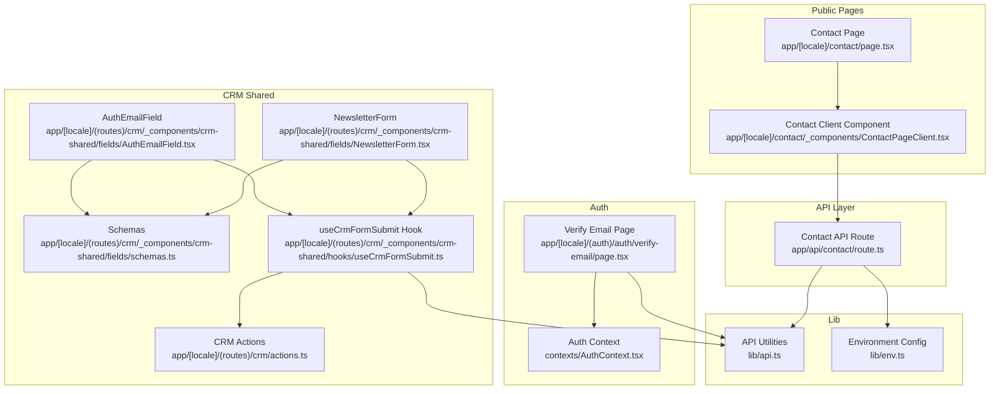
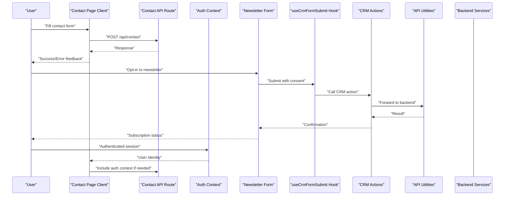
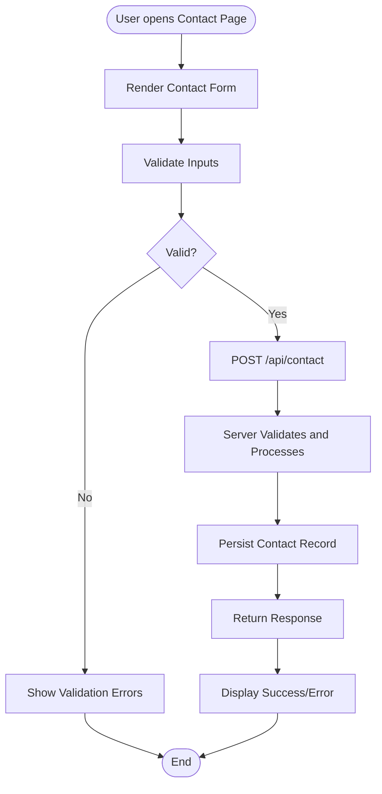
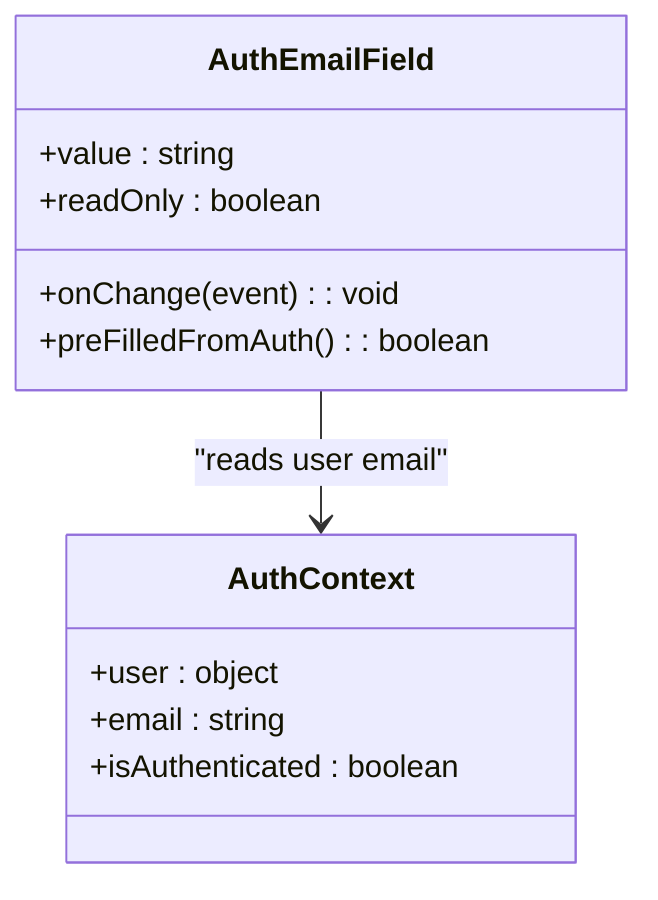
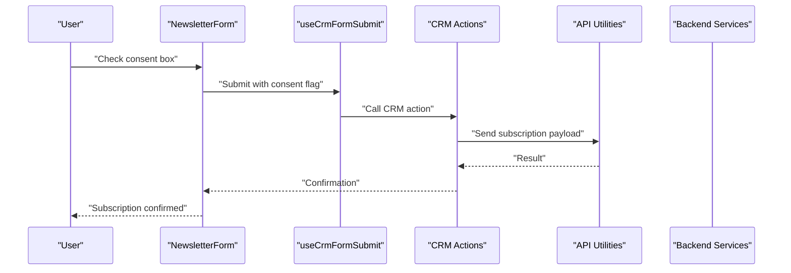
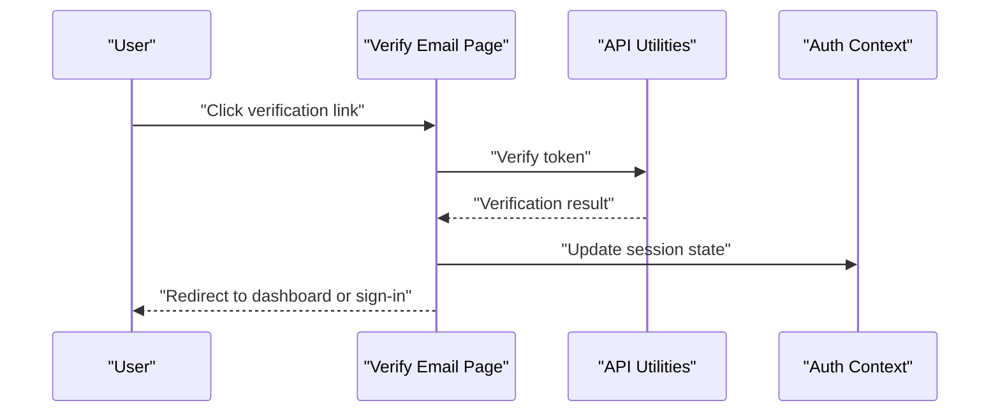
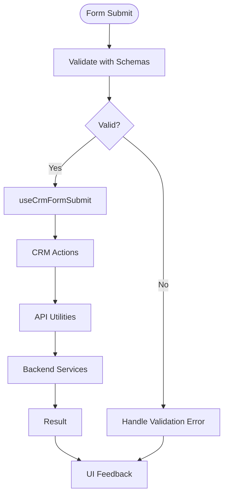
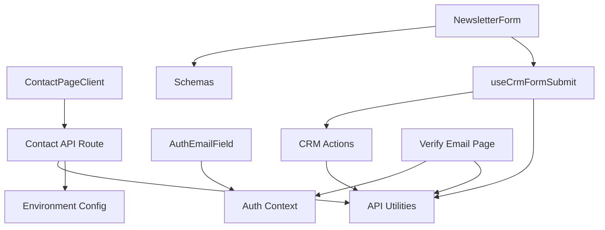

# Contact & Leads Management

<cite>
**Referenced Files in This Document**
- [ContactPageClient.tsx](file://app/[locale]/contact/_components/ContactPageClient.tsx)
- [page.tsx](file://app/[locale]/contact/page.tsx)
- [route.ts](file://app/api/contact/route.ts)
- [AuthEmailField.tsx](file://app/[locale]/(routes)/crm/_components/crm-shared/fields/AuthEmailField.tsx)
- [NewsletterForm.tsx](file://app/[locale]/(routes)/crm/_components/crm-shared/fields/NewsletterForm.tsx)
- [schemas.ts](file://app/[locale]/(routes)/crm/_components/crm-shared/fields/schemas.ts)
- [useCrmFormSubmit.ts](file://app/[locale]/(routes)/crm/_components/crm-shared/hooks/useCrmFormSubmit.ts)
- [actions.ts](file://app/[locale]/(routes)/crm/actions.ts)
- [verify-email/page.tsx](file://app/[locale]/(auth)/auth/verify-email/page.tsx)
- [AuthContext.tsx](file://contexts/AuthContext.tsx)
- [api.ts](file://lib/api.ts)
- [env.ts](file://lib/env.ts)
</cite>

## Table of Contents
1. [Introduction](#introduction)
2. [Project Structure](#project-structure)
3. [Core Components](#core-components)
4. [Architecture Overview](#architecture-overview)
5. [Detailed Component Analysis](#detailed-component-analysis)
6. [Dependency Analysis](#dependency-analysis)
7. [Performance Considerations](#performance-considerations)
8. [Troubleshooting Guide](#troubleshooting-guide)
9. [Conclusion](#conclusion)
10. [Appendices](#appendices)

## Introduction
This document explains the contact and lead management functionality implemented in the frontend application. It covers:
- Contact forms and submission flows
- Email verification for authenticated users
- Newsletter subscription handling
- Authenticated user contact fields (AuthEmailField)
- Marketing communications (NewsletterForm)
- Data model considerations, deduplication, segmentation, and automated follow-up workflows
- Integration points with CRM databases, email marketing platforms, and customer support systems
- Privacy compliance, data retention policies, and consent management

The goal is to provide both a high-level overview and code-level insights so that developers can implement, extend, and maintain these features effectively.

## Project Structure
The contact and lead management features are primarily located under:
- Public-facing contact page and API route
- CRM shared components for authenticated interactions and marketing subscriptions
- Authentication-related email verification flow
- Shared utilities for API calls and environment configuration

**Diagram sources**
- [page.tsx](file://app/[locale]/contact/page.tsx)
- [ContactPageClient.tsx](file://app/[locale]/contact/_components/ContactPageClient.tsx)
- [route.ts](file://app/api/contact/route.ts)
- [AuthEmailField.tsx](file://app/[locale]/(routes)/crm/_components/crm-shared/fields/AuthEmailField.tsx)
- [NewsletterForm.tsx](file://app/[locale]/(routes)/crm/_components/crm-shared/fields/NewsletterForm.tsx)
- [schemas.ts](file://app/[locale]/(routes)/crm/_components/crm-shared/fields/schemas.ts)
- [useCrmFormSubmit.ts](file://app/[locale]/(routes)/crm/_components/crm-shared/hooks/useCrmFormSubmit.ts)
- [actions.ts](file://app/[locale]/(routes)/crm/actions.ts)
- [verify-email/page.tsx](file://app/[locale]/(auth)/auth/verify-email/page.tsx)
- [AuthContext.tsx](file://contexts/AuthContext.tsx)
- [api.ts](file://lib/api.ts)
- [env.ts](file://lib/env.ts)

**Section sources**
- [page.tsx](file://app/[locale]/contact/page.tsx)
- [ContactPageClient.tsx](file://app/[locale]/contact/_components/ContactPageClient.tsx)
- [route.ts](file://app/api/contact/route.ts)
- [AuthEmailField.tsx](file://app/[locale]/(routes)/crm/_components/crm-shared/fields/AuthEmailField.tsx)
- [NewsletterForm.tsx](file://app/[locale]/(routes)/crm/_components/crm-shared/fields/NewsletterForm.tsx)
- [schemas.ts](file://app/[locale]/(routes)/crm/_components/crm-shared/fields/schemas.ts)
- [useCrmFormSubmit.ts](file://app/[locale]/(routes)/crm/_components/crm-shared/hooks/useCrmFormSubmit.ts)
- [actions.ts](file://app/[locale]/(routes)/crm/actions.ts)
- [verify-email/page.tsx](file://app/[locale]/(auth)/auth/verify-email/page.tsx)
- [AuthContext.tsx](file://contexts/AuthContext.tsx)
- [api.ts](file://lib/api.ts)
- [env.ts](file://lib/env.ts)

## Core Components
- Contact Page Client: Renders the public contact form and orchestrates submission via the API route.
- Contact API Route: Receives contact submissions, validates input, and persists or forwards data to backend services.
- AuthEmailField: Pre-fills and constrains the email field for authenticated users using context-provided identity.
- NewsletterForm: Handles marketing opt-in with explicit consent capture and submission.
- useCrmFormSubmit: Centralized hook for CRM-related form submissions, including validation, error handling, and integration calls.
- Schemas: Shared validation schemas used by CRM forms to ensure consistent data structures.
- Verify Email Page: Completes email verification flows for authenticated users.

Key responsibilities:
- Input validation and sanitization at the UI layer
- Consent capture for marketing communications
- Secure transmission to backend endpoints
- User feedback and error handling

**Section sources**
- [ContactPageClient.tsx](file://app/[locale]/contact/_components/ContactPageClient.tsx)
- [route.ts](file://app/api/contact/route.ts)
- [AuthEmailField.tsx](file://app/[locale]/(routes)/crm/_components/crm-shared/fields/AuthEmailField.tsx)
- [NewsletterForm.tsx](file://app/[locale]/(routes)/crm/_components/crm-shared/fields/NewsletterForm.tsx)
- [useCrmFormSubmit.ts](file://app/[locale]/(routes)/crm/_components/crm-shared/hooks/useCrmFormSubmit.ts)
- [schemas.ts](file://app/[locale]/(routes)/crm/_components/crm-shared/fields/schemas.ts)
- [verify-email/page.tsx](file://app/[locale]/(auth)/auth/verify-email/page.tsx)

## Architecture Overview
The contact and lead management architecture follows a client-server pattern:
- The client renders forms and collects user inputs
- Validation occurs on the client using shared schemas
- Submissions are sent to Next.js API routes or CRM actions
- Backend services handle persistence, deduplication, segmentation, and integrations

**Diagram sources**
- [ContactPageClient.tsx](file://app/[locale]/contact/_components/ContactPageClient.tsx)
- [route.ts](file://app/api/contact/route.ts)
- [AuthContext.tsx](file://contexts/AuthContext.tsx)
- [NewsletterForm.tsx](file://app/[locale]/(routes)/crm/_components/crm-shared/fields/NewsletterForm.tsx)
- [useCrmFormSubmit.ts](file://app/[locale]/(routes)/crm/_components/crm-shared/hooks/useCrmFormSubmit.ts)
- [actions.ts](file://app/[locale]/(routes)/crm/actions.ts)
- [api.ts](file://lib/api.ts)

## Detailed Component Analysis

### Contact Page and API Flow
The contact page provides a simple interface for visitors to submit inquiries. The client component handles form state and submits data to the API route. The API route validates and processes the request before persisting or forwarding it to backend services.

**Diagram sources**
- [ContactPageClient.tsx](file://app/[locale]/contact/_components/ContactPageClient.tsx)
- [route.ts](file://app/api/contact/route.ts)

**Section sources**
- [ContactPageClient.tsx](file://app/[locale]/contact/_components/ContactPageClient.tsx)
- [route.ts](file://app/api/contact/route.ts)

### AuthEmailField for Authenticated Users
The AuthEmailField ensures that authenticated users cannot change their email address unintentionally and pre-fills it from the authentication context. This reduces errors and streamlines CRM interactions.

**Diagram sources**
- [AuthEmailField.tsx](file://app/[locale]/(routes)/crm/_components/crm-shared/fields/AuthEmailField.tsx)
- [AuthContext.tsx](file://contexts/AuthContext.tsx)

**Section sources**
- [AuthEmailField.tsx](file://app/[locale]/(routes)/crm/_components/crm-shared/fields/AuthEmailField.tsx)
- [AuthContext.tsx](file://contexts/AuthContext.tsx)

### NewsletterForm and Consent Capture
The NewsletterForm captures explicit consent for marketing communications and submits subscription requests through the CRM submission hook. Consent flags are included in payloads to satisfy privacy requirements.

**Diagram sources**
- [NewsletterForm.tsx](file://app/[locale]/(routes)/crm/_components/crm-shared/fields/NewsletterForm.tsx)
- [useCrmFormSubmit.ts](file://app/[locale]/(routes)/crm/_components/crm-shared/hooks/useCrmFormSubmit.ts)
- [actions.ts](file://app/[locale]/(routes)/crm/actions.ts)
- [api.ts](file://lib/api.ts)

**Section sources**
- [NewsletterForm.tsx](file://app/[locale]/(routes)/crm/_components/crm-shared/fields/NewsletterForm.tsx)
- [useCrmFormSubmit.ts](file://app/[locale]/(routes)/crm/_components/crm-shared/hooks/useCrmFormSubmit.ts)
- [actions.ts](file://app/[locale]/(routes)/crm/actions.ts)
- [api.ts](file://lib/api.ts)

### Email Verification Flow
The verify email page completes the authentication email verification process. It interacts with the API and updates the user’s session state accordingly.

**Diagram sources**
- [verify-email/page.tsx](file://app/[locale]/(auth)/auth/verify-email/page.tsx)
- [api.ts](file://lib/api.ts)
- [AuthContext.tsx](file://contexts/AuthContext.tsx)

**Section sources**
- [verify-email/page.tsx](file://app/[locale]/(auth)/auth/verify-email/page.tsx)
- [api.ts](file://lib/api.ts)
- [AuthContext.tsx](file://contexts/AuthContext.tsx)

### CRM Submission Hook and Actions
The useCrmFormSubmit hook centralizes CRM form logic, including validation against shared schemas, error handling, and calling CRM actions. CRM actions coordinate with API utilities to forward data to backend services.

**Diagram sources**
- [useCrmFormSubmit.ts](file://app/[locale]/(routes)/crm/_components/crm-shared/hooks/useCrmFormSubmit.ts)
- [actions.ts](file://app/[locale]/(routes)/crm/actions.ts)
- [api.ts](file://lib/api.ts)
- [schemas.ts](file://app/[locale]/(routes)/crm/_components/crm-shared/fields/schemas.ts)

**Section sources**
- [useCrmFormSubmit.ts](file://app/[locale]/(routes)/crm/_components/crm-shared/hooks/useCrmFormSubmit.ts)
- [actions.ts](file://app/[locale]/(routes)/crm/actions.ts)
- [api.ts](file://lib/api.ts)
- [schemas.ts](file://app/[locale]/(routes)/crm/_components/crm-shared/fields/schemas.ts)

## Dependency Analysis
The following diagram shows key dependencies among components and utilities involved in contact and lead management.

**Diagram sources**
- [ContactPageClient.tsx](file://app/[locale]/contact/_components/ContactPageClient.tsx)
- [route.ts](file://app/api/contact/route.ts)
- [api.ts](file://lib/api.ts)
- [env.ts](file://lib/env.ts)
- [AuthEmailField.tsx](file://app/[locale]/(routes)/crm/_components/crm-shared/fields/AuthEmailField.tsx)
- [AuthContext.tsx](file://contexts/AuthContext.tsx)
- [NewsletterForm.tsx](file://app/[locale]/(routes)/crm/_components/crm-shared/fields/NewsletterForm.tsx)
- [schemas.ts](file://app/[locale]/(routes)/crm/_components/crm-shared/fields/schemas.ts)
- [useCrmFormSubmit.ts](file://app/[locale]/(routes)/crm/_components/crm-shared/hooks/useCrmFormSubmit.ts)
- [actions.ts](file://app/[locale]/(routes)/crm/actions.ts)
- [verify-email/page.tsx](file://app/[locale]/(auth)/auth/verify-email/page.tsx)

**Section sources**
- [ContactPageClient.tsx](file://app/[locale]/contact/_components/ContactPageClient.tsx)
- [route.ts](file://app/api/contact/route.ts)
- [api.ts](file://lib/api.ts)
- [env.ts](file://lib/env.ts)
- [AuthEmailField.tsx](file://app/[locale]/(routes)/crm/_components/crm-shared/fields/AuthEmailField.tsx)
- [AuthContext.tsx](file://contexts/AuthContext.tsx)
- [NewsletterForm.tsx](file://app/[locale]/(routes)/crm/_components/crm-shared/fields/NewsletterForm.tsx)
- [schemas.ts](file://app/[locale]/(routes)/crm/_components/crm-shared/fields/schemas.ts)
- [useCrmFormSubmit.ts](file://app/[locale]/(routes)/crm/_components/crm-shared/hooks/useCrmFormSubmit.ts)
- [actions.ts](file://app/[locale]/(routes)/crm/actions.ts)
- [verify-email/page.tsx](file://app/[locale]/(auth)/auth/verify-email/page.tsx)

## Performance Considerations
- Client-side validation reduces unnecessary network requests and improves responsiveness.
- Debounce heavy operations like deduplication checks if performed on the client.
- Cache static assets and minimize re-renders in form components.
- Use efficient schema validation libraries to avoid performance bottlenecks.
- Batch API calls where possible to reduce overhead.

[No sources needed since this section provides general guidance]

## Troubleshooting Guide
Common issues and resolutions:
- Validation failures: Ensure schemas match expected input formats and display clear error messages.
- Network errors: Check API utilities and environment configuration for correct endpoints and headers.
- Consent not captured: Verify that consent checkboxes are bound correctly and included in payloads.
- Auth context missing: Confirm that authentication context is available and user email is present when using AuthEmailField.
- Email verification failures: Validate tokens and handle expired links gracefully.

**Section sources**
- [schemas.ts](file://app/[locale]/(routes)/crm/_components/crm-shared/fields/schemas.ts)
- [api.ts](file://lib/api.ts)
- [env.ts](file://lib/env.ts)
- [AuthEmailField.tsx](file://app/[locale]/(routes)/crm/_components/crm-shared/fields/AuthEmailField.tsx)
- [verify-email/page.tsx](file://app/[locale]/(auth)/auth/verify-email/page.tsx)

## Conclusion
The contact and lead management system integrates public contact forms, authenticated user fields, newsletter subscriptions, and email verification into a cohesive workflow. By leveraging shared schemas, centralized hooks, and robust API utilities, the application maintains consistency, security, and usability. Extending the system with CRM integrations, deduplication, segmentation, and automated follow-ups should be implemented on the backend while preserving frontend validation and consent capture.

[No sources needed since this section summarizes without analyzing specific files]

## Appendices

### Contact Data Model Considerations
- Fields typically include name, email, phone, message, source, timestamp, and consent flags.
- For authenticated users, prefer linking to existing user records to avoid duplicates.
- Include metadata such as IP address, user agent, and locale for analytics and compliance.

[No sources needed since this section provides general guidance]

### Lead Scoring Mechanisms
- Assign scores based on form type, engagement signals, and demographic attributes.
- Update scores asynchronously via backend pipelines triggered by new contacts or interactions.
- Expose scoring thresholds to segment leads into tiers for prioritized follow-ups.

[No sources needed since this section provides general guidance]

### Customer Interaction Tracking
- Log events for form views, submissions, and subsequent actions (e.g., call bookings).
- Correlate interactions with user sessions and CRM identifiers.
- Provide dashboards for sales and support teams to review interaction histories.

[No sources needed since this section provides general guidance]

### Contact Deduplication
- Implement server-side deduplication by email and other unique identifiers.
- Merge duplicate records while preserving interaction history and consent preferences.
- Maintain audit trails for merges and conflicts.

[No sources needed since this section provides general guidance]

### Segmentation
- Segment by source (e.g., contact form vs. newsletter), geography, language, and consent status.
- Use tags and labels to enable targeted campaigns and personalized follow-ups.
- Periodically refresh segments based on recent activity and updated attributes.

[No sources needed since this section provides general guidance]

### Automated Follow-up Workflows
- Trigger welcome emails upon newsletter subscription.
- Send confirmation emails after contact form submissions.
- Schedule reminders for unverified emails or incomplete profiles.

[No sources needed since this section provides general guidance]

### Integrations
- CRM Databases: Push contact records and update lead statuses via REST or SDKs.
- Email Marketing Platforms: Sync subscribers with explicit consent and manage unsubscribes.
- Customer Support Systems: Create tickets from contact submissions and attach relevant metadata.

[No sources needed since this section provides general guidance]

### Privacy Compliance, Data Retention, and Consent Management
- Capture explicit consent for marketing communications and store timestamps.
- Honor opt-out requests promptly and propagate across integrated platforms.
- Define retention periods for contact data and automate purging beyond policy limits.
- Provide mechanisms for users to access, correct, or delete their data.

[No sources needed since this section provides general guidance]