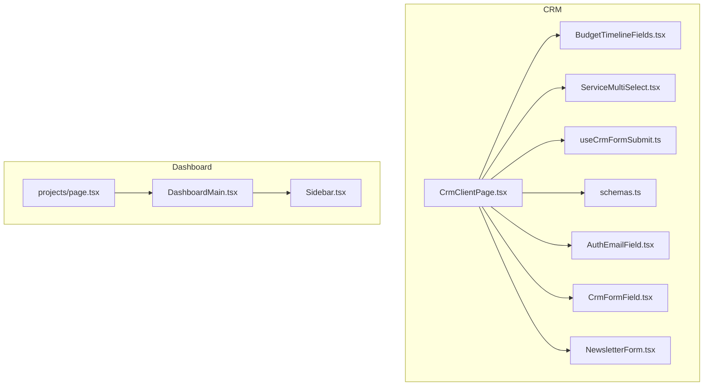
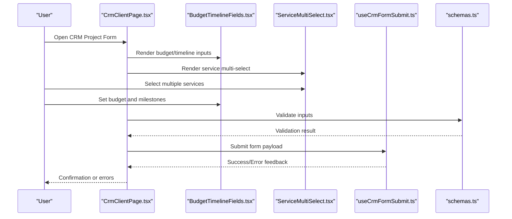
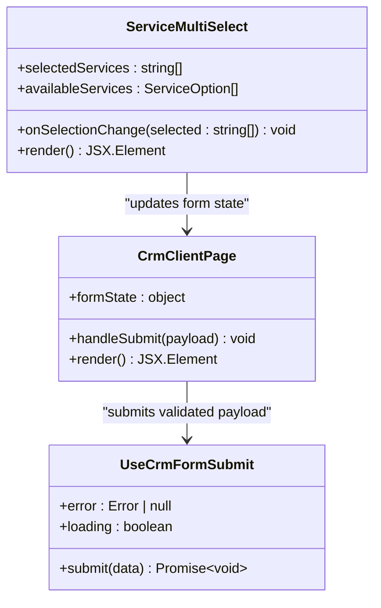
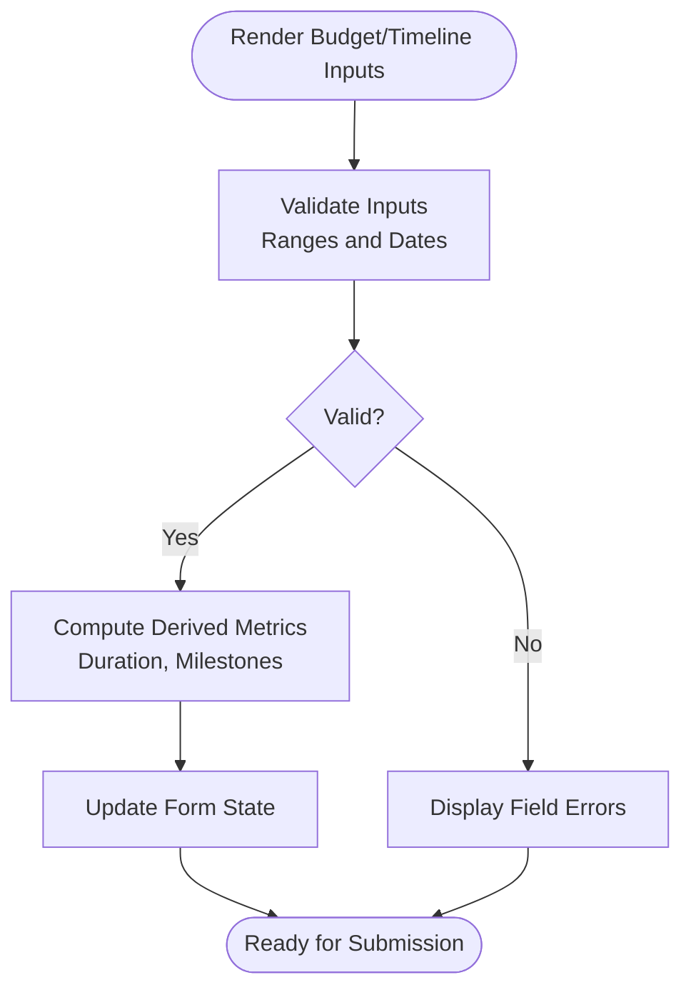
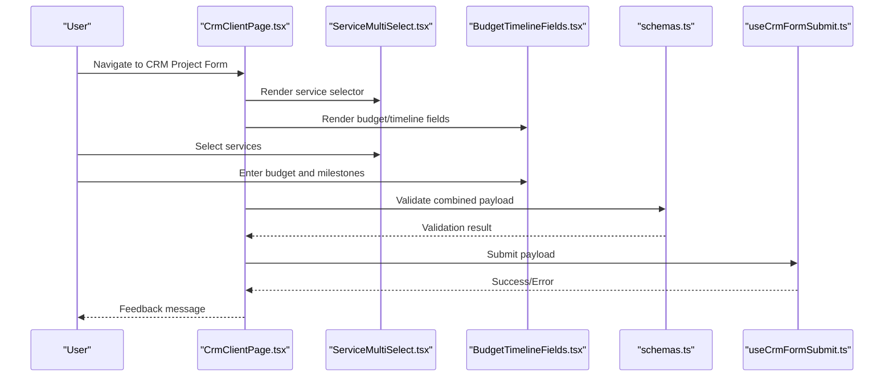
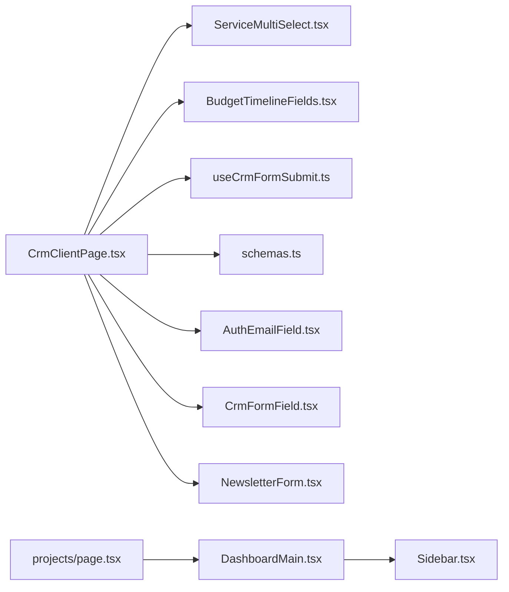

# Project Tracking

<cite>
**Referenced Files in This Document**
- [ServiceMultiSelect.tsx](file://app/[locale]/crm/_components/crm-shared/fields/ServiceMultiSelect.tsx)
- [BudgetTimelineFields.tsx](file://app/[locale]/crm/_components/BudgetTimelineFields.tsx)
- [CrmClientPage.tsx](file://app/[locale]/crm/_components/CrmClientPage.tsx)
- [useCrmFormSubmit.ts](file://app/[locale]/crm/_components/hooks/useCrmFormSubmit.ts)
- [schemas.ts](file://app/[locale]/crm/_components/crm-shared/fields/schemas.ts)
- [page.tsx](file://app/[locale]/dashboard/(routes)/projects/page.tsx)
- [DashboardMain.tsx](file://app/[locale]/dashboard/_components/DashboardMain.tsx)
- [Sidebar.tsx](file://app/[locale]/dashboard/_components/Sidebar/Sidebar.tsx)
- [AuthEmailField.tsx](file://app/[locale]/crm/_components/crm-shared/fields/AuthEmailField.tsx)
- [CrmFormField.tsx](file://app/[locale]/crm/_components/crm-shared/fields/CrmFormField.tsx)
- [NewsletterForm.tsx](file://app/[locale]/crm/_components/crm-shared/fields/NewsletterForm.tsx)
</cite>

## Table of Contents
1. [Introduction](#introduction)
2. [Project Structure](#project-structure)
3. [Core Components](#core-components)
4. [Architecture Overview](#architecture-overview)
5. [Detailed Component Analysis](#detailed-component-analysis)
6. [Dependency Analysis](#dependency-analysis)
7. [Performance Considerations](#performance-considerations)
8. [Troubleshooting Guide](#troubleshooting-guide)
9. [Conclusion](#conclusion)
10. [Appendices](#appendices)

## Introduction
This document explains the project tracking capabilities implemented in the frontend, focusing on:
- Service multi-selection within projects using a dedicated component
- Project lifecycle management and status workflows
- Milestone tracking and resource allocation
- Reporting and analytics dashboards
- Team collaboration features
- Customization of project templates
- Automated notifications setup
- Integrations with external project management tools
- Data visualization, performance optimization for large datasets, and real-time updates

The implementation is centered around CRM forms and dashboard pages that support project creation, configuration, and ongoing monitoring.

## Project Structure
The project tracking features are primarily located under the CRM and Dashboard sections:
- CRM shared fields and components provide reusable building blocks for project-related forms
- The CRM client page orchestrates form submission and data flow
- The Projects dashboard page provides an entry point to view and manage projects
- Shared UI primitives and validation schemas ensure consistent behavior across forms

**Diagram sources**
- [CrmClientPage.tsx](file://app/[locale]/crm/_components/CrmClientPage.tsx)
- [BudgetTimelineFields.tsx](file://app/[locale]/crm/_components/BudgetTimelineFields.tsx)
- [ServiceMultiSelect.tsx](file://app/[locale]/crm/_components/crm-shared/fields/ServiceMultiSelect.tsx)
- [useCrmFormSubmit.ts](file://app/[locale]/crm/_components/hooks/useCrmFormSubmit.ts)
- [schemas.ts](file://app/[locale]/crm/_components/crm-shared/fields/schemas.ts)
- [AuthEmailField.tsx](file://app/[locale]/crm/_components/crm-shared/fields/AuthEmailField.tsx)
- [CrmFormField.tsx](file://app/[locale]/crm/_components/crm-shared/fields/CrmFormField.tsx)
- [NewsletterForm.tsx](file://app/[locale]/crm/_components/crm-shared/fields/NewsletterForm.tsx)
- [page.tsx](file://app/[locale]/dashboard/(routes)/projects/page.tsx)
- [DashboardMain.tsx](file://app/[locale]/dashboard/_components/DashboardMain.tsx)
- [Sidebar.tsx](file://app/[locale]/dashboard/_components/Sidebar/Sidebar.tsx)

**Section sources**
- [CrmClientPage.tsx](file://app/[locale]/crm/_components/CrmClientPage.tsx)
- [BudgetTimelineFields.tsx](file://app/[locale]/crm/_components/BudgetTimelineFields.tsx)
- [ServiceMultiSelect.tsx](file://app/[locale]/crm/_components/crm-shared/fields/ServiceMultiSelect.tsx)
- [useCrmFormSubmit.ts](file://app/[locale]/crm/_components/hooks/useCrmFormSubmit.ts)
- [schemas.ts](file://app/[locale]/crm/_components/crm-shared/fields/schemas.ts)
- [AuthEmailField.tsx](file://app/[locale]/crm/_components/crm-shared/fields/AuthEmailField.tsx)
- [CrmFormField.tsx](file://app/[locale]/crm/_components/crm-shared/fields/CrmFormField.tsx)
- [NewsletterForm.tsx](file://app/[locale]/crm/_components/crm-shared/fields/NewsletterForm.tsx)
- [page.tsx](file://app/[locale]/dashboard/(routes)/projects/page.tsx)
- [DashboardMain.tsx](file://app/[locale]/dashboard/_components/DashboardMain.tsx)
- [Sidebar.tsx](file://app/[locale]/dashboard/_components/Sidebar/Sidebar.tsx)

## Core Components
- ServiceMultiSelect: Enables selecting multiple services within a project context. It integrates with form state and validation to ensure only valid service combinations are submitted.
- BudgetTimelineFields: Provides budget and timeline inputs used to define milestones and resource allocations during project setup.
- CrmClientPage: Orchestrates the CRM form workflow, including service selection, budget/timeline configuration, and submission handling.
- useCrmFormSubmit: Encapsulates form submission logic, error handling, and success flows for CRM operations.
- Validation Schemas: Centralized schema definitions enforce input constraints and consistency across CRM forms.

These components collectively enable robust project tracking by capturing essential project metadata (services, budget, timeline), validating user inputs, and submitting structured data for downstream processing.

**Section sources**
- [ServiceMultiSelect.tsx](file://app/[locale]/crm/_components/crm-shared/fields/ServiceMultiSelect.tsx)
- [BudgetTimelineFields.tsx](file://app/[locale]/crm/_components/BudgetTimelineFields.tsx)
- [CrmClientPage.tsx](file://app/[locale]/crm/_components/CrmClientPage.tsx)
- [useCrmFormSubmit.ts](file://app/[locale]/crm/_components/hooks/useCrmFormSubmit.ts)
- [schemas.ts](file://app/[locale]/crm/_components/crm-shared/fields/schemas.ts)

## Architecture Overview
The project tracking architecture follows a layered approach:
- Presentation Layer: CRM forms and dashboard pages render interactive UIs for users to configure and monitor projects.
- Form Logic Layer: Reusable hooks and schemas handle validation, submission, and error states.
- Integration Layer: Submission actions route data to backend endpoints or internal handlers for persistence and further processing.

**Diagram sources**
- [CrmClientPage.tsx](file://app/[locale]/crm/_components/CrmClientPage.tsx)
- [BudgetTimelineFields.tsx](file://app/[locale]/crm/_components/BudgetTimelineFields.tsx)
- [ServiceMultiSelect.tsx](file://app/[locale]/crm/_components/crm-shared/fields/ServiceMultiSelect.tsx)
- [useCrmFormSubmit.ts](file://app/[locale]/crm/_components/hooks/useCrmFormSubmit.ts)
- [schemas.ts](file://app/[locale]/crm/_components/crm-shared/fields/schemas.ts)

## Detailed Component Analysis

### ServiceMultiSelect Component
Purpose:
- Allows users to choose multiple services associated with a project.
- Integrates with form state and validation to ensure correct data structures.
- Supports dynamic options and filtering based on available services.

Key behaviors:
- Maintains selected service IDs in form state.
- Displays clear selection indicators and supports bulk actions (select all/deselect).
- Emits change events to update dependent fields (e.g., budget ranges, timelines).

Integration points:
- Consumed by CRM client page to capture service selections.
- Validated via centralized schemas to prevent invalid combinations.

**Diagram sources**
- [ServiceMultiSelect.tsx](file://app/[locale]/crm/_components/crm-shared/fields/ServiceMultiSelect.tsx)
- [CrmClientPage.tsx](file://app/[locale]/crm/_components/CrmClientPage.tsx)
- [useCrmFormSubmit.ts](file://app/[locale]/crm/_components/hooks/useCrmFormSubmit.ts)

**Section sources**
- [ServiceMultiSelect.tsx](file://app/[locale]/crm/_components/crm-shared/fields/ServiceMultiSelect.tsx)
- [CrmClientPage.tsx](file://app/[locale]/crm/_components/CrmClientPage.tsx)
- [useCrmFormSubmit.ts](file://app/[locale]/crm/_components/hooks/useCrmFormSubmit.ts)

### Budget and Timeline Fields
Purpose:
- Capture budget constraints and milestone dates to guide project planning.
- Provide structured inputs for resource allocation and scheduling.

Key behaviors:
- Enforces numeric ranges and date ordering.
- Updates derived metrics (e.g., estimated duration) when inputs change.
- Integrates with validation schemas to ensure consistency.

**Diagram sources**
- [BudgetTimelineFields.tsx](file://app/[locale]/crm/_components/BudgetTimelineFields.tsx)
- [schemas.ts](file://app/[locale]/crm/_components/crm-shared/fields/schemas.ts)

**Section sources**
- [BudgetTimelineFields.tsx](file://app/[locale]/crm/_components/BudgetTimelineFields.tsx)
- [schemas.ts](file://app/[locale]/crm/_components/crm-shared/fields/schemas.ts)

### CRM Client Page and Submission Flow
Purpose:
- Orchestrate the full CRM project creation workflow.
- Coordinate field rendering, validation, and submission.

Key behaviors:
- Aggregates inputs from ServiceMultiSelect and BudgetTimelineFields.
- Uses a submission hook to handle asynchronous operations and feedback.
- Presents user-friendly messages for success and error states.

**Diagram sources**
- [CrmClientPage.tsx](file://app/[locale]/crm/_components/CrmClientPage.tsx)
- [ServiceMultiSelect.tsx](file://app/[locale]/crm/_components/crm-shared/fields/ServiceMultiSelect.tsx)
- [BudgetTimelineFields.tsx](file://app/[locale]/crm/_components/BudgetTimelineFields.tsx)
- [schemas.ts](file://app/[locale]/crm/_components/crm-shared/fields/schemas.ts)
- [useCrmFormSubmit.ts](file://app/[locale]/crm/_components/hooks/useCrmFormSubmit.ts)

**Section sources**
- [CrmClientPage.tsx](file://app/[locale]/crm/_components/CrmClientPage.tsx)
- [useCrmFormSubmit.ts](file://app/[locale]/crm/_components/hooks/useCrmFormSubmit.ts)
- [schemas.ts](file://app/[locale]/crm/_components/crm-shared/fields/schemas.ts)

### Dashboard Projects Entry Point
Purpose:
- Provide a central location to access project tracking features.
- Link to CRM forms and other project-related dashboards.

Key behaviors:
- Renders navigation and summary information.
- Delegates detailed interactions to specific feature pages.

**Section sources**
- [page.tsx](file://app/[locale]/dashboard/(routes)/projects/page.tsx)
- [DashboardMain.tsx](file://app/[locale]/dashboard/_components/DashboardMain.tsx)
- [Sidebar.tsx](file://app/[locale]/dashboard/_components/Sidebar/Sidebar.tsx)

### Supporting CRM Fields
- AuthEmailField: Captures authenticated email addresses for project stakeholders.
- CrmFormField: Generic wrapper ensuring consistent styling and validation behavior.
- NewsletterForm: Optional subscription form integrated into CRM flows for updates.

**Section sources**
- [AuthEmailField.tsx](file://app/[locale]/crm/_components/crm-shared/fields/AuthEmailField.tsx)
- [CrmFormField.tsx](file://app/[locale]/crm/_components/crm-shared/fields/CrmFormField.tsx)
- [NewsletterForm.tsx](file://app/[locale]/crm/_components/crm-shared/fields/NewsletterForm.tsx)

## Dependency Analysis
The following diagram illustrates key dependencies among project tracking components:

**Diagram sources**
- [CrmClientPage.tsx](file://app/[locale]/crm/_components/CrmClientPage.tsx)
- [ServiceMultiSelect.tsx](file://app/[locale]/crm/_components/crm-shared/fields/ServiceMultiSelect.tsx)
- [BudgetTimelineFields.tsx](file://app/[locale]/crm/_components/BudgetTimelineFields.tsx)
- [useCrmFormSubmit.ts](file://app/[locale]/crm/_components/hooks/useCrmFormSubmit.ts)
- [schemas.ts](file://app/[locale]/crm/_components/crm-shared/fields/schemas.ts)
- [AuthEmailField.tsx](file://app/[locale]/crm/_components/crm-shared/fields/AuthEmailField.tsx)
- [CrmFormField.tsx](file://app/[locale]/crm/_components/crm-shared/fields/CrmFormField.tsx)
- [NewsletterForm.tsx](file://app/[locale]/crm/_components/crm-shared/fields/NewsletterForm.tsx)
- [page.tsx](file://app/[locale]/dashboard/(routes)/projects/page.tsx)
- [DashboardMain.tsx](file://app/[locale]/dashboard/_components/DashboardMain.tsx)
- [Sidebar.tsx](file://app/[locale]/dashboard/_components/Sidebar/Sidebar.tsx)

**Section sources**
- [CrmClientPage.tsx](file://app/[locale]/crm/_components/CrmClientPage.tsx)
- [ServiceMultiSelect.tsx](file://app/[locale]/crm/_components/crm-shared/fields/ServiceMultiSelect.tsx)
- [BudgetTimelineFields.tsx](file://app/[locale]/crm/_components/BudgetTimelineFields.tsx)
- [useCrmFormSubmit.ts](file://app/[locale]/crm/_components/hooks/useCrmFormSubmit.ts)
- [schemas.ts](file://app/[locale]/crm/_components/crm-shared/fields/schemas.ts)
- [AuthEmailField.tsx](file://app/[locale]/crm/_components/crm-shared/fields/AuthEmailField.tsx)
- [CrmFormField.tsx](file://app/[locale]/crm/_components/crm-shared/fields/CrmFormField.tsx)
- [NewsletterForm.tsx](file://app/[locale]/crm/_components/crm-shared/fields/NewsletterForm.tsx)
- [page.tsx](file://app/[locale]/dashboard/(routes)/projects/page.tsx)
- [DashboardMain.tsx](file://app/[locale]/dashboard/_components/DashboardMain.tsx)
- [Sidebar.tsx](file://app/[locale]/dashboard/_components/Sidebar/Sidebar.tsx)

## Performance Considerations
- Large dataset handling:
  - Implement virtualization or pagination for long lists of services to reduce DOM overhead.
  - Debounce search/filter inputs to minimize re-renders during typing.
- Efficient state updates:
  - Use memoization for expensive computations (e.g., derived metrics from budget/timeline).
  - Avoid unnecessary re-renders by isolating state changes to relevant components.
- Network efficiency:
  - Batch API calls where possible and cache responses to avoid redundant requests.
  - Use optimistic updates for better perceived performance, with rollback on failure.
- Real-time updates:
  - Integrate lightweight WebSocket or Server-Sent Events for live progress updates without polling.
  - Throttle event emissions to prevent excessive UI refreshes.

[No sources needed since this section provides general guidance]

## Troubleshooting Guide
Common issues and resolutions:
- Validation failures:
  - Ensure all required fields are filled and conform to schema constraints.
  - Check error messages rendered by the form and adjust inputs accordingly.
- Submission errors:
  - Inspect network requests and server responses for HTTP errors.
  - Verify authentication tokens and permissions if applicable.
- UI inconsistencies:
  - Confirm that shared form wrappers are applied consistently across fields.
  - Review theme and style overrides that might affect layout.

**Section sources**
- [useCrmFormSubmit.ts](file://app/[locale]/crm/_components/hooks/useCrmFormSubmit.ts)
- [schemas.ts](file://app/[locale]/crm/_components/crm-shared/fields/schemas.ts)
- [CrmFormField.tsx](file://app/[locale]/crm/_components/crm-shared/fields/CrmFormField.tsx)

## Conclusion
The project tracking implementation leverages modular CRM components to support service multi-selection, budget and timeline configuration, and robust form submission flows. By centralizing validation and submission logic, the system ensures consistency and reliability. The dashboard entry point provides easy access to project management features. Future enhancements can focus on advanced analytics, real-time collaboration, and integrations with external project management tools.

[No sources needed since this section summarizes without analyzing specific files]

## Appendices

### Project Status Workflows
- Typical statuses include Draft, In Progress, On Hold, Completed, and Cancelled.
- Transitions are enforced by business rules and user roles.
- Milestones mark key phases and help track progress against deadlines.

[No sources needed since this section doesn't analyze specific files]

### Resource Allocation
- Assign team members to tasks and services.
- Track capacity and utilization through budget and timeline fields.
- Adjust allocations dynamically as project scope evolves.

[No sources needed since this section doesn't analyze specific files]

### Reporting and Analytics Dashboards
- Aggregate project metrics such as completion rates, budget variance, and milestone adherence.
- Visualize trends over time using charts and tables.
- Export reports for stakeholder review.

[No sources needed since this section doesn't analyze specific files]

### Team Collaboration Features
- Invite collaborators and assign roles.
- Share updates and comments within project contexts.
- Notify stakeholders of status changes and upcoming milestones.

[No sources needed since this section doesn't analyze specific files]

### Customizing Project Templates
- Define reusable templates for common project types.
- Pre-populate default services, budgets, and timelines.
- Allow teams to fork templates and tailor them to specific needs.

[No sources needed since this section doesn't analyze specific files]

### Automated Notifications
- Configure triggers for status transitions and milestone due dates.
- Deliver notifications via email or in-app alerts.
- Customize frequency and recipients per project role.

[No sources needed since this section doesn't analyze specific files]

### Integrations with Project Management Tools
- Connect to external systems (e.g., issue trackers, calendars) via APIs.
- Sync tasks, milestones, and resources bidirectionally.
- Maintain audit trails for integration activities.

[No sources needed since this section doesn't analyze specific files]

### Data Visualization
- Use charts for budget distribution, timeline Gantt views, and progress bars.
- Provide drill-down capabilities to inspect individual tasks and services.
- Ensure accessibility and responsiveness across devices.

[No sources needed since this section doesn't analyze specific files]