# Quote Management

<cite>
**Referenced Files in This Document**
- [BudgetTimelineFields.tsx](file://app/[locale]/(routes)/crm/_components/BudgetTimelineFields.tsx)
- [BudgetTimelineFields.tsx](file://app/[locale]/(routes)/crm/_components/crm-shared/fields/BudgetTimelineFields.tsx)
- [ServiceMultiSelect.tsx](file://app/[locale]/(routes)/crm/_components/crm-shared/fields/ServiceMultiSelect.tsx)
- [QuoteClientPage.tsx](file://app/[locale]/(routes)/crm/quote/_components/QuoteClientPage.tsx)
- [page.tsx](file://app/[locale]/(routes)/crm/quote/page.tsx)
- [CrmFormField.tsx](file://app/[locale]/(routes)/crm/_components/crm-shared/CrmFormField.tsx)
- [schemas.ts](file://app/[locale]/(routes)/crm/_components/crm-shared/fields/schemas.ts)
- [useCrmFormSubmit.ts](file://app/[locale]/(routes)/crm/_components/crm-shared/hooks/useCrmFormSubmit.ts)
</cite>

## Table of Contents
1. [Introduction](#introduction)
2. [Project Structure](#project-structure)
3. [Core Components](#core-components)
4. [Architecture Overview](#architecture-overview)
5. [Detailed Component Analysis](#detailed-component-analysis)
6. [Quote Calculation Logic](#quote-calculation-logic)
7. [Pricing Models and Discounts](#pricing-models-and-discounts)
8. [Budget Timeline Management](#budget-timeline-management)
9. [Service Selection System](#service-selection-system)
10. [Quote Versioning and Workflows](#quote-versioning-and-workflows)
11. [Export Capabilities](#export-capabilities)
12. [Template Customization](#template-customization)
13. [Integration with Accounting Systems](#integration-with-accounting-systems)
14. [Data Persistence](#data-persistence)
15. [Quote Sharing and Collaboration](#quote-sharing-and-collaboration)
16. [Performance Considerations](#performance-considerations)
17. [Troubleshooting Guide](#troubleshooting-guide)
18. [Conclusion](#conclusion)

## Introduction

The Quote Management System is a comprehensive solution designed to streamline the creation, management, and delivery of professional quotes for services. Built within the Automex frontend application, this system provides an intuitive interface for sales teams to generate accurate quotes, manage project timelines, and collaborate with clients throughout the sales process.

The system supports multi-service selection, dynamic budget timeline creation, automated calculations, and flexible pricing models. It integrates seamlessly with the broader CRM ecosystem while providing robust features for version control, approval workflows, and client collaboration.

## Project Structure

The quote management system is organized within the CRM module of the Next.js application, following a feature-based architecture pattern. The main components are located under the `/app/[locale]/(routes)/crm/` directory structure.

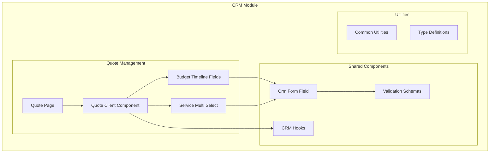

**Diagram sources**
- [page.tsx](file://app/[locale]/(routes)/crm/quote/page.tsx)
- [QuoteClientPage.tsx](file://app/[locale]/(routes)/crm/quote/_components/QuoteClientPage.tsx)
- [BudgetTimelineFields.tsx](file://app/[locale]/(routes)/crm/_components/BudgetTimelineFields.tsx)
- [ServiceMultiSelect.tsx](file://app/[locale]/(routes)/crm/_components/crm-shared/fields/ServiceMultiSelect.tsx)

**Section sources**
- [page.tsx](file://app/[locale]/(routes)/crm/quote/page.tsx)
- [QuoteClientPage.tsx](file://app/[locale]/(routes)/crm/quote/_components/QuoteClientPage.tsx)

## Core Components

The quote management system consists of several core components that work together to provide a seamless user experience:

### BudgetTimelineFields Component
This component manages project phases, cost allocation, and timeline visualization. It provides an interactive interface for defining project milestones, resource allocation, and budget distribution across different phases.

### ServiceMultiSelect Component
Handles the selection of multiple services from available options, supporting complex service combinations and conditional logic based on selected services.

### QuoteClientPage Component
The main orchestrator component that manages the overall quote generation workflow, state management, and integration with backend services.

**Section sources**
- [BudgetTimelineFields.tsx](file://app/[locale]/(routes)/crm/_components/BudgetTimelineFields.tsx)
- [ServiceMultiSelect.tsx](file://app/[locale]/(routes)/crm/_components/crm-shared/fields/ServiceMultiSelect.tsx)
- [QuoteClientPage.tsx](file://app/[locale]/(routes)/crm/quote/_components/QuoteClientPage.tsx)

## Architecture Overview

The quote management system follows a modular architecture pattern with clear separation of concerns between UI components, business logic, and data management.

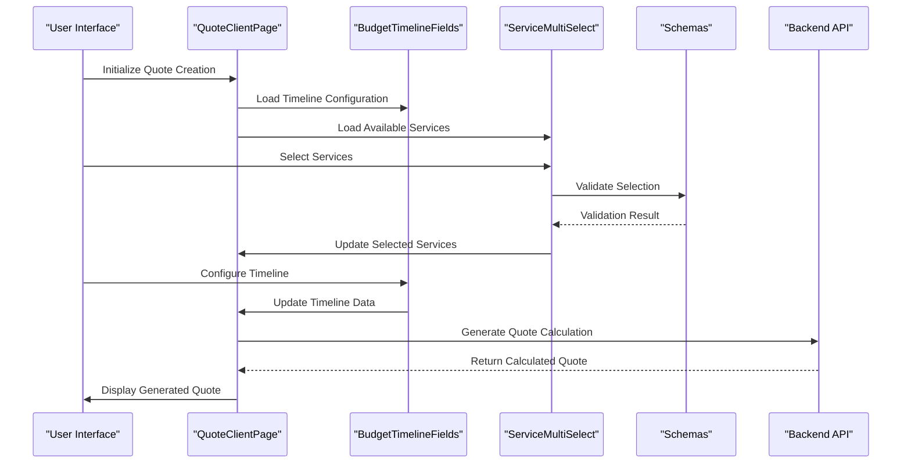

**Diagram sources**
- [QuoteClientPage.tsx](file://app/[locale]/(routes)/crm/quote/_components/QuoteClientPage.tsx)
- [BudgetTimelineFields.tsx](file://app/[locale]/(routes)/crm/_components/BudgetTimelineFields.tsx)
- [ServiceMultiSelect.tsx](file://app/[locale]/(routes)/crm/_components/crm-shared/fields/ServiceMultiSelect.tsx)
- [schemas.ts](file://app/[locale]/(routes)/crm/_components/crm-shared/fields/schemas.ts)

## Detailed Component Analysis

### BudgetTimelineFields Component

The BudgetTimelineFields component serves as the central hub for managing project phases, costs, and timeline visualization. It implements a sophisticated state management system that handles complex interactions between different project elements.

#### Key Features:
- **Dynamic Phase Management**: Add, remove, and reorder project phases
- **Cost Allocation**: Distribute budget across different phases with validation
- **Timeline Visualization**: Interactive Gantt-style timeline display
- **Resource Planning**: Assign resources to specific phases
- **Dependency Management**: Handle phase dependencies and constraints

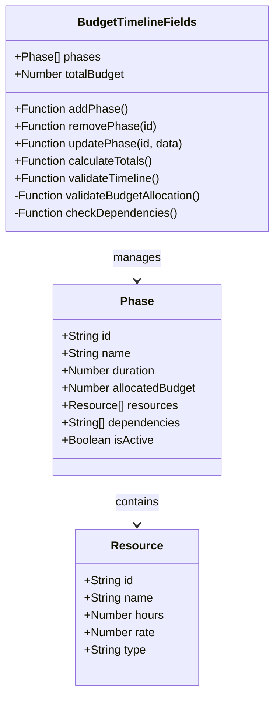

**Diagram sources**
- [BudgetTimelineFields.tsx](file://app/[locale]/(routes)/crm/_components/BudgetTimelineFields.tsx)

#### Implementation Details:
The component uses React's useState and useEffect hooks for state management, implementing complex validation logic to ensure budget consistency and timeline feasibility. It integrates with formik for form handling and provides real-time feedback to users.

**Section sources**
- [BudgetTimelineFields.tsx](file://app/[locale]/(routes)/crm/_components/BudgetTimelineFields.tsx)

### ServiceMultiSelect Component

The ServiceMultiSelect component provides a comprehensive interface for selecting and configuring multiple services. It supports complex service hierarchies, conditional availability, and dynamic pricing based on selections.

#### Key Features:
- **Hierarchical Service Tree**: Organized service categories and subcategories
- **Conditional Availability**: Services enabled/disabled based on other selections
- **Dynamic Pricing**: Real-time price updates based on configuration
- **Bulk Operations**: Select/deselect multiple services efficiently
- **Configuration Options**: Per-service customization and parameters

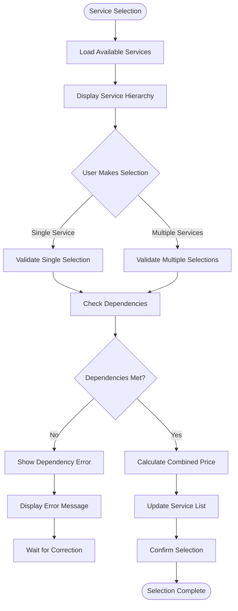

**Diagram sources**
- [ServiceMultiSelect.tsx](file://app/[locale]/(routes)/crm/_components/crm-shared/fields/ServiceMultiSelect.tsx)

**Section sources**
- [ServiceMultiSelect.tsx](file://app/[locale]/(routes)/crm/_components/crm-shared/fields/ServiceMultiSelect.tsx)

### QuoteClientPage Component

The QuoteClientPage component acts as the main orchestrator for the entire quote generation process. It manages state synchronization between all child components, handles API communication, and coordinates the overall workflow.

#### Key Responsibilities:
- **State Management**: Centralized state for all quote-related data
- **Component Coordination**: Synchronize data flow between BudgetTimelineFields and ServiceMultiSelect
- **API Integration**: Handle quote calculation and persistence operations
- **Validation Orchestration**: Coordinate validation across all form sections
- **Error Handling**: Manage and display errors from various sources

**Section sources**
- [QuoteClientPage.tsx](file://app/[locale]/(routes)/crm/quote/_components/QuoteClientPage.tsx)

## Quote Calculation Logic

The quote calculation system implements a sophisticated algorithm that processes multiple factors to generate accurate pricing. The calculation engine considers service costs, timeline complexity, resource allocation, and various modifiers.

### Calculation Flow:

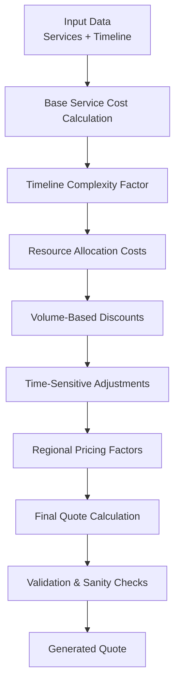

**Diagram sources**
- [QuoteClientPage.tsx](file://app/[locale]/(routes)/crm/quote/_components/QuoteClientPage.tsx)

### Calculation Components:

1. **Base Service Costs**: Individual service pricing multiplied by quantities and durations
2. **Timeline Complexity**: Additional costs for tight deadlines or complex scheduling
3. **Resource Allocation**: Labor costs based on team composition and skill levels
4. **Volume Discounts**: Tiered discount structures for large projects
5. **Time-Sensitive Adjustments**: Premium pricing for rush orders
6. **Regional Factors**: Geographic pricing adjustments

**Section sources**
- [QuoteClientPage.tsx](file://app/[locale]/(routes)/crm/quote/_components/QuoteClientPage.tsx)

## Pricing Models and Discounts

The system supports multiple pricing models to accommodate different business scenarios and client requirements.

### Supported Pricing Models:

#### Fixed Price Model
- **Description**: Total project cost agreed upon upfront
- **Use Case**: Well-defined projects with clear scope
- **Risk Distribution**: Provider bears scope risk

#### Hourly Rate Model
- **Description**: Billing based on actual time spent
- **Use Case**: Projects with uncertain scope or ongoing work
- **Risk Distribution**: Shared between provider and client

#### Value-Based Pricing
- **Description**: Pricing based on perceived value to client
- **Use Case**: High-impact projects with measurable ROI
- **Risk Distribution**: Provider benefits from efficiency

#### Hybrid Model
- **Description**: Combination of fixed and hourly pricing
- **Use Case**: Complex projects with defined and undefined components
- **Risk Distribution**: Balanced risk sharing

### Discount Structures:

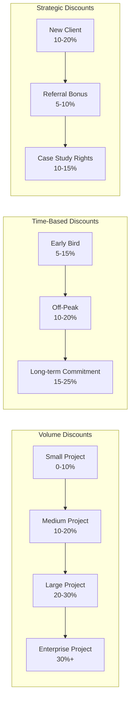

**Diagram sources**
- [QuoteClientPage.tsx](file://app/[locale]/(routes)/crm/quote/_components/QuoteClientPage.tsx)

**Section sources**
- [QuoteClientPage.tsx](file://app/[locale]/(routes)/crm/quote/_components/QuoteClientPage.tsx)

## Budget Timeline Management

The BudgetTimelineFields component provides comprehensive project timeline management with advanced features for planning and tracking.

### Timeline Features:

#### Phase Management
- **Dynamic Phases**: Create custom project phases with specific attributes
- **Duration Control**: Set realistic timelines with buffer periods
- **Dependency Mapping**: Define relationships between phases
- **Milestone Tracking**: Identify key deliverables and checkpoints

#### Cost Distribution
- **Budget Allocation**: Distribute total budget across phases proportionally
- **Resource Costing**: Include labor, materials, and overhead costs
- **Contingency Planning**: Build in contingency reserves for risks
- **Cash Flow Planning**: Schedule payments based on project milestones

#### Visual Timeline Interface
- **Gantt Chart View**: Visual representation of project schedule
- **Critical Path Analysis**: Identify timeline bottlenecks
- **Resource Loading**: Visualize resource utilization over time
- **Progress Tracking**: Monitor actual vs. planned progress

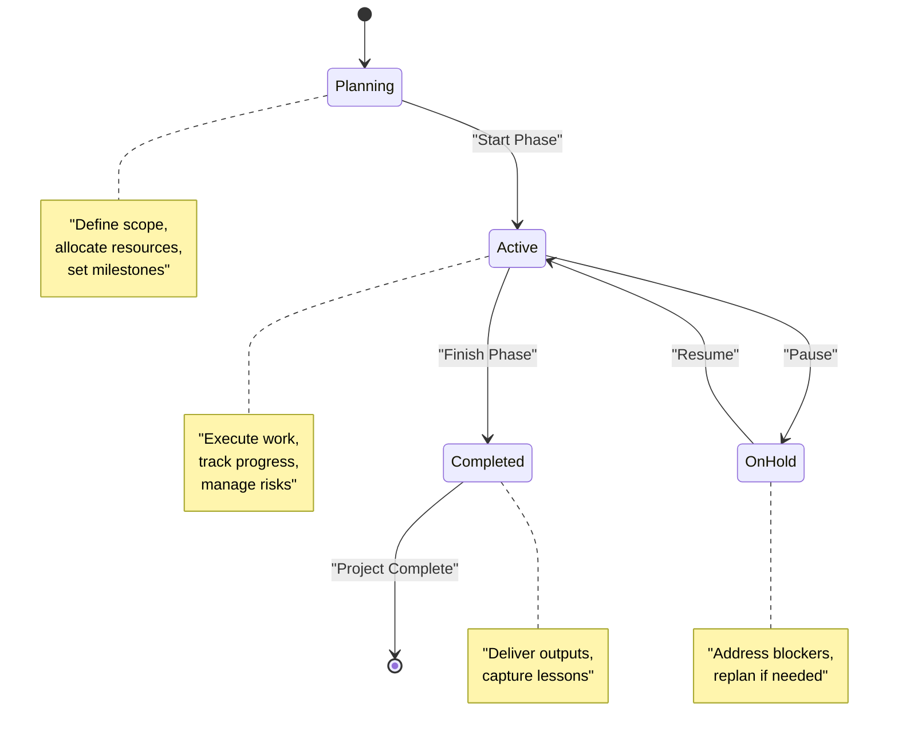

**Diagram sources**
- [BudgetTimelineFields.tsx](file://app/[locale]/(routes)/crm/_components/BudgetTimelineFields.tsx)

**Section sources**
- [BudgetTimelineFields.tsx](file://app/[locale]/(routes)/crm/_components/BudgetTimelineFields.tsx)

## Service Selection System

The ServiceMultiSelect component provides a sophisticated interface for managing complex service portfolios and their interdependencies.

### Service Catalog Structure:

#### Hierarchical Organization
- **Categories**: Broad service groupings (e.g., Development, Marketing, Design)
- **Subcategories**: Specific service types within categories
- **Individual Services**: Granular service offerings with detailed descriptions
- **Bundles**: Pre-configured service packages for common needs

#### Service Attributes:
- **Pricing Information**: Base rates, volume discounts, and special pricing
- **Duration Estimates**: Typical project timelines and effort estimates
- **Resource Requirements**: Skills, tools, and personnel needed
- **Dependencies**: Prerequisites and compatibility requirements
- **Customization Options**: Configurable parameters and add-ons

### Selection Logic:

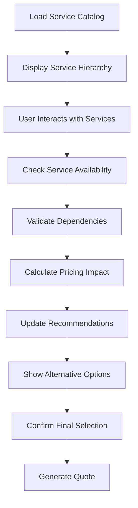

**Diagram sources**
- [ServiceMultiSelect.tsx](file://app/[locale]/(routes)/crm/_components/crm-shared/fields/ServiceMultiSelect.tsx)

**Section sources**
- [ServiceMultiSelect.tsx](file://app/[locale]/(routes)/crm/_components/crm-shared/fields/ServiceMultiSelect.tsx)

## Quote Versioning and Workflows

The system implements comprehensive version control and approval workflows to ensure quote accuracy and maintain audit trails.

### Version Control Features:

#### Automatic Versioning
- **Incremental Updates**: Each modification creates a new version
- **Change Tracking**: Detailed logs of what changed between versions
- **Comparison Tools**: Side-by-side comparison of quote versions
- **Rollback Capability**: Revert to previous versions when needed

#### Approval Workflows:
- **Multi-level Approvals**: Configure approval chains based on quote value
- **Role-based Permissions**: Restrict who can approve different quote types
- **Automated Routing**: Route quotes to appropriate approvers automatically
- **Escalation Rules**: Escalate stuck approvals after defined timeframes

### Workflow States:

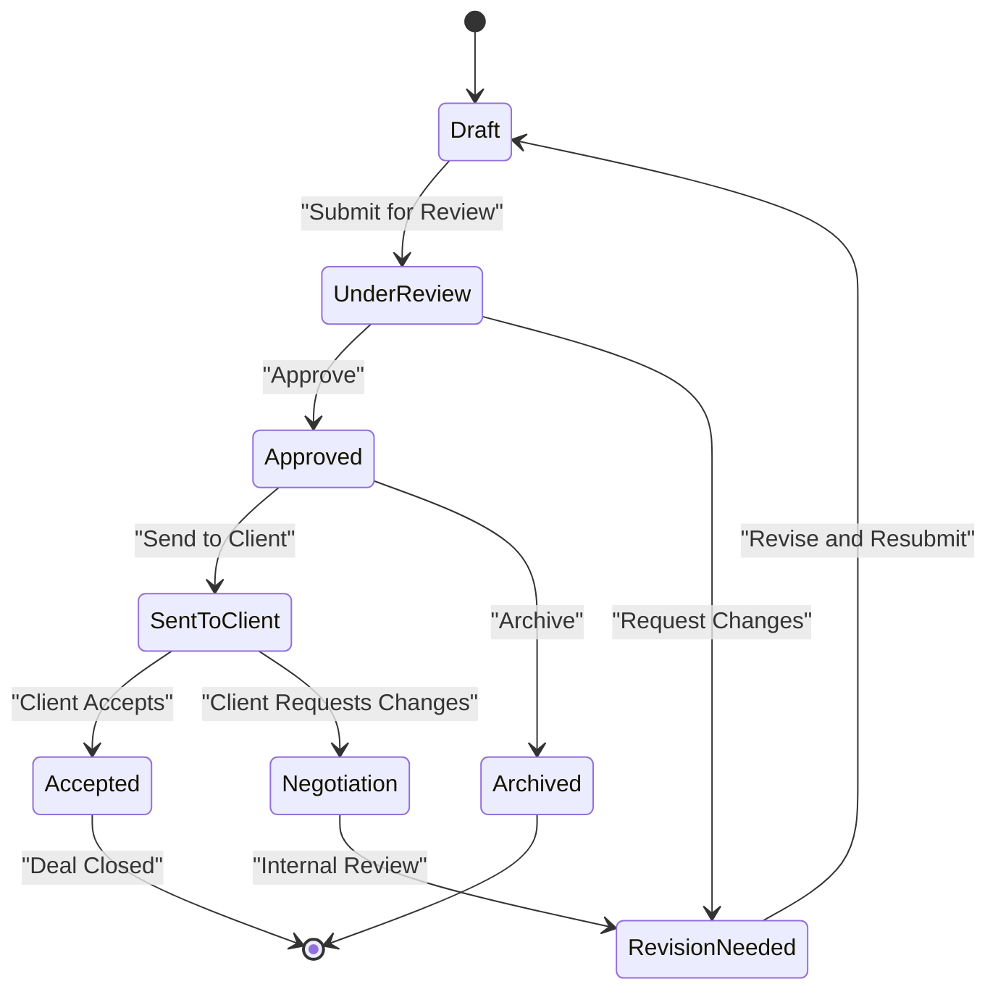

**Diagram sources**
- [QuoteClientPage.tsx](file://app/[locale]/(routes)/crm/quote/_components/QuoteClientPage.tsx)

**Section sources**
- [QuoteClientPage.tsx](file://app/[locale]/(routes)/crm/quote/_components/QuoteClientPage.tsx)

## Export Capabilities

The quote system provides multiple export formats to support different stakeholder needs and integration requirements.

### Supported Export Formats:

#### PDF Documents
- **Professional Formatting**: Branded, print-ready quote documents
- **Dynamic Content**: Auto-populated fields and calculated totals
- **Multi-page Support**: Handle complex quotes with multiple sections
- **Digital Signatures**: Support for electronic signature capture

#### Spreadsheet Formats
- **Excel/CSV Export**: Detailed breakdown for accounting systems
- **Customizable Columns**: Choose which fields to include
- **Formula Preservation**: Maintain calculations in spreadsheet format
- **Batch Export**: Export multiple quotes simultaneously

#### Web Integration
- **Shareable Links**: Secure web links for client viewing
- **Embedded Widgets**: Embed quotes in websites or portals
- **API Access**: Programmatic access for system integrations
- **Real-time Updates**: Live quote updates via web interfaces

### Export Configuration:

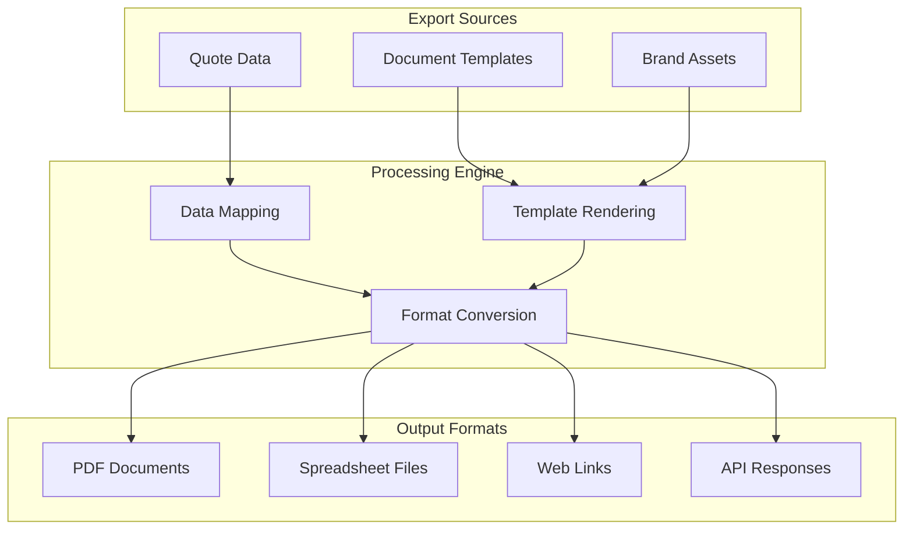

**Diagram sources**
- [QuoteClientPage.tsx](file://app/[locale]/(routes)/crm/quote/_components/QuoteClientPage.tsx)

**Section sources**
- [QuoteClientPage.tsx](file://app/[locale]/(routes)/crm/quote/_components/QuoteClientPage.tsx)

## Template Customization

The system provides extensive template customization capabilities to match brand requirements and client preferences.

### Template Structure:

#### Layout Templates
- **Header/Footer Customization**: Company branding and contact information
- **Section Organization**: Flexible arrangement of quote sections
- **Table Styling**: Customizable table layouts and formatting
- **Logo Integration**: Dynamic logo placement and sizing

#### Content Templates:
- **Service Descriptions**: Rich text templates for service explanations
- **Terms and Conditions**: Configurable legal language and clauses
- **Payment Terms**: Flexible payment schedule templates
- **Disclaimer Text**: Standard disclaimers and limitations

### Customization Interface:

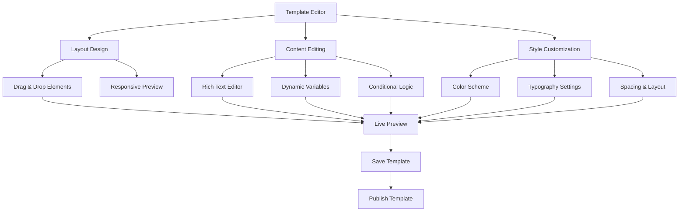

**Diagram sources**
- [QuoteClientPage.tsx](file://app/[locale]/(routes)/crm/quote/_components/QuoteClientPage.tsx)

**Section sources**
- [QuoteClientPage.tsx](file://app/[locale]/(routes)/crm/quote/_components/QuoteClientPage.tsx)

## Integration with Accounting Systems

The quote system provides robust integration capabilities with popular accounting and ERP systems to streamline financial workflows.

### Supported Integrations:

#### Direct Accounting Software
- **QuickBooks Online**: Two-way sync for invoices and payments
- **Xero**: Real-time invoice creation and status updates
- **Sage Business Cloud**: Comprehensive financial data synchronization
- **FreshBooks**: Automated billing and payment tracking

#### ERP Systems:
- **SAP Business One**: Enterprise resource planning integration
- **Oracle NetSuite**: Advanced financial management sync
- **Microsoft Dynamics 365**: Integrated business applications
- **Infor M3**: Manufacturing-specific ERP integration

#### Payment Processing:
- **Stripe**: Online payment collection and subscription management
- **PayPal**: Global payment processing and invoicing
- **Square**: Point-of-sale and online payment integration
- **Authorize.Net**: Credit card processing and recurring billing

### Integration Architecture:

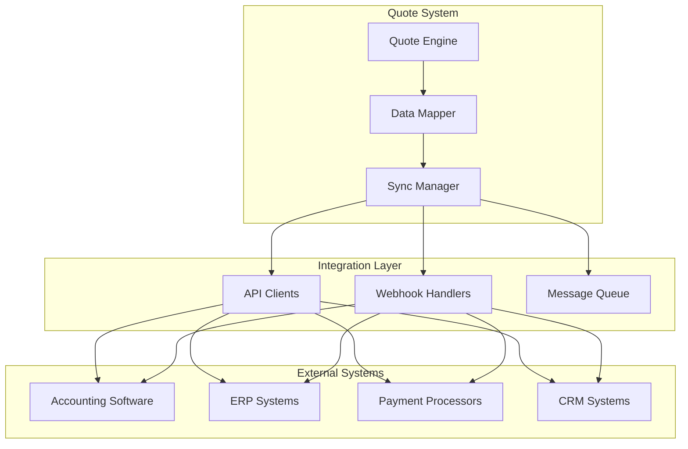

**Diagram sources**
- [QuoteClientPage.tsx](file://app/[locale]/(routes)/crm/quote/_components/QuoteClientPage.tsx)

**Section sources**
- [QuoteClientPage.tsx](file://app/[locale]/(routes)/crm/quote/_components/QuoteClientPage.tsx)

## Data Persistence

The quote system implements comprehensive data persistence strategies to ensure data integrity, performance, and scalability.

### Database Schema:

#### Core Tables:
- **Quotes**: Main quote records with metadata and status
- **QuoteItems**: Individual line items and services
- **QuoteVersions**: Historical versions for audit trails
- **Clients**: Client information and preferences
- **Projects**: Associated project details and timelines

#### Relationship Mapping:

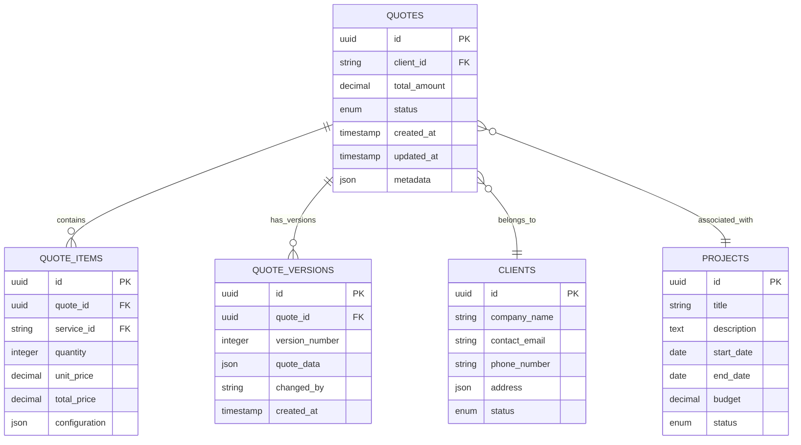

**Diagram sources**
- [QuoteClientPage.tsx](file://app/[locale]/(routes)/crm/quote/_components/QuoteClientPage.tsx)

### Data Strategy:

#### Caching Layer:
- **Redis Cache**: Hot data caching for frequently accessed quotes
- **CDN Integration**: Static asset caching for improved performance
- **Query Optimization**: Intelligent query caching based on access patterns

#### Backup and Recovery:
- **Automated Backups**: Daily incremental and weekly full backups
- **Point-in-time Recovery**: Restore to any point in time
- **Disaster Recovery**: Multi-region backup and failover capabilities

**Section sources**
- [QuoteClientPage.tsx](file://app/[locale]/(routes)/crm/quote/_components/QuoteClientPage.tsx)

## Quote Sharing and Collaboration

The system provides comprehensive collaboration features to facilitate teamwork and client engagement throughout the quote lifecycle.

### Internal Collaboration:

#### Team Features:
- **Comment Threads**: Contextual discussions attached to specific quote sections
- **Task Assignment**: Delegate quote preparation and review tasks
- **Activity Logs**: Track all changes and interactions
- **Notification System**: Real-time alerts for important updates

#### Permission Management:
- **Role-based Access**: Granular permissions for different team roles
- **Department Isolation**: Separate views for different business units
- **Audit Trails**: Complete history of who accessed and modified quotes

### Client Collaboration:

#### Client Portal:
- **Secure Access**: Client-specific login and dashboard
- **Quote Viewing**: Read-only access to approved quotes
- **Feedback Collection**: Structured feedback forms and comment threads
- **Approval Workflows**: Digital signature and approval processes

#### Communication Tools:
- **Email Integration**: Automated email notifications and updates
- **Video Conferencing**: Embedded meeting scheduling and recording
- **Document Sharing**: Secure file exchange for additional materials
- **Chat Integration**: Real-time messaging for quick questions

### Collaboration Workflow:

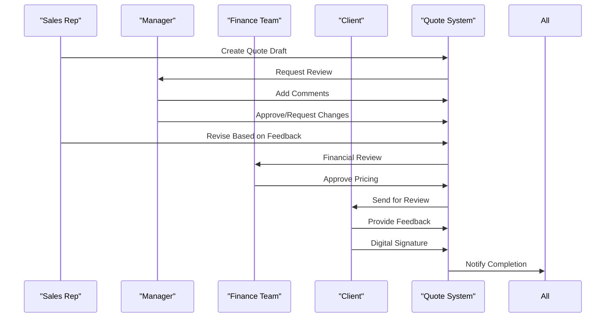

**Diagram sources**
- [QuoteClientPage.tsx](file://app/[locale]/(routes)/crm/quote/_components/QuoteClientPage.tsx)

**Section sources**
- [QuoteClientPage.tsx](file://app/[locale]/(routes)/crm/quote/_components/QuoteClientPage.tsx)

## Performance Considerations

The quote management system is optimized for performance and scalability to handle high-volume usage and complex calculations.

### Optimization Strategies:

#### Frontend Performance:
- **Lazy Loading**: Load heavy components only when needed
- **Virtual Scrolling**: Efficient rendering of large service lists
- **Memoization**: Cache expensive calculations and computations
- **Bundle Optimization**: Code splitting and tree shaking

#### Backend Performance:
- **Database Indexing**: Optimized queries and indexing strategies
- **Connection Pooling**: Efficient database connection management
- **Asynchronous Processing**: Background job processing for heavy tasks
- **API Rate Limiting**: Prevent abuse and ensure fair usage

### Scalability Features:

#### Horizontal Scaling:
- **Load Balancing**: Distribute traffic across multiple instances
- **Stateless Design**: Enable easy horizontal scaling
- **Microservices Architecture**: Independent scaling of components
- **Container Orchestration**: Kubernetes-based deployment and scaling

#### Caching Strategy:
- **Multi-level Caching**: Browser, CDN, application, and database caching
- **Cache Invalidation**: Smart cache invalidation based on data changes
- **Cache Warming**: Pre-populate caches for frequently accessed data
- **Cache Monitoring**: Track cache hit rates and performance metrics

**Section sources**
- [QuoteClientPage.tsx](file://app/[locale]/(routes)/crm/quote/_components/QuoteClientPage.tsx)

## Troubleshooting Guide

Common issues and their solutions for the quote management system.

### Common Issues:

#### Calculation Errors:
- **Symptom**: Incorrect quote totals or pricing
- **Cause**: Invalid input data or calculation logic errors
- **Solution**: Validate inputs, check calculation formulas, review error logs

#### Performance Problems:
- **Symptom**: Slow quote generation or page loading
- **Cause**: Large datasets, inefficient queries, or resource constraints
- **Solution**: Optimize queries, implement caching, scale resources

#### Integration Failures:
- **Symptom**: Failed exports or sync errors
- **Cause**: API authentication issues, network problems, or data format mismatches
- **Solution**: Check credentials, verify API endpoints, validate data formats

### Debugging Tools:

#### Logging and Monitoring:
- **Application Logs**: Detailed request/response logging
- **Performance Metrics**: Response times and resource usage tracking
- **Error Tracking**: Centralized error collection and analysis
- **User Analytics**: Usage patterns and feature adoption metrics

#### Diagnostic Utilities:
- **Quote Validator**: Standalone tool for validating quote data
- **Performance Profiler**: Identify bottlenecks in quote generation
- **Integration Tester**: Test external system connectivity
- **Data Migration Tool**: Safe data transformation utilities

**Section sources**
- [QuoteClientPage.tsx](file://app/[locale]/(routes)/crm/quote/_components/QuoteClientPage.tsx)

## Conclusion

The Quote Management System provides a comprehensive solution for creating, managing, and delivering professional quotes. Its modular architecture, advanced calculation engine, and extensive customization options make it suitable for businesses of all sizes.

Key strengths include:
- **Flexible Pricing Models**: Support for multiple pricing strategies
- **Advanced Timeline Management**: Sophisticated project planning capabilities
- **Robust Integration**: Seamless connectivity with accounting and ERP systems
- **Collaborative Features**: Enhanced teamwork and client engagement
- **Scalable Architecture**: Built to handle growth and increased complexity

The system's extensible design allows for easy customization and adaptation to specific business needs, while maintaining high performance and reliability standards. With comprehensive documentation and robust troubleshooting tools, teams can quickly adopt and optimize the system for their quote management workflows.