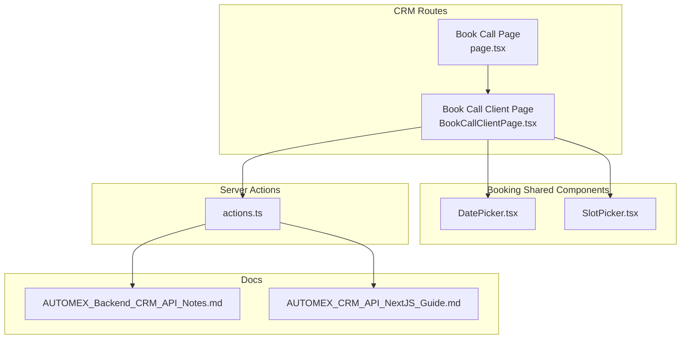
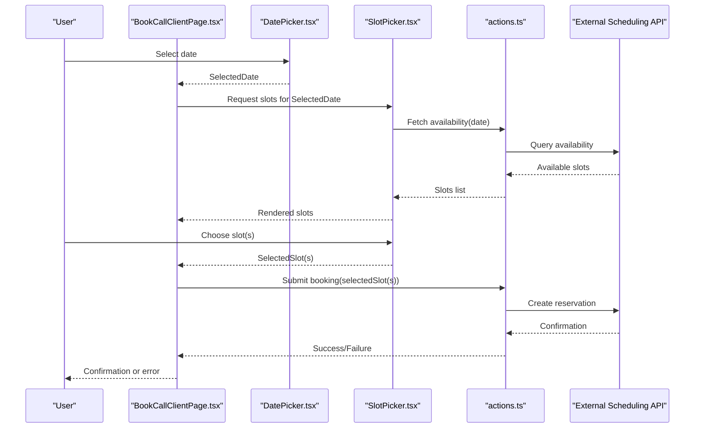
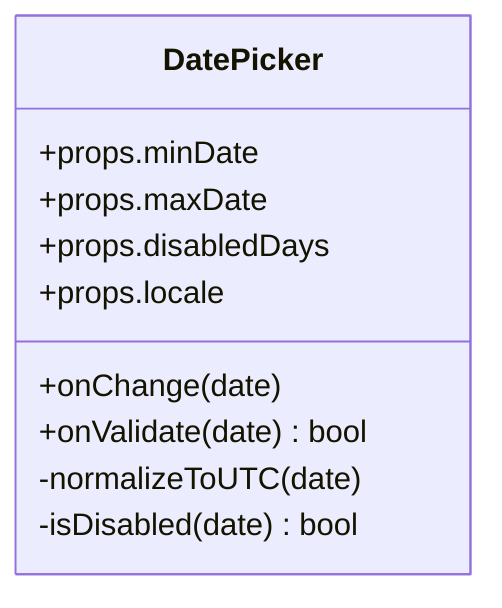
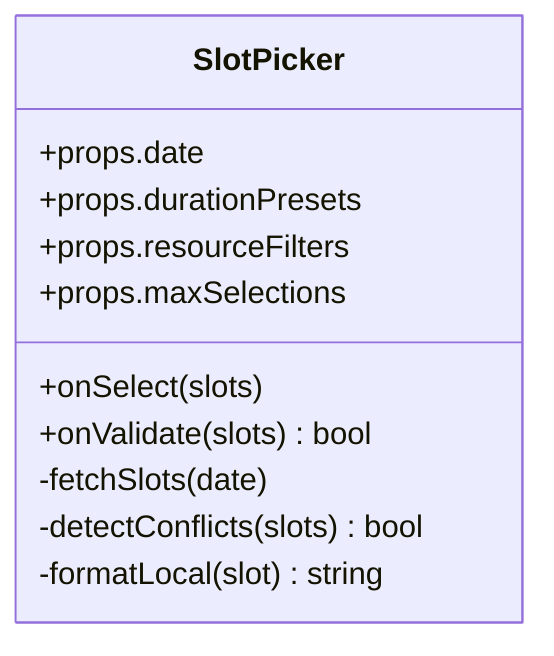
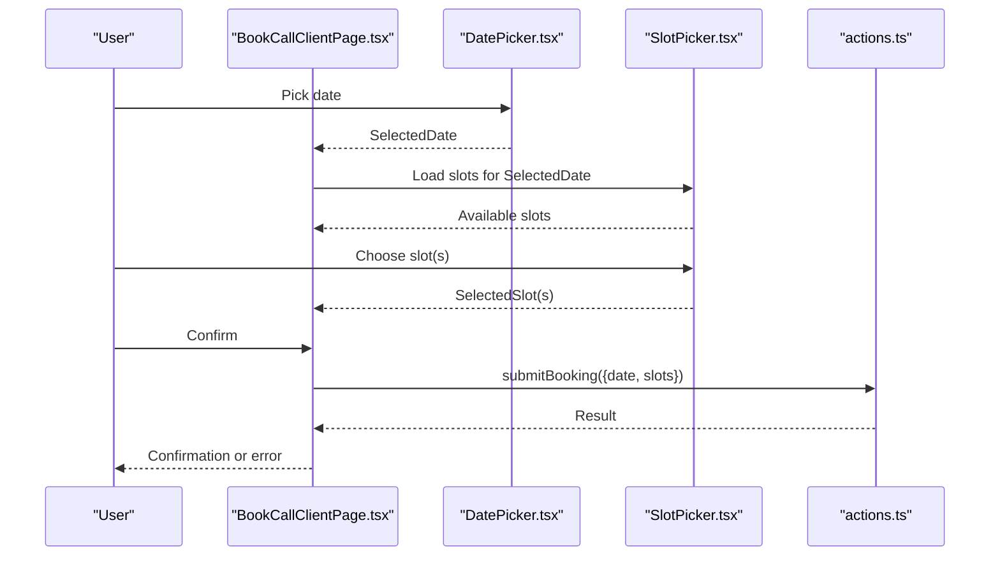
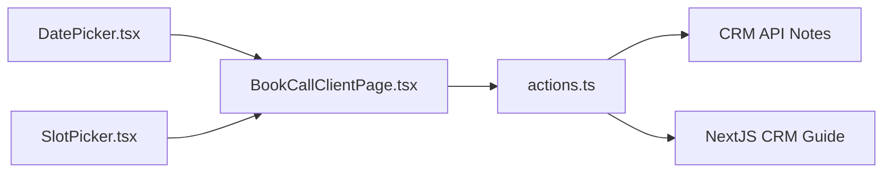

# Service Booking System

<cite>
**Referenced Files in This Document**
- [DatePicker.tsx](file://app/[locale]/(routes)/crm/_components/crm-shared/booking/DatePicker.tsx)
- [SlotPicker.tsx](file://app/[locale]/(routes)/crm/_components/crm-shared/booking/SlotPicker.tsx)
- [BookCallClientPage.tsx](file://app/[locale]/(routes)/crm/book-a-call/_components/BookCallClientPage.tsx)
- [book-a-call page.tsx](file://app/[locale]/(routes)/crm/book-a-call/page.tsx)
- [actions.ts](file://app/[locale]/(routes)/crm/actions.ts)
- [CRM API Notes](file://doc/AUTOMEX_Backend_CRM_API_Notes.md)
- [NextJS CRM Guide](file://doc/AUTOMEX_CRM_API_NextJS_Guide.md)
</cite>

## Table of Contents
1. [Introduction](#introduction)
2. [Project Structure](#project-structure)
3. [Core Components](#core-components)
4. [Architecture Overview](#architecture-overview)
5. [Detailed Component Analysis](#detailed-component-analysis)
6. [Dependency Analysis](#dependency-analysis)
7. [Performance Considerations](#performance-considerations)
8. [Troubleshooting Guide](#troubleshooting-guide)
9. [Conclusion](#conclusion)
10. [Appendices](#appendices)

## Introduction
This document explains the service booking system with a focus on calendar integration, date selection, and time slot management. It covers the end-to-end workflow from service selection to confirmation, details the DatePicker and SlotPicker components, and provides guidance for timezone handling, availability checking, conflict resolution, external scheduling API integration, custom booking rules, user experience best practices, and mobile responsiveness.

## Project Structure
The booking feature is implemented under the CRM routes and includes:
- A client page orchestrating the multi-step booking flow
- Reusable UI components for selecting dates and time slots
- Server actions for persisting bookings and interacting with backend services
- Documentation describing CRM APIs and Next.js integration patterns

**Diagram sources**
- [book-a-call page.tsx](file://app/[locale]/(routes)/crm/book-a-call/page.tsx)
- [BookCallClientPage.tsx](file://app/[locale]/(routes)/crm/book-a-call/_components/BookCallClientPage.tsx)
- [DatePicker.tsx](file://app/[locale]/(routes)/crm/_components/crm-shared/booking/DatePicker.tsx)
- [SlotPicker.tsx](file://app/[locale]/(routes)/crm/_components/crm-shared/booking/SlotPicker.tsx)
- [actions.ts](file://app/[locale]/(routes)/crm/actions.ts)
- [CRM API Notes](file://doc/AUTOMEX_Backend_CRM_API_Notes.md)
- [NextJS CRM Guide](file://doc/AUTOMEX_CRM_API_NextJS_Guide.md)

**Section sources**
- [book-a-call page.tsx](file://app/[locale]/(routes)/crm/book-a-call/page.tsx)
- [BookCallClientPage.tsx](file://app/[locale]/(routes)/crm/book-a-call/_components/BookCallClientPage.tsx)
- [DatePicker.tsx](file://app/[locale]/(routes)/crm/_components/crm-shared/booking/DatePicker.tsx)
- [SlotPicker.tsx](file://app/[locale]/(routes)/crm/_components/crm-shared/booking/SlotPicker.tsx)
- [actions.ts](file://app/[locale]/(routes)/crm/actions.ts)
- [CRM API Notes](file://doc/AUTOMEX_Backend_CRM_API_Notes.md)
- [NextJS CRM Guide](file://doc/AUTOMEX_CRM_API_NextJS_Guide.md)

## Core Components
- DatePicker: Renders a calendar interface for choosing a valid date within configured constraints (e.g., min/max range, disabled days). It normalizes selections to a consistent format and exposes callbacks for validation and side effects.
- SlotPicker: Displays available time slots for the selected date, supports filtering by duration or resource, highlights conflicts, and allows single or multiple slot selection depending on configuration.
- Book Call Client Page: Orchestrates the multi-step booking process, manages local state, validates inputs, and calls server actions to finalize the booking.

Key responsibilities:
- Date normalization and constraint enforcement
- Time slot availability retrieval and rendering
- Conflict detection and prevention
- Integration with server-side persistence and scheduling systems

**Section sources**
- [DatePicker.tsx](file://app/[locale]/(routes)/crm/_components/crm-shared/booking/DatePicker.tsx)
- [SlotPicker.tsx](file://app/[locale]/(routes)/crm/_components/crm-shared/booking/SlotPicker.tsx)
- [BookCallClientPage.tsx](file://app/[locale]/(routes)/crm/book-a-call/_components/BookCallClientPage.tsx)

## Architecture Overview
The booking architecture follows a client-server pattern:
- The client page composes DatePicker and SlotPicker to capture user intent
- Server actions handle business logic, availability checks, and persistence
- External scheduling APIs are invoked via server endpoints to synchronize calendars and enforce global constraints

**Diagram sources**
- [BookCallClientPage.tsx](file://app/[locale]/(routes)/crm/book-a-call/_components/BookCallClientPage.tsx)
- [DatePicker.tsx](file://app/[locale]/(routes)/crm/_components/crm-shared/booking/DatePicker.tsx)
- [SlotPicker.tsx](file://app/[locale]/(routes)/crm/_components/crm-shared/booking/SlotPicker.tsx)
- [actions.ts](file://app/[locale]/(routes)/crm/actions.ts)
- [CRM API Notes](file://doc/AUTOMEX_Backend_CRM_API_Notes.md)
- [NextJS CRM Guide](file://doc/AUTOMEX_CRM_API_NextJS_Guide.md)

## Detailed Component Analysis

### DatePicker
Responsibilities:
- Enforce date constraints (min/max, disabled days)
- Normalize timezone-aware dates
- Provide keyboard and screen reader accessibility
- Emit events when the selected date changes

Configuration options typically include:
- Min/max date boundaries
- Disabled day predicates (holidays, weekends)
- Locale formatting preferences
- Callbacks for onChange and onValidate

Customization capabilities:
- Override rendering of individual cells
- Inject custom styles through props
- Integrate with third-party calendar libraries if needed

Timezone handling:
- Convert user-selected dates to UTC before sending to server
- Display dates in the user’s local timezone while preserving UTC semantics

Availability integration:
- Trigger slot fetching after a valid date is chosen
- Debounce rapid date changes to avoid excessive requests

Conflict resolution:
- Prevent selection of dates that fall outside business hours or are fully booked
- Show clear feedback for invalid selections

Mobile responsiveness:
- Use touch-friendly controls and larger hit areas
- Collapse navigation arrows into swipe gestures where appropriate

**Section sources**
- [DatePicker.tsx](file://app/[locale]/(routes)/crm/_components/crm-shared/booking/DatePicker.tsx)

#### Class-like structure overview

**Diagram sources**
- [DatePicker.tsx](file://app/[locale]/(routes)/crm/_components/crm-shared/booking/DatePicker.tsx)

### SlotPicker
Responsibilities:
- Retrieve and render available time slots for a given date
- Support filtering by duration or resource
- Highlight conflicts and prevent double-booking
- Allow single or multiple slot selection based on configuration

Configuration options typically include:
- Duration presets
- Resource filters
- Max selections per booking
- Custom slot label formatter

Customization capabilities:
- Override slot cell rendering
- Add tooltips or badges for special conditions
- Integrate with calendar providers for drag-and-drop rescheduling

Timezone handling:
- Present slots in the user’s local timezone
- Validate against server-provided UTC times

Availability integration:
- Fetch slots from server actions upon date change
- Refresh slots when filters change

Conflict resolution:
- Detect overlapping selections locally and reject invalid combinations
- Re-validate on each selection change

Mobile responsiveness:
- Stack slots vertically on small screens
- Enable horizontal scrolling for dense slot lists

**Section sources**
- [SlotPicker.tsx](file://app/[locale]/(routes)/crm/_components/crm-shared/booking/SlotPicker.tsx)

#### Class-like structure overview

**Diagram sources**
- [SlotPicker.tsx](file://app/[locale]/(routes)/crm/_components/crm-shared/booking/SlotPicker.tsx)

### Book Call Client Page
Responsibilities:
- Orchestrate the multi-step booking flow
- Manage local state for selected date and slots
- Validate inputs and display errors
- Invoke server actions to submit the booking
- Handle success and failure states

Workflow steps:
1. Service selection (if applicable)
2. Date selection via DatePicker
3. Slot selection via SlotPicker
4. Review and confirm
5. Submission via server action
6. Confirmation or retry on failure

UX considerations:
- Clear progress indicators
- Inline validation messages
- Accessible labels and instructions
- Mobile-first layout with responsive grids

**Section sources**
- [BookCallClientPage.tsx](file://app/[locale]/(routes)/crm/book-a-call/_components/BookCallClientPage.tsx)

#### Sequence diagram for booking submission

**Diagram sources**
- [BookCallClientPage.tsx](file://app/[locale]/(routes)/crm/book-a-call/_components/BookCallClientPage.tsx)
- [DatePicker.tsx](file://app/[locale]/(routes)/crm/_components/crm-shared/booking/DatePicker.tsx)
- [SlotPicker.tsx](file://app/[locale]/(routes)/crm/_components/crm-shared/booking/SlotPicker.tsx)
- [actions.ts](file://app/[locale]/(routes)/crm/actions.ts)

## Dependency Analysis
- Client components depend on server actions for availability and persistence
- Server actions encapsulate business rules and external API calls
- Documentation files define contracts and integration patterns used by server actions

**Diagram sources**
- [DatePicker.tsx](file://app/[locale]/(routes)/crm/_components/crm-shared/booking/DatePicker.tsx)
- [SlotPicker.tsx](file://app/[locale]/(routes)/crm/_components/crm-shared/booking/SlotPicker.tsx)
- [BookCallClientPage.tsx](file://app/[locale]/(routes)/crm/book-a-call/_components/BookCallClientPage.tsx)
- [actions.ts](file://app/[locale]/(routes)/crm/actions.ts)
- [CRM API Notes](file://doc/AUTOMEX_Backend_CRM_API_Notes.md)
- [NextJS CRM Guide](file://doc/AUTOMEX_CRM_API_NextJS_Guide.md)

**Section sources**
- [DatePicker.tsx](file://app/[locale]/(routes)/crm/_components/crm-shared/booking/DatePicker.tsx)
- [SlotPicker.tsx](file://app/[locale]/(routes)/crm/_components/crm-shared/booking/SlotPicker.tsx)
- [BookCallClientPage.tsx](file://app/[locale]/(routes)/crm/book-a-call/_components/BookCallClientPage.tsx)
- [actions.ts](file://app/[locale]/(routes)/crm/actions.ts)
- [CRM API Notes](file://doc/AUTOMEX_Backend_CRM_API_Notes.md)
- [NextJS CRM Guide](file://doc/AUTOMEX_CRM_API_NextJS_Guide.md)

## Performance Considerations
- Debounce date changes and filter updates to reduce network requests
- Cache availability results per date and filter combination
- Lazy-load slot lists and paginate large sets
- Optimize re-renders by memoizing derived data and stable props
- Prefer server-side validation to minimize round-trips

[No sources needed since this section provides general guidance]

## Troubleshooting Guide
Common issues and resolutions:
- Timezone mismatches: Ensure all dates are normalized to UTC before server submission and displayed in local time on the client
- Availability not updating: Verify server action responses and cache invalidation strategies
- Conflicting selections: Implement robust conflict detection both client-side and server-side
- Network failures: Surface actionable errors and provide retry mechanisms
- Accessibility problems: Validate keyboard navigation and screen reader announcements

**Section sources**
- [actions.ts](file://app/[locale]/(routes)/crm/actions.ts)
- [BookCallClientPage.tsx](file://app/[locale]/(routes)/crm/book-a-call/_components/BookCallClientPage.tsx)

## Conclusion
The service booking system combines reusable DatePicker and SlotPicker components with a client orchestration layer and server actions to deliver a robust, accessible, and responsive booking experience. By adhering to timezone best practices, implementing strong availability and conflict checks, and following UX guidelines for multi-step flows, teams can integrate seamlessly with external scheduling APIs and customize booking rules to meet diverse business needs.

[No sources needed since this section summarizes without analyzing specific files]

## Appendices

### Integrating with External Scheduling APIs
- Use server actions to call external APIs for availability and reservations
- Follow documented endpoint contracts and authentication schemes
- Map external calendar IDs and resources to internal identifiers
- Handle rate limits and retries gracefully

**Section sources**
- [actions.ts](file://app/[locale]/(routes)/crm/actions.ts)
- [CRM API Notes](file://doc/AUTOMEX_Backend_CRM_API_Notes.md)
- [NextJS CRM Guide](file://doc/AUTOMEX_CRM_API_NextJS_Guide.md)

### Implementing Custom Booking Rules
- Define rule functions for business constraints (e.g., minimum notice, max duration)
- Apply rules during slot generation and at submission time
- Surface rule violations to users with clear messaging
- Test edge cases around daylight saving transitions and cross-timezone scenarios

**Section sources**
- [actions.ts](file://app/[locale]/(routes)/crm/actions.ts)
- [BookCallClientPage.tsx](file://app/[locale]/(routes)/crm/book-a-call/_components/BookCallClientPage.tsx)

### User Experience Considerations
- Multi-step clarity: Progress indicators, back navigation, and saved state
- Mobile responsiveness: Touch targets, collapsible panels, and scrollable slot lists
- Accessibility: ARIA attributes, semantic HTML, and keyboard support
- Error handling: Inline validation, descriptive messages, and recovery paths

**Section sources**
- [BookCallClientPage.tsx](file://app/[locale]/(routes)/crm/book-a-call/_components/BookCallClientPage.tsx)
- [DatePicker.tsx](file://app/[locale]/(routes)/crm/_components/crm-shared/booking/DatePicker.tsx)
- [SlotPicker.tsx](file://app/[locale]/(routes)/crm/_components/crm-shared/booking/SlotPicker.tsx)