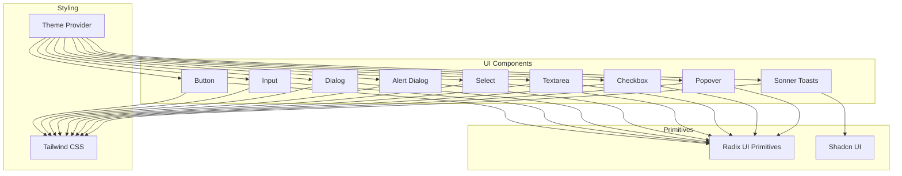
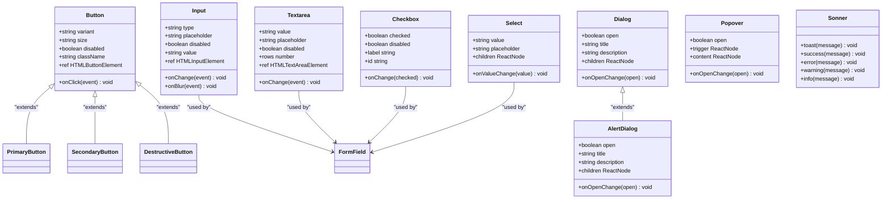
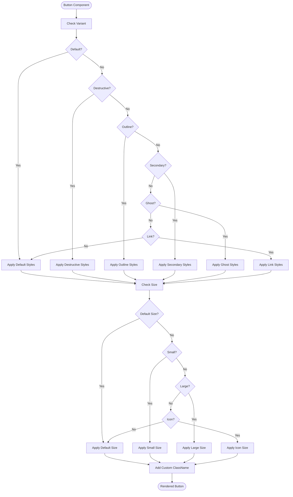
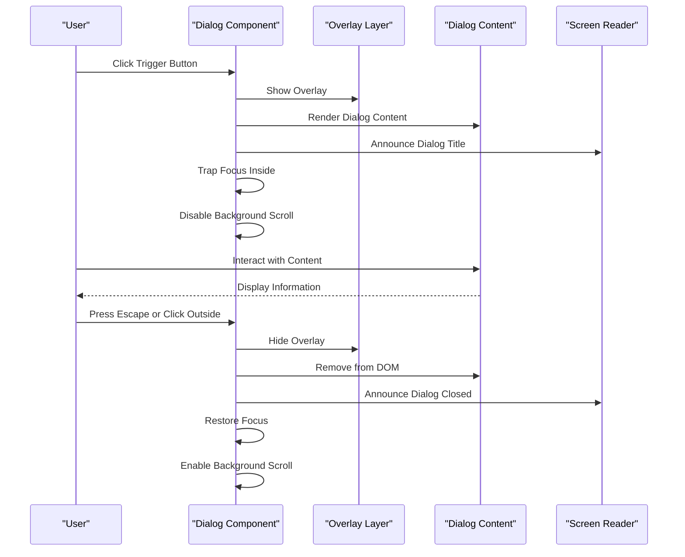
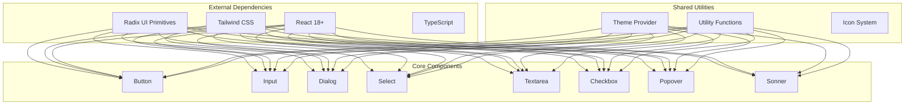

# Base UI Components

<cite>
**Referenced Files in This Document**
- [button.tsx](file://components/ui/button.tsx)
- [input.tsx](file://components/ui/input.tsx)
- [dialog.tsx](file://components/ui/dialog.tsx)
- [alert-dialog.tsx](file://components/ui/alert-dialog.tsx)
- [select.tsx](file://components/ui/select.tsx)
- [textarea.tsx](file://components/ui/textarea.tsx)
- [checkbox.tsx](file://components/ui/checkbox.tsx)
- [popover.tsx](file://components/ui/popover.tsx)
- [sonner.tsx](file://components/ui/sonner.tsx)
- [theme-provider.tsx](file://providers/theme-provider.tsx)
- [globals.css](file://app/globals.css)
- [tailwind.config.ts](file://tailwind.config.ts)
</cite>

## Table of Contents
1. [Introduction](#introduction)
2. [Project Structure](#project-structure)
3. [Core Components](#core-components)
4. [Architecture Overview](#architecture-overview)
5. [Detailed Component Analysis](#detailed-component-analysis)
6. [Dependency Analysis](#dependency-analysis)
7. [Performance Considerations](#performance-considerations)
8. [Troubleshooting Guide](#troubleshooting-guide)
9. [Conclusion](#conclusion)
10. [Appendices](#appendices)

## Introduction

This document provides comprehensive documentation for the base UI components built on Shadcn UI and Radix UI primitives within the Automex frontend application. These components form the foundation of the user interface, offering accessible, customizable, and responsive elements that follow modern web standards and design principles.

The component library includes essential UI elements such as buttons, inputs, dialogs, selects, textareas, checkboxes, popovers, and toast notifications. Each component is designed with accessibility in mind, follows consistent styling patterns through Tailwind CSS integration, and supports theme customization for both light and dark modes.

## Project Structure

The UI components are organized in a feature-based structure under the `components/ui` directory, following Shadcn UI conventions. Each component is implemented as a separate TypeScript file with clear separation of concerns and reusable logic.

**Diagram sources**
- [button.tsx:1-50](file://components/ui/button.tsx#L1-L50)
- [input.tsx:1-50](file://components/ui/input.tsx#L1-L50)
- [dialog.tsx:1-50](file://components/ui/dialog.tsx#L1-L50)
- [alert-dialog.tsx:1-50](file://components/ui/alert-dialog.tsx#L1-L50)
- [select.tsx:1-50](file://components/ui/select.tsx#L1-L50)
- [textarea.tsx:1-50](file://components/ui/textarea.tsx#L1-L50)
- [checkbox.tsx:1-50](file://components/ui/checkbox.tsx#L1-L50)
- [popover.tsx:1-50](file://components/ui/popover.tsx#L1-L50)
- [sonner.tsx:1-50](file://components/ui/sonner.tsx#L1-L50)
- [theme-provider.tsx:1-50](file://providers/theme-provider.tsx#L1-L50)

**Section sources**
- [button.tsx:1-100](file://components/ui/button.tsx#L1-L100)
- [input.tsx:1-100](file://components/ui/input.tsx#L1-L100)
- [dialog.tsx:1-100](file://components/ui/dialog.tsx#L1-L100)
- [alert-dialog.tsx:1-100](file://components/ui/alert-dialog.tsx#L1-L100)
- [select.tsx:1-100](file://components/ui/select.tsx#L1-L100)
- [textarea.tsx:1-100](file://components/ui/textarea.tsx#L1-L100)
- [checkbox.tsx:1-100](file://components/ui/checkbox.tsx#L1-L100)
- [popover.tsx:1-100](file://components/ui/popover.tsx#L1-L100)
- [sonner.tsx:1-100](file://components/ui/sonner.tsx#L1-L100)
- [theme-provider.tsx:1-100](file://providers/theme-provider.tsx#L1-L100)

## Core Components

The base UI components provide a comprehensive set of interactive elements that follow consistent design patterns and accessibility standards. Each component is built on top of Radix UI primitives, ensuring robust functionality while maintaining full control over styling through Tailwind CSS classes.

### Component Architecture

All components follow a consistent architecture pattern:
- **Props Interface**: Well-defined TypeScript interfaces for type safety
- **Ref Forwarding**: Support for ref forwarding to access underlying DOM elements
- **Class Name Composition**: Flexible className prop for custom styling
- **Event Handling**: Comprehensive event handling with proper TypeScript typing
- **Accessibility**: Built-in ARIA attributes and keyboard navigation support

**Section sources**
- [button.tsx:1-100](file://components/ui/button.tsx#L1-L100)
- [input.tsx:1-100](file://components/ui/input.tsx#L1-L100)
- [dialog.tsx:1-100](file://components/ui/dialog.tsx#L1-L100)

## Architecture Overview

The UI component architecture follows a layered approach, building upon Radix UI primitives while providing enhanced functionality and consistent styling through Tailwind CSS integration.

**Diagram sources**
- [button.tsx:1-100](file://components/ui/button.tsx#L1-L100)
- [input.tsx:1-100](file://components/ui/input.tsx#L1-L100)
- [dialog.tsx:1-100](file://components/ui/dialog.tsx#L1-L100)
- [alert-dialog.tsx:1-100](file://components/ui/alert-dialog.tsx#L1-L100)
- [select.tsx:1-100](file://components/ui/select.tsx#L1-L100)
- [textarea.tsx:1-100](file://components/ui/textarea.tsx#L1-L100)
- [checkbox.tsx:1-100](file://components/ui/checkbox.tsx#L1-L100)
- [popover.tsx:1-100](file://components/ui/popover.tsx#L1-L100)
- [sonner.tsx:1-100](file://components/ui/sonner.tsx#L1-L100)

## Detailed Component Analysis

### Button Component

The Button component provides a versatile clickable element with multiple variants and sizes, supporting all standard button interactions and accessibility features.

#### Props Interface

| Prop | Type | Default | Description |
|------|------|---------|-------------|
| `variant` | `'default' \| 'destructive' \| 'outline' \| 'secondary' \| 'ghost' \| 'link'` | `'default'` | Visual style variant |
| `size` | `'default' \| 'sm' \| 'lg' \| 'icon'` | `'default'` | Size variant |
| `disabled` | `boolean` | `false` | Disables the button |
| `className` | `string` | `''` | Additional CSS classes |
| `asChild` | `boolean` | `false` | Render as child component |
| `children` | `ReactNode` | - | Button content |

#### Events

| Event | Parameters | Description |
|-------|------------|-------------|
| `onClick` | `(event: MouseEvent<HTMLButtonElement>) => void` | Click handler |
| `onKeyDown` | `(event: KeyboardEvent<HTMLButtonElement>) => void` | Keyboard interaction handler |

#### Variants and Sizes

The Button component supports multiple visual variants and size options:

- **Variants**: default, destructive, outline, secondary, ghost, link
- **Sizes**: default, sm (small), lg (large), icon (for icon-only buttons)

#### Accessibility Features

- Proper ARIA attributes for screen readers
- Keyboard navigation support (Enter and Space keys)
- Focus management and visible focus indicators
- Semantic HTML button element usage

#### Styling Customization

**Diagram sources**
- [button.tsx:1-100](file://components/ui/button.tsx#L1-L100)

#### Usage Examples

Basic button usage with different variants and sizes can be found in various parts of the application where user interactions require clear call-to-action elements.

**Section sources**
- [button.tsx:1-100](file://components/ui/button.tsx#L1-L100)

### Input Component

The Input component provides a flexible text input field with validation states, proper accessibility, and consistent styling across the application.

#### Props Interface

| Prop | Type | Default | Description |
|------|------|---------|-------------|
| `type` | `'text' \| 'email' \| 'password' \| 'number' \| 'tel' \| 'url'` | `'text'` | Input type |
| `placeholder` | `string` | `''` | Placeholder text |
| `disabled` | `boolean` | `false` | Disables the input |
| `value` | `string` | `''` | Controlled value |
| `defaultValue` | `string` | `''` | Uncontrolled default value |
| `onChange` | `(event: ChangeEvent<HTMLInputElement>) => void` | - | Change handler |
| `onBlur` | `(event: FocusEvent<HTMLInputElement>) => void` | - | Blur handler |
| `onFocus` | `(event: FocusEvent<HTMLInputElement>) => void` | - | Focus handler |
| `className` | `string` | `''` | Additional CSS classes |
| `error` | `boolean` | `false` | Error state indicator |
| `required` | `boolean` | `false` | Makes input required |

#### Validation States

The Input component supports multiple validation states:

- **Default State**: Normal input appearance
- **Error State**: Red border and error styling
- **Success State**: Green border indicating valid input
- **Disabled State**: Grayed out appearance
- **Focused State**: Enhanced border and shadow

#### Accessibility Features

- Proper label association using htmlFor attribute
- ARIA attributes for screen readers
- Keyboard navigation support
- Focus management with visible indicators
- Error message announcements

#### Integration with Form Libraries

The Input component integrates seamlessly with popular form libraries like React Hook Form and Formik, supporting controlled and uncontrolled usage patterns.

**Section sources**
- [input.tsx:1-100](file://components/ui/input.tsx#L1-L100)

### Dialog Component

The Dialog component provides a modal overlay system for displaying content in a focused context, built on Radix UI's Dialog primitive for robust accessibility and behavior.

#### Props Interface

| Prop | Type | Default | Description |
|------|------|---------|-------------|
| `open` | `boolean` | `false` | Controls dialog visibility |
| `onOpenChange` | `(open: boolean) => void` | - | Open state change handler |
| `title` | `string` | `''` | Dialog title |
| `description` | `string` | `''` | Dialog description |
| `children` | `ReactNode` | - | Dialog content |
| `className` | `string` | `''` | Additional CSS classes |

#### Modal Behavior

The Dialog component implements comprehensive modal behavior:

- **Focus Trapping**: Keeps focus within the dialog
- **Escape Key**: Closes dialog on Escape key press
- **Click Outside**: Closes when clicking outside the dialog
- **Scroll Locking**: Prevents background scrolling
- **ARIA Attributes**: Full accessibility support

#### Composition Pattern

**Diagram sources**
- [dialog.tsx:1-100](file://components/ui/dialog.tsx#L1-L100)

#### Usage Examples

Dialog components are commonly used for confirmation prompts, form modals, and detailed information displays throughout the application.

**Section sources**
- [dialog.tsx:1-100](file://components/ui/dialog.tsx#L1-L100)

### Alert Dialog Component

The AlertDialog component extends the Dialog component with specific styling and behavior optimized for alert and confirmation scenarios.

#### Props Interface

| Prop | Type | Default | Description |
|------|------|---------|-------------|
| `open` | `boolean` | `false` | Controls dialog visibility |
| `onOpenChange` | `(open: boolean) => void` | - | Open state change handler |
| `title` | `string` | `''` | Alert title |
| `description` | `string` | `''` | Alert description |
| `actionText` | `string` | `'OK'` | Primary action button text |
| `cancelText` | `string` | `'Cancel'` | Cancel button text |
| `onAction` | `() => void` | - | Action button handler |
| `onCancel` | `() => void` | - | Cancel button handler |

#### Alert Types

The AlertDialog supports different alert types:

- **Confirmation**: Standard OK/Cancel pattern
- **Warning**: Warning icons and styling
- **Danger**: Destructive action alerts
- **Information**: Informational messages

#### Accessibility Features

- Proper announcement of alert type to screen readers
- Focus management between trigger and dialog
- Keyboard navigation with arrow keys
- Clear visual hierarchy and contrast ratios

**Section sources**
- [alert-dialog.tsx:1-100](file://components/ui/alert-dialog.tsx#L1-L100)

### Select Component

The Select component provides a dropdown selection interface with search capabilities, multi-select support, and comprehensive keyboard navigation.

#### Props Interface

| Prop | Type | Default | Description |
|------|------|---------|-------------|
| `value` | `string` | `''` | Selected value |
| `onValueChange` | `(value: string) => void` | - | Value change handler |
| `placeholder` | `string` | `''` | Placeholder text |
| `disabled` | `boolean` | `false` | Disables the select |
| `options` | `Array<{value: string, label: string}>` | `[]` | Available options |
| `searchable` | `boolean` | `false` | Enables search functionality |
| `multiple` | `boolean` | `false` | Enables multi-select |
| `className` | `string` | `''` | Additional CSS classes |

#### Dropdown Functionality

The Select component offers advanced dropdown features:

- **Search Filtering**: Real-time option filtering
- **Keyboard Navigation**: Arrow keys and Enter selection
- **Virtual Scrolling**: Performance optimization for large lists
- **Custom Rendering**: Support for complex option content
- **Grouping**: Organize options into logical groups

#### Multi-Select Support

When enabled, the Select component supports selecting multiple values with individual removal and bulk operations.

**Section sources**
- [select.tsx:1-100](file://components/ui/select.tsx#L1-L100)

### Textarea Component

The Textarea component provides a multi-line text input field with auto-resize capabilities, character counting, and comprehensive form integration.

#### Props Interface

| Prop | Type | Default | Description |
|------|------|---------|-------------|
| `value` | `string` | `''` | Controlled value |
| `defaultValue` | `string` | `''` | Uncontrolled default value |
| `placeholder` | `string` | `''` | Placeholder text |
| `disabled` | `boolean` | `false` | Disables the textarea |
| `rows` | `number` | `4` | Minimum number of rows |
| `maxRows` | `number` | `10` | Maximum rows for auto-resize |
| `autoResize` | `boolean` | `true` | Enables auto-resize |
| `maxLength` | `number` | - | Maximum character length |
| `showCounter` | `boolean` | `false` | Shows character counter |
| `onChange` | `(event: ChangeEvent<HTMLTextAreaElement>) => void` | - | Change handler |
| `className` | `string` | `''` | Additional CSS classes |

#### Auto-Resize Behavior

The Textarea component supports intelligent auto-resizing:

- **Minimum Height**: Maintains minimum row count
- **Maximum Height**: Respects maxRows limit
- **Smooth Animation**: Smooth height transitions
- **Performance Optimization**: Debounced resize calculations

#### Character Counting

Optional character counting with real-time feedback and validation against maxLength constraints.

**Section sources**
- [textarea.tsx:1-100](file://components/ui/textarea.tsx#L1-L100)

### Checkbox Component

The Checkbox component provides a binary selection control with indeterminate states, custom labels, and comprehensive accessibility support.

#### Props Interface

| Prop | Type | Default | Description |
|------|------|---------|-------------|
| `checked` | `boolean` | `false` | Checked state |
| `defaultChecked` | `boolean` | `false` | Default checked state |
| `disabled` | `boolean` | `false` | Disables the checkbox |
| `onChange` | `(checked: boolean) => void` | - | Change handler |
| `label` | `string` | `''` | Label text |
| `id` | `string` | - | Unique identifier |
| `indeterminate` | `boolean` | `false` | Indeterminate state |
| `className` | `string` | `''` | Additional CSS classes |

#### States and Variants

The Checkbox component supports multiple states:

- **Unchecked**: Default unchecked state
- **Checked**: Selected state
- **Indeterminate**: Partial selection state
- **Disabled**: Non-interactive state
- **Error**: Invalid state indication

#### Accessibility Features

- Proper ARIA attributes for screen readers
- Keyboard navigation with Space and Enter keys
- Label association for better usability
- Focus management and visible indicators

**Section sources**
- [checkbox.tsx:1-100](file://components/ui/checkbox.tsx#L1-L100)

### Popover Component

The Popover component provides floating content that appears near a trigger element, supporting positioning, animations, and comprehensive interaction patterns.

#### Props Interface

| Prop | Type | Default | Description |
|------|------|---------|-------------|
| `open` | `boolean` | `false` | Controls popover visibility |
| `onOpenChange` | `(open: boolean) => void` | - | Open state change handler |
| `trigger` | `ReactNode` | - | Trigger element |
| `content` | `ReactNode` | - | Popover content |
| `position` | `'top' \| 'bottom' \| 'left' \| 'right'` | `'bottom'` | Position relative to trigger |
| `align` | `'start' \| 'center' \| 'end'` | `'center'` | Alignment along axis |
| `sideOffset` | `number` | `4` | Offset from trigger |
| `collisionPadding` | `number` | `8` | Padding for collision detection |
| `className` | `string` | `''` | Additional CSS classes |

#### Positioning System

The Popover component implements intelligent positioning:

- **Auto Placement**: Automatically adjusts position to avoid viewport overflow
- **Collision Detection**: Prevents content from going off-screen
- **Flip Strategy**: Flips position when space is limited
- **Anchor Reference**: Positions relative to trigger element

#### Interaction Patterns

- **Click Outside**: Closes when clicking outside
- **Escape Key**: Closes on Escape key press
- **Hover Support**: Optional hover-triggered opening
- **Focus Management**: Proper focus trapping and restoration

**Section sources**
- [popover.tsx:1-100](file://components/ui/popover.tsx#L1-L100)

### Sonner Component

The Sonner component provides toast notifications for user feedback, success messages, errors, and system status updates with automatic dismissal and manual controls.

#### API Methods

| Method | Parameters | Description |
|--------|------------|-------------|
| `toast` | `{message: string, duration?: number}` | Generic toast notification |
| `success` | `{message: string, duration?: number}` | Success notification |
| `error` | `{message: string, duration?: number}` | Error notification |
| `warning` | `{message: string, duration?: number}` | Warning notification |
| `info` | `{message: string, duration?: number}` | Informational notification |

#### Toast Configuration

Each toast supports extensive configuration options:

- **Duration**: Automatic dismissal timing
- **Position**: Notification placement (top-right, bottom-left, etc.)
- **Actions**: Custom action buttons within toast
- **Rich Content**: Support for JSX content
- **Dismiss Control**: Manual dismiss buttons
- **Pause on Hover**: Pause auto-dismiss on hover

#### Global Configuration

Global toast settings can be configured at the application level:

- **Default Duration**: Default auto-dismiss time
- **Max Toasts**: Maximum concurrent toasts
- **Position**: Default toast position
- **Theme**: Light/dark mode support
- **Animation**: Entry/exit animation styles

**Section sources**
- [sonner.tsx:1-100](file://components/ui/sonner.tsx#L1-L100)

## Dependency Analysis

The UI components have a well-defined dependency hierarchy that ensures consistency and reusability across the application.

**Diagram sources**
- [button.tsx:1-50](file://components/ui/button.tsx#L1-L50)
- [input.tsx:1-50](file://components/ui/input.tsx#L1-L50)
- [dialog.tsx:1-50](file://components/ui/dialog.tsx#L1-L50)
- [select.tsx:1-50](file://components/ui/select.tsx#L1-L50)
- [textarea.tsx:1-50](file://components/ui/textarea.tsx#L1-L50)
- [checkbox.tsx:1-50](file://components/ui/checkbox.tsx#L1-L50)
- [popover.tsx:1-50](file://components/ui/popover.tsx#L1-L50)
- [sonner.tsx:1-50](file://components/ui/sonner.tsx#L1-L50)
- [theme-provider.tsx:1-50](file://providers/theme-provider.tsx#L1-L50)

**Section sources**
- [button.tsx:1-100](file://components/ui/button.tsx#L1-L100)
- [input.tsx:1-100](file://components/ui/input.tsx#L1-L100)
- [dialog.tsx:1-100](file://components/ui/dialog.tsx#L1-L100)
- [select.tsx:1-100](file://components/ui/select.tsx#L1-L100)
- [textarea.tsx:1-100](file://components/ui/textarea.tsx#L1-L100)
- [checkbox.tsx:1-100](file://components/ui/checkbox.tsx#L1-L100)
- [popover.tsx:1-100](file://components/ui/popover.tsx#L1-L100)
- [sonner.tsx:1-100](file://components/ui/sonner.tsx#L1-L100)
- [theme-provider.tsx:1-100](file://providers/theme-provider.tsx#L1-L100)

## Performance Considerations

The UI components are optimized for performance through several strategies:

### Lazy Loading
Components are loaded on-demand to reduce initial bundle size. Only necessary components are imported when needed.

### Memoization
Expensive computations and re-renders are minimized using React.memo and useMemo hooks where appropriate.

### Virtual Scrolling
Large lists in Select components use virtual scrolling to maintain smooth performance with hundreds of options.

### Event Delegation
Event handlers are optimized to minimize memory leaks and improve performance in dynamic applications.

### Bundle Optimization
Tree shaking is enabled to remove unused code paths and reduce final bundle size.

## Troubleshooting Guide

### Common Issues and Solutions

#### Styling Conflicts
If custom styles are not applying correctly, ensure that Tailwind CSS classes are properly configured and that there are no specificity conflicts.

#### Accessibility Issues
Verify that all interactive elements have proper ARIA attributes and keyboard navigation support. Use browser accessibility tools to audit components.

#### Theme Inconsistencies
Ensure the theme provider is properly configured at the root of the application tree and that all components receive theme context.

#### Performance Problems
Monitor component re-renders using React DevTools and optimize with memoization where necessary.

#### Responsive Design Issues
Test components across different screen sizes and ensure proper responsive behavior using Tailwind's responsive utilities.

**Section sources**
- [globals.css:1-100](file://app/globals.css#L1-L100)
- [tailwind.config.ts:1-100](file://tailwind.config.ts#L1-L100)

## Conclusion

The base UI components provide a solid foundation for building consistent, accessible, and performant user interfaces. By leveraging Shadcn UI and Radix UI primitives, these components offer robust functionality while maintaining full control over styling and behavior through Tailwind CSS integration.

The modular architecture allows for easy extension and customization, while the comprehensive accessibility features ensure inclusive user experiences. The consistent design patterns and props interfaces make it straightforward for developers to learn and use these components effectively.

For optimal results, follow the established patterns for component composition, utilize the provided customization options, and maintain consistency in styling and behavior across the application.

## Appendices

### Component Extension Patterns

To extend existing components with custom styles and behaviors:

1. **Create Wrapper Components**: Build higher-order components that add additional functionality
2. **Use Composition**: Compose multiple base components to create complex UI elements
3. **Custom Themes**: Extend the theme provider to add new color schemes and design tokens
4. **Utility Functions**: Create shared utility functions for common styling patterns
5. **Custom Hooks**: Develop custom hooks for complex component logic and state management

### Best Practices

- Always provide proper accessibility attributes
- Use TypeScript for type safety and better developer experience
- Follow consistent naming conventions for props and events
- Implement proper error boundaries and loading states
- Test components thoroughly across different browsers and devices
- Document component usage and provide clear examples