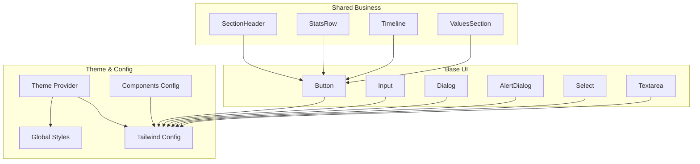
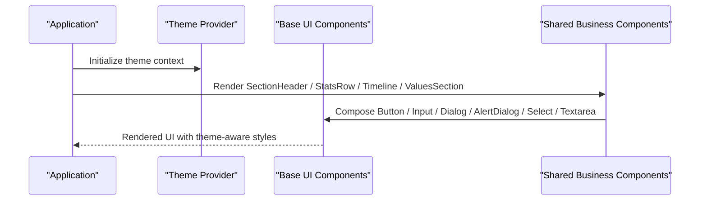
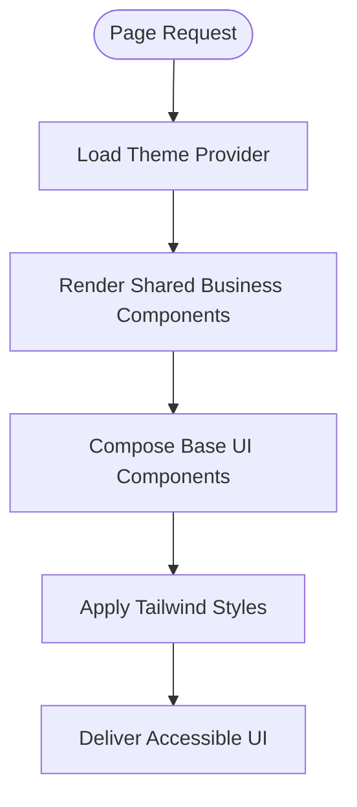
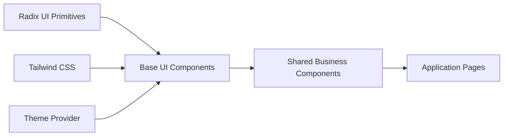

# Component Library

<cite>
**Referenced Files in This Document**
- [button.tsx](file://components/ui/button.tsx)
- [input.tsx](file://components/ui/input.tsx)
- [dialog.tsx](file://components/ui/dialog.tsx)
- [alert-dialog.tsx](file://components/ui/alert-dialog.tsx)
- [select.tsx](file://components/ui/select.tsx)
- [textarea.tsx](file://components/ui/textarea.tsx)
- [SectionHeader.tsx](file://components/shared/SectionHeader.tsx)
- [StatsRow.tsx](file://components/shared/StatsRow.tsx)
- [Timeline.tsx](file://components/shared/Timeline.tsx)
- [ValuesSection.tsx](file://components/shared/ValuesSection.tsx)
- [index.ts](file://components/shared/index.ts)
- [theme-provider.tsx](file://providers/theme-provider.tsx)
- [globals.css](file://app/globals.css)
- [tailwind.config.ts](file://tailwind.config.ts)
- [components.json](file://components.json)
</cite>

## Table of Contents
1. [Introduction](#introduction)
2. [Project Structure](#project-structure)
3. [Core Components](#core-components)
4. [Architecture Overview](#architecture-overview)
5. [Detailed Component Analysis](#detailed-component-analysis)
6. [Dependency Analysis](#dependency-analysis)
7. [Performance Considerations](#performance-considerations)
8. [Troubleshooting Guide](#troubleshooting-guide)
9. [Conclusion](#conclusion)
10. [Appendices](#appendices)

## Introduction
This document describes the reusable component library built on Shadcn UI and Radix UI primitives. It covers base UI components (Button, Input, Dialog, AlertDialog, Select, Textarea), shared business components (SectionHeader, StatsRow, Timeline, ValuesSection), composition patterns, styling with Tailwind CSS, theme integration, accessibility, responsive design, and performance considerations. The goal is to help you extend existing components, create custom variants, and maintain design consistency across the application.

## Project Structure
The component library is organized into two primary areas:
- Base UI components under components/ui, thin wrappers around Radix UI primitives styled with Tailwind CSS.
- Shared business components under components/shared, composed from base UI components and configured via props for page-level layouts.

**Diagram sources**
- [button.tsx](file://components/ui/button.tsx)
- [input.tsx](file://components/ui/input.tsx)
- [dialog.tsx](file://components/ui/dialog.tsx)
- [alert-dialog.tsx](file://components/ui/alert-dialog.tsx)
- [select.tsx](file://components/ui/select.tsx)
- [textarea.tsx](file://components/ui/textarea.tsx)
- [SectionHeader.tsx](file://components/shared/SectionHeader.tsx)
- [StatsRow.tsx](file://components/shared/StatsRow.tsx)
- [Timeline.tsx](file://components/shared/Timeline.tsx)
- [ValuesSection.tsx](file://components/shared/ValuesSection.tsx)
- [theme-provider.tsx](file://providers/theme-provider.tsx)
- [tailwind.config.ts](file://tailwind.config.ts)
- [globals.css](file://app/globals.css)
- [components.json](file://components.json)

**Section sources**
- [components.json](file://components.json)
- [tailwind.config.ts](file://tailwind.config.ts)
- [globals.css](file://app/globals.css)

## Core Components
This section documents the base UI components, their props, events, and customization options. All components are styled with Tailwind CSS and integrate with the project’s theme provider.

- Button
  - Purpose: Primary interactive element for actions and navigation.
  - Key props: variant, size, disabled, loading, className, children.
  - Events: onClick, onKeyDown, onFocus, onBlur.
  - Customization: Use variant and size to control appearance; extend via Tailwind classes or by adding new variants in the component file.
  - Accessibility: Focusable, keyboard navigable, supports aria attributes when needed.
  - Section sources
    - [button.tsx](file://components/ui/button.tsx)

- Input
  - Purpose: Standard text input field for forms.
  - Key props: type, value, onChange, placeholder, disabled, readOnly, className, id, name.
  - Events: onChange, onFocus, onBlur, onKeyDown.
  - Customization: Style via className; align with form fields using consistent spacing and typography.
  - Accessibility: Associated label via htmlFor/id pattern; supports aria-describedby for helper text.
  - Section sources
    - [input.tsx](file://components/ui/input.tsx)

- Dialog
  - Purpose: Modal overlay for focused interactions.
  - Key props: open, onOpenChange, title, description, children, className.
  - Events: onOpenChange, onClose.
  - Customization: Compose header/body/footer; style via className and Tailwind utilities.
  - Accessibility: Focus trap, escape-to-close, role="dialog", aria-modal.
  - Section sources
    - [dialog.tsx](file://components/ui/dialog.tsx)

- AlertDialog
  - Purpose: Confirmation dialog for destructive or important actions.
  - Key props: open, onOpenChange, title, description, cancelLabel, confirmLabel, onConfirm, onCancel, children, className.
  - Events: onOpenChange, onConfirm, onCancel.
  - Customization: Variant-based styling for destructive vs neutral actions.
  - Accessibility: Role="alertdialog", focus management, keyboard support.
  - Section sources
    - [alert-dialog.tsx](file://components/ui/alert-dialog.tsx)

- Select
  - Purpose: Accessible select dropdown for choosing one option.
  - Key props: value, onValueChange, placeholder, disabled, items, className.
  - Events: onValueChange, onOpenChange.
  - Customization: Style trigger and content via className; compose with labels and helper text.
  - Accessibility: ARIA roles for listbox/option, keyboard navigation, screen reader announcements.
  - Section sources
    - [select.tsx](file://components/ui/select.tsx)

- Textarea
  - Purpose: Multi-line text input for longer content.
  - Key props: value, onChange, placeholder, rows, disabled, maxLength, className, id, name.
  - Events: onChange, onFocus, onBlur, onKeyDown.
  - Customization: Resize behavior controlled via Tailwind; consistent with Input styling.
  - Accessibility: Label association, aria-describedby for hints.
  - Section sources
    - [textarea.tsx](file://components/ui/textarea.tsx)

## Architecture Overview
The architecture follows a layered approach:
- Theme layer: Theme provider supplies color tokens and dark mode state.
- Base UI layer: Shadcn/Radix-based components provide accessible primitives with Tailwind styling.
- Shared business layer: Higher-order components composed from base UI components for common page sections.
- Application layer: Pages and features consume shared business components.

**Diagram sources**
- [theme-provider.tsx](file://providers/theme-provider.tsx)
- [SectionHeader.tsx](file://components/shared/SectionHeader.tsx)
- [StatsRow.tsx](file://components/shared/StatsRow.tsx)
- [Timeline.tsx](file://components/shared/Timeline.tsx)
- [ValuesSection.tsx](file://components/shared/ValuesSection.tsx)
- [button.tsx](file://components/ui/button.tsx)
- [input.tsx](file://components/ui/input.tsx)
- [dialog.tsx](file://components/ui/dialog.tsx)
- [alert-dialog.tsx](file://components/ui/alert-dialog.tsx)
- [select.tsx](file://components/ui/select.tsx)
- [textarea.tsx](file://components/ui/textarea.tsx)

## Detailed Component Analysis

### Base UI Components
These components wrap Radix UI primitives and apply Tailwind CSS classes for consistent styling. They expose minimal, ergonomic APIs and rely on the theme provider for colors and dark mode.

- Composition patterns
  - Buttons: variant + size + disabled + loading states.
  - Inputs: controlled value + onChange + validation hooks integration.
  - Dialogs: open + onOpenChange + composable slots (header/body/footer).
  - Alerts: confirmation flows with cancel/confirm callbacks.
  - Select: value + onValueChange + item list configuration.
  - Textarea: multiline input with resize and length constraints.

- Styling approaches
  - Use Tailwind utility classes for layout, spacing, typography, and color.
  - Leverage CSS variables provided by the theme provider for semantic colors.
  - Keep component-specific styles minimal; prefer composition over deep overrides.

- Accessibility highlights
  - Keyboard navigation and focus management handled by Radix primitives.
  - Proper ARIA roles and labels exposed through props and defaults.
  - Screen reader-friendly descriptions via optional description props.

- Section sources
  - [button.tsx](file://components/ui/button.tsx)
  - [input.tsx](file://components/ui/input.tsx)
  - [dialog.tsx](file://components/ui/dialog.tsx)
  - [alert-dialog.tsx](file://components/ui/alert-dialog.tsx)
  - [select.tsx](file://components/ui/select.tsx)
  - [textarea.tsx](file://components/ui/textarea.tsx)

### Shared Business Components
Higher-level components that encapsulate common page structures and behaviors. They are composed from base UI components and accept configuration props for flexibility.

- SectionHeader
  - Purpose: Consistent heading area with title, subtitle, and optional actions.
  - Props: title, subtitle, actions, align, className.
  - Usage: Wrap any section to provide uniform header semantics and layout.
  - Section sources
    - [SectionHeader.tsx](file://components/shared/SectionHeader.tsx)

- StatsRow
  - Purpose: Display key metrics in a responsive grid.
  - Props: stats array (label, value, trend), layout, className.
  - Usage: Provide data-driven cards with consistent formatting.
  - Section sources
    - [StatsRow.tsx](file://components/shared/StatsRow.tsx)

- Timeline
  - Purpose: Visualize chronological steps or milestones.
  - Props: items (title, date, description), orientation, className.
  - Usage: Present process flows or history with clear progression.
  - Section sources
    - [Timeline.tsx](file://components/shared/Timeline.tsx)

- ValuesSection
  - Purpose: Showcase core values or principles with icons and descriptions.
  - Props: values array (icon, title, description), columns, className.
  - Usage: Communicate brand values in a structured, readable format.
  - Section sources
    - [ValuesSection.tsx](file://components/shared/ValuesSection.tsx)

- Shared index
  - Centralized exports for easy imports across the app.
  - Section sources
    - [index.ts](file://components/shared/index.ts)

### Conceptual Overview
The following diagram illustrates how shared business components compose base UI components to deliver consistent user experiences.

[No sources needed since this diagram shows conceptual workflow, not actual code structure]

## Dependency Analysis
The component library depends on:
- Radix UI primitives for accessibility and interaction patterns.
- Tailwind CSS for styling and responsive design.
- Theme provider for global color tokens and dark mode.
- Global CSS for base resets and typography.

**Diagram sources**
- [button.tsx](file://components/ui/button.tsx)
- [input.tsx](file://components/ui/input.tsx)
- [dialog.tsx](file://components/ui/dialog.tsx)
- [alert-dialog.tsx](file://components/ui/alert-dialog.tsx)
- [select.tsx](file://components/ui/select.tsx)
- [textarea.tsx](file://components/ui/textarea.tsx)
- [SectionHeader.tsx](file://components/shared/SectionHeader.tsx)
- [StatsRow.tsx](file://components/shared/StatsRow.tsx)
- [Timeline.tsx](file://components/shared/Timeline.tsx)
- [ValuesSection.tsx](file://components/shared/ValuesSection.tsx)
- [theme-provider.tsx](file://providers/theme-provider.tsx)
- [tailwind.config.ts](file://tailwind.config.ts)
- [globals.css](file://app/globals.css)

**Section sources**
- [tailwind.config.ts](file://tailwind.config.ts)
- [globals.css](file://app/globals.css)
- [theme-provider.tsx](file://providers/theme-provider.tsx)

## Performance Considerations
- Prefer memoization for expensive shared components when rendering large lists.
- Avoid unnecessary re-renders by keeping prop updates minimal and stable.
- Use lazy loading for heavy dialogs or modals if they contain significant content.
- Keep Tailwind class usage efficient; avoid overly complex conditional classes.
- Ensure images and icons used in shared components are optimized and cached.

[No sources needed since this section provides general guidance]

## Troubleshooting Guide
Common issues and resolutions:
- Theme mismatch: Verify theme provider is mounted at the root and Tailwind config includes theme-aware classes.
- Focus not trapped in dialogs: Confirm Radix primitives are used correctly and no custom overlays interfere.
- Form inputs not updating: Ensure controlled value and onChange are wired consistently.
- Select not announcing changes: Check that onValueChange updates state and aria attributes are present.
- Dark mode not applying: Validate CSS variables and Tailwind dark mode strategy.

**Section sources**
- [theme-provider.tsx](file://providers/theme-provider.tsx)
- [dialog.tsx](file://components/ui/dialog.tsx)
- [alert-dialog.tsx](file://components/ui/alert-dialog.tsx)
- [input.tsx](file://components/ui/input.tsx)
- [select.tsx](file://components/ui/select.tsx)
- [globals.css](file://app/globals.css)
- [tailwind.config.ts](file://tailwind.config.ts)

## Conclusion
This component library provides a cohesive set of base UI and shared business components built on Shadcn UI and Radix UI. By composing these components with Tailwind CSS and integrating them through the theme provider, teams can maintain accessibility, responsiveness, and visual consistency while enabling flexible customization and extension.

[No sources needed since this section summarizes without analyzing specific files]

## Appendices

### Extending Existing Components
- Add new variants to Button by extending its variant map and corresponding Tailwind classes.
- Create custom sizes by introducing new size tokens and mapping them to spacing and typography scales.
- Extend Input and Textarea with additional props like prefix/suffix icons or validation messages.

[No sources needed since this section provides general guidance]

### Creating Custom Variants
- Define a new variant key in the component’s variant configuration.
- Map the variant to Tailwind classes for color, background, border, and hover states.
- Update TypeScript types to include the new variant and ensure consumers get proper autocomplete.

[No sources needed since this section provides general guidance]

### Maintaining Design Consistency
- Centralize color tokens and spacing in the theme provider and Tailwind config.
- Use shared business components to enforce consistent layouts and messaging patterns.
- Document prop contracts and usage examples for each component.

[No sources needed since this section provides general guidance]

### Accessibility Compliance
- Rely on Radix primitives for keyboard navigation and ARIA attributes.
- Ensure all interactive elements have descriptive labels and roles.
- Test with screen readers and keyboard-only navigation.

[No sources needed since this section provides general guidance]

### Responsive Design Patterns
- Use Tailwind breakpoints to adapt layouts for mobile, tablet, and desktop.
- Prefer flex and grid utilities for fluid arrangements.
- Keep touch targets appropriately sized for mobile users.

[No sources needed since this section provides general guidance]