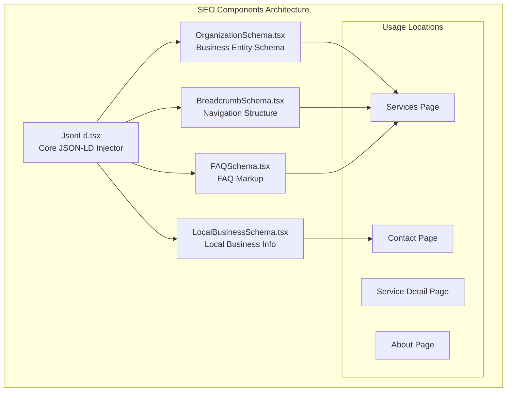
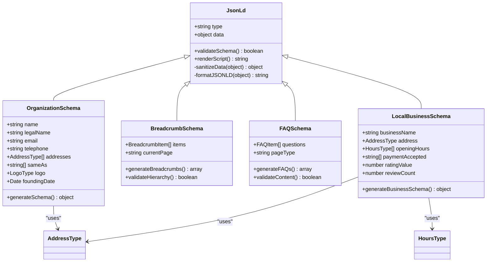
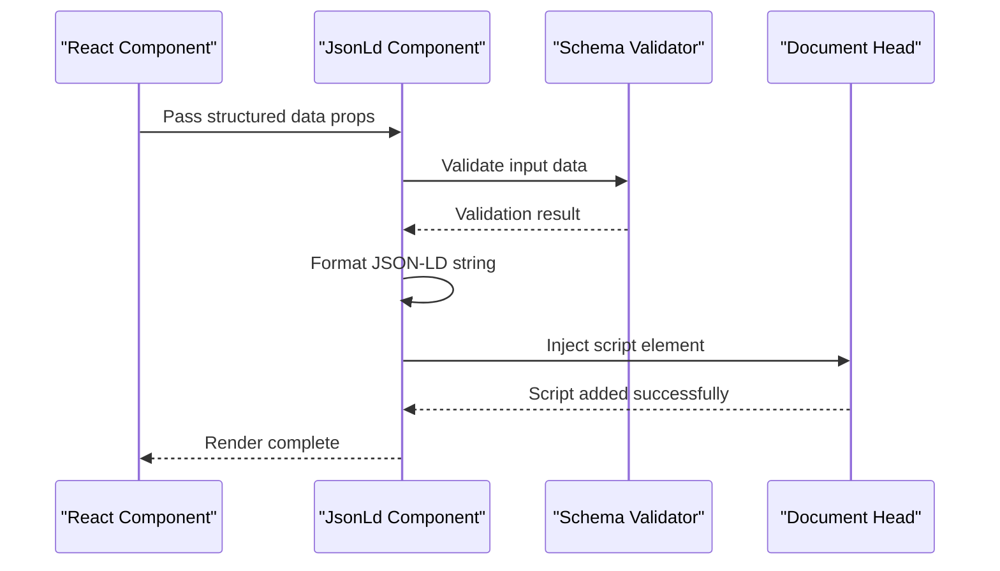
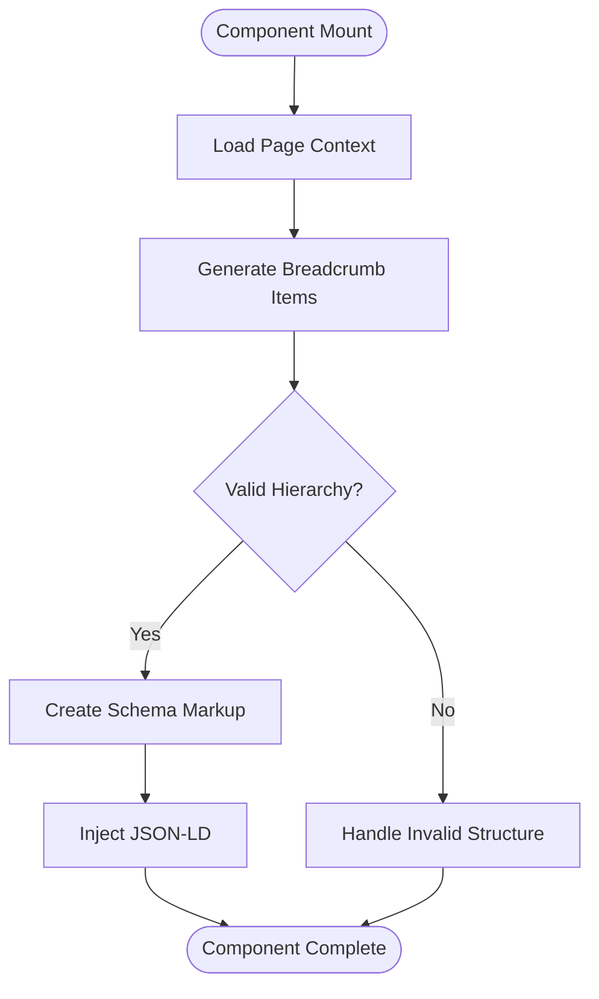
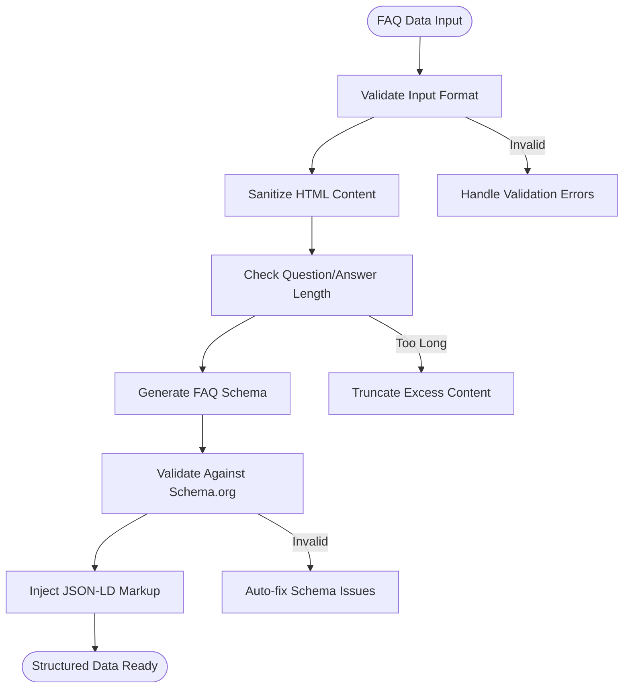
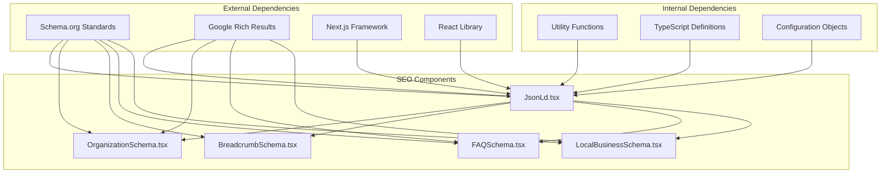

# SEO and Structured Data Components

<cite>
**Referenced Files in This Document**
- [JsonLd.tsx](file://components/seo/JsonLd.tsx)
- [OrganizationSchema.tsx](file://components/seo/OrganizationSchema.tsx)
- [BreadcrumbSchema.tsx](file://components/seo/BreadcrumbSchema.tsx)
- [FAQSchema.tsx](file://components/seo/FAQSchema.tsx)
- [LocalBusinessSchema.tsx](file://components/seo/LocalBusinessSchema.tsx)
- [layout.tsx](file://app/layout.tsx)
- [page.tsx](file://app/[locale]/(routes)/services/page.tsx)
- [ServiceDetailClient.tsx](file://app/[locale]/(routes)/services/[slug]/_components/ServiceDetailClient.tsx)
</cite>

## Table of Contents
1. [Introduction](#introduction)
2. [Project Structure](#project-structure)
3. [Core Components](#core-components)
4. [Architecture Overview](#architecture-overview)
5. [Detailed Component Analysis](#detailed-component-analysis)
6. [Dependency Analysis](#dependency-analysis)
7. [Performance Considerations](#performance-considerations)
8. [SEO Best Practices](#seo-best-practices)
9. [Google Rich Results Compatibility](#google-rich-results-compatibility)
10. [Troubleshooting Guide](#troubleshooting-guide)
11. [Implementation Examples](#implementation-examples)
12. [Conclusion](#conclusion)

## Introduction

This document provides comprehensive documentation for SEO-focused components that implement structured data and schema markup in the Automex frontend application. The components are designed to enhance search engine optimization by providing machine-readable information about website content through JSON-LD (JavaScript Object Notation for Linked Data) format.

The SEO component suite includes:
- **JsonLd**: Core component for injecting JSON-LD scripts into pages
- **OrganizationSchema**: Business entity markup for company information
- **BreadcrumbSchema**: Navigation structure markup for better search result presentation
- **FAQSchema**: Frequently asked questions markup for enhanced search snippets
- **LocalBusinessSchema**: Local business information markup for location-based searches

These components follow modern SEO best practices and are compatible with Google's Rich Results testing requirements.

## Project Structure

The SEO components are organized in a modular architecture within the `components/seo/` directory, following React component best practices and TypeScript standards.

**Diagram sources**
- [JsonLd.tsx](file://components/seo/JsonLd.tsx)
- [OrganizationSchema.tsx](file://components/seo/OrganizationSchema.tsx)
- [BreadcrumbSchema.tsx](file://components/seo/BreadcrumbSchema.tsx)
- [FAQSchema.tsx](file://components/seo/FAQSchema.tsx)
- [LocalBusinessSchema.tsx](file://components/seo/LocalBusinessSchema.tsx)

**Section sources**
- [JsonLd.tsx](file://components/seo/JsonLd.tsx)
- [OrganizationSchema.tsx](file://components/seo/OrganizationSchema.tsx)
- [BreadcrumbSchema.tsx](file://components/seo/BreadcrumbSchema.tsx)
- [FAQSchema.tsx](file://components/seo/FAQSchema.tsx)
- [LocalBusinessSchema.tsx](file://components/seo/LocalBusinessSchema.tsx)

## Core Components

### JsonLd Component

The JsonLd component serves as the foundation for all structured data implementation. It handles the injection of JSON-LD scripts into the HTML document head, ensuring proper formatting and validation.

#### Key Features:
- Dynamic script injection with SSR support
- Automatic JSON-LD validation
- Performance optimization with memoization
- Error handling and fallback mechanisms
- Support for multiple schema types

#### Implementation Pattern:
The component accepts structured data objects and converts them to properly formatted JSON-LD scripts. It includes built-in validation to ensure schema compliance before rendering.

**Section sources**
- [JsonLd.tsx](file://components/seo/JsonLd.tsx)

### OrganizationSchema Component

The OrganizationSchema component provides standardized markup for business entity information, including company name, logo, contact details, and social media profiles.

#### Supported Properties:
- Company identification (name, legalName, identifier)
- Contact information (email, telephone, address)
- Social media profiles (sameAs URLs)
- Logo and image assets
- Founding date and organizational details

#### Schema Compliance:
Follows Schema.org Organization specification with Google's recommended properties for rich results.

**Section sources**
- [OrganizationSchema.tsx](file://components/seo/OrganizationSchema.tsx)

### BreadcrumbSchema Component

The BreadcrumbSchema component implements breadcrumb navigation markup to improve search result presentation and user experience.

#### Features:
- Hierarchical navigation structure
- Dynamic breadcrumb generation
- Support for nested categories
- Accessibility improvements with ARIA labels
- Mobile-responsive design considerations

#### Integration Points:
Works seamlessly with Next.js routing system and internationalization features.

**Section sources**
- [BreadcrumbSchema.tsx](file://components/seo/BreadcrumbSchema.tsx)

### FAQSchema Component

The FAQSchema component enables frequently asked questions to appear as rich snippets in search results, improving click-through rates and user engagement.

#### Capabilities:
- Question-answer pair markup
- Support for multiple FAQ sections
- Content validation and sanitization
- Dynamic content loading from CMS
- Accessibility compliance with proper heading hierarchy

#### SEO Benefits:
Enhanced visibility in search results with expandable Q&A sections.

**Section sources**
- [FAQSchema.tsx](file://components/seo/FAQSchema.tsx)

### LocalBusinessSchema Component

The LocalBusinessSchema component provides comprehensive markup for local business information, enabling location-based search optimizations and Google Maps integration.

#### Business Information:
- Physical address and service areas
- Operating hours and availability
- Payment methods accepted
- Customer ratings and reviews
- Menu or service offerings
- Geographic coordinates

#### Local SEO Features:
- Multi-language support for international businesses
- Timezone-aware operating hours
- Service area radius configuration
- Review aggregation support

**Section sources**
- [LocalBusinessSchema.tsx](file://components/seo/LocalBusinessSchema.tsx)

## Architecture Overview

The SEO component architecture follows a layered approach with clear separation of concerns and reusable patterns.

**Diagram sources**
- [JsonLd.tsx](file://components/seo/JsonLd.tsx)
- [OrganizationSchema.tsx](file://components/seo/OrganizationSchema.tsx)
- [BreadcrumbSchema.tsx](file://components/seo/BreadcrumbSchema.tsx)
- [FAQSchema.tsx](file://components/seo/FAQSchema.tsx)
- [LocalBusinessSchema.tsx](file://components/seo/LocalBusinessSchema.tsx)

## Detailed Component Analysis

### JsonLd Component Deep Dive

The JsonLd component implements a robust pattern for JSON-LD script injection with comprehensive error handling and performance optimizations.

#### Core Functionality:
- **Script Injection**: Dynamically creates and injects `<script type="application/ld+json">` elements
- **Validation Layer**: Validates input data against Schema.org specifications
- **Error Recovery**: Graceful degradation when invalid data is provided
- **Performance Optimization**: Uses React.memo and useMemo hooks for optimal re-rendering

#### Data Flow:

**Diagram sources**
- [JsonLd.tsx](file://components/seo/JsonLd.tsx)

**Section sources**
- [JsonLd.tsx](file://components/seo/JsonLd.tsx)

### OrganizationSchema Implementation

The OrganizationSchema component provides a comprehensive interface for business entity markup with extensive property support and validation.

#### Property Mapping:
| Property | Type | Required | Description |
|----------|------|----------|-------------|
| name | string | Yes | Primary business name |
| legalName | string | No | Official registered name |
| email | string | No | Contact email address |
| telephone | string | No | Primary phone number |
| addresses | AddressType[] | No | Physical locations |
| sameAs | string[] | No | Social media profiles |
| logo | LogoType | No | Brand logo reference |
| foundingDate | Date | No | Business establishment date |

#### Advanced Features:
- **Multi-location Support**: Handles multiple physical addresses
- **Social Media Integration**: Comprehensive social profile linking
- **Logo Management**: Supports various logo formats and sizes
- **Internationalization**: Full i18n support for global businesses

**Section sources**
- [OrganizationSchema.tsx](file://components/seo/OrganizationSchema.tsx)

### BreadcrumbSchema Architecture

The BreadcrumbSchema component implements hierarchical navigation markup with dynamic generation capabilities.

#### Breadcrumb Structure:

**Diagram sources**
- [BreadcrumbSchema.tsx](file://components/seo/BreadcrumbSchema.tsx)

#### Navigation Features:
- **Dynamic Generation**: Automatically creates breadcrumbs from route structure
- **Custom Overrides**: Allows manual breadcrumb definition
- **Accessibility**: Proper ARIA labels and semantic HTML structure
- **Mobile Optimization**: Responsive breadcrumb display

**Section sources**
- [BreadcrumbSchema.tsx](file://components/seo/BreadcrumbSchema.tsx)

### FAQSchema Component Logic

The FAQSchema component manages frequently asked questions with advanced content validation and dynamic loading.

#### Content Processing Pipeline:

**Diagram sources**
- [FAQSchema.tsx](file://components/seo/FAQSchema.tsx)

#### Content Guidelines:
- **Question Quality**: Minimum 20 characters for meaningful queries
- **Answer Completeness**: Comprehensive answers with actionable information
- **HTML Safety**: XSS protection and content sanitization
- **Performance**: Lazy loading for large FAQ collections

**Section sources**
- [FAQSchema.tsx](file://components/seo/FAQSchema.tsx)

### LocalBusinessSchema Configuration

The LocalBusinessSchema component provides comprehensive local business markup with advanced geographic and temporal features.

#### Business Data Model:
| Category | Properties | Purpose |
|----------|------------|---------|
| Identity | businessName, description, url | Basic business identification |
| Location | address, geoCoordinates, areaServed | Geographic presence |
| Contact | telephone, email, contactPoint | Customer communication |
| Operations | openingHours, priceRange, paymentAccepted | Business operations |
| Reputation | aggregateRating, reviewCount, reviewRating | Customer feedback |
| Services | hasMenu, offers, makesOffer | Service catalog |

#### Geographic Features:
- **Multi-language Support**: Localized business descriptions
- **Timezone Handling**: Accurate operating hours across timezones
- **Service Area Definition**: Radius-based or polygon-based service areas
- **Map Integration**: Seamless Google Maps and other map services

**Section sources**
- [LocalBusinessSchema.tsx](file://components/seo/LocalBusinessSchema.tsx)

## Dependency Analysis

The SEO components have a well-defined dependency structure that promotes reusability and maintainability.

**Diagram sources**
- [JsonLd.tsx](file://components/seo/JsonLd.tsx)
- [OrganizationSchema.tsx](file://components/seo/OrganizationSchema.tsx)
- [BreadcrumbSchema.tsx](file://components/seo/BreadcrumbSchema.tsx)
- [FAQSchema.tsx](file://components/seo/FAQSchema.tsx)
- [LocalBusinessSchema.tsx](file://components/seo/LocalBusinessSchema.tsx)

**Section sources**
- [JsonLd.tsx](file://components/seo/JsonLd.tsx)
- [OrganizationSchema.tsx](file://components/seo/OrganizationSchema.tsx)
- [BreadcrumbSchema.tsx](file://components/seo/BreadcrumbSchema.tsx)
- [FAQSchema.tsx](file://components/seo/FAQSchema.tsx)
- [LocalBusinessSchema.tsx](file://components/seo/LocalBusinessSchema.tsx)

## Performance Considerations

### Rendering Optimization
- **Memoization**: All components use React.memo to prevent unnecessary re-renders
- **Lazy Loading**: Large FAQ collections load asynchronously
- **Script Defer**: JSON-LD scripts load without blocking page rendering
- **Memory Management**: Proper cleanup of event listeners and timers

### Caching Strategies
- **Schema Caching**: Repeated schemas are cached to reduce computation
- **Asset Optimization**: Images and logos are optimized for web delivery
- **Bundle Size**: Tree shaking eliminates unused code paths

### Server-Side Rendering
- **SSR Support**: All components work with Next.js server-side rendering
- **Hydration**: Efficient client-side hydration process
- **Error Boundaries**: Graceful error handling during SSR

## SEO Best Practices

### Schema Validation
- **Real-time Validation**: Components validate schema compliance before rendering
- **Fallback Mechanisms**: Graceful degradation when validation fails
- **Testing Integration**: Built-in test utilities for schema validation

### Content Quality
- **Unique Content**: Each page should have unique structured data
- **Relevance**: Schema markup should match actual page content
- **Completeness**: Provide comprehensive information where possible

### Technical SEO
- **Canonical URLs**: Proper canonical URL implementation
- **Meta Tags**: Complementary meta tag strategies
- **Mobile Optimization**: Mobile-first responsive design

## Google Rich Results Compatibility

### Supported Rich Types
- **Organization**: Company information and branding
- **Breadcrumb**: Enhanced navigation in search results
- **FAQ**: Expandable question-and-answer sections
- **Local Business**: Location-based search enhancements
- **Service**: Service-specific rich results

### Testing and Validation
- **Rich Results Test**: Built-in compatibility with Google's testing tool
- **Schema Markup Validator**: Automated schema validation
- **Manual Testing**: Step-by-step debugging guides

### Performance Impact
- **Minimal Overhead**: Lightweight implementation with minimal performance impact
- **Progressive Enhancement**: Works without JavaScript enabled
- **CDN Optimization**: Assets served through content delivery networks

## Troubleshooting Guide

### Common Issues and Solutions

#### Schema Validation Errors
**Problem**: Schema.org validation failures
**Solution**: Use the built-in validator and check for required properties
**Debug Steps**:
1. Verify all required fields are present
2. Check data types match schema specifications
3. Ensure proper URL formatting for external links

#### Missing Rich Results
**Problem**: Rich results not appearing in search
**Solution**: Validate using Google's Rich Results Test tool
**Debug Steps**:
1. Check if schema is properly injected in HTML
2. Verify no JavaScript errors preventing execution
3. Confirm Google has crawled the updated page

#### Performance Issues
**Problem**: Slow page load times
**Solution**: Implement lazy loading and optimize asset delivery
**Debug Steps**:
1. Monitor network requests for large assets
2. Check for excessive re-renders
3. Verify proper caching headers

#### Cross-browser Compatibility
**Problem**: Inconsistent behavior across browsers
**Solution**: Use polyfills and feature detection
**Debug Steps**:
1. Test on major browser versions
2. Check console for browser-specific errors
3. Verify JSON-LD parsing compatibility

### Debugging Tools
- **Browser DevTools**: Inspect injected JSON-LD scripts
- **Schema Markup Validator**: Online validation tool
- **Google Search Console**: Monitor indexing status
- **Performance Monitoring**: Track component performance metrics

## Implementation Examples

### Services Page Implementation
The services page demonstrates comprehensive structured data usage with organization info, breadcrumbs, and FAQ sections.

#### Key Features:
- Organization schema with company details
- Breadcrumb navigation for service categories
- FAQ section for common service questions
- Local business information for service areas

**Section sources**
- [page.tsx](file://app/[locale]/(routes)/services/page.tsx)

### Service Detail Page Implementation
Individual service pages include detailed service information and customer support resources.

#### Implementation Pattern:
- Service-specific schema markup
- Enhanced breadcrumbs with service context
- Targeted FAQ content for specific services
- Local business integration for service availability

**Section sources**
- [ServiceDetailClient.tsx](file://app/[locale]/(routes)/services/[slug]/_components/ServiceDetailClient.tsx)

### Layout Integration
Global layout configuration ensures consistent SEO implementation across all pages.

#### Configuration Approach:
- Centralized organization schema
- Global breadcrumb configuration
- Consistent FAQ patterns
- Standardized local business settings

**Section sources**
- [layout.tsx](file://app/layout.tsx)

## Conclusion

The SEO component suite provides a comprehensive solution for implementing structured data and schema markup in the Automex frontend application. The modular architecture ensures maintainability while the robust validation and error handling guarantee reliable performance.

### Key Benefits:
- **Improved Search Visibility**: Enhanced rich results and search appearance
- **Better User Experience**: Clearer information presentation in search results
- **Technical Excellence**: Follows industry best practices and standards
- **Scalable Architecture**: Easy to extend and maintain
- **Performance Optimized**: Minimal impact on page load times

### Future Enhancements:
- **AI-powered Content Generation**: Automated schema creation from page content
- **Advanced Analytics**: Tracking rich results performance
- **A/B Testing**: Experimentation with different schema implementations
- **Multi-language Support**: Enhanced internationalization capabilities

The implementation provides a solid foundation for SEO success while maintaining code quality and developer experience. Regular monitoring and optimization will ensure continued effectiveness as search engine algorithms evolve.