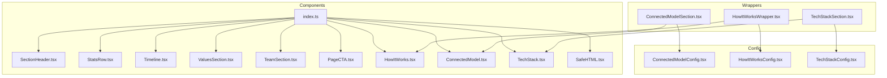
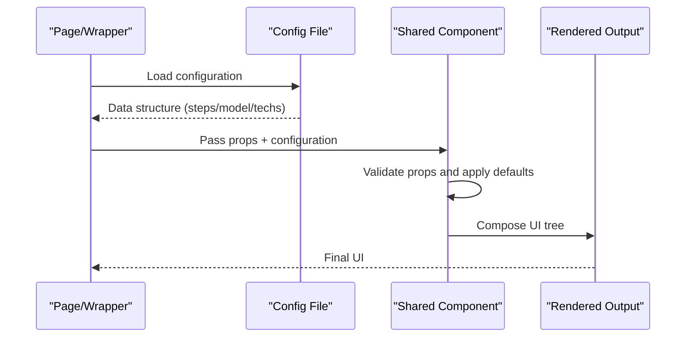
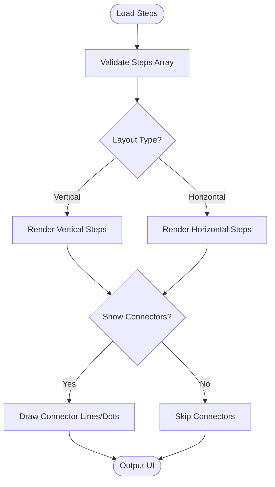
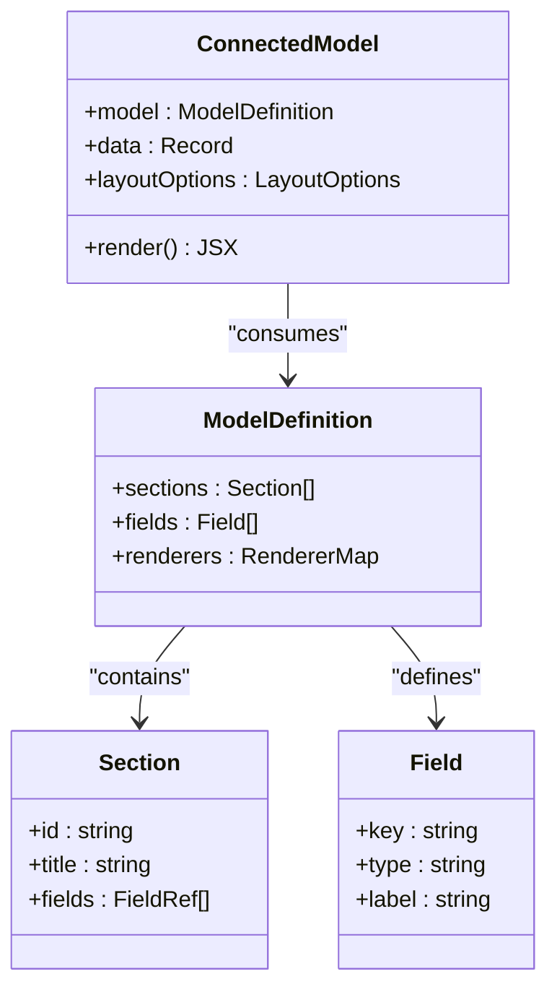
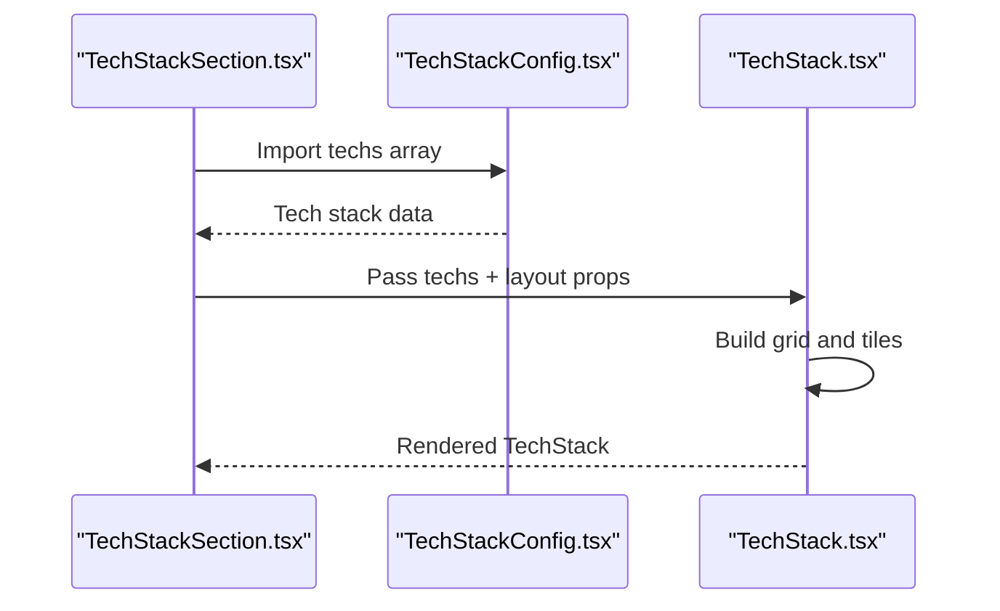
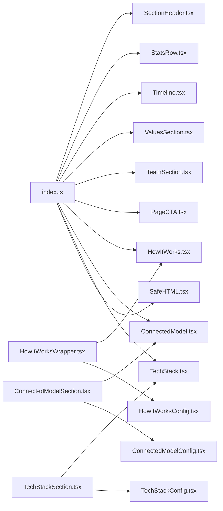

# Shared Business Components

<cite>
**Referenced Files in This Document**
- [SectionHeader.tsx](file://components/shared/SectionHeader.tsx)
- [StatsRow.tsx](file://components/shared/StatsRow.tsx)
- [Timeline.tsx](file://components/shared/Timeline.tsx)
- [ValuesSection.tsx](file://components/shared/ValuesSection.tsx)
- [TeamSection.tsx](file://components/shared/TeamSection.tsx)
- [PageCTA.tsx](file://components/shared/PageCTA.tsx)
- [HowItWorks.tsx](file://components/shared/HowItWorks.tsx)
- [ConnectedModel.tsx](file://components/shared/ConnectedModel.tsx)
- [TechStack.tsx](file://components/shared/TechStack.tsx)
- [SafeHTML.tsx](file://components/shared/SafeHTML.tsx)
- [index.ts](file://components/shared/index.ts)
- [ConnectedModelConfig.tsx](file://config/ConnectedModelConfig.tsx)
- [HowItWorksConfig.tsx](file://config/HowItWorksConfig.tsx)
- [TechStackConfig.tsx](file://config/TechStackConfig.tsx)
- [ConnectedModelSection.tsx](file://app/[locale]/_components/Wrappers/ConnectedModelSection.tsx)
- [HowItWorksWrapper.tsx](file://app/[locale]/_components/Wrappers/HowItWorksWrapper.tsx)
- [TechStackSection.tsx](file://app/[locale]/_components/Wrappers/TechStackSection.tsx)
</cite>

## Table of Contents
1. [Introduction](#introduction)
2. [Project Structure](#project-structure)
3. [Core Components](#core-components)
4. [Architecture Overview](#architecture-overview)
5. [Detailed Component Analysis](#detailed-component-analysis)
6. [Dependency Analysis](#dependency-analysis)
7. [Performance Considerations](#performance-considerations)
8. [Troubleshooting Guide](#troubleshooting-guide)
9. [Conclusion](#conclusion)
10. [Appendices](#appendices)

## Introduction
This document describes the shared business components that encapsulate common business logic and presentation patterns across the application. It covers configuration options, data structures, styling customization, responsive behavior, and integration patterns with other components. Practical examples are provided to help extend and adapt these components for specific use cases.

The components include:
- SectionHeader: consistent page headers
- StatsRow: metrics display
- Timeline: chronological data visualization
- ValuesSection: company values display
- TeamSection: team member showcases
- PageCTA: call-to-action sections
- HowItWorks: process explanations
- ConnectedModel: complex data presentations
- TechStack: technology displays
- SafeHTML: secure HTML rendering

## Project Structure
Shared business components live under a dedicated folder and are re-exported via an index file. Pages and wrappers consume these components through configuration files and wrapper components.

**Diagram sources**
- [index.ts](file://components/shared/index.ts)
- [ConnectedModel.tsx](file://components/shared/ConnectedModel.tsx)
- [HowItWorks.tsx](file://components/shared/HowItWorks.tsx)
- [TechStack.tsx](file://components/shared/TechStack.tsx)
- [ConnectedModelConfig.tsx](file://config/ConnectedModelConfig.tsx)
- [HowItWorksConfig.tsx](file://config/HowItWorksConfig.tsx)
- [TechStackConfig.tsx](file://config/TechStackConfig.tsx)
- [ConnectedModelSection.tsx](file://app/[locale]/_components/Wrappers/ConnectedModelSection.tsx)
- [HowItWorksWrapper.tsx](file://app/[locale]/_components/Wrappers/HowItWorksWrapper.tsx)
- [TechStackSection.tsx](file://app/[locale]/_components/Wrappers/TechStackSection.tsx)

**Section sources**
- [index.ts](file://components/shared/index.ts)

## Core Components
This section summarizes each component’s purpose, typical props, and usage patterns. For exact prop types and defaults, refer to the source files listed in the detailed analysis below.

- SectionHeader
  - Purpose: Provides a consistent header area with title, subtitle, and optional actions or metadata.
  - Typical props: title, subtitle, align, spacing, actions (optional), container styles.
  - Styling: Uses theme-aware typography and spacing; supports alignment variants.
  - Responsive: Adapts font sizes and padding on smaller screens.
  - Integration: Often used at the top of pages or within sections.

- StatsRow
  - Purpose: Displays a row of metric cards with label, value, and optional icon or trend indicator.
  - Typical props: items array (label, value, icon/trend), layout variants, spacing.
  - Styling: Grid-based layout; customizable per-item colors and emphasis.
  - Responsive: Stacks vertically on narrow viewports.
  - Integration: Used in dashboards and landing pages to highlight KPIs.

- Timeline
  - Purpose: Visualizes chronological events with nodes, labels, and optional descriptions.
  - Typical props: events array (date/time, title, description, status), orientation, showConnectors.
  - Styling: Theme-aware node states and connectors; accessible focus management.
  - Responsive: Switches between horizontal and vertical layouts based on viewport.
  - Integration: Commonly used for roadmaps, histories, and processes.

- ValuesSection
  - Purpose: Showcases core company values with icons, titles, and short descriptions.
  - Typical props: values array (icon/title/description), grid columns, spacing.
  - Styling: Card-like tiles with hover effects and consistent iconography.
  - Responsive: Adjusts grid columns and tile size.
  - Integration: Frequently placed in about or marketing pages.

- TeamSection
  - Purpose: Highlights team members with photos, names, roles, and social links.
  - Typical props: members array (image/name/role/socials), layout, image sizing.
  - Styling: Circular or rounded images with overlay info on hover.
  - Responsive: Collapses to single-column stacks on small screens.
  - Integration: Used in about/team pages.

- PageCTA
  - Purpose: Prominent call-to-action blocks with headline, description, and action buttons.
  - Typical props: headline, description, buttons array, variant, alignment.
  - Styling: High-contrast backgrounds and clear visual hierarchy.
  - Responsive: Centers content and stacks buttons on mobile.
  - Integration: Placed near the bottom of pages or as standalone sections.

- HowItWorks
  - Purpose: Explains a multi-step process with numbered steps and descriptions.
  - Typical props: steps array (title/description/icon), layout, connector style.
  - Styling: Step indicators with optional connecting lines.
  - Responsive: Vertical flow on small screens; horizontal or zigzag on larger screens.
  - Integration: Consumed via wrapper and config files for content-driven rendering.

- ConnectedModel
  - Purpose: Renders complex data models with dynamic sections, tabs, or panels.
  - Typical props: model definition (sections, fields, renderers), data object, layout options.
  - Styling: Configurable section dividers and field layouts.
  - Responsive: Reorders sections and adjusts field widths.
  - Integration: Driven by a configuration file and consumed by a wrapper component.

- TechStack
  - Purpose: Displays technologies with logos, names, and optional tags.
  - Typical props: techs array (name/logo/tags), grid columns, spacing.
  - Styling: Logo-centric tiles with hover states.
  - Responsive: Adaptive grid and logo sizing.
  - Integration: Consumed via wrapper and config files for content-driven rendering.

- SafeHTML
  - Purpose: Safely renders HTML content from trusted sources using sanitization.
  - Typical props: html string, allowed attributes/tags (if configurable).
  - Behavior: Sanitizes input before rendering to prevent XSS.
  - Integration: Used when rich text is required from CMS or external APIs.

**Section sources**
- [SectionHeader.tsx](file://components/shared/SectionHeader.tsx)
- [StatsRow.tsx](file://components/shared/StatsRow.tsx)
- [Timeline.tsx](file://components/shared/Timeline.tsx)
- [ValuesSection.tsx](file://components/shared/ValuesSection.tsx)
- [TeamSection.tsx](file://components/shared/TeamSection.tsx)
- [PageCTA.tsx](file://components/shared/PageCTA.tsx)
- [HowItWorks.tsx](file://components/shared/HowItWorks.tsx)
- [ConnectedModel.tsx](file://components/shared/ConnectedModel.tsx)
- [TechStack.tsx](file://components/shared/TechStack.tsx)
- [SafeHTML.tsx](file://components/shared/SafeHTML.tsx)

## Architecture Overview
The shared components follow a layered approach:
- Presentation layer: Pure UI components with well-defined props.
- Configuration layer: Content definitions for data-heavy components (e.g., HowItWorks, ConnectedModel, TechStack).
- Wrapper layer: Page-level wrappers that bind configuration to components and provide default behaviors.

**Diagram sources**
- [HowItWorksWrapper.tsx](file://app/[locale]/_components/Wrappers/HowItWorksWrapper.tsx)
- [HowItWorksConfig.tsx](file://config/HowItWorksConfig.tsx)
- [HowItWorks.tsx](file://components/shared/HowItWorks.tsx)
- [ConnectedModelSection.tsx](file://app/[locale]/_components/Wrappers/ConnectedModelSection.tsx)
- [ConnectedModelConfig.tsx](file://config/ConnectedModelConfig.tsx)
- [ConnectedModel.tsx](file://components/shared/ConnectedModel.tsx)
- [TechStackSection.tsx](file://app/[locale]/_components/Wrappers/TechStackSection.tsx)
- [TechStackConfig.tsx](file://config/TechStackConfig.tsx)
- [TechStack.tsx](file://components/shared/TechStack.tsx)

## Detailed Component Analysis

### SectionHeader
- Responsibilities:
  - Render a consistent header with title/subtitle and optional actions.
  - Apply theme-aware typography and spacing.
  - Support alignment and container customization.
- Props overview:
  - title: string
  - subtitle?: string
  - align?: "left" | "center" | "right"
  - actions?: ReactNode
  - className?: string
  - spacing?: "sm" | "md" | "lg"
- Styling customization:
  - Use className to override container paddings/margins.
  - Leverage theme tokens for color and typography if exposed.
- Responsive behavior:
  - Reduces font sizes and padding on small screens.
- Integration patterns:
  - Place at the top of pages or inside sections.
  - Combine with PageCTA for hero-style layouts.

**Section sources**
- [SectionHeader.tsx](file://components/shared/SectionHeader.tsx)

### StatsRow
- Responsibilities:
  - Display a set of metric cards in a responsive grid.
  - Support optional icons or trend indicators.
- Props overview:
  - items: Array<{ label: string; value: string | number; icon?: ReactNode; trend?: "up" | "down" }>
  - columns?: number
  - gap?: "sm" | "md" | "lg"
- Styling customization:
  - Override card background and borders via className.
  - Customize trend colors through theme or CSS variables if available.
- Responsive behavior:
  - Auto-adjusts columns; stacks on narrow viewports.
- Integration patterns:
  - Use in dashboards or landing pages to summarize key metrics.

**Section sources**
- [StatsRow.tsx](file://components/shared/StatsRow.tsx)

### Timeline
- Responsibilities:
  - Visualize chronological events with nodes and connectors.
  - Provide accessible focus management and keyboard navigation.
- Props overview:
  - events: Array<{ date: string; title: string; description?: string; status?: "default" | "active" | "completed" }>
  - orientation?: "horizontal" | "vertical"
  - showConnectors?: boolean
- Styling customization:
  - Node state colors and connector styles can be themed.
  - Use className to adjust spacing and alignment.
- Responsive behavior:
  - Switches orientation based on screen width.
- Integration patterns:
  - Ideal for roadmaps, project histories, or step-by-step narratives.

**Section sources**
- [Timeline.tsx](file://components/shared/Timeline.tsx)

### ValuesSection
- Responsibilities:
  - Present core values in a visually appealing grid.
- Props overview:
  - values: Array<{ icon?: ReactNode; title: string; description: string }>
  - columns?: number
  - gap?: "sm" | "md" | "lg"
- Styling customization:
  - Cards support hover states and consistent iconography.
  - className allows overriding tile styles.
- Responsive behavior:
  - Adjusts grid columns and tile sizes.
- Integration patterns:
  - Place in about pages or brand storytelling sections.

**Section sources**
- [ValuesSection.tsx](file://components/shared/ValuesSection.tsx)

### TeamSection
- Responsibilities:
  - Showcase team members with images, names, roles, and social links.
- Props overview:
  - members: Array<{ image: string; name: string; role: string; socials?: { platform: string; url: string }[] }>
  - layout?: "grid" | "list"
  - imageSize?: "sm" | "md" | "lg"
- Styling customization:
  - Image shape and overlay styles can be customized.
  - className for container and card overrides.
- Responsive behavior:
  - Collapses to single column on small screens.
- Integration patterns:
  - Use in about/team pages or footers.

**Section sources**
- [TeamSection.tsx](file://components/shared/TeamSection.tsx)

### PageCTA
- Responsibilities:
  - Provide prominent call-to-action areas with headline, description, and buttons.
- Props overview:
  - headline: string
  - description?: string
  - buttons: Array<{ label: string; href?: string; onClick?: () => void; variant?: "primary" | "secondary" }>
  - variant?: "default" | "highlight"
  - align?: "left" | "center"
- Styling customization:
  - Background and contrast variants supported.
  - className for container and button overrides.
- Responsive behavior:
  - Centers content and stacks buttons on mobile.
- Integration patterns:
  - Place near the bottom of pages or as standalone sections.

**Section sources**
- [PageCTA.tsx](file://components/shared/PageCTA.tsx)

### HowItWorks
- Responsibilities:
  - Explain a multi-step process with numbered steps and descriptions.
- Props overview:
  - steps: Array<{ title: string; description: string; icon?: ReactNode }>
  - layout?: "vertical" | "horizontal"
  - connectorStyle?: "line" | "dots"
- Styling customization:
  - Step indicators and connectors are theme-aware.
  - className to adjust spacing and alignment.
- Responsive behavior:
  - Vertical flow on small screens; horizontal/zigzag on larger screens.
- Integration patterns:
  - Typically consumed via wrapper and config files for content-driven rendering.

**Diagram sources**
- [HowItWorks.tsx](file://components/shared/HowItWorks.tsx)

**Section sources**
- [HowItWorks.tsx](file://components/shared/HowItWorks.tsx)

### ConnectedModel
- Responsibilities:
  - Render complex data models with dynamic sections, fields, and renderers.
- Props overview:
  - model: Object defining sections, fields, and render functions.
  - data: Object containing values for fields.
  - layoutOptions?: Object controlling spacing and alignment.
- Styling customization:
  - Section dividers and field layouts are configurable.
  - className to override container styles.
- Responsive behavior:
  - Reorders sections and adjusts field widths based on viewport.
- Integration patterns:
  - Driven by a configuration file and consumed by a wrapper component.

**Diagram sources**
- [ConnectedModel.tsx](file://components/shared/ConnectedModel.tsx)
- [ConnectedModelConfig.tsx](file://config/ConnectedModelConfig.tsx)
- [ConnectedModelSection.tsx](file://app/[locale]/_components/Wrappers/ConnectedModelSection.tsx)

**Section sources**
- [ConnectedModel.tsx](file://components/shared/ConnectedModel.tsx)
- [ConnectedModelConfig.tsx](file://config/ConnectedModelConfig.tsx)
- [ConnectedModelSection.tsx](file://app/[locale]/_components/Wrappers/ConnectedModelSection.tsx)

### TechStack
- Responsibilities:
  - Display technologies with logos, names, and optional tags.
- Props overview:
  - techs: Array<{ name: string; logo: string; tags?: string[] }>
  - columns?: number
  - gap?: "sm" | "md" | "lg"
- Styling customization:
  - Logo-centric tiles with hover states.
  - className to adjust tile and grid styles.
- Responsive behavior:
  - Adaptive grid and logo sizing.
- Integration patterns:
  - Consumed via wrapper and config files for content-driven rendering.

**Diagram sources**
- [TechStackSection.tsx](file://app/[locale]/_components/Wrappers/TechStackSection.tsx)
- [TechStackConfig.tsx](file://config/TechStackConfig.tsx)
- [TechStack.tsx](file://components/shared/TechStack.tsx)

**Section sources**
- [TechStack.tsx](file://components/shared/TechStack.tsx)
- [TechStackConfig.tsx](file://config/TechStackConfig.tsx)
- [TechStackSection.tsx](file://app/[locale]/_components/Wrappers/TechStackSection.tsx)

### SafeHTML
- Responsibilities:
  - Safely render HTML content from trusted sources using sanitization.
- Props overview:
  - html: string
  - allowedTags?: string[] (if configurable)
  - allowedAttributes?: string[] (if configurable)
- Security considerations:
  - Always sanitize input to prevent XSS.
  - Avoid passing untrusted user-generated HTML without sanitization.
- Integration patterns:
  - Use when rich text is required from CMS or external APIs.

**Section sources**
- [SafeHTML.tsx](file://components/shared/SafeHTML.tsx)

## Dependency Analysis
The shared components have minimal internal dependencies and rely on configuration and wrapper layers for content-driven behavior. The index file centralizes exports for easy consumption.

**Diagram sources**
- [index.ts](file://components/shared/index.ts)
- [ConnectedModelSection.tsx](file://app/[locale]/_components/Wrappers/ConnectedModelSection.tsx)
- [HowItWorksWrapper.tsx](file://app/[locale]/_components/Wrappers/HowItWorksWrapper.tsx)
- [TechStackSection.tsx](file://app/[locale]/_components/Wrappers/TechStackSection.tsx)
- [ConnectedModelConfig.tsx](file://config/ConnectedModelConfig.tsx)
- [HowItWorksConfig.tsx](file://config/HowItWorksConfig.tsx)
- [TechStackConfig.tsx](file://config/TechStackConfig.tsx)

**Section sources**
- [index.ts](file://components/shared/index.ts)

## Performance Considerations
- Prefer memoization for large lists (e.g., StatsRow items, Timeline events, TeamSection members) to avoid unnecessary re-renders.
- Use lazy loading for images in TeamSection and TechStack to improve initial load times.
- Keep configuration objects stable across renders to prevent recomputation in ConnectedModel and HowItWorks.
- Avoid heavy inline styles; prefer CSS classes and theme tokens for better performance.
- Debounce user interactions in interactive timelines or models where applicable.

[No sources needed since this section provides general guidance]

## Troubleshooting Guide
- SafeHTML issues:
  - If HTML does not render as expected, verify that the input is sanitized and contains only allowed tags/attributes.
  - Ensure the source of HTML is trusted; do not pass raw user input without sanitization.
- ConnectedModel misalignment:
  - Check that the model definition keys match the data object keys.
  - Verify renderer functions return valid JSX and handle missing fields gracefully.
- HowItWorks layout problems:
  - Confirm steps array has required fields (title, description).
  - Adjust layout props for different screen sizes if connectors appear clipped.
- TechStack image loading:
  - Validate logo URLs and consider fallback images for broken assets.
  - Optimize image sizes and formats for faster loading.

**Section sources**
- [SafeHTML.tsx](file://components/shared/SafeHTML.tsx)
- [ConnectedModel.tsx](file://components/shared/ConnectedModel.tsx)
- [HowItWorks.tsx](file://components/shared/HowItWorks.tsx)
- [TechStack.tsx](file://components/shared/TechStack.tsx)

## Conclusion
The shared business components provide a cohesive, theme-aware, and responsive foundation for building consistent pages and features. By leveraging configuration and wrapper layers, teams can quickly assemble content-driven interfaces while maintaining flexibility for customization and extension. Adhering to the recommended integration patterns and performance practices ensures maintainable and scalable UI development.

[No sources needed since this section summarizes without analyzing specific files]

## Appendices

### Practical Extension Examples
- Extending SectionHeader:
  - Add a new alignment variant by extending the align prop type and updating conditional styles.
  - Integrate a dropdown menu into the actions slot for contextual operations.
- Extending StatsRow:
  - Introduce a currency formatter prop to standardize numeric display.
  - Add a tooltip prop to provide additional context for each metric.
- Extending Timeline:
  - Implement a draggable reorder feature for events with validation to preserve chronological integrity.
  - Add a filter prop to show/hide events by status.
- Extending ValuesSection:
  - Support nested descriptions or expandable content within each value tile.
  - Introduce a carousel mode for limited space scenarios.
- Extending TeamSection:
  - Add a search/filter bar to find members by role or skill.
  - Include a “View Profile” link that navigates to a detail page.
- Extending PageCTA:
  - Add analytics tracking hooks for button clicks.
  - Support multiple CTAs with distinct variants and routing strategies.
- Extending HowItWorks:
  - Introduce conditional steps based on user role or preferences.
  - Add progress indicators and persistence across sessions.
- Extending ConnectedModel:
  - Add computed fields derived from existing data.
  - Implement form editing capabilities with validation and save workflows.
- Extending TechStack:
  - Add category grouping and filtering for large tech stacks.
  - Integrate version numbers and release notes for each technology.
- Extending SafeHTML:
  - Provide a whitelist manager to dynamically control allowed tags and attributes.
  - Add a preview mode for editors to validate rendered output.

[No sources needed since this section provides general guidance]