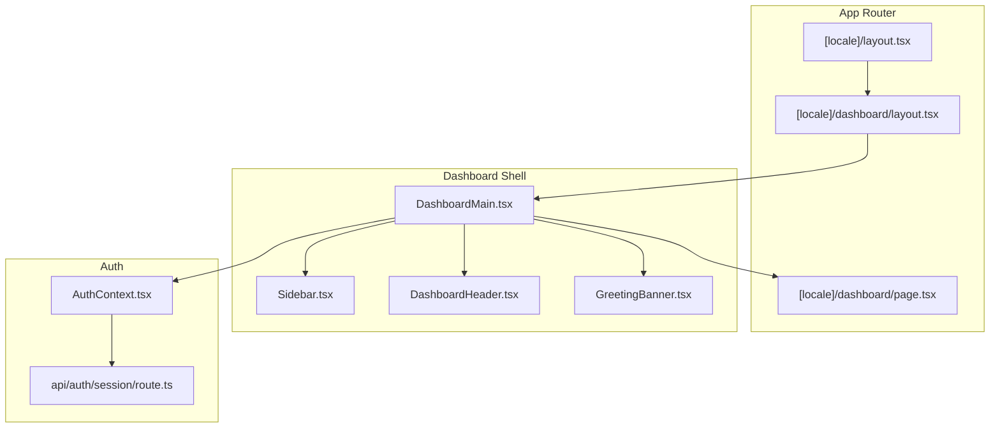
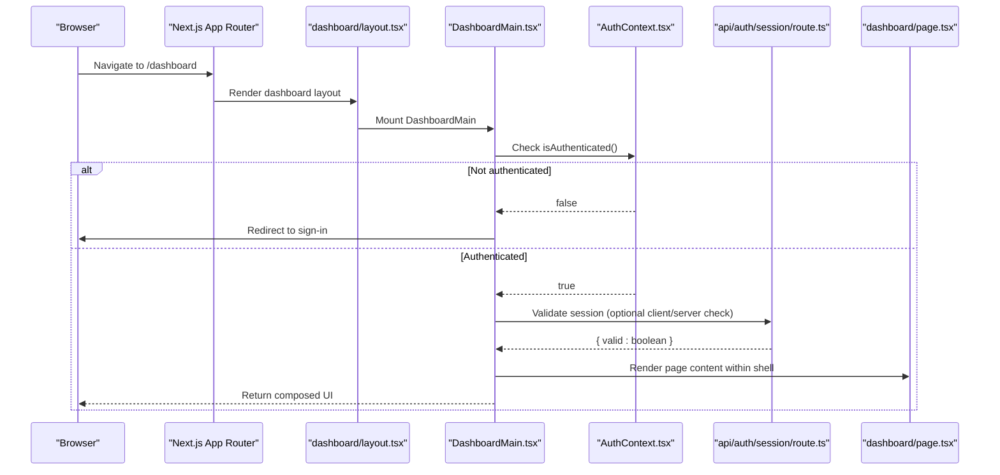
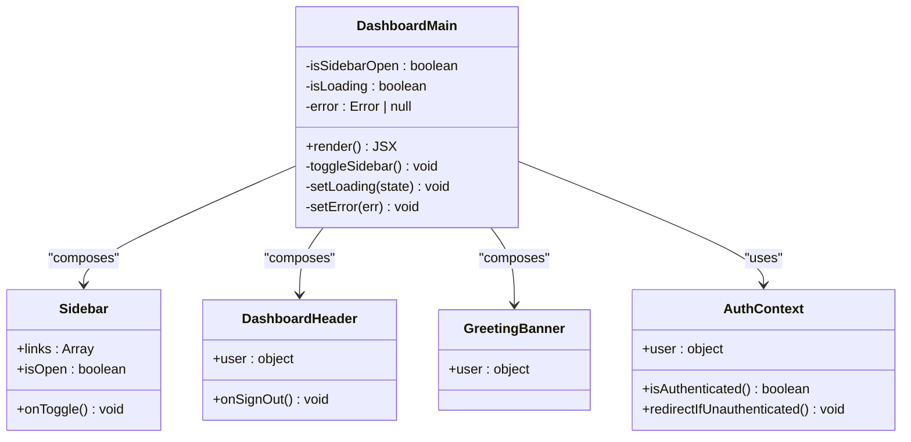
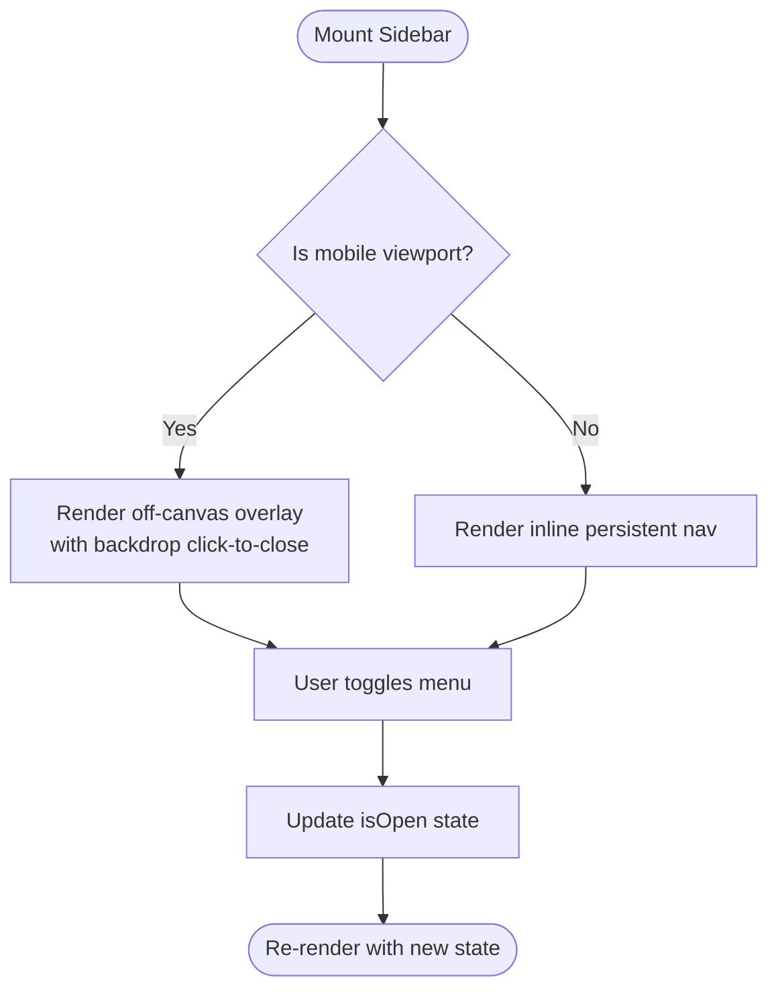
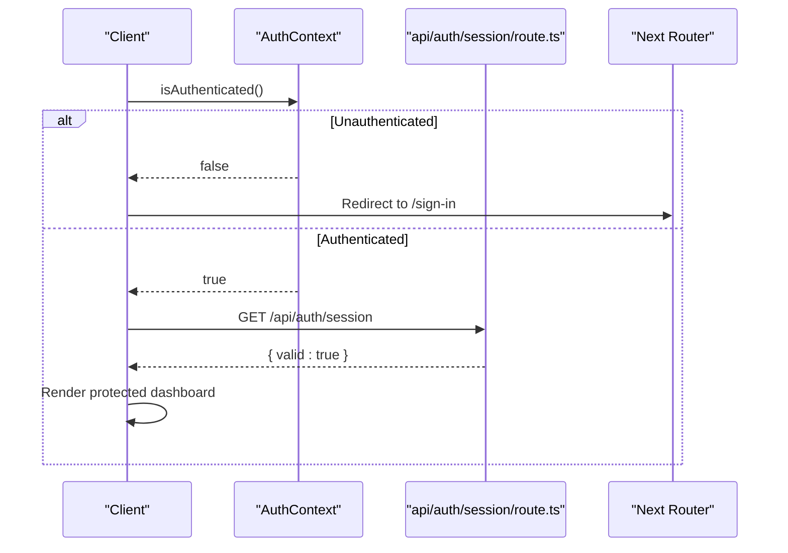
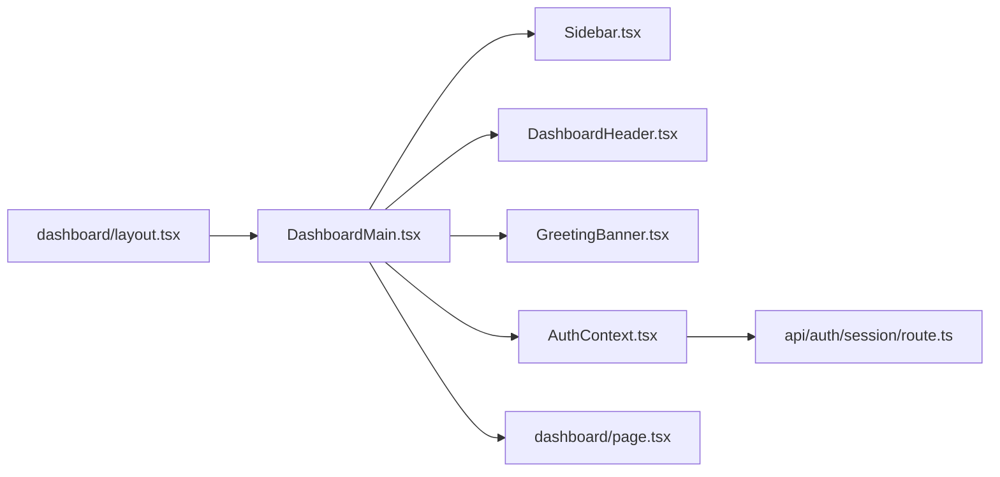

# Dashboard Layout Architecture

<cite>
**Referenced Files in This Document**
- [layout.tsx](file://app/[locale]/dashboard/layout.tsx)
- [DashboardMain.tsx](file://app/[locale]/dashboard/_components/DashboardMain.tsx)
- [Sidebar.tsx](file://app/[locale]/dashboard/_components/Sidebar/Sidebar.tsx)
- [DashboardHeader.tsx](file://app/[locale]/dashboard/_components/Header/DashboardHeader.tsx)
- [GreetingBanner.tsx](file://app/[locale]/dashboard/_components/GreetingBanner.tsx)
- [AuthContext.tsx](file://contexts/AuthContext.tsx)
- [sidebar-context.tsx](file://contexts/sidebar-context.tsx)
- [route.ts](file://app/api/auth/session/route.ts)
- [layout.tsx](file://app/[locale]/(auth)/layout.tsx)
- [page.tsx](file://app/[locale]/dashboard/page.tsx)
</cite>

## Table of Contents
1. [Introduction](#introduction)
2. [Project Structure](#project-structure)
3. [Core Components](#core-components)
4. [Architecture Overview](#architecture-overview)
5. [Detailed Component Analysis](#detailed-component-analysis)
6. [Dependency Analysis](#dependency-analysis)
7. [Performance Considerations](#performance-considerations)
8. [Troubleshooting Guide](#troubleshooting-guide)
9. [Conclusion](#conclusion)
10. [Appendices](#appendices)

## Introduction
This document explains the dashboard layout architecture built with Next.js App Router. It covers protected route structure, layout composition patterns, and component hierarchy. The DashboardMain component is documented as the central orchestrator for state, loading, and error boundaries. Responsive design strategies (mobile-first, grid layouts, adaptive navigation), authentication guards, route protection, and session validation are also detailed. Practical examples show how to extend the layout, add new variants, and implement conditional rendering based on user roles.

## Project Structure
The dashboard resides under app/[locale]/dashboard and uses a nested layout pattern:
- A root dashboard layout composes shared chrome (header, sidebar) and renders page content.
- A central DashboardMain orchestrates layout state, loading, and error handling.
- Sidebar and Header provide navigation and top-level actions.
- AuthContext provides authentication state and guards.
- An API route validates sessions server-side.

**Diagram sources**
- [layout.tsx](file://app/[locale]/dashboard/layout.tsx)
- [DashboardMain.tsx](file://app/[locale]/dashboard/_components/DashboardMain.tsx)
- [Sidebar.tsx](file://app/[locale]/dashboard/_components/Sidebar/Sidebar.tsx)
- [DashboardHeader.tsx](file://app/[locale]/dashboard/_components/Header/DashboardHeader.tsx)
- [GreetingBanner.tsx](file://app/[locale]/dashboard/_components/GreetingBanner.tsx)
- [AuthContext.tsx](file://contexts/AuthContext.tsx)
- [route.ts](file://app/api/auth/session/route.ts)
- [page.tsx](file://app/[locale]/dashboard/page.tsx)

**Section sources**
- [layout.tsx](file://app/[locale]/dashboard/layout.tsx)
- [page.tsx](file://app/[locale]/dashboard/page.tsx)

## Core Components
- DashboardMain: Central orchestrator that composes header, sidebar, greeting banner, and page content; manages responsive sidebar state, loading states, and error boundaries.
- Sidebar: Navigation panel with links to dashboard routes; collapses on mobile and can be toggled via context or props.
- DashboardHeader: Top bar with branding, actions, and user controls; may integrate with auth context for sign-out or profile access.
- GreetingBanner: Contextual welcome area showing user-specific info and quick actions.
- AuthContext: Provides authenticated user state and helpers for guards and redirects.
- Session API Route: Validates current session server-side for protected routes.

Key responsibilities:
- Composition: DashboardMain composes shell components and children.
- State: Manages sidebar open/close and global loading/error states.
- Guards: Uses AuthContext to enforce authentication before rendering dashboard content.
- Responsiveness: Adapts layout for mobile vs desktop using Tailwind classes and context-driven behavior.

**Section sources**
- [DashboardMain.tsx](file://app/[locale]/dashboard/_components/DashboardMain.tsx)
- [Sidebar.tsx](file://app/[locale]/dashboard/_components/Sidebar/Sidebar.tsx)
- [DashboardHeader.tsx](file://app/[locale]/dashboard/_components/Header/DashboardHeader.tsx)
- [GreetingBanner.tsx](file://app/[locale]/dashboard/_components/GreetingBanner.tsx)
- [AuthContext.tsx](file://contexts/AuthContext.tsx)
- [route.ts](file://app/api/auth/session/route.ts)

## Architecture Overview
The dashboard follows a layered layout approach:
- Locale wrapper layout sets global HTML attributes and providers.
- Dashboard layout wraps all dashboard pages with shared chrome.
- DashboardMain orchestrates UI state and renders the final shell.
- Page components render feature-specific content inside the shell.

**Diagram sources**
- [layout.tsx](file://app/[locale]/dashboard/layout.tsx)
- [DashboardMain.tsx](file://app/[locale]/dashboard/_components/DashboardMain.tsx)
- [AuthContext.tsx](file://contexts/AuthContext.tsx)
- [route.ts](file://app/api/auth/session/route.ts)
- [page.tsx](file://app/[locale]/dashboard/page.tsx)

## Detailed Component Analysis

### DashboardMain Orchestrator
Responsibilities:
- Compose header, sidebar, greeting banner, and page content.
- Manage sidebar toggle state for responsive behavior.
- Provide loading and error boundary wrappers around page content.
- Integrate with AuthContext to guard access and conditionally render UI.

**Diagram sources**
- [DashboardMain.tsx](file://app/[locale]/dashboard/_components/DashboardMain.tsx)
- [Sidebar.tsx](file://app/[locale]/dashboard/_components/Sidebar/Sidebar.tsx)
- [DashboardHeader.tsx](file://app/[locale]/dashboard/_components/Header/DashboardHeader.tsx)
- [GreetingBanner.tsx](file://app/[locale]/dashboard/_components/GreetingBanner.tsx)
- [AuthContext.tsx](file://contexts/AuthContext.tsx)

Implementation notes:
- Use Tailwind responsive utilities for mobile-first layout (e.g., hidden/block on small screens).
- Wrap page content with a lightweight error boundary to catch rendering errors.
- Show skeleton loaders while fetching initial data.

**Section sources**
- [DashboardMain.tsx](file://app/[locale]/dashboard/_components/DashboardMain.tsx)

### Sidebar and Adaptive Navigation
- Renders navigation links for dashboard sections.
- Collapses off-canvas on mobile; becomes fixed/sticky on larger screens.
- Can be controlled by local state or shared context.

**Diagram sources**
- [Sidebar.tsx](file://app/[locale]/dashboard/_components/Sidebar/Sidebar.tsx)

**Section sources**
- [Sidebar.tsx](file://app/[locale]/dashboard/_components/Sidebar/Sidebar.tsx)

### DashboardHeader and User Controls
- Displays branding, search, notifications, and user menu.
- Integrates with AuthContext for sign-out and profile navigation.
- May include theme switcher and language selector.

**Section sources**
- [DashboardHeader.tsx](file://app/[locale]/dashboard/_components/Header/DashboardHeader.tsx)

### GreetingBanner
- Shows personalized greeting and quick actions.
- Pulls user info from AuthContext.

**Section sources**
- [GreetingBanner.tsx](file://app/[locale]/dashboard/_components/GreetingBanner.tsx)

### Authentication Guards and Route Protection
- Client-side guard: use AuthContext to check authentication before rendering dashboard content; redirect to sign-in if not authenticated.
- Server-side validation: call api/auth/session to verify session when needed (e.g., during SSR/SSG or API calls).
- Protected route group: place dashboard routes under a group that enforces auth at the layout level.

**Diagram sources**
- [AuthContext.tsx](file://contexts/AuthContext.tsx)
- [route.ts](file://app/api/auth/session/route.ts)

**Section sources**
- [AuthContext.tsx](file://contexts/AuthContext.tsx)
- [route.ts](file://app/api/auth/session/route.ts)

### Responsive Design Implementation
- Mobile-first base styles ensure core functionality works on small screens.
- Grid layouts adapt columns and spacing across breakpoints.
- Navigation adapts between off-canvas and inline modes.
- Use Tailwind’s responsive prefixes and container queries where appropriate.

Practical tips:
- Prefer stacking layouts on small screens and multi-column grids on md+.
- Keep touch targets large enough for mobile interactions.
- Avoid horizontal overflow by constraining widths and enabling wrapping.

**Section sources**
- [DashboardMain.tsx](file://app/[locale]/dashboard/_components/DashboardMain.tsx)
- [Sidebar.tsx](file://app/[locale]/dashboard/_components/Sidebar/Sidebar.tsx)
- [DashboardHeader.tsx](file://app/[locale]/dashboard/_components/Header/DashboardHeader.tsx)

### Extending the Layout and Adding Variants
To extend the dashboard layout:
- Create a new variant component (e.g., DashboardVariantCompact) that reuses DashboardMain but changes header/sidebar configuration.
- Compose it in the dashboard layout file and select it based on query params or user preferences.
- For role-based variants, read user roles from AuthContext and render different shells accordingly.

Example steps:
- Add a new component under _components that mirrors DashboardMain’s contract.
- In the dashboard layout, import the variant and conditionally render it.
- Persist user preference in localStorage or a server setting.

**Section sources**
- [layout.tsx](file://app/[locale]/dashboard/layout.tsx)
- [DashboardMain.tsx](file://app/[locale]/dashboard/_components/DashboardMain.tsx)

### Conditional Rendering Based on User Roles
- Read roles from AuthContext.user.roles.
- Conditionally render sidebar items, header actions, or entire sections.
- For strict enforcement, gate sensitive pages behind additional checks in their own layouts or components.

**Section sources**
- [AuthContext.tsx](file://contexts/AuthContext.tsx)

## Dependency Analysis
High-level dependencies among dashboard components and services:

**Diagram sources**
- [layout.tsx](file://app/[locale]/dashboard/layout.tsx)
- [DashboardMain.tsx](file://app/[locale]/dashboard/_components/DashboardMain.tsx)
- [Sidebar.tsx](file://app/[locale]/dashboard/_components/Sidebar/Sidebar.tsx)
- [DashboardHeader.tsx](file://app/[locale]/dashboard/_components/Header/DashboardHeader.tsx)
- [GreetingBanner.tsx](file://app/[locale]/dashboard/_components/GreetingBanner.tsx)
- [AuthContext.tsx](file://contexts/AuthContext.tsx)
- [route.ts](file://app/api/auth/session/route.ts)
- [page.tsx](file://app/[locale]/dashboard/page.tsx)

**Section sources**
- [layout.tsx](file://app/[locale]/dashboard/layout.tsx)
- [DashboardMain.tsx](file://app/[locale]/dashboard/_components/DashboardMain.tsx)
- [AuthContext.tsx](file://contexts/AuthContext.tsx)
- [route.ts](file://app/api/auth/session/route.ts)

## Performance Considerations
- Minimize re-renders by memoizing expensive computations and stable references for props.
- Defer heavy operations until after first paint using requestIdleCallback or code splitting.
- Use React.lazy and Suspense for non-critical components.
- Optimize images and assets; leverage Next.js image optimization.
- Debounce input events and network requests where applicable.

## Troubleshooting Guide
Common issues and resolutions:
- Infinite redirect loops: Ensure guards do not redirect to the same protected route; handle unauthenticated flows correctly.
- Sidebar not closing on mobile: Verify event listeners for backdrop clicks and state updates.
- Missing user data: Confirm session validation succeeds and user context is populated.
- Layout breaks on small screens: Inspect Tailwind breakpoints and container constraints.

Operational checks:
- Validate session endpoint returns expected shape.
- Log guard decisions without exposing secrets.
- Test role-based visibility across browsers and devices.

**Section sources**
- [AuthContext.tsx](file://contexts/AuthContext.tsx)
- [route.ts](file://app/api/auth/session/route.ts)

## Conclusion
The dashboard layout leverages Next.js App Router’s nested layouts to compose a consistent shell. DashboardMain acts as the orchestrator for state, loading, and error handling, while AuthContext and the session API route enforce protection. The design is mobile-first with adaptive navigation and grid layouts. Extensibility is straightforward through variant components and role-based conditional rendering.

## Appendices

### Practical Examples

- Extend the layout with a compact variant:
  - Create a new component mirroring DashboardMain’s interface.
  - Import and conditionally render it in the dashboard layout based on user preference.

- Add a new layout variant for admin users:
  - Read roles from AuthContext.
  - Render an admin-only sidebar section and header actions.

- Implement conditional rendering based on roles:
  - Gate specific features behind role checks.
  - Provide fallback UI for unauthorized users.

**Section sources**
- [layout.tsx](file://app/[locale]/dashboard/layout.tsx)
- [DashboardMain.tsx](file://app/[locale]/dashboard/_components/DashboardMain.tsx)
- [AuthContext.tsx](file://contexts/AuthContext.tsx)