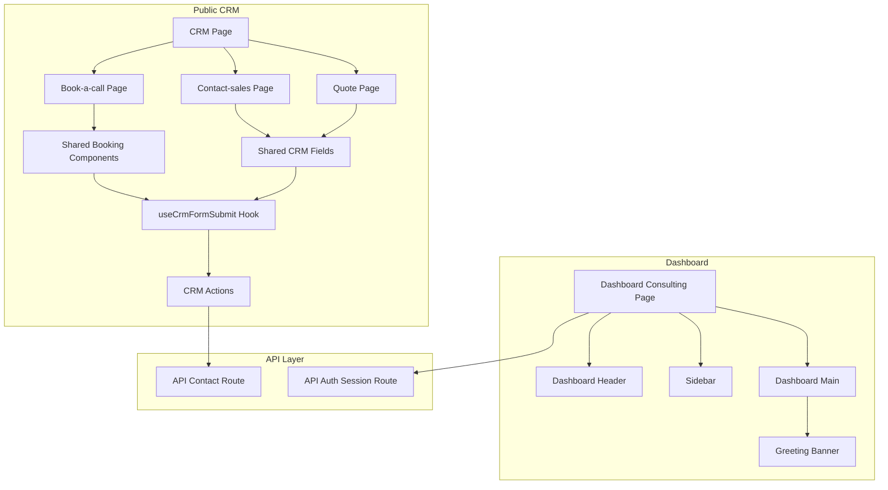
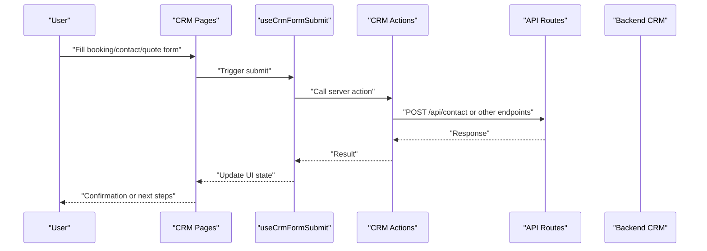
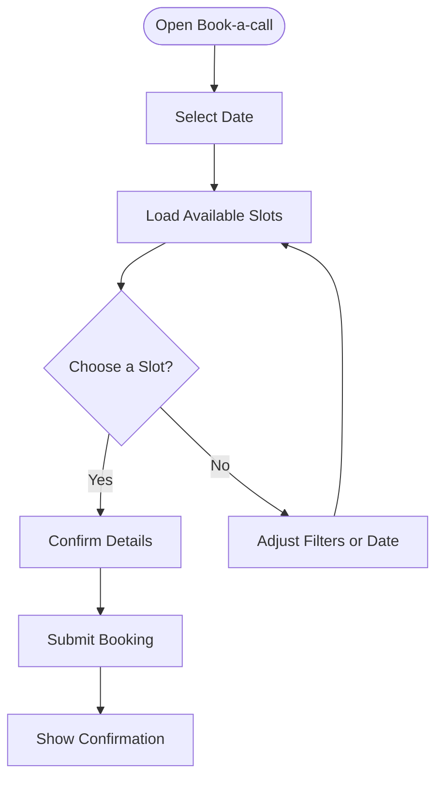
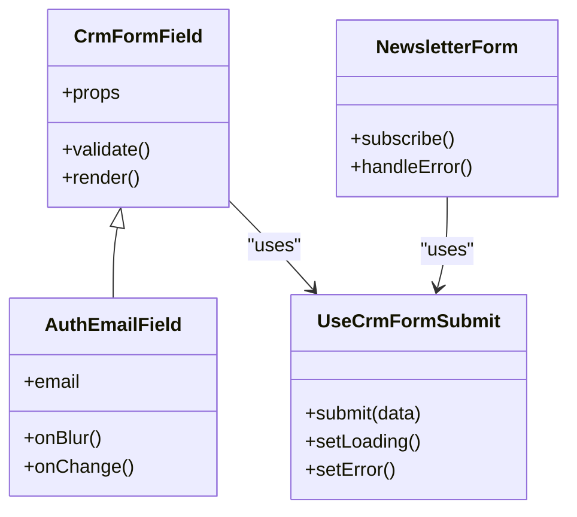
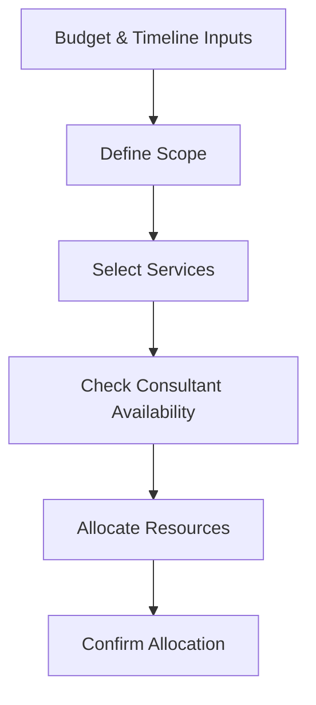
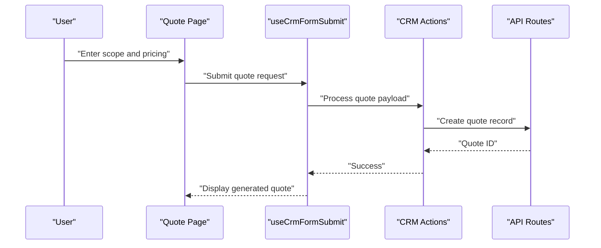
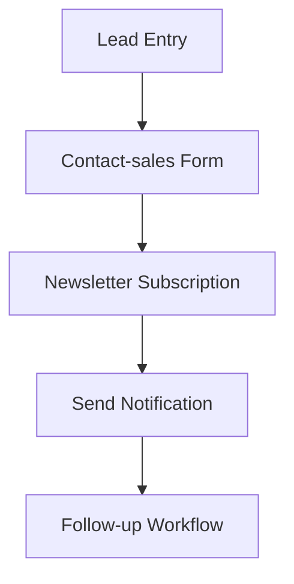
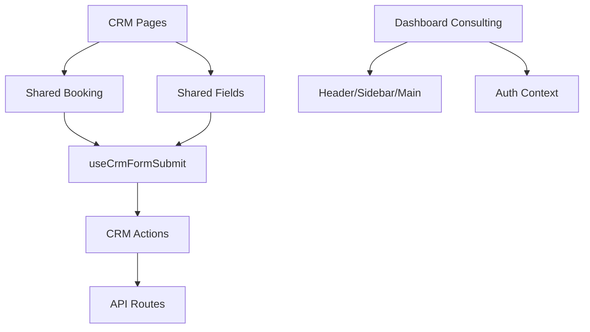

# Consulting Tools

<cite>
**Referenced Files in This Document**
- [CRM Client Page](file://app/[locale]/(routes)/crm/CrmClientPage.tsx)
- [Budget Timeline Fields](file://app/[locale]/(routes)/crm/BudgetTimelineFields.tsx)
- [CrmFormField](file://app/[locale]/(routes)/crm/_components/crm-shared/fields/CrmFormField.tsx)
- [Auth Email Field](file://app/[locale]/(routes)/crm/_components/crm-shared/fields/AuthEmailField.tsx)
- [Newsletter Form](file://app/[locale]/(routes)/crm/_components/crm-shared/fields/NewsletterForm.tsx)
- [Booking Date Picker](file://app/[locale]/(routes)/crm/_components/crm-shared/booking/DatePicker.tsx)
- [Slot Picker](file://app/[locale]/(routes)/crm/_components/crm-shared/booking/SlotPicker.tsx)
- [CRM Form Submit Hook](file://app/[locale]/(routes)/crm/_components/hooks/useCrmFormSubmit.ts)
- [Book Call Client Page](file://app/[locale]/(routes)/crm/book-a-call/_components/BookCallClientPage.tsx)
- [Contact Sales Client Page](file://app/[locale]/(routes)/crm/contact-sales/_components/ContactClientPage.tsx)
- [Quote Client Page](file://app/[locale]/(routes)/crm/quote/_components/QuoteClientPage.tsx)
- [CRM Actions](file://app/[locale]/(routes)/crm/actions.ts)
- [CRM Page](file://app/[locale]/(routes)/crm/page.tsx)
- [Dashboard Consulting Page](file://app/[locale]/dashboard/(routes)/consulting/page.tsx)
- [Dashboard Header](file://app/[locale]/dashboard/_components/Header/DashboardHeader.tsx)
- [Sidebar](file://app/[locale]/dashboard/_components/Sidebar/Sidebar.tsx)
- [Dashboard Main](file://app/[locale]/dashboard/_components/DashboardMain.tsx)
- [Greeting Banner](file://app/[locale]/dashboard/_components/GreetingBanner.tsx)
- [API Contact Route](file://app/api/contact/route.ts)
- [API Session Route](file://app/api/auth/session/route.ts)
- [Auth Context](file://contexts/AuthContext.tsx)
- [CRM API Notes](file://doc/AUTOMEX_Backend_CRM_API_Notes.md)
- [NextJS CRM Guide](file://doc/AUTOMEX_CRM_API_NextJS_Guide.md)
</cite>

## Table of Contents
1. [Introduction](#introduction)
2. [Project Structure](#project-structure)
3. [Core Components](#core-components)
4. [Architecture Overview](#architecture-overview)
5. [Detailed Component Analysis](#detailed-component-analysis)
6. [Dependency Analysis](#dependency-analysis)
7. [Performance Considerations](#performance-considerations)
8. [Troubleshooting Guide](#troubleshooting-guide)
9. [Conclusion](#conclusion)
10. [Appendices](#appendices)

## Introduction
This document explains the consulting tools and resources implemented in the frontend application, focusing on consultation scheduling, client meeting management, resource allocation, proposal generation, time tracking, billing integration, client communication, document sharing, and collaboration features. It also provides guidance for customizing workflows, adding integrations, and extending reporting capabilities.

The implementation centers around a CRM module with booking flows, form handling, and server actions, alongside a dashboard area for consulting operations.

## Project Structure
The consulting-related functionality is primarily located under:
- app/[locale]/(routes)/crm: Public-facing CRM pages (book-a-call, contact-sales, quote), shared booking components, form fields, hooks, and actions.
- app/[locale]/dashboard/(routes)/consulting: Dashboard entry point for consulting operations.
- app/api: Server routes for contact submission and session management.
- contexts: Authentication context used across the app.
- doc: Backend CRM API notes and Next.js integration guide.

**Diagram sources**
- [CRM Page](file://app/[locale]/(routes)/crm/page.tsx)
- [Book Call Client Page](file://app/[locale]/(routes)/crm/book-a-call/_components/BookCallClientPage.tsx)
- [Contact Sales Client Page](file://app/[locale]/(routes)/crm/contact-sales/_components/ContactClientPage.tsx)
- [Quote Client Page](file://app/[locale]/(routes)/crm/quote/_components/QuoteClientPage.tsx)
- [Booking Date Picker](file://app/[locale]/(routes)/crm/_components/crm-shared/booking/DatePicker.tsx)
- [Slot Picker](file://app/[locale]/(routes)/crm/_components/crm-shared/booking/SlotPicker.tsx)
- [CrmFormField](file://app/[locale]/(routes)/crm/_components/crm-shared/fields/CrmFormField.tsx)
- [Auth Email Field](file://app/[locale]/(routes)/crm/_components/crm-shared/fields/AuthEmailField.tsx)
- [Newsletter Form](file://app/[locale]/(routes)/crm/_components/crm-shared/fields/NewsletterForm.tsx)
- [CRM Form Submit Hook](file://app/[locale]/(routes)/crm/_components/hooks/useCrmFormSubmit.ts)
- [CRM Actions](file://app/[locale]/(routes)/crm/actions.ts)
- [API Contact Route](file://app/api/contact/route.ts)
- [API Session Route](file://app/api/auth/session/route.ts)
- [Dashboard Consulting Page](file://app/[locale]/dashboard/(routes)/consulting/page.tsx)
- [Dashboard Header](file://app/[locale]/dashboard/_components/Header/DashboardHeader.tsx)
- [Sidebar](file://app/[locale]/dashboard/_components/Sidebar/Sidebar.tsx)
- [Dashboard Main](file://app/[locale]/dashboard/_components/DashboardMain.tsx)
- [Greeting Banner](file://app/[locale]/dashboard/_components/GreetingBanner.tsx)

**Section sources**
- [CRM Page](file://app/[locale]/(routes)/crm/page.tsx)
- [Dashboard Consulting Page](file://app/[locale]/dashboard/(routes)/consulting/page.tsx)

## Core Components
- CRM Pages: Provide entry points for booking calls, contacting sales, and generating quotes. They compose shared booking and form components to collect user inputs and submit them via server actions or API routes.
- Shared Booking Components: DatePicker and SlotPicker enable selecting dates and available slots for consultations.
- Shared CRM Fields: Reusable form fields such as CrmFormField, AuthEmailField, and NewsletterForm standardize input behavior and validation.
- useCrmFormSubmit Hook: Centralizes form submission logic for CRM flows, coordinating data preparation and dispatch to backend endpoints.
- CRM Actions: Server-side handlers invoked by client forms to process submissions and interact with backend APIs.
- Dashboard Consulting: A dedicated page within the dashboard for consulting operations, integrated with header, sidebar, and main layout components.

Key responsibilities:
- Scheduling: Collect date/time preferences and validate availability through slot selection.
- Client intake: Gather contact details and project requirements using standardized fields.
- Proposal generation: Capture scope and budget information to produce quotes.
- Submission orchestration: Normalize payloads and call appropriate API endpoints.

**Section sources**
- [Book Call Client Page](file://app/[locale]/(routes)/crm/book-a-call/_components/BookCallClientPage.tsx)
- [Contact Sales Client Page](file://app/[locale]/(routes)/crm/contact-sales/_components/ContactClientPage.tsx)
- [Quote Client Page](file://app/[locale]/(routes)/crm/quote/_components/QuoteClientPage.tsx)
- [Booking Date Picker](file://app/[locale]/(routes)/crm/_components/crm-shared/booking/DatePicker.tsx)
- [Slot Picker](file://app/[locale]/(routes)/crm/_components/crm-shared/booking/SlotPicker.tsx)
- [CrmFormField](file://app/[locale]/(routes)/crm/_components/crm-shared/fields/CrmFormField.tsx)
- [Auth Email Field](file://app/[locale]/(routes)/crm/_components/crm-shared/fields/AuthEmailField.tsx)
- [Newsletter Form](file://app/[locale]/(routes)/crm/_components/crm-shared/fields/NewsletterForm.tsx)
- [CRM Form Submit Hook](file://app/[locale]/(routes)/crm/_components/hooks/useCrmFormSubmit.ts)
- [CRM Actions](file://app/[locale]/(routes)/crm/actions.ts)
- [Dashboard Consulting Page](file://app/[locale]/dashboard/(routes)/consulting/page.tsx)

## Architecture Overview
The consulting workflow follows a layered architecture:
- UI layer: React components render forms and interactive scheduling widgets.
- Hook layer: useCrmFormSubmit orchestrates state and submission logic.
- Server actions: CRM actions handle business logic and API calls.
- API routes: Endpoints persist data and integrate with external systems.
- Dashboard: Provides an authenticated view for consulting operations.

**Diagram sources**
- [CRM Form Submit Hook](file://app/[locale]/(routes)/crm/_components/hooks/useCrmFormSubmit.ts)
- [CRM Actions](file://app/[locale]/(routes)/crm/actions.ts)
- [API Contact Route](file://app/api/contact/route.ts)
- [CRM Page](file://app/[locale]/(routes)/crm/page.tsx)

## Detailed Component Analysis

### Consultation Scheduling
Scheduling is composed of:
- DatePicker: Presents calendar navigation and date selection.
- SlotPicker: Displays available time slots based on selected date and constraints.
- Book-a-call flow: Captures user intent, validates inputs, and submits via server actions.

**Diagram sources**
- [Booking Date Picker](file://app/[locale]/(routes)/crm/_components/crm-shared/booking/DatePicker.tsx)
- [Slot Picker](file://app/[locale]/(routes)/crm/_components/crm-shared/booking/SlotPicker.tsx)
- [Book Call Client Page](file://app/[locale]/(routes)/crm/book-a-call/_components/BookCallClientPage.tsx)
- [CRM Form Submit Hook](file://app/[locale]/(routes)/crm/_components/hooks/useCrmFormSubmit.ts)

**Section sources**
- [Booking Date Picker](file://app/[locale]/(routes)/crm/_components/crm-shared/booking/DatePicker.tsx)
- [Slot Picker](file://app/[locale]/(routes)/crm/_components/crm-shared/booking/SlotPicker.tsx)
- [Book Call Client Page](file://app/[locale]/(routes)/crm/book-a-call/_components/BookCallClientPage.tsx)

### Client Meeting Management
Meeting management integrates with the CRM pages:
- Contact-sales captures lead details and initial requirements.
- Shared fields ensure consistent data collection and validation.
- The hook centralizes submission and error handling.

**Diagram sources**
- [CrmFormField](file://app/[locale]/(routes)/crm/_components/crm-shared/fields/CrmFormField.tsx)
- [Auth Email Field](file://app/[locale]/(routes)/crm/_components/crm-shared/fields/AuthEmailField.tsx)
- [Newsletter Form](file://app/[locale]/(routes)/crm/_components/crm-shared/fields/NewsletterForm.tsx)
- [CRM Form Submit Hook](file://app/[locale]/(routes)/crm/_components/hooks/useCrmFormSubmit.ts)

**Section sources**
- [Contact Sales Client Page](file://app/[locale]/(routes)/crm/contact-sales/_components/ContactClientPage.tsx)
- [CrmFormField](file://app/[locale]/(routes)/crm/_components/crm-shared/fields/CrmFormField.tsx)
- [Auth Email Field](file://app/[locale]/(routes)/crm/_components/crm-shared/fields/AuthEmailField.tsx)
- [Newsletter Form](file://app/[locale]/(routes)/crm/_components/crm-shared/fields/NewsletterForm.tsx)
- [CRM Form Submit Hook](file://app/[locale]/(routes)/crm/_components/hooks/useCrmFormSubmit.ts)

### Resource Allocation
Resource allocation is supported by:
- Budget timeline fields that capture budget ranges and timelines.
- Service multi-select to indicate required services.
- These inputs inform consultant assignment and capacity planning.

**Diagram sources**
- [Budget Timeline Fields](file://app/[locale]/(routes)/crm/BudgetTimelineFields.tsx)

**Section sources**
- [Budget Timeline Fields](file://app/[locale]/(routes)/crm/BudgetTimelineFields.tsx)

### Proposal Generation
Proposal generation is driven by:
- Quote page capturing scope, deliverables, and pricing parameters.
- Shared fields standardize input structure.
- Server actions transform inputs into proposal-ready payloads.

**Diagram sources**
- [Quote Client Page](file://app/[locale]/(routes)/crm/quote/_components/QuoteClientPage.tsx)
- [CRM Form Submit Hook](file://app/[locale]/(routes)/crm/_components/hooks/useCrmFormSubmit.ts)
- [CRM Actions](file://app/[locale]/(routes)/crm/actions.ts)
- [API Contact Route](file://app/api/contact/route.ts)

**Section sources**
- [Quote Client Page](file://app/[locale]/(routes)/crm/quote/_components/QuoteClientPage.tsx)
- [CRM Actions](file://app/[locale]/(routes)/crm/actions.ts)

### Time Tracking and Billing Integration
Time tracking and billing are typically handled by backend systems. The frontend prepares structured payloads via server actions and API routes. Refer to the backend CRM API notes for endpoint contracts and data models.

- Prepare time entries and billing records in server actions.
- Call backend endpoints defined in CRM API documentation.
- Handle responses and update dashboard views accordingly.

**Section sources**
- [CRM API Notes](file://doc/AUTOMEX_Backend_CRM_API_Notes.md)
- [NextJS CRM Guide](file://doc/AUTOMEX_CRM_API_NextJS_Guide.md)
- [CRM Actions](file://app/[locale]/(routes)/crm/actions.ts)

### Client Communication Tools
Communication features include:
- Contact-sales form to initiate conversations.
- Newsletter subscription for updates.
- Optional WhatsApp button component for direct messaging.

**Diagram sources**
- [Contact Sales Client Page](file://app/[locale]/(routes)/crm/contact-sales/_components/ContactClientPage.tsx)
- [Newsletter Form](file://app/[locale]/(routes)/crm/_components/crm-shared/fields/NewsletterForm.tsx)

**Section sources**
- [Contact Sales Client Page](file://app/[locale]/(routes)/crm/contact-sales/_components/ContactClientPage.tsx)
- [Newsletter Form](file://app/[locale]/(routes)/crm/_components/crm-shared/fields/NewsletterForm.tsx)

### Document Sharing and Collaboration
Document sharing and collaboration can be extended by:
- Adding file upload fields to CRM forms.
- Integrating with cloud storage providers via server actions.
- Displaying shared documents in the dashboard consulting page.

[No sources needed since this section provides general guidance]

## Dependency Analysis
The CRM module depends on shared components and hooks, which in turn rely on server actions and API routes. The dashboard consulting page composes layout components and may consume authentication context.

**Diagram sources**
- [CRM Page](file://app/[locale]/(routes)/crm/page.tsx)
- [Book Call Client Page](file://app/[locale]/(routes)/crm/book-a-call/_components/BookCallClientPage.tsx)
- [Contact Sales Client Page](file://app/[locale]/(routes)/crm/contact-sales/_components/ContactClientPage.tsx)
- [Quote Client Page](file://app/[locale]/(routes)/crm/quote/_components/QuoteClientPage.tsx)
- [Booking Date Picker](file://app/[locale]/(routes)/crm/_components/crm-shared/booking/DatePicker.tsx)
- [Slot Picker](file://app/[locale]/(routes)/crm/_components/crm-shared/booking/SlotPicker.tsx)
- [CrmFormField](file://app/[locale]/(routes)/crm/_components/crm-shared/fields/CrmFormField.tsx)
- [Auth Email Field](file://app/[locale]/(routes)/crm/_components/crm-shared/fields/AuthEmailField.tsx)
- [Newsletter Form](file://app/[locale]/(routes)/crm/_components/crm-shared/fields/NewsletterForm.tsx)
- [CRM Form Submit Hook](file://app/[locale]/(routes)/crm/_components/hooks/useCrmFormSubmit.ts)
- [CRM Actions](file://app/[locale]/(routes)/crm/actions.ts)
- [API Contact Route](file://app/api/contact/route.ts)
- [Dashboard Consulting Page](file://app/[locale]/dashboard/(routes)/consulting/page.tsx)
- [Dashboard Header](file://app/[locale]/dashboard/_components/Header/DashboardHeader.tsx)
- [Sidebar](file://app/[locale]/dashboard/_components/Sidebar/Sidebar.tsx)
- [Dashboard Main](file://app/[locale]/dashboard/_components/DashboardMain.tsx)
- [Auth Context](file://contexts/AuthContext.tsx)

**Section sources**
- [CRM Page](file://app/[locale]/(routes)/crm/page.tsx)
- [Dashboard Consulting Page](file://app/[locale]/dashboard/(routes)/consulting/page.tsx)
- [Auth Context](file://contexts/AuthContext.tsx)

## Performance Considerations
- Defer heavy computations in hooks; keep form submission lightweight.
- Cache available slots where possible to reduce repeated requests.
- Validate inputs early to minimize round trips.
- Use optimistic UI updates for better perceived performance.
- Monitor network latency for API calls and implement retries for transient failures.

[No sources needed since this section provides general guidance]

## Troubleshooting Guide
Common issues and resolutions:
- Form submission errors: Check server action logs and API route responses. Ensure payloads match expected schemas.
- Slot loading failures: Verify date constraints and backend availability endpoints. Implement fallback states.
- Authentication problems: Confirm session validity via auth context and API session route.
- Validation errors: Inspect field-level error messages and schema definitions.

**Section sources**
- [CRM Form Submit Hook](file://app/[locale]/(routes)/crm/_components/hooks/useCrmFormSubmit.ts)
- [CRM Actions](file://app/[locale]/(routes)/crm/actions.ts)
- [API Contact Route](file://app/api/contact/route.ts)
- [API Session Route](file://app/api/auth/session/route.ts)
- [Auth Context](file://contexts/AuthContext.tsx)

## Conclusion
The consulting tools provide a cohesive front-end experience for scheduling, client intake, proposal generation, and basic communication. The modular design with shared components and centralized hooks facilitates customization and extension. For advanced features like time tracking and billing, integrate with backend endpoints documented in the CRM API notes.

[No sources needed since this section summarizes without analyzing specific files]

## Appendices

### Customizing Consultation Workflows
- Add new fields to existing forms using shared field components.
- Extend useCrmFormSubmit to handle additional payload transformations.
- Update CRM actions to route new data to backend endpoints.

**Section sources**
- [CrmFormField](file://app/[locale]/(routes)/crm/_components/crm-shared/fields/CrmFormField.tsx)
- [CRM Form Submit Hook](file://app/[locale]/(routes)/crm/_components/hooks/useCrmFormSubmit.ts)
- [CRM Actions](file://app/[locale]/(routes)/crm/actions.ts)

### Adding New Tool Integrations
- Create server actions to call third-party APIs.
- Securely manage credentials via environment variables.
- Return normalized results to the UI layer.

**Section sources**
- [CRM Actions](file://app/[locale]/(routes)/crm/actions.ts)
- [API Contact Route](file://app/api/contact/route.ts)

### Extending Reporting Capabilities
- Introduce dashboard charts and tables to visualize CRM data.
- Fetch aggregated metrics from backend endpoints.
- Implement filters and date ranges for dynamic reports.

**Section sources**
- [Dashboard Consulting Page](file://app/[locale]/dashboard/(routes)/consulting/page.tsx)
- [Dashboard Main](file://app/[locale]/dashboard/_components/DashboardMain.tsx)
- [CRM API Notes](file://doc/AUTOMEX_Backend_CRM_API_Notes.md)