# Notifications Center

<cite>
**Referenced Files in This Document**
- [page.tsx](file://app/[locale]/dashboard/(routes)/notifications/page.tsx)
</cite>

## Table of Contents
1. [Introduction](#introduction)
2. [Project Structure](#project-structure)
3. [Core Components](#core-components)
4. [Architecture Overview](#architecture-overview)
5. [Detailed Component Analysis](#detailed-component-analysis)
6. [Dependency Analysis](#dependency-analysis)
7. [Performance Considerations](#performance-considerations)
8. [Troubleshooting Guide](#troubleshooting-guide)
9. [Conclusion](#conclusion)
10. [Appendices](#appendices)

## Introduction
This document describes the Notifications Center for the application. It explains how notification types, delivery channels, and user preferences are managed; how real-time updates are handled; how read/unread status and archiving work; and how filtering, search, and bulk operations are implemented. It also provides guidance for extending the system by adding new notification types, implementing custom handlers, and integrating external notification services.

## Project Structure
The Notifications Center is exposed as a dashboard route under the app directory. The primary entry point for the notifications UI is located within the dashboard routes.

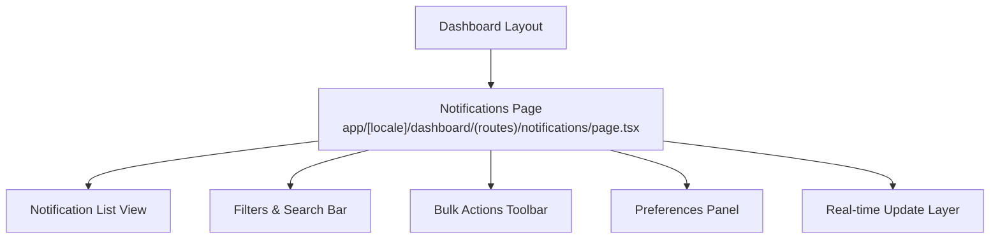

[No sources needed since this diagram shows conceptual workflow, not actual code structure]

## Core Components
- Notification Types: Distinct categories such as system alerts, messages, reminders, and marketing notices. Each type defines metadata like icon, title template, and default channel.
- Delivery Channels: In-app feed, email, SMS, push, and webhooks. Channel selection is driven by user preferences and notification type rules.
- Preference Management: Per-user settings controlling which channels receive which types, quiet hours, digest frequency, and archive behavior.
- Real-time Updates: Live synchronization of new notifications without manual refresh.
- Read/Unread Status: Persistent tracking of whether a notification has been viewed.
- Archiving: Moving notifications out of the active view while preserving them for later retrieval.
- Filtering and Search: Filter by type, date range, channel, and status; full-text search across titles and bodies.
- Bulk Operations: Mark multiple as read, archive multiple, delete multiple, and export selected items.

[No sources needed since this section provides general guidance]

## Architecture Overview
The Notifications Center follows a layered architecture:
- Presentation Layer: Dashboard page and UI components for listing, filtering, searching, and performing actions.
- State Layer: Local state for current filters, selections, and optimistic updates; synchronized with server state.
- Service Layer: API clients for fetching, updating, and managing notifications and preferences.
- Real-time Layer: WebSocket or SSE integration to stream new notifications and status changes.
- Integration Layer: Optional adapters for external services (email/SMS/push providers).

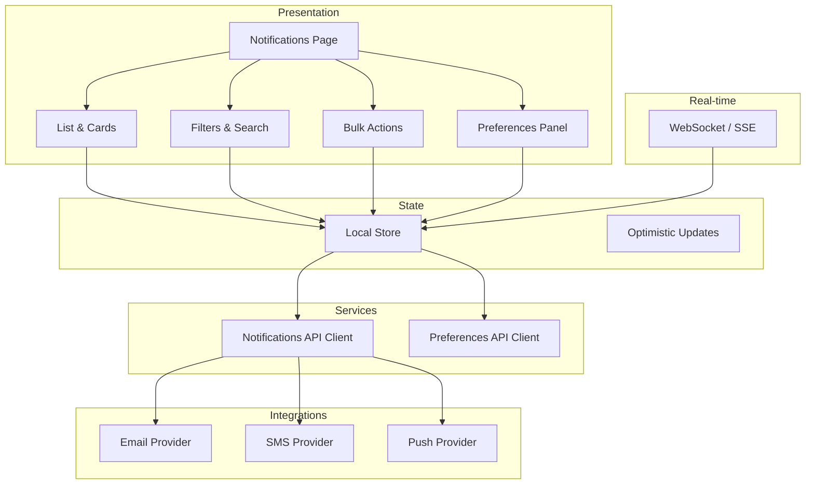

[No sources needed since this diagram shows conceptual workflow, not actual code structure]

## Detailed Component Analysis

### Notifications Page
Responsibilities:
- Renders the notifications list, filters, search bar, and bulk actions toolbar.
- Manages local state for filters, pagination, and selected items.
- Subscribes to real-time updates and applies them to the list.
- Delegates data operations to service layer functions.

Key interactions:
- On mount, fetches initial notifications and preferences.
- Applies filters and search queries to the local store.
- Dispatches bulk actions after confirmation where required.
- Displays real-time additions and status changes inline.

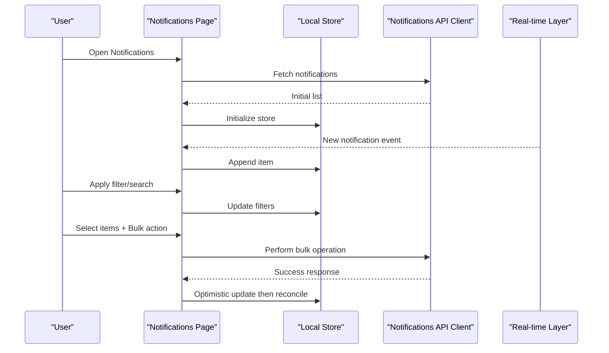

[No sources needed since this diagram shows conceptual workflow, not actual code structure]

### Filters and Search
- Filters include type, status (read/unread/archived), date range, and channel.
- Search supports keyword matching against title and body fields.
- Combined filters are persisted in local state and applied client-side before optional server-side refinement.

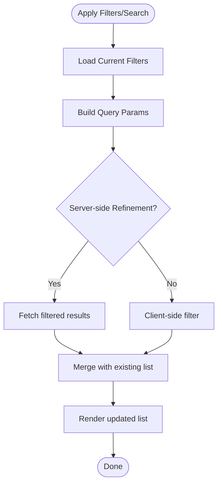

[No sources needed since this diagram shows conceptual workflow, not actual code structure]

### Preferences Management
- Controls per-type channel toggles, quiet hours, digest frequency, and auto-archive thresholds.
- Changes are saved immediately via the preferences API and reflected in real time.
- Defaults are applied if no user preference exists.

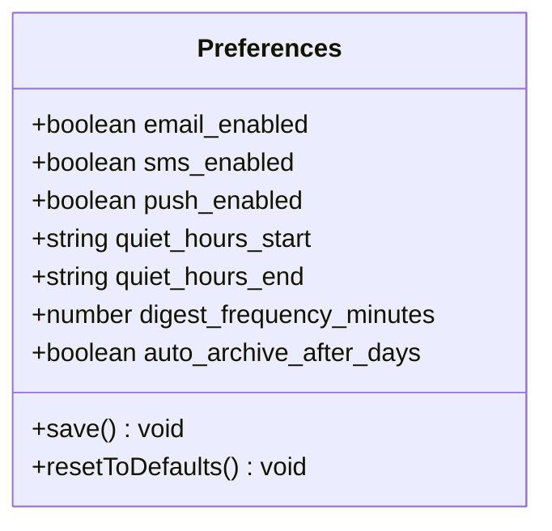

[No sources needed since this diagram shows conceptual workflow, not actual code structure]

### Real-time Updates
- Uses a persistent connection to receive new notifications and status changes.
- Deduplicates incoming events by ID and merges into the local store.
- Handles reconnection and backoff strategies automatically.

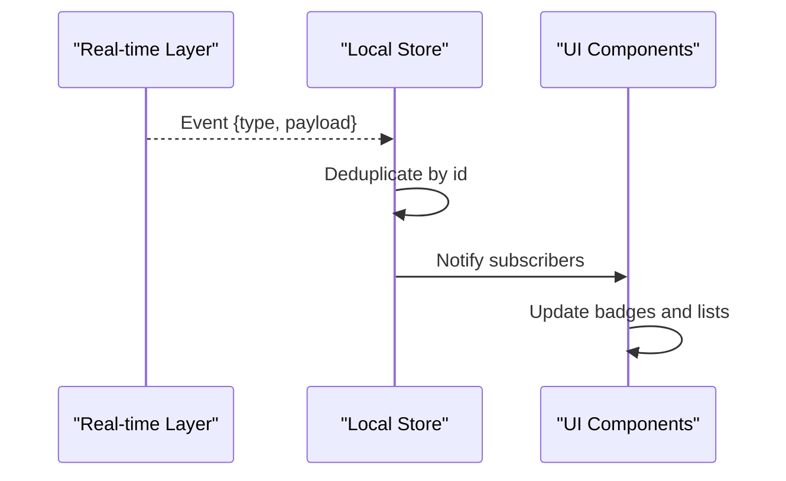

[No sources needed since this diagram shows conceptual workflow, not actual code structure]

### Read/Unread Status Tracking
- Toggling read/unread triggers an immediate optimistic update.
- Server reconciliation ensures consistency after network responses.
- Badge counters reflect unread totals in real time.

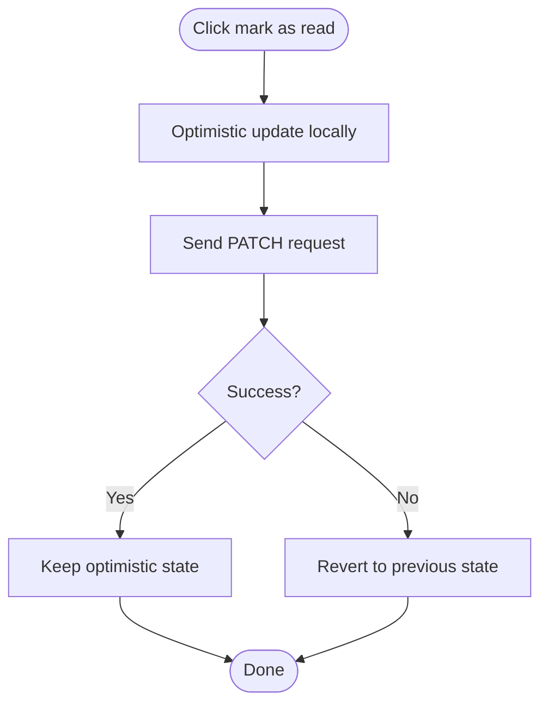

[No sources needed since this diagram shows conceptual workflow, not actual code structure]

### Archiving
- Archive moves notifications out of the active view while keeping them retrievable via a separate archived view or filter.
- Supports bulk archive and restore operations.

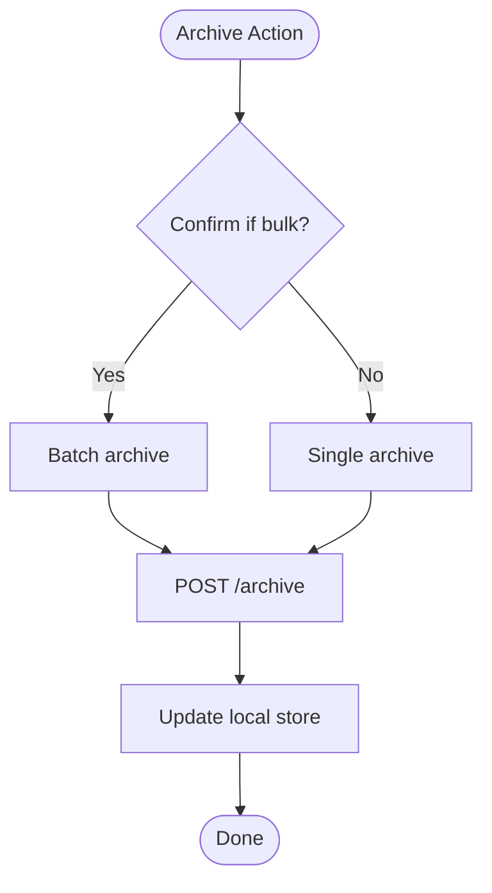

[No sources needed since this diagram shows conceptual workflow, not actual code structure]

### Bulk Operations
- Supported actions: mark as read, archive, delete, export.
- Selection persists across pagination and filters.
- Confirmation dialogs for destructive actions.

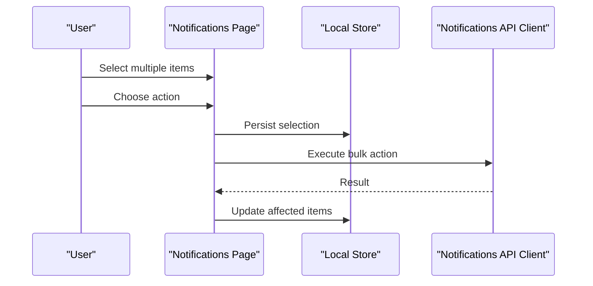

[No sources needed since this diagram shows conceptual workflow, not actual code structure]

### Adding a New Notification Type
Steps:
- Define a new type identifier and metadata (icon, title template, default channels).
- Register the type in the type registry so it appears in filters and preferences.
- Implement any type-specific rendering logic in the list card component.
- Add translation keys for labels and messages.
- Test creation, display, filtering, and bulk operations for the new type.

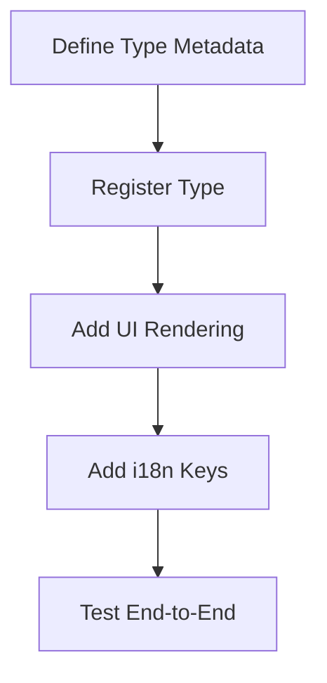

[No sources needed since this diagram shows conceptual workflow, not actual code structure]

### Implementing Custom Notification Handlers
Use cases:
- Deep-link routing based on notification payload.
- Conditional channel selection based on user context.
- Enrichment of notification content before display.

Approach:
- Create a handler function mapped to a notification type or channel.
- Integrate the handler into the processing pipeline before rendering or dispatching.
- Ensure handlers are idempotent and handle missing fields gracefully.

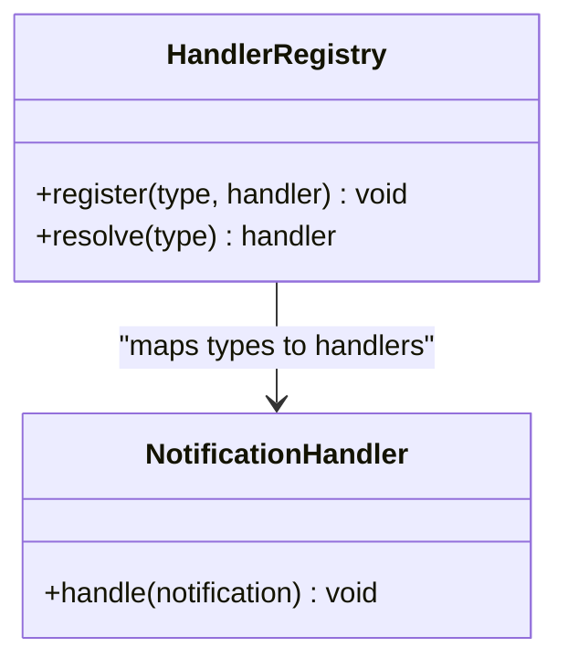

[No sources needed since this diagram shows conceptual workflow, not actual code structure]

### Integrating External Notification Services
- Email/SMS/Push providers are integrated through adapter modules.
- The adapter translates internal notification payloads to provider-specific formats.
- Configuration is centralized and loaded from environment variables.
- Retries and fallbacks are handled at the adapter level.

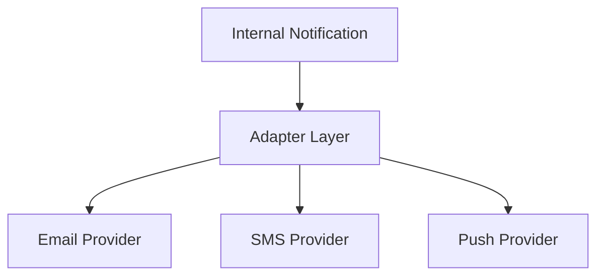

[No sources needed since this diagram shows conceptual workflow, not actual code structure]

## Dependency Analysis
- The Notifications Page depends on:
  - Local state management for filters, selections, and optimistic updates.
  - API clients for notifications and preferences.
  - Real-time layer for live updates.
- External integrations are isolated behind adapters to minimize coupling.

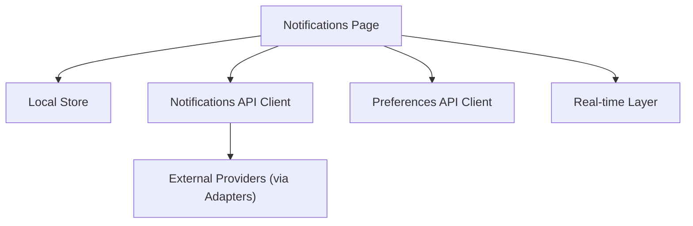

[No sources needed since this diagram shows conceptual workflow, not actual code structure]

## Performance Considerations
- Use virtualized lists for large notification sets to maintain smooth scrolling.
- Debounce search input and combine with server-side search for long lists.
- Prefer incremental updates over full list refreshes for real-time events.
- Cache preferences locally with background sync to reduce API calls.
- Paginate notifications and implement infinite scroll where appropriate.

[No sources needed since this section provides general guidance]

## Troubleshooting Guide
Common issues and resolutions:
- Real-time connection drops: Verify reconnection logic and backoff strategy; check network connectivity and firewall rules.
- Stale state after bulk actions: Ensure server reconciliation occurs and optimistic updates are reverted on failure.
- Missing translations: Confirm all new type labels and messages are added to message bundles.
- Incorrect channel delivery: Validate user preferences and type-channel mappings; inspect adapter logs.

[No sources needed since this section provides general guidance]

## Conclusion
The Notifications Center provides a robust foundation for delivering timely, relevant, and actionable notifications. Its modular design supports extensibility through new types and handlers, flexible delivery via multiple channels, and a strong UX with real-time updates, filtering, search, and bulk operations. Following the guidelines above will help maintain performance, reliability, and ease of evolution.

[No sources needed since this section summarizes without analyzing specific files]

## Appendices

### Example: Adding a New Notification Type
- Define type metadata and register it.
- Add rendering and i18n entries.
- Wire up filters and preferences.
- Test end-to-end flows including real-time updates and bulk operations.

### Example: Custom Handler Implementation
- Implement a handler function for a specific type or channel.
- Register the handler in the registry.
- Use the handler to deep-link, enrich content, or trigger side effects.

### Example: External Service Integration
- Create an adapter for the target provider.
- Map internal payloads to provider schemas.
- Configure credentials and retry policies.
- Validate end-to-end delivery.

[No sources needed since this section provides general guidance]