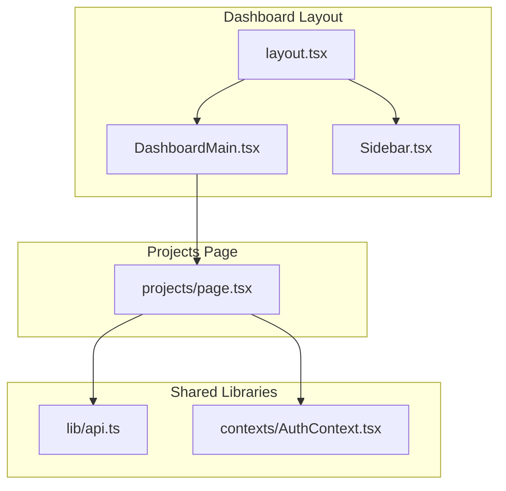
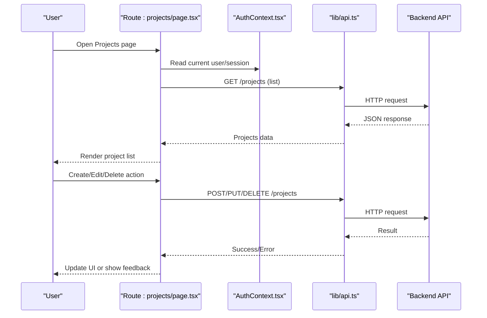
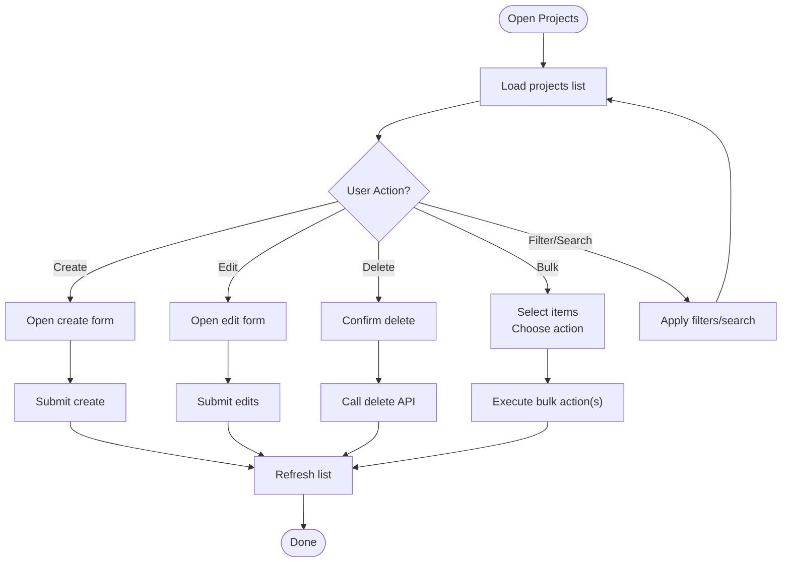
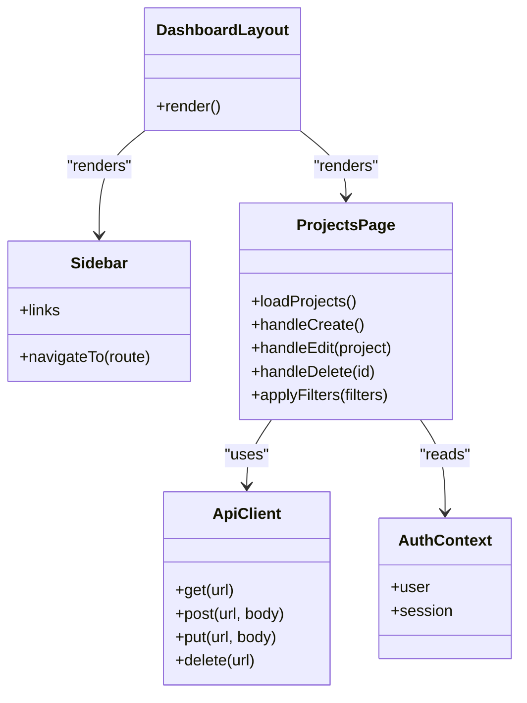
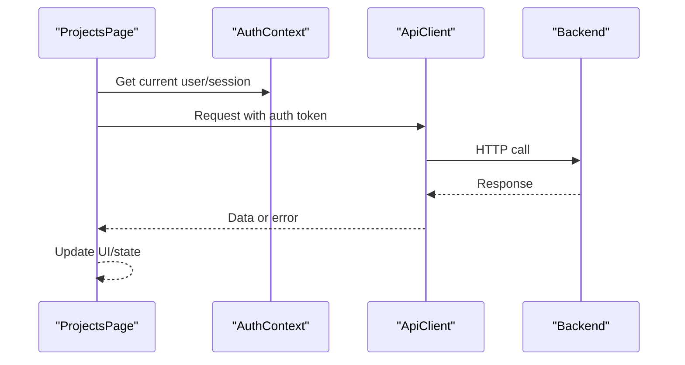
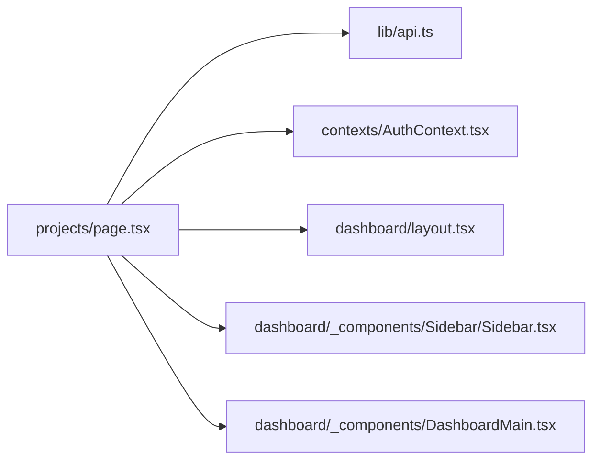

# Projects Management

<cite>
**Referenced Files in This Document**
- [page.tsx](file://app/[locale]/dashboard/(routes)/projects/page.tsx)
- [DashboardMain.tsx](file://app/[locale]/dashboard/_components/DashboardMain.tsx)
- [Sidebar.tsx](file://app/[locale]/dashboard/_components/Sidebar/Sidebar.tsx)
- [layout.tsx](file://app/[locale]/dashboard/layout.tsx)
- [api.ts](file://lib/api.ts)
- [AuthContext.tsx](file://contexts/AuthContext.tsx)
</cite>

## Table of Contents
1. [Introduction](#introduction)
2. [Project Structure](#project-structure)
3. [Core Components](#core-components)
4. [Architecture Overview](#architecture-overview)
5. [Detailed Component Analysis](#detailed-component-analysis)
6. [Dependency Analysis](#dependency-analysis)
7. [Performance Considerations](#performance-considerations)
8. [Troubleshooting Guide](#troubleshooting-guide)
9. [Conclusion](#conclusion)
10. [Appendices](#appendices)

## Introduction
This document explains the Projects management page within the dashboard. It covers how projects are listed, created, edited, and deleted; how project status is tracked; team collaboration features; progress monitoring; templates; bulk operations; search and filtering; extending project properties; adding custom project types; and integrating with external project management tools. The content maps to the Next.js App Router structure used by this frontend application.

## Project Structure
The Projects page is implemented as a route under the dashboard section. It uses shared dashboard layout and navigation components, and communicates with backend APIs via a centralized API client. Authentication context is available for protected routes.

**Diagram sources**
- [layout.tsx:1-200](file://app/[locale]/dashboard/layout.tsx#L1-L200)
- [DashboardMain.tsx:1-200](file://app/[locale]/dashboard/_components/DashboardMain.tsx#L1-L200)
- [Sidebar.tsx:1-200](file://app/[locale]/dashboard/_components/Sidebar/Sidebar.tsx#L1-L200)
- [page.tsx:1-200](file://app/[locale]/dashboard/(routes)/projects/page.tsx#L1-L200)
- [api.ts:1-200](file://lib/api.ts#L1-L200)
- [AuthContext.tsx:1-200](file://contexts/AuthContext.tsx#L1-L200)

**Section sources**
- [layout.tsx:1-200](file://app/[locale]/dashboard/layout.tsx#L1-L200)
- [DashboardMain.tsx:1-200](file://app/[locale]/dashboard/_components/DashboardMain.tsx#L1-L200)
- [Sidebar.tsx:1-200](file://app/[locale]/dashboard/_components/Sidebar/Sidebar.tsx#L1-L200)
- [page.tsx:1-200](file://app/[locale]/dashboard/(routes)/projects/page.tsx#L1-L200)
- [api.ts:1-200](file://lib/api.ts#L1-L200)
- [AuthContext.tsx:1-200](file://contexts/AuthContext.tsx#L1-L200)

## Core Components
- Projects page component: Implements listing, creation, editing, deletion, search/filtering, templates, bulk actions, and progress/status tracking UI.
- Dashboard layout: Provides consistent header/sidebar and main content area for all dashboard pages.
- Sidebar: Navigation entry points including link to the Projects page.
- API client: Centralized HTTP client for calling backend endpoints (e.g., list, create, update, delete).
- Auth context: Provides current user/session state for authorization checks and personalization.

Key responsibilities:
- Data fetching and caching for project lists.
- Form handling for create/edit workflows.
- State management for selection, filters, and bulk operations.
- Integration with authentication and API client.

**Section sources**
- [page.tsx:1-200](file://app/[locale]/dashboard/(routes)/projects/page.tsx#L1-L200)
- [DashboardMain.tsx:1-200](file://app/[locale]/dashboard/_components/DashboardMain.tsx#L1-L200)
- [Sidebar.tsx:1-200](file://app/[locale]/dashboard/_components/Sidebar/Sidebar.tsx#L1-L200)
- [api.ts:1-200](file://lib/api.ts#L1-L200)
- [AuthContext.tsx:1-200](file://contexts/AuthContext.tsx#L1-L200)

## Architecture Overview
The Projects page follows a typical React/Next.js pattern:
- Route-level page component orchestrates UI logic.
- Shared layout provides chrome and navigation.
- API client abstracts network calls.
- Auth context supplies session/user data.

**Diagram sources**
- [page.tsx:1-200](file://app/[locale]/dashboard/(routes)/projects/page.tsx#L1-L200)
- [api.ts:1-200](file://lib/api.ts#L1-L200)
- [AuthContext.tsx:1-200](file://contexts/AuthContext.tsx#L1-L200)

## Detailed Component Analysis

### Projects Page Workflow
The Projects page implements the following core flows:

- Listing projects
  - Fetches from the API on mount or when filters change.
  - Displays paginated or filtered results.
  - Supports sorting and pagination controls.

- Creating a project
  - Opens a form dialog or navigates to an edit view.
  - Validates inputs and submits via API.
  - Shows success/error feedback and refreshes the list.

- Editing a project
  - Loads existing project details.
  - Allows updates to fields such as title, description, status, type, and collaborators.
  - Submits changes via API and updates local state.

- Deleting a project
  - Confirms deletion via a confirmation dialog.
  - Calls delete endpoint and removes item from the list.

- Status tracking and progress monitoring
  - Displays status badges and progress indicators.
  - Updates based on backend state or computed metrics.

- Team collaboration
  - Invites members, assigns roles, and manages permissions.
  - Reflects real-time or cached member lists.

- Templates
  - Offers predefined project templates to speed up setup.
  - Creates a new project pre-populated with template values.

- Bulk operations
  - Select multiple projects for mass actions (e.g., change status, assign team).
  - Executes batched API calls with progress feedback.

- Search and filtering
  - Filters by name, status, type, date range, and tags.
  - Debounced search input for performance.

**Diagram sources**
- [page.tsx:1-200](file://app/[locale]/dashboard/(routes)/projects/page.tsx#L1-L200)

**Section sources**
- [page.tsx:1-200](file://app/[locale]/dashboard/(routes)/projects/page.tsx#L1-L200)

### Dashboard Layout and Navigation
- Layout composes header, sidebar, and main content area.
- Sidebar includes navigation links to the Projects page.
- Main content renders the active route’s page component.

**Diagram sources**
- [layout.tsx:1-200](file://app/[locale]/dashboard/layout.tsx#L1-L200)
- [Sidebar.tsx:1-200](file://app/[locale]/dashboard/_components/Sidebar/Sidebar.tsx#L1-L200)
- [DashboardMain.tsx:1-200](file://app/[locale]/dashboard/_components/DashboardMain.tsx#L1-L200)
- [page.tsx:1-200](file://app/[locale]/dashboard/(routes)/projects/page.tsx#L1-L200)
- [api.ts:1-200](file://lib/api.ts#L1-L200)
- [AuthContext.tsx:1-200](file://contexts/AuthContext.tsx#L1-L200)

**Section sources**
- [layout.tsx:1-200](file://app/[locale]/dashboard/layout.tsx#L1-L200)
- [Sidebar.tsx:1-200](file://app/[locale]/dashboard/_components/Sidebar/Sidebar.tsx#L1-L200)
- [DashboardMain.tsx:1-200](file://app/[locale]/dashboard/_components/DashboardMain.tsx#L1-L200)

### API Client and Authentication Integration
- API client centralizes HTTP requests, headers, error handling, and base URL configuration.
- Auth context provides current user and session information for authorization and personalization.
- The Projects page reads auth state and uses the API client to perform CRUD operations.

**Diagram sources**
- [api.ts:1-200](file://lib/api.ts#L1-L200)
- [AuthContext.tsx:1-200](file://contexts/AuthContext.tsx#L1-L200)
- [page.tsx:1-200](file://app/[locale]/dashboard/(routes)/projects/page.tsx#L1-L200)

**Section sources**
- [api.ts:1-200](file://lib/api.ts#L1-L200)
- [AuthContext.tsx:1-200](file://contexts/AuthContext.tsx#L1-L200)
- [page.tsx:1-200](file://app/[locale]/dashboard/(routes)/projects/page.tsx#L1-L200)

## Dependency Analysis
- The Projects page depends on:
  - Dashboard layout and sidebar for navigation and chrome.
  - API client for data operations.
  - Auth context for user/session state.
- Coupling is minimal through well-defined interfaces (API client methods and context values).
- Potential circular dependencies are avoided by keeping page logic focused on orchestration and delegating I/O to the API client.

**Diagram sources**
- [page.tsx:1-200](file://app/[locale]/dashboard/(routes)/projects/page.tsx#L1-L200)
- [api.ts:1-200](file://lib/api.ts#L1-L200)
- [AuthContext.tsx:1-200](file://contexts/AuthContext.tsx#L1-L200)
- [layout.tsx:1-200](file://app/[locale]/dashboard/layout.tsx#L1-L200)
- [Sidebar.tsx:1-200](file://app/[locale]/dashboard/_components/Sidebar/Sidebar.tsx#L1-L200)
- [DashboardMain.tsx:1-200](file://app/[locale]/dashboard/_components/DashboardMain.tsx#L1-L200)

**Section sources**
- [page.tsx:1-200](file://app/[locale]/dashboard/(routes)/projects/page.tsx#L1-L200)
- [api.ts:1-200](file://lib/api.ts#L1-L200)
- [AuthContext.tsx:1-200](file://contexts/AuthContext.tsx#L1-L200)
- [layout.tsx:1-200](file://app/[locale]/dashboard/layout.tsx#L1-L200)
- [Sidebar.tsx:1-200](file://app/[locale]/dashboard/_components/Sidebar/Sidebar.tsx#L1-L200)
- [DashboardMain.tsx:1-200](file://app/[locale]/dashboard/_components/DashboardMain.tsx#L1-L200)

## Performance Considerations
- Use debounced search to reduce API calls during typing.
- Implement pagination or infinite scrolling for large project lists.
- Cache frequently accessed project data locally to avoid redundant fetches.
- Optimize re-renders by memoizing derived data and splitting heavy components.
- Batch bulk operations where possible to minimize network overhead.

[No sources needed since this section provides general guidance]

## Troubleshooting Guide
Common issues and resolutions:
- Network errors: Ensure API base URL and environment variables are configured correctly. Check CORS and authentication tokens.
- Permission errors: Verify user roles and project access rights via auth context.
- Stale data: Invalidate caches after mutations (create, edit, delete) and refetch lists.
- Validation failures: Display field-specific errors and prevent submission until fixed.
- Bulk operation timeouts: Provide progress indicators and retry mechanisms for failed items.

**Section sources**
- [api.ts:1-200](file://lib/api.ts#L1-L200)
- [AuthContext.tsx:1-200](file://contexts/AuthContext.tsx#L1-L200)
- [page.tsx:1-200](file://app/[locale]/dashboard/(routes)/projects/page.tsx#L1-L200)

## Conclusion
The Projects management page integrates with the dashboard layout, authentication context, and API client to provide a comprehensive set of features: listing, creation, editing, deletion, status tracking, team collaboration, progress monitoring, templates, bulk operations, and search/filtering. Its modular design supports extensibility for custom project types and integrations with external tools.

[No sources needed since this section summarizes without analyzing specific files]

## Appendices

### Extending Project Properties
- Add new fields to the project model and forms.
- Update validation schemas and API payloads.
- Extend filters and search to include new properties.
- Adjust templates to populate new fields.

### Adding Custom Project Types
- Define new project type enumerations and UI representations.
- Customize forms and workflows per type.
- Update status transitions and progress calculations accordingly.

### Integrating with External Project Management Tools
- Implement webhooks or sync jobs to mirror project states.
- Map internal statuses to external tool equivalents.
- Provide two-way synchronization with conflict resolution strategies.

[No sources needed since this section provides general guidance]