# Services Administration

<cite>
**Referenced Files in This Document**
- [ServicesClientPage.tsx](file://app/[locale]/services/_components/ServicesClientPage.tsx)
- [ServiceDetailClient.tsx](file://app/[locale]/services/[slug]/_components/ServiceDetailClient.tsx)
- [page.tsx](file://app/[locale]/services/page.tsx)
- [page.tsx](file://app/[locale]/services/[slug]/page.tsx)
- [actions.ts](file://app/[locale]/services/actions.ts)
- [DashboardMain.tsx](file://app/[locale]/dashboard/_components/DashboardMain.tsx)
- [Sidebar.tsx](file://app/[locale]/dashboard/_components/Sidebar/Sidebar.tsx)
- [Header.tsx](file://app/[locale]/dashboard/_components/Header/DashboardHeader.tsx)
- [page.tsx](file://app/[locale]/dashboard/(routes)/services/page.tsx)
- [JsonLd.tsx](file://components/seo/JsonLd.tsx)
- [BreadcrumbSchema.tsx](file://components/seo/BreadcrumbSchema.tsx)
- [FAQSchema.tsx](file://components/seo/FAQSchema.tsx)
- [LocalBusinessSchema.tsx](file://components/seo/LocalBusinessSchema.tsx)
- [OrganizationSchema.tsx](file://components/seo/OrganizationSchema.tsx)
- [ConnectedModelConfig.tsx](file://config/ConnectedModelConfig.tsx)
- [HowItWorksConfig.tsx](file://config/HowItWorksConfig.tsx)
- [TechStackConfig.tsx](file://config/TechStackConfig.tsx)
- [api.ts](file://lib/api.ts)
- [env.ts](file://lib/env.ts)
- [AUTOMEX Services MVP.md](file://doc/AUTOMEX Services MVP.md)
- [AUTOMEX_Backend_CRM_API_Notes.md](file://doc/AUTOMEX_Backend_CRM_API_Notes.md)
- [AUTOMEX_Backend_SEO_Extras_Notes.md](file://doc/AUTOMEX_Backend_SEO_Extras_Notes.md)
</cite>

## Table of Contents
1. [Introduction](#introduction)
2. [Project Structure](#project-structure)
3. [Core Components](#core-components)
4. [Architecture Overview](#architecture-overview)
5. [Detailed Component Analysis](#detailed-component-analysis)
6. [Dependency Analysis](#dependency-analysis)
7. [Performance Considerations](#performance-considerations)
8. [Troubleshooting Guide](#troubleshooting-guide)
9. [Conclusion](#conclusion)
10. [Appendices](#appendices)

## Introduction
This document explains the services administration interface and how it supports:
- Service catalog management (listing, details, actions)
- Pricing configuration and availability scheduling
- Service categories and metadata management
- SEO optimization for service pages
- Analytics, usage tracking, and performance metrics
- Extensibility patterns such as adding new service types, implementing bundles, and configuring dependencies

The implementation is a Next.js application with client-side components for listing and detail views, server actions for mutations, and reusable SEO schema components to enhance search visibility.

## Project Structure
The services feature spans public-facing pages and dashboard routes:
- Public services listing and detail pages under app/[locale]/services
- Dashboard route for services administration under app/[locale]/dashboard/(routes)/services
- Shared UI and SEO components used across the app
- Configuration files that define content models and behaviors
- API utilities and environment configuration for backend integration

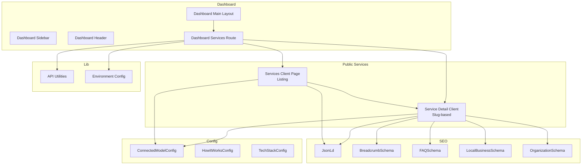

**Diagram sources**
- [ServicesClientPage.tsx](file://app/[locale]/services/_components/ServicesClientPage.tsx)
- [ServiceDetailClient.tsx](file://app/[locale]/services/[slug]/_components/ServiceDetailClient.tsx)
- [page.tsx](file://app/[locale]/services/page.tsx)
- [page.tsx](file://app/[locale]/services/[slug]/page.tsx)
- [DashboardMain.tsx](file://app/[locale]/dashboard/_components/DashboardMain.tsx)
- [Sidebar.tsx](file://app/[locale]/dashboard/_components/Sidebar/Sidebar.tsx)
- [Header.tsx](file://app/[locale]/dashboard/_components/Header/DashboardHeader.tsx)
- [page.tsx](file://app/[locale]/dashboard/(routes)/services/page.tsx)
- [JsonLd.tsx](file://components/seo/JsonLd.tsx)
- [BreadcrumbSchema.tsx](file://components/seo/BreadcrumbSchema.tsx)
- [FAQSchema.tsx](file://components/seo/FAQSchema.tsx)
- [LocalBusinessSchema.tsx](file://components/seo/LocalBusinessSchema.tsx)
- [OrganizationSchema.tsx](file://components/seo/OrganizationSchema.tsx)
- [ConnectedModelConfig.tsx](file://config/ConnectedModelConfig.tsx)
- [HowItWorksConfig.tsx](file://config/HowItWorksConfig.tsx)
- [TechStackConfig.tsx](file://config/TechStackConfig.tsx)
- [api.ts](file://lib/api.ts)
- [env.ts](file://lib/env.ts)

**Section sources**
- [page.tsx](file://app/[locale]/services/page.tsx)
- [page.tsx](file://app/[locale]/services/[slug]/page.tsx)
- [DashboardMain.tsx](file://app/[locale]/dashboard/_components/DashboardMain.tsx)
- [Sidebar.tsx](file://app/[locale]/dashboard/_components/Sidebar/Sidebar.tsx)
- [Header.tsx](file://app/[locale]/dashboard/_components/Header/DashboardHeader.tsx)
- [page.tsx](file://app/[locale]/dashboard/(routes)/services/page.tsx)

## Core Components
- Services listing page: Renders the catalog view, filters by category, and navigates to detail pages.
- Service detail page: Displays full information, pricing, availability, related items, and SEO schemas.
- Dashboard services route: Entry point for administrative operations on services.
- Server actions: Encapsulate mutations (create, update, delete) and data fetching helpers.
- SEO components: Provide structured data for breadcrumbs, FAQs, local business, and organization.

Key responsibilities:
- Catalog management: Listing, filtering, pagination, and navigation
- Metadata and SEO: Title, description, canonical URL, JSON-LD schemas
- Pricing and availability: Display and configuration hooks for time slots and pricing tiers
- Analytics and metrics: Integration points for usage tracking and performance measurement

**Section sources**
- [ServicesClientPage.tsx](file://app/[locale]/services/_components/ServicesClientPage.tsx)
- [ServiceDetailClient.tsx](file://app/[locale]/services/[slug]/_components/ServiceDetailClient.tsx)
- [actions.ts](file://app/[locale]/services/actions.ts)
- [JsonLd.tsx](file://components/seo/JsonLd.tsx)
- [BreadcrumbSchema.tsx](file://components/seo/BreadcrumbSchema.tsx)
- [FAQSchema.tsx](file://components/seo/FAQSchema.tsx)
- [LocalBusinessSchema.tsx](file://components/seo/LocalBusinessSchema.tsx)
- [OrganizationSchema.tsx](file://components/seo/OrganizationSchema.tsx)

## Architecture Overview
The services administration architecture combines:
- Client components for interactive UI
- Server actions for secure mutations
- Reusable SEO components for structured data
- Configuration modules for content modeling
- API utilities for backend communication

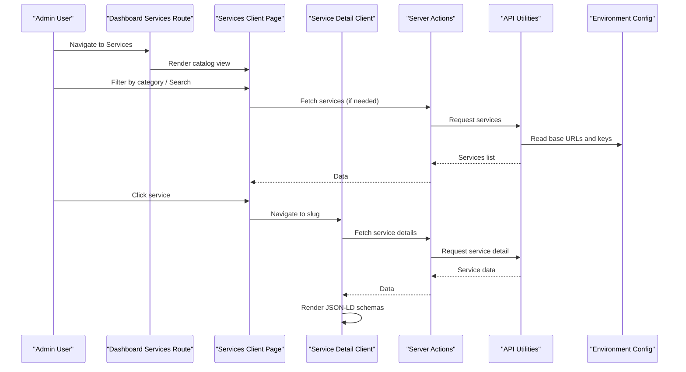

**Diagram sources**
- [page.tsx](file://app/[locale]/dashboard/(routes)/services/page.tsx)
- [ServicesClientPage.tsx](file://app/[locale]/services/_components/ServicesClientPage.tsx)
- [ServiceDetailClient.tsx](file://app/[locale]/services/[slug]/_components/ServiceDetailClient.tsx)
- [actions.ts](file://app/[locale]/services/actions.ts)
- [api.ts](file://lib/api.ts)
- [env.ts](file://lib/env.ts)

## Detailed Component Analysis

### Services Listing and Navigation
- Purpose: Present the service catalog, support filtering by category, and navigate to detail pages.
- Behavior:
  - Loads services via server actions or API utilities
  - Applies category filters and search queries
  - Navigates to service detail using slugs
- SEO:
  - Uses shared JSON-LD component for global structured data
  - May include breadcrumb schema for site hierarchy

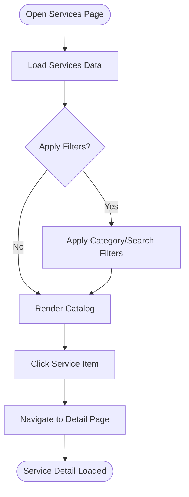

**Diagram sources**
- [ServicesClientPage.tsx](file://app/[locale]/services/_components/ServicesClientPage.tsx)
- [page.tsx](file://app/[locale]/services/page.tsx)

**Section sources**
- [ServicesClientPage.tsx](file://app/[locale]/services/_components/ServicesClientPage.tsx)
- [page.tsx](file://app/[locale]/services/page.tsx)

### Service Detail and Metadata Management
- Purpose: Display comprehensive service information including pricing, availability, and related services.
- Features:
  - Renders detailed metadata (title, description, tags)
  - Integrates JSON-LD schemas for breadcrumbs, FAQs, local business, and organization
  - Supports dynamic routing based on service slug
- Availability and pricing:
  - Displays configured pricing tiers and time slot availability
  - Hooks into configuration modules for consistent behavior

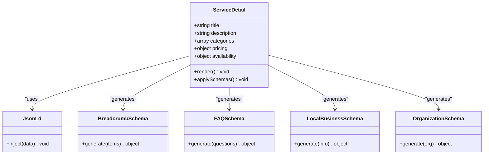

**Diagram sources**
- [ServiceDetailClient.tsx](file://app/[locale]/services/[slug]/_components/ServiceDetailClient.tsx)
- [JsonLd.tsx](file://components/seo/JsonLd.tsx)
- [BreadcrumbSchema.tsx](file://components/seo/BreadcrumbSchema.tsx)
- [FAQSchema.tsx](file://components/seo/FAQSchema.tsx)
- [LocalBusinessSchema.tsx](file://components/seo/LocalBusinessSchema.tsx)
- [OrganizationSchema.tsx](file://components/seo/OrganizationSchema.tsx)

**Section sources**
- [ServiceDetailClient.tsx](file://app/[locale]/services/[slug]/_components/ServiceDetailClient.tsx)
- [page.tsx](file://app/[locale]/services/[slug]/page.tsx)
- [JsonLd.tsx](file://components/seo/JsonLd.tsx)
- [BreadcrumbSchema.tsx](file://components/seo/BreadcrumbSchema.tsx)
- [FAQSchema.tsx](file://components/seo/FAQSchema.tsx)
- [LocalBusinessSchema.tsx](file://components/seo/LocalBusinessSchema.tsx)
- [OrganizationSchema.tsx](file://components/seo/OrganizationSchema.tsx)

### Dashboard Services Administration
- Purpose: Centralized entry point for managing services within the dashboard.
- Responsibilities:
  - Provides navigation to listing and detail views from the admin context
  - Integrates with server actions for create/update/delete operations
  - Leverages API utilities and environment configuration for backend calls

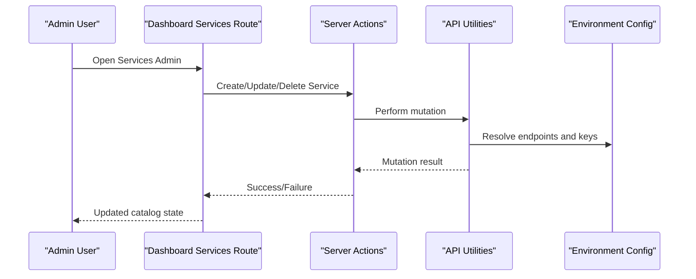

**Diagram sources**
- [page.tsx](file://app/[locale]/dashboard/(routes)/services/page.tsx)
- [actions.ts](file://app/[locale]/services/actions.ts)
- [api.ts](file://lib/api.ts)
- [env.ts](file://lib/env.ts)

**Section sources**
- [page.tsx](file://app/[locale]/dashboard/(routes)/services/page.tsx)
- [actions.ts](file://app/[locale]/services/actions.ts)
- [api.ts](file://lib/api.ts)
- [env.ts](file://lib/env.ts)

### Pricing Configuration and Availability Scheduling
- Pricing:
  - Managed through configuration modules and service metadata
  - Supports multiple pricing tiers and conditional logic
- Availability:
  - Time slot configuration integrated with detail rendering
  - Consistent display across listing and detail views

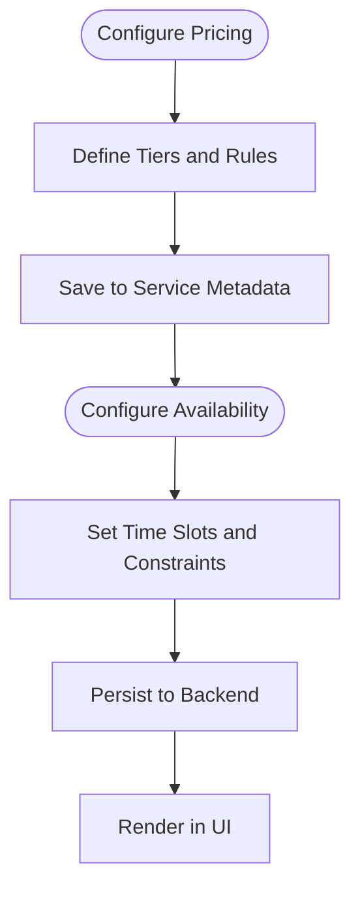

[No sources needed since this section provides general guidance]

### Service Categories and Metadata Management
- Categories:
  - Used for filtering and grouping services
  - Stored as part of service metadata
- Metadata:
  - Includes titles, descriptions, tags, and canonical URLs
  - Integrated with SEO components for structured data

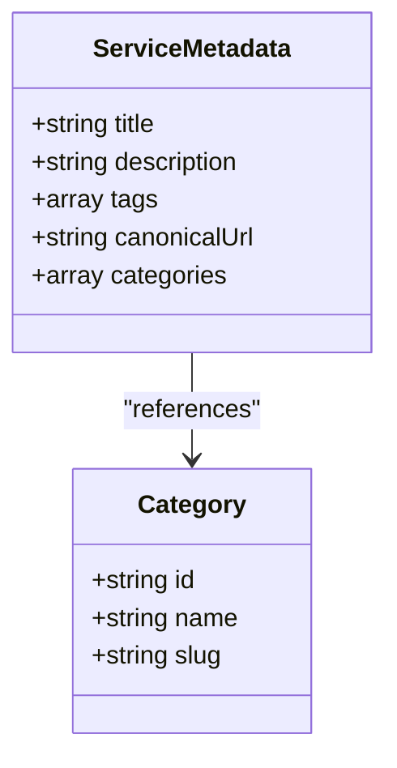

[No sources needed since this diagram shows conceptual relationships]

### SEO Optimization
- Structured data:
  - JSON-LD injection for breadcrumbs, FAQs, local business, and organization
- Best practices:
  - Ensure unique titles and descriptions per service
  - Use canonical URLs to avoid duplicate content
  - Validate generated schemas for correctness

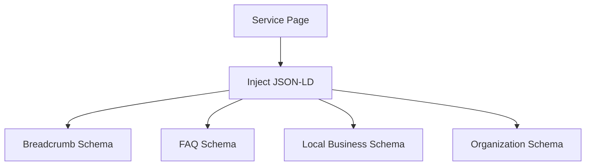

**Diagram sources**
- [JsonLd.tsx](file://components/seo/JsonLd.tsx)
- [BreadcrumbSchema.tsx](file://components/seo/BreadcrumbSchema.tsx)
- [FAQSchema.tsx](file://components/seo/FAQSchema.tsx)
- [LocalBusinessSchema.tsx](file://components/seo/LocalBusinessSchema.tsx)
- [OrganizationSchema.tsx](file://components/seo/OrganizationSchema.tsx)

**Section sources**
- [JsonLd.tsx](file://components/seo/JsonLd.tsx)
- [BreadcrumbSchema.tsx](file://components/seo/BreadcrumbSchema.tsx)
- [FAQSchema.tsx](file://components/seo/FAQSchema.tsx)
- [LocalBusinessSchema.tsx](file://components/seo/LocalBusinessSchema.tsx)
- [OrganizationSchema.tsx](file://components/seo/OrganizationSchema.tsx)

### Analytics, Usage Tracking, and Performance Metrics
- Usage tracking:
  - Integrate event listeners for service interactions (views, clicks, bookings)
  - Send events to analytics backend via API utilities
- Performance metrics:
  - Monitor page load times and interaction latency
  - Capture error rates and fallback behaviors

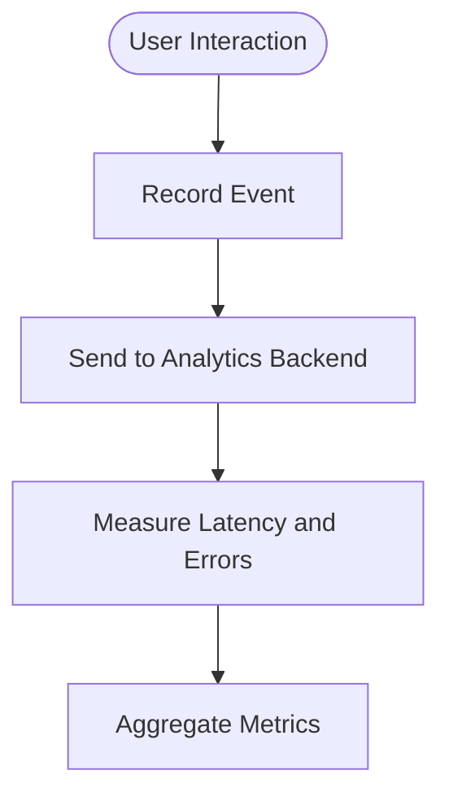

[No sources needed since this section provides general guidance]

### Adding New Service Types
- Steps:
  - Extend service metadata schema to include new fields
  - Update configuration modules to handle new type-specific rules
  - Modify listing and detail components to render new fields
  - Add validation and migration if required

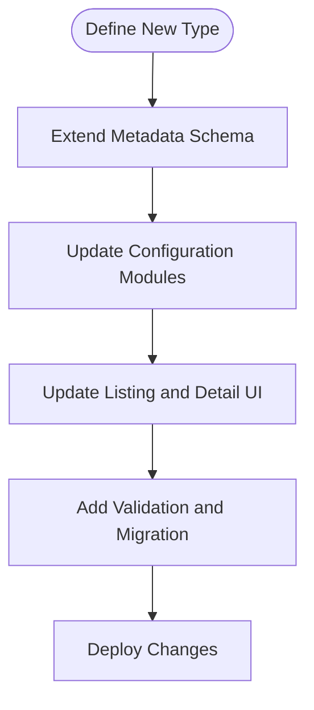

[No sources needed since this section provides general guidance]

### Implementing Service Bundles
- Concept:
  - Group multiple services into a bundle with combined pricing and availability
- Implementation:
  - Add bundle metadata referencing constituent services
  - Compute bundle pricing and aggregate availability windows
  - Render bundle cards in listing and detail views

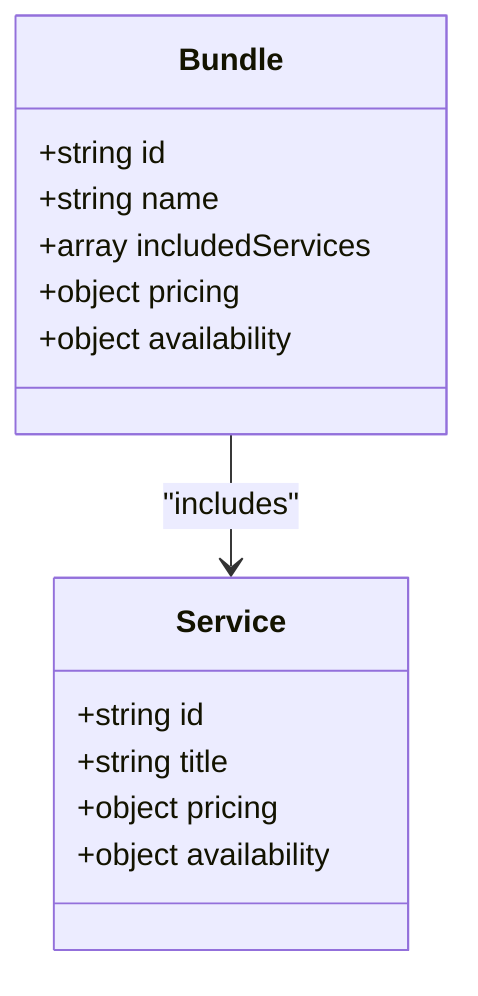

[No sources needed since this diagram shows conceptual relationships]

### Configuring Service Dependencies
- Purpose:
  - Enforce ordering or prerequisites among services
- Approach:
  - Store dependency graph in service metadata
  - Validate dependencies during creation and booking flows
  - Display dependency warnings in UI

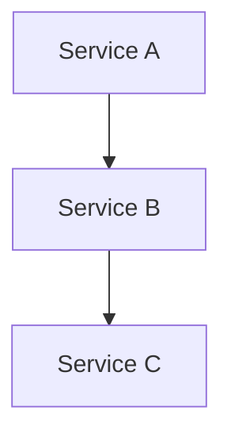

[No sources needed since this diagram shows conceptual relationships]

## Dependency Analysis
The services feature depends on:
- Client components for UI rendering
- Server actions for mutations
- API utilities and environment configuration for backend integration
- SEO components for structured data
- Configuration modules for content modeling

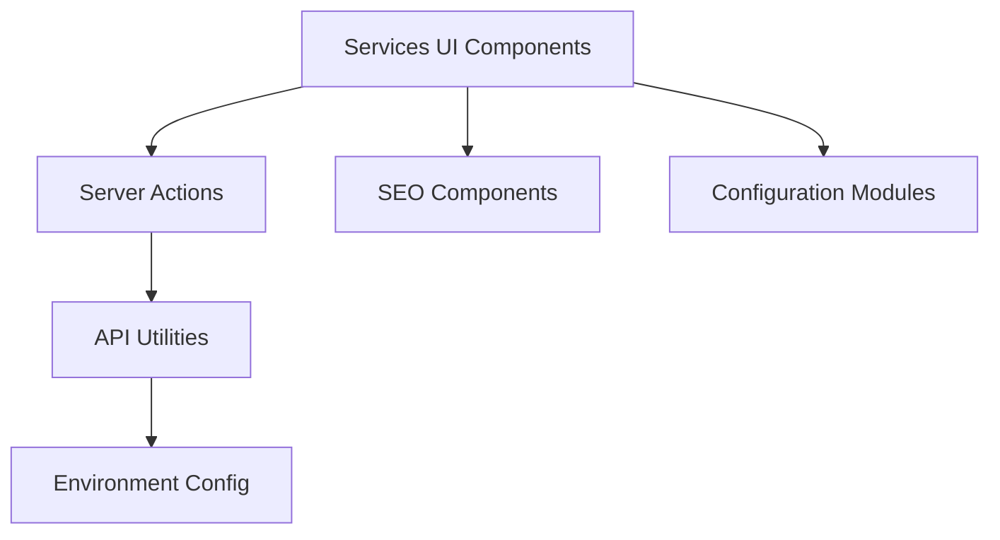

**Diagram sources**
- [ServicesClientPage.tsx](file://app/[locale]/services/_components/ServicesClientPage.tsx)
- [ServiceDetailClient.tsx](file://app/[locale]/services/[slug]/_components/ServiceDetailClient.tsx)
- [actions.ts](file://app/[locale]/services/actions.ts)
- [api.ts](file://lib/api.ts)
- [env.ts](file://lib/env.ts)
- [JsonLd.tsx](file://components/seo/JsonLd.tsx)
- [ConnectedModelConfig.tsx](file://config/ConnectedModelConfig.tsx)
- [HowItWorksConfig.tsx](file://config/HowItWorksConfig.tsx)
- [TechStackConfig.tsx](file://config/TechStackConfig.tsx)

**Section sources**
- [api.ts](file://lib/api.ts)
- [env.ts](file://lib/env.ts)
- [ConnectedModelConfig.tsx](file://config/ConnectedModelConfig.tsx)
- [HowItWorksConfig.tsx](file://config/HowItWorksConfig.tsx)
- [TechStackConfig.tsx](file://config/TechStackConfig.tsx)

## Performance Considerations
- Prefer server actions for data mutations to reduce client-side overhead
- Cache frequently accessed service listings where appropriate
- Defer non-critical SEO schema generation until after initial render
- Monitor network requests and optimize payload sizes
- Use efficient filtering and pagination for large catalogs

[No sources needed since this section provides general guidance]

## Troubleshooting Guide
Common issues and resolutions:
- Missing environment variables:
  - Verify API base URLs and keys are set correctly
- SEO schema errors:
  - Validate JSON-LD structure and ensure required fields are present
- Routing problems:
  - Confirm slug-based routes are correctly defined and accessible
- Action failures:
  - Check server action responses and error handling paths

**Section sources**
- [env.ts](file://lib/env.ts)
- [JsonLd.tsx](file://components/seo/JsonLd.tsx)
- [page.tsx](file://app/[locale]/services/[slug]/page.tsx)
- [actions.ts](file://app/[locale]/services/actions.ts)

## Conclusion
The services administration interface provides a robust foundation for managing service catalogs, pricing, availability, and SEO. By leveraging server actions, reusable SEO components, and configuration modules, the system supports extensibility for new service types, bundles, and dependencies while maintaining performance and usability.

[No sources needed since this section summarizes without analyzing specific files]

## Appendices
- Reference documents:
  - Services MVP overview and roadmap
  - CRM API notes for integration points
  - SEO extras notes for advanced structured data

**Section sources**
- [AUTOMEX Services MVP.md](file://doc/AUTOMEX Services MVP.md)
- [AUTOMEX_Backend_CRM_API_Notes.md](file://doc/AUTOMEX_Backend_CRM_API_Notes.md)
- [AUTOMEX_Backend_SEO_Extras_Notes.md](file://doc/AUTOMEX_Backend_SEO_Extras_Notes.md)