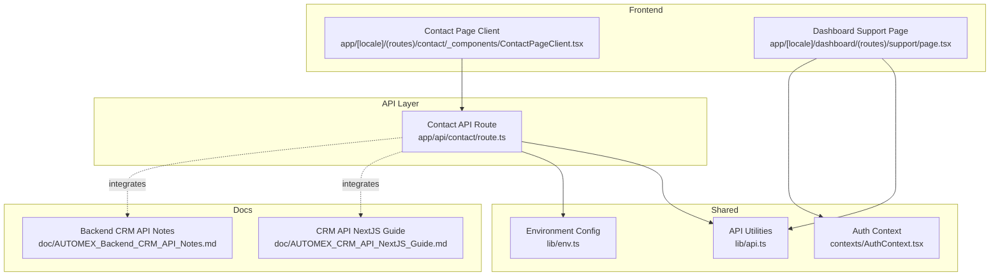
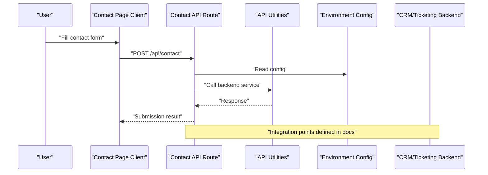
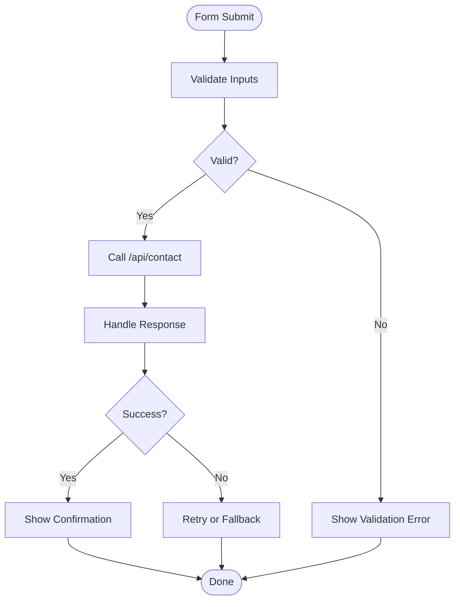
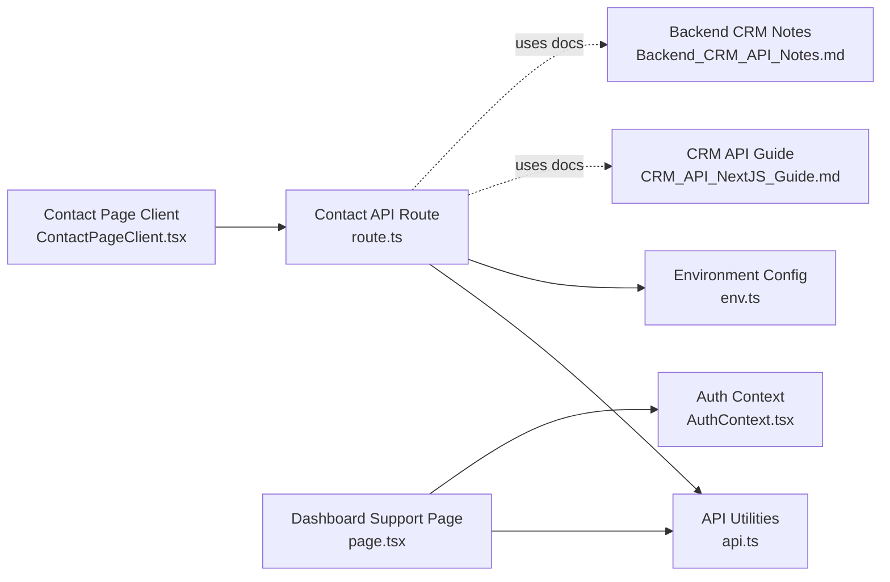

# Support Ticket System

<cite>
**Referenced Files in This Document**
- [page.tsx](file://app/[locale]/dashboard/(routes)/support/page.tsx)
- [ContactPageClient.tsx](file://app/[locale]/(routes)/contact/_components/ContactPageClient.tsx)
- [route.ts](file://app/api/contact/route.ts)
- [AuthContext.tsx](file://contexts/AuthContext.tsx)
- [api.ts](file://lib/api.ts)
- [env.ts](file://lib/env.ts)
- [CRM_API_NextJS_Guide.md](file://doc/AUTOMEX_CRM_API_NextJS_Guide.md)
- [Backend_CRM_API_Notes.md](file://doc/AUTOMEX_Backend_CRM_API_Notes.md)
</cite>

## Table of Contents
1. [Introduction](#introduction)
2. [Project Structure](#project-structure)
3. [Core Components](#core-components)
4. [Architecture Overview](#architecture-overview)
5. [Detailed Component Analysis](#detailed-component-analysis)
6. [Dependency Analysis](#dependency-analysis)
7. [Performance Considerations](#performance-considerations)
8. [Troubleshooting Guide](#troubleshooting-guide)
9. [Conclusion](#conclusion)
10. [Appendices](#appendices)

## Introduction
This document explains the support ticket management system implemented in the project. It covers how tickets are created, assigned, and resolved; categorization and priority handling; SLA tracking; customer communication tools; knowledge base integration; automated responses; customization of workflows; adding new support channels; and advanced reporting features. The goal is to provide both a high-level overview and actionable guidance for extending the system.

## Project Structure
The support-related functionality spans several areas:
- Public-facing contact form that can be used as an entry point for support requests
- API route to receive and process contact submissions
- Dashboard support page placeholder for future ticketing UI
- Shared utilities for authentication and environment configuration
- Documentation files describing CRM and backend APIs that may integrate with the ticketing flow

**Diagram sources**
- [ContactPageClient.tsx](file://app/[locale]/(routes)/contact/_components/ContactPageClient.tsx)
- [route.ts](file://app/api/contact/route.ts)
- [page.tsx](file://app/[locale]/dashboard/(routes)/support/page.tsx)
- [AuthContext.tsx](file://contexts/AuthContext.tsx)
- [api.ts](file://lib/api.ts)
- [env.ts](file://lib/env.ts)
- [CRM_API_NextJS_Guide.md](file://doc/AUTOMEX_CRM_API_NextJS_Guide.md)
- [Backend_CRM_API_Notes.md](file://doc/AUTOMEX_Backend_CRM_API_Notes.md)

**Section sources**
- [ContactPageClient.tsx](file://app/[locale]/(routes)/contact/_components/ContactPageClient.tsx)
- [route.ts](file://app/api/contact/route.ts)
- [page.tsx](file://app/[locale]/dashboard/(routes)/support/page.tsx)
- [AuthContext.tsx](file://contexts/AuthContext.tsx)
- [api.ts](file://lib/api.ts)
- [env.ts](file://lib/env.ts)
- [CRM_API_NextJS_Guide.md](file://doc/AUTOMEX_CRM_API_NextJS_Guide.md)
- [Backend_CRM_API_Notes.md](file://doc/AUTOMEX_Backend_CRM_API_Notes.md)

## Core Components
- Contact Page Client: Renders the public contact form and initiates submission to the API layer.
- Contact API Route: Receives contact payloads, validates inputs, and forwards data to downstream systems (e.g., CRM or ticketing).
- Dashboard Support Page: Placeholder for internal support operations such as viewing, assigning, and resolving tickets.
- Authentication Context: Provides user session state for protected dashboard routes.
- API Utilities: Centralized HTTP client helpers for calling backend services.
- Environment Configuration: Loads runtime settings such as API endpoints and feature flags.

Key responsibilities:
- Create: Capture user input from the contact form and persist via API.
- Assign: Route incoming tickets to queues or agents based on rules (to be implemented in the API or backend).
- Resolve: Update ticket status and notify customers through integrated channels.

**Section sources**
- [ContactPageClient.tsx](file://app/[locale]/(routes)/contact/_components/ContactPageClient.tsx)
- [route.ts](file://app/api/contact/route.ts)
- [page.tsx](file://app/[locale]/dashboard/(routes)/support/page.tsx)
- [AuthContext.tsx](file://contexts/AuthContext.tsx)
- [api.ts](file://lib/api.ts)
- [env.ts](file://lib/env.ts)

## Architecture Overview
The support workflow begins at the contact form, proceeds through the API route, and integrates with backend systems (CRM/ticketing). The dashboard provides a place for support agents to manage tickets once they are created.

**Diagram sources**
- [ContactPageClient.tsx](file://app/[locale]/(routes)/contact/_components/ContactPageClient.tsx)
- [route.ts](file://app/api/contact/route.ts)
- [api.ts](file://lib/api.ts)
- [env.ts](file://lib/env.ts)
- [CRM_API_NextJS_Guide.md](file://doc/AUTOMEX_CRM_API_NextJS_Guide.md)
- [Backend_CRM_API_Notes.md](file://doc/AUTOMEX_Backend_CRM_API_Notes.md)

## Detailed Component Analysis

### Contact Form Submission Flow
This section maps the end-to-end flow from user interaction to backend processing.

Implementation anchors:
- Contact form UI and submission logic: [ContactPageClient.tsx](file://app/[locale]/(routes)/contact/_components/ContactPageClient.tsx)
- API endpoint handling: [route.ts](file://app/api/contact/route.ts)
- HTTP utilities and environment variables: [api.ts](file://lib/api.ts), [env.ts](file://lib/env.ts)

**Section sources**
- [ContactPageClient.tsx](file://app/[locale]/(routes)/contact/_components/ContactPageClient.tsx)
- [route.ts](file://app/api/contact/route.ts)
- [api.ts](file://lib/api.ts)
- [env.ts](file://lib/env.ts)

### Dashboard Support Page
The dashboard support page currently serves as a placeholder for agent-facing ticket operations. Future enhancements should include:
- Listing and filtering tickets
- Assigning tickets to agents or teams
- Updating statuses (Open, In Progress, Resolved, Closed)
- Viewing conversation history and attachments

Current anchor:
- [page.tsx](file://app/[locale]/dashboard/(routes)/support/page.tsx)

Authentication context usage:
- [AuthContext.tsx](file://contexts/AuthContext.tsx)

**Section sources**
- [page.tsx](file://app/[locale]/dashboard/(routes)/support/page.tsx)
- [AuthContext.tsx](file://contexts/AuthContext.tsx)

### Integration Points and External Systems
Integration details are documented in the repository’s guides and notes:
- CRM API integration patterns and examples: [CRM_API_NextJS_Guide.md](file://doc/AUTOMEX_CRM_API_NextJS_Guide.md)
- Backend CRM API specifications and constraints: [Backend_CRM_API_Notes.md](file://doc/AUTOMEX_Backend_CRM_API_Notes.md)

These documents inform how the API route should interact with external ticketing or CRM systems, including payload structures, authentication, and error handling.

**Section sources**
- [CRM_API_NextJS_Guide.md](file://doc/AUTOMEX_CRM_API_NextJS_Guide.md)
- [Backend_CRM_API_Notes.md](file://doc/AUTOMEX_Backend_CRM_API_Notes.md)

## Dependency Analysis
The following diagram shows key dependencies among components involved in support ticket creation and management.

**Diagram sources**
- [ContactPageClient.tsx](file://app/[locale]/(routes)/contact/_components/ContactPageClient.tsx)
- [route.ts](file://app/api/contact/route.ts)
- [api.ts](file://lib/api.ts)
- [env.ts](file://lib/env.ts)
- [page.tsx](file://app/[locale]/dashboard/(routes)/support/page.tsx)
- [AuthContext.tsx](file://contexts/AuthContext.tsx)
- [CRM_API_NextJS_Guide.md](file://doc/AUTOMEX_CRM_API_NextJS_Guide.md)
- [Backend_CRM_API_Notes.md](file://doc/AUTOMEX_Backend_CRM_API_Notes.md)

**Section sources**
- [ContactPageClient.tsx](file://app/[locale]/(routes)/contact/_components/ContactPageClient.tsx)
- [route.ts](file://app/api/contact/route.ts)
- [api.ts](file://lib/api.ts)
- [env.ts](file://lib/env.ts)
- [page.tsx](file://app/[locale]/dashboard/(routes)/support/page.tsx)
- [AuthContext.tsx](file://contexts/AuthContext.tsx)
- [CRM_API_NextJS_Guide.md](file://doc/AUTOMEX_CRM_API_NextJS_Guide.md)
- [Backend_CRM_API_Notes.md](file://doc/AUTOMEX_Backend_CRM_API_Notes.md)

## Performance Considerations
- Minimize network calls by batching updates where possible.
- Cache static configuration and metadata using environment variables and client-side caches when appropriate.
- Implement optimistic UI updates for better perceived performance during ticket creation.
- Use pagination and server-side filtering for large ticket lists in the dashboard.
- Add retry and backoff strategies for failed API calls.

[No sources needed since this section provides general guidance]

## Troubleshooting Guide
Common issues and resolutions:
- Validation errors: Ensure required fields are present and correctly formatted before submission.
- Network failures: Check connectivity, CORS policies, and backend availability; implement retries and fallbacks.
- Authentication problems: Verify session validity and token refresh flows in the dashboard.
- Integration errors: Review CRM/backend API documentation for expected payloads and error codes.

Operational anchors:
- Contact form validation and submission: [ContactPageClient.tsx](file://app/[locale]/(routes)/contact/_components/ContactPageClient.tsx)
- API route error handling: [route.ts](file://app/api/contact/route.ts)
- Environment configuration checks: [env.ts](file://lib/env.ts)
- Authentication context usage: [AuthContext.tsx](file://contexts/AuthContext.tsx)

**Section sources**
- [ContactPageClient.tsx](file://app/[locale]/(routes)/contact/_components/ContactPageClient.tsx)
- [route.ts](file://app/api/contact/route.ts)
- [env.ts](file://lib/env.ts)
- [AuthContext.tsx](file://contexts/AuthContext.tsx)

## Conclusion
The support ticket system leverages a clear separation between frontend forms, API routing, and shared utilities. While the current implementation focuses on contact submission, it provides a solid foundation for building out full ticket lifecycle management, including assignment, resolution, categorization, priority, SLA tracking, and integrations. Use the referenced documentation to align with backend capabilities and extend the system according to business needs.

[No sources needed since this section summarizes without analyzing specific files]

## Appendices

### Customizing Ticket Workflows
- Extend the contact form to include fields for category, priority, and channel source.
- Modify the API route to parse these fields and map them to backend ticket attributes.
- Implement routing rules in the backend to assign tickets to queues or agents based on category and priority.

Anchors:
- [ContactPageClient.tsx](file://app/[locale]/(routes)/contact/_components/ContactPageClient.tsx)
- [route.ts](file://app/api/contact/route.ts)
- [CRM_API_NextJS_Guide.md](file://doc/AUTOMEX_CRM_API_NextJS_Guide.md)
- [Backend_CRM_API_Notes.md](file://doc/AUTOMEX_Backend_CRM_API_Notes.md)

**Section sources**
- [ContactPageClient.tsx](file://app/[locale]/(routes)/contact/_components/ContactPageClient.tsx)
- [route.ts](file://app/api/contact/route.ts)
- [CRM_API_NextJS_Guide.md](file://doc/AUTOMEX_CRM_API_NextJS_Guide.md)
- [Backend_CRM_API_Notes.md](file://doc/AUTOMEX_Backend_CRM_API_Notes.md)

### Adding New Support Channels
- Introduce additional entry points (e.g., chat widget, email parser) that post to the same API route or a dedicated channel handler.
- Normalize payloads across channels before forwarding to the backend.
- Tag tickets with channel metadata for analytics and routing.

Anchors:
- [route.ts](file://app/api/contact/route.ts)
- [api.ts](file://lib/api.ts)
- [env.ts](file://lib/env.ts)

**Section sources**
- [route.ts](file://app/api/contact/route.ts)
- [api.ts](file://lib/api.ts)
- [env.ts](file://lib/env.ts)

### Implementing Advanced Reporting Features
- Collect metrics at the API route level (submission counts, response times, error rates).
- Expose reporting endpoints or export formats for dashboards.
- Use CRM/backend analytics if available per the integration guides.

Anchors:
- [route.ts](file://app/api/contact/route.ts)
- [CRM_API_NextJS_Guide.md](file://doc/AUTOMEX_CRM_API_NextJS_Guide.md)
- [Backend_CRM_API_Notes.md](file://doc/AUTOMEX_Backend_CRM_API_Notes.md)

**Section sources**
- [route.ts](file://app/api/contact/route.ts)
- [CRM_API_NextJS_Guide.md](file://doc/AUTOMEX_CRM_API_NextJS_Guide.md)
- [Backend_CRM_API_Notes.md](file://doc/AUTOMEX_Backend_CRM_API_Notes.md)