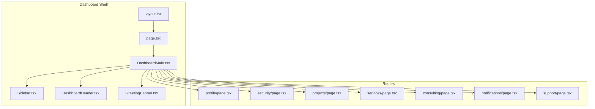
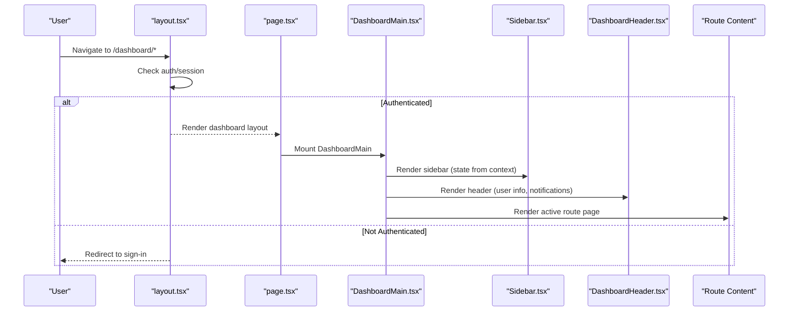
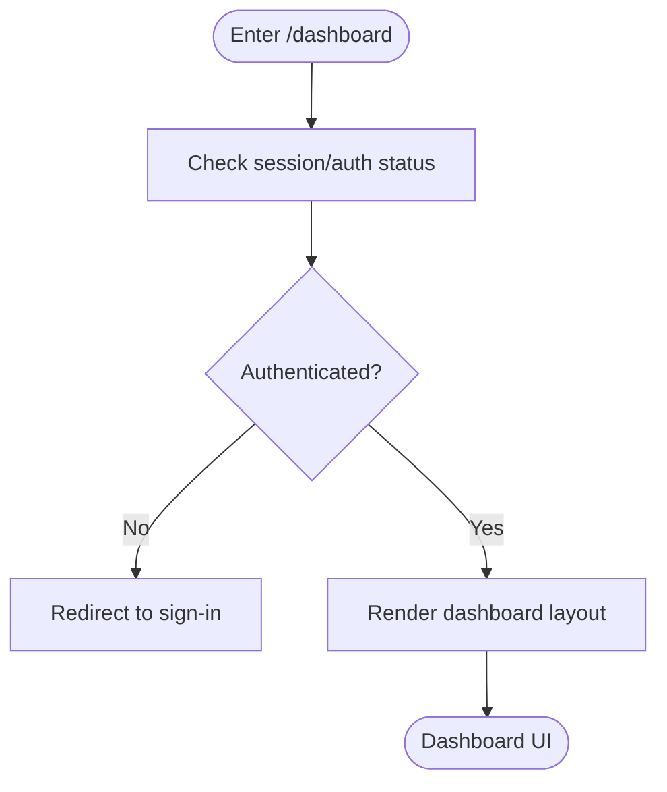
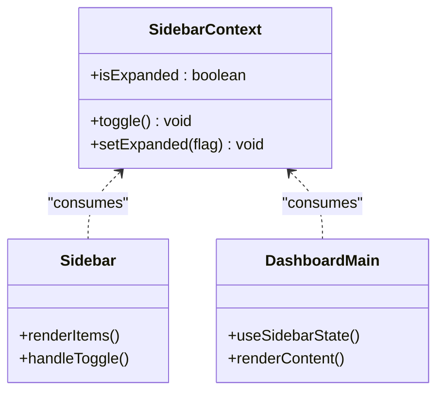
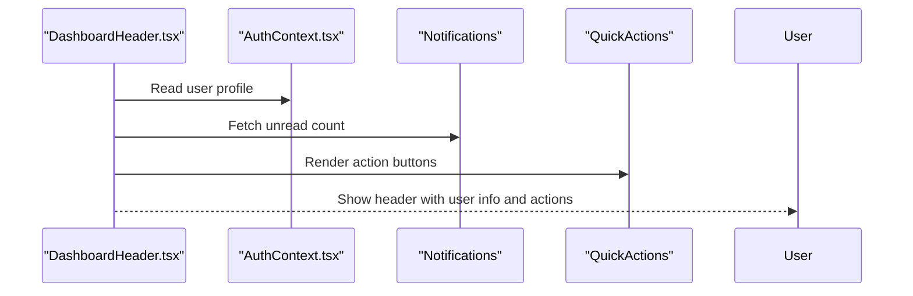
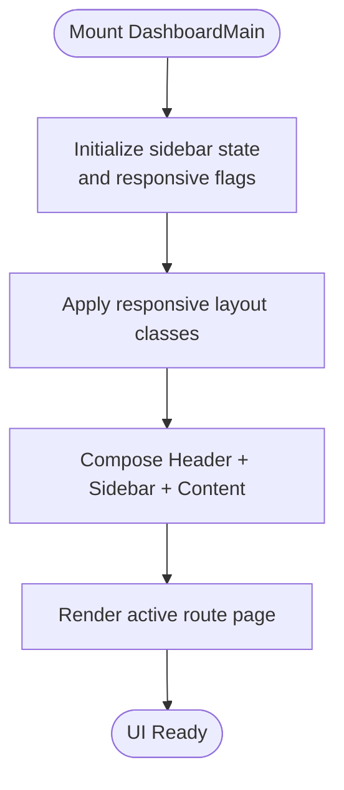
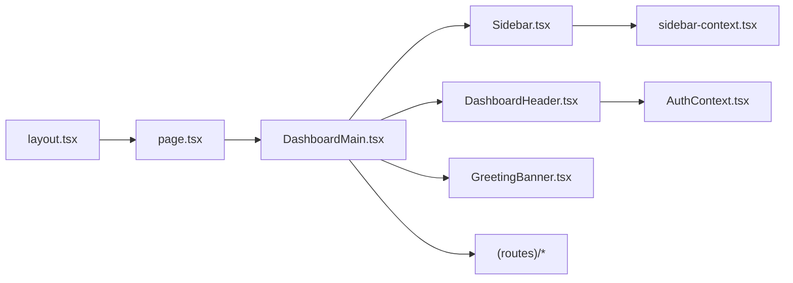

# Dashboard System

<cite>
**Referenced Files in This Document**
- [layout.tsx](file://app/[locale]/dashboard/layout.tsx)
- [page.tsx](file://app/[locale]/dashboard/page.tsx)
- [DashboardMain.tsx](file://app/[locale]/dashboard/_components/DashboardMain.tsx)
- [Sidebar.tsx](file://app/[locale]/dashboard/_components/Sidebar/Sidebar.tsx)
- [DashboardHeader.tsx](file://app/[locale]/dashboard/_components/Header/DashboardHeader.tsx)
- [GreetingBanner.tsx](file://app/[locale]/dashboard/_components/GreetingBanner.tsx)
- [sidebar-context.tsx](file://contexts/sidebar-context.tsx)
- [AuthContext.tsx](file://contexts/AuthContext.tsx)
- [profile page.tsx](file://app/[locale]/dashboard/(routes)/profile/page.tsx)
- [security page.tsx](file://app/[locale]/dashboard/(routes)/security/page.tsx)
- [projects page.tsx](file://app/[locale]/dashboard/(routes)/projects/page.tsx)
- [services page.tsx](file://app/[locale]/dashboard/(routes)/services/page.tsx)
- [consulting page.tsx](file://app/[locale]/dashboard/(routes)/consulting/page.tsx)
- [notifications page.tsx](file://app/[locale]/dashboard/(routes)/notifications/page.tsx)
- [support page.tsx](file://app/[locale]/dashboard/(routes)/support/page.tsx)
</cite>

## Table of Contents
1. [Introduction](#introduction)
2. [Project Structure](#project-structure)
3. [Core Components](#core-components)
4. [Architecture Overview](#architecture-overview)
5. [Detailed Component Analysis](#detailed-component-analysis)
6. [Dependency Analysis](#dependency-analysis)
7. [Performance Considerations](#performance-considerations)
8. [Troubleshooting Guide](#troubleshooting-guide)
9. [Conclusion](#conclusion)
10. [Appendices](#appendices)

## Introduction
This document explains the protected dashboard system, focusing on layout architecture, protected route implementation, and sidebar navigation. It covers the DashboardMain component structure, responsive design patterns with a mobile-first approach, and the sidebar context for state management and navigation persistence. The dashboard header section includes user information display, notification system, and quick actions. Practical examples are provided for adding new pages, implementing role-based access control, and extending the sidebar. Performance optimization strategies for large dashboards, lazy loading techniques, and accessibility compliance guidelines are also included.

## Project Structure
The dashboard is organized under app/[locale]/dashboard with:
- A root layout that wraps all dashboard routes
- A main entry page that renders the DashboardMain shell
- Shared components for the header, sidebar, greeting banner, and main content area
- Feature-specific route pages grouped under (routes)

**Diagram sources**
- [layout.tsx](file://app/[locale]/dashboard/layout.tsx)
- [page.tsx](file://app/[locale]/dashboard/page.tsx)
- [DashboardMain.tsx](file://app/[locale]/dashboard/_components/DashboardMain.tsx)
- [Sidebar.tsx](file://app/[locale]/dashboard/_components/Sidebar/Sidebar.tsx)
- [DashboardHeader.tsx](file://app/[locale]/dashboard/_components/Header/DashboardHeader.tsx)
- [GreetingBanner.tsx](file://app/[locale]/dashboard/_components/GreetingBanner.tsx)
- [profile page.tsx](file://app/[locale]/dashboard/(routes)/profile/page.tsx)
- [security page.tsx](file://app/[locale]/dashboard/(routes)/security/page.tsx)
- [projects page.tsx](file://app/[locale]/dashboard/(routes)/projects/page.tsx)
- [services page.tsx](file://app/[locale]/dashboard/(routes)/services/page.tsx)
- [consulting page.tsx](file://app/[locale]/dashboard/(routes)/consulting/page.tsx)
- [notifications page.tsx](file://app/[locale]/dashboard/(routes)/notifications/page.tsx)
- [support page.tsx](file://app/[locale]/dashboard/(routes)/support/page.tsx)

**Section sources**
- [layout.tsx](file://app/[locale]/dashboard/layout.tsx)
- [page.tsx](file://app/[locale]/dashboard/page.tsx)

## Core Components
- DashboardMain: Provides the overall dashboard shell, including responsive grid/flex layout, sidebar toggle behavior, and content area routing.
- Sidebar: Renders navigation items, supports collapse/expand state, and persists open/closed state via context.
- DashboardHeader: Displays user info, notifications, and quick actions; integrates with auth context for user data.
- GreetingBanner: Shows contextual greetings and summary metrics or links to key actions.

Key responsibilities:
- Layout orchestration and responsive breakpoints
- State sharing between sidebar and header (e.g., collapsed state)
- Access to authenticated user details and permissions
- Consistent spacing, typography, and theme integration

**Section sources**
- [DashboardMain.tsx](file://app/[locale]/dashboard/_components/DashboardMain.tsx)
- [Sidebar.tsx](file://app/[locale]/dashboard/_components/Sidebar/Sidebar.tsx)
- [DashboardHeader.tsx](file://app/[locale]/dashboard/_components/Header/DashboardHeader.tsx)
- [GreetingBanner.tsx](file://app/[locale]/dashboard/_components/GreetingBanner.tsx)

## Architecture Overview
The dashboard uses a Next.js App Router layout with a protected shell. The layout ensures authentication checks before rendering the dashboard UI. The main page mounts the DashboardMain container, which composes the header, sidebar, and route content.

**Diagram sources**
- [layout.tsx](file://app/[locale]/dashboard/layout.tsx)
- [page.tsx](file://app/[locale]/dashboard/page.tsx)
- [DashboardMain.tsx](file://app/[locale]/dashboard/_components/DashboardMain.tsx)
- [Sidebar.tsx](file://app/[locale]/dashboard/_components/Sidebar/Sidebar.tsx)
- [DashboardHeader.tsx](file://app/[locale]/dashboard/_components/Header/DashboardHeader.tsx)

## Detailed Component Analysis

### Protected Route Implementation
- The dashboard layout performs an authentication check before rendering any dashboard content. If unauthenticated, it redirects to the sign-in flow.
- Session retrieval and validation are typically handled by shared auth utilities and contexts.

**Diagram sources**
- [layout.tsx](file://app/[locale]/dashboard/layout.tsx)
- [AuthContext.tsx](file://contexts/AuthContext.tsx)

**Section sources**
- [layout.tsx](file://app/[locale]/dashboard/layout.tsx)
- [AuthContext.tsx](file://contexts/AuthContext.tsx)

### Sidebar Navigation System and Context
- The sidebar provides navigation links to dashboard routes and maintains its expanded/collapsed state.
- A dedicated context manages sidebar state and persists it across navigations and sessions.

**Diagram sources**
- [sidebar-context.tsx](file://contexts/sidebar-context.tsx)
- [Sidebar.tsx](file://app/[locale]/dashboard/_components/Sidebar/Sidebar.tsx)
- [DashboardMain.tsx](file://app/[locale]/dashboard/_components/DashboardMain.tsx)

**Section sources**
- [sidebar-context.tsx](file://contexts/sidebar-context.tsx)
- [Sidebar.tsx](file://app/[locale]/dashboard/_components/Sidebar/Sidebar.tsx)
- [DashboardMain.tsx](file://app/[locale]/dashboard/_components/DashboardMain.tsx)

### Dashboard Header: User Info, Notifications, Quick Actions
- Displays current user’s name/avatar and account-related actions.
- Integrates with the notification system to show alerts and unread counts.
- Provides quick actions such as profile, settings, and logout.

**Diagram sources**
- [DashboardHeader.tsx](file://app/[locale]/dashboard/_components/Header/DashboardHeader.tsx)
- [AuthContext.tsx](file://contexts/AuthContext.tsx)

**Section sources**
- [DashboardHeader.tsx](file://app/[locale]/dashboard/_components/Header/DashboardHeader.tsx)
- [AuthContext.tsx](file://contexts/AuthContext.tsx)

### DashboardMain Component Structure
- Orchestrates the layout grid/flex, applies responsive classes, and toggles sidebar visibility based on screen size.
- Wraps route content within a consistent padding/margin scheme and integrates the greeting banner.

**Diagram sources**
- [DashboardMain.tsx](file://app/[locale]/dashboard/_components/DashboardMain.tsx)

**Section sources**
- [DashboardMain.tsx](file://app/[locale]/dashboard/_components/DashboardMain.tsx)

### Responsive Design Patterns and Mobile-First Approach
- Uses Tailwind utility classes to define base styles for small screens and progressively enhance for larger viewports.
- Sidebar collapses into a drawer-like overlay on mobile and becomes a persistent panel on desktop.
- Content area adapts with fluid spacing and grid adjustments.

Practical tips:
- Prefer stacking layouts on small screens and switch to multi-column grids at medium breakpoints.
- Ensure touch targets meet minimum sizes and maintain adequate contrast.

[No sources needed since this section provides general guidance]

### Adding New Dashboard Pages
Steps:
1. Create a new folder under app/[locale]/dashboard/(routes)/your-feature with a page.tsx file.
2. Implement the page component and export it as default.
3. Add a corresponding link in the sidebar configuration.
4. Optionally add metadata and SEO tags specific to the page.

Example references:
- See existing pages for patterns:
  - [profile page.tsx](file://app/[locale]/dashboard/(routes)/profile/page.tsx)
  - [security page.tsx](file://app/[locale]/dashboard/(routes)/security/page.tsx)
  - [projects page.tsx](file://app/[locale]/dashboard/(routes)/projects/page.tsx)
  - [services page.tsx](file://app/[locale]/dashboard/(routes)/services/page.tsx)
  - [consulting page.tsx](file://app/[locale]/dashboard/(routes)/consulting/page.tsx)
  - [notifications page.tsx](file://app/[locale]/dashboard/(routes)/notifications/page.tsx)
  - [support page.tsx](file://app/[locale]/dashboard/(routes)/support/page.tsx)

**Section sources**
- [profile page.tsx](file://app/[locale]/dashboard/(routes)/profile/page.tsx)
- [security page.tsx](file://app/[locale]/dashboard/(routes)/security/page.tsx)
- [projects page.tsx](file://app/[locale]/dashboard/(routes)/projects/page.tsx)
- [services page.tsx](file://app/[locale]/dashboard/(routes)/services/page.tsx)
- [consulting page.tsx](file://app/[locale]/dashboard/(routes)/consulting/page.tsx)
- [notifications page.tsx](file://app/[locale]/dashboard/(routes)/notifications/page.tsx)
- [support page.tsx](file://app/[locale]/dashboard/(routes)/support/page.tsx)

### Role-Based Access Control (RBAC)
Approach:
- Extend the auth context to include roles/permissions.
- Wrap protected routes or components with a guard that checks required roles.
- Conditionally render sidebar items based on permissions.

Implementation outline:
- In layout.tsx, after verifying authentication, fetch user roles and enforce access before rendering dashboard content.
- In Sidebar, filter menu items by permission keys.
- In individual pages, perform fine-grained checks for sensitive actions.

**Section sources**
- [layout.tsx](file://app/[locale]/dashboard/layout.tsx)
- [AuthContext.tsx](file://contexts/AuthContext.tsx)
- [Sidebar.tsx](file://app/[locale]/dashboard/_components/Sidebar/Sidebar.tsx)

### Extending the Sidebar Navigation
- Update the sidebar configuration to include new entries with labels, icons, and route paths.
- Ensure each item maps to a valid route under (routes).
- Persist expanded state using the sidebar context.

**Section sources**
- [Sidebar.tsx](file://app/[locale]/dashboard/_components/Sidebar/Sidebar.tsx)
- [sidebar-context.tsx](file://contexts/sidebar-context.tsx)

## Dependency Analysis
High-level dependencies among dashboard components and contexts:

**Diagram sources**
- [layout.tsx](file://app/[locale]/dashboard/layout.tsx)
- [page.tsx](file://app/[locale]/dashboard/page.tsx)
- [DashboardMain.tsx](file://app/[locale]/dashboard/_components/DashboardMain.tsx)
- [Sidebar.tsx](file://app/[locale]/dashboard/_components/Sidebar/Sidebar.tsx)
- [DashboardHeader.tsx](file://app/[locale]/dashboard/_components/Header/DashboardHeader.tsx)
- [GreetingBanner.tsx](file://app/[locale]/dashboard/_components/GreetingBanner.tsx)
- [sidebar-context.tsx](file://contexts/sidebar-context.tsx)
- [AuthContext.tsx](file://contexts/AuthContext.tsx)

**Section sources**
- [layout.tsx](file://app/[locale]/dashboard/layout.tsx)
- [page.tsx](file://app/[locale]/dashboard/page.tsx)
- [DashboardMain.tsx](file://app/[locale]/dashboard/_components/DashboardMain.tsx)
- [Sidebar.tsx](file://app/[locale]/dashboard/_components/Sidebar/Sidebar.tsx)
- [DashboardHeader.tsx](file://app/[locale]/dashboard/_components/Header/DashboardHeader.tsx)
- [GreetingBanner.tsx](file://app/[locale]/dashboard/_components/GreetingBanner.tsx)
- [sidebar-context.tsx](file://contexts/sidebar-context.tsx)
- [AuthContext.tsx](file://contexts/AuthContext.tsx)

## Performance Considerations
- Lazy load heavy route components using dynamic imports to reduce initial bundle size.
- Use code splitting per route and avoid importing large libraries at the top level.
- Memoize expensive computations and list rendering with stable keys.
- Debounce input handlers and network requests where appropriate.
- Optimize images and assets; leverage caching headers for static resources.
- Minimize re-renders by keeping context updates granular and avoiding unnecessary state changes.

[No sources needed since this section provides general guidance]

## Troubleshooting Guide
Common issues and resolutions:
- Unauthenticated redirect loops: Verify session retrieval logic and ensure redirects only occur when necessary.
- Sidebar state not persisting: Confirm context provider placement and storage mechanism.
- Header user info missing: Check auth context initialization and error handling around session fetch.
- Route not found: Ensure new pages are placed under (routes) and linked correctly in the sidebar.

**Section sources**
- [layout.tsx](file://app/[locale]/dashboard/layout.tsx)
- [sidebar-context.tsx](file://contexts/sidebar-context.tsx)
- [DashboardHeader.tsx](file://app/[locale]/dashboard/_components/Header/DashboardHeader.tsx)

## Conclusion
The dashboard system provides a robust, responsive, and accessible foundation for building feature-rich admin interfaces. With a clear separation of concerns, protected routes, and a flexible sidebar context, teams can scale the dashboard efficiently. Following the performance and accessibility recommendations will ensure a smooth experience for users across devices and abilities.

## Appendices

### Accessibility Checklist
- Semantic HTML landmarks (header, nav, main)
- Keyboard navigation support for sidebar and header actions
- ARIA attributes for collapsible panels and menus
- Sufficient color contrast and focus indicators
- Screen reader-friendly labels and descriptions

[No sources needed since this section provides general guidance]