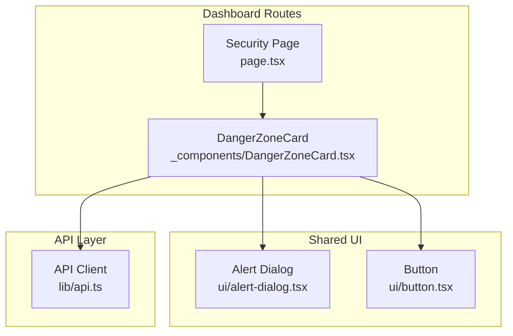
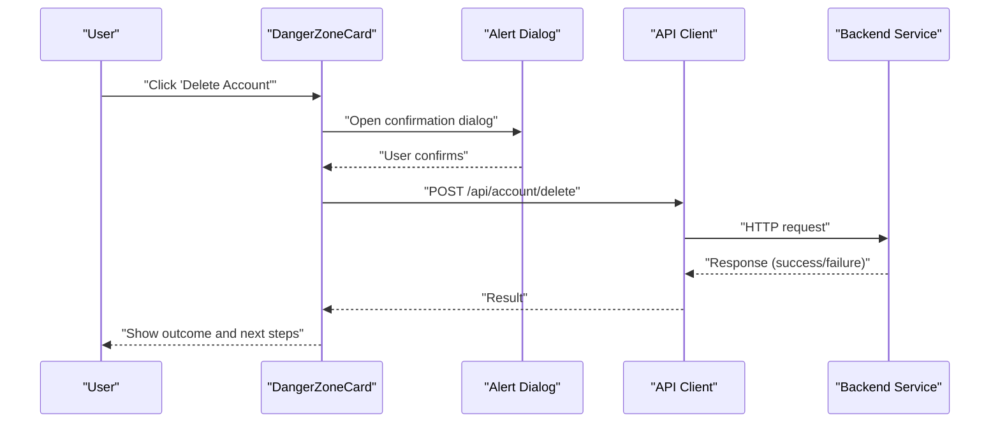
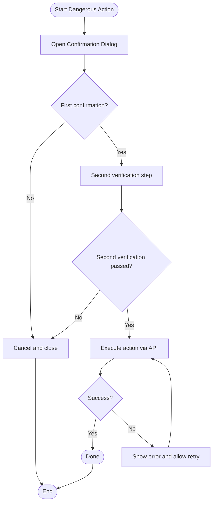
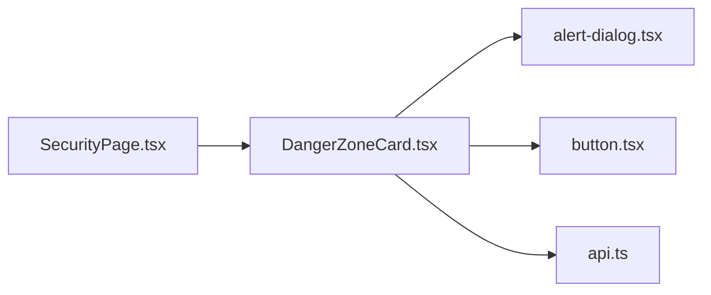
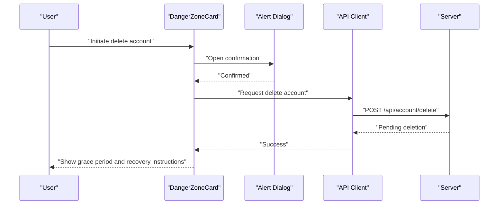
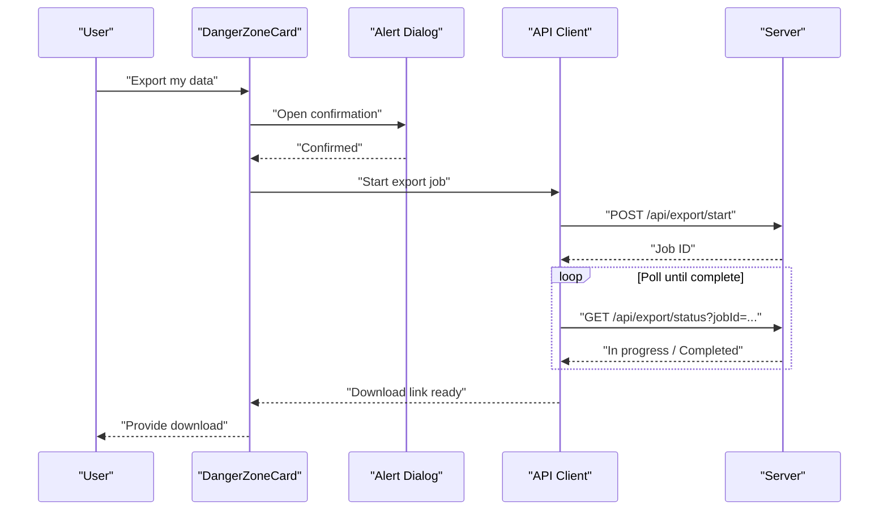

# Danger Zone Operations

<cite>
**Referenced Files in This Document**
- [DangerZoneCard.tsx](file://app/[locale]/dashboard/(routes)/security/_components/DangerZoneCard.tsx)
- [SecurityPage.tsx](file://app/[locale]/dashboard/(routes)/security/page.tsx)
- [alert-dialog.tsx](file://components/ui/alert-dialog.tsx)
- [button.tsx](file://components/ui/button.tsx)
- [api.ts](file://lib/api.ts)
</cite>

## Table of Contents
1. [Introduction](#introduction)
2. [Project Structure](#project-structure)
3. [Core Components](#core-components)
4. [Architecture Overview](#architecture-overview)
5. [Detailed Component Analysis](#detailed-component-analysis)
6. [Dependency Analysis](#dependency-analysis)
7. [Performance Considerations](#performance-considerations)
8. [Troubleshooting Guide](#troubleshooting-guide)
9. [Conclusion](#conclusion)
10. [Appendices](#appendices)

## Introduction
This document explains dangerous operations and destructive actions exposed through the Security panel, focusing on the DangerZoneCard component. It covers account deletion, data export, and other irreversible operations. It also documents confirmation dialogs, double-verification patterns, safety checks, audit logging, rollback capabilities, and recovery procedures. Finally, it provides guidance for adding new dangerous operations and implementing safe operation patterns.

## Project Structure
The security-related UI is implemented under the dashboard routes. The key files involved in dangerous operations are:
- The security page that renders the DangerZoneCard
- The DangerZoneCard component that orchestrates user interactions and calls to backend APIs
- Shared UI primitives used for confirmation dialogs and buttons
- A centralized API client used to invoke server-side endpoints

**Diagram sources**
- [SecurityPage.tsx](file://app/[locale]/dashboard/(routes)/security/page.tsx)
- [DangerZoneCard.tsx](file://app/[locale]/dashboard/(routes)/security/_components/DangerZoneCard.tsx)
- [alert-dialog.tsx](file://components/ui/alert-dialog.tsx)
- [button.tsx](file://components/ui/button.tsx)
- [api.ts](file://lib/api.ts)

**Section sources**
- [SecurityPage.tsx](file://app/[locale]/dashboard/(routes)/security/page.tsx)
- [DangerZoneCard.tsx](file://app/[locale]/dashboard/(routes)/security/_components/DangerZoneCard.tsx)
- [alert-dialog.tsx](file://components/ui/alert-dialog.tsx)
- [button.tsx](file://components/ui/button.tsx)
- [api.ts](file://lib/api.ts)

## Core Components
- DangerZoneCard: Presents destructive actions (e.g., delete account, export data), enforces confirmations, and triggers API calls via the API client.
- Alert Dialog: Provides a modal confirmation flow with explicit acknowledgment before executing dangerous actions.
- Button: Standardized action button used to trigger workflows within the card.
- API Client: Centralized HTTP layer used to call server endpoints for destructive operations.

Key responsibilities:
- Present clear warnings and descriptions for each dangerous operation
- Require explicit confirmation (single or double verification where applicable)
- Call appropriate server endpoints and handle success/error states
- Log audit events for all dangerous operations

**Section sources**
- [DangerZoneCard.tsx](file://app/[locale]/dashboard/(routes)/security/_components/DangerZoneCard.tsx)
- [alert-dialog.tsx](file://components/ui/alert-dialog.tsx)
- [button.tsx](file://components/ui/button.tsx)
- [api.ts](file://lib/api.ts)

## Architecture Overview
The following sequence illustrates how a destructive action flows from the UI to the server and back.

**Diagram sources**
- [DangerZoneCard.tsx](file://app/[locale]/dashboard/(routes)/security/_components/DangerZoneCard.tsx)
- [alert-dialog.tsx](file://components/ui/alert-dialog.tsx)
- [api.ts](file://lib/api.ts)

## Detailed Component Analysis

### DangerZoneCard Component
Purpose:
- Exposes dangerous operations such as account deletion and data export
- Enforces confirmation and optional double-verification
- Invokes server endpoints via the API client
- Displays feedback and guides users through post-action steps

Primary behaviors:
- Renders a list of destructive actions with descriptive warnings
- Opens an alert dialog when an action is selected
- Requires explicit confirmation (and optionally a second step like typing a phrase or re-entering password)
- Calls the corresponding API endpoint
- Handles loading, success, and error states
- Logs audit events for visibility and compliance

Operational modes:
- Single-step confirmation: Confirm once then execute
- Double-verification: Confirm twice (e.g., type “DELETE” or re-authenticate) before execution
- Data export: Trigger a download or server-side export job with progress feedback

Safety checks:
- Presence of required identifiers (e.g., email or username)
- Session validity and permissions
- Idempotency tokens for retries
- Rate limiting and cooldowns for repeated attempts

Audit logging:
- Every attempt to perform a dangerous operation is logged with timestamp, actor identity, action type, and result
- Errors and partial failures are captured for later review

Rollback and recovery:
- For account deletion, ensure no immediate hard-delete; instead mark as pending and provide a grace period
- Provide a recovery window during which the user can cancel deletion
- For data export, support resumable jobs and retry mechanisms

Examples of dangerous operations:
- Delete account
- Export personal data
- Revoke all active sessions
- Reset two-factor authentication

Implementation notes:
- Use the shared alert dialog for consistent UX across all destructive actions
- Centralize API calls through the API client to standardize headers, retries, and error handling
- Keep user-facing messages clear and unambiguous about consequences

**Section sources**
- [DangerZoneCard.tsx](file://app/[locale]/dashboard/(routes)/security/_components/DangerZoneCard.tsx)
- [alert-dialog.tsx](file://components/ui/alert-dialog.tsx)
- [api.ts](file://lib/api.ts)

### Confirmation Dialogs and Double-Verification
Confirmation pattern:
- Open a modal dialog describing the consequence
- Require an explicit positive action (e.g., clicking “Confirm”)
- Optionally require a second verification step (typing a specific phrase or re-entering credentials)

Double-verification flow:

**Diagram sources**
- [alert-dialog.tsx](file://components/ui/alert-dialog.tsx)
- [DangerZoneCard.tsx](file://app/[locale]/dashboard/(routes)/security/_components/DangerZoneCard.tsx)

**Section sources**
- [alert-dialog.tsx](file://components/ui/alert-dialog.tsx)
- [DangerZoneCard.tsx](file://app/[locale]/dashboard/(routes)/security/_components/DangerZoneCard.tsx)

### Safety Checks Before Execution
Common pre-execution validations:
- Ensure the user is authenticated and authorized
- Validate required inputs (e.g., typed confirmation text matches expected value)
- Check for recent similar actions to prevent accidental rapid retries
- Attach idempotency keys to avoid duplicate side effects

Error handling:
- Display actionable errors (e.g., “Please re-enter your password to proceed”)
- Provide retry options where safe
- Log detailed context for diagnostics

**Section sources**
- [DangerZoneCard.tsx](file://app/[locale]/dashboard/(routes)/security/_components/DangerZoneCard.tsx)
- [api.ts](file://lib/api.ts)

### Audit Logging for Dangerous Operations
Logging requirements:
- Record who performed the action, what action, when, and the outcome
- Include contextual metadata (IP, device hints if available)
- Persist logs securely and immutably on the server
- Surface relevant information to admins for oversight

Integration points:
- Emit audit events immediately after successful execution
- Also log failed attempts with reasons
- Avoid logging sensitive payloads (e.g., passwords)

**Section sources**
- [DangerZoneCard.tsx](file://app/[locale]/dashboard/(routes)/security/_components/DangerZoneCard.tsx)
- [api.ts](file://lib/api.ts)

### Rollback Capabilities and Recovery Procedures
Account deletion:
- Implement a soft-delete with a grace period (e.g., 7–30 days)
- Allow cancellation within the grace period
- Notify users via email about upcoming deletion and recovery steps

Data export:
- Support asynchronous export jobs
- Provide status polling or webhooks for completion
- Offer retry and resume for large exports

Session revocation:
- Immediately invalidate tokens/sessions
- Prompt users to re-authenticate on affected devices

Recovery workflow:
- Provide a dedicated recovery path in the UI
- Verify identity before restoring deleted accounts
- Maintain backups and retention policies aligned with compliance

**Section sources**
- [DangerZoneCard.tsx](file://app/[locale]/dashboard/(routes)/security/_components/DangerZoneCard.tsx)
- [api.ts](file://lib/api.ts)

### Adding New Dangerous Operations
Recommended steps:
1. Define the operation’s scope and risk level
2. Add a new entry in DangerZoneCard with clear description and warning
3. Implement confirmation and optional double-verification
4. Create or extend the API endpoint in the backend
5. Integrate the call via the API client with proper headers and idempotency
6. Add audit logging on both client and server sides
7. Implement rollback/recovery if applicable
8. Write tests covering success, failure, and edge cases

Example checklist:
- UI: DangerZoneCard entry, dialog content, copywriting
- Flow: single vs double verification
- API: endpoint contract, authz checks, rate limits
- Audit: event emission and storage
- Recovery: grace period, cancellation, restore process

**Section sources**
- [DangerZoneCard.tsx](file://app/[locale]/dashboard/(routes)/security/_components/DangerZoneCard.tsx)
- [alert-dialog.tsx](file://components/ui/alert-dialog.tsx)
- [api.ts](file://lib/api.ts)

### Safe Operation Patterns
Patterns to adopt:
- Explicit opt-in: Always require a deliberate action to proceed
- Progressive disclosure: Show consequences upfront, not hidden
- Guardrails: Input validation, timeouts, and idempotency
- Feedback: Clear loading, success, and error states
- Observability: Comprehensive audit logs and metrics

Anti-patterns to avoid:
- Silent destructive actions
- Ambiguous wording (“OK” without context)
- Missing recovery paths for high-risk operations

[No sources needed since this section provides general guidance]

## Dependency Analysis
The following diagram shows how the components depend on each other and the API layer.

**Diagram sources**
- [DangerZoneCard.tsx](file://app/[locale]/dashboard/(routes)/security/_components/DangerZoneCard.tsx)
- [SecurityPage.tsx](file://app/[locale]/dashboard/(routes)/security/page.tsx)
- [alert-dialog.tsx](file://components/ui/alert-dialog.tsx)
- [button.tsx](file://components/ui/button.tsx)
- [api.ts](file://lib/api.ts)

**Section sources**
- [DangerZoneCard.tsx](file://app/[locale]/dashboard/(routes)/security/_components/DangerZoneCard.tsx)
- [SecurityPage.tsx](file://app/[locale]/dashboard/(routes)/security/page.tsx)
- [alert-dialog.tsx](file://components/ui/alert-dialog.tsx)
- [button.tsx](file://components/ui/button.tsx)
- [api.ts](file://lib/api.ts)

## Performance Considerations
- Debounce repeated confirmations to prevent accidental multiple submissions
- Use optimistic UI only for non-destructive previews; avoid for actual destructive changes
- Stream large exports and show progress indicators
- Cache minimal state locally to reduce network chatter while preserving correctness

[No sources needed since this section provides general guidance]

## Troubleshooting Guide
Common issues and resolutions:
- Confirmation dialog does not open: verify event handlers and dialog state management
- API call fails due to auth: ensure session token is present and valid
- Duplicate requests: check idempotency key usage and network retries
- No audit entries: verify client-side logging and server-side ingestion pipeline
- Export never completes: check job queue health and polling intervals

Diagnostic tips:
- Inspect network requests and responses
- Review client-side logs around the action trigger
- Correlate with server audit logs using timestamps and user IDs

**Section sources**
- [DangerZoneCard.tsx](file://app/[locale]/dashboard/(routes)/security/_components/DangerZoneCard.tsx)
- [api.ts](file://lib/api.ts)

## Conclusion
Dangerous operations in the Security panel must be designed with strong safeguards: clear warnings, explicit confirmations, optional double-verification, robust error handling, comprehensive audit logging, and well-defined rollback and recovery paths. By centralizing these patterns in the DangerZoneCard and leveraging shared UI primitives and the API client, teams can consistently implement safe destructive workflows and add new operations with confidence.

[No sources needed since this section summarizes without analyzing specific files]

## Appendices

### Example Workflows

#### Account Deletion Workflow

**Diagram sources**
- [DangerZoneCard.tsx](file://app/[locale]/dashboard/(routes)/security/_components/DangerZoneCard.tsx)
- [alert-dialog.tsx](file://components/ui/alert-dialog.tsx)
- [api.ts](file://lib/api.ts)

#### Data Export Workflow

**Diagram sources**
- [DangerZoneCard.tsx](file://app/[locale]/dashboard/(routes)/security/_components/DangerZoneCard.tsx)
- [alert-dialog.tsx](file://components/ui/alert-dialog.tsx)
- [api.ts](file://lib/api.ts)