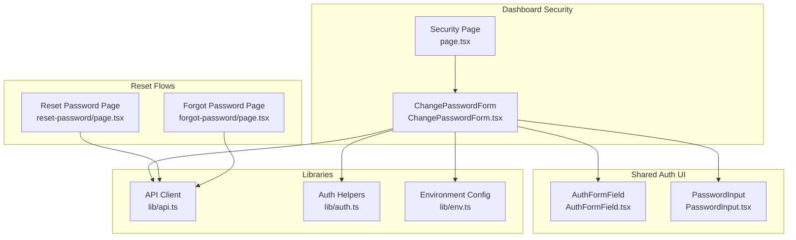
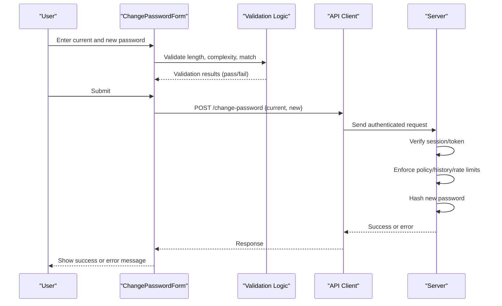
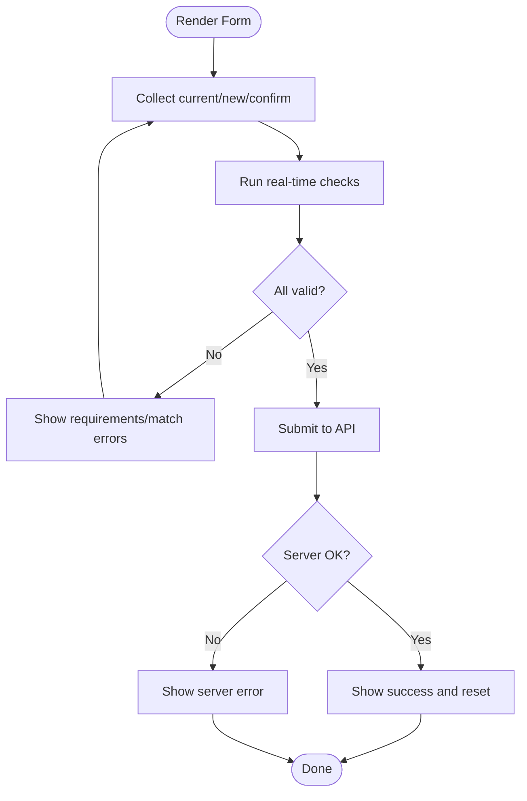
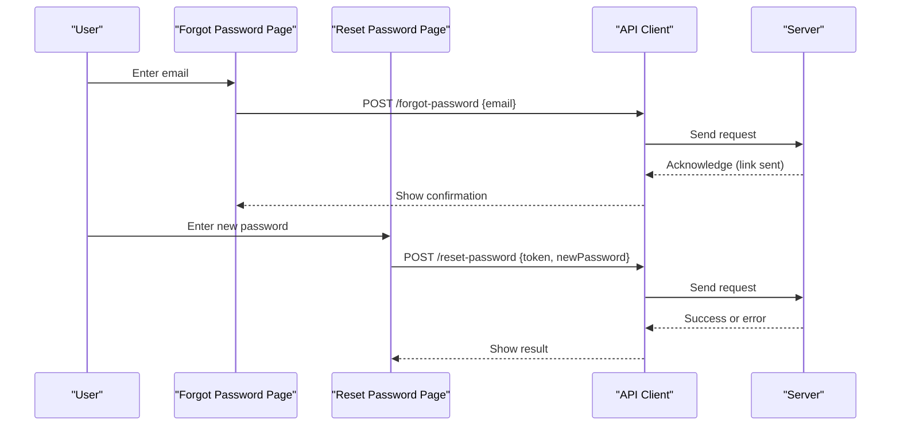
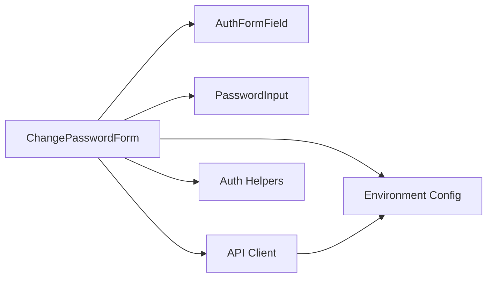

# Password Management

<cite>
**Referenced Files in This Document**
- [ChangePasswordForm.tsx](file://app/[locale]/dashboard/(routes)/security/_components/ChangePasswordForm.tsx)
- [Security page](file://app/[locale]/dashboard/(routes)/security/page.tsx)
- [AuthFormField.tsx](file://app/[locale]/(auth)/_components/AuthFormField.tsx)
- [PasswordInput.tsx](file://app/[locale]/(auth)/_components/PasswordInput.tsx)
- [reset-password page](file://app/[locale]/(auth)/auth/reset-password/page.tsx)
- [forgot-password page](file://app/[locale]/(auth)/forgot-password/page.tsx)
- [api.ts](file://lib/api.ts)
- [auth.ts](file://lib/auth.ts)
- [env.ts](file://lib/env.ts)
</cite>

## Table of Contents
1. [Introduction](#introduction)
2. [Project Structure](#project-structure)
3. [Core Components](#core-components)
4. [Architecture Overview](#architecture-overview)
5. [Detailed Component Analysis](#detailed-component-analysis)
6. [Dependency Analysis](#dependency-analysis)
7. [Performance Considerations](#performance-considerations)
8. [Troubleshooting Guide](#troubleshooting-guide)
9. [Conclusion](#conclusion)
10. [Appendices](#appendices)

## Introduction
This document explains the password management functionality implemented in the frontend, focusing on the ChangePasswordForm component and related flows. It covers real-time password strength validation, character requirements checking, confirmation matching, secure transmission to the server, and guidance for server-side considerations such as hashing, history enforcement, brute force protection, and lockout mechanisms. It also provides examples for customizing password policies, adding custom validation rules, and implementing password reset workflows.

## Project Structure
The password-related UI is primarily located under the dashboard security routes and shared auth components:
- Security dashboard form: app/[locale]/dashboard/(routes)/security/_components/ChangePasswordForm.tsx
- Security page entry: app/[locale]/dashboard/(routes)/security/page.tsx
- Shared auth form field: app/[locale]/(auth)/_components/AuthFormField.tsx
- Shared password input: app/[locale]/(auth)/_components/PasswordInput.tsx
- Reset password pages: app/[locale]/(auth)/auth/reset-password/page.tsx and app/[locale]/(auth)/forgot-password/page.tsx
- API client utilities: lib/api.ts
- Auth helpers: lib/auth.ts
- Environment configuration: lib/env.ts

**Diagram sources**
- [Security page](file://app/[locale]/dashboard/(routes)/security/page.tsx)
- [ChangePasswordForm.tsx](file://app/[locale]/dashboard/(routes)/security/_components/ChangePasswordForm.tsx)
- [AuthFormField.tsx](file://app/[locale]/(auth)/_components/AuthFormField.tsx)
- [PasswordInput.tsx](file://app/[locale]/(auth)/_components/PasswordInput.tsx)
- [reset-password page](file://app/[locale]/(auth)/auth/reset-password/page.tsx)
- [forgot-password page](file://app/[locale]/(auth)/forgot-password/page.tsx)
- [api.ts](file://lib/api.ts)
- [auth.ts](file://lib/auth.ts)
- [env.ts](file://lib/env.ts)

**Section sources**
- [Security page](file://app/[locale]/dashboard/(routes)/security/page.tsx)
- [ChangePasswordForm.tsx](file://app/[locale]/dashboard/(routes)/security/_components/ChangePasswordForm.tsx)
- [AuthFormField.tsx](file://app/[locale]/(auth)/_components/AuthFormField.tsx)
- [PasswordInput.tsx](file://app/[locale]/(auth)/_components/PasswordInput.tsx)
- [reset-password page](file://app/[locale]/(auth)/auth/reset-password/page.tsx)
- [forgot-password page](file://app/[locale]/(auth)/forgot-password/page.tsx)
- [api.ts](file://lib/api.ts)
- [auth.ts](file://lib/auth.ts)
- [env.ts](file://lib/env.ts)

## Core Components
- ChangePasswordForm: Orchestrates current/new password inputs, real-time validation (strength, requirements, match), submission state, and error handling. It uses shared form fields and a password input component.
- AuthFormField: Reusable form field wrapper used by ChangePasswordForm for consistent UX and validation messaging.
- PasswordInput: Secure password input with visibility toggle and optional inline feedback hooks.
- API client (lib/api.ts): Centralized HTTP calls to backend endpoints for changing passwords and resetting passwords.
- Auth helpers (lib/auth.ts): Utilities for session or token handling around authenticated requests.
- Environment config (lib/env.ts): Configuration for API base URLs and feature flags that may influence behavior.

Key responsibilities:
- Real-time validation: length, complexity, and confirmation matching.
- Submission flow: send current and new password securely; handle success/error states.
- UX feedback: show strength meter, requirement checklist, and errors.

**Section sources**
- [ChangePasswordForm.tsx](file://app/[locale]/dashboard/(routes)/security/_components/ChangePasswordForm.tsx)
- [AuthFormField.tsx](file://app/[locale]/(auth)/_components/AuthFormField.tsx)
- [PasswordInput.tsx](file://app/[locale]/(auth)/_components/PasswordInput.tsx)
- [api.ts](file://lib/api.ts)
- [auth.ts](file://lib/auth.ts)
- [env.ts](file://lib/env.ts)

## Architecture Overview
The ChangePassword workflow follows a client-driven validation and submission pattern:
- User interacts with ChangePasswordForm.
- Real-time checks run locally (length, complexity, match).
- On submit, the form sends an authenticated request via the API client.
- The server validates against policy, enforces history, applies rate limiting/lockout, hashes the password, and persists changes.
- The client updates UI based on response.

**Diagram sources**
- [ChangePasswordForm.tsx](file://app/[locale]/dashboard/(routes)/security/_components/ChangePasswordForm.tsx)
- [api.ts](file://lib/api.ts)

## Detailed Component Analysis

### ChangePasswordForm
Responsibilities:
- Manage form state for current password, new password, and confirm password.
- Provide real-time feedback: password strength, requirement checklist, and confirmation match.
- Handle submission lifecycle: loading, success, and error states.
- Integrate with API client for change-password endpoint.

Real-time validation highlights:
- Length check
- Complexity rules (e.g., uppercase, lowercase, number, special character)
- Confirmation matching between new and confirm fields
- Optional strength scoring and visual indicator

Submission flow:
- Prevents submission if validation fails.
- Sends authenticated request using API client.
- Displays user-friendly messages and resets form on success.

Customization points:
- Policy constants (min length, required character classes) can be centralized and imported.
- Strength calculation function can be replaced or extended.
- Error messages are localized through i18n keys used by shared form field.

**Diagram sources**
- [ChangePasswordForm.tsx](file://app/[locale]/dashboard/(routes)/security/_components/ChangePasswordForm.tsx)

**Section sources**
- [ChangePasswordForm.tsx](file://app/[locale]/dashboard/(routes)/security/_components/ChangePasswordForm.tsx)

### PasswordInput and AuthFormField
- PasswordInput: Provides secure input behavior, visibility toggle, and optional hooks for live feedback integration.
- AuthFormField: Wraps inputs with labels, helper text, and validation messages, ensuring consistent UX across forms.

Usage in ChangePasswordForm:
- Current password, new password, and confirm password fields are built from these primitives.
- Validation messages and accessibility attributes are handled centrally.

**Section sources**
- [PasswordInput.tsx](file://app/[locale]/(auth)/_components/PasswordInput.tsx)
- [AuthFormField.tsx](file://app/[locale]/(auth)/_components/AuthFormField.tsx)

### Password Reset Workflows
Two primary flows exist:
- Forgot Password: User submits email to receive a reset link.
- Reset Password: User sets a new password after following the link.

Client interactions:
- Both flows call API endpoints via the API client.
- They leverage shared form fields and validation patterns similar to ChangePasswordForm.

**Diagram sources**
- [forgot-password page](file://app/[locale]/(auth)/forgot-password/page.tsx)
- [reset-password page](file://app/[locale]/(auth)/auth/reset-password/page.tsx)
- [api.ts](file://lib/api.ts)

**Section sources**
- [forgot-password page](file://app/[locale]/(auth)/forgot-password/page.tsx)
- [reset-password page](file://app/[locale]/(auth)/auth/reset-password/page.tsx)
- [api.ts](file://lib/api.ts)

## Dependency Analysis
- ChangePasswordForm depends on:
  - AuthFormField and PasswordInput for UI composition.
  - API client for network calls.
  - Auth helpers for attaching credentials/session context.
  - Environment config for API base URL and feature toggles.
- API client centralizes HTTP logic, headers, and error normalization.
- Auth helpers abstract token/session retrieval and injection.

**Diagram sources**
- [ChangePasswordForm.tsx](file://app/[locale]/dashboard/(routes)/security/_components/ChangePasswordForm.tsx)
- [AuthFormField.tsx](file://app/[locale]/(auth)/_components/AuthFormField.tsx)
- [PasswordInput.tsx](file://app/[locale]/(auth)/_components/PasswordInput.tsx)
- [api.ts](file://lib/api.ts)
- [auth.ts](file://lib/auth.ts)
- [env.ts](file://lib/env.ts)

**Section sources**
- [ChangePasswordForm.tsx](file://app/[locale]/dashboard/(routes)/security/_components/ChangePasswordForm.tsx)
- [AuthFormField.tsx](file://app/[locale]/(auth)/_components/AuthFormField.tsx)
- [PasswordInput.tsx](file://app/[locale]/(auth)/_components/PasswordInput.tsx)
- [api.ts](file://lib/api.ts)
- [auth.ts](file://lib/auth.ts)
- [env.ts](file://lib/env.ts)

## Performance Considerations
- Debounce real-time validation to avoid excessive re-renders during typing.
- Keep strength calculations lightweight; consider memoization for complex scoring.
- Avoid unnecessary network calls; batch or coalesce requests where appropriate.
- Use optimistic UI only when safe; always reconcile with server responses.

[No sources needed since this section provides general guidance]

## Troubleshooting Guide
Common issues and resolutions:
- Validation never passes:
  - Check policy constants (length, character classes) and ensure they align with server expectations.
  - Confirm confirmation field matches new password exactly.
- Submission fails silently:
  - Inspect API client error handling and normalize server messages into user-friendly feedback.
  - Ensure authentication headers/tokens are attached correctly via auth helpers.
- Rate limiting or lockout:
  - If server returns rate limit or lockout errors, inform users and suggest retry timing.
  - Display clear messages and disable submit button temporarily.

Operational tips:
- Log detailed but non-sensitive diagnostics in development.
- Surface actionable error messages to users without exposing internal details.

**Section sources**
- [ChangePasswordForm.tsx](file://app/[locale]/dashboard/(routes)/security/_components/ChangePasswordForm.tsx)
- [api.ts](file://lib/api.ts)
- [auth.ts](file://lib/auth.ts)

## Conclusion
The frontend implements a robust, user-friendly password management experience with real-time validation, clear feedback, and secure submission. While the client enforces immediate usability constraints, critical security measures—such as password hashing, history enforcement, and brute force protections—are expected to be implemented server-side. The modular structure allows easy customization of policies and extension of validation rules.

[No sources needed since this section summarizes without analyzing specific files]

## Appendices

### Customizing Password Policies
- Centralize policy constants (minimum length, required character classes) and import them into ChangePasswordForm.
- Replace or extend the strength calculation function to reflect organizational standards.
- Update validation messages to match policy terminology.

**Section sources**
- [ChangePasswordForm.tsx](file://app/[locale]/dashboard/(routes)/security/_components/ChangePasswordForm.tsx)

### Adding Custom Validation Rules
- Extend the real-time validation pipeline in ChangePasswordForm to include additional checks (e.g., dictionary words, banned patterns).
- Integrate with PasswordInput’s feedback hooks to display inline hints.
- Ensure server-side parity for any new rules.

**Section sources**
- [ChangePasswordForm.tsx](file://app/[locale]/dashboard/(routes)/security/_components/ChangePasswordForm.tsx)
- [PasswordInput.tsx](file://app/[locale]/(auth)/_components/PasswordInput.tsx)

### Implementing Password Reset Workflows
- Use the existing forgot-password and reset-password pages as templates.
- Align client payloads and error handling with server expectations.
- Maintain consistent UX patterns from ChangePasswordForm for familiarity.

**Section sources**
- [forgot-password page](file://app/[locale]/(auth)/forgot-password/page.tsx)
- [reset-password page](file://app/[locale]/(auth)/auth/reset-password/page.tsx)
- [api.ts](file://lib/api.ts)

### Security Best Practices (Server-Side Guidance)
- Hashing: Always hash passwords server-side using a strong algorithm (e.g., bcrypt, argon2). Never store plaintext.
- Secure Transmission: Enforce HTTPS/TLS for all endpoints; validate certificates and use HSTS.
- Server-Side Validation: Re-validate all inputs on the server, including length, complexity, and confirmation.
- Password History: Compare against recent passwords to prevent reuse.
- Brute Force Protection: Implement rate limiting per IP/user and progressive delays.
- Lockout Mechanisms: Temporarily lock accounts after repeated failures; provide unlock procedures.
- Audit Logging: Record failed attempts and successful changes for monitoring and forensics.

[No sources needed since this section provides general guidance]