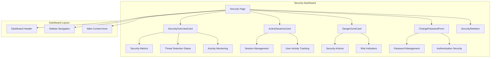
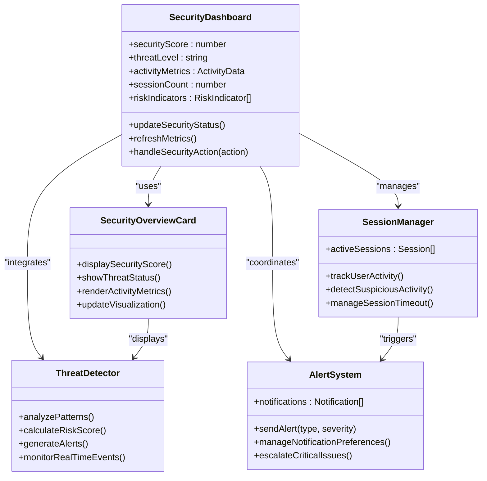
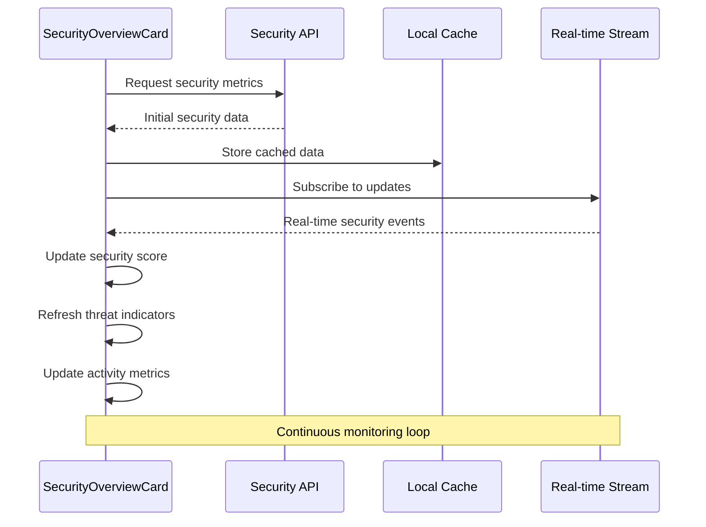
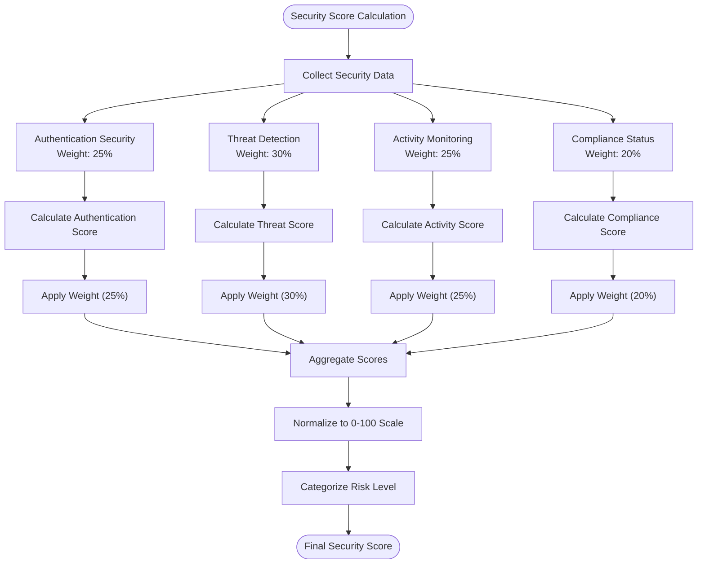
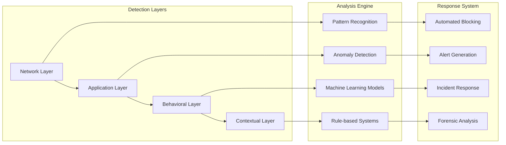
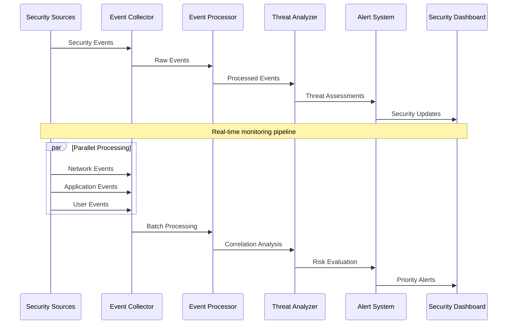
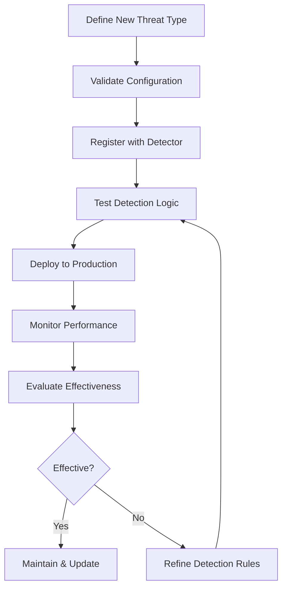

# Security Overview Dashboard

<cite>
**Referenced Files in This Document**
- [SecurityOverviewCard.tsx](file://app/[locale]/dashboard/(routes)/security/_components/SecurityOverviewCard.tsx)
- [ActiveSessionsCard.tsx](file://app/[locale]/dashboard/(routes)/security/_components/ActiveSessionsCard.tsx)
- [DangerZoneCard.tsx](file://app/[locale]/dashboard/(routes)/security/_components/DangerZoneCard.tsx)
- [ChangePasswordForm.tsx](file://app/[locale]/dashboard/(routes)/security/_components/ChangePasswordForm.tsx)
- [SecuritySkeleton.tsx](file://app/[locale]/dashboard/(routes)/security/_components/SecuritySkeleton.tsx)
- [page.tsx](file://app/[locale]/dashboard/(routes)/security/page.tsx)
</cite>

## Table of Contents
1. [Introduction](#introduction)
2. [Project Structure](#project-structure)
3. [Core Components](#core-components)
4. [Architecture Overview](#architecture-overview)
5. [Detailed Component Analysis](#detailed-component-analysis)
6. [Security Scoring Algorithms](#security-scoring-algorithms)
7. [Threat Detection and Risk Assessment](#threat-detection-and-risk-assessment)
8. [Real-time Monitoring and Alerts](#real-time-monitoring-and-alerts)
9. [Customization and Integration](#customization-and-integration)
10. [Performance Considerations](#performance-considerations)
11. [Troubleshooting Guide](#troubleshooting-guide)
12. [Conclusion](#conclusion)

## Introduction

The Security Overview Dashboard provides a comprehensive interface for monitoring and managing application security metrics, threat detection status, and activity monitoring. The dashboard serves as a centralized hub for administrators and users to assess their security posture, identify potential threats, and take proactive measures to maintain system integrity.

The dashboard implements a multi-layered security monitoring approach that combines real-time threat detection, historical activity analysis, and predictive risk assessment to provide actionable security insights.

## Project Structure

The security dashboard is organized within the Next.js application structure, following feature-based architecture patterns:

**Diagram sources**
- [page.tsx](file://app/[locale]/dashboard/(routes)/security/page.tsx)
- [SecurityOverviewCard.tsx](file://app/[locale]/dashboard/(routes)/security/_components/SecurityOverviewCard.tsx)
- [ActiveSessionsCard.tsx](file://app/[locale]/dashboard/(routes)/security/_components/ActiveSessionsCard.tsx)
- [DangerZoneCard.tsx](file://app/[locale]/dashboard/(routes)/security/_components/DangerZoneCard.tsx)
- [ChangePasswordForm.tsx](file://app/[locale]/dashboard/(routes)/security/_components/ChangePasswordForm.tsx)
- [SecuritySkeleton.tsx](file://app/[locale]/dashboard/(routes)/security/_components/SecuritySkeleton.tsx)

**Section sources**
- [page.tsx](file://app/[locale]/dashboard/(routes)/security/page.tsx)

## Core Components

The security dashboard consists of several key components that work together to provide comprehensive security monitoring capabilities:

### SecurityOverviewCard
The primary component responsible for displaying overall security metrics, threat detection status, and activity monitoring data. This component serves as the central hub for security information visualization.

### ActiveSessionsCard
Manages user session tracking and displays active security sessions, providing insights into current user activities and potential security concerns.

### DangerZoneCard
Handles critical security actions and displays high-risk indicators, allowing administrators to perform essential security operations.

### ChangePasswordForm
Provides secure password management functionality with validation and security best practices enforcement.

### SecuritySkeleton
Implements loading states and skeleton screens for improved user experience during data fetching operations.

**Section sources**
- [SecurityOverviewCard.tsx](file://app/[locale]/dashboard/(routes)/security/_components/SecurityOverviewCard.tsx)
- [ActiveSessionsCard.tsx](file://app/[locale]/dashboard/(routes)/security/_components/ActiveSessionsCard.tsx)
- [DangerZoneCard.tsx](file://app/[locale]/dashboard/(routes)/security/_components/DangerZoneCard.tsx)
- [ChangePasswordForm.tsx](file://app/[locale]/dashboard/(routes)/security/_components/ChangePasswordForm.tsx)
- [SecuritySkeleton.tsx](file://app/[locale]/dashboard/(routes)/security/_components/SecuritySkeleton.tsx)

## Architecture Overview

The security dashboard follows a modular architecture pattern with clear separation of concerns:

**Diagram sources**
- [SecurityOverviewCard.tsx](file://app/[locale]/dashboard/(routes)/security/_components/SecurityOverviewCard.tsx)
- [ActiveSessionsCard.tsx](file://app/[locale]/dashboard/(routes)/security/_components/ActiveSessionsCard.tsx)
- [DangerZoneCard.tsx](file://app/[locale]/dashboard/(routes)/security/_components/DangerZoneCard.tsx)

## Detailed Component Analysis

### SecurityOverviewCard Component

The SecurityOverviewCard component serves as the main interface for security metric visualization and interaction.

#### Key Features:
- **Security Score Display**: Real-time calculation and visualization of overall security posture
- **Threat Detection Status**: Visual indicators showing current threat levels and detection status
- **Activity Monitoring Metrics**: Comprehensive tracking of user activities and system events
- **Interactive Controls**: User interactions for security configuration and response actions

#### Data Flow:

**Diagram sources**
- [SecurityOverviewCard.tsx](file://app/[locale]/dashboard/(routes)/security/_components/SecurityOverviewCard.tsx)

### ActiveSessionsCard Component

This component manages user session tracking and provides insights into current security sessions.

#### Functionality:
- **Session Monitoring**: Real-time tracking of active user sessions
- **Activity Analysis**: Detection of suspicious or unusual session patterns
- **Session Management**: Controls for session termination and timeout management
- **Security Insights**: Analysis of session behavior and risk assessment

### DangerZoneCard Component

Handles critical security operations and displays high-risk indicators requiring immediate attention.

#### Capabilities:
- **Emergency Actions**: Quick access to critical security operations
- **Risk Visualization**: Clear display of current risk levels and threats
- **Audit Trail**: Logging of all security-related actions taken
- **Confirmation Workflows**: Safety mechanisms for destructive operations

### ChangePasswordForm Component

Provides secure password management with comprehensive validation and security best practices.

#### Security Features:
- **Password Strength Validation**: Real-time strength assessment
- **Complexity Requirements**: Enforcement of security policies
- **Secure Transmission**: Encrypted password updates
- **History Prevention**: Prevention of password reuse

**Section sources**
- [SecurityOverviewCard.tsx](file://app/[locale]/dashboard/(routes)/security/_components/SecurityOverviewCard.tsx)
- [ActiveSessionsCard.tsx](file://app/[locale]/dashboard/(routes)/security/_components/ActiveSessionsCard.tsx)
- [DangerZoneCard.tsx](file://app/[locale]/dashboard/(routes)/security/_components/DangerZoneCard.tsx)
- [ChangePasswordForm.tsx](file://app/[locale]/dashboard/(routes)/security/_components/ChangePasswordForm.tsx)

## Security Scoring Algorithms

The security scoring system employs a multi-factor algorithm that evaluates various security aspects to calculate an overall security posture score.

### Scoring Methodology:

**Diagram sources**
- [SecurityOverviewCard.tsx](file://app/[locale]/dashboard/(routes)/security/_components/SecurityOverviewCard.tsx)

### Risk Level Categories:
- **Critical (0-20)**: Immediate action required
- **High (21-40)**: Urgent attention needed
- **Medium (41-60)**: Moderate risk level
- **Low (61-80)**: Acceptable risk level
- **Minimal (81-100)**: Optimal security posture

## Threat Detection and Risk Assessment

The threat detection system implements multiple layers of security monitoring and analysis.

### Threat Detection Layers:

**Diagram sources**
- [SecurityOverviewCard.tsx](file://app/[locale]/dashboard/(routes)/security/_components/SecurityOverviewCard.tsx)
- [ActiveSessionsCard.tsx](file://app/[locale]/dashboard/(routes)/security/_components/ActiveSessionsCard.tsx)

### Risk Assessment Indicators:

| Indicator | Description | Weight | Threshold |
|-----------|-------------|--------|-----------|
| Failed Login Attempts | Number of unsuccessful authentication attempts | High | >5 per hour |
| Unusual Access Patterns | Geographic or temporal anomalies | Medium | Deviation >2σ |
| Privilege Escalation | Unauthorized permission changes | Critical | Any occurrence |
| Data Exfiltration | Suspicious data transfer patterns | Critical | Volume spikes |
| Malware Detection | Known malicious signature matches | Critical | Any match |
| Policy Violations | Security policy breaches | Medium | Any violation |

## Real-time Monitoring and Alerts

The dashboard implements comprehensive real-time security monitoring with intelligent alerting mechanisms.

### Monitoring Architecture:

**Diagram sources**
- [SecurityOverviewCard.tsx](file://app/[locale]/dashboard/(routes)/security/_components/SecurityOverviewCard.tsx)
- [ActiveSessionsCard.tsx](file://app/[locale]/dashboard/(routes)/security/_components/ActiveSessionsCard.tsx)

### Alert Classification System:

| Severity | Response Time | Notification Method | Escalation |
|----------|---------------|-------------------|------------|
| Critical | < 1 minute | SMS + Email + In-app | Immediate escalation |
| High | < 5 minutes | Email + In-app | 15-minute escalation |
| Medium | < 30 minutes | Email + Dashboard | Business hours only |
| Low | < 24 hours | Dashboard only | Weekly summary |

## Customization and Integration

### Customizing Security Metrics

Administrators can customize security metrics through the configuration interface:

#### Metric Configuration Options:
- **Custom Weights**: Adjust importance of different security factors
- **Threshold Settings**: Configure alert thresholds for specific metrics
- **Metric Selection**: Enable/disable specific security indicators
- **Reporting Periods**: Customize time windows for trend analysis

### Adding New Threat Types

The threat detection system supports extensible threat type definitions:

#### Threat Type Implementation:

**Diagram sources**
- [SecurityOverviewCard.tsx](file://app/[locale]/dashboard/(routes)/security/_components/SecurityOverviewCard.tsx)

### External Service Integration

The dashboard supports integration with external security monitoring services:

#### Supported Integrations:
- **SIEM Systems**: Security Information and Event Management platforms
- **Vulnerability Scanners**: Automated vulnerability assessment tools
- **Threat Intelligence Feeds**: External threat intelligence sources
- **Compliance Engines**: Regulatory compliance checking systems
- **Identity Providers**: External authentication and authorization services

#### Integration Configuration:
- **API Endpoints**: RESTful API connections for data exchange
- **Webhook Support**: Real-time event notifications
- **Authentication Methods**: OAuth, API keys, certificate-based auth
- **Data Mapping**: Field mapping between internal and external formats

## Performance Considerations

### Optimization Strategies:

1. **Lazy Loading**: Security components load on-demand to reduce initial bundle size
2. **Caching Strategy**: Intelligent caching of security metrics with configurable TTL
3. **WebSocket Efficiency**: Optimized real-time updates with debouncing and throttling
4. **Memory Management**: Proper cleanup of event listeners and subscriptions
5. **Bundle Splitting**: Code splitting for security-specific functionality

### Scalability Considerations:

- **Horizontal Scaling**: Stateless design allows easy horizontal scaling
- **Database Optimization**: Efficient queries and indexing for security data
- **Message Queue**: Asynchronous processing for heavy security computations
- **CDN Integration**: Static assets served through content delivery networks

## Troubleshooting Guide

### Common Issues and Solutions:

#### Security Score Not Updating
- **Check WebSocket Connection**: Verify real-time connection status
- **Review API Health**: Ensure security APIs are responding correctly
- **Clear Browser Cache**: Remove stale cached security data
- **Verify Permissions**: Confirm user has appropriate security access rights

#### Alert Notifications Not Working
- **Check Notification Preferences**: Verify user notification settings
- **Validate Email Configuration**: Ensure email service is properly configured
- **Review Alert Filters**: Check if alerts are being filtered out by rules
- **Test Webhook Endpoints**: Verify external service connectivity

#### Performance Degradation
- **Monitor Resource Usage**: Check CPU and memory consumption
- **Review Query Performance**: Analyze database query execution times
- **Check Network Latency**: Monitor API response times
- **Optimize Bundle Size**: Review and optimize JavaScript bundles

### Debug Tools:

- **Security Console**: Built-in debugging interface for security events
- **Event Log Viewer**: Detailed logging of security-related activities
- **Performance Profiler**: Analysis of security component performance
- **Network Inspector**: Monitoring of security API calls and responses

## Conclusion

The Security Overview Dashboard provides a comprehensive and intuitive interface for monitoring and managing application security. Through its modular architecture, real-time monitoring capabilities, and customizable alerting system, it enables organizations to maintain robust security postures while providing actionable insights for security teams.

The dashboard's extensible design allows for easy customization and integration with existing security infrastructure, making it adaptable to various organizational needs and security requirements. With proper configuration and maintenance, it serves as a valuable tool for proactive security management and threat mitigation.