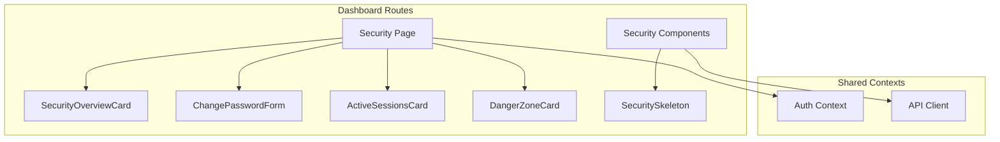
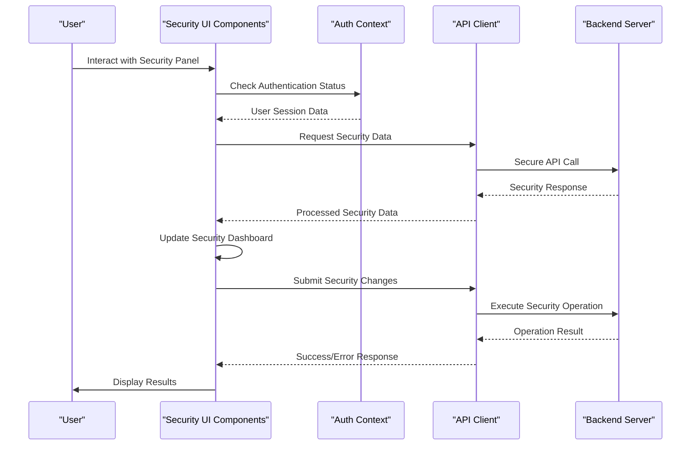
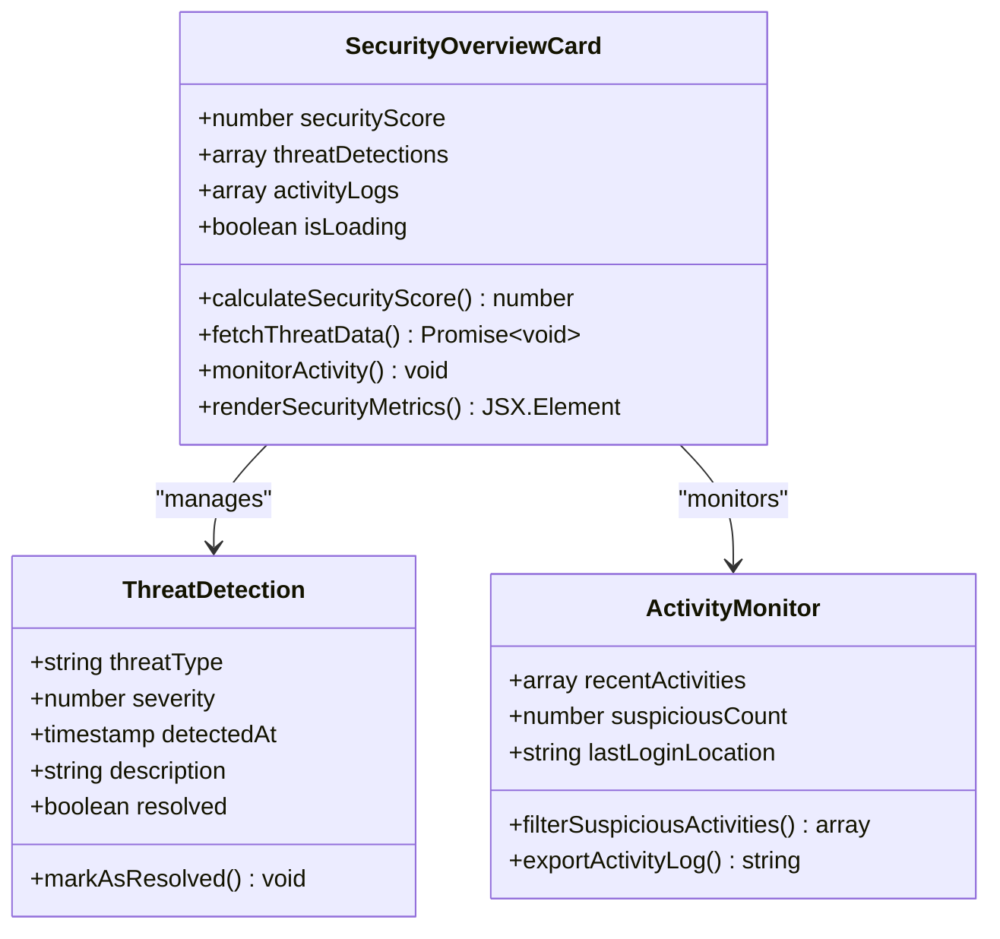
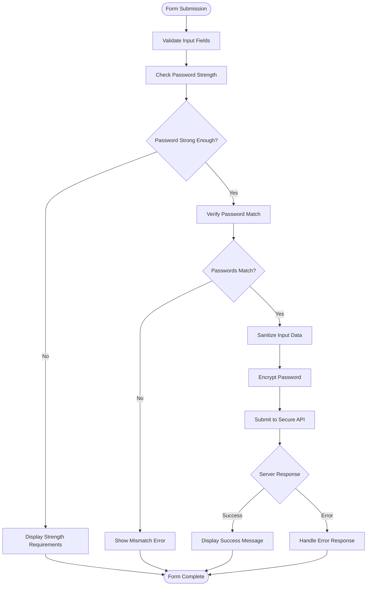
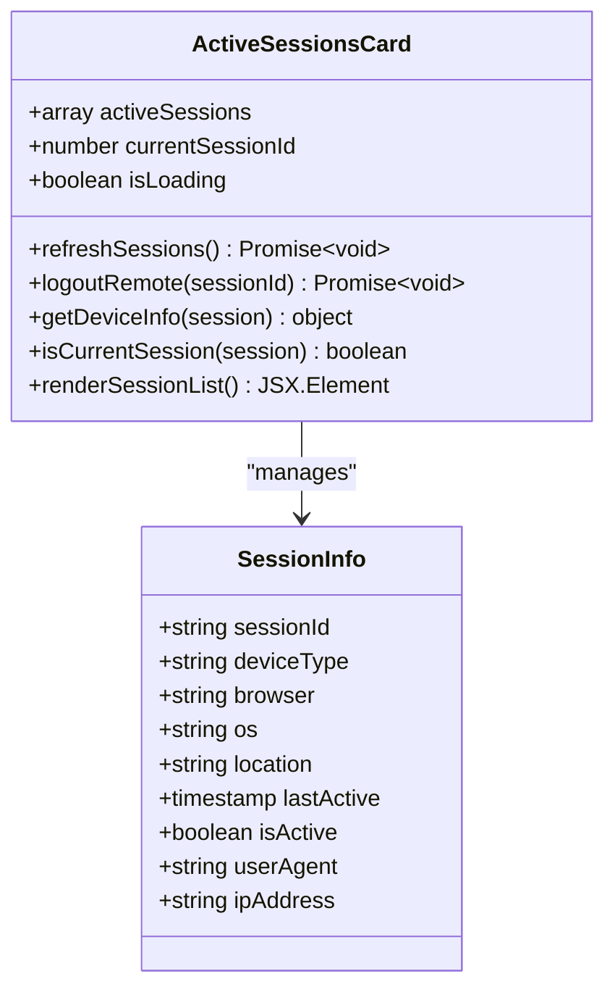
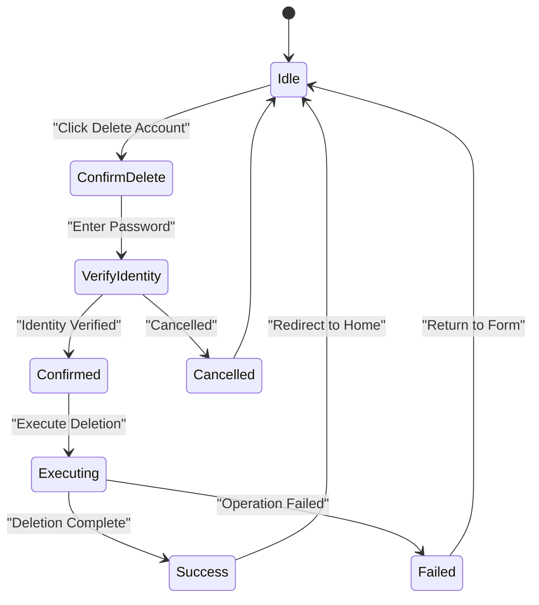
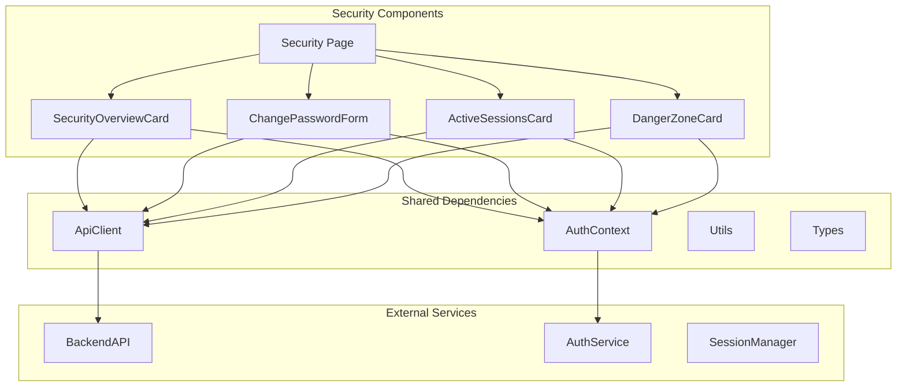

# Security Settings Panel

<cite>
**Referenced Files in This Document**
- [security/page.tsx](file://app/[locale]/dashboard/(routes)/security/page.tsx)
- [SecurityOverviewCard.tsx](file://app/[locale]/dashboard/(routes)/security/_components/SecurityOverviewCard.tsx)
- [ChangePasswordForm.tsx](file://app/[locale]/dashboard/(routes)/security/_components/ChangePasswordForm.tsx)
- [ActiveSessionsCard.tsx](file://app/[locale]/dashboard/(routes)/security/_components/ActiveSessionsCard.tsx)
- [DangerZoneCard.tsx](file://app/[locale]/dashboard/(routes)/security/_components/DangerZoneCard.tsx)
- [SecuritySkeleton.tsx](file://app/[locale]/dashboard/(routes)/security/_components/SecuritySkeleton.tsx)
- [AuthContext.tsx](file://contexts/AuthContext.tsx)
- [auth.ts](file://lib/auth.ts)
- [api.ts](file://lib/api.ts)
</cite>

## Table of Contents
1. [Introduction](#introduction)
2. [Project Structure](#project-structure)
3. [Core Components](#core-components)
4. [Architecture Overview](#architecture-overview)
5. [Detailed Component Analysis](#detailed-component-analysis)
6. [Dependency Analysis](#dependency-analysis)
7. [Performance Considerations](#performance-considerations)
8. [Security Best Practices](#security-best-practices)
9. [Troubleshooting Guide](#troubleshooting-guide)
10. [Conclusion](#conclusion)
11. [Appendices](#appendices)

## Introduction

The Security Settings Panel is a comprehensive security management interface within the Automex dashboard application. It provides users with essential security controls including password management, session monitoring, account protection, and destructive action safeguards. The panel serves as the central hub for users to maintain their account security posture and monitor potential threats.

This documentation covers the complete security architecture, component interactions, data flows, and implementation patterns used throughout the security settings panel. It also includes guidance on extending functionality with additional security features like two-factor authentication and custom security policies.

## Project Structure

The security settings panel follows a modular component-based architecture organized under the dashboard routes structure:

**Diagram sources**
- [security/page.tsx](file://app/[locale]/dashboard/(routes)/security/page.tsx)
- [SecurityOverviewCard.tsx](file://app/[locale]/dashboard/(routes)/security/_components/SecurityOverviewCard.tsx)
- [ChangePasswordForm.tsx](file://app/[locale]/dashboard/(routes)/security/_components/ChangePasswordForm.tsx)
- [ActiveSessionsCard.tsx](file://app/[locale]/dashboard/(routes)/security/_components/ActiveSessionsCard.tsx)
- [DangerZoneCard.tsx](file://app/[locale]/dashboard/(routes)/security/_components/DangerZoneCard.tsx)

**Section sources**
- [security/page.tsx](file://app/[locale]/dashboard/(routes)/security/page.tsx)
- [SecurityOverviewCard.tsx](file://app/[locale]/dashboard/(routes)/security/_components/SecurityOverviewCard.tsx)
- [ChangePasswordForm.tsx](file://app/[locale]/dashboard/(routes)/security/_components/ChangePasswordForm.tsx)
- [ActiveSessionsCard.tsx](file://app/[locale]/dashboard/(routes)/security/_components/ActiveSessionsCard.tsx)
- [DangerZoneCard.tsx](file://app/[locale]/dashboard/(routes)/security/_components/DangerZoneCard.tsx)

## Core Components

The security settings panel consists of four primary components, each responsible for specific security functionality:

### Security Overview Dashboard
Provides a comprehensive security status overview including threat detection metrics, activity monitoring, and overall security score calculation.

### Password Management System
Handles secure password changes with strength validation, confirmation matching, and encrypted submission handling.

### Session Management Interface
Manages active user sessions across devices, supports session expiration policies, and enables remote logout capabilities.

### Destructive Action Controls
Provides controlled access to irreversible operations like account deletion and data export with proper confirmation workflows.

**Section sources**
- [SecurityOverviewCard.tsx](file://app/[locale]/dashboard/(routes)/security/_components/SecurityOverviewCard.tsx)
- [ChangePasswordForm.tsx](file://app/[locale]/dashboard/(routes)/security/_components/ChangePasswordForm.tsx)
- [ActiveSessionsCard.tsx](file://app/[locale]/dashboard/(routes)/security/_components/ActiveSessionsCard.tsx)
- [DangerZoneCard.tsx](file://app/[locale]/dashboard/(routes)/security/_components/DangerZoneCard.tsx)

## Architecture Overview

The security settings panel implements a client-server architecture with real-time updates and comprehensive error handling:

**Diagram sources**
- [security/page.tsx](file://app/[locale]/dashboard/(routes)/security/page.tsx)
- [AuthContext.tsx](file://contexts/AuthContext.tsx)
- [api.ts](file://lib/api.ts)

## Detailed Component Analysis

### Security Overview Dashboard

The Security Overview Dashboard provides real-time security insights through multiple visualization components:

**Diagram sources**
- [SecurityOverviewCard.tsx](file://app/[locale]/dashboard/(routes)/security/_components/SecurityOverviewCard.tsx)

Key features include:
- **Security Score Calculation**: Algorithmic assessment based on password strength, session security, and threat history
- **Real-time Threat Detection**: Continuous monitoring of suspicious activities and automated alerts
- **Activity Monitoring**: Comprehensive logging of user actions with anomaly detection
- **Visual Security Indicators**: Color-coded status indicators and progress bars

**Section sources**
- [SecurityOverviewCard.tsx](file://app/[locale]/dashboard/(routes)/security/_components/SecurityOverviewCard.tsx)

### ChangePasswordForm

The password change form implements robust validation and secure submission handling:

**Diagram sources**
- [ChangePasswordForm.tsx](file://app/[locale]/dashboard/(routes)/security/_components/ChangePasswordForm.tsx)

Implementation highlights:
- **Multi-layer Validation**: Client-side and server-side validation with comprehensive error messages
- **Password Strength Assessment**: Real-time strength evaluation using industry-standard algorithms
- **Secure Submission**: Encrypted password transmission with CSRF protection
- **User Feedback**: Immediate visual feedback for validation states and errors

**Section sources**
- [ChangePasswordForm.tsx](file://app/[locale]/dashboard/(routes)/security/_components/ChangePasswordForm.tsx)

### ActiveSessionsCard

Session management functionality for controlling logged-in devices and sessions:

**Diagram sources**
- [ActiveSessionsCard.tsx](file://app/[locale]/dashboard/(routes)/security/_components/ActiveSessionsCard.tsx)

Core capabilities:
- **Session Enumeration**: Complete listing of all active user sessions with detailed device information
- **Remote Session Termination**: Ability to terminate any session except the current one
- **Device Fingerprinting**: Advanced device identification using user agent and IP analysis
- **Real-time Updates**: Automatic session refresh and live status updates

**Section sources**
- [ActiveSessionsCard.tsx](file://app/[locale]/dashboard/(routes)/security/_components/ActiveSessionsCard.tsx)

### DangerZoneCard

Controls for destructive and irreversible security operations:

**Diagram sources**
- [DangerZoneCard.tsx](file://app/[locale]/dashboard/(routes)/security/_components/DangerZoneCard.tsx)

Safety mechanisms include:
- **Multi-step Confirmation**: Progressive confirmation dialogs with clear warnings
- **Identity Verification**: Re-authentication required before executing destructive actions
- **Grace Period Implementation**: Optional delay periods before permanent deletion
- **Audit Trail Logging**: Comprehensive logging of all destructive operations

**Section sources**
- [DangerZoneCard.tsx](file://app/[locale]/dashboard/(routes)/security/_components/DangerZoneCard.tsx)

## Dependency Analysis

The security components have well-defined dependency relationships:

**Diagram sources**
- [security/page.tsx](file://app/[locale]/dashboard/(routes)/security/page.tsx)
- [AuthContext.tsx](file://contexts/AuthContext.tsx)
- [api.ts](file://lib/api.ts)

**Section sources**
- [security/page.tsx](file://app/[locale]/dashboard/(routes)/security/page.tsx)
- [AuthContext.tsx](file://contexts/AuthContext.tsx)
- [api.ts](file://lib/api.ts)

## Performance Considerations

The security panel implements several performance optimizations:

- **Lazy Loading**: Components are loaded on-demand to reduce initial bundle size
- **Caching Strategies**: Security data is cached with appropriate invalidation policies
- **Optimistic Updates**: UI updates occur immediately while background requests process
- **Debounced Operations**: Search and filter operations are debounced to prevent excessive API calls
- **Memory Management**: Proper cleanup of event listeners and timers when components unmount

## Security Best Practices

### Input Sanitization
All user inputs undergo comprehensive sanitization to prevent XSS attacks and injection vulnerabilities. The implementation uses established sanitization libraries and custom validators.

### CSRF Protection
Cross-Site Request Forgery protection is implemented through token-based verification for all state-changing operations.

### Audit Logging
Comprehensive audit trails log all security-related actions with timestamps, user context, and operation details for compliance and forensic analysis.

### Rate Limiting
API endpoints implement rate limiting to prevent brute force attacks and resource exhaustion.

### Encryption Standards
Sensitive data uses industry-standard encryption algorithms for both storage and transmission.

## Troubleshooting Guide

Common issues and their resolutions:

### Authentication Errors
- **Symptom**: Users unable to perform security operations
- **Cause**: Expired or invalid authentication tokens
- **Solution**: Implement automatic token refresh and re-authentication prompts

### Session Synchronization Issues
- **Symptom**: Active sessions not updating in real-time
- **Cause**: WebSocket connection failures or polling intervals too long
- **Solution**: Implement fallback mechanisms and adaptive polling strategies

### Form Validation Failures
- **Symptom**: Password changes failing despite valid input
- **Cause**: Server-side validation stricter than client-side
- **Solution**: Align validation rules and provide specific error messages

**Section sources**
- [SecuritySkeleton.tsx](file://app/[locale]/dashboard/(routes)/security/_components/SecuritySkeleton.tsx)

## Conclusion

The Security Settings Panel provides a comprehensive and secure interface for managing user account security. Through its modular architecture, robust validation, and comprehensive error handling, it ensures users can effectively manage their security posture while maintaining optimal performance and user experience.

The implementation follows modern security best practices and provides extensible foundations for adding advanced security features like two-factor authentication and custom security policies.

## Appendices

### Adding New Security Features

To extend the security panel with new features:

1. **Create New Component**: Follow existing component patterns in the `_components` directory
2. **Implement Validation**: Add client-side and server-side validation logic
3. **Update API Integration**: Extend the API client with new endpoints
4. **Add UI Components**: Integrate with the main security page layout
5. **Test Thoroughly**: Include unit tests and integration tests for new functionality

### Implementing Two-Factor Authentication

Two-factor authentication can be added by:

1. **Adding TOTP Support**: Implement time-based one-time password generation
2. **QR Code Generation**: Provide QR codes for authenticator app setup
3. **Backup Codes**: Generate and securely store backup recovery codes
4. **Recovery Flow**: Implement account recovery procedures for lost 2FA access

### Customizing Security Policies

Security policies can be customized through:

1. **Configuration Files**: Define policy rules in centralized configuration
2. **Dynamic Policy Loading**: Support runtime policy updates without deployment
3. **Policy Enforcement**: Implement policy checking at appropriate validation points
4. **Policy Auditing**: Log policy violations and enforcement actions