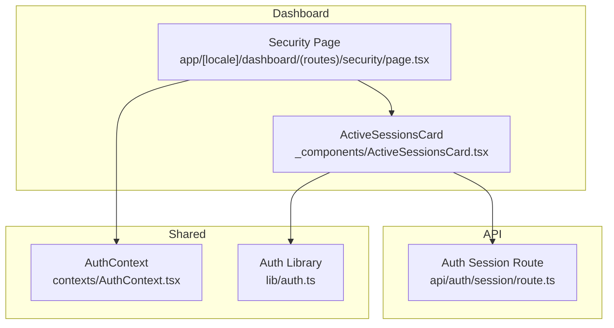
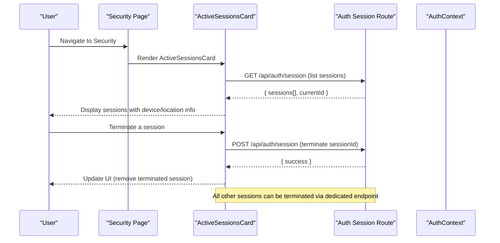
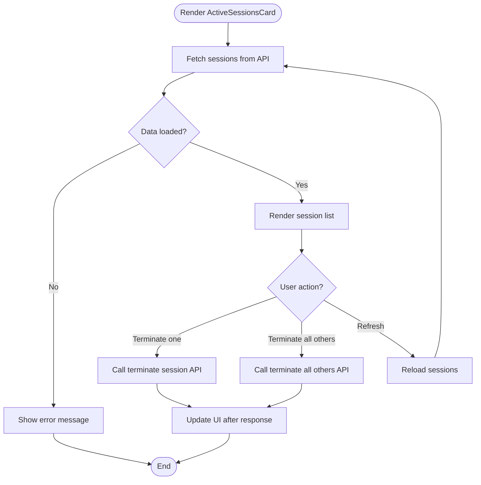
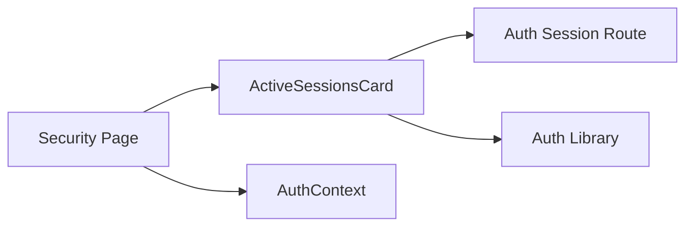

# Session Management

<cite>
**Referenced Files in This Document**
- [ActiveSessionsCard.tsx](file://app/[locale]/dashboard/(routes)/security/_components/ActiveSessionsCard.tsx)
- [SecurityPage.tsx](file://app/[locale]/dashboard/(routes)/security/page.tsx)
- [AuthSessionRoute.tsx](file://app/api/auth/session/route.ts)
- [AuthContext.tsx](file://contexts/AuthContext.tsx)
- [AuthLib.tsx](file://lib/auth.ts)
</cite>

## Table of Contents
1. [Introduction](#introduction)
2. [Project Structure](#project-structure)
3. [Core Components](#core-components)
4. [Architecture Overview](#architecture-overview)
5. [Detailed Component Analysis](#detailed-component-analysis)
6. [Dependency Analysis](#dependency-analysis)
7. [Performance Considerations](#performance-considerations)
8. [Troubleshooting Guide](#troubleshooting-guide)
9. [Conclusion](#conclusion)

## Introduction
This document explains the session management capabilities implemented in the frontend, focusing on how users can view and manage their active sessions. It covers the ActiveSessionsCard component for displaying current user sessions, device information, and login locations; outlines the session lifecycle including automatic expiration and manual termination; and describes security measures such as IP tracking, user agent detection, and geographic location display. It also provides guidance for implementing session timeout policies, adding session alerts, and integrating with session monitoring services.

## Project Structure
The session management feature is primarily located under the dashboard security routes and related API endpoints:
- Dashboard Security Page: hosts the session management UI
- Active Sessions Card: renders the list of active sessions and actions
- Auth Session API Route: exposes server-side session operations
- Authentication Context and Library: provide shared auth state and utilities used by session flows

**Diagram sources**
- [SecurityPage.tsx](file://app/[locale]/dashboard/(routes)/security/page.tsx)
- [ActiveSessionsCard.tsx](file://app/[locale]/dashboard/(routes)/security/_components/ActiveSessionsCard.tsx)
- [AuthSessionRoute.tsx](file://app/api/auth/session/route.ts)
- [AuthContext.tsx](file://contexts/AuthContext.tsx)
- [AuthLib.tsx](file://lib/auth.ts)

**Section sources**
- [SecurityPage.tsx](file://app/[locale]/dashboard/(routes)/security/page.tsx)
- [ActiveSessionsCard.tsx](file://app/[locale]/dashboard/(routes)/security/_components/ActiveSessionsCard.tsx)
- [AuthSessionRoute.tsx](file://app/api/auth/session/route.ts)
- [AuthContext.tsx](file://contexts/AuthContext.tsx)
- [AuthLib.tsx](file://lib/auth.ts)

## Core Components
- ActiveSessionsCard
  - Displays a list of current user sessions with details such as device type, browser, operating system, IP address, and approximate location.
  - Provides actions to terminate specific sessions or all other sessions.
  - Supports refresh to reload session data from the server.
- Security Page
  - Wraps the ActiveSessionsCard and manages loading states and error handling.
  - Integrates with authentication context to ensure only authenticated users access session controls.
- Auth Session API Route
  - Exposes endpoints to fetch active sessions and terminate sessions (single or all others).
  - Validates requests and returns structured responses consumed by the UI.
- Auth Context and Library
  - Provide shared authentication state and helper functions used across session-related flows.

**Section sources**
- [ActiveSessionsCard.tsx](file://app/[locale]/dashboard/(routes)/security/_components/ActiveSessionsCard.tsx)
- [SecurityPage.tsx](file://app/[locale]/dashboard/(routes)/security/page.tsx)
- [AuthSessionRoute.tsx](file://app/api/auth/session/route.ts)
- [AuthContext.tsx](file://contexts/AuthContext.tsx)
- [AuthLib.tsx](file://lib/auth.ts)

## Architecture Overview
The session management architecture follows a client-server pattern:
- The Security Page renders the ActiveSessionsCard.
- ActiveSessionsCard calls the Auth Session API Route to retrieve and manage sessions.
- Responses are rendered into a user-friendly list with actionable controls.
- Authentication context ensures secure access and consistent state.

**Diagram sources**
- [SecurityPage.tsx](file://app/[locale]/dashboard/(routes)/security/page.tsx)
- [ActiveSessionsCard.tsx](file://app/[locale]/dashboard/(routes)/security/_components/ActiveSessionsCard.tsx)
- [AuthSessionRoute.tsx](file://app/api/auth/session/route.ts)
- [AuthContext.tsx](file://contexts/AuthContext.tsx)

## Detailed Component Analysis

### ActiveSessionsCard
Responsibilities:
- Fetches active sessions from the backend and displays them in a table or list.
- Shows device information (device type, browser, OS), IP address, and approximate location.
- Provides controls to terminate individual sessions or all other sessions.
- Handles loading, error, and empty states.

Key behaviors:
- Refresh action re-fetches sessions.
- Terminate actions call the appropriate API endpoint and update local state.
- Uses authentication context to ensure the user is logged in before rendering controls.

**Diagram sources**
- [ActiveSessionsCard.tsx](file://app/[locale]/dashboard/(routes)/security/_components/ActiveSessionsCard.tsx)
- [AuthSessionRoute.tsx](file://app/api/auth/session/route.ts)

**Section sources**
- [ActiveSessionsCard.tsx](file://app/[locale]/dashboard/(routes)/security/_components/ActiveSessionsCard.tsx)

### Security Page
Responsibilities:
- Hosts the ActiveSessionsCard within the dashboard layout.
- Manages page-level loading and error boundaries.
- Ensures the user is authenticated before exposing session controls.

Integration points:
- Uses authentication context to guard access.
- Passes props to ActiveSessionsCard for data fetching and actions.

**Section sources**
- [SecurityPage.tsx](file://app/[locale]/dashboard/(routes)/security/page.tsx)
- [AuthContext.tsx](file://contexts/AuthContext.tsx)

### Auth Session API Route
Responsibilities:
- Implements endpoints to list active sessions and terminate sessions.
- Validates request payloads and user identity.
- Returns structured JSON responses consumed by the UI.

Endpoints typically include:
- List sessions: GET /api/auth/session
- Terminate session: POST /api/auth/session with sessionId
- Terminate all others: POST /api/auth/session with action to keep current

Security considerations:
- Enforce authentication and authorization checks.
- Validate inputs and sanitize outputs.
- Rate-limit sensitive operations if needed.

**Section sources**
- [AuthSessionRoute.tsx](file://app/api/auth/session/route.ts)

### Auth Context and Library
Responsibilities:
- Provide shared authentication state and helpers used by session flows.
- Ensure consistent behavior across components that depend on user identity.

Usage patterns:
- Guard session management pages and actions.
- Trigger UI updates when authentication state changes.

**Section sources**
- [AuthContext.tsx](file://contexts/AuthContext.tsx)
- [AuthLib.tsx](file://lib/auth.ts)

## Dependency Analysis
The following diagram shows how components and modules depend on each other for session management:

**Diagram sources**
- [SecurityPage.tsx](file://app/[locale]/dashboard/(routes)/security/page.tsx)
- [ActiveSessionsCard.tsx](file://app/[locale]/dashboard/(routes)/security/_components/ActiveSessionsCard.tsx)
- [AuthSessionRoute.tsx](file://app/api/auth/session/route.ts)
- [AuthContext.tsx](file://contexts/AuthContext.tsx)
- [AuthLib.tsx](file://lib/auth.ts)

**Section sources**
- [SecurityPage.tsx](file://app/[locale]/dashboard/(routes)/security/page.tsx)
- [ActiveSessionsCard.tsx](file://app/[locale]/dashboard/(routes)/security/_components/ActiveSessionsCard.tsx)
- [AuthSessionRoute.tsx](file://app/api/auth/session/route.ts)
- [AuthContext.tsx](file://contexts/AuthContext.tsx)
- [AuthLib.tsx](file://lib/auth.ts)

## Performance Considerations
- Debounce refresh actions to avoid excessive network calls.
- Cache session lists briefly on the client to reduce latency while allowing periodic refresh.
- Use optimistic UI updates for terminate actions to improve perceived performance, with rollback on failure.
- Paginate or limit session results if the number of sessions grows large.

[No sources needed since this section provides general guidance]

## Troubleshooting Guide
Common issues and resolutions:
- Sessions not updating:
  - Verify the API route responds correctly and the UI triggers refresh.
  - Check authentication context for valid user state.
- Termination actions failing:
  - Inspect API responses for validation errors or unauthorized access.
  - Ensure correct sessionId is passed and the current session cannot be terminated inadvertently.
- Missing device or location info:
  - Confirm the backend populates device metadata and geolocation fields.
  - Validate that user agents and IPs are captured during login.

**Section sources**
- [ActiveSessionsCard.tsx](file://app/[locale]/dashboard/(routes)/security/_components/ActiveSessionsCard.tsx)
- [AuthSessionRoute.tsx](file://app/api/auth/session/route.ts)
- [AuthContext.tsx](file://contexts/AuthContext.tsx)

## Conclusion
The session management feature provides a clear interface for users to monitor and control their active sessions. The ActiveSessionsCard integrates with the Auth Session API Route to deliver real-time session data and actions, while authentication context ensures secure access. By following the recommended practices for timeouts, alerts, and monitoring integration, teams can enhance security and user experience around session lifecycle management.

[No sources needed since this section summarizes without analyzing specific files]