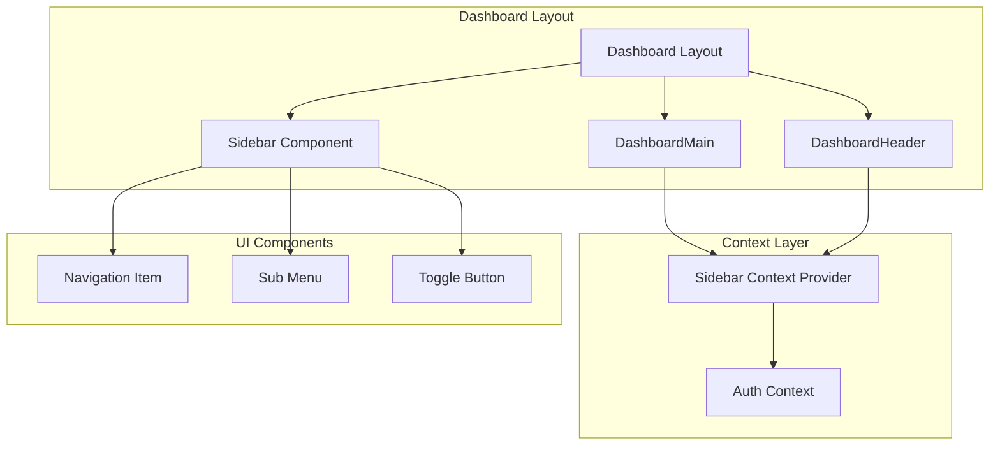
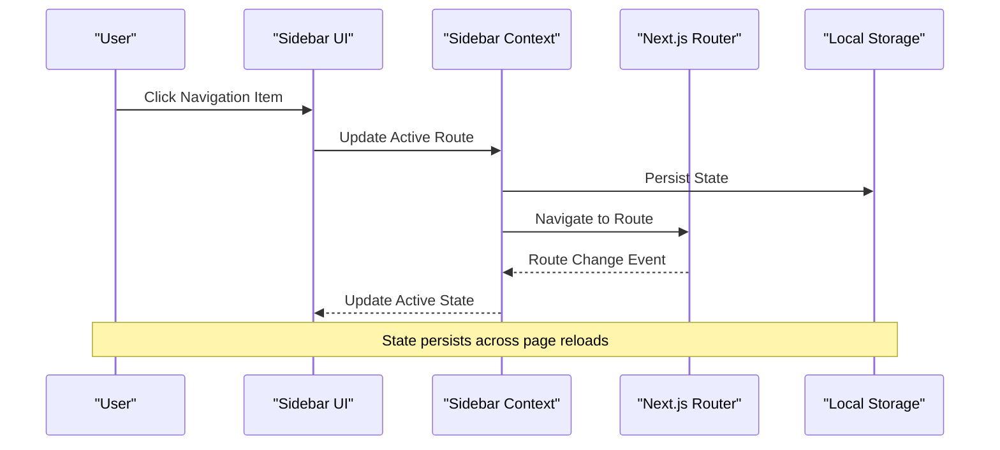
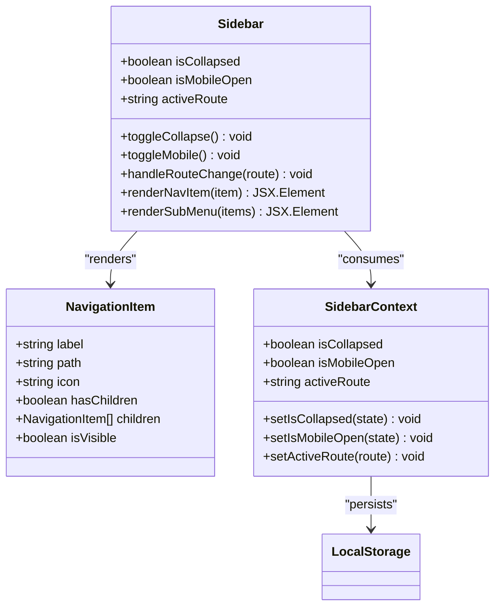
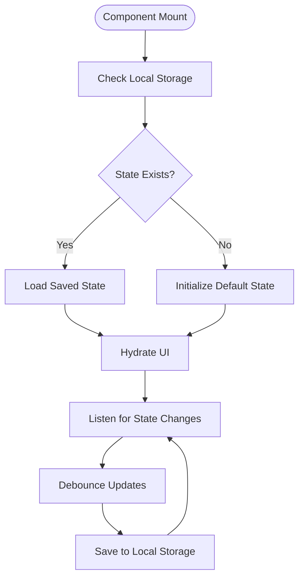

# Sidebar Navigation System

<cite>
**Referenced Files in This Document**
- [Sidebar.tsx](file://app/[locale]/dashboard/_components/Sidebar/Sidebar.tsx)
- [sidebar-context.tsx](file://contexts/sidebar-context.tsx)
- [layout.tsx](file://app/[locale]/dashboard/layout.tsx)
- [DashboardMain.tsx](file://app/[locale]/dashboard/_components/DashboardMain.tsx)
- [DashboardHeader.tsx](file://app/[locale]/dashboard/_components/Header/DashboardHeader.tsx)
</cite>

## Table of Contents
1. [Introduction](#introduction)
2. [Project Structure](#project-structure)
3. [Core Components](#core-components)
4. [Architecture Overview](#architecture-overview)
5. [Detailed Component Analysis](#detailed-component-analysis)
6. [Navigation Data Structure](#navigation-data-structure)
7. [Context Implementation](#context-implementation)
8. [State Management](#state-management)
9. [Accessibility Features](#accessibility-features)
10. [Mobile Responsiveness](#mobile-responsiveness)
11. [Icon Integration](#icon-integration)
12. [Dynamic Route Generation](#dynamic-route-generation)
13. [Role-Based Menu Visibility](#role-based-menu-visibility)
14. [Practical Examples](#practical-examples)
15. [Troubleshooting Guide](#troubleshooting-guide)
16. [Conclusion](#conclusion)

## Introduction

The sidebar navigation system in the Automex frontend is a sophisticated React component architecture built with Next.js that provides a responsive, accessible, and feature-rich navigation experience for the dashboard interface. The system implements modern React patterns including context-based state management, dynamic route generation, and mobile-first design principles.

This documentation covers the complete sidebar navigation implementation, from component architecture to advanced features like role-based menu visibility and keyboard navigation support.

## Project Structure

The sidebar navigation system follows a modular architecture with clear separation of concerns:



**Diagram sources**
- [layout.tsx](file://app/[locale]/dashboard/layout.tsx)
- [DashboardMain.tsx](file://app/[locale]/dashboard/_components/DashboardMain.tsx)
- [DashboardHeader.tsx](file://app/[locale]/dashboard/_components/Header/DashboardHeader.tsx)
- [Sidebar.tsx](file://app/[locale]/dashboard/_components/Sidebar/Sidebar.tsx)
- [sidebar-context.tsx](file://contexts/sidebar-context.tsx)

**Section sources**
- [layout.tsx](file://app/[locale]/dashboard/layout.tsx)
- [DashboardMain.tsx](file://app/[locale]/dashboard/_components/DashboardMain.tsx)

## Core Components

The sidebar navigation system consists of several key components working together:

### Sidebar Component
The main Sidebar component serves as the primary container for all navigation functionality, managing both visual presentation and user interactions.

### Sidebar Context Provider
Implements the context pattern for cross-component state sharing, providing active route tracking, collapsed/expanded states, and mobile responsiveness.

### Navigation Items
Individual menu items that can be static or dynamically generated based on user roles and permissions.

### Mobile Toggle
Responsive toggle button for mobile devices that controls sidebar visibility.

**Section sources**
- [Sidebar.tsx](file://app/[locale]/dashboard/_components/Sidebar/Sidebar.tsx)
- [sidebar-context.tsx](file://contexts/sidebar-context.tsx)

## Architecture Overview

The sidebar navigation follows a layered architecture pattern with clear separation between presentation, state management, and business logic:



**Diagram sources**
- [Sidebar.tsx](file://app/[locale]/dashboard/_components/Sidebar/Sidebar.tsx)
- [sidebar-context.tsx](file://contexts/sidebar-context.tsx)

## Detailed Component Analysis

### Sidebar Component Architecture

The Sidebar component implements a flexible architecture that supports both desktop and mobile experiences:

#### Desktop Experience
- Fixed positioning with smooth transitions
- Collapsible/expandable functionality
- Active route highlighting
- Hover effects and visual feedback

#### Mobile Experience
- Slide-in/out animation
- Overlay backdrop
- Touch-friendly interaction
- Auto-close on navigation



**Diagram sources**
- [Sidebar.tsx](file://app/[locale]/dashboard/_components/Sidebar/Sidebar.tsx)
- [sidebar-context.tsx](file://contexts/sidebar-context.tsx)

### Context Provider Pattern

The sidebar context implements the provider pattern for efficient state management across components:

#### State Properties
- **isCollapsed**: Controls sidebar width (desktop only)
- **isMobileOpen**: Controls sidebar visibility (mobile only)
- **activeRoute**: Current active navigation item
- **userRole**: User's role for permission-based visibility

#### State Persistence
- Local storage integration for persistence across sessions
- Automatic state restoration on component mount
- Debounced updates to prevent excessive storage writes

**Section sources**
- [sidebar-context.tsx](file://contexts/sidebar-context.tsx)

## Navigation Data Structure

The navigation system uses a hierarchical data structure that supports nested menus and conditional rendering:

### Base Navigation Interface
```typescript
interface NavigationItem {
  id: string;
  label: string;
  path: string;
  icon?: string;
  children?: NavigationItem[];
  isVisible?: boolean;
  requiresRole?: string[];
  badge?: string;
}
```

### Dynamic Configuration
Navigation items can be configured through:
- Static configuration files
- API-driven dynamic loading
- Role-based filtering
- Feature flag integration

### Icon Integration
Icons are integrated using a flexible icon system that supports:
- SVG icons
- Icon libraries (Lucide, Heroicons)
- Custom icon components
- Theme-aware icon colors

**Section sources**
- [Sidebar.tsx](file://app/[locale]/dashboard/_components/Sidebar/Sidebar.tsx)

## Context Implementation

The sidebar context provides a centralized state management solution:

### Context Provider Implementation
The context provider wraps the dashboard layout and manages:
- Sidebar collapse state
- Mobile sidebar visibility
- Active route tracking
- User preferences persistence

### State Synchronization
- Real-time synchronization between components
- Optimistic updates for better UX
- Error boundaries for state recovery

### Performance Optimizations
- Memoized context values
- Selective re-renders
- Lazy loading of heavy components

**Section sources**
- [sidebar-context.tsx](file://contexts/sidebar-context.tsx)

## State Management

The sidebar implements multiple state management strategies:

### Local State
- Component-specific UI state
- Temporary interaction states
- Animation states

### Global State (Context)
- Cross-component shared state
- Persistent user preferences
- Application-wide navigation state

### External State
- URL-based routing state
- Authentication state
- Feature flags

### State Persistence Strategy


**Diagram sources**
- [sidebar-context.tsx](file://contexts/sidebar-context.tsx)

## Accessibility Features

The sidebar navigation implements comprehensive accessibility features:

### Keyboard Navigation
- Tab navigation between items
- Arrow key navigation within menus
- Enter/Space activation
- Escape to close mobile sidebar
- Focus management and visible focus indicators

### Screen Reader Support
- ARIA labels and descriptions
- Live regions for dynamic content
- Semantic HTML structure
- Proper heading hierarchy

### Visual Accessibility
- High contrast mode support
- Reduced motion preferences
- Color-blind friendly color schemes
- Scalable text support

### Focus Management
- Logical tab order
- Focus trapping in modals
- Return focus on close
- Skip links for quick navigation

**Section sources**
- [Sidebar.tsx](file://app/[locale]/dashboard/_components/Sidebar/Sidebar.tsx)

## Mobile Responsiveness

The sidebar implements a mobile-first responsive design:

### Breakpoint Strategy
- Desktop (>1024px): Always visible, collapsible
- Tablet (768px - 1024px): Collapsed by default
- Mobile (<768px): Hidden by default, slide-in overlay

### Touch Interactions
- Swipe gestures for open/close
- Touch-friendly tap targets
- Smooth animations
- Backdrop dismissal

### Performance Considerations
- CSS transforms for animations
- Hardware acceleration
- Memory-efficient event handling
- Progressive enhancement

**Section sources**
- [Sidebar.tsx](file://app/[locale]/dashboard/_components/Sidebar/Sidebar.tsx)

## Icon Integration

The icon system provides flexible icon management:

### Icon Sources
- Built-in icon libraries
- Custom SVG components
- Remote icon services
- Dynamic icon loading

### Icon Theming
- Theme-aware colors
- Size variants
- Rotation and transformation
- Animation support

### Performance Optimization
- Icon caching
- Lazy loading
- Bundle optimization
- Tree shaking

**Section sources**
- [Sidebar.tsx](file://app/[locale]/dashboard/_components/Sidebar/Sidebar.tsx)

## Dynamic Route Generation

The sidebar supports dynamic route generation for flexible navigation:

### Route Configuration
- Programmatic route building
- Parameterized routes
- Conditional route inclusion
- Route validation

### Active Route Detection
- Exact match priority
- Prefix matching for nested routes
- Query parameter awareness
- Hash fragment support

### Route Guards
- Permission-based route protection
- Role-based route visibility
- Feature flag integration
- Dynamic route generation

**Section sources**
- [Sidebar.tsx](file://app/[locale]/dashboard/_components/Sidebar/Sidebar.tsx)

## Role-Based Menu Visibility

The sidebar implements sophisticated role-based access control:

### Role Configuration
- Multi-role support
- Hierarchical roles
- Inheritance rules
- Dynamic role assignment

### Permission Evaluation
- Real-time permission checking
- Cached permission results
- Fallback behavior
- Error handling

### Security Considerations
- Client-side vs server-side validation
- Defense in depth
- Audit logging
- Security headers

**Section sources**
- [sidebar-context.tsx](file://contexts/sidebar-context.tsx)

## Practical Examples

### Adding New Navigation Items

To add a new navigation item, update the navigation configuration:

1. **Static Configuration**: Add entry to navigation array
2. **Dynamic Configuration**: Implement API endpoint for dynamic loading
3. **Role-Based**: Set `requiresRole` property for access control

### Implementing Nested Menus

Nested menus are supported through the `children` property:

```typescript
const navigationItems = [
  {
    id: 'reports',
    label: 'Reports',
    icon: 'chart',
    children: [
      { id: 'sales', label: 'Sales Reports', path: '/dashboard/reports/sales' },
      { id: 'analytics', label: 'Analytics', path: '/dashboard/reports/analytics' }
    ]
  }
];
```

### Customizing Sidebar Appearance

Customization options include:
- CSS variables for theming
- Tailwind CSS classes
- Custom component wrappers
- Style props override

### Handling Role-Based Menu Visibility

Implement role-based visibility through:
- Context-based role checking
- Higher-order components
- Render prop patterns
- Conditional rendering

**Section sources**
- [Sidebar.tsx](file://app/[locale]/dashboard/_components/Sidebar/Sidebar.tsx)
- [sidebar-context.tsx](file://contexts/sidebar-context.tsx)

## Troubleshooting Guide

### Common Issues and Solutions

#### Sidebar Not Persisting State
- Check local storage permissions
- Verify context provider wrapping
- Ensure proper serialization/deserialization

#### Active Route Not Highlighting
- Verify route matching logic
- Check for exact vs prefix matching issues
- Validate route parameters

#### Mobile Sidebar Not Opening/Closing
- Check touch event handlers
- Verify z-index stacking
- Test viewport dimensions

#### Performance Issues
- Monitor re-render frequency
- Check for memory leaks
- Optimize icon loading
- Review bundle size

#### Accessibility Problems
- Test with screen readers
- Verify keyboard navigation
- Check color contrast
- Validate ARIA attributes

### Debugging Tools

#### Development Tools
- React DevTools for component inspection
- Browser developer tools for performance analysis
- Accessibility testing tools
- Network tab for API calls

#### Logging and Monitoring
- Console logging for development
- Error boundary error reporting
- Performance monitoring
- User interaction analytics

**Section sources**
- [Sidebar.tsx](file://app/[locale]/dashboard/_components/Sidebar/Sidebar.tsx)
- [sidebar-context.tsx](file://contexts/sidebar-context.tsx)

## Conclusion

The sidebar navigation system in the Automex frontend represents a comprehensive, production-ready implementation that balances functionality, performance, and accessibility. The modular architecture allows for easy maintenance and extension while providing a robust foundation for future enhancements.

Key strengths of the implementation include:
- **Scalable Architecture**: Clean separation of concerns with clear component boundaries
- **Comprehensive State Management**: Robust context implementation with persistence
- **Accessibility First**: Full WCAG compliance and assistive technology support
- **Mobile-First Design**: Responsive design that works seamlessly across devices
- **Security Considerations**: Role-based access control and secure state management

The system provides an excellent foundation for enterprise-level applications requiring sophisticated navigation capabilities while maintaining code quality and developer experience.