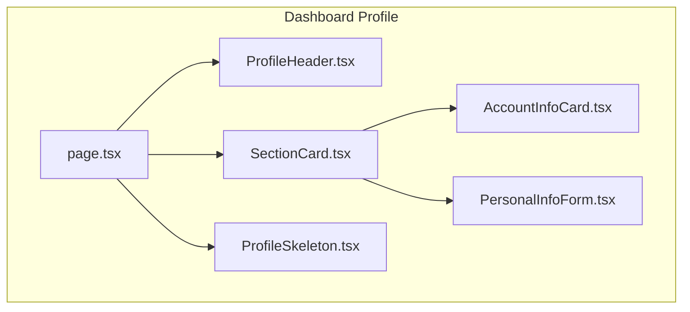
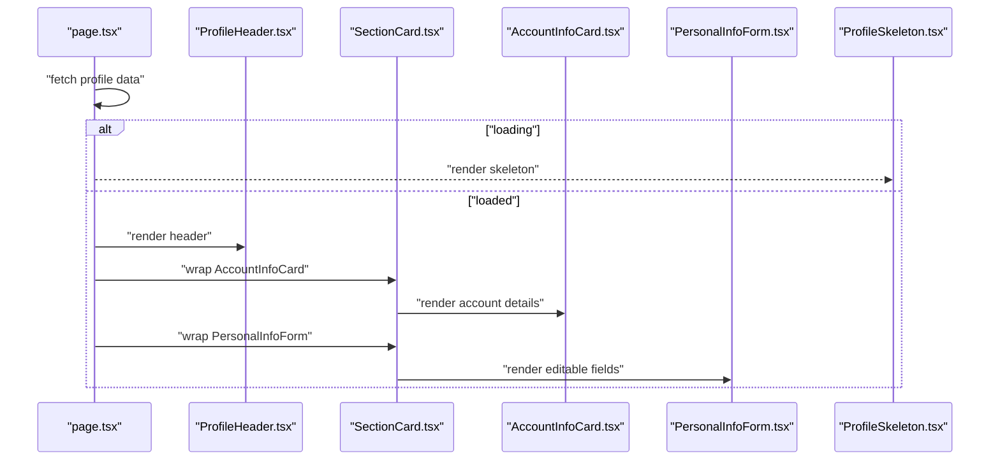
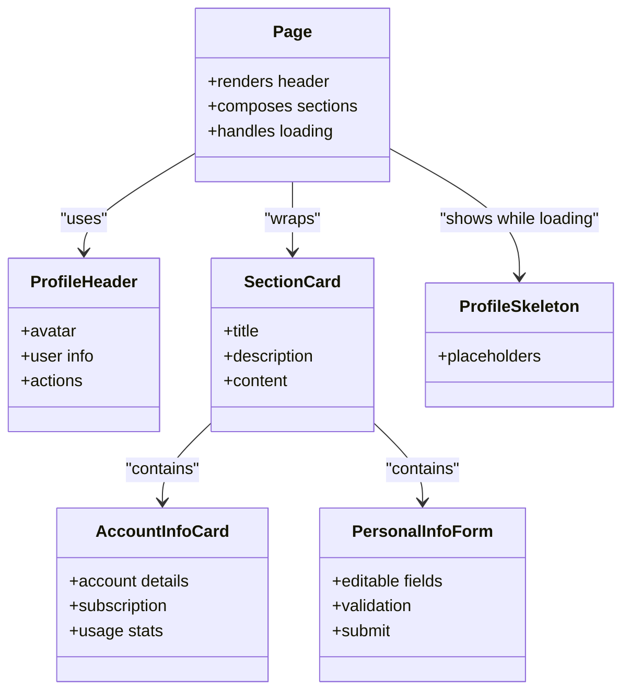

# Profile Cards & Display Components

<cite>
**Referenced Files in This Document**
- [AccountInfoCard.tsx](file://app/[locale]/dashboard/(routes)/profile/_components/AccountInfoCard.tsx)
- [ProfileHeader.tsx](file://app/[locale]/dashboard/(routes)/profile/_components/ProfileHeader.tsx)
- [SectionCard.tsx](file://app/[locale]/dashboard/(routes)/profile/_components/SectionCard.tsx)
- [PersonalInfoForm.tsx](file://app/[locale]/dashboard/(routes)/profile/_components/PersonalInfoForm.tsx)
- [ProfileSkeleton.tsx](file://app/[locale]/dashboard/(routes)/profile/_components/ProfileSkeleton.tsx)
- [page.tsx](file://app/[locale]/dashboard/(routes)/profile/page.tsx)
</cite>

## Table of Contents
1. [Introduction](#introduction)
2. [Project Structure](#project-structure)
3. [Core Components](#core-components)
4. [Architecture Overview](#architecture-overview)
5. [Detailed Component Analysis](#detailed-component-analysis)
6. [Dependency Analysis](#dependency-analysis)
7. [Performance Considerations](#performance-considerations)
8. [Troubleshooting Guide](#troubleshooting-guide)
9. [Conclusion](#conclusion)
10. [Appendices](#appendices)

## Introduction
This document explains the profile cards and display components used in the dashboard profile area. It focuses on:
- AccountInfoCard for account details, subscription information, and usage statistics
- ProfileHeader for avatar management, user information display, and action buttons
- SectionCard as a reusable layout primitive for consistent card sections
It also covers responsive design patterns, data formatting, loading states, and guidance for creating new card types and customizing appearances.

## Project Structure
The profile feature is implemented under the dashboard routes with dedicated client-side components. The main page composes the header, sectioned content, and forms.

**Diagram sources**
- [page.tsx](file://app/[locale]/dashboard/(routes)/profile/page.tsx)
- [ProfileHeader.tsx](file://app/[locale]/dashboard/(routes)/profile/_components/ProfileHeader.tsx)
- [SectionCard.tsx](file://app/[locale]/dashboard/(routes)/profile/_components/SectionCard.tsx)
- [AccountInfoCard.tsx](file://app/[locale]/dashboard/(routes)/profile/_components/AccountInfoCard.tsx)
- [PersonalInfoForm.tsx](file://app/[locale]/dashboard/(routes)/profile/_components/PersonalInfoForm.tsx)
- [ProfileSkeleton.tsx](file://app/[locale]/dashboard/(routes)/profile/_components/ProfileSkeleton.tsx)

**Section sources**
- [page.tsx](file://app/[locale]/dashboard/(routes)/profile/page.tsx)

## Core Components
- AccountInfoCard: Displays account details, subscription tier, billing cycle, usage metrics, and related actions.
- ProfileHeader: Shows avatar, name, role, and primary actions (edit, settings).
- SectionCard: Reusable container providing consistent padding, header/title, description, and content area.

These components are composed by the profile page to render a cohesive profile experience.

**Section sources**
- [AccountInfoCard.tsx](file://app/[locale]/dashboard/(routes)/profile/_components/AccountInfoCard.tsx)
- [ProfileHeader.tsx](file://app/[locale]/dashboard/(routes)/profile/_components/ProfileHeader.tsx)
- [SectionCard.tsx](file://app/[locale]/dashboard/(routes)/profile/_components/SectionCard.tsx)

## Architecture Overview
The profile page orchestrates data fetching and rendering. It renders the header, then uses SectionCard to group logical areas such as account info and personal info. Skeletons are shown while data loads.

**Diagram sources**
- [page.tsx](file://app/[locale]/dashboard/(routes)/profile/page.tsx)
- [ProfileHeader.tsx](file://app/[locale]/dashboard/(routes)/profile/_components/ProfileHeader.tsx)
- [SectionCard.tsx](file://app/[locale]/dashboard/(routes)/profile/_components/SectionCard.tsx)
- [AccountInfoCard.tsx](file://app/[locale]/dashboard/(routes)/profile/_components/AccountInfoCard.tsx)
- [PersonalInfoForm.tsx](file://app/[locale]/dashboard/(routes)/profile/_components/PersonalInfoForm.tsx)
- [ProfileSkeleton.tsx](file://app/[locale]/dashboard/(routes)/profile/_components/ProfileSkeleton.tsx)

## Detailed Component Analysis

### AccountInfoCard
Purpose:
- Present account identity and status
- Show subscription plan and billing cadence
- Display usage statistics and limits
- Provide quick actions (e.g., upgrade, manage billing)

Key responsibilities:
- Format dates, currency, and usage numbers
- Render badges or tags for plan type and status
- Handle empty or partial data gracefully
- Surface errors or warnings when applicable

Responsive behavior:
- Stack metrics vertically on small screens
- Use grid or flex layouts for larger screens

Loading and error states:
- Accept a loading flag to show placeholders
- Display inline messages for network or validation errors

Customization hooks:
- Props for title, subtitle, and metadata rows
- Optional action buttons slot
- Theme-aware styling via Tailwind classes

Example usage pattern:
- Compose within SectionCard to keep consistent spacing and headers
- Pass formatted data from the parent page or data layer

**Section sources**
- [AccountInfoCard.tsx](file://app/[locale]/dashboard/(routes)/profile/_components/AccountInfoCard.tsx)
- [SectionCard.tsx](file://app/[locale]/dashboard/(routes)/profile/_components/SectionCard.tsx)

### ProfileHeader
Purpose:
- Display user avatar, name, and role
- Provide primary actions (edit profile, open settings)

Key responsibilities:
- Load and cache avatar image
- Handle missing or broken avatars with fallbacks
- Expose accessible labels and keyboard navigation

Responsive behavior:
- Compact layout on mobile with stacked elements
- Horizontal alignment on desktop

Interactions:
- Click handlers for edit/settings actions
- Optional confirmation dialogs for destructive actions

Accessibility:
- Proper aria-labels for avatar and action buttons
- Focus management for keyboard users

**Section sources**
- [ProfileHeader.tsx](file://app/[locale]/dashboard/(routes)/profile/_components/ProfileHeader.tsx)

### SectionCard
Purpose:
- Provide a consistent card shell across the profile area

Key responsibilities:
- Render header/title and optional description
- Wrap content with consistent padding and borders
- Support full-width and constrained widths

Props and slots:
- Title, subtitle/description
- Actions slot for right-aligned controls
- Content slot for arbitrary children

Styling:
- Uses theme tokens and Tailwind utilities
- Adapts to dark/light modes

Composability:
- Used to wrap AccountInfoCard and PersonalInfoForm
- Can be reused for other profile sections

**Section sources**
- [SectionCard.tsx](file://app/[locale]/dashboard/(routes)/profile/_components/SectionCard.tsx)

### PersonalInfoForm
Purpose:
- Allow editing of personal details
- Validate inputs and submit changes

Key responsibilities:
- Field-level validation and error messages
- Submit state and success feedback
- Sync with global form state if needed

Integration:
- Wrapped by SectionCard for consistent layout
- Uses shared UI primitives for inputs and buttons

**Section sources**
- [PersonalInfoForm.tsx](file://app/[locale]/dashboard/(routes)/profile/_components/PersonalInfoForm.tsx)
- [SectionCard.tsx](file://app/[locale]/dashboard/(routes)/profile/_components/SectionCard.tsx)

### ProfileSkeleton
Purpose:
- Provide lightweight placeholders during data load

Key responsibilities:
- Mirror the shape of real components
- Avoid layout shifts by reserving space

Usage:
- Rendered conditionally while data is being fetched

**Section sources**
- [ProfileSkeleton.tsx](file://app/[locale]/dashboard/(routes)/profile/_components/ProfileSkeleton.tsx)

## Dependency Analysis
High-level relationships among profile components:

**Diagram sources**
- [page.tsx](file://app/[locale]/dashboard/(routes)/profile/page.tsx)
- [ProfileHeader.tsx](file://app/[locale]/dashboard/(routes)/profile/_components/ProfileHeader.tsx)
- [SectionCard.tsx](file://app/[locale]/dashboard/(routes)/profile/_components/SectionCard.tsx)
- [AccountInfoCard.tsx](file://app/[locale]/dashboard/(routes)/profile/_components/AccountInfoCard.tsx)
- [PersonalInfoForm.tsx](file://app/[locale]/dashboard/(routes)/profile/_components/PersonalInfoForm.tsx)
- [ProfileSkeleton.tsx](file://app/[locale]/dashboard/(routes)/profile/_components/ProfileSkeleton.tsx)

**Section sources**
- [page.tsx](file://app/[locale]/dashboard/(routes)/profile/page.tsx)

## Performance Considerations
- Prefer memoization for expensive computations in AccountInfoCard (e.g., derived usage percentages).
- Defer heavy operations until after initial paint; use skeletons to improve perceived performance.
- Optimize avatar images with appropriate sizes and caching strategies.
- Keep SectionCard minimal to avoid unnecessary re-renders.
- Batch updates when submitting forms to reduce reflows.

[No sources needed since this section provides general guidance]

## Troubleshooting Guide
Common issues and resolutions:
- Avatar not displaying: verify URL validity and fallback logic; check CORS and permissions.
- Subscription data missing: ensure correct field mapping and handle nulls gracefully.
- Usage stats misaligned: confirm number formatting and locale-specific separators.
- Form submission fails: validate payload shape and surface server errors to the user.
- Layout shifts during load: ensure skeleton dimensions match final content.

**Section sources**
- [ProfileHeader.tsx](file://app/[locale]/dashboard/(routes)/profile/_components/ProfileHeader.tsx)
- [AccountInfoCard.tsx](file://app/[locale]/dashboard/(routes)/profile/_components/AccountInfoCard.tsx)
- [PersonalInfoForm.tsx](file://app/[locale]/dashboard/(routes)/profile/_components/PersonalInfoForm.tsx)
- [ProfileSkeleton.tsx](file://app/[locale]/dashboard/(routes)/profile/_components/ProfileSkeleton.tsx)

## Conclusion
The profile area is built from composable, theme-aware components that emphasize consistency, accessibility, and responsiveness. SectionCard standardizes layout, ProfileHeader manages identity and actions, and AccountInfoCard presents key account and usage insights. Following the patterns here will help you extend the profile experience with new cards and interactions efficiently.

[No sources needed since this section summarizes without analyzing specific files]

## Appendices

### Creating a New Card Type
Steps:
- Create a new component file under the profile _components directory.
- Define props for data, actions, and optional variants.
- Implement responsive layout using Tailwind utilities.
- Integrate loading and error states similar to existing cards.
- Wrap your card with SectionCard to inherit consistent spacing and header styles.
- Compose it in the profile page alongside other sections.

Guidance:
- Keep props focused and typed.
- Favor composition over deep prop drilling.
- Ensure keyboard and screen reader support.

[No sources needed since this section provides general guidance]

### Customizing Card Appearances
Approaches:
- Override default titles and descriptions via props.
- Add action buttons through an actions slot where available.
- Adjust spacing and borders by composing SectionCard with different wrappers if needed.
- Use theme-aware classes to adapt to light/dark modes.

[No sources needed since this section provides general guidance]

### Implementing Interactive Behaviors
Patterns:
- Use controlled components for inputs and forms.
- Debounce rapid interactions (e.g., search or live preview).
- Provide immediate feedback for user actions (toasts, inline messages).
- Guard destructive actions with confirmation dialogs.

[No sources needed since this section provides general guidance]