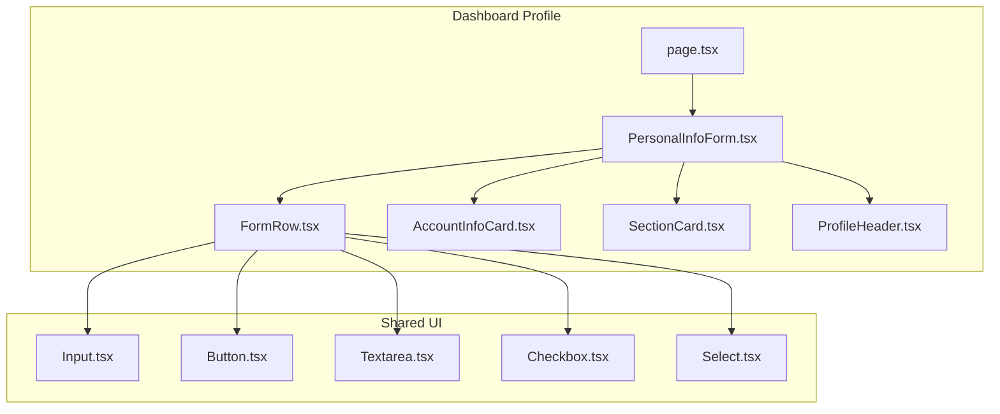
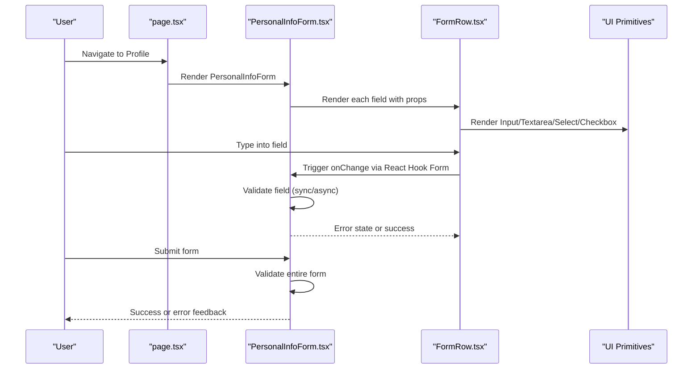
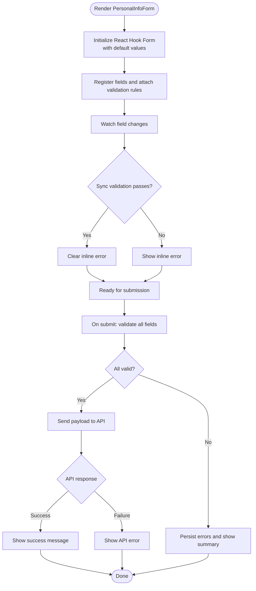
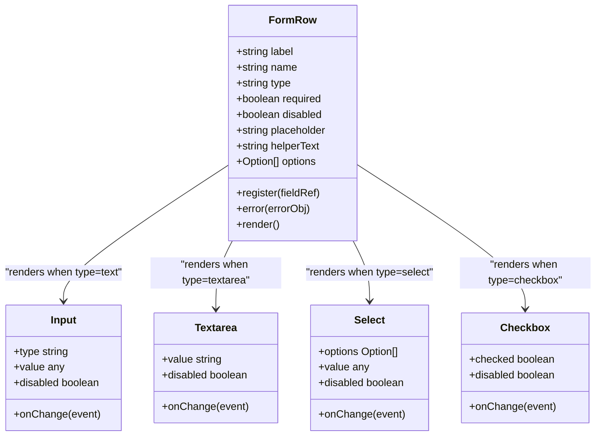
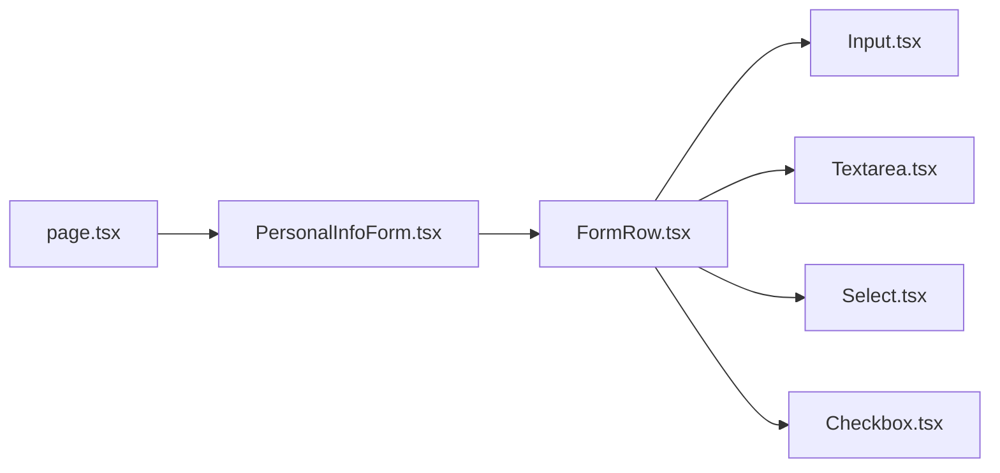

# Profile Forms & Validation

<cite>
**Referenced Files in This Document**
- [PersonalInfoForm.tsx](file://app/[locale]/dashboard/(routes)/profile/_components/PersonalInfoForm.tsx)
- [FormRow.tsx](file://app/[locale]/dashboard/(routes)/profile/_components/FormRow.tsx)
- [AccountInfoCard.tsx](file://app/[locale]/dashboard/(routes)/profile/_components/AccountInfoCard.tsx)
- [ProfileHeader.tsx](file://app/[locale]/dashboard/(routes)/profile/_components/ProfileHeader.tsx)
- [SectionCard.tsx](file://app/[locale]/dashboard/(routes)/profile/_components/SectionCard.tsx)
- [page.tsx](file://app/[locale]/dashboard/(routes)/profile/page.tsx)
- [Input.tsx](file://components/ui/input.tsx)
- [Button.tsx](file://components/ui/button.tsx)
- [Textarea.tsx](file://components/ui/textarea.tsx)
- [Checkbox.tsx](file://components/ui/checkbox.tsx)
- [Select.tsx](file://components/ui/select.tsx)
</cite>

## Table of Contents
1. [Introduction](#introduction)
2. [Project Structure](#project-structure)
3. [Core Components](#core-components)
4. [Architecture Overview](#architecture-overview)
5. [Detailed Component Analysis](#detailed-component-analysis)
6. [Dependency Analysis](#dependency-analysis)
7. [Performance Considerations](#performance-considerations)
8. [Troubleshooting Guide](#troubleshooting-guide)
9. [Conclusion](#conclusion)
10. [Appendices](#appendices)

## Introduction
This document explains the profile forms and validation system with a focus on:
- PersonalInfoForm component architecture
- React Hook Form integration for form state management
- Zod schema-based validation (conceptual guidance)
- FormRow component for consistent field layouts, input types, and error display patterns
- Real-time validation feedback and submission handling
- Field-specific validation rules, custom validators, and async validation patterns
- Practical examples for adding new fields, conditional fields, file uploads, and reusable form components

The goal is to provide both high-level architectural understanding and actionable implementation guidance for extending and maintaining profile forms.

## Project Structure
The profile feature resides under the dashboard routes and includes several focused components:
- Page entry point orchestrating layout and data loading
- PersonalInfoForm implementing form logic and validation
- FormRow providing consistent field rendering and error display
- Supporting UI cards and headers for presentation

**Diagram sources**
- [page.tsx](file://app/[locale]/dashboard/(routes)/profile/page.tsx)
- [PersonalInfoForm.tsx](file://app/[locale]/dashboard/(routes)/profile/_components/PersonalInfoForm.tsx)
- [FormRow.tsx](file://app/[locale]/dashboard/(routes)/profile/_components/FormRow.tsx)
- [AccountInfoCard.tsx](file://app/[locale]/dashboard/(routes)/profile/_components/AccountInfoCard.tsx)
- [SectionCard.tsx](file://app/[locale]/dashboard/(routes)/profile/_components/SectionCard.tsx)
- [ProfileHeader.tsx](file://app/[locale]/dashboard/(routes)/profile/_components/ProfileHeader.tsx)
- [Input.tsx](file://components/ui/input.tsx)
- [Button.tsx](file://components/ui/button.tsx)
- [Textarea.tsx](file://components/ui/textarea.tsx)
- [Checkbox.tsx](file://components/ui/checkbox.tsx)
- [Select.tsx](file://components/ui/select.tsx)

**Section sources**
- [page.tsx](file://app/[locale]/dashboard/(routes)/profile/page.tsx)
- [PersonalInfoForm.tsx](file://app/[locale]/dashboard/(routes)/profile/_components/PersonalInfoForm.tsx)
- [FormRow.tsx](file://app/[locale]/dashboard/(routes)/profile/_components/FormRow.tsx)

## Core Components
- PersonalInfoForm
  - Purpose: Central form controller for personal information editing
  - Responsibilities:
    - Initialize and manage form state via React Hook Form
    - Define validation rules per field (Zod schemas conceptually)
    - Handle real-time validation feedback and submission lifecycle
    - Compose multiple FormRow instances for consistent UX
- FormRow
  - Purpose: Reusable wrapper for individual form fields
  - Responsibilities:
    - Render label, input, helper text, and error messages consistently
    - Support multiple input types (text, textarea, select, checkbox)
    - Integrate with React Hook Form’s register and error objects
    - Provide optional disabled/loading states and accessibility attributes

**Section sources**
- [PersonalInfoForm.tsx](file://app/[locale]/dashboard/(routes)/profile/_components/PersonalInfoForm.tsx)
- [FormRow.tsx](file://app/[locale]/dashboard/(routes)/profile/_components/FormRow.tsx)

## Architecture Overview
The profile form follows a layered approach:
- Presentation layer: page.tsx composes header, section card, and the form
- Form orchestration: PersonalInfoForm manages state, validation, and submission
- Field rendering: FormRow standardizes inputs and errors
- Shared UI primitives: Input, Button, Textarea, Checkbox, Select ensure consistent styling and behavior

**Diagram sources**
- [page.tsx](file://app/[locale]/dashboard/(routes)/profile/page.tsx)
- [PersonalInfoForm.tsx](file://app/[locale]/dashboard/(routes)/profile/_components/PersonalInfoForm.tsx)
- [FormRow.tsx](file://app/[locale]/dashboard/(routes)/profile/_components/FormRow.tsx)
- [Input.tsx](file://components/ui/input.tsx)
- [Textarea.tsx](file://components/ui/textarea.tsx)
- [Select.tsx](file://components/ui/select.tsx)
- [Checkbox.tsx](file://components/ui/checkbox.tsx)

## Detailed Component Analysis

### PersonalInfoForm
- Architecture
  - Uses React Hook Form to create a form instance
  - Integrates validation rules per field; Zod schemas are commonly used to define constraints and error messages
  - Manages submission lifecycle: validate, transform, submit, handle success/error
- State Management
  - Controlled by React Hook Form’s internal state
  - Exposes watch, setValue, reset, and other utilities for programmatic control
- Validation Strategy
  - Sync validation: immediate feedback on change or blur
  - Async validation: debounced checks for uniqueness or server-side constraints
- Submission Handling
  - Prevents default browser behavior
  - Aggregates validation errors before sending payload
  - Displays user-friendly messages and resets or persists as needed

**Diagram sources**
- [PersonalInfoForm.tsx](file://app/[locale]/dashboard/(routes)/profile/_components/PersonalInfoForm.tsx)

**Section sources**
- [PersonalInfoForm.tsx](file://app/[locale]/dashboard/(routes)/profile/_components/PersonalInfoForm.tsx)

### FormRow
- Layout and Inputs
  - Accepts props for label, placeholder, helper text, type, options, disabled, and value
  - Renders appropriate UI primitive based on type (text, textarea, select, checkbox)
- Error Display Patterns
  - Reads error from React Hook Form’s error object
  - Shows concise, accessible error messages below the input
- Accessibility
  - Associates label with input using htmlFor/id
  - Provides aria-describedby for helper text and errors
- Composition
  - Designed to be reused across forms for consistent UX and reduced duplication

**Diagram sources**
- [FormRow.tsx](file://app/[locale]/dashboard/(routes)/profile/_components/FormRow.tsx)
- [Input.tsx](file://components/ui/input.tsx)
- [Textarea.tsx](file://components/ui/textarea.tsx)
- [Select.tsx](file://components/ui/select.tsx)
- [Checkbox.tsx](file://components/ui/checkbox.tsx)

**Section sources**
- [FormRow.tsx](file://app/[locale]/dashboard/(routes)/profile/_components/FormRow.tsx)
- [Input.tsx](file://components/ui/input.tsx)
- [Textarea.tsx](file://components/ui/textarea.tsx)
- [Select.tsx](file://components/ui/select.tsx)
- [Checkbox.tsx](file://components/ui/checkbox.tsx)

### Supporting Components
- AccountInfoCard
  - Presents account-related details and actions
  - Often wraps form sections or displays read-only info
- SectionCard
  - Provides consistent card layout for grouping related fields
- ProfileHeader
  - Displays title, description, and contextual actions for the profile page

These components improve readability and maintainability by separating concerns between layout, content, and interaction.

**Section sources**
- [AccountInfoCard.tsx](file://app/[locale]/dashboard/(routes)/profile/_components/AccountInfoCard.tsx)
- [SectionCard.tsx](file://app/[locale]/dashboard/(routes)/profile/_components/SectionCard.tsx)
- [ProfileHeader.tsx](file://app/[locale]/dashboard/(routes)/profile/_components/ProfileHeader.tsx)

## Dependency Analysis
- Internal dependencies
  - page.tsx depends on PersonalInfoForm and supporting cards
  - PersonalInfoForm depends on FormRow and shared UI primitives
  - FormRow depends on Input, Textarea, Select, Checkbox
- External dependencies
  - React Hook Form for form state and validation integration
  - Zod for schema-based validation (conceptual usage)
  - Next.js routing and i18n context (as applicable)

**Diagram sources**
- [page.tsx](file://app/[locale]/dashboard/(routes)/profile/page.tsx)
- [PersonalInfoForm.tsx](file://app/[locale]/dashboard/(routes)/profile/_components/PersonalInfoForm.tsx)
- [FormRow.tsx](file://app/[locale]/dashboard/(routes)/profile/_components/FormRow.tsx)
- [Input.tsx](file://components/ui/input.tsx)
- [Textarea.tsx](file://components/ui/textarea.tsx)
- [Select.tsx](file://components/ui/select.tsx)
- [Checkbox.tsx](file://components/ui/checkbox.tsx)

**Section sources**
- [page.tsx](file://app/[locale]/dashboard/(routes)/profile/page.tsx)
- [PersonalInfoForm.tsx](file://app/[locale]/dashboard/(routes)/profile/_components/PersonalInfoForm.tsx)
- [FormRow.tsx](file://app/[locale]/dashboard/(routes)/profile/_components/FormRow.tsx)

## Performance Considerations
- Debounce async validations to avoid excessive network calls
- Use React Hook Form’s built-in optimization features (e.g., shouldUnregister, mode) appropriately
- Avoid re-renders by memoizing expensive computations and stable references for options
- Keep FormRow lightweight; pass only necessary props and avoid unnecessary state updates
- Batch submissions and coalesce rapid changes where possible

[No sources needed since this section provides general guidance]

## Troubleshooting Guide
Common issues and resolutions:
- Validation not triggering
  - Ensure fields are registered correctly and that onChange handlers are wired
  - Verify that error objects are passed to FormRow and displayed
- Errors not clearing after fix
  - Confirm that validation runs on change or blur and clears previous errors
- Submission fails silently
  - Check that submit handler prevents default and handles API errors gracefully
- Accessibility warnings
  - Validate label-input association and aria-describedby presence for helper text and errors

**Section sources**
- [PersonalInfoForm.tsx](file://app/[locale]/dashboard/(routes)/profile/_components/PersonalInfoForm.tsx)
- [FormRow.tsx](file://app/[locale]/dashboard/(routes)/profile/_components/FormRow.tsx)

## Conclusion
The profile forms leverage React Hook Form for robust state management and validation, with FormRow ensuring consistent field layouts and error display. By following the patterns outlined here—field registration, sync/async validation, and clear submission flows—you can extend the system confidently with new fields, conditional logic, file uploads, and reusable components while maintaining a strong user experience.

[No sources needed since this section summarizes without analyzing specific files]

## Appendices

### Adding a New Form Field
Steps:
- Choose an appropriate FormRow type (text, textarea, select, checkbox)
- Register the field in the form instance and attach validation rules
- Provide label, placeholder, helper text, and error mapping
- If conditional, gate visibility based on other field values

Practical example path:
- [PersonalInfoForm.tsx](file://app/[locale]/dashboard/(routes)/profile/_components/PersonalInfoForm.tsx)
- [FormRow.tsx](file://app/[locale]/dashboard/(routes)/profile/_components/FormRow.tsx)

**Section sources**
- [PersonalInfoForm.tsx](file://app/[locale]/dashboard/(routes)/profile/_components/PersonalInfoForm.tsx)
- [FormRow.tsx](file://app/[locale]/dashboard/(routes)/profile/_components/FormRow.tsx)

### Implementing Conditional Fields
Approach:
- Use form.watch to observe dependent fields
- Conditionally render or disable fields based on watched values
- Update validation rules dynamically when conditions change

Practical example path:
- [PersonalInfoForm.tsx](file://app/[locale]/dashboard/(routes)/profile/_components/PersonalInfoForm.tsx)

**Section sources**
- [PersonalInfoForm.tsx](file://app/[locale]/dashboard/(routes)/profile/_components/PersonalInfoForm.tsx)

### Handling File Uploads
Guidance:
- Use a hidden input[type=file] wrapped by FormRow or a dedicated upload component
- Manage file selection via onChange and store in form state
- Validate file size/type synchronously and perform async checks if needed
- On submit, append FormData entries and send multipart requests

Practical example path:
- [FormRow.tsx](file://app/[locale]/dashboard/(routes)/profile/_components/FormRow.tsx)
- [PersonalInfoForm.tsx](file://app/[locale]/dashboard/(routes)/profile/_components/PersonalInfoForm.tsx)

**Section sources**
- [FormRow.tsx](file://app/[locale]/dashboard/(routes)/profile/_components/FormRow.tsx)
- [PersonalInfoForm.tsx](file://app/[locale]/dashboard/(routes)/profile/_components/PersonalInfoForm.tsx)

### Creating Reusable Form Components
Recommendations:
- Encapsulate common field groups (e.g., contact info, preferences) into higher-order components
- Standardize validation messages and error formatting
- Export typed props interfaces for consistency across forms

Practical example path:
- [FormRow.tsx](file://app/[locale]/dashboard/(routes)/profile/_components/FormRow.tsx)
- [PersonalInfoForm.tsx](file://app/[locale]/dashboard/(routes)/profile/_components/PersonalInfoForm.tsx)

**Section sources**
- [FormRow.tsx](file://app/[locale]/dashboard/(routes)/profile/_components/FormRow.tsx)
- [PersonalInfoForm.tsx](file://app/[locale]/dashboard/(routes)/profile/_components/PersonalInfoForm.tsx)