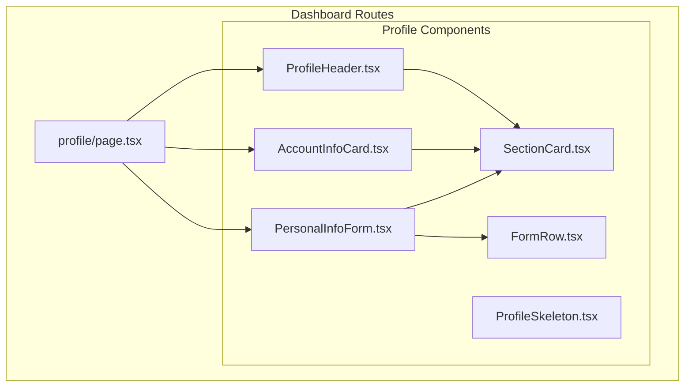
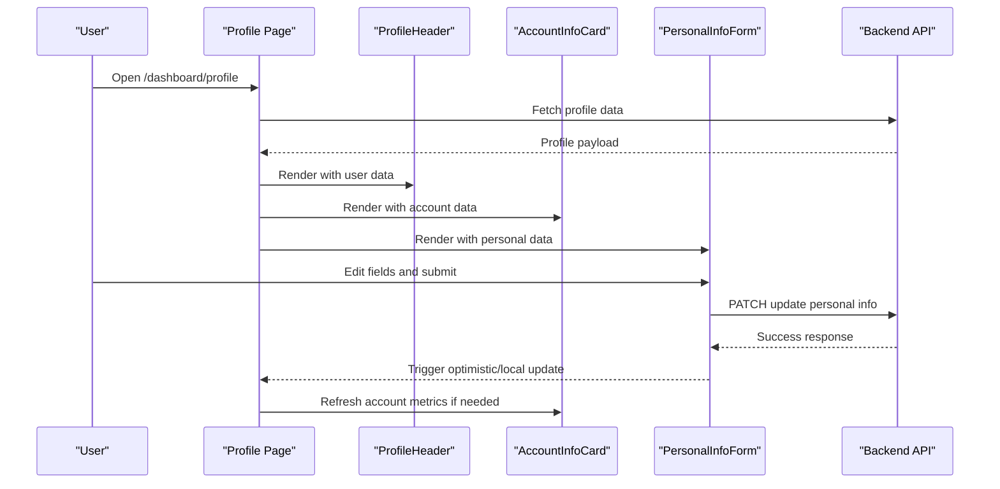
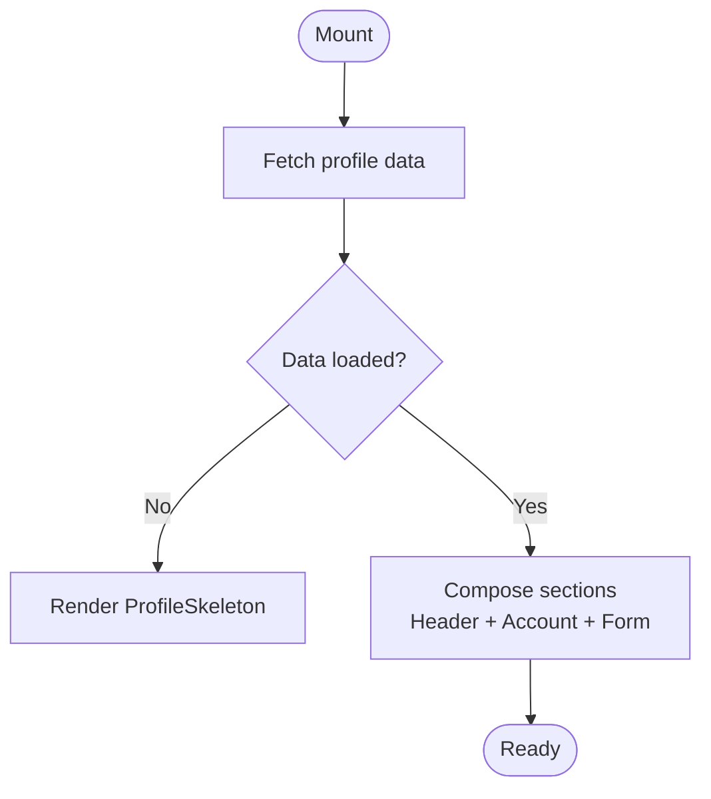
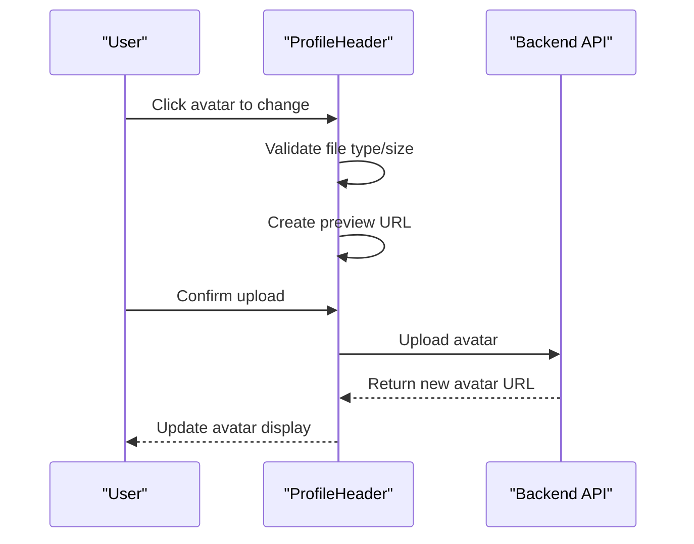
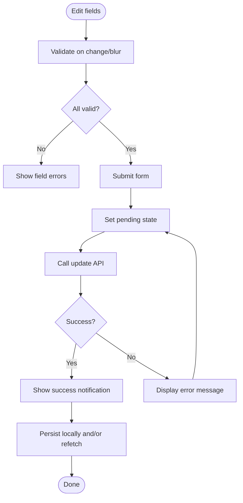
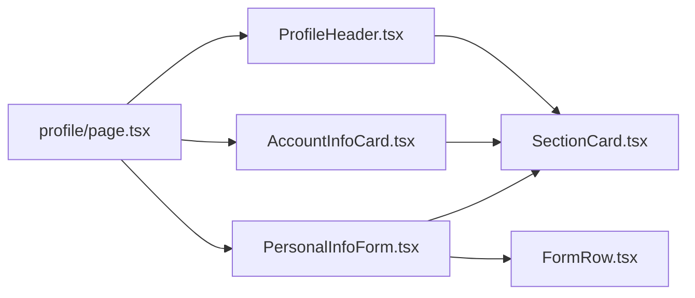

# User Profile Management

<cite>
**Referenced Files in This Document**
- [page.tsx](file://app/[locale]/dashboard/(routes)/profile/page.tsx)
- [AccountInfoCard.tsx](file://app/[locale]/dashboard/(routes)/profile/_components/AccountInfoCard.tsx)
- [PersonalInfoForm.tsx](file://app/[locale]/dashboard/(routes)/profile/_components/PersonalInfoForm.tsx)
- [ProfileHeader.tsx](file://app/[locale]/dashboard/(routes)/profile/_components/ProfileHeader.tsx)
- [SectionCard.tsx](file://app/[locale]/dashboard/(routes)/profile/_components/SectionCard.tsx)
- [FormRow.tsx](file://app/[locale]/dashboard/(routes)/profile/_components/FormRow.tsx)
- [ProfileSkeleton.tsx](file://app/[locale]/dashboard/(routes)/profile/_components/ProfileSkeleton.tsx)
</cite>

## Table of Contents
1. [Introduction](#introduction)
2. [Project Structure](#project-structure)
3. [Core Components](#core-components)
4. [Architecture Overview](#architecture-overview)
5. [Detailed Component Analysis](#detailed-component-analysis)
6. [Dependency Analysis](#dependency-analysis)
7. [Performance Considerations](#performance-considerations)
8. [Troubleshooting Guide](#troubleshooting-guide)
9. [Conclusion](#conclusion)
10. [Appendices](#appendices)

## Introduction
This document explains the user profile management system implemented in the dashboard’s profile route. It covers the modular page architecture, form handling and validation, data synchronization patterns, and reusable UI components used to build a consistent profile experience. The focus is on:
- Profile page layout with modular sections
- Personal information form with validation and submission flow
- Account details display including subscription status and usage metrics
- Profile header with avatar upload, name editing, and status indicators
- Reusable SectionCard for consistent card layouts
- Form state management, error handling, success notifications, and data persistence strategies
- Guidance for extending profile fields, adding new sections, and implementing complex validation rules

## Project Structure
The profile feature is organized under the dashboard routes and uses a component-per-file approach for clarity and reusability.

**Diagram sources**
- [page.tsx](file://app/[locale]/dashboard/(routes)/profile/page.tsx)
- [ProfileHeader.tsx](file://app/[locale]/dashboard/(routes)/profile/_components/ProfileHeader.tsx)
- [AccountInfoCard.tsx](file://app/[locale]/dashboard/(routes)/profile/_components/AccountInfoCard.tsx)
- [PersonalInfoForm.tsx](file://app/[locale]/dashboard/(routes)/profile/_components/PersonalInfoForm.tsx)
- [SectionCard.tsx](file://app/[locale]/dashboard/(routes)/profile/_components/SectionCard.tsx)
- [FormRow.tsx](file://app/[locale]/dashboard/(routes)/profile/_components/FormRow.tsx)
- [ProfileSkeleton.tsx](file://app/[locale]/dashboard/(routes)/profile/_components/ProfileSkeleton.tsx)

**Section sources**
- [page.tsx](file://app/[locale]/dashboard/(routes)/profile/page.tsx)
- [ProfileHeader.tsx](file://app/[locale]/dashboard/(routes)/profile/_components/ProfileHeader.tsx)
- [AccountInfoCard.tsx](file://app/[locale]/dashboard/(routes)/profile/_components/AccountInfoCard.tsx)
- [PersonalInfoForm.tsx](file://app/[locale]/dashboard/(routes)/profile/_components/PersonalInfoForm.tsx)
- [SectionCard.tsx](file://app/[locale]/dashboard/(routes)/profile/_components/SectionCard.tsx)
- [FormRow.tsx](file://app/[locale]/dashboard/(routes)/profile/_components/FormRow.tsx)
- [ProfileSkeleton.tsx](file://app/[locale]/dashboard/(routes)/profile/_components/ProfileSkeleton.tsx)

## Core Components
- Profile page orchestrates the layout by composing the header, account info, and personal info sections. It manages loading states and renders a skeleton while data is being fetched or updated.
- ProfileHeader displays the user’s avatar and name, supports avatar upload and inline name editing, and shows status indicators (e.g., verified).
- AccountInfoCard presents account-level details such as email, subscription tier, billing cycle, and usage metrics. It is read-only and updates reactively when underlying data changes.
- PersonalInfoForm provides editable fields for personal details with validation, field types, and submission handling. It integrates with a section wrapper and row helper for consistent UX.
- SectionCard is a reusable container that standardizes padding, spacing, and visual treatment across all profile sections.
- FormRow is a small helper to align label/input pairs consistently within forms.
- ProfileSkeleton provides lightweight placeholders during initial load or background refreshes.

Key responsibilities:
- Data fetching and caching at the page level
- Local form state and validation in PersonalInfoForm
- Submission lifecycle (pending, success, error) with user feedback
- Avatar upload flow with preview and confirmation
- Consistent card layout via SectionCard

**Section sources**
- [page.tsx](file://app/[locale]/dashboard/(routes)/profile/page.tsx)
- [ProfileHeader.tsx](file://app/[locale]/dashboard/(routes)/profile/_components/ProfileHeader.tsx)
- [AccountInfoCard.tsx](file://app/[locale]/dashboard/(routes)/profile/_components/AccountInfoCard.tsx)
- [PersonalInfoForm.tsx](file://app/[locale]/dashboard/(routes)/profile/_components/PersonalInfoForm.tsx)
- [SectionCard.tsx](file://app/[locale]/dashboard/(routes)/profile/_components/SectionCard.tsx)
- [FormRow.tsx](file://app/[locale]/dashboard/(routes)/profile/_components/FormRow.tsx)
- [ProfileSkeleton.tsx](file://app/[locale]/dashboard/(routes)/profile/_components/ProfileSkeleton.tsx)

## Architecture Overview
The profile page composes three primary sections. Each section is encapsulated in its own component and communicates through props and local state where appropriate.

**Diagram sources**
- [page.tsx](file://app/[locale]/dashboard/(routes)/profile/page.tsx)
- [ProfileHeader.tsx](file://app/[locale]/dashboard/(routes)/profile/_components/ProfileHeader.tsx)
- [AccountInfoCard.tsx](file://app/[locale]/dashboard/(routes)/profile/_components/AccountInfoCard.tsx)
- [PersonalInfoForm.tsx](file://app/[locale]/dashboard/(routes)/profile/_components/PersonalInfoForm.tsx)

## Detailed Component Analysis

### Profile Page
Responsibilities:
- Compose ProfileHeader, AccountInfoCard, and PersonalInfoForm
- Manage loading and error states
- Coordinate data fetching and optional refetch after mutations
- Render ProfileSkeleton until data is ready

Data flow:
- On mount, fetch profile data from the backend
- Pass derived data down to child components
- On successful personal info update, optionally refetch account metrics

**Diagram sources**
- [page.tsx](file://app/[locale]/dashboard/(routes)/profile/page.tsx)

**Section sources**
- [page.tsx](file://app/[locale]/dashboard/(routes)/profile/page.tsx)

### ProfileHeader
Responsibilities:
- Display avatar image and handle upload flow
- Allow inline name editing with validation
- Show status indicators (e.g., verified badge)
- Provide immediate visual feedback on changes

Avatar upload flow:
- Select file -> validate type/size -> create preview URL -> confirm upload -> call API -> update state

Name editing:
- Inline input with blur/save behavior
- Validation for length/format
- Debounced save or explicit save action

**Diagram sources**
- [ProfileHeader.tsx](file://app/[locale]/dashboard/(routes)/profile/_components/ProfileHeader.tsx)

**Section sources**
- [ProfileHeader.tsx](file://app/[locale]/dashboard/(routes)/profile/_components/ProfileHeader.tsx)

### AccountInfoCard
Responsibilities:
- Display account-level details (email, plan, billing period)
- Show usage metrics (e.g., storage, API calls, seats)
- React to data changes without requiring full page reload

Design notes:
- Read-only presentation layer
- Uses SectionCard for consistent layout
- Handles empty/loading states gracefully

**Section sources**
- [AccountInfoCard.tsx](file://app/[locale]/dashboard/(routes)/profile/_components/AccountInfoCard.tsx)

### PersonalInfoForm
Responsibilities:
- Provide editable fields for personal information
- Enforce validation rules per field
- Handle submission lifecycle (pending, success, error)
- Integrate with SectionCard and FormRow for consistent UX

Field types commonly supported:
- Text inputs (name, nickname, bio)
- Email input with format validation
- Phone number with country code support
- Date picker (date of birth)
- Select dropdowns (language, timezone)
- Checkbox/toggles (preferences)

Validation strategy:
- Field-level validation messages
- Cross-field validation when necessary
- Real-time validation on blur/change
- Submit-time validation before network request

Submission handling:
- Disable submit button while pending
- Show success notification on completion
- Persist errors and display actionable messages
- Optionally perform optimistic updates and roll back on failure

**Diagram sources**
- [PersonalInfoForm.tsx](file://app/[locale]/dashboard/(routes)/profile/_components/PersonalInfoForm.tsx)

**Section sources**
- [PersonalInfoForm.tsx](file://app/[locale]/dashboard/(routes)/profile/_components/PersonalInfoForm.tsx)

### SectionCard
Responsibilities:
- Provide consistent padding, borders, and spacing
- Accept title and optional actions slot
- Support loading and disabled states
- Encapsulate accessibility attributes

Usage:
- Wrap each profile section (header, account, personal info) for uniform appearance

**Section sources**
- [SectionCard.tsx](file://app/[locale]/dashboard/(routes)/profile/_components/SectionCard.tsx)

### FormRow
Responsibilities:
- Align label and input elements consistently
- Support helper text and error messaging
- Maintain accessible labeling and focus management

**Section sources**
- [FormRow.tsx](file://app/[locale]/dashboard/(routes)/profile/_components/FormRow.tsx)

### ProfileSkeleton
Responsibilities:
- Render lightweight placeholders for header, account, and form sections
- Improve perceived performance during initial load

**Section sources**
- [ProfileSkeleton.tsx](file://app/[locale]/dashboard/(routes)/profile/_components/ProfileSkeleton.tsx)

## Dependency Analysis
The profile page depends on its child components and external APIs. The following diagram highlights direct relationships between files.

**Diagram sources**
- [page.tsx](file://app/[locale]/dashboard/(routes)/profile/page.tsx)
- [ProfileHeader.tsx](file://app/[locale]/dashboard/(routes)/profile/_components/ProfileHeader.tsx)
- [AccountInfoCard.tsx](file://app/[locale]/dashboard/(routes)/profile/_components/AccountInfoCard.tsx)
- [PersonalInfoForm.tsx](file://app/[locale]/dashboard/(routes)/profile/_components/PersonalInfoForm.tsx)
- [SectionCard.tsx](file://app/[locale]/dashboard/(routes)/profile/_components/SectionCard.tsx)
- [FormRow.tsx](file://app/[locale]/dashboard/(routes)/profile/_components/FormRow.tsx)

**Section sources**
- [page.tsx](file://app/[locale]/dashboard/(routes)/profile/page.tsx)
- [ProfileHeader.tsx](file://app/[locale]/dashboard/(routes)/profile/_components/ProfileHeader.tsx)
- [AccountInfoCard.tsx](file://app/[locale]/dashboard/(routes)/profile/_components/AccountInfoCard.tsx)
- [PersonalInfoForm.tsx](file://app/[locale]/dashboard/(routes)/profile/_components/PersonalInfoForm.tsx)
- [SectionCard.tsx](file://app/[locale]/dashboard/(routes)/profile/_components/SectionCard.tsx)
- [FormRow.tsx](file://app/[locale]/dashboard/(routes)/profile/_components/FormRow.tsx)

## Performance Considerations
- Prefer client-side caching for profile data to avoid unnecessary network requests.
- Use optimistic updates for non-critical edits to improve responsiveness.
- Debounce heavy operations like avatar previews and server sync.
- Keep skeletons minimal to reduce layout thrash during loading.
- Avoid re-renders by memoizing expensive computations and stable prop references.

## Troubleshooting Guide
Common issues and resolutions:
- Validation not triggering: Ensure validators run on both blur and submit; verify field names match schema.
- Submit button remains disabled: Check pending state transitions and ensure API responses resolve promises correctly.
- Avatar not updating: Verify file size/type checks and that the upload endpoint returns a new URL; clear preview cache if needed.
- Inconsistent UI after save: Refetch dependent data (e.g., usage metrics) after successful mutation or invalidate caches.
- Error messages not visible: Confirm error mapping from API payloads to field-level messages and that error slots are rendered.

**Section sources**
- [PersonalInfoForm.tsx](file://app/[locale]/dashboard/(routes)/profile/_components/PersonalInfoForm.tsx)
- [ProfileHeader.tsx](file://app/[locale]/dashboard/(routes)/profile/_components/ProfileHeader.tsx)
- [AccountInfoCard.tsx](file://app/[locale]/dashboard/(routes)/profile/_components/AccountInfoCard.tsx)
- [page.tsx](file://app/[locale]/dashboard/(routes)/profile/page.tsx)

## Conclusion
The profile system is built around a clean separation of concerns: the page coordinates data and composition, while specialized components handle presentation and interactions. SectionCard ensures consistency, and PersonalInfoForm centralizes validation and submission logic. By following the patterns outlined here, you can extend fields, add new sections, and implement robust validation with confidence.

## Appendices

### Extending Profile Fields
Steps:
- Add a new field definition in the form schema or configuration
- Implement a corresponding FormRow with label, input, and validation
- Wire up cross-field validation if needed
- Persist the field via the same submission handler
- Update any dependent displays (e.g., AccountInfoCard) if the field affects metrics

**Section sources**
- [PersonalInfoForm.tsx](file://app/[locale]/dashboard/(routes)/profile/_components/PersonalInfoForm.tsx)
- [FormRow.tsx](file://app/[locale]/dashboard/(routes)/profile/_components/FormRow.tsx)
- [AccountInfoCard.tsx](file://app/[locale]/dashboard/(routes)/profile/_components/AccountInfoCard.tsx)

### Adding a New Profile Section
Steps:
- Create a new component under profile/_components
- Use SectionCard for consistent layout
- Compose it in the profile page alongside existing sections
- If it requires data, fetch it in the page and pass props down

**Section sources**
- [page.tsx](file://app/[locale]/dashboard/(routes)/profile/page.tsx)
- [SectionCard.tsx](file://app/[locale]/dashboard/(routes)/profile/_components/SectionCard.tsx)

### Implementing Complex Validation Rules
Guidance:
- Use field-level validators for simple constraints
- Implement cross-field validators for dependencies (e.g., password confirmation)
- Surface errors next to relevant fields and provide actionable hints
- Debounce async validations to avoid excessive network calls

**Section sources**
- [PersonalInfoForm.tsx](file://app/[locale]/dashboard/(routes)/profile/_components/PersonalInfoForm.tsx)