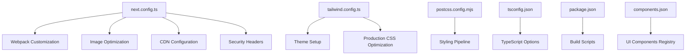
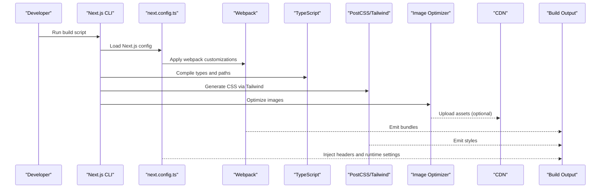
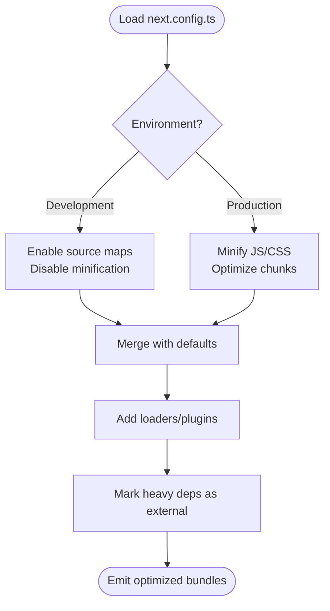
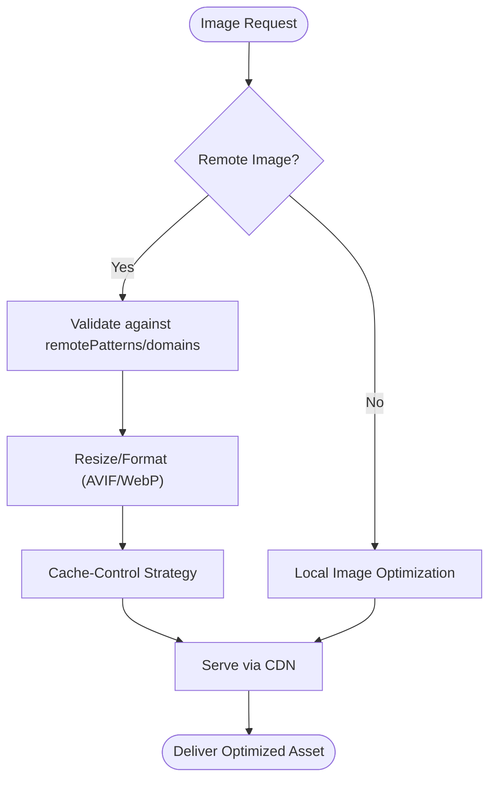
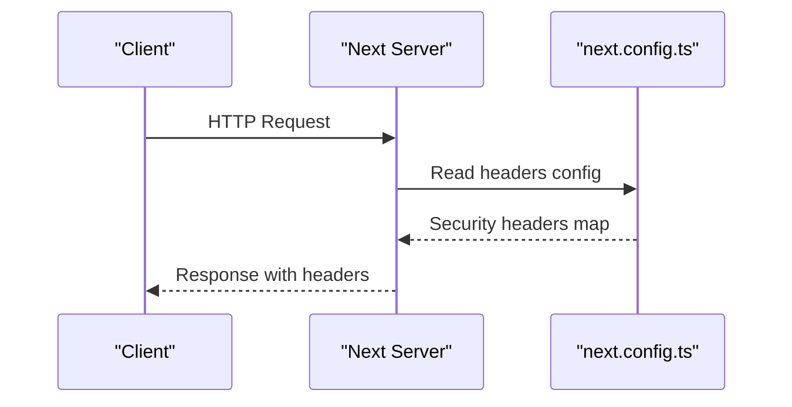
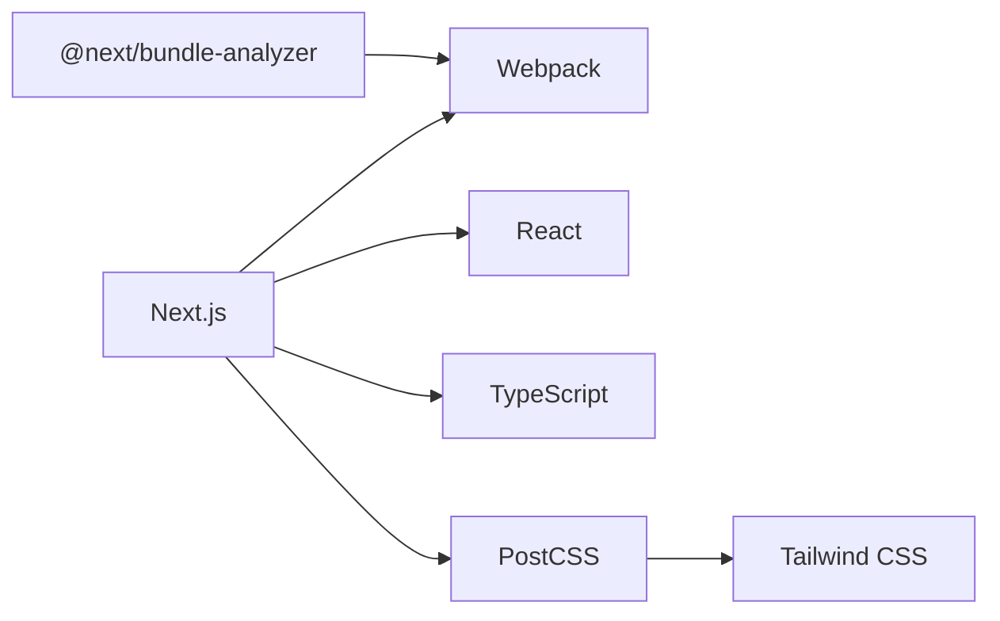

# Build Configuration

<cite>
**Referenced Files in This Document**
- [next.config.ts](file://next.config.ts)
- [tailwind.config.ts](file://tailwind.config.ts)
- [postcss.config.mjs](file://postcss.config.mjs)
- [tsconfig.json](file://tsconfig.json)
- [package.json](file://package.json)
- [components.json](file://components.json)
</cite>

## Table of Contents
1. [Introduction](#introduction)
2. [Project Structure](#project-structure)
3. [Core Components](#core-components)
4. [Architecture Overview](#architecture-overview)
5. [Detailed Component Analysis](#detailed-component-analysis)
6. [Dependency Analysis](#dependency-analysis)
7. [Performance Considerations](#performance-considerations)
8. [Troubleshooting Guide](#troubleshooting-guide)
9. [Conclusion](#conclusion)
10. [Appendices](#appendices)

## Introduction
This document explains the Next.js build configuration and optimization settings for the project. It focuses on next.config.ts (webpack customization, image optimization, CDN configuration, security headers), Tailwind CSS build configuration and production CSS optimization, TypeScript compiler options for production builds including path aliases and type checking strategies, PostCSS configuration for advanced styling pipelines, environment-specific build configurations, bundle analysis setup, and performance monitoring integration.

## Project Structure
The build-related configuration files are located at the repository root and include:
- next.config.ts: Next.js build and runtime configuration
- tailwind.config.ts: Tailwind CSS theme and plugin configuration
- postcss.config.mjs: PostCSS pipeline configuration
- tsconfig.json: TypeScript compiler options
- package.json: Scripts and dependencies related to building and analysis
- components.json: shadcn/ui component registry configuration used by the UI layer

[No sources needed since this diagram shows conceptual workflow, not actual code structure]

## Core Components
- Next.js build configuration: centralizes webpack overrides, image handling, CDN endpoints, and response headers.
- Tailwind CSS configuration: defines theme tokens, plugins, and purge/optimization behavior for production.
- PostCSS pipeline: orchestrates Tailwind processing, autoprefixing, and any additional transformations.
- TypeScript configuration: enforces strictness, enables path aliases, and controls incremental/type-checking behavior for production.
- Package scripts: define build, analyze, and dev commands; may integrate bundle analyzers and performance tooling.

**Section sources**
- [next.config.ts](file://next.config.ts)
- [tailwind.config.ts](file://tailwind.config.ts)
- [postcss.config.mjs](file://postcss.config.mjs)
- [tsconfig.json](file://tsconfig.json)
- [package.json](file://package.json)
- [components.json](file://components.json)

## Architecture Overview
The build pipeline integrates Next.js, Webpack, Tailwind, PostCSS, and TypeScript into a cohesive process:
- Source code is compiled by TypeScript and processed by Next.js.
- Styles are generated via Tailwind through PostCSS.
- Images are optimized and optionally served from a CDN.
- Security headers are injected at build/runtime.
- Optional bundle analysis and performance monitoring hooks are wired via scripts and config.

[No sources needed since this diagram shows conceptual workflow, not actual code structure]

## Detailed Component Analysis

### Next.js Build Configuration (next.config.ts)
Responsibilities:
- Webpack customization: add loaders/plugins, adjust module resolution, optimize splitting, and configure external dependencies.
- Image optimization: enable formats like AVIF/WebP, set sizes, cache control, and remote patterns.
- CDN configuration: define domains, private URLs, and caching behavior for images and static assets.
- Security headers: set CSP, X-Frame-Options, Referrer-Policy, and other headers for production responses.
- Environment-specific overrides: conditionally apply settings based on NODE_ENV or custom flags.

Key areas to review:
- Webpack rules and externals
- images.remotePatterns and domain allowlists
- headers middleware or serverHeaders
- experimental features toggles for performance

**Section sources**
- [next.config.ts](file://next.config.ts)

#### Webpack Customization Flow

**Section sources**
- [next.config.ts](file://next.config.ts)

#### Image Optimization and CDN Integration

**Section sources**
- [next.config.ts](file://next.config.ts)

#### Security Headers Injection

**Section sources**
- [next.config.ts](file://next.config.ts)

### Tailwind CSS Build Configuration (tailwind.config.ts)
Responsibilities:
- Theme setup: colors, spacing, typography, breakpoints, and custom design tokens.
- Content scanning: ensure only used classes are included in production.
- Plugins: integrate third-party utilities and custom extensions.
- Production CSS optimization: purge unused styles, minify output, and reduce bundle size.

Best practices:
- Use content globs scoped to app and components directories.
- Prefer dark mode strategy compatible with your provider.
- Keep theme values centralized and avoid inline arbitrary values where possible.

**Section sources**
- [tailwind.config.ts](file://tailwind.config.ts)

### PostCSS Configuration (postcss.config.mjs)
Responsibilities:
- Orchestrate Tailwind processing, autoprefixer, and optional plugins (e.g., cssnano).
- Ensure consistent CSS transformation across environments.
- Enable future-safe CSS features when appropriate.

Integration points:
- Tailwind plugin registration
- Autoprefixer browser targets
- Minification in production

**Section sources**
- [postcss.config.mjs](file://postcss.config.mjs)

### TypeScript Compiler Options (tsconfig.json)
Responsibilities:
- Strictness and type checking for production builds.
- Path aliases for cleaner imports.
- Incremental compilation and declaration generation.
- Module resolution and target compatibility.

Recommendations:
- Enable strict mode and noImplicitAny.
- Configure baseUrl and paths for aliases.
- Use skipLibCheck judiciously and prefer accurate typings.
- Separate development and production options if needed.

**Section sources**
- [tsconfig.json](file://tsconfig.json)

### Environment-Specific Build Configurations
Approaches:
- Conditional logic in next.config.ts based on NODE_ENV or custom env variables.
- Separate config fragments merged at runtime.
- Feature flags toggled per environment.

Considerations:
- Avoid leaking secrets into client bundles.
- Keep CDN endpoints and API base URLs configurable.
- Disable debug logs and verbose outputs in production.

**Section sources**
- [next.config.ts](file://next.config.ts)
- [package.json](file://package.json)

### Bundle Analysis Setup
Common integrations:
- @next/bundle-analyzer or webpack-bundle-analyzer via Next.js plugins.
- Analyze command in package.json scripts.
- CI-friendly reports uploaded or archived.

Typical flow:
- Build with analyzer enabled
- Generate report artifact
- Review large dependencies and chunk splits

**Section sources**
- [package.json](file://package.json)
- [next.config.ts](file://next.config.ts)

### Performance Monitoring Integration
Options:
- Next.js built-in metrics and telemetry (opt-in/out).
- Third-party RUM or APM SDKs integrated via providers or layout wrappers.
- Custom instrumentation around key routes and data fetching.

Guidelines:
- Instrument only in production or specific environments.
- Avoid blocking critical rendering paths.
- Aggregate and alert on regressions.

**Section sources**
- [next.config.ts](file://next.config.ts)
- [package.json](file://package.json)

### UI Components Registry (components.json)
Purpose:
- Defines shadcn/ui registry and component sourcing.
- Influences how UI primitives are installed and updated.

Impact on build:
- Ensures consistent component versions and themes.
- Integrates with Tailwind theme tokens for cohesive styling.

**Section sources**
- [components.json](file://components.json)

## Dependency Analysis
High-level relationships among build-time dependencies:
- Next.js depends on Webpack and React.
- Tailwind and PostCSS transform styles during build.
- TypeScript validates and compiles source before bundling.
- Optional analyzers hook into Webpack to inspect bundles.

[No sources needed since this diagram shows conceptual workflow, not actual code structure]

## Performance Considerations
- Enable image optimization and serve modern formats (AVIF/WebP).
- Configure CDN caching headers and edge delivery for static assets.
- Minimize bundle size by tree-shaking and lazy loading.
- Use code splitting and dynamic imports for heavy components.
- Purge unused CSS and avoid arbitrary values in Tailwind.
- Keep third-party libraries small and replace heavy ones where possible.
- Monitor core web vitals and track regressions in CI.

[No sources needed since this section provides general guidance]

## Troubleshooting Guide
Common issues and resolutions:
- Missing remote image domains: update remotePatterns or domains in image config.
- Unused CSS still present: verify Tailwind content globs and PostCSS pipeline.
- Type errors in production: ensure strict tsconfig and correct path aliases.
- Large bundles: run bundle analysis and split routes/components.
- Header misconfiguration: validate header names/values and environment scoping.

**Section sources**
- [next.config.ts](file://next.config.ts)
- [tailwind.config.ts](file://tailwind.config.ts)
- [postcss.config.mjs](file://postcss.config.mjs)
- [tsconfig.json](file://tsconfig.json)
- [package.json](file://package.json)

## Conclusion
A robust build configuration balances developer experience with production performance. Centralize settings in next.config.ts, keep Tailwind and PostCSS lean, enforce strict TypeScript checks, and instrument performance and bundle analysis. Use environment-specific overrides to tailor behavior per deployment stage while maintaining security and reliability.

[No sources needed since this section summarizes without analyzing specific files]

## Appendices

### Quick Reference: Where to Look
- Next.js build and runtime settings: [next.config.ts](file://next.config.ts)
- Tailwind theme and optimization: [tailwind.config.ts](file://tailwind.config.ts)
- PostCSS pipeline: [postcss.config.mjs](file://postcss.config.mjs)
- TypeScript options and aliases: [tsconfig.json](file://tsconfig.json)
- Build scripts and analyzers: [package.json](file://package.json)
- UI components registry: [components.json](file://components.json)