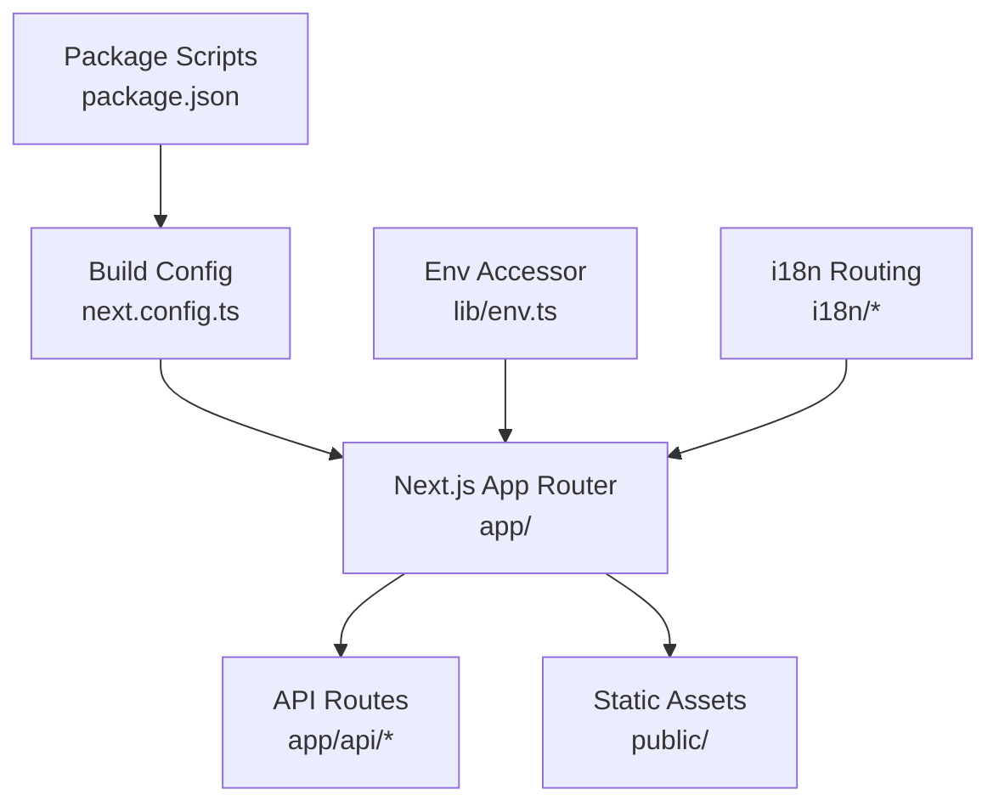
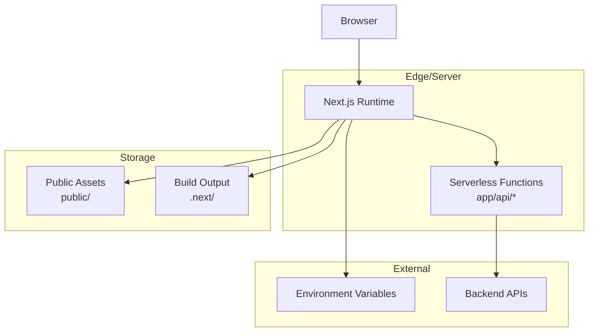
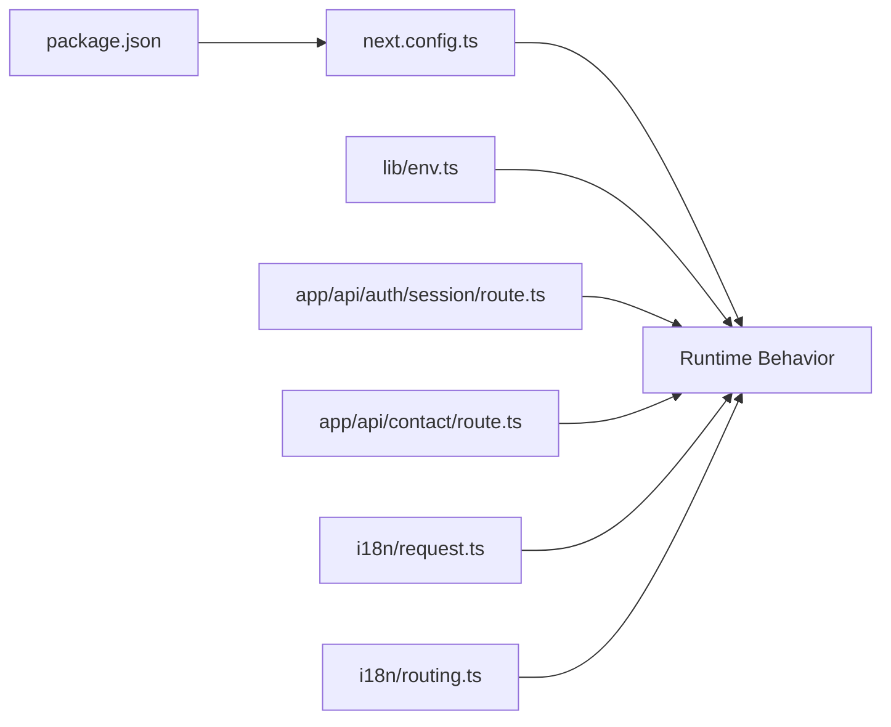

# Deployment Strategies

<cite>
**Referenced Files in This Document**
- [README.md](file://README.md)
- [package.json](file://package.json)
- [next.config.ts](file://next.config.ts)
- [proxy.ts](file://proxy.ts)
- [app/api/auth/session/route.ts](file://app/api/auth/session/route.ts)
- [app/api/contact/route.ts](file://app/api/contact/route.ts)
- [lib/env.ts](file://lib/env.ts)
- [i18n/request.ts](file://i18n/request.ts)
- [i18n/routing.ts](file://i18n/routing.ts)
</cite>

## Table of Contents
1. [Introduction](#introduction)
2. [Project Structure](#project-structure)
3. [Core Components](#core-components)
4. [Architecture Overview](#architecture-overview)
5. [Detailed Component Analysis](#detailed-component-analysis)
6. [Dependency Analysis](#dependency-analysis)
7. [Performance Considerations](#performance-considerations)
8. [Troubleshooting Guide](#troubleshooting-guide)
9. [Conclusion](#conclusion)
10. [Appendices](#appendices)

## Introduction
This document provides deployment strategies and platform-specific configurations for the project, focusing on:
- Vercel deployment with automatic CI/CD
- Docker containerization for traditional hosting
- Manual deployment processes
- Build artifacts and static asset handling
- Serverless function deployment
- Platform optimizations, domain configuration, SSL certificates, and CDN integration
- Step-by-step guides for popular platforms
- Rollback strategies and zero-downtime deployments
- Scaling considerations and load balancing setup

The project is a Next.js application with internationalization (i18n), API routes, and environment-driven configuration. It supports server-side rendering, static generation, and serverless functions via Next.js API routes.

## Project Structure
Key directories and files relevant to deployment:
- app/: Next.js App Router pages and API routes
- lib/env.ts: Environment variable accessors
- i18n/: Internationalization routing and request handling
- next.config.ts: Next.js build and runtime configuration
- package.json: Scripts and dependencies
- proxy.ts: Development proxy configuration
- public/: Static assets served by Next.js

**Diagram sources**
- [next.config.ts](file://next.config.ts)
- [package.json](file://package.json)
- [lib/env.ts](file://lib/env.ts)
- [i18n/request.ts](file://i18n/request.ts)
- [i18n/routing.ts](file://i18n/routing.ts)
- [app/api/auth/session/route.ts](file://app/api/auth/session/route.ts)
- [app/api/contact/route.ts](file://app/api/contact/route.ts)

**Section sources**
- [README.md](file://README.md)
- [package.json](file://package.json)
- [next.config.ts](file://next.config.ts)

## Core Components
- Build and runtime configuration:
  - next.config.ts defines Next.js behavior including output mode, rewrites, redirects, headers, and image optimization settings.
- Environment variables:
  - lib/env.ts centralizes environment variable access and validation for runtime and build-time values.
- API routes:
  - app/api/auth/session/route.ts handles authentication session endpoints.
  - app/api/contact/route.ts handles contact form submissions.
- Internationalization:
  - i18n/request.ts and i18n/routing.ts configure locale detection and routing.
- Proxying:
  - proxy.ts configures development proxy for backend APIs.

**Section sources**
- [next.config.ts](file://next.config.ts)
- [lib/env.ts](file://lib/env.ts)
- [app/api/auth/session/route.ts](file://app/api/auth/session/route.ts)
- [app/api/contact/route.ts](file://app/api/contact/route.ts)
- [i18n/request.ts](file://i18n/request.ts)
- [i18n/routing.ts](file://i18n/routing.ts)
- [proxy.ts](file://proxy.ts)

## Architecture Overview
High-level architecture for deployment:
- Client requests are handled by Next.js runtime.
- Static assets are served from the built output or CDN.
- API routes execute as serverless functions or Node.js handlers depending on the platform.
- Environment variables are injected at build or runtime based on platform capabilities.
- i18n routing ensures correct locale-based responses.

[No sources needed since this diagram shows conceptual workflow, not actual code structure]

## Detailed Component Analysis

### Vercel Deployment (Automatic CI/CD)
- Connect repository to Vercel; it auto-detects Next.js and builds using the configured scripts.
- Configure environment variables in Vercel dashboard or via .env files committed securely.
- Use framework preset “Next.js” for optimal caching and edge runtime support.
- Domain configuration and SSL are managed automatically by Vercel.
- Preview deployments are created per branch; production deploys on main/master.

Steps:
1. Install Vercel CLI or connect GitHub/GitLab/Bitbucket repo to Vercel.
2. Set required environment variables in Vercel project settings.
3. Add custom domains under Domains; enable HTTPS automatically.
4. Configure build settings if overriding defaults (e.g., output directory).
5. Deploy via UI or CLI; preview URLs available per PR.

Rollback and zero-downtime:
- Use Vercel’s rollback feature to revert to previous deployments.
- Zero-downtime is inherent due to atomic rollouts and preview environments.

Scaling and load balancing:
- Vercel scales serverless functions and edge network automatically.
- For high-throughput APIs, consider Edge Functions or external services.

**Section sources**
- [package.json](file://package.json)
- [next.config.ts](file://next.config.ts)
- [lib/env.ts](file://lib/env.ts)

### Docker Containerization (Traditional Hosting)
- Create a multi-stage Dockerfile to build Next.js and produce a minimal runtime image.
- Stage 1: Install dependencies and build the app.
- Stage 2: Run only the production build output.
- Expose port 3000 and set environment variables at runtime.

Steps:
1. Write Dockerfile with build and runtime stages.
2. Build image locally: docker build -t automex-frontend .
3. Run container: docker run -p 3000:3000 --env-file .env.production automex-frontend
4. Push image to registry and deploy to Kubernetes, ECS, or other orchestrators.

Optimizations:
- Enable Next.js output standalone for smaller images.
- Use .dockerignore to exclude dev dependencies and unnecessary files.
- Cache layers by copying package.json and lock file first.

Domain and SSL:
- Place a reverse proxy (Nginx/Traefik) in front of the container to handle TLS termination and CDN integration.

Rollback:
- Tag images semantically and redeploy previous tags.
- Use orchestration tools’ rollout history and rollback commands.

Scaling and load balancing:
- Orchestrate multiple replicas behind a load balancer.
- Horizontal scaling via orchestrator autoscaling policies.

**Section sources**
- [next.config.ts](file://next.config.ts)
- [package.json](file://package.json)

### Manual Deployment Processes
- Build locally or in CI: npm ci && npm run build
- Upload build artifacts (.next/, public/) to your hosting provider.
- Serve static assets via a web server or CDN.
- Configure environment variables on the host.
- Start the Next.js server: npm start

Steps:
1. Ensure all required environment variables are present.
2. Build the app and verify output.
3. Deploy artifacts to target servers or object storage.
4. Configure reverse proxy for TLS and path-based routing.
5. Monitor logs and health checks.

Rollback:
- Keep previous artifact versions and switch symlinks or paths atomically.

Scaling:
- Run multiple instances behind a load balancer.
- Use CDN for static assets and cache invalidation strategies.

**Section sources**
- [package.json](file://package.json)
- [next.config.ts](file://next.config.ts)

### Build Artifacts and Static Asset Handling
- Build output includes .next/ with server bundles and generated pages.
- Static assets in public/ are served directly by Next.js or CDN.
- Image optimization can be configured via next.config.ts for performance.

Recommendations:
- Use CDN for public assets to reduce origin load.
- Configure cache headers for long-lived immutable assets.
- Validate image formats and sizes to optimize delivery.

**Section sources**
- [next.config.ts](file://next.config.ts)

### Serverless Function Deployment
- API routes under app/api/* are deployed as serverless functions on supported platforms.
- Ensure environment variables are available at runtime.
- Optimize function size by excluding dev dependencies and unused modules.

Best practices:
- Keep functions small and stateless.
- Use streaming responses for large payloads.
- Implement retries and timeouts for external calls.

**Section sources**
- [app/api/auth/session/route.ts](file://app/api/auth/session/route.ts)
- [app/api/contact/route.ts](file://app/api/contact/route.ts)
- [lib/env.ts](file://lib/env.ts)

### Platform-Specific Optimizations
- Vercel:
  - Leverage Edge Runtime where applicable.
  - Use incremental static regeneration for dynamic content.
  - Configure rewrites and redirects in next.config.ts.
- Traditional hosting:
  - Use process managers (PM2) for resilience.
  - Enable gzip/brotli compression at the reverse proxy.
  - Tune worker threads and memory limits.

**Section sources**
- [next.config.ts](file://next.config.ts)

### Domain Configuration, SSL Certificates, and CDN Integration
- Vercel:
  - Add custom domains; HTTPS enabled automatically.
  - Configure DNS records as instructed by Vercel.
- Traditional hosting:
  - Use Let’s Encrypt via certbot or ACME client.
  - Terminate TLS at reverse proxy and forward to Next.js.
- CDN:
  - Integrate Cloudflare or similar for caching and security.
  - Configure cache rules for static assets and API responses.

**Section sources**
- [next.config.ts](file://next.config.ts)

### Step-by-Step Deployment Guides

#### Vercel
1. Connect repository to Vercel.
2. Select Next.js framework preset.
3. Add environment variables in Dashboard.
4. Configure domains and enable HTTPS.
5. Deploy and monitor via Vercel dashboard.

**Section sources**
- [package.json](file://package.json)
- [next.config.ts](file://next.config.ts)

#### Docker + Kubernetes
1. Build Docker image with multi-stage Dockerfile.
2. Push image to container registry.
3. Define Deployment and Service manifests.
4. Apply manifests to cluster.
5. Configure Ingress for TLS and domain routing.

**Section sources**
- [next.config.ts](file://next.config.ts)
- [package.json](file://package.json)

#### Traditional Hosting (VPS/PaaS)
1. Provision server and install Node.js.
2. Clone repository and install dependencies.
3. Build app and start server with PM2.
4. Configure Nginx for TLS and reverse proxy.
5. Set up monitoring and log rotation.

**Section sources**
- [package.json](file://package.json)
- [next.config.ts](file://next.config.ts)

### Rollback Strategies
- Vercel:
  - Use “Rollback” from deployment history.
- Docker/Kubernetes:
  - Re-deploy previous image tag.
  - Use rollout undo commands.
- Traditional hosting:
  - Switch symlink to previous artifact version.
  - Restart service after switching.

**Section sources**
- [package.json](file://package.json)

### Zero-Downtime Deployment Techniques
- Blue-green deployments:
  - Maintain two identical environments; switch traffic after verification.
- Canary releases:
  - Gradually route a percentage of traffic to new version.
- Rolling updates:
  - Update instances one by one while maintaining capacity.

**Section sources**
- [next.config.ts](file://next.config.ts)

### Scaling Considerations and Load Balancing Setup
- Horizontal scaling:
  - Increase number of instances behind a load balancer.
- Vertical scaling:
  - Allocate more CPU/memory to instances.
- CDN offloading:
  - Serve static assets and cache API responses where safe.
- Database and external services:
  - Use connection pooling and rate limiting.

**Section sources**
- [next.config.ts](file://next.config.ts)

## Dependency Analysis
Key dependencies impacting deployment:
- Next.js runtime and build toolchain
- Environment variable management
- API route handlers
- Internationalization routing

**Diagram sources**
- [package.json](file://package.json)
- [next.config.ts](file://next.config.ts)
- [lib/env.ts](file://lib/env.ts)
- [app/api/auth/session/route.ts](file://app/api/auth/session/route.ts)
- [app/api/contact/route.ts](file://app/api/contact/route.ts)
- [i18n/request.ts](file://i18n/request.ts)
- [i18n/routing.ts](file://i18n/routing.ts)

**Section sources**
- [package.json](file://package.json)
- [next.config.ts](file://next.config.ts)
- [lib/env.ts](file://lib/env.ts)
- [app/api/auth/session/route.ts](file://app/api/auth/session/route.ts)
- [app/api/contact/route.ts](file://app/api/contact/route.ts)
- [i18n/request.ts](file://i18n/request.ts)
- [i18n/routing.ts](file://i18n/routing.ts)

## Performance Considerations
- Enable image optimization and configure remote patterns.
- Use CDN for static assets and leverage browser caching.
- Minimize serverless function payload and cold starts.
- Implement proper cache-control headers for API responses.
- Monitor performance metrics and adjust resource allocation.

[No sources needed since this section provides general guidance]

## Troubleshooting Guide
Common issues and resolutions:
- Missing environment variables:
  - Verify variables are set in platform dashboard or .env files.
- API route failures:
  - Check logs for errors and validate external service connectivity.
- Build errors:
  - Review dependency versions and Node.js compatibility.
- i18n routing problems:
  - Confirm locale configuration and request handling.

**Section sources**
- [lib/env.ts](file://lib/env.ts)
- [app/api/auth/session/route.ts](file://app/api/auth/session/route.ts)
- [app/api/contact/route.ts](file://app/api/contact/route.ts)
- [i18n/request.ts](file://i18n/request.ts)
- [i18n/routing.ts](file://i18n/routing.ts)

## Conclusion
This document outlines deployment strategies across Vercel, Docker, and traditional hosting, covering build artifacts, static assets, serverless functions, platform optimizations, domain and SSL setup, CDN integration, step-by-step guides, rollback techniques, zero-downtime deployments, and scaling considerations. Tailor configurations to your platform’s capabilities and monitor performance continuously.

[No sources needed since this section summarizes without analyzing specific files]

## Appendices

### Environment Variables Checklist
- Backend API base URL
- Authentication secrets
- Email service credentials
- Analytics keys
- Feature flags

**Section sources**
- [lib/env.ts](file://lib/env.ts)

### Development Proxy Configuration
- Use proxy.ts to forward API requests during development.
- Ensure local environment matches production variables.

**Section sources**
- [proxy.ts](file://proxy.ts)