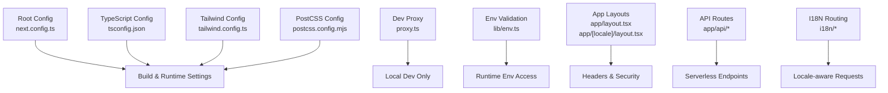
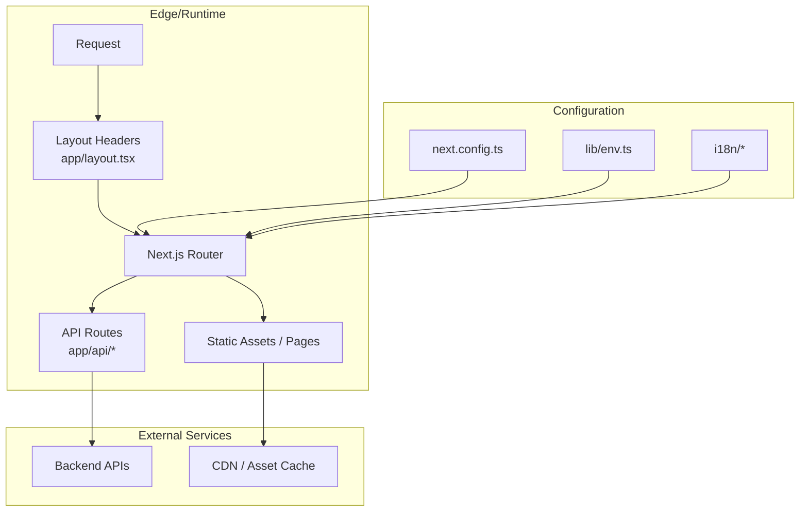
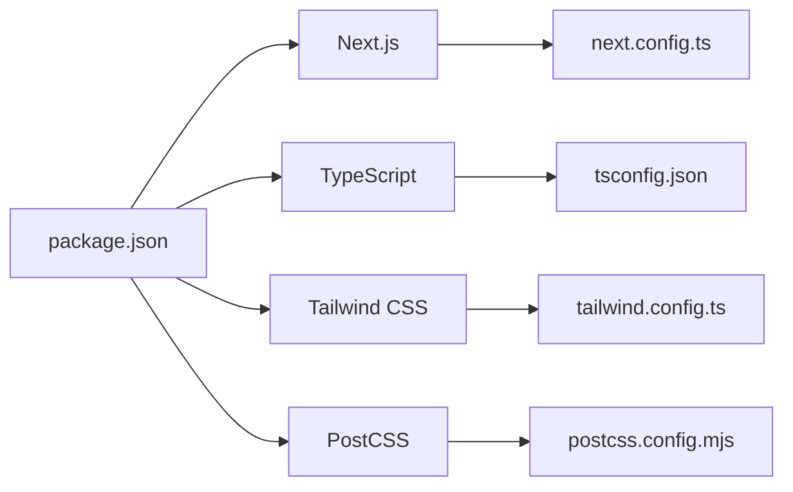

# Deployment and Production

<cite>
**Referenced Files in This Document**
- [next.config.ts](file://next.config.ts)
- [package.json](file://package.json)
- [tsconfig.json](file://tsconfig.json)
- [tailwind.config.ts](file://tailwind.config.ts)
- [postcss.config.mjs](file://postcss.config.mjs)
- [proxy.ts](file://proxy.ts)
- [lib/env.ts](file://lib/env.ts)
- [app/layout.tsx](file://app/layout.tsx)
- [app/[locale]/layout.tsx](file://app/[locale]/layout.tsx)
- [app/api/auth/session/route.ts](file://app/api/auth/session/route.ts)
- [app/api/contact/route.ts](file://app/api/contact/route.ts)
- [i18n/request.ts](file://i18n/request.ts)
- [i18n/routing.ts](file://i18n/routing.ts)
- [components.json](file://components.json)
</cite>

## Table of Contents
1. [Introduction](#introduction)
2. [Project Structure](#project-structure)
3. [Core Components](#core-components)
4. [Architecture Overview](#architecture-overview)
5. [Detailed Component Analysis](#detailed-component-analysis)
6. [Dependency Analysis](#dependency-analysis)
7. [Performance Considerations](#performance-considerations)
8. [Troubleshooting Guide](#troubleshooting-guide)
9. [Conclusion](#conclusion)
10. [Appendices](#appendices)

## Introduction
This document provides comprehensive guidance for deploying and operating the Next.js application in production. It covers build configuration, environment variable management, platform-specific deployment strategies (Vercel, Docker, traditional hosting), security headers, asset optimization, CI/CD pipelines, automated testing, monitoring, performance tuning, error tracking, backups, and disaster recovery. The goal is to help teams ship reliably and maintain high availability with clear operational procedures.

## Project Structure
The repository follows a modern Next.js App Router layout with internationalization, API routes, shared components, and configuration files at the root. Key areas relevant to deployment include:
- Build and runtime configuration at the project root
- Environment validation utilities
- Internationalization routing and request handling
- API route handlers for authentication and contact endpoints
- Static assets under public

**Diagram sources**
- [next.config.ts](file://next.config.ts)
- [tsconfig.json](file://tsconfig.json)
- [tailwind.config.ts](file://tailwind.config.ts)
- [postcss.config.mjs](file://postcss.config.mjs)
- [proxy.ts](file://proxy.ts)
- [lib/env.ts](file://lib/env.ts)
- [app/layout.tsx](file://app/layout.tsx)
- [app/[locale]/layout.tsx](file://app/[locale]/layout.tsx)
- [app/api/auth/session/route.ts](file://app/api/auth/session/route.ts)
- [app/api/contact/route.ts](file://app/api/contact/route.ts)
- [i18n/request.ts](file://i18n/request.ts)
- [i18n/routing.ts](file://i18n/routing.ts)

**Section sources**
- [next.config.ts](file://next.config.ts)
- [package.json](file://package.json)
- [tsconfig.json](file://tsconfig.json)
- [tailwind.config.ts](file://tailwind.config.ts)
- [postcss.config.mjs](file://postcss.config.mjs)
- [proxy.ts](file://proxy.ts)
- [lib/env.ts](file://lib/env.ts)
- [app/layout.tsx](file://app/layout.tsx)
- [app/[locale]/layout.tsx](file://app/[locale]/layout.tsx)
- [app/api/auth/session/route.ts](file://app/api/auth/session/route.ts)
- [app/api/contact/route.ts](file://app/api/contact/route.ts)
- [i18n/request.ts](file://i18n/request.ts)
- [i18n/routing.ts](file://i18n/routing.ts)

## Core Components
- Build and runtime configuration: Centralized in the Next.js config file to control output format, redirects, rewrites, headers, images, and other optimizations.
- Environment validation: A dedicated module validates required environment variables at startup to fail fast on misconfiguration.
- Internationalization routing: Request and routing modules handle locale detection and URL structure.
- API routes: Server-side endpoints for session and contact functionality.
- UI and theme configuration: Tailwind and component library settings influence build size and runtime behavior.

**Section sources**
- [next.config.ts](file://next.config.ts)
- [lib/env.ts](file://lib/env.ts)
- [i18n/request.ts](file://i18n/request.ts)
- [i18n/routing.ts](file://i18n/routing.ts)
- [app/api/auth/session/route.ts](file://app/api/auth/session/route.ts)
- [app/api/contact/route.ts](file://app/api/contact/route.ts)
- [tailwind.config.ts](file://tailwind.config.ts)
- [components.json](file://components.json)

## Architecture Overview
The application runs as a Next.js serverless or Node.js app depending on the target platform. In production, it serves static assets, renders pages via SSR/SSG where applicable, and exposes API routes as serverless functions. Security headers are applied globally through layout-level logic, while environment variables are validated before runtime.

**Diagram sources**
- [next.config.ts](file://next.config.ts)
- [lib/env.ts](file://lib/env.ts)
- [app/layout.tsx](file://app/layout.tsx)
- [app/api/auth/session/route.ts](file://app/api/auth/session/route.ts)
- [app/api/contact/route.ts](file://app/api/contact/route.ts)
- [i18n/request.ts](file://i18n/request.ts)
- [i18n/routing.ts](file://i18n/routing.ts)

## Detailed Component Analysis

### Build Configuration and Optimizations
- Output and runtime mode: Configure whether to produce standalone artifacts or standard builds based on deployment target.
- Image optimization: Enable remote patterns and formats suitable for production CDNs.
- Redirects and rewrites: Define canonical URLs, SEO-friendly paths, and legacy route mappings.
- Headers: Set global security headers such as content security policy, strict transport security, and frame options.
- Experimental features: Enable only necessary flags to reduce bundle size and improve cold starts.

Practical steps:
- Review and adjust image domains and allowed formats.
- Add production-only redirects and rewrites.
- Apply security headers at the framework level.

**Section sources**
- [next.config.ts](file://next.config.ts)

### Environment Variable Management
- Validation at startup: Ensure all required variables exist and conform to expected types.
- Separation by environment: Use distinct sets for development, staging, and production.
- Secret rotation: Plan for rotating secrets without downtime by supporting multiple keys and graceful fallbacks.
- Client-safe exposure: Avoid exposing sensitive variables to the browser; use server-only access patterns.

Operational checklist:
- Validate presence of database URLs, OAuth client IDs/secrets, SMTP credentials, and third-party API keys.
- Enforce minimum versions for critical dependencies via env checks if needed.
- Log missing variables during build/startup to fail fast.

**Section sources**
- [lib/env.ts](file://lib/env.ts)

### Internationalization and Routing
- Locale detection: Determine language from URL path, cookies, or headers.
- Route structure: Maintain consistent URL patterns per locale.
- Request-time resolution: Ensure i18n modules run efficiently in serverless environments.

Deployment considerations:
- Pre-render localized pages where possible.
- Keep message bundles small and tree-shake unused locales.

**Section sources**
- [i18n/request.ts](file://i18n/request.ts)
- [i18n/routing.ts](file://i18n/routing.ts)

### API Routes and Session Handling
- Authentication session endpoint: Provides current session state to clients.
- Contact endpoint: Handles form submissions securely with rate limiting and input validation.

Security recommendations:
- Validate and sanitize inputs.
- Enforce HTTPS and secure cookies.
- Implement CSRF protection where applicable.
- Rate limit endpoints to prevent abuse.

**Section sources**
- [app/api/auth/session/route.ts](file://app/api/auth/session/route.ts)
- [app/api/contact/route.ts](file://app/api/contact/route.ts)

### Global Layout and Security Headers
- Apply security headers globally in the root layout.
- Configure Content-Security-Policy, Referrer-Policy, Permissions-Policy, and X-Frame-Options.
- Ensure CSP allows only trusted sources for scripts, styles, and media.

Operational tips:
- Start with a report-only CSP in non-production to avoid breaking changes.
- Monitor CSP violations and iterate.

**Section sources**
- [app/layout.tsx](file://app/layout.tsx)
- [app/[locale]/layout.tsx](file://app/[locale]/layout.tsx)

### Styling and Asset Pipeline
- Tailwind configuration: Purge unused styles in production to minimize CSS size.
- PostCSS pipeline: Ensure minification and autoprefixing are enabled.
- Component library settings: Control which UI primitives are included to reduce bundle size.

Optimization actions:
- Remove dev-only plugins and debug flags.
- Prefer dynamic imports for heavy components.

**Section sources**
- [tailwind.config.ts](file://tailwind.config.ts)
- [postcss.config.mjs](file://postcss.config.mjs)
- [components.json](file://components.json)

## Dependency Analysis
Key runtime and build dependencies include Next.js, TypeScript, Tailwind CSS, PostCSS, and any third-party integrations used in API routes and environment validation.

**Diagram sources**
- [package.json](file://package.json)
- [next.config.ts](file://next.config.ts)
- [tsconfig.json](file://tsconfig.json)
- [tailwind.config.ts](file://tailwind.config.ts)
- [postcss.config.mjs](file://postcss.config.mjs)

**Section sources**
- [package.json](file://package.json)
- [next.config.ts](file://next.config.ts)
- [tsconfig.json](file://tsconfig.json)
- [tailwind.config.ts](file://tailwind.config.ts)
- [postcss.config.mjs](file://postcss.config.mjs)

## Performance Considerations
- Build-time optimizations:
  - Enable incremental static regeneration where appropriate.
  - Minimize client-side JavaScript by code splitting and lazy loading.
  - Use next/image with proper formats and sizes.
- Runtime optimizations:
  - Leverage caching headers for static assets.
  - Use edge caching for API responses when safe.
  - Reduce payload sizes by removing unused locales and features.
- Monitoring:
  - Track Time to First Byte, Largest Contentful Paint, and Cumulative Layout Shift.
  - Instrument API latency and error rates.

[No sources needed since this section provides general guidance]

## Troubleshooting Guide
Common issues and resolutions:
- Missing environment variables: Fail-fast validation will surface missing keys early; ensure your deployment platform injects correct values.
- CSP violations: Switch to report-only mode temporarily and review violation reports to refine policies.
- API failures: Check upstream service health, timeouts, and rate limits; add retries with backoff where safe.
- Hydration mismatches: Verify that server and client render identical markup; avoid browser-only APIs during initial render.

Operational checks:
- Health check endpoints for readiness and liveness.
- Structured logging with correlation IDs.
- Rollback strategy using immutable artifacts.

**Section sources**
- [lib/env.ts](file://lib/env.ts)
- [app/layout.tsx](file://app/layout.tsx)
- [app/api/auth/session/route.ts](file://app/api/auth/session/route.ts)
- [app/api/contact/route.ts](file://app/api/contact/route.ts)

## Conclusion
By centralizing configuration, validating environment variables, applying robust security headers, and optimizing assets, the application can be deployed confidently across platforms. Adopting CI/CD automation, observability, and disciplined rollback procedures ensures reliability and rapid recovery in production.

[No sources needed since this section summarizes without analyzing specific files]

## Appendices

### Platform-Specific Deployment Strategies

#### Vercel
- Connect repository and configure environment variables in the dashboard.
- Use framework preset for Next.js; enable automatic preview deployments.
- Set up custom domains and SSL; leverage Edge Functions if needed.
- Configure redirects and headers via the Next.js config or Vercel UI.

[No sources needed since this section provides general guidance]

#### Docker Containers
- Create a multi-stage Dockerfile:
  - Stage 1: Install dependencies and build the Next.js app.
  - Stage 2: Run a minimal Node.js image with the built output.
- Expose the HTTP port and set required environment variables.
- Use orchestration tools (Kubernetes, ECS) for scaling and rolling updates.

[No sources needed since this section provides general guidance]

#### Traditional Hosting (Node.js Server)
- Build the app and start the Node.js server.
- Place a reverse proxy (Nginx/Caddy) in front to handle TLS, caching, and security headers.
- Manage process lifecycle with systemd or a process manager like PM2.

[No sources needed since this section provides general guidance]

### CI/CD Pipeline Example
- Stages:
  - Install dependencies and lint/type-check.
  - Run unit and integration tests.
  - Build the app and generate artifacts.
  - Deploy to staging with smoke tests.
  - Promote to production after approval gates.
- Secrets:
  - Store secrets in CI secret store; never commit to repo.
- Artifacts:
  - Publish immutable build artifacts for rollback.

[No sources needed since this section provides general guidance]

### Automated Testing in Production
- Smoke tests against production endpoints.
- Synthetic transactions for critical user flows.
- Feature flag toggles for gradual rollouts.

[No sources needed since this section provides general guidance]

### Monitoring and Error Tracking
- Metrics:
  - Application metrics (CPU, memory, request rate, latency).
  - Business KPIs (form submissions, sign-ups).
- Logging:
  - Centralized structured logs with levels and correlation IDs.
- Error tracking:
  - Integrate an error reporting service to capture stack traces and context.
- Alerting:
  - Define thresholds and notify on-call channels.

[No sources needed since this section provides general guidance]

### Security Headers Setup
- Recommended headers:
  - Strict-Transport-Security
  - Content-Security-Policy (report-only initially)
  - X-Content-Type-Options: nosniff
  - X-Frame-Options: DENY or SAMEORIGIN
  - Referrer-Policy: strict-origin-when-cross-origin
  - Permissions-Policy: restrict unnecessary features
- Implementation:
  - Apply via Next.js headers configuration or reverse proxy.

**Section sources**
- [next.config.ts](file://next.config.ts)
- [app/layout.tsx](file://app/layout.tsx)

### Asset Optimization Checklist
- Images:
  - Use next/image with optimized formats and responsive sizes.
  - Configure remotePatterns for external domains.
- Fonts:
  - Subset fonts and preload critical ones.
- Scripts and Styles:
  - Tree-shake unused code; remove dev-only libraries.
  - Minify CSS and JS in production.

**Section sources**
- [next.config.ts](file://next.config.ts)
- [tailwind.config.ts](file://tailwind.config.ts)
- [postcss.config.mjs](file://postcss.config.mjs)

### Backup and Disaster Recovery
- Backups:
  - Regular snapshots of databases and object storage.
  - Versioned artifact retention for rollbacks.
- Recovery:
  - Document runbooks for common failure scenarios.
  - Test restore procedures periodically.
- High Availability:
  - Multi-region deployments with DNS-based failover.
  - Graceful degradation for non-critical features.

[No sources needed since this section provides general guidance]

### Local Development Proxy
- Use the provided proxy configuration to forward requests to backend services during development.
- Ensure proxy rules do not leak into production builds.

**Section sources**
- [proxy.ts](file://proxy.ts)